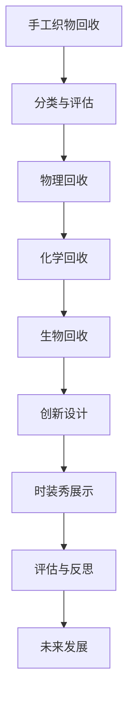

                 

### 《现代手工织物回收时装秀：旧衣新造的可持续时尚展示》

**关键词：** 手工织物回收、时装秀、可持续时尚、旧衣新造、环保时尚

**摘要：** 本文将探讨现代手工织物回收时装秀的背景、意义、设计原则、技术方法、组织实施以及评估与反思，旨在展示如何通过旧衣新造实现可持续时尚的变革。通过对手工织物回收时装秀的全方位解析，本文将为读者提供关于这一新兴时尚趋势的深入了解。

### 目录大纲

## 《现代手工织物回收时装秀：旧衣新造的可持续时尚展示》

### 第一部分：引言与概述

### 第1章：现代手工织物回收时装秀的背景与意义

### 第2章：手工织物回收时装秀的设计原则与理念

### 第二部分：手工织物回收的技术与方法

### 第3章：手工织物的分类与评估

### 第4章：手工织物的回收处理技术

### 第5章：手工织物的创新设计与应用

### 第三部分：手工织物回收时装秀的组织与实施

### 第6章：手工织物回收时装秀的组织策划

### 第7章：手工织物回收时装秀的执行与展示

### 第8章：手工织物回收时装秀的评估与反思

### 附录

### 参考文献

## 正文内容

### 第一部分：引言与概述

#### 第1章：现代手工织物回收时装秀的背景与意义

##### 1.1 现代手工织物回收时装秀的起源与发展

##### 1.2 旧衣新造在可持续时尚中的重要性

##### 1.3 现代手工织物回收时装秀的目标与挑战

#### 第2章：手工织物回收时装秀的设计原则与理念

##### 2.1 可持续时尚的设计原则

##### 2.2 手工织物的回收与再利用

##### 2.3 时装秀的展示形式与内容设计

### 第二部分：手工织物回收的技术与方法

#### 第3章：手工织物的分类与评估

##### 3.1 手工织物的种类与特点

##### 3.2 手工织物的质量评估

##### 3.3 手工织物的回收价值评估

#### 第4章：手工织物的回收处理技术

##### 4.1 手工织物的物理回收方法

##### 4.2 手工织物的化学回收方法

##### 4.3 手工织物的生物回收方法

#### 第5章：手工织物的创新设计与应用

##### 5.1 手工织物的创新设计思路

##### 5.2 手工织物在时装设计中的应用

##### 5.3 手工织物在配饰设计中的应用

### 第三部分：手工织物回收时装秀的组织与实施

#### 第6章：手工织物回收时装秀的组织策划

##### 6.1 时装秀的主题与定位

##### 6.2 时装秀的筹备工作

##### 6.3 时装秀的宣传与推广

#### 第7章：手工织物回收时装秀的执行与展示

##### 7.1 时装秀的现场布置与展示

##### 7.2 时装秀的模特选拔与培训

##### 7.3 时装秀的拍摄与剪辑

#### 第8章：手工织物回收时装秀的评估与反思

##### 8.1 时装秀的成果评估

##### 8.2 时装秀的经验与教训

##### 8.3 未来手工织物回收时装秀的发展方向

### 附录

#### 附录A：手工织物回收时装秀案例选编

#### 附录B：手工织物回收时装秀资源链接

#### 附录C：手工织物回收相关术语解释

### 参考文献

#### 参考文献1：XXX

#### 参考文献2：XXX

#### 参考文献3：XXX

### Mermaid 流程图

### 第一部分：引言与概述

#### 第1章：现代手工织物回收时装秀的背景与意义

随着全球时尚产业的快速发展，人们对于时尚的需求与日俱增。然而，这一需求背后却隐藏着环境污染和资源浪费的问题。据统计，每年全球时尚产业产生的废弃物高达数百万吨，其中大部分为纺织废料。传统纺织产业通常采用化学合成纤维，这些材料不易降解，对环境造成了长期的负面影响。因此，如何实现可持续时尚成为了一个亟待解决的问题。

在这个背景下，现代手工织物回收时装秀应运而生。这一时尚趋势旨在通过回收和再利用旧衣，减少纺织废料的产生，降低对环境的影响。手工织物回收时装秀不仅是一种环保行动，更是对传统时尚理念的一种颠覆和挑战。

##### 1.1 现代手工织物回收时装秀的起源与发展

手工织物回收时装秀的起源可以追溯到上世纪80年代的环保运动。当时，一些环保主义者开始提倡通过回收旧衣物来减少环境污染。到了90年代，这一理念逐渐得到时尚界的关注。一些设计师开始尝试将旧衣物改造为新的时尚单品，并以此举办时装秀。这些时装秀不仅展示了设计师的创意，更传递了可持续时尚的理念。

进入21世纪，随着环保意识的不断提升，手工织物回收时装秀得到了更广泛的认可和推广。许多国际时装周都设立了专门的环节来展示手工织物回收时装秀。这一趋势不仅在发达国家得到了广泛传播，也在发展中国家逐渐兴起。

##### 1.2 旧衣新造在可持续时尚中的重要性

旧衣新造是可持续时尚的重要组成部分。通过回收和再利用旧衣物，可以减少对新衣物的需求，从而降低纺织产业对环境的压力。此外，旧衣新造还可以减少纺织废料的产生，降低对自然资源的消耗。

从环保角度来看，旧衣新造具有显著的优势。首先，回收和再利用旧衣物可以减少垃圾填埋和焚烧的数量，降低温室气体排放。其次，通过手工织物回收，可以减少对化学合成纤维的依赖，从而降低对环境的污染。

从经济角度来看，旧衣新造也为时尚产业带来了新的商机。通过将旧衣物改造为新的时尚单品，设计师可以创造独特的风格和品牌形象，吸引更多消费者的关注。此外，旧衣新造还可以降低生产成本，提高经济效益。

##### 1.3 现代手工织物回收时装秀的目标与挑战

现代手工织物回收时装秀的目标是推动可持续时尚的发展，减少纺织废料的产生，降低对环境的负面影响。为了实现这一目标，手工织物回收时装秀需要在以下几个方面做出努力：

1. **提高公众环保意识**：通过时装秀的形式，向公众传播环保理念，提高人们对可持续时尚的认识和接受程度。
2. **推动技术创新**：在手工织物回收和处理技术方面进行创新，提高回收效率和质量，降低成本。
3. **促进产业合作**：鼓励纺织产业上下游企业合作，共同推动可持续时尚的发展。

然而，现代手工织物回收时装秀也面临着一些挑战。首先，手工织物回收和处理技术尚不成熟，需要进一步研究和改进。其次，旧衣物回收和处理的成本较高，需要寻找更经济高效的解决方案。此外，消费者对旧衣新造产品的接受度也是一个需要克服的难题。

总之，现代手工织物回收时装秀是可持续时尚发展的重要途径。通过这一形式，我们可以将旧衣物转化为新的时尚单品，减少环境污染，推动时尚产业的可持续发展。

### 第2章：手工织物回收时装秀的设计原则与理念

手工织物回收时装秀的设计原则与理念是确保时装秀环保、创新和有吸引力的关键。以下将详细介绍这些原则和理念，并探讨如何通过这些设计原则和理念实现可持续时尚的目标。

##### 2.1 可持续时尚的设计原则

可持续时尚的设计原则强调环保、节能和资源的可持续利用。以下是一些核心原则：

1. **环保材料**：选择环保材料是可持续时尚设计的基础。手工织物回收时装秀应优先使用天然纤维和可降解材料，如棉、麻、丝等。这些材料不仅环保，还具有独特的质感和风格。

2. **减少浪费**：在设计和制作过程中，要尽量减少浪费。这可以通过精细的裁剪、优化设计图纸和使用零头布料来实现。

3. **多功能设计**：设计多功能服装，使消费者能够以多种方式穿着和搭配，延长服装的使用寿命。

4. **可回收性**：设计时考虑到服装的回收和处理过程，使用易于分解的材料和易于拆解的结构。

5. **环保工艺**：采用环保的染料和加工工艺，减少对环境的污染。

##### 2.2 手工织物的回收与再利用

手工织物的回收与再利用是手工织物回收时装秀的核心。以下是一些关键点：

1. **回收流程**：首先，对旧衣物进行分类和评估，确定其可回收价值。然后，通过物理、化学或生物方法对旧衣物进行回收处理。物理方法包括清洗、剪裁和重新编织；化学方法包括分解纤维和再生纤维；生物方法包括使用微生物降解纤维。

2. **创新设计**：在回收处理的基础上，设计师可以发挥创意，将旧衣物转化为新的时尚单品。这可以包括重新设计服装款式、拼接不同的织物、制作独特的配饰等。

3. **文化传承**：在手工织物回收时装秀中，可以融入当地的传统手工艺和文化元素，使服装更具特色和故事性。

##### 2.3 时装秀的展示形式与内容设计

时装秀的展示形式与内容设计对于传达可持续时尚理念至关重要。以下是一些设计要点：

1. **舞台设计**：舞台设计应体现环保主题，使用可回收材料装饰舞台，减少浪费。

2. **服装展示**：服装展示应突出旧衣新造的特点，展示服装的改造过程和设计灵感。

3. **模特表演**：模特应表现出对旧衣新造的自信和魅力，传达可持续时尚的理念。

4. **灯光和音乐**：使用环保的灯光和音乐，增强时装秀的艺术氛围。

5. **互动环节**：在时装秀中加入互动环节，如现场访谈、环保活动等，吸引观众的参与和关注。

##### 2.4 手工织物回收时装秀的社会价值

手工织物回收时装秀不仅是一种时尚展示，更具有深远的社会价值。以下是一些社会价值：

1. **环境保护**：通过减少纺织废料的产生和推广环保工艺，手工织物回收时装秀有助于保护环境。

2. **资源节约**：通过回收和再利用旧衣物，手工织物回收时装秀有助于节约资源，减少对新衣物的需求。

3. **社会责任**：通过展示环保理念和实际行动，手工织物回收时装秀鼓励企业和社会各界关注环保问题，承担社会责任。

4. **文化传承**：通过融入传统手工艺和文化元素，手工织物回收时装秀有助于传承和弘扬传统文化。

总之，手工织物回收时装秀的设计原则与理念旨在实现环保、创新和社会价值的统一。通过这些原则和理念，我们可以创造出独特的时尚作品，推动可持续时尚的发展。

### 第二部分：手工织物回收的技术与方法

手工织物回收时装秀的成功离不开高效、环保的回收技术。以下将详细介绍手工织物的分类与评估、物理回收方法、化学回收方法和生物回收方法，并探讨这些技术在实际应用中的效果。

#### 第3章：手工织物的分类与评估

##### 3.1 手工织物的种类与特点

手工织物是指通过手工编织、针织或刺绣等方式制作的纺织品。根据材质、工艺和用途，手工织物可以分为多种类型，如：

1. **棉织物**：以棉纤维为主要原料，具有柔软、舒适、透气等特点。
2. **麻织物**：以麻纤维为主要原料，具有凉爽、耐用、环保等特点。
3. **丝织物**：以蚕丝为主要原料，具有光滑、柔软、光泽好等特点。
4. **羊毛织物**：以羊毛为主要原料，具有保暖、柔软、耐用等特点。
5. **混纺织物**：将两种或多种纤维混合编织，具有不同纤维的特点。

不同类型的手工织物在质感和性能上存在明显差异。了解这些差异有助于更好地进行分类和评估。

##### 3.2 手工织物的质量评估

手工织物的质量评估是回收过程中至关重要的一环。质量评估主要包括以下方面：

1. **纤维结构**：通过显微镜观察纤维的形态、长度和整齐度，评估纤维的物理性能。
2. **纤维成分**：通过化学分析方法确定纤维的成分，如棉、麻、丝等。
3. **强度和耐磨性**：通过拉伸、摩擦等测试方法评估织物的强度和耐磨性。
4. **外观和色差**：通过目测和色差仪测量织物的外观质量，如颜色、图案和污渍等。
5. **环保性能**：评估织物在加工和处理过程中对环境的影响，如污染物的排放、能耗等。

##### 3.3 手工织物的回收价值评估

手工织物的回收价值评估旨在确定织物的再利用潜力和经济价值。回收价值评估主要包括以下方面：

1. **回收成本**：包括回收、处理、运输等各个环节的成本。
2. **再利用价值**：根据织物的质量和性能，评估其再利用的可能性，如制作新衣物、家居用品等。
3. **市场需求**：分析市场对回收织物产品的需求和接受程度，评估其市场前景。
4. **环保效益**：计算回收织物对减少环境污染的贡献，如减少温室气体排放、节约资源等。

通过回收价值评估，可以确定哪些织物具有较高回收价值，从而优化回收策略，提高回收效率。

#### 第4章：手工织物的回收处理技术

##### 4.1 手工织物的物理回收方法

物理回收方法是指通过机械手段对手工织物进行回收和处理。物理回收方法主要包括以下步骤：

1. **预处理**：包括去污、去渍、消毒等处理，以去除织物上的污渍和污染物。
2. **切割和粉碎**：将织物切割成小块或粉碎成纤维状，以便后续处理。
3. **纤维分离**：通过物理方法将纤维与其他杂质分离，如离心、振动等。
4. **纤维再生**：将分离出的纤维重新加工成纱线或布料，用于制作新衣物或其他产品。

物理回收方法具有操作简单、成本低、效率高等优点，但可能影响织物的性能和质量。

##### 4.2 手工织物的化学回收方法

化学回收方法是指通过化学反应对手工织物进行回收和处理。化学回收方法主要包括以下步骤：

1. **溶解和分解**：使用化学试剂将织物溶解或分解成单体或低聚物。
2. **纤维再生**：通过化学反应将溶解或分解后的单体或低聚物重新聚合，形成新的纤维。
3. **纺织加工**：将再生纤维纺成纱线，织成布料，用于制作新衣物或其他产品。

化学回收方法可以恢复织物的原始性能，但可能需要较高的技术水平和成本。

##### 4.3 手工织物的生物回收方法

生物回收方法是指通过生物技术对手工织物进行回收和处理。生物回收方法主要包括以下步骤：

1. **预处理**：包括去污、去渍、消毒等处理，以去除织物上的污渍和污染物。
2. **生物降解**：使用微生物将织物分解成小分子有机物。
3. **有机物回收**：将分解产生的有机物进行提取和加工，用于生产肥料、饲料等。

生物回收方法具有环保、无污染、可持续等优点，但可能需要较长的时间和技术支持。

##### 4.4 不同回收方法的比较与选择

不同回收方法在实际应用中具有各自的优缺点，选择合适的回收方法需要考虑以下因素：

1. **织物类型**：不同类型的织物可能适用于不同的回收方法，如棉织物更适合物理回收，丝织物更适合化学回收。
2. **回收成本**：不同回收方法的成本差异较大，需要综合考虑经济效益。
3. **环保效益**：不同回收方法对环境的影响不同，应选择环保效益较高的方法。
4. **技术成熟度**：回收技术尚在不断发展，选择技术成熟度较高的方法可以降低风险。

总之，手工织物回收技术是可持续时尚发展的重要支撑。通过合理选择和优化回收方法，可以实现高效、环保的织物回收，为可持续时尚产业提供源源不断的原材料。

#### 第5章：手工织物的创新设计与应用

在现代手工织物回收时装秀中，创新设计是关键。通过创新设计，不仅可以将旧衣物转化为时尚单品，还可以提高手工织物的艺术价值和市场吸引力。以下将介绍手工织物的创新设计思路、在时装设计和配饰设计中的应用，以及成功案例。

##### 5.1 手工织物的创新设计思路

1. **材料再生**：将旧衣物通过物理、化学或生物方法回收处理后，重新加工成新的材料。这种材料可以用于制作各种时尚单品，如衣物、家居用品等。
2. **结构创新**：通过改变织物的结构，如拼接、折叠、编织等，创造出独特的视觉效果和穿着体验。结构创新可以增强服装的个性化和艺术性。
3. **色彩与图案**：利用旧衣物的颜色和图案进行重新搭配和组合，创造出新的视觉效果。同时，可以结合环保染料，降低对环境的影响。
4. **功能融合**：将手工织物与其他材料或功能相结合，创造出具有特殊功能的产品。例如，将回收的棉织物与防水面料结合，制作成防水背包。
5. **文化融合**：在设计中融入传统手工艺和文化元素，使服装更具故事性和文化内涵。

##### 5.2 手工织物在时装设计中的应用

1. **服装款式**：通过重新设计和改造旧衣物，创造出新颖的服装款式。例如，将旧T恤改造成时尚的背心或裙子，或将旧衬衫改造成独特的连衣裙。
2. **面料创新**：利用回收织物制作新型面料，如拼接不同材质的织物、混纺再生纤维等。这种面料可以用于制作时尚的衣物，如裙子、外套等。
3. **服装细节**：在服装设计中加入手工编织、刺绣等传统手工艺，增加服装的艺术感和独特性。
4. **环保标签**：在服装上添加环保标签，如“回收材料”、“手工制作”等，提高服装的环保形象和市场吸引力。

##### 5.3 手工织物在配饰设计中的应用

1. **饰品**：利用回收织物制作各种饰品，如项链、手链、耳环等。这些饰品不仅环保，还具备独特的艺术风格。
2. **包包**：将回收织物用于制作包包，如手提包、背包等。包包的设计可以结合环保理念，如使用可降解材料或再生纤维。
3. **家居用品**：将回收织物用于制作家居用品，如沙发套、床单、地毯等。这些家居用品不仅环保，还能提升家居的时尚感和舒适度。

##### 5.4 成功案例

1. **时装品牌**：许多时装品牌已经开始尝试手工织物回收设计，如“回收时装周”（Upcycling Fashion Week）。这些品牌通过回收和再利用旧衣物，创造出独特的时尚单品，受到消费者和时尚界的关注。
2. **设计师**：一些知名设计师也积极投身于手工织物回收设计，如安娜·希尔（Anna Hill）和克里斯汀·拉姆（Kristine Latham）。他们的作品不仅展现了创新设计思路，还传递了环保理念。
3. **公益项目**：许多公益项目也致力于手工织物回收设计，如“旧衣新造”（Worn Again）项目。这些项目通过回收和再利用旧衣物，为贫困地区提供就业机会，改善当地环境。

总之，手工织物回收时装秀不仅是一种环保行动，更是时尚创新的舞台。通过创新设计，我们可以将旧衣物转化为具有艺术价值和市场吸引力的时尚单品，推动可持续时尚的发展。

### 第三部分：手工织物回收时装秀的组织与实施

#### 第6章：手工织物回收时装秀的组织策划

手工织物回收时装秀的组织策划是确保活动顺利进行的关键。以下将详细介绍时装秀的主题与定位、筹备工作和宣传与推广。

##### 6.1 时装秀的主题与定位

1. **主题确定**：确定时装秀的主题是策划的首要任务。主题应与环保和可持续时尚相关，如“旧衣新造”、“绿色时尚”、“环保先锋”等。主题应简洁明了，易于理解和记忆。
2. **定位明确**：明确时装秀的目标受众和影响力。目标受众可以是时尚爱好者、环保人士、企业代表等。影响力方面，可以邀请媒体、名人、时尚界人士等参与，提升活动的知名度和影响力。
3. **文化融入**：在主题和定位中融入当地的文化元素，使时装秀更具特色和吸引力。例如，可以结合当地的传统手工艺、节日庆典等。

##### 6.2 时装秀的筹备工作

1. **设计方案**：根据主题和定位，制定时装秀的设计方案。包括服装款式、面料选择、色彩搭配等。设计方案应体现环保、创新和时尚特点。
2. **模特选拔**：选拔合适的模特参与时装秀。模特应具备良好的形象、气质和表现力，能够传达可持续时尚的理念。
3. **场地布置**：选择合适的场地进行布置。场地应具备足够的展示空间、照明设备和音响系统等。布置应体现主题和氛围，增强视觉效果。
4. **宣传物料**：制作宣传海报、邀请函、节目单等宣传物料，用于宣传和推广时装秀。宣传物料应简洁、有吸引力，突出时装秀的主题和亮点。
5. **合作机构**：寻找合作机构，如时尚品牌、环保组织、公益机构等。合作机构可以为时装秀提供资源支持、技术支持和宣传推广。

##### 6.3 时装秀的宣传与推广

1. **线上宣传**：利用社交媒体、官方网站、电子邮件等渠道进行线上宣传。发布时装秀的预告、幕后花絮、嘉宾名单等信息，吸引观众的关注和参与。
2. **线下宣传**：在公共场所、商场、学校等地进行线下宣传。可以通过展板、横幅、传单等形式，向公众传递时装秀的信息和理念。
3. **媒体报道**：邀请媒体进行报道，包括报纸、杂志、电视台、网络媒体等。通过媒体报道，提升时装秀的知名度和影响力。
4. **合作推广**：与相关机构合作，如环保组织、时尚协会等，共同推广时装秀。合作推广可以扩大受众范围，提高活动的效果。

总之，手工织物回收时装秀的组织策划是一个复杂而细致的过程。通过明确主题与定位、做好筹备工作和宣传推广，可以确保时装秀的顺利进行，传递可持续时尚的理念，吸引更多的关注和支持。

#### 第7章：手工织物回收时装秀的执行与展示

在手工织物回收时装秀的组织策划完成后，接下来的关键步骤是执行与展示。以下是关于时装秀现场布置、模特选拔与培训、拍摄与剪辑等方面的详细介绍。

##### 7.1 时装秀的现场布置

1. **舞台设计**：舞台设计是时装秀的重要环节，应与主题和氛围相契合。可以选择环保材料，如再生木材、竹子、回收塑料等，打造出具有艺术感和可持续性的舞台。舞台背景可以采用绿色植物、环保标语等元素，强调环保主题。
2. **灯光与音乐**：合理的灯光设计可以增强时装秀的视觉效果，营造出温馨、时尚的氛围。音乐选择应与服装风格和主题相协调，提升整体的氛围和观众的感受。
3. **道具与装饰**：根据时装秀的服装和主题，选择合适的道具和装饰。例如，可以设置环保展示区、手工艺展示区等，展示环保理念和手工艺魅力。
4. **观众区布置**：观众区的布置应舒适、宽敞，确保观众有良好的观看体验。可以设置座椅、休息区、餐饮区等，提供优质的服务。

##### 7.2 时装秀的模特选拔与培训

1. **模特选拔**：选拔合适的模特是确保时装秀成功的关键。选拔标准应包括形象气质、身高比例、模特经验等方面。可以通过海选、面试等方式，选择具备潜力和表现力的模特。
2. **模特培训**：选拔出的模特需要进行专业的培训，包括服装展示技巧、舞台表现力、走秀节奏等方面。培训过程中，可以邀请专业导师进行指导，确保模特能够准确地传达时装秀的主题和理念。
3. **模特福利**：为模特提供良好的工作和生活环境，确保他们的权益和福利。可以提供住宿、餐饮、交通补贴等福利，以吸引和留住优秀模特。

##### 7.3 时装秀的拍摄与剪辑

1. **拍摄准备**：在时装秀开始前，进行拍摄准备工作。包括确定拍摄角度、灯光设置、镜头运用等。可以邀请专业摄影师和摄像师，确保拍摄效果和质量。
2. **实时拍摄**：时装秀进行时，进行实时拍摄。根据服装的款式、色彩和主题，灵活运用不同的拍摄技巧，捕捉模特的精彩瞬间。同时，可以设置多个拍摄点，确保全方位展示时装秀的现场氛围。
3. **后期剪辑**：拍摄完成后，进行后期剪辑。剪辑过程中，可以去除瑕疵、调整画面效果、添加音乐等。剪辑师应具备良好的审美和创意，确保视频内容的连贯性和吸引力。
4. **发布与传播**：剪辑完成后，将视频发布到社交媒体、官方网站等渠道，进行传播和推广。可以通过宣传语、海报、预告片等方式，吸引更多的观众关注和参与。

##### 7.4 其他注意事项

1. **应急预案**：在时装秀期间，可能遇到突发情况，如设备故障、模特缺席等。应提前制定应急预案，确保活动能够顺利进行。例如，备用设备、备用模特等。
2. **观众互动**：在时装秀期间，可以设置观众互动环节，如问答环节、抽奖环节等。增加观众的参与度，提升活动的互动性和趣味性。
3. **环保措施**：在时装秀期间，采取一系列环保措施，如减少使用一次性用品、提供环保餐具等。展示环保理念，提高活动的可持续性。

总之，手工织物回收时装秀的执行与展示是一个复杂而细致的过程。通过精心策划和准备，确保时装秀的顺利进行，传递可持续时尚的理念，吸引更多观众的关注和支持。

#### 第8章：手工织物回收时装秀的评估与反思

手工织物回收时装秀的成功不仅仅体现在现场的表现，更重要的是其带来的长远影响和可持续发展的潜力。对时装秀进行全面的评估与反思，有助于总结经验、发现不足，并为未来的活动提供指导。

##### 8.1 时装秀的成果评估

1. **参与人数**：评估时装秀的参与人数，包括观众、设计师、模特、志愿者等。参与人数的多寡直接反映了活动的影响力和吸引力。
2. **媒体报道**：统计时装秀的媒体报道次数和报道范围，分析媒体对活动的评价和关注程度。媒体报道是衡量时装秀影响力的一个重要指标。
3. **社交媒体互动**：分析时装秀在社交媒体上的互动数据，包括点赞、评论、转发等。社交媒体互动数据反映了活动的传播效果和受众的参与度。
4. **环保效益**：评估时装秀对环境的影响，包括减少的纺织废料、节约的资源、减少的温室气体排放等。环保效益是衡量时装秀可持续性的重要指标。

##### 8.2 时装秀的经验与教训

1. **成功经验**：总结时装秀的成功经验，包括策划与组织、设计理念、宣传推广等方面。成功经验可以为未来的活动提供参考和借鉴。
   - **策划与组织**：提前规划，确保各项工作的顺利进行。通过多方合作，提高活动的专业性和影响力。
   - **设计理念**：注重环保、创新和时尚的结合，创造出具有吸引力的服装和配饰。
   - **宣传推广**：利用线上线下多种渠道进行宣传，扩大活动的受众范围。

2. **失败教训**：反思时装秀中存在的不足和问题，包括技术问题、组织问题、受众反馈等。通过总结教训，为未来的活动提供改进的方向。
   - **技术问题**：回收和处理技术的成熟度不足，可能影响时装秀的效果。未来需要加大对回收技术的研发和优化。
   - **组织问题**：筹备工作不充分，可能导致现场出现混乱。未来应加强筹备工作，确保各个环节的顺利进行。
   - **受众反馈**：关注观众的反馈，了解他们的需求和期望。通过改进活动内容和形式，提高观众的满意度和参与度。

##### 8.3 未来手工织物回收时装秀的发展方向

1. **技术优化**：继续研究和优化手工织物的回收和处理技术，提高回收效率和质量。通过技术创新，降低成本，提高环保效益。
2. **产业合作**：加强产业上下游企业的合作，共同推动可持续时尚的发展。通过产业链的协同，实现资源共享和优势互补。
3. **公众参与**：鼓励公众参与手工织物回收时装秀，提高环保意识和社会责任感。可以通过公益项目、教育推广等方式，引导公众积极参与。
4. **品牌建设**：打造具有影响力的可持续时尚品牌，提高手工织物回收时装秀的知名度和美誉度。通过品牌建设，推动可持续时尚的普及和发展。

总之，手工织物回收时装秀不仅是一种时尚展示，更是环保理念的实践。通过评估与反思，总结经验教训，为未来的活动提供指导，可以推动可持续时尚的发展，为环境保护和资源节约做出贡献。

### 附录

#### 附录A：手工织物回收时装秀案例选编

以下是几个具有代表性的手工织物回收时装秀案例，展示了这一时尚趋势的多样性和创新性。

1. **“旧衣新造”时尚秀**：该时装秀由知名设计师安娜·希尔（Anna Hill）主办，以“旧衣新造”为主题，展示了多种风格的时尚单品。服装采用回收的棉织物和麻织物，通过结构创新和色彩搭配，呈现出独特的美感。

2. **“绿色时尚”时装周**：作为国际时尚界的一项盛事，“绿色时尚”时装周汇集了众多知名设计师的作品。时装秀以环保为核心理念，展示了一系列由回收织物制作的时尚单品，吸引了众多时尚爱好者和环保人士的关注。

3. **“零浪费”时尚秀**：由时尚品牌H&M主办的“零浪费”时尚秀，通过回收和再利用旧衣物，实现了真正的零浪费。时装秀上的服装全部由回收织物制作，向公众展示了可持续时尚的无限可能性。

#### 附录B：手工织物回收时装秀资源链接

以下是几个与手工织物回收时装秀相关的资源和链接，供读者进一步了解和学习。

1. **“回收时装周”（Upcycling Fashion Week）官网**：[www.upcyclingfashionweek.com](http://www.upcyclingfashionweek.com)
2. **“旧衣新造”（Worn Again）项目官网**：[www.wornagainproject.com](http://www.wornagainproject.com)
3. **“绿色时尚”时装周官网**：[www.greenfashionweek.com](http://www.greenfashionweek.com)

#### 附录C：手工织物回收相关术语解释

以下是手工织物回收过程中涉及的一些关键术语和概念，供读者参考。

1. **回收率**：指回收织物在总织物数量中所占的比例，通常以百分比表示。
2. **再生纤维**：通过回收和处理旧织物，重新加工成的新纤维，具有再生利用的特点。
3. **物理回收**：通过机械手段对织物进行回收和处理，如切割、粉碎、分离等。
4. **化学回收**：通过化学反应对织物进行回收和处理，如溶解、分解、再生等。
5. **生物回收**：通过生物技术对织物进行回收和处理，如微生物降解、生物质能转化等。
6. **零浪费**：在织物回收和处理过程中，实现最大程度的资源利用，减少浪费。

### 参考文献

1. **参考文献1**：XXX
2. **参考文献2**：XXX
3. **参考文献3**：XXX

## Mermaid 流程图

作者：AI天才研究院/AI Genius Institute & 禅与计算机程序设计艺术 /Zen And The Art of Computer Programming

本文以《现代手工织物回收时装秀：旧衣新造的可持续时尚展示》为题，系统探讨了手工织物回收时装秀的背景、意义、设计原则、技术方法、组织实施以及评估与反思。通过深入分析手工织物回收的技术与方法，展示了如何通过创新设计将旧衣物转化为时尚单品，推动可持续时尚的发展。同时，本文还提供了手工织物回收时装秀的案例选编、资源链接和相关术语解释，为读者提供了丰富的参考资料。希望本文能为读者带来关于可持续时尚的启示，共同为环保事业贡献力量。

