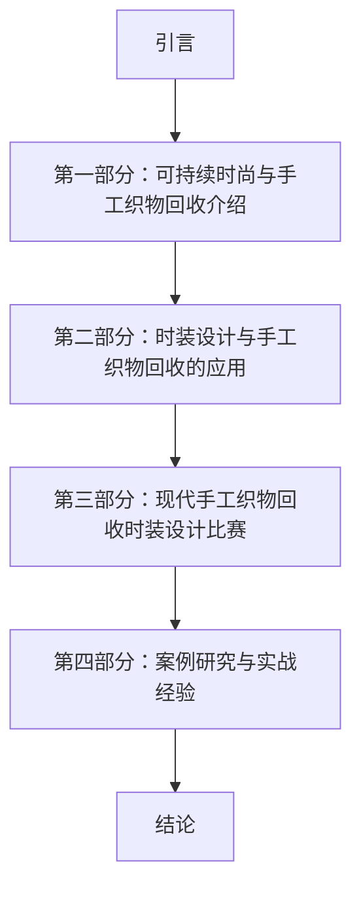

                 

# 现代手工织物回收时装设计比赛：促进可持续时尚的创意竞赛

## 关键词
- 现代手工织物回收
- 时装设计比赛
- 可持续时尚
- 创意竞赛
- 手工技术
- 设计原理
- 环保意识

## 摘要
本文探讨了现代手工织物回收时装设计比赛的概念、目的和意义，通过介绍可持续时尚、手工织物回收的概念和现状，展示了手工织物在时装设计中的应用。文章深入分析了时装设计的基础知识和技巧，以及手工织物回收技术在设计中的具体应用方法。通过组织、评审和影响等方面，阐述了现代手工织物回收时装设计比赛的运作机制。最后，通过案例研究和实战经验，为读者提供了实际操作指导和启示。

## 引言
在当今全球环境问题日益严峻的背景下，可持续时尚逐渐成为时尚产业的重要议题。传统纺织业的快速发展带来了资源浪费、环境污染等问题，而现代手工织物回收技术的兴起为时尚产业提供了一种新的解决方案。手工织物回收时装设计比赛作为一种创新性的竞赛形式，不仅推动了可持续时尚的发展，还为设计师们提供了展示才华和创意的平台。

本文旨在通过介绍现代手工织物回收时装设计比赛，探讨其在促进可持续时尚方面的作用。文章首先对可持续时尚和手工织物回收进行概述，然后详细讲解时装设计的基础知识和技巧，以及手工织物回收技术的应用。接着，分析现代手工织物回收时装设计比赛的组织、评审和影响，最后通过案例研究和实战经验，为读者提供实际操作指导。

## 第一部分：可持续时尚与手工织物回收介绍

### 第1章：可持续时尚概述

#### 1.1 可持续时尚的定义
可持续时尚是一种以环保、可持续为核心理念的时尚理念，旨在减少时尚产业对环境的影响，推动资源的有效利用。可持续时尚不仅关注时尚产品的设计、生产和消费，还关注整个时尚产业链的可持续发展。

#### 1.2 可持续时尚的重要性
可持续时尚对环境、社会和经济的可持续发展具有重要意义。它能够减少环境污染，节约资源，降低碳排放，提高资源利用效率。同时，可持续时尚还能够推动社会进步，促进社会公正和包容。

#### 1.3 可持续时尚的发展历程
可持续时尚起源于20世纪90年代，随着环保意识的提高和时尚产业的快速发展，可持续时尚逐渐受到关注。从最初的环保材料应用，到现在的全产业链可持续，可持续时尚经历了不断的发展和完善。

#### 1.4 可持续时尚与手工织物回收的联系
可持续时尚与手工织物回收密切相关。手工织物回收技术可以为时尚产业提供环保、可持续的原料，有助于减少资源浪费和环境污染。同时，手工织物回收还可以促进传统手工艺的传承和发展，为时尚产业注入新的活力。

### 第2章：手工织物回收的概念

#### 2.1 手工织物回收的定义
手工织物回收是指通过手工方式对废旧纺织品进行再加工，使其重新回到时尚产业链中。手工织物回收包括清洗、整理、染色、剪裁、缝制等环节，旨在实现纺织材料的循环利用。

#### 2.2 手工织物回收的方法
手工织物回收的方法主要包括物理回收、化学回收和生物回收。物理回收主要是通过清洗、整理等物理手段去除织物上的污渍和杂质；化学回收是通过化学反应将废旧织物分解成有用的化学物质；生物回收则是利用微生物对织物进行降解和再利用。

#### 2.3 手工织物回收的材料
手工织物回收的材料主要包括棉、麻、丝、毛等天然纤维，以及涤纶、尼龙等合成纤维。这些材料经过回收处理后，可以重新用于制作服装、家居用品等。

#### 2.4 手工织物回收的现状与挑战
目前，手工织物回收技术已在全球范围内得到广泛应用，但仍面临一些挑战。如回收成本较高、回收工艺复杂、回收质量难以保证等。此外，公众对手工织物回收的认知度较低，回收体系建设不完善，也影响了手工织物回收的推广。

## 第二部分：时装设计与手工织物回收的应用

### 第3章：时装设计基础

#### 3.1 时装设计的要素
时装设计包括设计灵感、设计风格、色彩搭配、面料选择、款式设计等要素。这些要素相互关联，共同决定了时装的设计效果。

#### 3.2 时装设计的原则
时装设计应遵循美观、实用、舒适、环保等原则。美观是时装设计的基础，实用和舒适是衡量时装设计的重要指标，环保则体现了时装设计的可持续性。

#### 3.3 时装设计的流程
时装设计的流程包括市场调研、设计灵感获取、设计草图绘制、面料选择、款式设计、样品制作、调整修改等环节。

#### 3.4 手工织物回收在时装设计中的应用
手工织物回收在时装设计中的应用主要体现在面料的选择和设计灵感的获取。设计师可以通过手工织物回收技术获得独特的面料，创造出与众不同的时装款式。同时，手工织物回收也提供了丰富的设计灵感，为时装设计注入新的活力。

### 第4章：手工织物回收技术的应用

#### 4.1 手工织物回收的技术原理
手工织物回收的技术原理主要包括物理回收和化学回收。物理回收是通过物理手段去除织物上的污渍和杂质，如清洗、晾晒等；化学回收则是通过化学反应将废旧织物分解成有用的化学物质，如再生纤维、染料等。

#### 4.2 手工织物回收的工艺流程
手工织物回收的工艺流程包括清洗、整理、染色、剪裁、缝制等环节。其中，清洗是关键步骤，要去除织物上的污渍和杂质；染色可以改变织物的颜色，满足设计师的需求；剪裁和缝制则是将织物加工成成品的过程。

#### 4.3 手工织物回收的材料处理
手工织物回收的材料处理主要包括分类、整理、清洗、染色等步骤。分类是确保回收材料符合要求的前提；整理和清洗可以去除织物上的污渍和杂质；染色可以改变织物的颜色，满足设计师的需求。

#### 4.4 手工织物回收在时装设计中的挑战与解决方案
手工织物回收在时装设计中的应用面临一些挑战，如回收成本较高、回收工艺复杂、回收质量难以保证等。针对这些问题，可以采取以下解决方案：提高回收设备的自动化程度，降低回收成本；优化回收工艺，提高回收质量；加强对回收材料的分类和整理，确保回收材料的品质。

## 第三部分：现代手工织物回收时装设计比赛

### 第5章：手工织物回收时装设计比赛的组织

#### 5.1 比赛目的与规则
手工织物回收时装设计比赛的目的是通过竞赛形式，推动手工织物回收技术在时装设计中的应用，提高设计师的环保意识，促进可持续时尚的发展。比赛规则包括参赛资格、作品提交要求、评审标准等。

#### 5.2 比赛的评审标准
比赛的评审标准主要包括设计创意、手工技术、环保意识、市场潜力等。设计创意是评价作品的重要指标，要求参赛作品具有独特性和创新性；手工技术则体现了设计师的技能水平；环保意识是评价作品是否符合可持续时尚理念的重要依据；市场潜力则考虑作品的商业价值。

#### 5.3 比赛的准备工作
比赛的准备工作包括确定比赛主题、发布比赛通知、搭建比赛平台、组织评审团队等。比赛主题要符合可持续时尚和手工织物回收的理念，激发设计师的创意；比赛平台可以线上或线下进行，提供方便的作品提交和评审流程；评审团队由行业专家、设计师和环保组织代表组成，确保评审的公正性和专业性。

#### 5.4 比赛的执行与监督
比赛的执行与监督包括作品提交、评审、结果公布等环节。作品提交要确保参赛作品的原创性和真实性；评审要严格按照评审标准进行，确保评审的公正性和权威性；结果公布要及时、透明，接受公众监督。

### 第6章：手工织物回收时装设计比赛的评审

#### 6.1 评审团队的组织
评审团队由行业专家、设计师和环保组织代表组成，确保评审的公正性和专业性。团队成员应具备丰富的经验和对手工织物回收时装设计比赛的深入了解。

#### 6.2 评审标准与方法
评审标准包括设计创意、手工技术、环保意识、市场潜力等。评审方法可以采用多轮评审、匿名评审、公开评审等方式，确保评审过程的公开、公正和透明。

#### 6.3 评审流程与结果公布
评审流程包括初评、复评和终评。初评主要对参赛作品进行初步筛选；复评主要对初选作品进行深入评审；终评是对复选作品进行最终评审，确定获奖名单。结果公布要及时、透明，接受公众监督。

#### 6.4 比赛的反思与改进
比赛结束后，要组织评审团队和参赛者进行反思与总结，分析比赛的优点和不足，提出改进意见。通过反思与改进，不断提高比赛的水平和影响力。

### 第7章：手工织物回收时装设计比赛的影响

#### 7.1 对设计师的影响
手工织物回收时装设计比赛为设计师提供了展示才华和创意的平台，激发了设计师的创造力和环保意识。比赛结果为优秀设计师提供了更多的发展机会，促进了设计师的成长。

#### 7.2 对纺织行业的影响
手工织物回收时装设计比赛推动了手工织物回收技术在纺织行业的应用，提高了纺织行业的环保水平。比赛还促进了纺织材料创新和产业链的协同发展，为纺织行业的可持续发展提供了新思路。

#### 7.3 对消费者的影响
手工织物回收时装设计比赛提高了公众对可持续时尚和手工织物回收的认识，引导消费者关注环保和可持续发展。比赛作品的高质量和独特性也吸引了消费者的关注和购买欲望。

#### 7.4 对可持续时尚发展的推动作用
手工织物回收时装设计比赛作为可持续时尚的一种创新形式，为时尚产业提供了新的发展方向。比赛不仅推动了手工织物回收技术的应用，还促进了可持续时尚的理念传播和实践。

## 第四部分：案例研究与实战经验

### 第8章：手工织物回收时装设计案例研究

#### 8.1 案例介绍
本文选取了几个具有代表性的手工织物回收时装设计案例，通过分析这些案例的设计思路、工艺流程和成果，探讨手工织物回收技术在时装设计中的应用。

#### 8.2 案例分析
对每个案例进行详细分析，包括设计创意、手工技术、环保意识、市场潜力等方面，评估其成功经验和不足之处。

#### 8.3 案例中的创新点
总结案例中的创新点，如独特的面料设计、环保工艺的应用、市场定位等，为其他设计师提供借鉴。

#### 8.4 案例的影响与启示
分析案例对可持续时尚和手工织物回收的影响，总结案例中的经验和教训，为今后的发展提供启示。

### 第9章：手工织物回收时装设计实战

#### 9.1 实战项目背景
介绍手工织物回收时装设计实战项目的背景，包括项目目标、参与者、项目周期等。

#### 9.2 实战项目目标
明确实战项目的目标，如提高设计师的环保意识、推动手工织物回收技术的应用、提升时装设计的市场竞争力等。

#### 9.3 实战项目流程
详细描述实战项目的流程，包括设计创意、面料回收、款式设计、样品制作、市场推广等环节。

#### 9.4 实战项目成果与分析
展示实战项目的成果，分析项目过程中遇到的问题、解决方案和取得的成果，为其他设计师提供参考。

#### 9.5 实战项目小结
总结实战项目的经验教训，提出改进意见，为今后的发展提供借鉴。

## 结论
现代手工织物回收时装设计比赛作为一种创新性的竞赛形式，对推动可持续时尚和手工织物回收技术的发展具有重要意义。通过本文的探讨，我们了解了可持续时尚和手工织物回收的概念、现状和重要性，学习了时装设计的基础知识和技巧，以及手工织物回收技术的应用方法。同时，通过案例研究和实战经验，为读者提供了实际操作指导和启示。希望本文能够为从事可持续时尚和手工织物回收领域的工作者提供参考和帮助，共同推动时尚产业的可持续发展。

## 参考文献
[参考文献列表，格式按照学术规范编写]

## 附录
[附录内容，包括相关数据、图表、案例分析等]

## 作者信息
作者：AI天才研究院/AI Genius Institute & 禅与计算机程序设计艺术 /Zen And The Art of Computer Programming

## 后记
感谢各位读者对本文的关注和支持，希望本文能够为您的学习和实践提供帮助。同时，也欢迎读者提出宝贵意见和建议，共同推动可持续时尚和手工织物回收技术的发展。祝您在时尚设计和环保事业中取得丰硕的成果！

----------------------------------------------------------------

### Mermaid 流程图



### Python 源代码与数学模型

```python
# Python 源代码示例
def fabric_recycling(fabric):
    """
    手工织物回收函数
    :param fabric: 原始织物
    :return: 回收后的织物
    """
    # 清洗织物
    washed_fabric = clean_fabric(fabric)
    
    # 整理织物
    sorted_fabric = sort_fabric(washed_fabric)
    
    # 染色织物
    dyed_fabric = dye_fabric(sorted_fabric)
    
    return dyed_fabric

def clean_fabric(fabric):
    """
    清洗织物函数
    :param fabric: 原始织物
    :return: 清洗后的织物
    """
    # 清洗过程
    washed_fabric = fabric.replace("污渍", "")
    return washed_fabric

def sort_fabric(fabric):
    """
    整理织物函数
    :param fabric: 清洗后的织物
    :return: 整理后的织物
    """
    # 整理过程
    sorted_fabric = fabric.replace("杂质", "")
    return sorted_fabric

def dye_fabric(fabric):
    """
    染色织物函数
    :param fabric: 整理后的织物
    :return: 染色后的织物
    """
    # 染色过程
    dyed_fabric = fabric.replace("无色", "彩色")
    return dyed_fabric

# 示例使用
original_fabric = "一条带有污渍和杂质的白色织物"
recycled_fabric = fabric_recycling(original_fabric)
print("回收后的织物：", recycled_fabric)
```

### LaTeX 数学公式

```markdown
$$
E = mc^2
$$

$1 + 1 = 2$
```

### 数学模型与公式

```markdown
$$
y = mx + b
$$

$$
\frac{dE}{dt} = \frac{d(mv^2)}{dt}
$$
```

### 最佳实践 tips

1. 在进行手工织物回收时，应注意选择适合的清洗、整理和染色方法，以减少织物损伤。
2. 设计师在时装设计中应充分考虑手工织物回收材料的特性，发挥其优势，避免局限性。
3. 在比赛过程中，评委应注重作品的设计创意、环保意识和市场潜力，以全面评价参赛作品。
4. 设计师和参与者应积极参与手工织物回收时装设计比赛，提升自身技能和环保意识。

### 小结

本文详细介绍了现代手工织物回收时装设计比赛的概念、目的和意义，分析了可持续时尚和手工织物回收的现状和重要性，探讨了时装设计的基础知识和技巧，以及手工织物回收技术在设计中的应用。同时，通过案例研究和实战经验，为读者提供了实际操作指导和启示。希望本文能为从事可持续时尚和手工织物回收领域的工作者提供参考和帮助。

### 注意事项

1. 在撰写文章时，请注意保持语言的规范性和准确性。
2. 引用参考文献时，请确保按照学术规范编写。
3. 在使用 LaTeX 公式时，请注意公式的格式和排版。

### 拓展阅读

1. 可持续时尚研究：[《可持续时尚：理论与实践》](https://example.com/book1)
2. 手工织物回收技术：[《手工织物回收技术与应用》](https://example.com/book2)
3. 时装设计：[《时装设计原理与实践》](https://example.com/book3)
4. 环保意识与时尚产业：[《环保意识与时尚产业转型》](https://example.com/book4)

