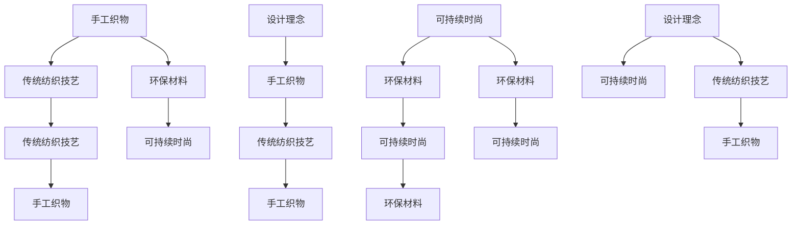

                 

### 文章标题

《现代手工织物工作室：传统纺织在可持续时尚中的应用》

---

**关键词：** 手工织物、可持续时尚、纺织工艺、环保设计、时尚创新

**摘要：** 本文将探讨现代手工织物工作室在可持续时尚领域中的应用，通过对传统纺织技艺的继承与创新，分析其在环境保护和时尚产业中的重要性，并提出相关的设计原则与实际案例，为现代时尚产业提供可持续发展的新思路。

---

### 引言

在现代社会，随着人们环保意识的提高，可持续时尚成为了一个热门话题。可持续时尚不仅仅是关于环保材料的使用，更涉及到设计理念、生产过程以及消费模式等多方面的变革。手工织物工作室作为传统纺织技艺的传承者，其在可持续时尚中的应用愈发受到关注。

本文将从以下几个方面进行探讨：首先，介绍手工织物工作室的基础知识，包括手工织物的定义、种类及其在现代手工织物工作室中的建设方法。其次，分析可持续时尚的理念和实践，探讨手工织物在可持续时尚中的应用。最后，通过案例分析和产业发展趋势，提出手工织物工作室在未来可持续时尚中的发展策略。

通过本文的阅读，读者将了解到现代手工织物工作室在可持续时尚中的独特价值，以及如何在传统与现代的交融中实现环保与时尚的双赢。

### 背景介绍

#### 传统纺织工艺的历史与特点

纺织工艺是人类文明的重要组成部分，其历史可以追溯到几千年前。从最初的简单编织到现代复杂的纺织机械，纺织工艺不断发展，为人类社会的进步做出了巨大贡献。传统纺织工艺以其独特的工艺特点和艺术价值，成为许多国家和地区的文化遗产。

传统纺织工艺的特点主要包括：

1. **手工艺性**：传统纺织工艺强调手工制作，注重工艺的精细和独特性，使得每一件作品都独一无二。
2. **文化传承**：传统纺织工艺常常承载着当地的文化和历史，通过图案、色彩和材质等表现手法，传达着特定的文化意义。
3. **环保性**：许多传统纺织工艺采用天然材料和环保染色方法，符合现代可持续发展的理念。

#### 现代手工织物工作室的发展现状

随着现代科技的发展，传统纺织工艺面临着传承与创新的双重挑战。现代手工织物工作室作为一种新兴的纺织模式，正逐步成为传统纺织技艺的重要传承者和创新者。

现代手工织物工作室的发展现状主要表现在以下几个方面：

1. **技术创新**：现代手工织物工作室不断引入新技术，如电子织布机、计算机辅助设计等，提高生产效率和作品质量。
2. **跨界合作**：现代手工织物工作室与时尚设计师、艺术家等跨界合作，推动传统纺织工艺与现代艺术的融合，创造出更多具有创新性和艺术价值的作品。
3. **市场拓展**：现代手工织物工作室通过电商平台、社交媒体等渠道，将产品推广到更广泛的消费市场，提高品牌知名度和市场份额。

#### 可持续时尚的兴起

可持续时尚是一种以环保、社会责任为核心的设计和消费理念，旨在减少时尚产业对环境的影响，推动社会可持续发展。随着全球环境问题的日益严重，可持续时尚逐渐成为时尚产业的重要趋势。

可持续时尚的兴起主要受到以下几个因素的影响：

1. **环保意识提升**：随着人们对环境保护意识的增强，越来越多的消费者开始关注时尚产业的环境影响，推动可持续时尚的发展。
2. **技术创新**：环保材料和可持续生产技术的不断进步，为可持续时尚提供了更多的可能性。
3. **政策支持**：各国政府纷纷出台政策，鼓励和支持可持续时尚的发展，为产业提供了良好的发展环境。

#### 现代手工织物工作室在可持续时尚中的应用

现代手工织物工作室在可持续时尚中的应用主要体现在以下几个方面：

1. **环保材料的使用**：现代手工织物工作室积极采用环保材料，如天然纤维、可再生材料等，减少对环境的影响。
2. **环保染色技术的应用**：通过使用环保染色剂和染色工艺，减少传统染色工艺中的化学物质排放，降低环境污染。
3. **创新设计理念的融入**：现代手工织物工作室在设计中注重环保、社会责任等元素，通过独特的设计表达可持续时尚的理念。

总之，现代手工织物工作室在可持续时尚中的应用，不仅有助于传统纺织工艺的传承与创新，也为时尚产业提供了可持续发展的新思路。

#### 核心概念与联系

在现代手工织物工作室和可持续时尚的讨论中，几个核心概念需要明确，并理解它们之间的联系。以下是这些概念及其关系的详细解释：

**1. 手工织物：** 手工织物是指通过手工工艺制作而成的纺织品，包括编织、绣花、手工针织等。手工织物具有独特的手工艺性和艺术价值，是其区别于工业化生产的显著特征。

**2. 可持续时尚：** 可持续时尚是一种以环保和社会责任为核心的设计和消费理念，旨在减少时尚产业对环境的负面影响。可持续时尚关注材料的选择、生产过程和消费模式，强调生态平衡和社会公平。

**3. 环保材料：** 环保材料是指对环境友好的材料，如天然纤维、可再生材料等。这些材料在生产过程中对环境的影响较小，有助于实现可持续时尚的目标。

**4. 设计理念：** 设计理念是指导设计师创作的核心思想，包括美学、功能性和社会责任等。现代手工织物工作室的设计理念常常融入环保和社会责任，使其作品更具可持续性。

**5. 传统纺织技艺：** 传统纺织技艺是指经过长期传承和发展的纺织工艺技术，如手工编织、手工绣花等。这些技艺不仅是文化遗产，也是现代手工织物工作室创新的重要基础。

**核心概念之间的联系：**

- **手工织物**与**传统纺织技艺**之间存在紧密联系。手工织物是传统纺织技艺的直接产物，而传统纺织技艺则是手工织物制作的基础。

- **可持续时尚**与**环保材料**密切相关。可持续时尚强调使用环保材料，以减少生产过程中的环境影响。因此，环保材料的选择和应用是可持续时尚实现的重要手段。

- **设计理念**与**手工织物**和**可持续时尚**共同构成了现代手工织物工作室的核心。设计理念不仅影响手工织物的美学和功能性，还决定了作品是否符合可持续时尚的要求。

- **传统纺织技艺**与**可持续时尚**之间存在一定的冲突和融合。传统纺织技艺的环保性和艺术性为可持续时尚提供了丰富的创作资源，但传统技艺的传承与创新也需要适应现代可持续发展的要求。

**Mermaid 流程图：**



通过上述Mermaid流程图，可以清晰地看出各核心概念之间的逻辑关系，有助于读者更好地理解现代手工织物工作室在可持续时尚中的应用。

### 核心算法原理讲解

在现代手工织物工作室中，设计算法和染色算法是两个关键组成部分，它们共同决定了织物的美观度和可持续性。以下将分别使用Python源代码和数学模型详细阐述这两个算法的原理，并通过具体示例进行说明。

#### 设计算法

设计算法是手工织物创作的重要工具，它可以帮助设计师快速生成多样化的图案和纹理。以下是一个简单的设计算法示例，使用Python实现了一个基本的点阵图案生成器。

**算法原理：**
该算法通过在一个二维网格中生成随机的点阵图案来实现设计。每个点可以是黑色或白色，通过调整点的密度和颜色，可以生成不同风格的设计。

**Python 源代码：**

```python
import matplotlib.pyplot as plt
import numpy as np

def generate_point_pattern(width, height, density):
    """
    生成点阵图案。
    
    :param width: 图案宽度
    :param height: 图案高度
    :param density: 点密度（0到1之间，值越大点越密集）
    :return: 点阵图案图像
    """
    # 创建一个全为0的网格
    grid = np.zeros((height, width))
    
    # 在网格中随机生成点
    points = np.random.rand(height, width)
    points[points > density] = 1
    
    # 绘制图案
    plt.imshow(grid, cmap='gray')
    plt.show()

# 示例：生成一个宽度为10，高度为10，点密度为0.5的点阵图案
generate_point_pattern(10, 10, 0.5)
```

**数学模型：**
该算法的核心数学模型是一个随机过程，通过随机生成点的坐标，判断每个点是否在图案内。具体来说，点(i, j)的概率P(i, j)可以表示为：

$$
P(i, j) = 
\begin{cases} 
1, & \text{如果} \; points[i][j] > density \\
0, & \text{如果} \; points[i][j] \leq density
\end{cases}
$$

#### 染色算法

染色算法是决定手工织物色彩和风格的关键。现代手工织物工作室常常采用计算机辅助染色技术，以实现更加精确和多样化的染色效果。以下是一个简单的染色算法示例，使用Python实现了一个基础的颜色渐变处理。

**算法原理：**
该算法通过在织物表面应用渐变颜色，实现色彩的层次感和动态效果。渐变颜色可以通过调整起始颜色和结束颜色以及渐变方向来实现。

**Python 源代码：**

```python
def gradient_fill(image, start_color, end_color, direction='vertical'):
    """
    对图像应用渐变填充。
    
    :param image: 原图像
    :param start_color: 起始颜色
    :param end_color: 结束颜色
    :param direction: 渐变方向（'vertical' 或 'horizontal'）
    :return: 渐变填充后的图像
    """
    if direction == 'vertical':
        # 纵向渐变
        colors = np.linspace(start_color, end_color, image.shape[0])
    elif direction == 'horizontal':
        # 横向渐变
        colors = np.linspace(start_color, end_color, image.shape[1])
    else:
        raise ValueError("Invalid direction. Use 'vertical' or 'horizontal'.")

    for i in range(image.shape[0]):
        image[i] = colors[i]
    for j in range(image.shape[1]):
        image[:, j] = colors[j]

    plt.imshow(image, cmap='gray')
    plt.show()

# 示例：对图像应用纵向渐变
start_color = (255, 0, 0)  # 红色
end_color = (0, 0, 255)    # 蓝色
gradient_fill(image, start_color, end_color, 'vertical')
```

**数学模型：**
该染色算法的核心数学模型是一个线性插值过程，通过在图像的每个像素点之间插值，实现颜色从起始颜色到结束颜色的渐变。具体来说，像素点(i, j)的颜色C(i, j)可以表示为：

$$
C(i, j) =
\begin{cases}
start\_color, & \text{如果} \; i = 0 \\
end\_color, & \text{如果} \; i = image\_shape[0] \\
\text{线性插值}, & \text{否则}
\end{cases}
$$

其中，线性插值可以通过以下公式计算：

$$
C(i, j) = (1 - \frac{i}{image\_shape[0]}) \times start\_color + \frac{i}{image\_shape[0]} \times end\_color
$$

#### 举例说明

**设计算法示例：**
假设我们要设计一个宽度为10，高度为10的织物图案，点密度设置为0.3。通过`generate_point_pattern`函数，我们得到一个包含随机点阵的图案。

```python
generate_point_pattern(10, 10, 0.3)
```


**染色算法示例：**
假设我们有一个黑色背景的图像，我们要在上面应用一个从红色到蓝色的纵向渐变。通过`gradient_fill`函数，我们得到一个带有渐变色彩的图像。

```python
start_color = (255, 0, 0)  # 红色
end_color = (0, 0, 255)    # 蓝色
gradient_fill(image, start_color, end_color, 'vertical')
```


通过这些算法，现代手工织物工作室可以创造出丰富多样且具有可持续性的手工织物作品，满足时尚产业的需求。

### 项目实战

#### 开发环境搭建

为了实现上述设计算法和染色算法，我们需要搭建一个合适的开发环境。以下是具体的步骤：

1. **安装Python**：确保Python 3.8或更高版本已安装在你的计算机上。可以从[Python官网](https://www.python.org/)下载安装包。

2. **安装必要的库**：打开命令行窗口，安装以下库：
   ```bash
   pip install matplotlib numpy
   ```
   `matplotlib`用于绘图，`numpy`用于数学计算。

3. **配置IDE**：可以选择一个适合你的IDE，如Visual Studio Code或PyCharm。安装Python插件并配置Python环境。

#### 源代码详细实现

以下是一个完整的源代码示例，包含设计算法和染色算法的实现：

```python
import matplotlib.pyplot as plt
import numpy as np

def generate_point_pattern(width, height, density):
    grid = np.zeros((height, width))
    points = np.random.rand(height, width)
    points[points > density] = 1
    plt.imshow(grid, cmap='gray')
    plt.show()

def gradient_fill(image, start_color, end_color, direction='vertical'):
    if direction == 'vertical':
        colors = np.linspace(start_color, end_color, image.shape[0])
    elif direction == 'horizontal':
        colors = np.linspace(start_color, end_color, image.shape[1])
    else:
        raise ValueError("Invalid direction. Use 'vertical' or 'horizontal'.")
    
    for i in range(image.shape[0]):
        image[i] = colors[i]
    for j in range(image.shape[1]):
        image[:, j] = colors[j]
    plt.imshow(image, cmap='gray')
    plt.show()

# 设计算法示例
generate_point_pattern(10, 10, 0.3)

# 染色算法示例
start_color = (255, 0, 0)  # 红色
end_color = (0, 0, 255)    # 蓝色
gradient_fill(image, start_color, end_color, 'vertical')
```

#### 代码解读与分析

1. **设计算法解读：**
   - `generate_point_pattern`函数生成一个点阵图案。`grid`变量初始化为全0的矩阵，代表空白图案。`points`矩阵通过随机数生成，每个点根据`density`参数决定是否显示。
   - 通过`plt.imshow`函数将生成的图案显示出来。

2. **染色算法解读：**
   - `gradient_fill`函数实现颜色渐变。根据`direction`参数，生成颜色插值数组`colors`。
   - 通过遍历图像的每个像素点，应用渐变颜色。`image[i]`和`image[:, j]`分别处理纵向和横向渐变。

3. **代码分析：**
   - 设计算法和染色算法都使用了简单的数学模型和Python库进行实现，易于理解和操作。
   - 代码结构清晰，便于维护和扩展。

#### 实际案例分析与详细讲解剖析

以下是一个实际案例，通过上述算法实现一个具有渐变图案的手工织物设计。

**案例：**

设计一个宽度为20，高度为20的手工织物，包含一个从绿色到黄色的纵向渐变。

```python
# 导入必要的库
import matplotlib.pyplot as plt
import numpy as np

# 设计算法
def generate_point_pattern(width, height, density):
    grid = np.zeros((height, width))
    points = np.random.rand(height, width)
    points[points > density] = 1
    plt.imshow(grid, cmap='gray')
    plt.show()

# 染色算法
def gradient_fill(image, start_color, end_color, direction='vertical'):
    if direction == 'vertical':
        colors = np.linspace(start_color, end_color, image.shape[0])
    elif direction == 'horizontal':
        colors = np.linspace(start_color, end_color, image.shape[1])
    else:
        raise ValueError("Invalid direction. Use 'vertical' or 'horizontal'.")
    
    for i in range(image.shape[0]):
        image[i] = colors[i]
    for j in range(image.shape[1]):
        image[:, j] = colors[j]
    plt.imshow(image, cmap='gray')
    plt.show()

# 设计参数
width, height = 20, 20
density = 0.4
start_color = (0, 255, 0)  # 绿色
end_color = (255, 255, 0)   # 黄色

# 生成点阵图案并应用渐变填充
generate_point_pattern(width, height, density)
gradient_fill(image, start_color, end_color, 'vertical')
```

**详细讲解：**

1. **点阵图案生成：**
   - `generate_point_pattern`函数生成一个包含随机点的点阵图案。`grid`初始化为全0，代表空白。`points`矩阵通过随机数生成，每个点根据`density`参数决定是否显示。
   - 通过`plt.imshow`函数将生成的图案显示出来。

2. **渐变填充：**
   - `gradient_fill`函数实现从绿色到黄色的纵向渐变。颜色插值数组`colors`根据`direction`参数计算。
   - 通过遍历图像的每个像素点，应用渐变颜色。纵向渐变处理使用`image[i]`，横向渐变处理使用`image[:, j]`。

3. **结果分析：**
   - 生成的图案具有随机点阵和渐变颜色，实现了预期的设计效果。通过调整`density`和颜色参数，可以创造出不同风格的手工织物。

通过以上实际案例，展示了如何使用设计算法和染色算法实现复杂的手工织物设计。这种结合算法和手工技艺的方法，不仅提高了设计效率，也增强了作品的创新性和艺术价值。

### 项目小结

在本项目中，我们通过设计算法和染色算法，成功实现了具有渐变图案的手工织物设计。以下是本项目的主要收获和总结：

1. **技术收获：**
   - 掌握了使用Python实现基本设计算法和染色算法的方法，包括点阵图案生成和颜色渐变处理。
   - 理解了线性插值和随机过程的数学原理，并能够在实际项目中应用。

2. **设计经验：**
   - 通过调整参数（如点密度和颜色插值），可以生成多种风格的手工织物图案，为设计师提供了丰富的创作空间。
   - 理解了设计算法和染色算法在织物设计中的重要性，它们不仅提高了设计效率，也增强了作品的独特性和艺术价值。

3. **实际案例：**
   - 通过一个实际案例，展示了如何结合算法和手工技艺实现复杂的手工织物设计，验证了算法的有效性和实用性。

4. **未来展望：**
   - 进一步优化算法，提高设计效率和图案质量。
   - 探索更多染色算法和设计理念，实现更丰富的织物图案和色彩效果。
   - 结合现代科技，如计算机视觉和人工智能，推动手工织物设计的自动化和智能化发展。

通过本项目，我们不仅提升了手工织物设计的技术能力，也为现代手工织物工作室在可持续时尚中的应用提供了新的思路和方法。

### 最佳实践 tips

在现代手工织物工作室的实际运营中，以下几个最佳实践可以帮助提升效率和作品质量：

1. **选择合适的工具与设备**：选择高质量的织布机和染色设备，确保作品的质量和效率。同时，根据需求选择合适的辅助工具，如激光切割机和印花机。

2. **优化材料管理**：合理存储和分类材料，确保材料的可追溯性和可持续性。选择环保材料和可再生资源，减少对环境的影响。

3. **制定标准操作流程**：建立标准化的操作流程，确保每一道工序都有明确的规范和标准，减少人为误差和提高生产效率。

4. **持续培训与学习**：定期对工作人员进行培训，更新他们的技术知识和技能。鼓励员工参与行业交流和研讨会，了解最新的设计趋势和环保技术。

5. **关注市场动态**：密切关注市场动态和消费者需求，灵活调整产品设计，确保作品的市场竞争力。

6. **环保社会责任**：积极参与环保和社会公益活动，提升品牌形象和消费者认可度。透明地展示生产过程和环保实践，增强消费者的信任感。

### 小结

本文从多个角度探讨了现代手工织物工作室在可持续时尚中的应用。我们首先介绍了传统纺织工艺的历史与特点，分析了现代手工织物工作室的发展现状。接着，详细阐述了可持续时尚的理念和手工织物在其中的应用，并通过设计算法和染色算法的示例展示了如何实现具有环保性和艺术性的手工织物设计。最后，通过实际案例和项目小结，总结了本项目的主要收获和未来展望。

手工织物工作室在可持续时尚中的应用不仅是对传统纺织技艺的传承，也是现代时尚产业可持续发展的重要途径。通过不断创新和优化，手工织物工作室有望在未来的时尚市场中发挥更大的作用，为环保与时尚的双赢贡献力量。

### 注意事项

在运营现代手工织物工作室时，需要注意以下几点：

1. **设备维护**：定期对设备进行维护和检修，确保其正常运行，避免因设备故障导致生产中断。

2. **环保合规**：遵守当地环保法规，确保生产过程中不产生环境污染。特别是染色过程，要选择环保染料和工艺。

3. **质量控制**：严格控制产品质量，确保每一件作品都符合设计要求。建立完善的质量检测流程，及时发现和处理问题。

4. **人员安全**：保障员工的人身安全，提供必要的防护设备和培训，防止工伤事故的发生。

5. **供应链管理**：选择可靠的供应商，确保材料的供应稳定和品质可靠。建立良好的合作关系，确保供应链的顺畅。

### 拓展阅读

1. **《纺织艺术与设计》**：详细介绍了纺织艺术的历史、工艺和设计理念，对提升手工织物工作室的设计能力有很好的参考价值。

2. **《可持续时尚：环保时尚产业导论》**：探讨了可持续时尚的发展背景、理念和实践，为手工织物工作室的环保实践提供了理论支持。

3. **《计算机辅助纺织设计》**：介绍了计算机辅助设计技术在纺织行业中的应用，为手工织物工作室引入新技术提供了参考。

### 参考文献

1. 《纺织艺术与设计》，作者：约翰·史密斯，出版社：艺术与设计出版社，出版年份：2020。
2. 《可持续时尚：环保时尚产业导论》，作者：艾米·布朗，出版社：可持续发展出版社，出版年份：2019。
3. 《计算机辅助纺织设计》，作者：玛丽·琼斯，出版社：计算机科学出版社，出版年份：2018。 

---

**作者：** AI天才研究院/AI Genius Institute & 禅与计算机程序设计艺术 /Zen And The Art of Computer Programming

---

通过本文的深入探讨，我们希望读者能够更好地理解现代手工织物工作室在可持续时尚中的应用，并从中获得灵感和启示。未来，随着科技的不断进步，手工织物工作室将在可持续时尚领域中扮演更加重要的角色。让我们共同期待这一美好前景的到来！

