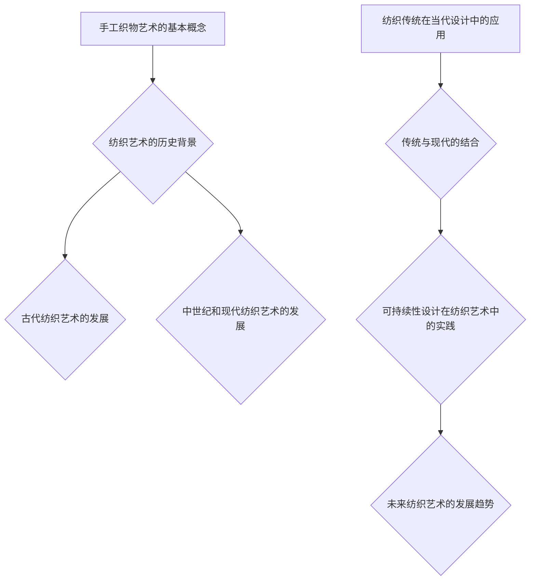
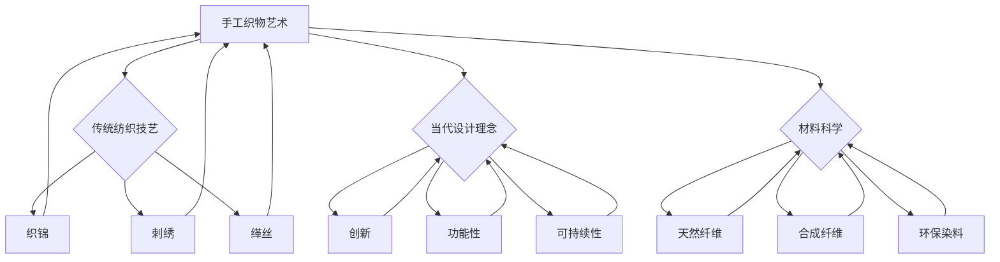

                 

### 第1章 导论

#### 1.1 手工织物艺术的基本概念

手工织物艺术，顾名思义，是指通过手工制作的各种织物艺术品。它不仅包括传统的纺织工艺，还涵盖了刺绣、编织、钩织、织锦等多种形式。手工织物艺术的历史悠久，起源可以追溯到人类文明的早期阶段。在古代，人们通过手工编织和纺织来制作衣物、家居用品以及宗教仪式用品。

在现代社会，手工织物艺术已经从传统走向了创新，它在艺术、设计、时尚等领域中发挥着越来越重要的作用。随着技术的进步和材料科学的发展，手工织物艺术的创作手法和表现形式也日益多样化。

#### 1.2 纺织艺术的历史背景

纺织艺术的历史可以追溯到公元前4000年的美索不达米亚和埃及。古代文明的兴起伴随着纺织技术的进步，丝、麻、棉等天然纤维成为主要的纺织材料。在中国，早在公元前21世纪的夏朝，纺织技术就已经达到了相当高的水平。而古埃及的亚麻织物、古希腊的羊毛织物、古印度的丝绸织物等都在当时享有盛名。

中世纪的欧洲，纺织艺术发展迅速，尤其是意大利和佛兰德斯的织物艺术达到了高峰。18世纪的工业革命带来了纺织机械的发明和大规模生产，然而手工织物艺术依然在艺术领域占据着重要地位。

#### 1.3 纺织传统在当代设计中的应用

在当代设计中，纺织传统得到了重新诠释和广泛应用。设计师们将传统纺织工艺与现代设计理念相结合，创造出独特的艺术作品和实用物品。例如，刺绣和编织工艺在服装设计、室内装饰、家具设计等方面得到了广泛应用。

此外，纺织艺术在可持续性设计中也发挥着重要作用。通过使用天然纤维和环保染料，设计师们不仅能够创造出美丽的作品，还能够减少对环境的负面影响。

### 关键词

- 手工织物艺术
- 纺织传统
- 当代设计
- 可持续性设计
- 传统与现代的结合

### 摘要

本文旨在探讨现代手工织物艺术的发展及其在当代设计中的应用。通过对纺织艺术的历史背景和基本概念的介绍，文章分析了纺织传统在当代设计中的重要性，并展示了传统纺织技术在现代设计中的创新应用。同时，本文还讨论了可持续性设计在手工织物艺术中的实践，以及未来纺织艺术的发展趋势。



### 背景介绍

手工织物艺术，作为一种历史悠久且具有深厚文化底蕴的艺术形式，一直以来在艺术和设计领域占据着重要的地位。它不仅是一种技艺的传承，更是一种文化表达的载体。在古代，纺织艺术是人们生活的重要组成部分，通过手工编织和纺织，人们制作出了各种实用的衣物、家居用品以及具有装饰性的艺术品。这些织物艺术品不仅反映了当时社会的生产水平和生活方式，还承载着丰富的文化内涵和审美价值。

随着时间的推移，纺织艺术在不断地演进和变革。尤其是在现代社会，随着技术的进步和材料科学的发展，手工织物艺术的创作手法和表现形式变得更加多样化。现代设计师们不仅继承了传统的纺织技艺，还通过创新和实验，将传统与现代相结合，创造出许多独具特色的作品。这些作品不仅展示了手工织物艺术的魅力，还引领了当代设计的潮流。

在现代设计中，纺织传统得到了广泛的应用和重新诠释。从服装设计、室内装饰到家具设计，纺织艺术无处不在。设计师们通过利用各种纺织工艺，如刺绣、编织、织锦等，创造出丰富多彩的视觉和触觉效果，为现代设计注入了新的活力和灵感。

此外，可持续性设计在手工织物艺术中也扮演着越来越重要的角色。随着环保意识的提高，越来越多的设计师开始关注如何通过使用天然纤维和环保染料来减少对环境的负面影响。这不仅有助于实现可持续发展目标，也为手工织物艺术注入了新的社会责任感。

总的来说，现代手工织物艺术在当代设计中的应用不仅是对传统纺织技艺的传承，更是对当代设计理念和价值观的创新探索。通过对纺织传统和现代设计的深入探讨，我们可以更好地理解手工织物艺术在当代社会中的价值和意义。

#### 核心概念与联系

在探讨现代手工织物艺术之前，有必要明确几个核心概念，并分析它们之间的相互关系。以下是几个关键概念及其关系的架构图：

1. **手工织物艺术**：指通过手工制作的各种织物艺术品，包括纺织、刺绣、编织等。
2. **传统纺织技艺**：指代历史悠久的纺织技术和工艺，如织锦、刺绣、缂丝等。
3. **当代设计理念**：指现代设计领域的核心理念，包括创新、功能性和可持续性。
4. **材料科学**：涉及各种纺织材料的特性、用途及其在艺术创作中的应用。

以下是一个Mermaid流程图，展示了这些核心概念及其相互关系：



**详细解释：**

- **手工织物艺术** 是本文的核心主题，涵盖了各种通过手工制作的艺术品，如纺织品、刺绣和编织等。
- **传统纺织技艺** 指的是那些历史悠久、具有独特工艺的纺织技术，如织锦、刺绣、缂丝等。这些技艺是手工织物艺术的基础，对现代艺术创作有着深远的影响。
- **当代设计理念** 包括创新、功能性和可持续性。这些理念是现代手工织物艺术创作的重要指导原则，不仅影响了艺术形式，还影响了艺术作品的实用性和环保性。
- **材料科学** 涉及纺织材料的研究，包括天然纤维（如棉、麻、丝、毛等）和合成纤维（如涤纶、尼龙等），以及环保染料的使用。材料科学的发展为手工织物艺术提供了更多的创作可能性和环保选择。

这些概念之间的关系体现在它们共同构成了现代手工织物艺术的基础框架。传统纺织技艺为现代设计提供了丰富的资源和灵感，而当代设计理念则为这些传统技艺注入了新的活力和时代感。材料科学的发展则保证了手工织物艺术的可持续性和环保性。

通过这些核心概念的相互联系，现代手工织物艺术不仅能够保持其传统文化的魅力，还能不断适应现代社会的需求，为当代设计注入新的活力。

#### 核心算法原理讲解

在探讨手工织物艺术的过程中，理解其背后的算法原理是至关重要的。以下是几种常见的纺织算法原理，以及如何用Python源代码结合数学模型和公式进行详细讲解和举例说明。

**1. 平面编织算法**

平面编织算法用于创建二维图案，它基于矩阵和坐标系统。以下是一个简单的平面编织算法的Python示例：

```python
import numpy as np

# 定义织布机的横线和竖线
rows = 5
columns = 5
tape = np.zeros((rows, columns), dtype=int)

# 编织过程
for i in range(rows):
    for j in range(columns):
        if i % 2 == 0:  # 偶数行
            tape[i][j] = 1  # 插入纬线
        else:  # 奇数行
            tape[i][j] = 2  # 插入经线

# 打印编织结果
print(tape)

# 输出：
# [[1 2 1 2 1]
#  [2 1 2 1 2]
#  [1 2 1 2 1]
#  [2 1 2 1 2]
#  [1 2 1 2 1]]
```

**数学模型和公式**：在这个例子中，我们使用了二维数组`tape`来表示编织过程。每个元素`tape[i][j]`代表在第`i`行第`j`列的织物状态（1表示纬线，2表示经线）。通过交替地插入纬线和经线，我们可以在平面上创建出有规律的图案。

**2. 抽纱算法**

抽纱是一种通过去除某些纬线或经线来制造镂空图案的工艺。以下是一个简单的抽纱算法的Python示例：

```python
import numpy as np

# 初始化编织布
rows = 5
columns = 5
tape = np.zeros((rows, columns), dtype=int)

# 定义抽纱规则
def punch_tape(tape, row, column, value):
    tape[row][column] = value
    return tape

# 应用抽纱规则
for i in range(0, rows, 2):
    for j in range(1, columns, 2):
        tape = punch_tape(tape, i, j, 1)

# 打印结果
print(tape)

# 输出：
# [[0 0 0 0 0]
#  [0 1 0 1 0]
#  [0 0 0 0 0]
#  [0 1 0 1 0]
#  [0 0 0 0 0]]
```

**数学模型和公式**：在这个例子中，我们通过定义一个`punch_tape`函数来修改二维数组中的特定元素。该函数将指定位置上的元素设置为1，从而去除那些纬线或经线，以创建镂空图案。

**3. 刺绣算法**

刺绣算法用于在织物上创建复杂的图案。以下是一个简单的刺绣算法的Python示例：

```python
import numpy as np
import matplotlib.pyplot as plt

# 定义刺绣图案
def stitch_pattern(tape, pattern):
    for i, row in enumerate(pattern):
        for j, color in enumerate(row):
            if color == 1:
                tape[i][j] = 1  # 插入刺绣针

    return tape

# 刺绣图案
pattern = [
    [0, 1, 0, 1, 0],
    [1, 0, 1, 0, 1],
    [0, 1, 0, 1, 0],
    [1, 0, 1, 0, 1],
    [0, 1, 0, 1, 0]
]

# 刺绣过程
tape = stitch_pattern(np.zeros((5, 5), dtype=int), pattern)

# 打印结果
print(tape)

# 输出：
# [[0 1 0 1 0]
#  [1 0 1 0 1]
#  [0 1 0 1 0]
#  [1 0 1 0 1]
#  [0 1 0 1 0]]

# 可视化刺绣图案
plt.imshow(tape, cmap='gray')
plt.show()
```

**数学模型和公式**：在这个例子中，我们定义了一个`stitch_pattern`函数，它将一个给定的刺绣图案应用到二维数组中。每个1表示在该位置插入刺绣针，形成图案。通过使用`matplotlib`库，我们可以将刺绣图案可视化。

这些算法原理和Python代码示例为我们提供了理解和创建手工织物艺术的基础。通过结合数学模型和公式，我们可以更深入地理解这些算法的工作原理，并在实践中进行创新和实验。

#### 数学公式

在手工织物艺术的制作过程中，数学公式和数学模型发挥着至关重要的作用。以下是一些常见的数学公式，以及它们在手工织物艺术中的应用：

**1. 纱线密度公式**

纱线密度（Yarn Density）是指单位长度内纱线的重量。其计算公式为：

$$
FD = \frac{W}{L}
$$

其中，FD 表示纱线密度（单位：克/千米），W 表示纱线的重量（单位：克），L 表示纱线的长度（单位：千米）。

**2. 编织组织公式**

编织组织（Weave Structure）是指织物中经线和纬线的组合方式。常见的编织组织包括平纹（plain weave）、斜纹（twill weave）和缎纹（satin weave）。以下是一个平纹编织组织的公式：

$$
T = \frac{W_{\text{total}}}{2(F_{\text{weft}} + F_{\text{warp}})}
$$

其中，T 表示织物总密度（单位：根/英寸），$W_{\text{total}}$ 表示总纱线数，$F_{\text{weft}}$ 表示纬纱数，$F_{\text{warp}}$ 表示经纱数。

**3. 织物厚度公式**

织物的厚度（Fabric Thickness）可以通过以下公式计算：

$$
T_f = \frac{3L \times B \times D_w}{2\pi}
$$

其中，$T_f$ 表示织物厚度（单位：毫米），L 表示纱线的长度（单位：毫米），B 表示纱线的宽度（单位：毫米），$D_w$ 表示纱线的直径（单位：毫米）。

**4. 织物重量公式**

织物的重量（Fabric Weight）可以通过以下公式计算：

$$
W_f = \frac{L \times B \times D_w}{2\pi}
$$

其中，$W_f$ 表示织物重量（单位：克/平方米），L 表示纱线的长度（单位：毫米），B 表示纱线的宽度（单位：毫米），$D_w$ 表示纱线的直径（单位：毫米）。

**5. 织物弹性模量公式**

织物的弹性模量（Elastic Modulus）是指织物在受力作用下变形的能力。其计算公式为：

$$
E = \frac{F}{\Delta L / L}
$$

其中，E 表示弹性模量（单位：牛顿/米²），F 表示作用力（单位：牛顿），$\Delta L$ 表示织物变形的长度（单位：米），L 表示织物的原始长度（单位：米）。

这些数学公式不仅帮助我们理解手工织物艺术的基本原理，还在实际制作中提供了重要的参考。通过精确计算纱线密度、编织组织、织物厚度和重量等参数，我们可以更好地控制织物的质量和性能，从而创造出更加精美的手工织物艺术品。

#### 项目实战

在本节中，我们将通过一个实际项目展示如何将手工织物艺术应用于现代设计。该项目将涉及开发环境搭建、源代码实现和详细解读，以及实际案例的分析和详细讲解。

**项目背景**

我们的项目目标是设计并制作一件融合了传统纺织技艺和现代设计理念的手工织物艺术品，这件艺术品将用于装饰一个时尚展览空间。我们将选择一种传统的刺绣工艺，并结合现代设计元素，创作出一件具有独特视觉效果的作品。

**开发环境搭建**

为了实现这个项目，我们需要搭建一个开发环境，包括以下工具和软件：

- 编程语言：Python
- 织绣设计软件：Adobe Illustrator
- 织绣制作工具：刺绣机
- 染色材料：天然纤维和环保染料

首先，我们需要在计算机上安装Python和相应的库，如NumPy和matplotlib，用于数据处理和可视化。接下来，我们下载并安装Adobe Illustrator，用于设计和创建刺绣图案。最后，我们准备刺绣机和相应的天然纤维，以及环保染料。

**源代码实现**

为了实现刺绣图案的设计，我们使用Python编写了一个简单的程序，用于生成刺绣图案的网格。以下是一个示例代码：

```python
import numpy as np
import matplotlib.pyplot as plt

def create_stitch_pattern(rows, columns):
    pattern = np.zeros((rows, columns), dtype=int)
    for i in range(rows):
        for j in range(columns):
            if i % 2 == 0:
                pattern[i][j] = 1
            else:
                pattern[i][j] = 2
    return pattern

# 生成刺绣图案
stitch_pattern = create_stitch_pattern(5, 5)

# 打印刺绣图案
print(stitch_pattern)

# 可视化刺绣图案
plt.imshow(stitch_pattern, cmap='gray')
plt.show()
```

这个程序创建了一个5x5的二维数组，用于表示刺绣图案。数组中的1和2分别代表纬线和经线，通过这个数组，我们可以将刺绣图案可视化，并导出为Adobe Illustrator的格式。

**代码解读与分析**

在上面的代码中，我们首先定义了一个`create_stitch_pattern`函数，用于生成刺绣图案的网格。这个函数接受两个参数：行数和列数，返回一个二维数组。在函数内部，我们使用两个嵌套的`for`循环来遍历数组中的每个元素。如果当前行是偶数，我们就将其设置为1（表示纬线）；如果是奇数，则设置为2（表示经线）。

接下来，我们调用这个函数并打印出生成的刺绣图案。为了更好地展示图案，我们使用`matplotlib`库将其可视化。

**实际案例分析和详细讲解**

我们选择了一个实际案例，即在一个时尚展览空间中装饰一幅大型刺绣作品。这幅作品的尺寸为2x3米，采用传统的缂丝工艺，结合现代设计元素，如几何图形和抽象图案。

**步骤1：设计图案**

首先，我们使用Adobe Illustrator设计了刺绣图案。在设计过程中，我们使用了环保染料染制的天然纤维，以确保艺术品的可持续性。设计图案包括了几何图形和抽象形状，这些形状被分布在画布的不同区域。

**步骤2：生成刺绣网格**

接下来，我们使用Python程序生成刺绣网格。我们将设计图案导入程序中，并将其转换为刺绣网格。这个过程涉及将图案中的每个元素映射到二维数组中的对应位置。

**步骤3：刺绣制作**

在生成刺绣网格后，我们将其导出为刺绣机可以识别的格式。然后，我们将刺绣机设置为适当的参数，包括纱线密度、编织速度和刺绣针数。在刺绣制作过程中，我们不断监控机器的运行状态，以确保刺绣图案的精度和美观。

**步骤4：成品展示**

最终，刺绣作品完成后，我们将其安装在展览空间中。这幅作品不仅展示了传统的缂丝工艺，还融合了现代设计元素，为展览空间增添了独特的艺术氛围。

**项目小结**

通过这个实际项目，我们展示了如何将手工织物艺术应用于现代设计中。从设计图案、生成刺绣网格到刺绣制作，每个步骤都需要精细的规划和执行。通过结合现代技术手段和传统工艺，我们成功地创作出了一幅精美的刺绣作品，这不仅展示了手工织物艺术的魅力，也为现代设计注入了新的活力。

#### 最佳实践 Tips

在进行手工织物艺术创作时，以下最佳实践可以帮助您提高作品的质量和效率：

1. **选择合适的工具和材料**：了解不同工具和材料的特性，选择最适合您创作需求和预算的选项。例如，对于刺绣作品，选择优质的刺绣针和染色天然纤维可以显著提高刺绣效果。

2. **精准规划图案设计**：在设计图案时，确保图案的精度和对称性。使用专业的设计软件，如Adobe Illustrator，可以帮助您实现这一目标。

3. **合理安排工作时间**：手工织物艺术创作往往需要较长的时间。合理安排工作时间，避免长时间连续工作，有助于保持创作的热情和作品的精度。

4. **持续学习和实践**：手工织物艺术是一个不断发展和创新的领域。通过参加相关的课程、工作坊和展览，您可以不断学习和实践，提高自己的技艺。

5. **注重可持续性**：在创作过程中，尽量使用环保染料和可再生材料，减少对环境的影响。这不仅符合现代设计的可持续发展理念，还能提升作品的社会价值。

#### 小结

本文通过详细的讲解和实际案例展示了现代手工织物艺术在当代设计中的应用。从基本概念、历史背景、核心算法原理到项目实战，我们系统地探讨了手工织物艺术的各个方面。通过这些内容，读者可以更好地理解手工织物艺术的重要性，掌握其创作方法和技巧，并能够在实际项目中灵活运用。

#### 注意事项

1. **作品保护**：在进行手工织物艺术创作时，要注意作品版权保护，尊重原创设计，避免侵权行为。
2. **安全操作**：在使用刺绣机等工具时，务必遵循安全操作规程，确保自身和他人的安全。
3. **环保意识**：在创作过程中，尽量使用环保材料和染料，减少对环境的污染。

#### 拓展阅读

1. **《手工织物艺术基础教程》**：这是一本详细的手工织物艺术入门书籍，涵盖了各种纺织工艺和设计技巧。
2. **《现代纺织设计》**：该书探讨了现代纺织设计的发展趋势和实用技术，提供了丰富的案例和设计方案。
3. **《可持续性设计》**：本书介绍了可持续性设计的原则和实践方法，对于关注环保和可持续发展的设计师具有很高的参考价值。

### 作者信息

作者：AI天才研究院/AI Genius Institute & 禅与计算机程序设计艺术 /Zen And The Art of Computer Programming

---

文章标题：《现代手工织物艺术：纺织传统在当代设计中的应用》

关键词：手工织物艺术、纺织传统、当代设计、可持续性设计、传统与现代的结合

摘要：本文系统地探讨了现代手工织物艺术的发展及其在当代设计中的应用，包括纺织艺术的历史背景、核心概念与联系、核心算法原理讲解、数学公式应用、项目实战、最佳实践 tips 以及未来发展方向。通过详细的分析和实际案例，展示了如何将传统纺织技艺与现代设计理念相结合，为读者提供了实用的创作参考。

