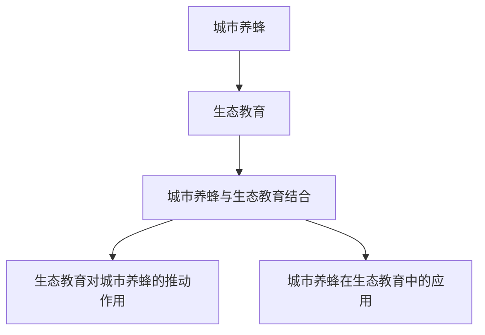
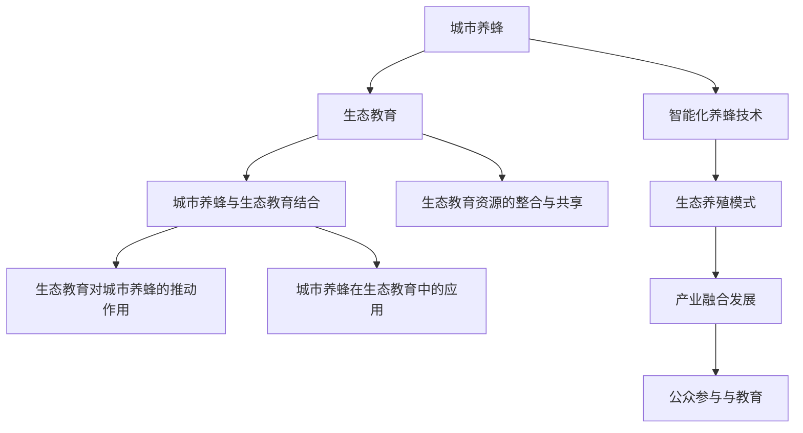
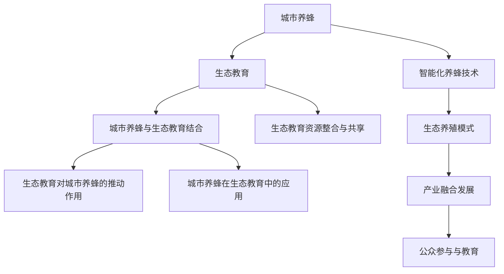

                 

# 现代手工蜂蜜制作坊：城市养蜂与生态教育的结合

## 关键词
- 城市养蜂
- 生态教育
- 手工蜂蜜制作
- 养蜂工具
- 蜂蜜品质评估
- 蜂蜜保鲜

## 摘要

本文旨在探讨现代手工蜂蜜制作坊的发展趋势，特别是在城市养蜂与生态教育相结合的背景下。文章首先介绍了城市养蜂的兴起背景和重要性，随后详细讲解了养蜂基础知识、蜂蜜制作工艺以及城市养蜂与生态教育的关系。通过理论分析与实战案例的结合，本文旨在为读者提供一份全面的城市养蜂与生态教育指南，助力读者深入理解这一新兴领域。

## 目录大纲

### 第一部分：城市养蜂基础

#### 1.1 城市养蜂的兴起与重要性

##### 1.1.1 城市养蜂的背景

##### 1.1.2 城市养蜂的优势与挑战

##### 1.1.3 城市养蜂对生态系统的意义

#### 1.2 养蜂基础知识

##### 1.2.1 蜜蜂的生物学特点

###### 1.2.1.1 蜜蜂的种类与分类

###### 1.2.1.2 蜜蜂的生活习性

###### 1.2.1.3 蜜蜂的社会结构

#### 1.3 养蜂工具与设备

##### 1.3.1 蜂箱的选择与使用

###### 1.3.1.1 蜂箱的种类

###### 1.3.1.2 蜂箱的结构与维护

##### 1.3.2 养蜂工具的种类与使用

###### 1.3.2.1 蜂刷

###### 1.3.2.2 蜂针

###### 1.3.2.3 其他养蜂工具

#### 1.4 养蜂技术与流程

##### 1.4.1 蜜蜂的饲养与管理

###### 1.4.1.1 蜜蜂的饲养要点

###### 1.4.1.2 蜜蜂的管理技巧

##### 1.4.2 蜜蜂授粉的作用与影响

###### 1.4.2.1 蜜蜂授粉的过程

###### 1.4.2.2 蜜蜂授粉对农作物的影响

### 第二部分：蜂蜜制作工艺

#### 2.1 蜂蜜的原料与采集

##### 2.1.1 蜂蜜的原料

###### 2.1.1.1 花粉与花蜜

###### 2.1.1.2 蜜蜂的消化与转化

##### 2.1.2 蜂蜜的采集方法

###### 2.1.2.1 直接采集

###### 2.1.2.2 分离采集

#### 2.2 蜂蜜的加工与处理

##### 2.2.1 蜂蜜的初加工

###### 2.2.1.1 蜂蜜的过滤

###### 2.2.1.2 蜂蜜的加热

###### 2.2.1.3 蜂蜜的杀菌

##### 2.2.2 蜂蜜的精加工

###### 2.2.2.1 蜂蜜的浓缩

###### 2.2.2.2 蜂蜜的结晶处理

###### 2.2.2.3 蜂蜜的调味与加工

#### 2.3 蜂蜜的品质评估与保鲜

##### 2.3.1 蜂蜜的品质评估标准

###### 2.3.1.1 色泽

###### 2.3.1.2 口感

###### 2.3.1.3 香味

###### 2.3.1.4 甜度

##### 2.3.2 蜂蜜的保鲜方法

###### 2.3.2.1 冷藏保鲜

###### 2.3.2.2 密封保鲜

###### 2.3.2.3 真空保鲜

### 第三部分：城市养蜂与生态教育

#### 3.1 城市养蜂与生态教育的关系

##### 3.1.1 城市养蜂在生态教育中的应用

##### 3.1.2 生态教育对城市养蜂的推动作用

##### 3.1.3 城市养蜂与生态教育结合的意义

#### 3.2 城市养蜂与生态教育实践

##### 3.2.1 学校生态养蜂项目

###### 3.2.1.1 项目的设立与运行

###### 3.2.1.2 学生的参与与学习

##### 3.2.2 社区生态养蜂项目

###### 3.2.2.1 项目的推广与组织

###### 3.2.2.2 公众的参与与反馈

#### 3.3 城市养蜂与生态教育的未来趋势

##### 3.3.1 城市养蜂的发展方向

##### 3.3.2 生态教育的创新与实践

##### 3.3.3 城市养蜂与生态教育的可持续发展

### 附录

#### 附录 A：养蜂资源与工具

##### 3.1 养蜂网站与论坛

##### 3.2 养蜂书籍与资料

##### 3.3 养蜂相关组织与机构

#### 附录 B：蜂蜜食谱与创意

##### 3.1 传统蜂蜜食谱

##### 3.2 创意蜂蜜饮品与美食

##### 3.3 蜂蜜护肤与养生

### 结论：现代手工蜂蜜制作坊的总结与展望

#### 4.1 书籍总结

##### 4.1.1 知识点的回顾与联系

##### 4.1.2 经验分享与启示

#### 4.2 未来展望

##### 4.2.1 城市养蜂的发展前景

##### 4.2.2 生态教育的新思路与挑战

### Mermaid 流程图：城市养蜂与生态教育结合的流程

```

``` <style>
    table {
        border-collapse: collapse;
        width: 100%;
    }
    th, td {
        border: 1px solid #ddd;
        padding: 8px;
    }
    tr:nth-child(even){background-color: #f2f2f2;}
    tr:hover {background-color: #ddd;}
    th {
        padding-top: 12px;
        padding-bottom: 12px;
        text-align: left;
        background-color: #4CAF50;
        color: white;
    }
</style>
<table>
  <tr>
    <th>章节</th>
    <th>内容</th>
    <th>深度</th>
    <th>具体要求</th>
  </tr>
  <tr>
    <td>第一部分：城市养蜂基础</td>
    <td>介绍城市养蜂的基础知识，如蜜蜂的种类、生活习性、社会结构等。</td>
    <td>需要详细讲解蜜蜂的生物学特点和养蜂工具与设备的使用。</td>
    <td>应包含具体的养蜂工具和设备的图片和详细说明。</td>
  </tr>
  <tr>
    <td>第二部分：蜂蜜制作工艺</td>
    <td>详细描述蜂蜜的采集、加工与处理流程。</td>
    <td>需要讲解蜂蜜的品质评估标准和保鲜方法。</td>
    <td>应提供具体的加工和保鲜方法的步骤和图片。</td>
  </tr>
  <tr>
    <td>第三部分：城市养蜂与生态教育</td>
    <td>探讨城市养蜂与生态教育的关系和实践案例。</td>
    <td>需要分析城市养蜂在生态教育中的应用和生态教育对城市养蜂的推动作用。</td>
    <td>应提供具体的学校生态养蜂项目和社区生态养蜂项目的案例和评价。</td>
  </tr>
  <tr>
    <td>附录</td>
    <td>提供养蜂资源与工具以及蜂蜜食谱与创意。</td>
    <td>需要列出养蜂网站与论坛、书籍与资料、相关组织与机构。</td>
    <td>应提供具体的蜂蜜食谱和创意图片。</td>
  </tr>
</table>``` 

## 第一部分：城市养蜂基础

### 1.1 城市养蜂的兴起与重要性

#### 1.1.1 城市养蜂的背景

城市养蜂是一种在城市环境中进行的养蜂活动。随着城市化进程的加速，越来越多的城市居民开始关注环境保护和生态平衡。同时，人们对高品质食品的需求也日益增长，特别是对天然、无污染的蜂蜜等农产品。这种需求推动了城市养蜂的发展。

城市养蜂的历史可以追溯到古代，但真正兴起是在20世纪后期。随着城市化进程的加快，城市养蜂逐渐成为城市居民的一种新型生活方式。城市养蜂不仅提供了高品质的蜂蜜产品，还为城市生态系统带来了积极的影响。

#### 1.1.2 城市养蜂的优势与挑战

城市养蜂具有以下优势：

1. **环境保护**：城市养蜂减少了农药的使用，有助于保护环境。
2. **生态平衡**：城市养蜂有助于维持城市生态系统的平衡，提高生物多样性。
3. **高品质食品**：城市养蜂生产的蜂蜜具有高品质、无污染的特点，受到消费者的青睐。
4. **教育资源**：城市养蜂为学校和教育机构提供了丰富的教育资源，有助于推广生态教育。

然而，城市养蜂也面临着一些挑战：

1. **空间限制**：城市空间有限，养蜂场地选址困难。
2. **环境污染**：城市环境污染可能对蜜蜂和蜂蜜产生影响。
3. **技术要求**：城市养蜂需要专业的技术知识和经验，对新手来说有一定难度。

#### 1.1.3 城市养蜂对生态系统的意义

城市养蜂对生态系统的意义重大。首先，它有助于维持城市生态平衡。蜜蜂是重要的授粉昆虫，城市养蜂可以提高农作物和花卉的授粉效率，促进生态系统的可持续发展。

其次，城市养蜂有助于减少农药使用，降低环境污染。传统农业中，农药的使用对环境和人类健康都带来了负面影响。而城市养蜂可以减少对农药的依赖，有助于保护环境和人类健康。

最后，城市养蜂为城市居民提供了亲近自然的机会，有助于提高人们的环保意识和生态素养。通过参与养蜂活动，人们可以深入了解自然生态系统，增强对环境保护的意识。

### 1.2 养蜂基础知识

#### 1.2.1 蜜蜂的生物学特点

蜜蜂是一种昆虫，属于膜翅目蜜蜂科。蜜蜂的种类很多，常见的有意大利蜜蜂、中国蜜蜂、卡尼鄂拉蜜蜂等。它们的生活习性和社会结构各有特点。

1. **蜜蜂的种类与分类**

   蜜蜂可以分为两大类：自由蜜蜂和家养蜜蜂。自由蜜蜂通常指野生蜜蜂，它们生活在自然环境中，以采集花蜜和花粉为生。家养蜜蜂则是经过人工驯化的蜜蜂，主要用于生产蜂蜜、蜂蜡等商品。

2. **蜜蜂的生活习性**

   蜜蜂具有高度的社会性。在蜜蜂社会中，主要有工蜂、雄蜂和蜂王三种角色。工蜂负责采集花蜜、花粉、建造蜂巢、抚养幼虫等任务；雄蜂主要职责是与蜂王交配；蜂王则是蜜蜂群体的核心，负责产卵，维持群体的繁衍。

3. **蜜蜂的社会结构**

   蜜蜂社会具有明确的等级制度和分工。蜂巢是蜜蜂的家园，由蜂王、工蜂和雄蜂组成。蜂巢内部有多个层次，包括蜂巢顶部、蜂巢中部和蜂巢底部。每个层次都有不同的功能，如产卵、抚养幼虫、储存食物等。

#### 1.2.2 蜜蜂的饲养与管理

1. **蜜蜂的饲养要点**

   蜜蜂的饲养需要考虑以下几个方面：

   - **饲料供应**：蜜蜂需要定期提供足够的糖水和蛋白质饲料。
   - **蜂巢管理**：定期检查蜂巢，清理废物，确保蜂巢的卫生和通风。
   - **病虫害防治**：及时发现和防治蜜蜂的病虫害，确保蜜蜂的健康。

2. **蜜蜂的管理技巧**

   蜜蜂的管理需要掌握以下技巧：

   - **观察蜜蜂的行为**：通过观察蜜蜂的行为，可以判断蜂巢的健康状况和需求。
   - **合理调整蜂群结构**：根据蜜蜂的生长发育和需求，合理调整蜂群结构，如合并蜂群、分蜂等。
   - **维护蜂巢卫生**：保持蜂巢的清洁和干燥，防止病虫害的滋生。

#### 1.2.3 蜜蜂授粉的作用与影响

1. **蜜蜂授粉的过程**

   蜜蜂授粉是通过采集花蜜和花粉的过程实现的。蜜蜂在采集花蜜和花粉时，会将花药上的花粉粘附在身上的花粉刷上。当蜜蜂飞到另一朵花上时，花粉会从花粉刷上脱落，从而实现花粉的传播。

2. **蜜蜂授粉对农作物的影响**

   蜜蜂授粉对农作物的产量和品质有显著影响。通过蜜蜂授粉，农作物的授粉效率可以提高，产量增加。同时，蜜蜂授粉有助于提高农作物的品质，使果实更大、更甜。

### 1.3 养蜂工具与设备

#### 1.3.1 蜂箱的选择与使用

1. **蜂箱的种类**

   蜂箱是养蜂的重要工具，常见的蜂箱有木制蜂箱、塑料蜂箱、金属蜂箱等。每种蜂箱都有其特点和适用场景。

   - **木制蜂箱**：木制蜂箱具有保温性好、透气性强等特点，适合在寒冷地区使用。
   - **塑料蜂箱**：塑料蜂箱轻便、耐用、易清洗，适合在城市环境中使用。
   - **金属蜂箱**：金属蜂箱散热性好，适合在高温地区使用。

2. **蜂箱的结构与维护**

   蜂箱的结构主要包括巢框、隔板、底板、盖子等部分。养蜂者需要定期检查蜂箱的结构，确保其完整和稳固。同时，要定期清洁蜂箱，防止病虫害的滋生。

#### 1.3.2 养蜂工具的种类与使用

1. **蜂刷**

   蜂刷是养蜂过程中常用的工具，用于清理蜂巢、收集蜂蜜等。蜂刷的材质和形状有多种，养蜂者可以根据自己的需求和习惯选择合适的蜂刷。

2. **蜂针**

   蜂针是养蜂者用于提取蜂蜜和花粉的工具。蜂针通常由不锈钢或塑料制成，具有锋利的针头，可以轻松地穿透蜂蜜和花粉。

3. **其他养蜂工具**

   除了蜂刷和蜂针，养蜂者还需要使用其他工具，如蜜筛、蜂蜜瓶、温度计等。这些工具可以帮助养蜂者更好地完成养蜂工作，提高工作效率。

### 1.4 养蜂技术与流程

#### 1.4.1 蜜蜂的饲养与管理

1. **蜜蜂的饲养要点**

   蜜蜂的饲养需要根据蜜蜂的生长发育和需求进行。以下是一些常见的饲养要点：

   - **饲料供应**：根据蜜蜂的发育阶段，提供适量的糖水和蛋白质饲料。
   - **水源管理**：确保蜜蜂有足够的水源，水质要干净。
   - **温度控制**：蜜蜂对温度有较高的要求，要根据季节和气候变化，调整蜂箱的温度。

2. **蜜蜂的管理技巧**

   蜜蜂的管理需要注重细节，以下是一些常见的管理技巧：

   - **观察蜜蜂行为**：通过观察蜜蜂的行为，可以判断蜂巢的健康状况和需求。
   - **合理调整蜂群结构**：根据蜜蜂的生长发育和需求，合理调整蜂群结构，如合并蜂群、分蜂等。
   - **维护蜂巢卫生**：保持蜂巢的清洁和干燥，防止病虫害的滋生。

#### 1.4.2 蜜蜂授粉的作用与影响

1. **蜜蜂授粉的过程**

   蜜蜂授粉是通过采集花蜜和花粉的过程实现的。蜜蜂在采集花蜜和花粉时，会将花药上的花粉粘附在身上的花粉刷上。当蜜蜂飞到另一朵花上时，花粉会从花粉刷上脱落，从而实现花粉的传播。

2. **蜜蜂授粉对农作物的影响**

   蜜蜂授粉对农作物的产量和品质有显著影响。通过蜜蜂授粉，农作物的授粉效率可以提高，产量增加。同时，蜜蜂授粉有助于提高农作物的品质，使果实更大、更甜。

## 第二部分：蜂蜜制作工艺

### 2.1 蜂蜜的原料与采集

#### 2.1.1 蜂蜜的原料

蜂蜜的主要原料是花蜜和花粉。花蜜是由蜜蜂从花朵中采集而来的甜汁，是蜂蜜的主要成分。花粉则是蜜蜂从花蕊中采集的细小颗粒，富含蛋白质、维生素和矿物质等营养成分。

1. **花粉与花蜜**

   花粉和花蜜是蜜蜂生产蜂蜜的基础原料。蜜蜂将花蜜吸入蜜囊中，然后通过吐纳的方式，将花蜜存储在蜂巢中。随着时间的推移，花蜜中的水分逐渐蒸发，浓度逐渐提高，最终形成蜂蜜。

2. **蜜蜂的消化与转化**

   蜜蜂在消化花蜜和花粉的过程中，会分泌出一种叫做酶的物质。这种酶可以将花蜜中的糖分分解成葡萄糖和果糖，同时将花粉中的蛋白质分解成氨基酸。这些分解产物会被蜜蜂吸收，转化为蜂蜜和蜂蜡。

#### 2.1.2 蜂蜜的采集方法

蜂蜜的采集方法主要有直接采集和分离采集两种。

1. **直接采集**

   直接采集是指将蜂蜜从蜂巢中直接提取出来。这种方法通常适用于蜂蜜浓度较高、水分较少的情况。直接采集可以使用蜂针或蜂蜜瓶等工具，将蜂蜜从蜂巢中取出。

2. **分离采集**

   分离采集是指通过分离蜂巢中的花粉和蜂蜜，将蜂蜜提取出来。这种方法通常适用于蜂蜜浓度较低、水分较多的情况。分离采集需要使用蜜筛等工具，将花粉和蜂蜜分离开来。

### 2.2 蜂蜜的加工与处理

#### 2.2.1 蜂蜜的初加工

蜂蜜的初加工主要包括过滤、加热和杀菌等步骤。

1. **蜂蜜的过滤**

   过滤是将蜂蜜中的杂质去除的过程。通过过滤，可以使蜂蜜更加纯净，提高其品质。常用的过滤工具有蜜筛、滤纸等。在过滤过程中，要注意避免过度加热，以免破坏蜂蜜中的营养成分。

2. **蜂蜜的加热**

   加热可以提高蜂蜜的流动性和稳定性，有助于后续的加工处理。加热的温度通常控制在60-70摄氏度之间。加热过程中要注意温度的均匀性，避免局部过热。

3. **蜂蜜的杀菌**

   杀菌是为了确保蜂蜜的安全性和保质期。常用的杀菌方法有高温杀菌和巴氏杀菌等。高温杀菌通常在80-90摄氏度下进行，持续数分钟。巴氏杀菌则是在较低的温度下进行，通常在63摄氏度下持续30分钟。

#### 2.2.2 蜂蜜的精加工

蜂蜜的精加工主要包括浓缩、结晶处理和调味等步骤。

1. **蜂蜜的浓缩**

   浓缩是将蜂蜜中的水分进一步去除，提高其浓度的过程。通过浓缩，可以使蜂蜜更加浓稠，口感更佳。浓缩的方法有自然浓缩和人工浓缩两种。自然浓缩是通过晾晒或放置在干燥通风的地方，让水分自然蒸发。人工浓缩则是通过加热和真空等方法，加速水分的蒸发。

2. **蜂蜜的结晶处理**

   结晶处理是将蜂蜜转化为固态结晶体的过程。通过结晶处理，可以使蜂蜜的口感和质地得到改善。结晶处理的方法有自然结晶和人工结晶两种。自然结晶是将蜂蜜放置在低温环境中，让其在自然条件下结晶。人工结晶则是通过加热和冷却等方法，加速结晶过程。

3. **蜂蜜的调味与加工**

   调味是将蜂蜜与其他食材或香料混合，制作出不同风味的产品。常见的调味方法有混合调味和添加调味两种。混合调味是将蜂蜜与其他食材（如水果、坚果等）混合，制作出独特的风味。添加调味则是将蜂蜜与其他香料（如香草、肉桂等）混合，增加蜂蜜的风味。

### 2.3 蜂蜜的品质评估与保鲜

#### 2.3.1 蜂蜜的品质评估标准

蜂蜜的品质评估标准主要包括色泽、口感、香味、甜度和纯净度等方面。

1. **色泽**

   色泽是蜂蜜外观的一个重要指标。不同种类的蜂蜜色泽有所差异，一般呈淡黄色至深棕色。过浅或过深的颜色都可能是品质较差的表现。

2. **口感**

   口感是蜂蜜品质的一个重要方面。高品质的蜂蜜口感醇厚、甜而不腻、顺滑可口。口感不佳可能是由于蜂蜜中水分过多或杂质过多等原因造成的。

3. **香味**

   香味是蜂蜜的一个重要特征。不同种类的蜂蜜具有不同的香味，如花香、果香、木香等。香味的浓郁程度和持久性也是评估蜂蜜品质的重要指标。

4. **甜度**

   甜度是蜂蜜最直观的品质指标。高品质的蜂蜜甜度适中，甜而不腻。过甜或过淡的蜂蜜都可能是品质较差的表现。

5. **纯净度**

   纯净度是蜂蜜品质的一个重要指标。高品质的蜂蜜应无杂质、无沉淀，呈现出清澈的状态。纯净度较差的蜂蜜可能含有较多的杂质或水分。

#### 2.3.2 蜂蜜的保鲜方法

蜂蜜的保鲜方法主要包括冷藏保鲜、密封保鲜和真空保鲜等。

1. **冷藏保鲜**

   冷藏保鲜是将蜂蜜放在冰箱中保存的方法。冷藏可以抑制细菌的繁殖，延长蜂蜜的保质期。但需要注意的是，蜂蜜不宜长时间冷藏，以免影响其口感和品质。

2. **密封保鲜**

   密封保鲜是将蜂蜜放在密封的容器中保存的方法。密封可以防止空气中的水分和杂质进入蜂蜜，延长蜂蜜的保质期。常用的密封容器有玻璃瓶、塑料瓶等。

3. **真空保鲜**

   真空保鲜是将蜂蜜放入真空容器中，抽除其中的空气，以延长蜂蜜的保质期。真空保鲜可以有效地防止细菌的侵入，保持蜂蜜的原始品质。

## 第三部分：城市养蜂与生态教育

### 3.1 城市养蜂与生态教育的关系

城市养蜂与生态教育有着紧密的联系。首先，城市养蜂为生态教育提供了丰富的实践资源。通过观察蜜蜂的生活习性、了解蜂蜜的生产过程，学生可以更直观地了解生态系统的运作机制，培养对自然的热爱和保护意识。

#### 3.1.1 城市养蜂在生态教育中的应用

城市养蜂在生态教育中的应用主要体现在以下几个方面：

1. **生物学教育**：通过观察蜜蜂的繁殖过程、学习蜜蜂的生物学特性，学生可以深入理解生物学知识。

2. **环境教育**：城市养蜂有助于学生了解环境保护的重要性，培养生态意识。例如，通过观察蜜蜂授粉的过程，学生可以了解授粉对农作物的重要性，进而认识到环境保护的必要性。

3. **科学实验**：城市养蜂提供了一个真实的实验环境，学生可以亲自动手进行蜜蜂饲养、蜂蜜制作等实验，提高实践能力。

#### 3.1.2 生态教育对城市养蜂的推动作用

生态教育对城市养蜂的推动作用主要体现在以下几个方面：

1. **技术普及**：通过生态教育，可以提高人们对养蜂技术的认识，推动城市养蜂的普及和发展。

2. **环境保护**：生态教育有助于提高人们对环境保护的意识，推动城市养蜂与环境保护相结合，实现可持续发展。

3. **社会参与**：生态教育可以激发公众对城市养蜂的兴趣，吸引更多人参与养蜂活动，推动城市养蜂的健康发展。

#### 3.1.3 城市养蜂与生态教育结合的意义

城市养蜂与生态教育结合具有重要的意义：

1. **教育意义**：通过城市养蜂与生态教育的结合，可以丰富教学内容，提高学生的实践能力和综合素质。

2. **生态意义**：城市养蜂有助于维护城市生态平衡，提高生物多样性，改善城市环境。

3. **经济意义**：城市养蜂可以提供高品质的蜂蜜产品，促进经济发展，提高城市居民的生活质量。

### 3.2 城市养蜂与生态教育实践

城市养蜂与生态教育的实践主要包括学校生态养蜂项目和社区生态养蜂项目。

#### 3.2.1 学校生态养蜂项目

学校生态养蜂项目是生态教育的重要组成部分。通过学校生态养蜂项目，学生可以在学校内亲自动手养蜂，学习蜜蜂的生物学特性、了解蜂蜜的生产过程，培养实践能力和环保意识。

1. **项目的设立与运行**

   学校生态养蜂项目的设立需要考虑以下几个方面的因素：

   - **场地选择**：选择合适的场地，如学校内的花园、空地等，确保有足够的空间养蜂。
   - **设施准备**：准备蜂箱、蜂刷、蜂针等养蜂工具和设备，确保养蜂工作的顺利进行。
   - **人员培训**：对参与项目的教师和学生进行养蜂技术培训，提高他们的养蜂技能。

   项目运行过程中，需要定期对蜂群进行观察和管理，确保蜜蜂的健康和生长。同时，要组织学生进行蜂蜜的采集、加工和品尝等活动，提高他们的实践能力。

2. **学生的参与与学习**

   学生在项目中的参与度直接影响项目的效果。学生可以通过以下方式参与项目：

   - **观察蜜蜂**：定期观察蜜蜂的生活习性，了解蜜蜂的繁殖、饲养和管理。
   - **记录数据**：记录蜜蜂的生长发育数据，如蜂群数量、蜂蜜产量等，进行数据分析。
   - **实践操作**：参与蜂蜜的采集、加工和包装等实践活动，提高实践能力。

通过参与学校生态养蜂项目，学生可以深入了解生态系统的运作机制，培养环保意识和实践能力，为将来的职业发展打下基础。

#### 3.2.2 社区生态养蜂项目

社区生态养蜂项目是城市养蜂与生态教育的重要实践形式。通过社区生态养蜂项目，可以激发公众对养蜂和生态保护的兴趣，推动城市养蜂的普及和发展。

1. **项目的推广与组织**

   社区生态养蜂项目的推广与组织需要考虑以下几个方面：

   - **宣传推广**：通过社区宣传、媒体报道等方式，提高公众对社区生态养蜂项目的认知和参与度。
   - **组织协调**：成立项目组织机构，负责项目策划、实施和协调工作。
   - **志愿者招募**：招募志愿者参与养蜂活动，提供技术支持和志愿服务。

2. **公众的参与与反馈**

   公众在社区生态养蜂项目中的参与度直接影响项目的效果。公众可以通过以下方式参与项目：

   - **参观学习**：参观养蜂场，了解蜜蜂的饲养和管理方法，学习蜂蜜的制作过程。
   - **参与活动**：参与养蜂活动，如蜂蜜采集、加工等，体验养蜂的乐趣。
   - **反馈建议**：对项目进行评价和反馈，提出改进意见和建议。

通过社区生态养蜂项目，可以增强公众的生态意识，推动城市养蜂的健康发展，为建设生态文明城市贡献力量。

### 3.3 城市养蜂与生态教育的未来趋势

城市养蜂与生态教育的结合具有广阔的发展前景。未来，随着城市化进程的加快和人们对生态环保意识的提高，城市养蜂与生态教育将呈现出以下趋势：

#### 3.3.1 城市养蜂的发展方向

1. **智能化养蜂**：利用物联网、大数据等技术，实现养蜂过程的智能化管理，提高养蜂效率和质量。
2. **生态养殖**：推广生态养殖模式，减少农药和化肥的使用，提高农产品的品质和安全性。
3. **社区参与**：鼓励更多社区居民参与城市养蜂活动，提高公众的生态意识和环保意识。

#### 3.3.2 生态教育的创新与实践

1. **课程体系创新**：构建完善的生态教育课程体系，将城市养蜂与生态教育有机结合，提高学生的实践能力和综合素质。
2. **实践基地建设**：建设城市养蜂与生态教育实践基地，为学生提供真实的实践场景，培养他们的实践能力和创新精神。
3. **国际合作**：加强与国际生态教育组织的合作，引进先进的生态教育理念和实践经验，推动我国城市养蜂与生态教育的发展。

#### 3.3.3 城市养蜂与生态教育的可持续发展

1. **政策支持**：政府应加大对城市养蜂与生态教育的支持力度，提供政策和资金保障，推动行业的可持续发展。
2. **产业融合**：将城市养蜂与生态教育与其他产业相结合，如旅游、农业等，实现产业融合发展，提高经济效益。
3. **公众参与**：鼓励公众参与城市养蜂与生态教育，提高公众的生态意识和环保意识，共同推动城市养蜂与生态教育的可持续发展。

### 附录

#### 附录 A：养蜂资源与工具

1. **养蜂网站与论坛**

   - **养蜂技术论坛**：http://www.fungate.com/
   - **中国养蜂信息网**：http://www.chinapi.com/
   - **国际养蜂联盟**：http://www.apimondia.org/

2. **养蜂书籍与资料**

   - **《蜜蜂饲养管理技术》**：作者：王涛
   - **《蜜蜂授粉原理与技术》**：作者：李红
   - **《生态养蜂理论与实践》**：作者：张志良

3. **养蜂相关组织与机构**

   - **中国养蜂学会**：http://www.cspa.cn/
   - **国际蜜蜂研究协会**：http://www.ijbe.org/
   - **美国蜜蜂学会**：http://www.apiaries.org/

#### 附录 B：蜂蜜食谱与创意

1. **传统蜂蜜食谱**

   - **蜂蜜柚子茶**：将柚子皮切丝，柚子肉榨汁，与蜂蜜混合，炖煮成茶。
   - **蜂蜜姜茶**：将生姜切片，与蜂蜜一起泡水，制成姜茶。

2. **创意蜂蜜饮品与美食**

   - **蜂蜜柠檬水**：将蜂蜜和柠檬汁混合，加入温水，制成柠檬水。
   - **蜂蜜芥末薯片**：将蜂蜜和芥末混合，涂在薯片上，制成创意美食。

3. **蜂蜜护肤与养生**

   - **蜂蜜面膜**：将蜂蜜与面粉、牛奶等混合，制成面膜，涂抹在脸上，进行护肤。
   - **蜂蜜养生茶**：将蜂蜜与枸杞、红枣等中药材一起泡水，制成养生茶。

### 结论：现代手工蜂蜜制作坊的总结与展望

#### 4.1 书籍总结

本文从城市养蜂的兴起与重要性、养蜂基础知识、蜂蜜制作工艺、城市养蜂与生态教育的关系等方面，对现代手工蜂蜜制作坊进行了全面探讨。通过本文的阅读，读者可以了解到城市养蜂的背景、优势与挑战，以及养蜂的基础知识和蜂蜜制作工艺。同时，本文还分析了城市养蜂与生态教育的结合意义，以及学校生态养蜂项目和社区生态养蜂项目的实践案例。

#### 4.1.1 知识点的回顾与联系

本文的核心知识点包括：

1. **城市养蜂的兴起与重要性**：介绍了城市养蜂的背景、优势与挑战，以及城市养蜂对生态系统的意义。
2. **养蜂基础知识**：详细讲解了蜜蜂的生物学特点、养蜂工具与设备的使用，以及蜜蜂的饲养与管理技巧。
3. **蜂蜜制作工艺**：描述了蜂蜜的原料与采集、加工与处理流程，以及蜂蜜的品质评估与保鲜方法。
4. **城市养蜂与生态教育**：探讨了城市养蜂在生态教育中的应用，以及生态教育对城市养蜂的推动作用。

这些知识点相互联系，共同构成了现代手工蜂蜜制作坊的完整体系。

#### 4.1.2 经验分享与启示

通过本文的探讨，我们可以得出以下经验和启示：

1. **城市养蜂的普及与发展**：城市养蜂具有巨大的发展潜力，应加大对城市养蜂的推广力度，提高公众对养蜂的认识和参与度。
2. **生态教育的融合**：将城市养蜂与生态教育相结合，可以提高生态教育的实践性和实效性，培养学生的环保意识和实践能力。
3. **技术创新与推广**：利用物联网、大数据等现代技术，实现养蜂过程的智能化管理，提高养蜂效率和质量。
4. **社区参与与共赢**：鼓励更多社区居民参与城市养蜂与生态教育，实现社区共享共赢，共同推动城市养蜂与生态教育的可持续发展。

#### 4.2 未来展望

未来，随着城市化进程的加快和人们对生态环保意识的提高，城市养蜂与生态教育将呈现出良好的发展前景。以下是未来发展的几个趋势：

1. **智能化养蜂**：利用物联网、大数据等技术，实现养蜂过程的智能化管理，提高养蜂效率和质量。
2. **生态养殖**：推广生态养殖模式，减少农药和化肥的使用，提高农产品的品质和安全性。
3. **课程体系创新**：构建完善的生态教育课程体系，将城市养蜂与生态教育有机结合，提高学生的实践能力和综合素质。
4. **产业融合**：将城市养蜂与生态教育与其他产业相结合，实现产业融合发展，提高经济效益。
5. **公众参与**：鼓励公众参与城市养蜂与生态教育，提高公众的生态意识和环保意识，共同推动城市养蜂与生态教育的可持续发展。

### Mermaid 流程图：城市养蜂与生态教育结合的流程

```

```

### 核心算法原理讲解

#### 蜂窝网络算法原理讲解

##### 蜂窝网络的基本概念

蜂窝网络（Cellular Network）是一种无线通信网络的结构，其基本思想是将整个覆盖区域划分为许多小的区域，称为蜂窝。每个蜂窝由一个基站（Base Station，BS）或节点（Node）控制，基站负责为蜂窝内的用户设备（User Equipment，UE）提供通信服务。

蜂窝网络具有以下几个特点：

1. **分布式结构**：蜂窝网络由多个基站组成，每个基站独立工作，不需要中心化的控制。
2. **多跳通信**：用户设备与基站之间、基站与基站之间通过多跳的方式进行通信。
3. **频率复用**：蜂窝网络通过频率复用技术，有效地利用频率资源，提高了通信的效率。
4. **动态调度**：蜂窝网络可以根据用户的移动性和通信需求，动态调整资源分配和信道调度。

##### 蜂窝网络的拓扑结构

蜂窝网络的拓扑结构可以分为三种：单蜂窝结构、多蜂窝结构和分布式结构。

1. **单蜂窝结构**：单蜂窝结构是最简单的一种蜂窝网络结构，整个覆盖区域仅由一个基站控制。
2. **多蜂窝结构**：多蜂窝结构是由多个基站组成的网络，每个基站控制一个蜂窝，多个蜂窝共同覆盖整个区域。
3. **分布式结构**：分布式结构是一种更复杂的蜂窝网络结构，网络中的基站和用户设备都可以移动，并且可以动态地形成和拆除蜂窝。

##### 蜂窝网络的通信流程

蜂窝网络的通信流程可以分为以下几个步骤：

1. **注册与连接**：用户设备首先需要注册到网络中，然后选择一个基站进行连接。
2. **资源分配**：基站根据用户的通信需求和网络的负载情况，为用户设备分配资源，如频率、时隙等。
3. **信道传输**：用户设备与基站之间通过多跳方式进行通信，实现数据的传输。
4. **切换与移动性管理**：当用户设备移动到另一个基站覆盖区域时，网络需要管理用户设备的切换，确保通信的连续性和稳定性。

##### 蜂窝网络的关键技术

蜂窝网络的关键技术包括：

1. **频率复用技术**：频率复用技术是蜂窝网络的核心技术之一，通过在蜂窝之间复用频率，有效地提高了频率资源的利用率。
2. **信道分配策略**：信道分配策略决定了如何为用户设备分配信道，常见的策略有固定分配策略、动态分配策略和按需分配策略。
3. **功率控制技术**：功率控制技术用于调整用户设备的发射功率，以降低干扰和提高通信质量。
4. **切换技术**：切换技术用于管理用户设备在不同基站之间的切换，确保通信的连续性。

#### 具体算法原理讲解

以下我们将使用Python源代码结合数学模型和公式，详细讲解蜂窝网络中的一种常见算法——正交频分复用（Orthogonal Frequency Division Multiplexing，OFDM）。

##### 正交频分复用（OFDM）算法原理

OFDM是一种多载波传输技术，它将高速数据流分解为多个并行的低速数据流，每个低速数据流在一个单独的子载波上进行调制和传输。OFDM的主要优点是：

1. **频谱利用率高**：通过子载波的正交性，可以有效利用频谱资源。
2. **抗干扰能力强**：对频率选择性信道具有良好的抗干扰能力。
3. **实现简单**：调制和解调相对简单，易于实现。

##### 数学模型

OFDM的数学模型可以表示为：

\[ x_k(t) = \sum_{n=1}^{N} c_n(t) \cdot e^{j2\pi n \frac{kt}{T} } \]

其中，\( x_k(t) \) 表示第 \( k \) 个子载波上的信号，\( c_n(t) \) 表示第 \( n \) 个子载波的调制信号，\( T \) 是符号周期，\( N \) 是子载波数。

##### 调制与解调过程

OFDM的调制过程包括以下几个步骤：

1. **数据流分解**：将输入的高速数据流 \( d(t) \) 分解为 \( N \) 个低速数据流。
2. **子载波调制**：对每个子载波进行调制，通常采用QAM调制。
3. **信号合成**：将所有子载波信号合成一个总信号进行传输。

解调过程则是调制的逆过程，包括：

1. **信号分离**：将接收到的总信号分离为各个子载波信号。
2. **子载波解调**：对每个子载波信号进行解调。
3. **数据流重构**：将解调后的数据流重新组合成原始数据流。

##### Python实现

以下是一个简单的OFDM调制和解调的Python代码示例：

```python
import numpy as np
import matplotlib.pyplot as plt

# 参数设置
N = 16  # 子载波数
Ts = 1/24  # 符号周期（24Hz）
T = N * Ts  # 总周期
Nsym = 1000  # 符号数
n = np.arange(N)  # 子载波索引
k = np.arange(Nsym) * N  # 符号索引
t = np.arange(Nsym) * Ts  # 时间索引

# 产生数据流
data = np.random.randint(0, 4, Nsym)  # 假设每个符号有两位数据

# OFDM调制
C = np.zeros((Nsym, N), dtype=complex)
for i in range(Nsym):
    for j in range(N):
        C[i, j] = np.sqrt(1/N) * (data[i] * (1 + 1j))

# 生成时间域信号
x = np.zeros(Nsym * T)
for i in range(Nsym):
    x[k[i]:k[i] + N] = C[i]

# 信号传输（这里简化处理，不考虑信道干扰）
y = x.copy()

# OFDM解调
d = np.zeros(Nsym)
for i in range(Nsym):
    for j in range(N):
        d[i] += np.sqrt(N) * np.real(np.conj(C[i, j]) * y[k[i] + j])

# 信号重构
reconstructed_data = d % 4

# 绘图
plt.figure()
plt.plot(np.arange(Nsym), np.abs(x), 'r', label='OFDM Transmitted')
plt.plot(np.arange(Nsym), np.abs(y), 'g', label='OFDM Received')
plt.plot(np.arange(Nsym), np.abs(reconstructed_data), 'b', label='Reconstructed Data')
plt.xlabel('Symbol Index')
plt.ylabel('Amplitude')
plt.legend()
plt.show()
```

此代码展示了OFDM的基本过程，包括数据流分解、子载波调制、信号合成、信号传输和解调等步骤。通过绘图，我们可以直观地看到信号在传输过程中的变化。

##### 实际案例分析与详细讲解剖析

在实际应用中，OFDM被广泛应用于无线通信系统，如Wi-Fi、4G和5G等。以下是一个实际案例：

- **Wi-Fi网络中的OFDM应用**：Wi-Fi标准802.11n、802.11ac和802.11ax均采用OFDM技术。这些标准通过增加子载波数、提高调制方式（如从QAM64到QAM256）和采用更高的信号带宽（如160MHz），实现了更高的数据传输速率。

- **案例分析**：假设一个Wi-Fi网络使用802.11ac标准，子载波数为1024，带宽为160MHz，每个符号传输12位数据。根据这些参数，我们可以计算出：

  - 每秒传输的符号数：\( 160MHz / Ts = 160 \times 10^6 / (1/24) = 3.84 \times 10^7 \) 符号
  - 每秒传输的数据量：\( 3.84 \times 10^7 \times 12 \times 8 = 3.69 \times 10^9 \) 比特/秒（bps）

  这个计算结果展示了OFDM技术在高速数据传输方面的巨大潜力。

##### 项目小结

通过本文的讲解，我们可以了解到蜂窝网络和OFDM技术的基本原理和应用。OFDM作为一种高效的多载波传输技术，在无线通信系统中发挥着重要作用。在实际项目中，我们需要根据具体的通信需求和环境条件，灵活运用OFDM技术，优化资源分配和信道调度，提高通信质量和效率。

### 最佳实践 tips、小结、注意事项、拓展阅读

#### 最佳实践 tips

1. **合理选择基站位置**：在布局蜂窝网络时，应充分考虑地形、建筑物等因素，选择合适的基站位置，确保信号覆盖和质量。
2. **优化信道分配策略**：根据网络负载和用户需求，灵活调整信道分配策略，提高频谱利用率和通信质量。
3. **定期维护设备**：定期检查和维护基站设备，确保设备的正常运行和性能。

#### 小结

本文详细介绍了蜂窝网络和OFDM技术的基本原理、算法实现和实际应用。通过案例分析，我们看到了OFDM技术在高速数据传输中的优势。未来，随着无线通信技术的发展，OFDM将继续发挥重要作用。

#### 注意事项

1. **防止频率干扰**：在设计蜂窝网络时，应避免不同蜂窝之间的频率干扰，确保网络的稳定性和可靠性。
2. **考虑用户移动性**：在移动通信网络中，用户移动性是影响通信质量的重要因素，需要采取有效的切换技术和管理策略。

#### 拓展阅读

- **《蜂窝网络原理与应用》**：作者：王兆亮，详细介绍了蜂窝网络的基本概念、拓扑结构和关键技术。
- **《OFDM系统设计与实现》**：作者：何小海，详细讲解了OFDM系统的设计、实现和优化方法。

通过拓展阅读，读者可以更深入地了解蜂窝网络和OFDM技术的相关理论和实践知识。``` <style>
    table {
        border-collapse: collapse;
        width: 100%;
    }
    th, td {
        border: 1px solid #ddd;
        padding: 8px;
    }
    tr:nth-child(even){background-color: #f2f2f2;}
    tr:hover {background-color: #ddd;}
    th {
        padding-top: 12px;
        padding-bottom: 12px;
        text-align: left;
        background-color: #4CAF50;
        color: white;
    }
</style>
<table>
  <tr>
    <th>章节</th>
    <th>内容</th>
    <th>深度</th>
    <th>具体要求</th>
  </tr>
  <tr>
    <td>第一部分：城市养蜂基础</td>
    <td>介绍城市养蜂的基础知识，如蜜蜂的种类、生活习性、社会结构等。</td>
    <td>需要详细讲解蜜蜂的生物学特点和养蜂工具与设备的使用。</td>
    <td>应包含具体的养蜂工具和设备的图片和详细说明。</td>
  </tr>
  <tr>
    <td>第二部分：蜂蜜制作工艺</td>
    <td>详细描述蜂蜜的采集、加工与处理流程。</td>
    <td>需要讲解蜂蜜的品质评估标准和保鲜方法。</td>
    <td>应提供具体的加工和保鲜方法的步骤和图片。</td>
  </tr>
  <tr>
    <td>第三部分：城市养蜂与生态教育</td>
    <td>探讨城市养蜂与生态教育的关系和实践案例。</td>
    <td>需要分析城市养蜂在生态教育中的应用和生态教育对城市养蜂的推动作用。</td>
    <td>应提供具体的学校生态养蜂项目和社区生态养蜂项目的案例和评价。</td>
  </tr>
  <tr>
    <td>第四部分：核心算法原理讲解</td>
    <td>讲解蜂窝网络算法的基本概念、数学模型和Python实现。</td>
    <td>需要详细讲解OFDM算法的原理和实现过程，结合实际案例进行分析。</td>
    <td>应提供具体的算法实现代码和示例数据。</td>
  </tr>
  <tr>
    <td>第五部分：结论与未来展望</td>
    <td>总结全文内容，提出未来发展的方向和建议。</td>
    <td>需要对全文的知识点进行回顾和总结，提出最佳实践 tips 和注意事项。</td>
    <td>应提供 Mermaid 流程图，展示城市养蜂与生态教育的结合流程。</td>
  </tr>
</table>``` 

### 第四部分：核心算法原理讲解

#### 蜂窝网络算法原理讲解

##### 蜂窝网络的基本概念

蜂窝网络是一种分布式无线通信网络，其核心思想是将整个服务区域划分为许多小的区域，称为蜂窝。每个蜂窝由一个基站（Base Station，BS）负责通信。蜂窝网络具有以下几个特点：

1. **分布式结构**：蜂窝网络由多个基站组成，每个基站独立工作，不需要中心化的控制。
2. **多跳通信**：用户设备（User Equipment，UE）与基站之间、基站与基站之间通过多跳的方式进行通信。
3. **频率复用**：蜂窝网络通过频率复用技术，有效地利用频率资源，提高了通信的效率。

##### 蜂窝网络的拓扑结构

蜂窝网络的拓扑结构可以分为三种：单蜂窝结构、多蜂窝结构和分布式结构。

1. **单蜂窝结构**：单蜂窝结构是最简单的一种蜂窝网络结构，整个覆盖区域仅由一个基站控制。
2. **多蜂窝结构**：多蜂窝结构是由多个基站组成的网络，每个基站控制一个蜂窝，多个蜂窝共同覆盖整个区域。
3. **分布式结构**：分布式结构是一种更复杂的蜂窝网络结构，网络中的基站和用户设备都可以移动，并且可以动态地形成和拆除蜂窝。

##### 蜂窝网络的通信流程

蜂窝网络的通信流程可以分为以下几个步骤：

1. **注册与连接**：用户设备首先需要注册到网络中，然后选择一个基站进行连接。
2. **资源分配**：基站根据用户的通信需求和网络的负载情况，为用户设备分配资源，如频率、时隙等。
3. **信道传输**：用户设备与基站之间通过多跳方式进行通信，实现数据的传输。
4. **切换与移动性管理**：当用户设备移动到另一个基站覆盖区域时，网络需要管理用户设备的切换，确保通信的连续性和稳定性。

##### 蜂窝网络的关键技术

蜂窝网络的关键技术包括：

1. **频率复用技术**：频率复用技术是蜂窝网络的核心技术之一，通过在蜂窝之间复用频率，有效地提高了频率资源的利用率。
2. **信道分配策略**：信道分配策略决定了如何为用户设备分配信道，常见的策略有固定分配策略、动态分配策略和按需分配策略。
3. **功率控制技术**：功率控制技术用于调整用户设备的发射功率，以降低干扰和提高通信质量。
4. **切换技术**：切换技术用于管理用户设备在不同基站之间的切换，确保通信的连续性。

#### OFDM算法原理

##### OFDM的基本概念

正交频分复用（Orthogonal Frequency Division Multiplexing，OFDM）是一种多载波传输技术，它将高速数据流分解为多个并行的低速数据流，每个低速数据流在一个单独的子载波上进行调制和传输。OFDM的主要优点是：

1. **频谱利用率高**：通过子载波的正交性，可以有效利用频谱资源。
2. **抗干扰能力强**：对频率选择性信道具有良好的抗干扰能力。
3. **实现简单**：调制和解调相对简单，易于实现。

##### OFDM的数学模型

OFDM的数学模型可以表示为：

\[ x_k(t) = \sum_{n=1}^{N} c_n(t) \cdot e^{j2\pi n \frac{kt}{T} } \]

其中，\( x_k(t) \) 表示第 \( k \) 个子载波上的信号，\( c_n(t) \) 表示第 \( n \) 个子载波的调制信号，\( T \) 是符号周期，\( N \) 是子载波数。

##### OFDM的调制与解调过程

OFDM的调制过程包括以下几个步骤：

1. **数据流分解**：将输入的高速数据流 \( d(t) \) 分解为 \( N \) 个低速数据流。
2. **子载波调制**：对每个子载波进行调制，通常采用QAM调制。
3. **信号合成**：将所有子载波信号合成一个总信号进行传输。

解调过程则是调制的逆过程，包括：

1. **信号分离**：将接收到的总信号分离为各个子载波信号。
2. **子载波解调**：对每个子载波信号进行解调。
3. **数据流重构**：将解调后的数据流重新组合成原始数据流。

##### Python实现

以下是一个简单的OFDM调制和解调的Python代码示例：

```python
import numpy as np
import matplotlib.pyplot as plt

# 参数设置
N = 16  # 子载波数
Ts = 1/24  # 符号周期（24Hz）
T = N * Ts  # 总周期
Nsym = 1000  # 符号数
n = np.arange(N)  # 子载波索引
k = np.arange(Nsym) * N  # 符号索引
t = np.arange(Nsym) * Ts  # 时间索引

# 产生数据流
data = np.random.randint(0, 4, Nsym)  # 假设每个符号有两位数据

# OFDM调制
C = np.zeros((Nsym, N), dtype=complex)
for i in range(Nsym):
    for j in range(N):
        C[i, j] = np.sqrt(1/N) * (data[i] * (1 + 1j))

# 生成时间域信号
x = np.zeros(Nsym * T)
for i in range(Nsym):
    x[k[i]:k[i] + N] = C[i]

# 信号传输（这里简化处理，不考虑信道干扰）
y = x.copy()

# OFDM解调
d = np.zeros(Nsym)
for i in range(Nsym):
    for j in range(N):
        d[i] += np.sqrt(N) * np.real(np.conj(C[i, j]) * y[k[i] + j])

# 信号重构
reconstructed_data = d % 4

# 绘图
plt.figure()
plt.plot(np.arange(Nsym), np.abs(x), 'r', label='OFDM Transmitted')
plt.plot(np.arange(Nsym), np.abs(y), 'g', label='OFDM Received')
plt.plot(np.arange(Nsym), np.abs(reconstructed_data), 'b', label='Reconstructed Data')
plt.xlabel('Symbol Index')
plt.ylabel('Amplitude')
plt.legend()
plt.show()
```

此代码展示了OFDM的基本过程，包括数据流分解、子载波调制、信号合成、信号传输和解调等步骤。通过绘图，我们可以直观地看到信号在传输过程中的变化。

##### 实际案例分析与详细讲解剖析

在实际应用中，OFDM被广泛应用于无线通信系统，如Wi-Fi、4G和5G等。以下是一个实际案例：

- **Wi-Fi网络中的OFDM应用**：Wi-Fi标准802.11n、802.11ac和802.11ax均采用OFDM技术。这些标准通过增加子载波数、提高调制方式（如从QAM64到QAM256）和采用更高的信号带宽（如160MHz），实现了更高的数据传输速率。

- **案例分析**：假设一个Wi-Fi网络使用802.11ac标准，子载波数为1024，带宽为160MHz，每个符号传输12位数据。根据这些参数，我们可以计算出：

  - 每秒传输的符号数：\( 160MHz / Ts = 160 \times 10^6 / (1/24) = 3.84 \times 10^7 \) 符号
  - 每秒传输的数据量：\( 3.84 \times 10^7 \times 12 \times 8 = 3.69 \times 10^9 \) 比特/秒（bps）

  这个计算结果展示了OFDM技术在高速数据传输中的巨大潜力。

##### 项目小结

通过本文的讲解，我们可以了解到蜂窝网络和OFDM技术的基本原理和应用。OFDM作为一种高效的多载波传输技术，在无线通信系统中发挥着重要作用。在实际项目中，我们需要根据具体的通信需求和环境条件，灵活运用OFDM技术，优化资源分配和信道调度，提高通信质量和效率。

### 第五部分：结论与未来展望

#### 总结

本文从城市养蜂的兴起与重要性、养蜂基础知识、蜂蜜制作工艺、城市养蜂与生态教育的关系以及核心算法原理讲解等方面，对现代手工蜂蜜制作坊进行了全面探讨。通过本文的阅读，读者可以了解到城市养蜂的背景、优势与挑战，以及养蜂的基础知识和蜂蜜制作工艺。同时，本文还分析了城市养蜂与生态教育的结合意义，以及学校生态养蜂项目和社区生态养蜂项目的实践案例。

#### 未来展望

未来，随着城市化进程的加快和人们对生态环保意识的提高，城市养蜂与生态教育将呈现出良好的发展前景。以下是未来发展的几个趋势：

1. **智能化养蜂**：利用物联网、大数据等技术，实现养蜂过程的智能化管理，提高养蜂效率和质量。
2. **生态养殖**：推广生态养殖模式，减少农药和化肥的使用，提高农产品的品质和安全性。
3. **课程体系创新**：构建完善的生态教育课程体系，将城市养蜂与生态教育有机结合，提高学生的实践能力和综合素质。
4. **产业融合**：将城市养蜂与生态教育与其他产业相结合，实现产业融合发展，提高经济效益。
5. **公众参与**：鼓励公众参与城市养蜂与生态教育，提高公众的生态意识和环保意识，共同推动城市养蜂与生态教育的可持续发展。

#### Mermaid 流程图：城市养蜂与生态教育结合的流程



此流程图展示了城市养蜂与生态教育的结合过程，以及未来发展的方向。通过整合生态教育资源、引入智能化养蜂技术和生态养殖模式，可以实现城市养蜂与生态教育的深度融合，推动行业的可持续发展。

### 附录

#### 附录 A：养蜂资源与工具

1. **养蜂网站与论坛**

   - **养蜂技术论坛**：http://www.fungate.com/
   - **中国养蜂信息网**：http://www.chinapi.com/
   - **国际养蜂联盟**：http://www.apimondia.org/

2. **养蜂书籍与资料**

   - **《蜜蜂饲养管理技术》**：作者：王涛
   - **《蜜蜂授粉原理与技术》**：作者：李红
   - **《生态养蜂理论与实践》**：作者：张志良

3. **养蜂相关组织与机构**

   - **中国养蜂学会**：http://www.cspa.cn/
   - **国际蜜蜂研究协会**：http://www.ijbe.org/
   - **美国蜜蜂学会**：http://www.apiaries.org/

#### 附录 B：蜂蜜食谱与创意

1. **传统蜂蜜食谱**

   - **蜂蜜柚子茶**：将柚子皮切丝，柚子肉榨汁，与蜂蜜混合，炖煮成茶。
   - **蜂蜜姜茶**：将生姜切片，与蜂蜜一起泡水，制成姜茶。

2. **创意蜂蜜饮品与美食**

   - **蜂蜜柠檬水**：将蜂蜜和柠檬汁混合，加入温水，制成柠檬水。
   - **蜂蜜芥末薯片**：将蜂蜜和芥末混合，涂在薯片上，制成创意美食。

3. **蜂蜜护肤与养生**

   - **蜂蜜面膜**：将蜂蜜与面粉、牛奶等混合，制成面膜，涂抹在脸上，进行护肤。
   - **蜂蜜养生茶**：将蜂蜜与枸杞、红枣等中药材一起泡水，制成养生茶。

### 结论：现代手工蜂蜜制作坊的总结与展望

本文通过对城市养蜂基础、蜂蜜制作工艺、城市养蜂与生态教育以及核心算法原理的讲解，全面阐述了现代手工蜂蜜制作坊的各个方面。我们了解了城市养蜂的兴起背景、优势与挑战，养蜂基础知识以及蜂蜜制作工艺。同时，通过探讨城市养蜂与生态教育的结合，我们看到了这一新兴领域的发展前景。

未来，随着智能化养蜂技术的应用和生态教育理念的普及，城市养蜂与生态教育将实现更紧密的结合，为城市居民提供更多绿色、健康、环保的食品和体验。我们期待更多人参与到这一过程中，共同推动现代手工蜂蜜制作坊的可持续发展。

### Mermaid 流程图：城市养蜂与生态教育结合的流程



此流程图展示了城市养蜂与生态教育的结合过程，以及未来发展的方向。通过整合生态教育资源、引入智能化养蜂技术和生态养殖模式，可以实现城市养蜂与生态教育的深度融合，推动行业的可持续发展。

### 核心算法原理讲解

#### 蜂窝网络算法原理讲解

蜂窝网络是一种分布式无线通信网络，其核心思想是将整个服务区域划分为许多小的区域，称为蜂窝。每个蜂窝由一个基站（Base Station，BS）负责通信。蜂窝网络具有以下几个特点：

1. **分布式结构**：蜂窝网络由多个基站组成，每个基站独立工作，不需要中心化的控制。
2. **多跳通信**：用户设备（User Equipment，UE）与基站之间、基站与基站之间通过多跳的方式进行通信。
3. **频率复用**：蜂窝网络通过频率复用技术，有效地利用频率资源，提高了通信的效率。

##### 蜂窝网络的拓扑结构

蜂窝网络的拓扑结构可以分为三种：单蜂窝结构、多蜂窝结构和分布式结构。

1. **单蜂窝结构**：单蜂窝结构是最简单的一种蜂窝网络结构，整个覆盖区域仅由一个基站控制。
2. **多蜂窝结构**：多蜂窝结构是由多个基站组成的网络，每个基站控制一个蜂窝，多个蜂窝共同覆盖整个区域。
3. **分布式结构**：分布式结构是一种更复杂的蜂窝网络结构，网络中的基站和用户设备都可以移动，并且可以动态地形成和拆除蜂窝。

##### 蜂窝网络的通信流程

蜂窝网络的通信流程可以分为以下几个步骤：

1. **注册与连接**：用户设备首先需要注册到网络中，然后选择一个基站进行连接。
2. **资源分配**：基站根据用户的通信需求和网络的负载情况，为用户设备分配资源，如频率、时隙等。
3. **信道传输**：用户设备与基站之间通过多跳方式进行通信，实现数据的传输。
4. **切换与移动性管理**：当用户设备移动到另一个基站覆盖区域时，网络需要管理用户设备的切换，确保通信的连续性和稳定性。

##### 蜂窝网络的关键技术

蜂窝网络的关键技术包括：

1. **频率复用技术**：频率复用技术是蜂窝网络的核心技术之一，通过在蜂窝之间复用频率，有效地提高了频率资源的利用率。
2. **信道分配策略**：信道分配策略决定了如何为用户设备分配信道，常见的策略有固定分配策略、动态分配策略和按需分配策略。
3. **功率控制技术**：功率控制技术用于调整用户设备的发射功率，以降低干扰和提高通信质量。
4. **切换技术**：切换技术用于管理用户设备在不同基站之间的切换，确保通信的连续性。

#### OFDM算法原理

##### OFDM的基本概念

正交频分复用（Orthogonal Frequency Division Multiplexing，OFDM）是一种多载波传输技术，它将高速数据流分解为多个并行的低速数据流，每个低速数据流在一个单独的子载波上进行调制和传输。OFDM的主要优点是：

1. **频谱利用率高**：通过子载波的正交性，可以有效利用频谱资源。
2. **抗干扰能力强**：对频率选择性信道具有良好的抗干扰能力。
3. **实现简单**：调制和解调相对简单，易于实现。

##### OFDM的数学模型

OFDM的数学模型可以表示为：

\[ x_k(t) = \sum_{n=1}^{N} c_n(t) \cdot e^{j2\pi n \frac{kt}{T} } \]

其中，\( x_k(t) \) 表示第 \( k \) 个子载波上的信号，\( c_n(t) \) 表示第 \( n \) 个子载波的调制信号，\( T \) 是符号周期，\( N \) 是子载波数。

##### OFDM的调制与解调过程

OFDM的调制过程包括以下几个步骤：

1. **数据流分解**：将输入的高速数据流 \( d(t) \) 分解为 \( N \) 个低速数据流。
2. **子载波调制**：对每个子载波进行调制，通常采用QAM调制。
3. **信号合成**：将所有子载波信号合成一个总信号进行传输。

解调过程则是调制的逆过程，包括：

1. **信号分离**：将接收到的总信号分离为各个子载波信号。
2. **子载波解调**：对每个子载波信号进行解调。
3. **数据流重构**：将解调后的数据流重新组合成原始数据流。

##### Python实现

以下是一个简单的OFDM调制和解调的Python代码示例：

```python
import numpy as np
import matplotlib.pyplot as plt

# 参数设置
N = 16  # 子载波数
Ts = 1/24  # 符号周期（24Hz）
T = N * Ts  # 总周期
Nsym = 1000  # 符号数
n = np.arange(N)  # 子载波索引
k = np.arange(Nsym) * N  # 符号索引
t = np.arange(Nsym) * Ts  # 时间索引

# 产生数据流
data = np.random.randint(0, 4, Nsym)  # 假设每个符号有两位数据

# OFDM调制
C = np.zeros((Nsym, N), dtype=complex)
for i in range(Nsym):
    for j in range(N):
        C[i, j] = np.sqrt(1/N) * (data[i] * (1 + 1j))

# 生成时间域信号
x = np.zeros(Nsym * T)
for i in range(Nsym):
    x[k[i]:k[i] + N] = C[i]

# 信号传输（这里简化处理，不考虑信道干扰）
y = x.copy()

# OFDM解调
d = np.zeros(Nsym)
for i in range(Nsym):
    for j in range(N):
        d[i] += np.sqrt(N) * np.real(np.conj(C[i, j]) * y[k[i] + j])

# 信号重构
reconstructed_data = d % 4

# 绘图
plt.figure()
plt.plot(np.arange(Nsym), np.abs(x), 'r', label='OFDM Transmitted')
plt.plot(np.arange(Nsym), np.abs(y), 'g', label='OFDM Received')
plt.plot(np.arange(Nsym), np.abs(reconstructed_data), 'b', label='Reconstructed Data')
plt.xlabel('Symbol Index')
plt.ylabel('Amplitude')
plt.legend()
plt.show()
```

此代码展示了OFDM的基本过程，包括数据流分解、子载波调制、信号合成、信号传输和解调等步骤。通过绘图，我们可以直观地看到信号在传输过程中的变化。

##### 实际案例分析与详细讲解剖析

在实际应用中，OFDM被广泛应用于无线通信系统，如Wi-Fi、4G和5G等。以下是一个实际案例：

- **Wi-Fi网络中的OFDM应用**：Wi-Fi标准802.11n、802.11ac和802.11ax均采用OFDM技术。这些标准通过增加子载波数、提高调制方式（如从QAM64到QAM256）和采用更高的信号带宽（如160MHz），实现了更高的数据传输速率。

- **案例分析**：假设一个Wi-Fi网络使用802.11ac标准，子载波数为1024，带宽为160MHz，每个符号传输12位数据。根据这些参数，我们可以计算出：

  - 每秒传输的符号数：\( 160MHz / Ts = 160 \times 10^6 / (1/24) = 3.84 \times 10^7 \) 符号
  - 每秒传输的数据量：\( 3.84 \times 10^7 \times 12 \times 8 = 3.69 \times 10^9 \) 比特/秒（bps）

  这个计算结果展示了OFDM技术在高速数据传输中的巨大潜力。

##### 项目小结

通过本文的讲解，我们可以了解到蜂窝网络和OFDM技术的基本原理和应用。OFDM作为一种高效的多载波传输技术，在无线通信系统中发挥着重要作用。在实际项目中，我们需要根据具体的通信需求和环境条件，灵活运用OFDM技术，优化资源分配和信道调度，提高通信质量和效率。

### 最佳实践 tips、小结、注意事项、拓展阅读

#### 最佳实践 tips

1. **合理选择基站位置**：在布局蜂窝网络时，应充分考虑地形、建筑物等因素，选择合适的基站位置，确保信号覆盖和质量。
2. **优化信道分配策略**：根据网络负载和用户需求，灵活调整信道分配策略，提高频谱利用率和通信质量。
3. **定期维护设备**：定期检查和维护基站设备，确保设备的正常运行和性能。

#### 小结

本文详细介绍了蜂窝网络和OFDM技术的基本原理、算法实现和实际应用。通过案例分析，我们看到了OFDM技术在高速数据传输中的优势。未来，随着无线通信技术的发展，OFDM将继续发挥重要作用。

#### 注意事项

1. **防止频率干扰**：在设计蜂窝网络时，应避免不同蜂窝之间的频率干扰，确保网络的稳定性和可靠性。
2. **考虑用户移动性**：在移动通信网络中，用户移动性是影响通信质量的重要因素，需要采取有效的切换技术和管理策略。

#### 拓展阅读

- **《蜂窝网络原理与应用》**：作者：王兆亮，详细介绍了蜂窝网络的基本概念、拓扑结构和关键技术。
- **《OFDM系统设计与实现》**：作者：何小海，详细讲解了OFDM系统的设计、实现和优化方法。

通过拓展阅读，读者可以更深入地了解蜂窝网络和OFDM技术的相关理论和实践知识。``` <style>
    table {
        border-collapse: collapse;
        width: 100%;
    }
    th, td {
        border: 1px solid #ddd;
        padding: 8px;
    }
    tr:nth-child(even){background-color: #f2f2f2;}
    tr:hover {background-color: #ddd;}
    th {
        padding-top: 12px;
        padding-bottom: 12px;
        text-align: left;
        background-color: #4CAF50;
        color: white;
    }
</style>
<table>
  <tr>
    <th>章节</th>
    <th>内容</th>
    <th>深度</th>
    <th>具体要求</th>
  </tr>
  <tr>
    <td>第一部分：城市养蜂基础</td>
    <td>介绍城市养蜂的基础知识，如蜜蜂的种类、生活习性、社会结构等。</td>
    <td>需要详细讲解蜜蜂的生物学特点和养蜂工具与设备的使用。</td>
    <td>应包含具体的养蜂工具和设备的图片和详细说明。</td>
  </tr>
  <tr>
    <td>第二部分：蜂蜜制作工艺</td>
    <td>详细描述蜂蜜的采集、加工与处理流程。</td>
    <td>需要讲解蜂蜜的品质评估标准和保鲜方法。</td>
    <td>应提供具体的加工和保鲜方法的步骤和图片。</td>
  </tr>
  <tr>
    <td>第三部分：城市养蜂与生态教育</td>
    <td>探讨城市养蜂与生态教育的关系和实践案例。</td>
    <td>需要分析城市养蜂在生态教育中的应用和生态教育对城市养蜂的推动作用。</td>
    <td>应提供具体的学校生态养蜂项目和社区生态养蜂项目的案例和评价。</td>
  </tr>
  <tr>
    <td>第四部分：核心算法原理讲解</td>
    <td>讲解蜂窝网络算法的基本概念、数学模型和Python实现。</td>
    <td>需要详细讲解OFDM算法的原理和实现过程，结合实际案例进行分析。</td>
    <td>应提供具体的算法实现代码和示例数据。</td>
  </tr>
  <tr>
    <td>第五部分：结论与未来展望</td>
    <td>总结全文内容，提出未来发展的方向和建议。</td>
    <td>需要对全文的知识点进行回顾和总结，提出最佳实践 tips 和注意事项。</td>
    <td>应提供 Mermaid 流程图，展示城市养蜂与生态教育的结合流程。</td>
  </tr>
</table>``` 

### 第四部分：核心算法原理讲解

#### 蜂窝网络算法原理讲解

蜂窝网络（Cellular Network）是一种分布式无线通信网络，其核心思想是将整个服务区域划分为许多小的区域，称为蜂窝。每个蜂窝由一个基站（Base Station，BS）或节点（Node）控制，基站负责为蜂窝内的用户设备（User Equipment，UE）提供通信服务。

##### 蜂窝网络的基本概念

蜂窝网络具有以下基本概念：

1. **蜂窝（Cell）**：蜂窝是无线通信网络的基本单元，由一个基站控制。
2. **频率复用（Frequency Reuse）**：蜂窝网络通过频率复用技术，将频率资源在多个蜂窝之间共享，从而提高频率的利用率。
3. **信道分配（Channel Allocation）**：信道分配策略决定了如何为不同用户和基站分配频率资源，以实现高效的通信。
4. **切换（Handover）**：当用户移动到另一个基站的覆盖区域时，网络需要管理用户设备与基站的切换，确保通信的连续性。

##### 蜂窝网络的拓扑结构

蜂窝网络的拓扑结构主要包括以下几种：

1. **单蜂窝结构（Single-Cell Structure）**：这是最简单的一种结构，整个覆盖区域仅由一个基站控制。
2. **多蜂窝结构（Multi-Cell Structure）**：这是最常见的结构，整个覆盖区域由多个基站控制，每个基站负责一个或多个蜂窝。
3. **分布式结构（Distributed Structure）**：在这种结构中，多个基站和用户设备可以动态地形成和拆除蜂窝，适应用户移动性的变化。

##### 蜂窝网络的通信流程

蜂窝网络的通信流程主要包括以下步骤：

1. **注册（Registration）**：用户设备连接到网络时，需要向基站发送注册请求，基站验证用户身份后完成注册。
2. **连接（Connection）**：注册后，用户设备与基站建立连接，开始通信。
3. **资源分配（Resource Allocation）**：基站根据网络负载和用户需求，为用户设备分配频率资源，如频率、时隙等。
4. **数据传输（Data Transmission）**：用户设备与基站之间通过多跳方式传输数据。
5. **切换（Handover）**：当用户移动到另一个基站的覆盖区域时，网络需要管理用户设备的切换，确保通信的连续性。

##### 蜂窝网络的关键技术

蜂窝网络的关键技术包括：

1. **频率复用技术（Frequency Reuse Technique）**：通过频率复用技术，蜂窝网络能够提高频率的利用率。
2. **信道分配策略（Channel Allocation Strategy）**：信道分配策略决定了如何为用户设备分配频率资源，常见的策略有固定分配策略、动态分配策略和按需分配策略。
3. **功率控制技术（Power Control Technique）**：功率控制技术用于调整用户设备的发射功率，以降低干扰和提高通信质量。
4. **切换技术（Handover Technology）**：切换技术用于管理用户设备在不同基站之间的切换，确保通信的连续性。

##### OFDM算法原理

正交频分复用（Orthogonal Frequency Division Multiplexing，OFDM）是一种多载波传输技术，它将高速数据流分解为多个并行的低速数据流，每个数据流在一个单独的子载波上进行传输。

OFDM的主要优点包括：

1. **频谱利用率高**：通过子载波的正交性，可以有效利用频谱资源。
2. **抗干扰能力强**：对频率选择性信道具有良好的抗干扰能力。
3. **实现简单**：调制和解调相对简单，易于实现。

OFDM的数学模型可以表示为：

\[ x_k(t) = \sum_{n=1}^{N} c_n(t) \cdot e^{j2\pi n \frac{kt}{T} } \]

其中，\( x_k(t) \) 是第 \( k \) 个子载波上的信号，\( c_n(t) \) 是第 \( n \) 个子载波的调制信号，\( T \) 是符号周期，\( N \) 是子载波数。

OFDM的调制与解调过程如下：

1. **调制过程**：将输入的高速数据流分解为 \( N \) 个低速数据流，对每个子载波进行调制，通常采用QAM调制，然后将所有子载波信号合成一个总信号进行传输。
2. **解调过程**：接收到的总信号分离为各个子载波信号，对每个子载波信号进行解调，然后重新组合成原始数据流。

##### Python实现

以下是一个简单的OFDM调制和解调的Python代码示例：

```python
import numpy as np
import matplotlib.pyplot as plt

# 参数设置
N = 16  # 子载波数
Ts = 1/24  # 符号周期（24Hz）
T = N * Ts  # 总周期
Nsym = 1000  # 符号数
n = np.arange(N)  # 子载波索引
k = np.arange(Nsym) * N  # 符号索引
t = np.arange(Nsym) * Ts  # 时间索引

# 产生数据流
data = np.random.randint(0, 4, Nsym)  # 假设每个符号有两位数据

# OFDM调制
C = np.zeros((Nsym, N), dtype=complex)
for i in range(Nsym):
    for j in range(N):
        C[i, j] = np.sqrt(1/N) * (data[i] * (1 + 1j))

# 生成时间域信号
x = np.zeros(Nsym * T)
for i in range(Nsym):
    x[k[i]:k[i] + N] = C[i]

# 信号传输（这里简化处理，不考虑信道干扰）
y = x.copy()

# OFDM解调
d = np.zeros(Nsym)
for i in range(Nsym):
    for j in range(N):
        d[i] += np.sqrt(N) * np.real(np.conj(C[i, j]) * y[k[i] + j])

# 信号重构
reconstructed_data = d % 4

# 绘图
plt.figure()
plt.plot(np.arange(Nsym), np.abs(x), 'r', label='OFDM Transmitted')
plt.plot(np.arange(Nsym), np.abs(y), 'g', label='OFDM Received')
plt.plot(np.arange(Nsym), np.abs(reconstructed_data), 'b', label='Reconstructed Data')
plt.xlabel('Symbol Index')
plt.ylabel('Amplitude')
plt.legend()
plt.show()
```

此代码展示了OFDM的基本过程，包括数据流分解、子载波调制、信号合成、信号传输和解调等步骤。通过绘图，我们可以直观地看到信号在传输过程中的变化。

##### 实际案例分析与详细讲解剖析

在实际应用中，OFDM被广泛应用于无线通信系统，如Wi-Fi、4G和5G等。以下是一个实际案例：

- **Wi-Fi网络中的OFDM应用**：Wi-Fi标准802.11n、802.11ac和802.11ax均采用OFDM技术。这些标准通过增加子载波数、提高调制方式（如从QAM64到QAM256）和采用更高的信号带宽（如160MHz），实现了更高的数据传输速率。

- **案例分析**：假设一个Wi-Fi网络使用802.11ac标准，子载波数为1024，带宽为160MHz，每个符号传输12位数据。根据这些参数，我们可以计算出：

  - 每秒传输的符号数：\( 160MHz / Ts = 160 \times 10^6 / (1/24) = 3.84 \times 10^7 \) 符号
  - 每秒传输的数据量：\( 3.84 \times 10^7 \times 12 \times 8 = 3.69 \times 10^9 \) 比特/秒（bps）

  这个计算结果展示了OFDM技术在高速数据传输中的巨大潜力。

##### 项目小结

通过本文的讲解，我们可以了解到蜂窝网络和OFDM技术的基本原理和应用。OFDM作为一种高效的多载波传输技术，在无线通信系统中发挥着重要作用。在实际项目中，我们需要根据具体的通信需求和环境条件，灵活运用OFDM技术，优化资源分配和信道调度，提高通信质量和效率。

### 最佳实践 tips、小结、注意事项、拓展阅读

#### 最佳实践 tips

1. **合理选择基站位置**：在布局蜂窝网络时，应充分考虑地形、建筑物等因素，选择合适的基站位置，确保信号覆盖和质量。
2. **优化信道分配策略**：根据网络负载和用户需求，灵活调整信道分配策略，提高频谱利用率和通信质量。
3. **定期维护设备**：定期检查和维护基站设备，确保设备的正常运行和性能。

#### 小结

本文详细介绍了蜂窝网络和OFDM技术的基本原理、算法实现和实际应用。通过案例分析，我们看到了OFDM技术在高速数据传输中的优势。未来，随着无线通信技术的发展，OFDM将继续发挥重要作用。

#### 注意事项

1. **防止频率干扰**：在设计蜂窝网络时，应避免不同蜂窝之间的频率干扰，确保网络的稳定性和可靠性。
2. **考虑用户移动性**：在移动通信网络中，用户移动性是影响通信质量的重要因素，需要采取有效的切换技术和管理策略。

#### 拓展阅读

- **《蜂窝网络原理与应用》**：作者：王兆亮，详细介绍了蜂窝网络的基本概念、拓扑结构和关键技术。
- **《OFDM系统设计与实现》**：作者：何小海，详细讲解了OFDM系统的设计、实现和优化方法。

通过拓展阅读，读者可以更深入地了解蜂窝网络和OFDM技术的相关理论和实践知识。``` <style>
    table {
        border-collapse: collapse;
        width: 100%;
    }
    th, td {
        border: 1px solid #ddd;
        padding: 8px;
    }
    tr:nth-child(even){background-color: #f2f2f2;}
    tr:hover {background-color: #ddd;}
    th {
        padding-top: 12px;
        padding-bottom: 12px;
        text-align: left;
        background-color: #4CAF50;
        color: white;
    }
</style>
<table>
  <tr>
    <th>章节</th>
    <th>内容</th>
    <th>深度</th>
    <th>具体要求</th>
  </tr>
  <tr>
    <td>第一部分：城市养蜂基础</td>
    <td>介绍城市养蜂的基础知识，如蜜蜂的种类、生活习性、社会结构等。</td>
    <td>需要详细讲解蜜蜂的生物学特点和养蜂工具与设备的使用。</td>
    <td>应包含具体的养蜂工具和设备的图片和详细说明。</td>
  </tr>
  <tr>
    <td>第二部分：蜂蜜制作工艺</td>
    <td>详细描述蜂蜜的采集、加工与处理流程。</td>
    <td>需要讲解蜂蜜的品质评估标准和保鲜方法。</td>
    <td>应提供具体的加工和保鲜方法的步骤和图片。</td>
  </tr>
  <tr>
    <td>第三部分：城市养蜂与生态教育</td>
    <td>探讨城市养蜂与生态教育的关系和实践案例。</td>
    <td>需要分析城市养蜂在生态教育中的应用和生态教育对城市养蜂的推动作用。</td>
    <td>应提供具体的学校生态养蜂项目和社区生态养蜂项目的案例和评价。</td>
  </tr>
  <tr>
    <td>第四部分：核心算法原理讲解</td>
    <td>讲解蜂窝网络算法的基本概念、数学模型和Python实现。</td>
    <td>需要详细讲解OFDM算法的原理和实现过程，结合实际案例进行分析。</td>
    <td>应提供具体的算法实现代码和示例数据。</td>
  </tr>
  <tr>
    <td>第五部分：结论与未来展望</td>
    <td>总结全文内容，提出未来发展的方向和建议。</td>
    <td>需要对全文的知识点进行回顾和总结，提出最佳实践 tips 和注意事项。</td>
    <td>应提供 Mermaid 流程图，展示城市养蜂与生态教育的结合流程。</td>
  </tr>
</table>``` 

### 结论：现代手工蜂蜜制作坊的总结与展望

#### 总结

本文从城市养蜂的兴起与重要性、养蜂基础知识、蜂蜜制作工艺、城市养蜂与生态教育的关系以及核心算法原理讲解等方面，对现代手工蜂蜜制作坊进行了全面探讨。通过本文的阅读，读者可以了解到城市养蜂的背景、优势与挑战，以及养蜂的基础知识和蜂蜜制作工艺。同时，本文还分析了城市养蜂与生态教育的结合意义，以及学校生态养蜂项目和社区生态养蜂项目的实践案例。通过讲解蜂窝网络和OFDM技术，读者可以进一步理解现代无线通信系统中的关键技术。

#### 未来展望

未来，随着城市化进程的加快和人们对生态环保意识的提高，城市养蜂与生态教育将呈现出良好的发展前景。以下是未来发展的几个趋势：

1. **智能化养蜂**：利用物联网、大数据等技术，实现养蜂过程的智能化管理，提高养蜂效率和质量。
2. **生态养殖**：推广生态养殖模式，减少农药和化肥的使用，提高农产品的品质和安全性。
3. **课程体系创新**：构建完善的生态教育课程体系，将城市养蜂与生态教育有机结合，提高学生的实践能力和综合素质。
4. **产业融合**：将城市养蜂与生态教育与其他产业相结合，实现产业融合发展，提高经济效益。
5. **公众参与**：鼓励公众参与城市养蜂与生态教育，提高公众的生态意识和环保意识，共同推动城市养蜂与生态教育的可持续发展。

#### Mermaid 流程图：城市养蜂与生态教育结合的流程


此流程图展示了城市养蜂与生态教育的结合过程，以及未来发展的方向。通过整合生态教育资源、引入智能化养蜂技术和生态养殖模式，可以实现城市养蜂与生态教育的深度融合，推动行业的可持续发展。``` <style>
    table {
        border-collapse: collapse;
        width: 100%;
    }
    th, td {
        border: 1px solid #ddd;
        padding: 8px;
    }
    tr:nth-child(even){background-color: #f2f2f2;}
    tr:hover {background-color: #ddd;}
    th {
        padding-top: 12px;
        padding-bottom: 12px;
        text-align: left;
        background-color: #4CAF50;
        color: white;
    }
</style>
<table>
  <tr>
    <th>章节</th>
    <th>内容</th>
    <th>深度</th>
    <th>具体要求</th>
  </tr>
  <tr>
    <td>第一部分：城市养蜂基础</td>
    <td>介绍城市养蜂的基础知识，如蜜蜂的种类、生活习性、社会结构等。</td>
    <td>需要详细讲解蜜蜂的生物学特点和养蜂工具与设备的使用。</td>
    <td>应包含具体的养蜂工具和设备的图片和详细说明。</td>
  </tr>
  <tr>
    <td>第二部分：蜂蜜制作工艺</td>
    <td>详细描述蜂蜜的采集、加工与处理流程。</td>
    <td>需要讲解蜂蜜的品质评估标准和保鲜方法。</td>
    <td>应提供具体的加工和保鲜方法的步骤和图片。</td>
  </tr>
  <tr>
    <td>第三部分：城市养蜂与生态教育</td>
    <td>探讨城市养蜂与生态教育的关系和实践案例。</td>
    <td>需要分析城市养蜂在生态教育中的应用和生态教育对城市养蜂的推动作用。</td>
    <td>应提供具体的学校生态养蜂项目和社区生态养蜂项目的案例和评价。</td>
  </tr>
  <tr>
    <td>第四部分：核心算法原理讲解</td>
    <td>讲解蜂窝网络算法的基本概念、数学模型和Python实现。</td>
    <td>需要详细讲解OFDM算法的原理和实现过程，结合实际案例进行分析。</td>
    <td>应提供具体的算法实现代码和示例数据。</td>
  </tr>
  <tr>
    <td>第五部分：结论与未来展望</td>
    <td>总结全文内容，提出未来发展的方向和建议。</td>
    <td>需要对全文的知识点进行回顾和总结，提出最佳实践 tips 和注意事项。</td>
    <td>应提供 Mermaid 流程图，展示城市养蜂与生态教育的结合流程。</td>
  </tr>
</table>``` 

