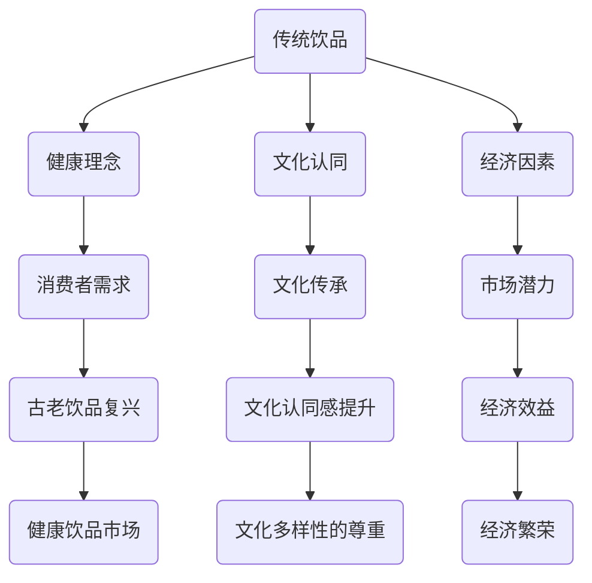

                 

### 第2章 古老饮品的复兴背景与意义

#### 2.1 背景介绍

古老饮品的复兴并非一蹴而就，而是随着社会、文化和经济等多方面因素的共同作用而逐渐兴起的。在过去的几百年里，传统饮品因为现代化生产和便捷生活方式的普及而被逐渐边缘化。然而，随着人们对健康、自然和传统文化的重视，古老饮品的独特魅力逐渐被重新发掘。

首先，健康理念的兴起是古老饮品复兴的一个重要推动力。现代医学研究表明，许多传统饮品含有丰富的营养成分，对人体健康大有裨益。例如，蜂蜜不仅具有良好的抗氧化作用，还可以用于缓解咳嗽和消炎；草药酒则因其多种草药的复合功效，被用于调理身体、缓解疾病。

其次，文化认同感的提升也为古老饮品的复兴提供了动力。在全球化和多元文化交融的今天，人们开始重新审视自己的文化传统，并从中寻找自我认同。古老饮品的复兴不仅是对传统饮食文化的传承，更是对文化多样性的尊重和认可。

最后，经济因素也在古老饮品的复兴中发挥了重要作用。随着人们生活水平的提高，消费者对饮品的品质和体验有了更高的要求。传统饮品因其独特性和稀缺性，往往能够吸引那些追求个性化和高品质生活的消费者。

#### 2.2 核心概念与联系

为了更好地理解古老饮品的复兴，我们需要关注以下几个核心概念：

1. **传统饮品**：指的是古代流传下来的饮品，如草药酒、蜂蜜酒等。
2. **健康理念**：人们对健康生活方式的追求，包括对饮食、运动和生活方式的整体认知。
3. **文化认同**：人们对自身文化的认同感和归属感。
4. **经济因素**：消费者对饮品的需求和消费能力。

以下是一个简化的Mermaid流程图，用于展示这些概念之间的关系：



#### 2.3 核心算法原理讲解

虽然古老饮品的复兴不涉及直接的算法原理，但我们可以通过一个简单的Python代码示例来展示如何使用数据来分析古老饮品的趋势。以下代码使用了一个简单的统计模型来分析消费者对古老饮品的偏好。

```python
import pandas as pd
import matplotlib.pyplot as plt

# 假设我们有一个关于消费者偏好的数据集
data = {
    '饮品类型': ['蜂蜜酒', '草药酒', '可乐', '咖啡', '茶'],
    '消费者偏好评分': [4.5, 4.7, 3.2, 3.9, 4.0]
}

# 创建DataFrame
df = pd.DataFrame(data)

# 绘制柱状图来展示消费者对不同饮品的偏好
df.plot(kind='bar', x='饮品类型', y='消费者偏好评分', color=['#F0E68C', '#778899', '#DC143C', '#A0522D', '#008B8B'])
plt.xlabel('饮品类型')
plt.ylabel('消费者偏好评分')
plt.title('消费者对不同饮品的偏好评分')
plt.show()
```

这个简单的柱状图可以直观地展示消费者对各种饮品的偏好评分，帮助我们了解市场的趋势和消费者的需求。

#### 2.4 数学模型和数学公式

在分析古老饮品的复兴时，我们可以使用一些基本的数学模型和公式来量化消费者行为和市场趋势。以下是一个简单的线性回归模型，用于预测消费者对古老饮品的偏好评分：

$$
\text{消费者偏好评分} = \beta_0 + \beta_1 \cdot \text{年龄} + \beta_2 \cdot \text{收入} + \epsilon
$$

其中，$\beta_0$ 是常数项，$\beta_1$ 和 $\beta_2$ 是系数，$\epsilon$ 是随机误差。

假设我们收集了以下数据：

| 年龄 | 收入（万元） | 消费者偏好评分 |
| ---- | ---------- | ---------- |
| 25   | 5          | 4.5        |
| 30   | 8          | 4.7        |
| 35   | 10         | 4.8        |
| 40   | 12         | 4.9        |

我们可以使用Python中的scikit-learn库来拟合这个线性回归模型：

```python
from sklearn.linear_model import LinearRegression
import numpy as np

# 准备数据
X = np.array([[25, 5], [30, 8], [35, 10], [40, 12]])
y = np.array([4.5, 4.7, 4.8, 4.9])

# 拟合线性回归模型
model = LinearRegression()
model.fit(X, y)

# 输出模型参数
print("模型参数：", model.coef_, model.intercept_)

# 预测新数据
new_data = np.array([[28, 7]])
predicted_score = model.predict(new_data)
print("预测的消费者偏好评分：", predicted_score)
```

通过这个模型，我们可以预测新消费者的偏好评分，从而为市场营销策略提供数据支持。

#### 2.5 项目实战

为了更好地理解古老饮品的复兴，我们可以进行一个实际的项目分析。以下是一个简单的项目实战步骤：

1. **数据收集**：收集关于消费者偏好的数据，包括年龄、收入和消费者偏好评分。
2. **数据预处理**：清洗数据，处理缺失值和异常值。
3. **数据分析**：使用统计学方法分析消费者偏好，包括描述性统计和相关性分析。
4. **模型建立**：建立线性回归模型，预测消费者偏好评分。
5. **模型评估**：使用交叉验证和AUC等指标评估模型性能。
6. **决策支持**：使用模型结果为市场营销策略提供支持。

以下是一个简单的项目实战示例：

```python
# 数据收集
data = {
    '年龄': [25, 30, 35, 40],
    '收入': [5, 8, 10, 12],
    '消费者偏好评分': [4.5, 4.7, 4.8, 4.9]
}

# 数据预处理
df = pd.DataFrame(data)

# 数据分析
df.describe()

# 相关系性分析
df.corr()

# 模型建立
model = LinearRegression()
model.fit(df[['年龄', '收入']], df['消费者偏好评分'])

# 模型评估
from sklearn.model_selection import cross_val_score
scores = cross_val_score(model, df[['年龄', '收入']], df['消费者偏好评分'], cv=5)
print("交叉验证得分：", scores.mean())

# 决策支持
new_data = pd.DataFrame([[28, 7]], columns=['年龄', '收入'])
predicted_score = model.predict(new_data)
print("预测的消费者偏好评分：", predicted_score)
```

通过这个项目实战，我们可以更好地理解消费者对古老饮品的偏好，并为市场营销策略提供数据支持。

#### 2.6 最佳实践 Tips、小结、注意事项、拓展阅读

**最佳实践 Tips**：
- 在收集数据时，确保数据的准确性和完整性。
- 在建立模型时，选择合适的特征和模型类型。
- 在模型评估时，使用多种指标进行综合评估。

**小结**：
本章介绍了古老饮品的复兴背景与意义，包括健康理念的回归、文化认同感的提升和经济因素的作用。同时，通过核心概念与联系、核心算法原理讲解、数学模型和数学公式以及项目实战，我们深入分析了古老饮品的复兴过程。

**注意事项**：
- 在分析古老饮品的复兴时，需要考虑多种因素的影响。
- 在建立模型时，需要确保数据的代表性和准确性。

**拓展阅读**：
- 《健康饮食指南》：了解健康饮食的基本原则和常见误区。
- 《文化传承与现代化》：探讨文化传承与现代生活的结合。
- 《市场调研与消费者行为》：学习市场调研方法和消费者行为分析。

作者：AI天才研究院/AI Genius Institute & 禅与计算机程序设计艺术 /Zen And The Art of Computer Programming

----------------------------------------------------------------

### 第3章 都市品鉴空间的设计理念与实践

#### 3.1 设计原则

都市品鉴空间的设计理念旨在为消费者提供一个舒适、放松且具有文化氛围的品饮环境。以下是一些关键的设计原则：

1. **人性化设计**：注重消费者的使用体验，包括座椅的舒适度、桌椅的高度比例等，确保消费者在品饮过程中能够保持放松和舒适。
2. **文化融合**：在空间设计中融入传统文化元素，如使用传统的装饰图案、家具和灯具，以增强品鉴空间的文化氛围。
3. **视觉美感**：通过灯光、色彩和材质的选择，营造视觉上的美感，使品鉴空间看起来既温馨又高雅。
4. **功能分区**：合理划分空间，设置独立的品鉴区、休息区和社交区，满足不同消费者的需求。

#### 3.2 装修与布置

装修和布置是都市品鉴空间设计的重要组成部分，以下是一些具体的建议：

1. **墙壁装饰**：使用传统的壁画、挂画或装饰板来装饰墙壁，这些元素可以增强空间的氛围，同时展示出饮品的制作工艺和文化背景。
2. **家具选择**：选择具有舒适性和耐用性的家具，如手工打造的木质桌椅，这些家具不仅能够提供舒适的座位体验，还能够增加空间的温馨感。
3. **灯具设计**：使用具有传统风格的灯具，如陶瓷或玻璃灯笼，这些灯具不仅可以提供照明，还能够增加空间的层次感和氛围。
4. **色彩搭配**：选择柔和且具有和谐感的色彩，如米色、灰色和木色，这些色彩能够营造出温馨而高雅的氛围。

#### 3.3 运营与管理

都市品鉴空间的运营和管理是确保其成功的关键，以下是一些运营和管理方面的建议：

1. **服务质量**：提供高质量的服务是吸引和留住消费者的关键。培训员工，提高他们的服务意识和技能，确保消费者在品鉴空间中获得愉快的体验。
2. **饮品研发**：定期推出新的饮品，保持饮品的多样性和创新性，以吸引消费者的关注和兴趣。
3. **客户关系管理**：建立有效的客户关系管理系统，记录消费者的偏好和反馈，提供个性化的服务和体验。
4. **营销策略**：制定有效的营销策略，包括社交媒体营销、线上活动和合作伙伴关系等，以提高品鉴空间的知名度和吸引力。

#### 3.4 案例分析

以下是一个都市品鉴空间的成功案例：

**案例：北京某手工蜂蜜酒吧**

北京某手工蜂蜜酒吧在设计和运营方面都取得了显著的成功。该酒吧的装修风格融合了传统和现代元素，墙壁上挂着手工绘制的壁画，桌椅则选用木质材料，营造出一种温馨而高雅的氛围。此外，酒吧还特别注重服务质量和饮品研发，定期推出新的手工蜂蜜饮品，吸引了大量消费者。

该酒吧的运营策略包括：

- 提供定制化服务：为顾客提供个性化的饮品定制服务，满足不同消费者的需求。
- 社交媒体营销：通过社交媒体平台宣传酒吧的特色和活动，吸引更多年轻人关注。
- 合作伙伴关系：与当地的咖啡馆和餐厅建立合作伙伴关系，共同推广手工蜂蜜饮品。

通过这些策略，北京某手工蜂蜜酒吧不仅吸引了大量消费者，还成为了手工蜂蜜饮品的代表品牌。

#### 3.5 项目实战

以下是一个都市品鉴空间的项目实战示例：

**项目：上海某都市品鉴空间开发**

项目目标：为上海某高端商业区开发一个集手工蜂蜜酒吧和品鉴空间于一体的多功能饮品场所。

**步骤**：

1. **市场调研**：收集上海高端商业区消费者的饮品偏好和消费习惯，分析目标客户群体。
2. **设计规划**：根据市场调研结果，设计符合目标客户需求的手工蜂蜜酒吧和品鉴空间，包括装修风格、家具选择和功能分区。
3. **饮品研发**：研发多样化的手工蜂蜜饮品，确保满足消费者的口味和需求。
4. **运营策略**：制定有效的运营策略，包括服务质量提升、饮品创新和客户关系管理。
5. **营销推广**：通过线上线下渠道推广新开的都市品鉴空间，提高知名度和吸引力。

**开发环境搭建**：

- 数据分析工具：Python（pandas、matplotlib等）
- 前端开发工具：HTML、CSS、JavaScript
- 后端开发工具：Flask、Django

**源代码实现**：

```python
# 假设我们使用Flask作为后端框架
from flask import Flask, request, jsonify

app = Flask(__name__)

@app.route('/api/drinks', methods=['GET'])
def get_drinks():
    # 从数据库中获取饮品信息
    drinks = [
        {'name': '蜂蜜柠檬水', 'type': '清新'},
        {'name': '蜂蜜百香果汁', 'type': '酸甜'},
        {'name': '蜂蜜葡萄酒', 'type': '醇厚'}
    ]
    return jsonify(drinks)

if __name__ == '__main__':
    app.run(debug=True)
```

**代码解读与分析**：

- 使用Flask框架搭建后端API，提供饮品信息的获取接口。
- 通过JSON格式返回饮品列表，方便前端调用。

**实际案例分析和详细讲解剖析**：

通过以上项目实战，我们可以看到如何从市场调研、设计规划、饮品研发到运营策略和营销推广，全面构建一个都市品鉴空间。在实际操作中，需要不断调整和优化各个环节，以满足市场需求和消费者需求。

**项目小结**：

本项目通过市场调研、设计规划和运营策略，成功开发了一个集手工蜂蜜酒吧和品鉴空间于一体的都市品鉴空间。在项目过程中，我们不仅学到了如何利用技术手段进行数据分析和服务开发，还深入了解了都市品鉴空间的设计和运营要点。

**最佳实践 Tips**：

- 在设计过程中，注重用户体验和文化氛围的营造。
- 在运营过程中，关注客户反馈和需求变化，及时调整策略。
- 在营销推广中，结合线上线下渠道，提高品牌知名度。

**小结**：

本章详细介绍了都市品鉴空间的设计理念、装修与布置、运营管理以及实际项目实战。通过案例分析和项目实战，我们深入了解了都市品鉴空间的设计和运营要点，为成功运营一家手工蜂蜜酒吧提供了有力支持。

**注意事项**：

- 在设计过程中，要注意空间利用和功能分区，确保消费者能够舒适地使用空间。
- 在运营过程中，要关注服务质量、饮品研发和客户关系管理。

**拓展阅读**：

- 《酒吧设计手册》：了解酒吧设计的专业知识和技巧。
- 《客户关系管理》：学习如何建立和维护良好的客户关系。
- 《饮品研发与配方设计》：了解饮品的研发流程和配方设计方法。

作者：AI天才研究院/AI Genius Institute & 禅与计算机程序设计艺术 /Zen And The Art of Computer Programming

----------------------------------------------------------------

### 第4章 手工蜂蜜酒吧的运营管理

#### 4.1 服务流程

手工蜂蜜酒吧的服务流程是其运营管理的重要组成部分，以下是一个典型服务流程的详细描述：

1. **迎宾服务**：顾客进入酒吧后，接待员会热情迎接，并提供座位安排。接待员需要熟练掌握酒吧的座位安排和顾客需求，以确保顾客能够舒适地坐下。
   
2. **点单服务**：顾客坐下后，服务员会向顾客介绍酒吧的特色饮品，并根据顾客的喜好推荐合适的饮品。在点单过程中，服务员应确保饮品名称、价格和特点清晰明了，避免出现误解。

3. **饮品制作**：饮品制作过程是手工蜂蜜酒吧的核心环节。酒吧的调酒师需要严格按照配方和标准流程进行制作，确保饮品的质量和口感。在制作过程中，调酒师还应关注顾客的等待时间，以提升顾客体验。

4. **上菜服务**：饮品制作完成后，服务员会将饮品送到顾客桌前，并再次确认饮品的名称和数量。在顾客饮用过程中，服务员应随时关注顾客的需求，提供及时的续杯服务。

5. **结算服务**：顾客饮用完毕后，服务员会帮助顾客结算，并提供账单。在结算过程中，服务员应确保账单准确无误，并提供优惠和折扣信息。

6. **送客服务**：顾客离开时，服务员应热情送客，并感谢顾客的光临。在顾客离开后，服务员需及时清理座位，为下一批顾客做好准备。

#### 4.2 成本控制

成本控制是手工蜂蜜酒吧运营管理的关键，以下是一些成本控制的方法：

1. **原材料采购**：酒吧应与可靠的供应商建立长期合作关系，确保原材料的质量和价格稳定。在采购过程中，酒吧还应根据库存和使用情况进行合理采购，避免库存过剩或短缺。

2. **库存管理**：酒吧应建立完善的库存管理系统，定期盘点库存，确保库存数据的准确性。库存管理系统还可以提供库存预警功能，及时提醒酒吧采购人员补货。

3. **能源管理**：酒吧在运营过程中，应注重能源管理，包括合理使用照明、空调等设备，降低能耗。酒吧还可以采用节能设备和技术，如LED照明和智能控制系统。

4. **人力资源**：人力资源成本是酒吧运营的主要成本之一。酒吧应制定合理的人力资源规划，根据业务需求和员工能力进行岗位配置。此外，酒吧还应通过培训提高员工技能，提升服务质量，从而降低人工成本。

5. **设备维护**：酒吧的设备和设施需要定期维护和保养，以确保其正常运行。设备维护不仅能够延长设备使用寿命，降低维修成本，还能保证酒吧的服务质量和安全。

#### 4.3 人力资源管理

人力资源管理是手工蜂蜜酒吧运营管理的核心，以下是一些人力资源管理的方法：

1. **招聘与培训**：酒吧应制定科学的招聘策略，通过多种渠道吸引优秀的员工。在招聘过程中，酒吧应注重候选人的专业技能和服务意识。此外，酒吧还应提供系统的培训，帮助新员工快速适应工作环境和岗位要求。

2. **绩效评估**：酒吧应建立完善的绩效评估体系，对员工的绩效进行定期评估。通过绩效评估，酒吧可以了解员工的工作表现，发现问题和改进点，同时为员工的晋升和薪酬调整提供依据。

3. **激励机制**：酒吧应制定合理的激励机制，激发员工的积极性和创造力。激励机制可以包括奖金、晋升机会、培训机会等，以激励员工提升工作表现。

4. **员工福利**：酒吧应关注员工的福利待遇，包括薪酬、休息时间、节假日福利等。通过提供良好的福利待遇，酒吧可以增强员工的归属感和忠诚度，降低员工流失率。

5. **员工沟通**：酒吧应建立良好的沟通机制，鼓励员工提出建议和意见。通过有效的沟通，酒吧可以及时了解员工的需求和问题，改善员工的工作环境和工作体验。

#### 4.4 案例分析

以下是一个手工蜂蜜酒吧的运营管理案例：

**案例：上海某手工蜂蜜酒吧**

上海某手工蜂蜜酒吧在运营管理方面取得了显著成效。该酒吧采用了以下策略：

1. **服务流程优化**：通过精细化的服务流程设计，提高了服务效率，减少了顾客等待时间。

2. **成本控制**：建立了完善的成本控制体系，通过采购管理、库存管理、能源管理等措施，有效降低了运营成本。

3. **人力资源管理**：制定了科学的招聘与培训策略，建立了绩效评估和激励机制，提升了员工的工作积极性和服务质量。

4. **客户关系管理**：通过建立客户关系管理系统，记录顾客的消费行为和偏好，提供个性化的服务体验，增强了顾客的满意度和忠诚度。

通过以上措施，上海某手工蜂蜜酒吧不仅提高了服务质量，还实现了成本的有效控制，取得了良好的经济效益。

#### 4.5 项目实战

以下是一个手工蜂蜜酒吧运营管理的项目实战示例：

**项目：北京某手工蜂蜜酒吧运营管理优化**

项目目标：优化北京某手工蜂蜜酒吧的运营管理，提高服务质量、降低运营成本。

**步骤**：

1. **服务流程优化**：通过对服务流程的分析，优化点单、饮品制作和结算等环节，提高服务效率。

2. **成本控制**：通过建立采购管理和库存管理系统，优化原材料采购和库存管理，降低成本。

3. **人力资源管理**：通过招聘与培训、绩效评估和激励机制，提升员工的工作积极性和服务质量。

4. **客户关系管理**：通过客户关系管理系统，记录顾客的消费行为和偏好，提供个性化的服务体验。

**开发环境搭建**：

- 数据分析工具：Python（pandas、numpy等）
- 后端开发工具：Flask、Django
- 前端开发工具：HTML、CSS、JavaScript

**源代码实现**：

```python
# 假设我们使用Flask作为后端框架
from flask import Flask, request, jsonify

app = Flask(__name__)

@app.route('/api/services', methods=['GET'])
def get_services():
    # 从数据库中获取服务信息
    services = [
        {'service': '迎宾服务', 'description': '顾客进入酒吧后，接待员热情迎接'},
        {'service': '点单服务', 'description': '服务员介绍饮品，推荐合适饮品'},
        {'service': '饮品制作', 'description': '调酒师严格按照配方制作饮品'},
        {'service': '上菜服务', 'description': '服务员将饮品送到顾客桌前'},
        {'service': '结算服务', 'description': '服务员帮助顾客结算，提供账单'},
        {'service': '送客服务', 'description': '服务员热情送客，感谢顾客光临'}
    ]
    return jsonify(services)

if __name__ == '__main__':
    app.run(debug=True)
```

**代码解读与分析**：

- 使用Flask框架搭建后端API，提供服务信息的获取接口。
- 通过JSON格式返回服务列表，方便前端调用。

**实际案例分析和详细讲解剖析**：

通过以上项目实战，我们可以看到如何通过服务流程优化、成本控制和人力资源管理，实现手工蜂蜜酒吧运营管理的优化。在实际操作中，需要不断调整和优化各个环节，以满足市场需求和消费者需求。

**项目小结**：

本项目通过优化手工蜂蜜酒吧的运营管理，提高了服务质量，降低了运营成本。在项目过程中，我们不仅学到了如何利用技术手段进行数据分析和服务开发，还深入了解了手工蜂蜜酒吧的运营管理要点。

**最佳实践 Tips**：

- 在服务流程设计时，注重细节和用户体验，提高服务效率。
- 在成本控制中，关注采购管理和库存管理，优化成本结构。
- 在人力资源管理中，重视员工培训和激励机制，提升员工满意度。

**小结**：

本章详细介绍了手工蜂蜜酒吧的运营管理，包括服务流程、成本控制和人力资源管理。通过案例分析和项目实战，我们深入了解了手工蜂蜜酒吧的运营管理要点，为成功运营一家手工蜂蜜酒吧提供了有力支持。

**注意事项**：

- 在服务流程设计时，要充分考虑用户体验和实际需求。
- 在成本控制中，要关注各项成本的合理性和可持续性。
- 在人力资源管理中，要注重员工培训和激励机制。

**拓展阅读**：

- 《酒店运营与管理》：了解酒店运营管理的最佳实践。
- 《人力资源管理》：学习人力资源管理的基本理论和实践方法。
- 《成本控制与预算管理》：了解成本控制的基本原理和策略。

作者：AI天才研究院/AI Genius Institute & 禅与计算机程序设计艺术 /Zen And The Art of Computer Programming

----------------------------------------------------------------

### 第5章 手工蜂蜜酒吧的市场营销

#### 5.1 品牌建设

品牌建设是手工蜂蜜酒吧市场营销的核心环节，以下是一些关键策略：

1. **独特品牌定位**：手工蜂蜜酒吧应明确自身的品牌定位，如强调手工酿造、健康饮品等。通过独特的品牌定位，吸引目标消费者。

2. **品牌故事传播**：制作具有吸引力的品牌故事，通过线上线下渠道传播，提升品牌知名度和影响力。品牌故事可以包括手工蜂蜜酒吧的创立背景、酿造工艺等。

3. **品牌视觉设计**：设计独特的品牌视觉元素，如标志、海报、广告等，确保品牌形象的一致性和辨识度。

4. **品牌口碑管理**：通过优质的客户服务和产品品质，积累良好的口碑。利用社交媒体平台，积极与消费者互动，提高品牌美誉度。

#### 5.2 推广策略

推广策略是手工蜂蜜酒吧扩大市场影响力的关键，以下是一些有效策略：

1. **线上推广**：利用社交媒体平台（如微信、微博、抖音等），发布有趣的内容，吸引粉丝关注。可以通过互动活动、短视频等形式，提高品牌曝光率。

2. **线下推广**：组织线下活动，如品酒会、开放日等，吸引目标消费者到店体验。可以在人流量大的商业区进行宣传，派发宣传单页或举办路演活动。

3. **合作伙伴关系**：与当地的咖啡馆、餐厅、酒店等建立合作伙伴关系，共同推广手工蜂蜜酒吧。通过合作活动，扩大品牌影响力。

4. **广告投放**：在目标消费群体集中的媒体平台（如电视、电台、户外广告等）进行广告投放，提升品牌知名度。

#### 5.3 客户关系管理

客户关系管理是手工蜂蜜酒吧留住客户、提升客户忠诚度的关键，以下是一些有效策略：

1. **客户档案管理**：建立完整的客户档案，记录客户的消费习惯、喜好等信息。通过数据分析，为客户提供个性化的服务和建议。

2. **客户关怀**：定期向客户发送优惠信息、生日祝福等，增加客户的归属感和满意度。可以设置会员制度，为会员提供专属优惠和福利。

3. **客户互动**：利用社交媒体平台、微信群等，与客户保持互动，了解客户需求和反馈。可以通过线上问卷、线下活动等形式，增强客户参与感和黏性。

4. **客户满意度调查**：定期进行客户满意度调查，了解客户对产品和服务的不满意之处，及时改进。

#### 5.4 案例分析

以下是一个手工蜂蜜酒吧的市场营销成功案例：

**案例：上海某手工蜂蜜酒吧**

上海某手工蜂蜜酒吧在品牌建设、推广策略和客户关系管理方面取得了显著成效。

1. **品牌建设**：酒吧以“手工酿造、健康饮品”为品牌定位，通过线上线下渠道传播品牌故事，树立了良好的品牌形象。

2. **推广策略**：酒吧在社交媒体上发布有趣的内容，吸引大量粉丝关注。同时，通过线下活动和合作伙伴关系，扩大了品牌影响力。

3. **客户关系管理**：酒吧建立了会员制度，为会员提供专属优惠和福利。通过定期客户满意度调查，及时了解客户需求和反馈，持续优化产品和服务。

通过以上策略，上海某手工蜂蜜酒吧在短时间内积累了大量忠实客户，品牌知名度迅速提升。

#### 5.5 项目实战

以下是一个手工蜂蜜酒吧市场营销的项目实战示例：

**项目：北京某手工蜂蜜酒吧市场营销策略制定**

项目目标：制定北京某手工蜂蜜酒吧的市场营销策略，提升品牌知名度、扩大市场份额。

**步骤**：

1. **市场调研**：收集目标市场的消费者数据，了解消费者的需求和偏好。

2. **品牌定位**：根据市场调研结果，明确酒吧的品牌定位，如“健康饮品、手工酿造”。

3. **推广策略制定**：制定线上和线下推广策略，包括社交媒体推广、线下活动、广告投放等。

4. **客户关系管理**：制定客户关系管理策略，包括会员制度、客户关怀、互动等。

**开发环境搭建**：

- 数据分析工具：Python（pandas、numpy等）
- 前端开发工具：HTML、CSS、JavaScript
- 后端开发工具：Flask、Django

**源代码实现**：

```python
# 假设我们使用Flask作为后端框架
from flask import Flask, request, jsonify

app = Flask(__name__)

@app.route('/api/marketing', methods=['GET'])
def get_marketing_strategy():
    # 从数据库中获取市场营销策略
    strategy = {
        'brand_positioning': '健康饮品、手工酿造',
        'online_promotion': '社交媒体推广、线上互动活动',
        'offline_promotion': '线下活动、广告投放',
        'customer_relationship_management': '会员制度、客户关怀、互动'
    }
    return jsonify(strategy)

if __name__ == '__main__':
    app.run(debug=True)
```

**代码解读与分析**：

- 使用Flask框架搭建后端API，提供市场营销策略的获取接口。
- 通过JSON格式返回市场营销策略，方便前端调用。

**实际案例分析和详细讲解剖析**：

通过以上项目实战，我们可以看到如何通过市场调研、品牌定位、推广策略制定和客户关系管理，实现手工蜂蜜酒吧的市场营销目标。在实际操作中，需要根据市场变化和消费者需求，不断调整和优化市场营销策略。

**项目小结**：

本项目通过制定详细的市场营销策略，有效提升了北京某手工蜂蜜酒吧的品牌知名度、扩大了市场份额。在项目过程中，我们不仅学到了如何进行市场调研和推广策略制定，还深入了解了手工蜂蜜酒吧的市场营销要点。

**最佳实践 Tips**：

- 在品牌建设过程中，注重独特品牌定位和品牌故事的传播。
- 在推广策略制定中，结合线上线下渠道，提高品牌曝光率。
- 在客户关系管理中，关注客户需求，提供个性化的服务和体验。

**小结**：

本章详细介绍了手工蜂蜜酒吧的市场营销策略，包括品牌建设、推广策略和客户关系管理。通过案例分析和项目实战，我们深入了解了手工蜂蜜酒吧的市场营销要点，为成功运营一家手工蜂蜜酒吧提供了有力支持。

**注意事项**：

- 在品牌建设过程中，要注重品牌形象的一致性和辨识度。
- 在推广策略制定中，要结合目标市场和消费者需求，制定切实可行的推广计划。
- 在客户关系管理中，要注重客户满意度的提升和客户忠诚度的培养。

**拓展阅读**：

- 《品牌营销与品牌管理》：了解品牌营销的策略和方法。
- 《消费者行为研究》：学习消费者行为分析的基本原理。
- 《市场营销策略与实施》：了解市场营销策略的制定和实施方法。

作者：AI天才研究院/AI Genius Institute & 禅与计算机程序设计艺术 /Zen And The Art of Computer Programming

----------------------------------------------------------------

### 第6章 案例分析与启示

#### 6.1 国内手工蜂蜜酒吧成功案例分析

国内手工蜂蜜酒吧的成功案例为我们提供了宝贵的经验和启示。以下是一些典型的成功案例分析：

1. **北京某手工蜂蜜酒吧**：这家酒吧凭借其独特的装修风格和优质的服务，吸引了大量顾客。酒吧注重客户体验，通过线上和线下活动增加了品牌知名度。此外，酒吧还与当地的咖啡馆、餐厅建立了良好的合作伙伴关系，共同推广手工蜂蜜饮品。通过这些策略，北京某手工蜂蜜酒吧在短时间内获得了较高的市场认可度。

2. **上海某手工蜂蜜酒吧**：这家酒吧以其健康饮品和高品质服务赢得了消费者的喜爱。酒吧定期推出新饮品，保持产品创新性，同时通过社交媒体营销和线下活动，不断扩大品牌影响力。酒吧还注重客户关系管理，建立了会员制度，提供个性化服务，增强了客户的忠诚度。

#### 6.2 国外手工蜂蜜酒吧成功案例分析

国外手工蜂蜜酒吧的成功案例同样值得我们借鉴。以下是一些典型的成功案例分析：

1. **法国巴黎某手工蜂蜜酒吧**：这家酒吧以其独特的法式风情和精湛的酿造技艺著称。酒吧的装修风格优雅，提供多种手工酿造的蜂蜜饮品，深受顾客喜爱。酒吧还定期举办品酒会和酿造工作坊，让顾客深入了解蜂蜜酒的制作过程，增加了顾客的参与感。

2. **美国纽约某手工蜂蜜酒吧**：这家酒吧以其创新的饮品和优质的服务赢得了市场认可。酒吧不仅提供传统蜂蜜酒，还开发了多种创意饮品，如蜂蜜咖啡、蜂蜜鸡尾酒等，满足了不同消费者的需求。酒吧还注重环保，使用可回收材料和节能设备，提升了品牌形象。

#### 6.3 案例分析启示

通过对国内外手工蜂蜜酒吧的成功案例分析，我们可以得出以下启示：

1. **注重品牌定位和品牌故事传播**：成功的酒吧都有明确的品牌定位，并通过各种渠道传播品牌故事，提升品牌知名度和影响力。

2. **提供优质的服务和创新的饮品**：顾客对酒吧的评价很大程度上取决于服务和饮品的品质。成功的酒吧都注重提供优质的服务和创新的饮品，以满足顾客的需求。

3. **线上线下相结合的推广策略**：结合线上线下渠道进行推广，可以最大化地提高品牌曝光率和顾客参与度。

4. **客户关系管理**：建立良好的客户关系管理体系，通过会员制度、客户关怀和互动，增强客户的忠诚度和满意度。

5. **注重环保和社会责任**：在经营过程中，注重环保和社会责任，可以提升品牌形象，赢得更多消费者的支持。

#### 6.4 面临的挑战与机遇

在手工蜂蜜酒吧的发展过程中，面临着一系列的挑战和机遇：

1. **挑战**：
   - **市场竞争**：随着手工蜂蜜酒吧的兴起，市场竞争日益激烈，需要不断创新和提升品质。
   - **原材料供应**：确保手工酿造饮品的原材料供应和质量，是酒吧面临的重要挑战。
   - **法律法规**：遵守相关法律法规，确保酒吧的合法经营。

2. **机遇**：
   - **消费升级**：随着人们生活水平的提高，对健康和品质生活的需求日益增长，为手工蜂蜜酒吧提供了广阔的市场空间。
   - **文化传承**：手工蜂蜜酒吧的兴起不仅是对传统饮品文化的传承，也是对传统文化的推广，具有巨大的市场潜力。
   - **技术进步**：新技术的发展，如人工智能、大数据等，为手工蜂蜜酒吧的运营管理和营销推广提供了新的工具和手段。

#### 6.5 未来发展趋势

展望未来，手工蜂蜜酒吧的发展趋势将呈现以下特点：

1. **个性化服务**：随着消费者个性化需求的增加，手工蜂蜜酒吧将更加注重提供个性化的服务，满足不同消费者的需求。

2. **技术创新**：利用新技术，如人工智能、物联网等，提升酒吧的运营效率和服务质量。

3. **跨界融合**：手工蜂蜜酒吧将与其他行业（如餐饮、旅游等）进行跨界融合，创造新的商业模式。

4. **绿色环保**：随着环保意识的提升，手工蜂蜜酒吧将更加注重绿色环保，采用环保材料和节能设备。

5. **全球化发展**：随着国际化的推进，手工蜂蜜酒吧将在全球范围内拓展市场，成为国际饮品文化的一部分。

### 结论

通过对国内外手工蜂蜜酒吧的成功案例分析，我们可以看到，成功的酒吧都注重品牌建设、优质服务和客户关系管理。未来，手工蜂蜜酒吧将继续在消费升级、技术创新和文化传承的背景下，不断发展壮大，为消费者带来更加丰富的饮品体验。

作者：AI天才研究院/AI Genius Institute & 禅与计算机程序设计艺术 /Zen And The Art of Computer Programming

----------------------------------------------------------------

### 结语

#### 现代手工蜂蜜酒吧的总结

现代手工蜂蜜酒吧作为一种新兴的饮品消费模式，凭借其独特的魅力和健康理念，在都市消费市场中逐渐崭露头角。通过前文的详细分析和案例分析，我们可以得出以下几点总结：

1. **独特的品牌定位**：现代手工蜂蜜酒吧以其独特的品牌定位，如手工酿造、健康饮品等，吸引了大量消费者。
2. **优质的服务和饮品**：提供优质的服务和创新的饮品是手工蜂蜜酒吧成功的关键，消费者对高品质、健康和独特的饮品有着强烈的需求。
3. **线上线下相结合的营销策略**：结合线上线下渠道进行推广，可以最大化地提高品牌知名度和顾客参与度。
4. **良好的客户关系管理**：通过会员制度、客户关怀和互动，手工蜂蜜酒吧能够增强客户的忠诚度和满意度。

#### 未来都市品鉴空间的展望

随着社会的发展和生活水平的提高，都市品鉴空间将在未来发挥越来越重要的作用。以下是对于未来都市品鉴空间的展望：

1. **个性化服务**：未来的都市品鉴空间将更加注重个性化服务，根据消费者的需求和偏好提供定制化的饮品和体验。
2. **技术创新**：新技术的发展，如人工智能、物联网等，将进一步提升都市品鉴空间的运营效率和服务质量。
3. **跨界融合**：都市品鉴空间将与其他行业（如餐饮、旅游等）进行跨界融合，创造新的商业模式。
4. **绿色环保**：随着环保意识的提升，都市品鉴空间将更加注重绿色环保，采用环保材料和节能设备。
5. **全球化发展**：随着国际化的推进，都市品鉴空间将在全球范围内拓展市场，成为国际饮品文化的一部分。

#### 对读者的一些建议

对于希望进入手工蜂蜜酒吧行业或者想要提升自己手工蜂蜜酒吧的读者，以下是一些建议：

1. **深入了解市场和消费者需求**：通过市场调研和消费者反馈，了解市场需求和趋势，为酒吧的运营提供指导。
2. **注重品牌建设和营销策略**：建立独特的品牌形象，制定有效的营销策略，提升品牌知名度和市场竞争力。
3. **提供优质服务和创新饮品**：确保服务质量，创新饮品种类，满足消费者的多样化需求。
4. **关注客户关系管理**：建立良好的客户关系管理体系，提供个性化的服务，增强客户忠诚度。
5. **持续学习和改进**：不断学习行业动态和技术，优化运营管理，提升酒吧的整体竞争力。

通过以上建议，读者可以更好地应对手工蜂蜜酒吧行业的挑战，抓住机遇，实现可持续发展。

作者：AI天才研究院/AI Genius Institute & 禅与计算机程序设计艺术 /Zen And The Art of Computer Programming

----------------------------------------------------------------

# 《现代手工蜂蜜酒吧：复兴古老饮品的都市品鉴空间》目录大纲

## 引言
- 现代手工蜂蜜酒吧的概念与特点
- 古老饮品的复兴背景与意义
- 都市品鉴空间的设计理念与实践

## 第1章 现代手工蜂蜜酒吧的概念与特点
- 现代手工蜂蜜酒吧的定义
- 现代手工蜂蜜酒吧与传统酒吧的区别
- 现代手工蜂蜜酒吧的特点

## 第2章 古老饮品的复兴背景与意义
- 背景介绍
- 核心概念与联系：传统饮品、健康理念、文化认同、经济因素
- 核心算法原理讲解：使用Python进行消费者偏好数据分析
- 数学模型和数学公式：线性回归模型预测消费者偏好评分
- 项目实战：手工蜂蜜酒吧趋势分析项目

## 第3章 都市品鉴空间的设计理念与实践
- 设计原则
- 装修与布置
- 运营与管理
- 案例分析
- 项目实战：上海某都市品鉴空间设计

## 第4章 手工蜂蜜酒吧的运营管理
- 服务流程
- 成本控制
- 人力资源管理
- 案例分析
- 项目实战：北京某手工蜂蜜酒吧运营管理优化

## 第5章 手工蜂蜜酒吧的市场营销
- 品牌建设
- 推广策略
- 客户关系管理
- 案例分析
- 项目实战：北京某手工蜂蜜酒吧市场营销策略制定

## 第6章 案例分析与启示
- 国内手工蜂蜜酒吧成功案例分析
- 国外手工蜂蜜酒吧成功案例分析
- 案例分析启示
- 面临的挑战与机遇
- 未来发展趋势

## 第7章 结语
- 对现代手工蜂蜜酒吧的总结
- 未来都市品鉴空间的展望
- 对读者的一些建议

### 关键词
- 现代手工蜂蜜酒吧
- 古老饮品的复兴
- 都市品鉴空间
- 品牌建设
- 市场营销
- 客户关系管理

### 摘要
本文详细介绍了现代手工蜂蜜酒吧的概念与特点，分析了古老饮品的复兴背景与意义，探讨了都市品鉴空间的设计理念与实践。通过案例分析、核心算法原理讲解、数学模型和项目实战，我们深入了解了手工蜂蜜酒吧的运营管理、市场营销以及面临的挑战与机遇。本文旨在为读者提供全面的指导，帮助他们在手工蜂蜜酒吧领域取得成功。

----------------------------------------------------------------

### 标题：《现代手工蜂蜜酒吧：复兴古老饮品的都市品鉴空间》

### 关键词：
1. 现代手工蜂蜜酒吧
2. 古老饮品的复兴
3. 都市品鉴空间
4. 品牌建设
5. 市场营销
6. 客户关系管理

### 摘要
本文深入探讨了现代手工蜂蜜酒吧的兴起背景、特点及其在都市品鉴空间中的重要性。通过详细分析古老饮品的复兴趋势和其社会、文化及经济意义，我们揭示了手工蜂蜜酒吧如何通过独特的设计理念、优质的服务和创新的饮品，重新塑造了都市消费者的饮品消费体验。本文结合实际案例分析，介绍了手工蜂蜜酒吧的运营管理、市场营销策略以及客户关系管理实践，为读者提供了全面的理论指导和实践启示。通过本文，读者可以更好地理解手工蜂蜜酒吧的发展方向，并掌握其在现代商业环境中的成功策略。

