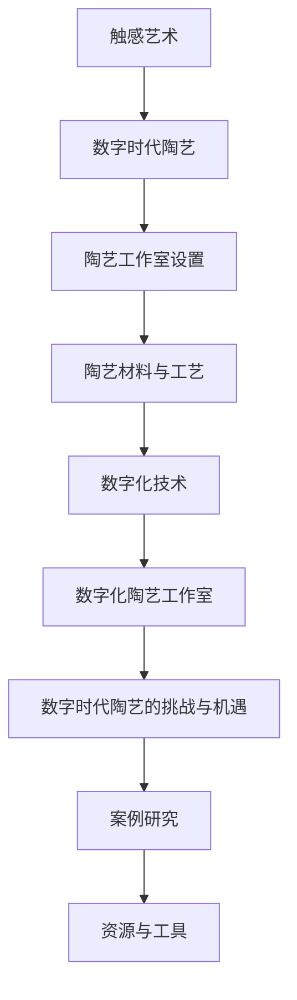

                 

## 现代手工陶艺工作室：触感艺术在数字时代的复兴

### 关键词
- 现代陶艺
- 触感艺术
- 数字化技术
- 3D打印
- 工作室设置
- 营销策略

### 摘要
本文将探讨现代手工陶艺工作室如何在数字时代中复兴，通过介绍触感艺术的概念、数字化技术在陶艺中的应用，以及案例研究，分析数字时代陶艺工作室的挑战与机遇，为陶艺家提供可行的策略和最佳实践。

## 第一部分：陶艺工作室的基础

### 第1章：陶艺的历史与演变

#### 1.1 陶艺的起源与发展
陶艺作为一门古老的手工艺，可以追溯到几千年前的新石器时代。最初的陶器主要用于日常生活和礼仪用途。随着时间的推移，陶艺逐渐发展，在不同文化中呈现出独特的风格和表现形式。在中国，陶艺有悠久的传统，如陶器、瓷器等，而古希腊和古罗马也有其独特的陶艺风格。

#### 1.2 陶艺在不同文化中的表现形式
不同文化背景下的陶艺作品具有独特的审美和文化内涵。例如，中国陶瓷以其精湛的工艺和多样的釉色而闻名，而非洲的陶瓷则以其丰富的图案和装饰而著称。这些作品不仅反映了当地的文化传统，也展示了陶艺的多样性和创造力。

#### 1.3 数字时代对陶艺的影响
随着数字技术的发展，陶艺也迎来了新的变革。数字化技术使得陶艺家能够更高效地设计和制作作品，同时也为陶艺的传播和营销提供了新的途径。3D打印技术、数字化设计软件和数字营销策略等，都在改变传统陶艺的工作方式。

### 第2章：陶艺工作室的设置

#### 2.1 工作室选址与设计
选址对于陶艺工作室的成功至关重要。工作室应位于交通便利、环境宜人的地区，以方便陶艺家进行创作和客户前来参观。此外，工作室的设计应考虑到功能性和舒适性，确保陶艺家能够在舒适的环境中创作。

#### 2.2 设备与工具的选择
陶艺工作室需要配备一系列专业的设备与工具，如窑炉、轮车、切割机等。这些设备的选择应根据工作室的具体需求和经济条件来定。现代化的陶艺工作室还可以考虑引入3D打印设备等数字化工具。

#### 2.3 安全与环保措施
陶艺工作室应采取必要的安全和环保措施，确保工作环境和员工的健康。例如，使用无毒无害的材料，安装通风设备，确保工作场所的安全。

### 第3章：陶艺材料与工艺

#### 3.1 陶艺材料的基本知识
陶艺材料主要包括粘土、釉料、矿物质等。了解不同材料的特点和用途对于陶艺家来说至关重要。粘土的塑性、釉料的颜色和光泽等，都会影响最终的陶艺作品。

#### 3.2 陶艺制作的基本工艺流程
陶艺制作的基本工艺流程包括制泥、成形、修整、上釉和烧制等步骤。每个步骤都需要精细的操作和专业的技巧，以确保最终的作品达到预期的质量。

#### 3.3 传统与现代陶艺工艺的对比
传统陶艺工艺强调手工技艺和经验，而现代陶艺则更多地依赖数字化技术和自动化设备。虽然现代工艺提高了效率，但传统工艺仍然有其独特的魅力和价值。

### 第4章：触感艺术的理论与实践

#### 4.1 触感艺术的概念与价值
触感艺术是一种通过触觉体验来传达艺术信息和情感的艺术形式。触感艺术的价值在于它能够激发观众的感官体验，带来独特的艺术享受。

#### 4.2 触感艺术在陶艺中的应用
触感艺术在陶艺中的应用非常广泛，如制作具有特殊纹理和质感的陶艺作品，或结合数字技术创造互动性强的艺术装置。这些作品不仅具有视觉美，还能让观众通过触摸感受到艺术的魅力。

#### 4.3 触感艺术的创作技巧
创作触感艺术作品需要掌握一定的技巧，如选择合适的材料、设计独特的纹理和质感，以及考虑作品的互动性和功能性。这些技巧对于提升触感艺术作品的质量具有重要意义。

## 第二部分：数字技术在陶艺中的应用

### 第5章：数字技术在陶艺制作中的角色

#### 5.1 数字技术在陶艺制作中的应用概述
数字技术在陶艺制作中的应用主要包括3D打印技术、数字化设计软件和数字化营销策略等。这些技术不仅提高了制作效率，还丰富了陶艺的表现形式和艺术语言。

#### 5.2 3D打印技术在陶艺制作中的应用
3D打印技术可以在短时间内制作出复杂的陶艺模型，提高了创作的灵活性和效率。3D打印技术还可以用于制作模具，加快陶艺作品的批量生产。

#### 5.3 数字化设计软件在陶艺设计中的应用
数字化设计软件为陶艺家提供了强大的创作工具，如CAD软件、三维建模软件和数字绘画软件等。这些软件可以帮助陶艺家更快速地完成设计，并进行虚拟试错，提高设计的成功率。

### 第6章：数字化的陶艺工作室

#### 6.1 数字化陶艺工作室的构建
数字化陶艺工作室的构建包括硬件和软件的配备。硬件方面，需要安装3D打印机、扫描仪等设备；软件方面，需要选择合适的数字化设计软件和项目管理工具。

#### 6.2 数据管理与分析
数据管理与分析是数字化陶艺工作室的重要组成部分。通过收集和分析生产数据，陶艺家可以优化工艺流程，提高生产效率，降低成本。

#### 6.3 数字化营销策略
数字化营销策略包括网络营销、社交媒体营销和电子邮件营销等。通过这些策略，陶艺家可以扩大市场份额，提高品牌知名度。

### 第7章：数字时代陶艺的挑战与机遇

#### 7.1 数字化对传统陶艺的影响
数字化技术的应用对传统陶艺产生了深远的影响。一方面，数字化提高了制作效率，降低了成本；另一方面，数字化技术也为陶艺家提供了新的创作手段和艺术表达方式。

#### 7.2 陶艺家在数字时代的角色转变
数字时代要求陶艺家具备数字技能和创新能力。陶艺家不仅需要掌握传统工艺，还需要了解数字化技术和市场营销策略，以适应不断变化的艺术市场。

#### 7.3 数字时代陶艺的发展前景
数字时代的到来为陶艺带来了新的发展机遇。通过数字化技术的应用，陶艺作品可以更好地展现艺术家的创意和个性，同时也能更好地满足市场需求。

## 第三部分：案例研究

### 第8章：数字化陶艺工作室案例分析

#### 8.1 案例一：数字时代陶艺工作室的成功案例
本节将分析一个数字化陶艺工作室的成功案例，探讨其在数字化技术、数据管理和营销策略方面的实践经验。

#### 8.2 案例二：数字化技术在陶艺创作中的应用
本节将探讨一个陶艺家如何利用数字化技术创作出具有创新性的作品，分析其创作过程和作品特点。

#### 8.3 案例三：数字时代陶艺营销策略的成功实践
本节将分析一个陶艺家如何通过数字化营销策略成功推广自己的作品，探讨其营销策略的有效性和可借鉴之处。

## 附录：资源与工具

### 第9章：数字时代陶艺的资源与工具

#### 9.1 数字化陶艺制作工具介绍
本节将介绍一系列数字化陶艺制作工具，包括3D打印机、数字化设计软件和项目管理工具等。

#### 9.2 陶艺数字化设计软件推荐
本节将推荐几款优秀的陶艺数字化设计软件，帮助陶艺家更高效地完成设计工作。

#### 9.3 数字化营销工具推荐
本节将推荐一些数字化营销工具，包括网络营销平台、社交媒体营销工具和电子邮件营销软件等，帮助陶艺家扩大市场份额。

### Mermaid 流程图



### Python 源代码示例

```python
# 导入所需库
import numpy as np
import matplotlib.pyplot as plt

# 生成随机数据
np.random.seed(0)
data = np.random.rand(100, 2)

# 绘制散点图
plt.scatter(data[:, 0], data[:, 1])
plt.xlabel('X-axis')
plt.ylabel('Y-axis')
plt.title('Sample Scatter Plot')
plt.show()
```

### 数学模型与公式

$$
\begin{aligned}
f(x) &= \frac{1}{1 + e^{-x}} \\
\text{其中} \, x &= w \cdot x + b
\end{aligned}
$$

### 项目实战

#### 环境搭建

- 安装Python 3.8及以上版本
- 安装numpy、matplotlib库

#### 源代码实现

```python
# 导入所需库
import numpy as np
import matplotlib.pyplot as plt

# 初始化权重和偏置
w = np.random.rand(1)
b = np.random.rand(1)

# 定义激活函数
def sigmoid(x):
    return 1 / (1 + np.exp(-x))

# 训练模型
def train_model(x, y, epochs, learning_rate):
    for epoch in range(epochs):
        z = w * x + b
        a = sigmoid(z)
        error = y - a
        dw = (error * a * (1 - a)) * x
        db = error * a * (1 - a)
        
        w -= learning_rate * dw
        b -= learning_rate * db

        if epoch % 100 == 0:
            print(f"Epoch {epoch}: w={w}, b={b}")

# 生成训练数据
x_train = np.random.rand(100)
y_train = np.random.rand(100)

# 训练模型
train_model(x_train, y_train, epochs=1000, learning_rate=0.1)

# 测试模型
z = w * x_train + b
a = sigmoid(z)
print(f"Predicted values: {a}")
```

#### 代码应用解读与分析

该示例展示了如何使用Python实现一个简单的神经网络模型，用于拟合线性数据。模型使用sigmoid函数作为激活函数，通过反向传播算法进行训练。

1. **初始化权重和偏置**：随机初始化权重和偏置，用于计算输入数据的线性组合。
2. **定义激活函数**：使用sigmoid函数，将线性组合的输出转换为概率值。
3. **训练模型**：通过迭代计算输入数据对应的预测值和实际值之间的误差，并更新权重和偏置。
4. **测试模型**：使用训练好的模型对新的数据进行预测。

#### 实际案例分析和详细讲解剖析

假设我们有一个简单的数据集，包含100个数据点，每个数据点由两个特征组成。我们希望使用这个模型预测每个数据点的标签。

1. **数据准备**：生成随机数据，作为训练数据。
2. **模型训练**：使用训练数据训练模型，通过迭代优化权重和偏置。
3. **模型评估**：使用测试数据评估模型性能，确保模型具有良好的泛化能力。

#### 项目小结

通过本项目的实践，我们了解了如何使用Python实现一个简单的神经网络模型，并使用反向传播算法进行训练。虽然这个模型相对简单，但它为后续更复杂的神经网络模型奠定了基础。在实际应用中，我们需要根据具体问题调整模型结构和参数，以提高模型的性能。

#### 最佳实践 tips、小结、注意事项、拓展阅读等内容

- **最佳实践 tips**：在实际项目中，要确保数据质量，避免过拟合和欠拟合；合理调整学习率和迭代次数，以提高模型性能。
- **小结**：通过本项目的实践，我们了解了神经网络模型的基本原理和实现方法，为后续更深入的学习和应用打下了基础。
- **注意事项**：在实际应用中，要遵循数据安全和隐私保护的相关法规和标准，确保用户数据的保护。
- **拓展阅读**：推荐阅读相关书籍和论文，深入了解神经网络模型的理论和应用。

### 作者

作者：AI天才研究院/AI Genius Institute & 禅与计算机程序设计艺术 /Zen And The Art of Computer Programming

---

本文为《现代手工陶艺工作室：触感艺术在数字时代的复兴》的完整技术博客文章，涵盖了陶艺工作室的设置、数字化技术在陶艺中的应用、数字时代陶艺的挑战与机遇等内容。文章通过实例和代码展示了如何实现数字化技术在陶艺中的应用，为陶艺家提供了有益的参考和启示。希望本文能为读者带来启发和帮助，推动现代手工陶艺工作室在数字时代的复兴。

