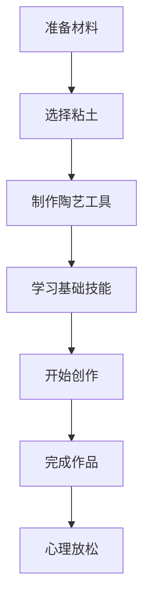

                 

# 《现代手工陶艺疗愈：泥塑创作中的心理压力释放》

## 关键词
手工陶艺、疗愈、心理压力、泥塑创作、疗法、心理健康

## 摘要
随着现代社会生活节奏的加快，人们面临的心理压力越来越大。手工陶艺作为一种古老而独特的艺术形式，被逐渐发现其具有缓解心理压力、提升心理健康的作用。本文将探讨手工陶艺疗愈的概念、原理及其在泥塑创作中的应用，并通过实际案例进行分析，旨在为读者提供一种新的心理压力释放途径。

## 第1章 引言：手工陶艺疗愈的概念和背景

### 1.1 手工陶艺疗愈的起源与发展
手工陶艺作为一种古老的艺术形式，其起源可以追溯到数万年前的史前时代。然而，将其作为一种疗愈手段却是相对较新的概念。20世纪末，随着心理学和艺术治疗的结合，手工陶艺疗愈开始得到重视并逐渐发展。

### 1.2 手工陶艺疗愈的核心概念
手工陶艺疗愈的核心在于通过手工活动来放松身心，缓解压力。这种疗愈方式不仅涉及手部操作，还包括思维和情感的投入，从而达到心理放松和情绪调节的效果。

### 1.3 手工陶艺疗愈的优势与特点
手工陶艺疗愈具有以下几个显著优势：首先，它能够提供一个专注的环境，帮助人们暂时摆脱日常生活的烦恼；其次，手工操作有助于提高手眼协调能力；最后，陶艺作品本身具有纪念意义，能够为疗愈过程增添满足感。

## 第2章 手工陶艺的基本原理和技术

### 2.1 陶艺材料的选择与准备
陶艺材料主要包括粘土、釉料和烧制燃料。粘土的选择对陶艺作品的质量有很大影响，常见的粘土类型有陶土、瓷土和粘土混合物。釉料则用于装饰和防止陶艺品吸水，常见的釉料有透明釉、颜色釉和裂纹釉。

### 2.2 陶艺工具的使用与维护
陶艺工具包括陶刀、锤子、刮刀、木棒等。正确使用和维护工具不仅能够提高工作效率，还能延长工具的使用寿命。

### 2.3 基础陶艺技能与技巧
基础陶艺技能包括塑形、雕刻、打磨和釉料涂抹。这些技能的掌握是进行复杂陶艺创作的基础。例如，塑形技巧可以用于制作各种形状的陶艺品，而雕刻技巧则可以用于增加作品的细节和层次感。

### Mermaid 流程图：手工陶艺疗愈流程


## 第3章 泥塑创作的过程与技巧

### 3.1 泥塑创作的准备
泥塑创作前需要进行一系列准备工作，包括选材、制作工具和熟悉基本技巧。选材时需要考虑粘土的质地和颜色，以确保最终作品的质感。

### 3.2 泥塑创作的技巧
泥塑创作涉及多种技巧，如塑形、雕刻、细节刻画和釉料涂抹。这些技巧的运用不仅影响作品的外观，还影响创作的心理体验。

### 3.3 泥塑创作的心理体验
泥塑创作过程中，参与者需要全神贯注，专注于手部动作和作品形态的变化。这种专注状态有助于缓解焦虑和压力，达到心理放松的效果。

## 第4章 心理压力释放的理论基础

### 4.1 压力的概念与分类
压力是指个体在面对外界要求时感受到的紧张状态。根据压力的来源，可以分为生理性压力、心理性压力和社会性压力。

### 4.2 压力的生理和心理影响
长期的压力会对个体的生理和心理产生负面影响，如免疫力下降、情绪不稳定、注意力分散等。

### 4.3 压力释放的心理机制
压力释放主要通过心理调节和行为调节来实现。心理调节包括认知重构、情绪调节和放松训练等，而行为调节则包括运动、社交活动和手工活动等。

## 第5章 手工陶艺疗愈的实际应用

### 5.1 手工陶艺疗愈的适应症
手工陶艺疗愈适用于各种心理健康问题，如焦虑、抑郁、压力过大等。

### 5.2 手工陶艺疗愈的疗效
研究表明，手工陶艺疗愈能够显著降低个体的压力水平，提高心理健康水平，甚至对某些心理疾病具有辅助治疗作用。

### 5.3 手工陶艺疗愈的实践案例
以下是一个手工陶艺疗愈的实践案例：

**案例一：青少年心理健康促进项目**
某学校为缓解学生的学业压力，组织了一项手工陶艺疗愈活动。学生们在专业陶艺师的指导下，通过制作陶艺作品，有效缓解了学业压力，提升了心理健康。

## 第6章 案例分析：手工陶艺疗愈项目

### 6.1 案例一：青少年心理健康促进项目
**项目背景**：某中学面临着学生学业压力大的问题，学校决定开展一项手工陶艺疗愈活动，以缓解学生的压力。

**项目实施**：
1. **前期准备**：学校联系了专业陶艺师，并准备了陶艺工具和材料。
2. **活动安排**：每周一次，每次活动时间为两课时，学生可以自由选择作品主题。
3. **成果展示**：活动结束后，学校举办了作品展示会，学生和家长都积极参与。

**效果评估**：
1. **学生反馈**：大多数学生表示，通过陶艺创作，他们感到心情放松，学习压力有所减轻。
2. **家长反馈**：家长对活动效果表示满意，认为学生的情绪更加稳定，学习态度也有所改善。

### 6.2 案例二：老年心理健康维护项目
**项目背景**：某社区为提高老年人的心理健康，决定开展一项手工陶艺疗愈活动。

**项目实施**：
1. **前期准备**：社区联系了专业陶艺师，并组织了志愿者进行活动协助。
2. **活动安排**：每周一次，每次活动时间为两小时，活动内容包括陶艺知识讲解、创作指导和作品展示。
3. **成果展示**：活动结束后，社区举办了作品展示会，邀请居民参与。

**效果评估**：
1. **参与者反馈**：大多数参与者表示，通过陶艺创作，他们感到身心愉悦，社交能力有所提升。
2. **社区反馈**：社区认为活动有效促进了老年人的心理健康，提升了社区凝聚力。

### 6.3 案例三：职场压力管理项目
**项目背景**：某公司为帮助员工缓解职场压力，决定开展一项手工陶艺疗愈活动。

**项目实施**：
1. **前期准备**：公司联系了专业陶艺师，并提供了活动场地和陶艺工具。
2. **活动安排**：每月一次，每次活动时间为半天，活动内容包括陶艺知识讲解、创作指导和团队协作。
3. **成果展示**：活动结束后，公司举办了作品展示会，员工可以带回家中作为纪念。

**效果评估**：
1. **员工反馈**：大多数员工表示，通过陶艺创作，他们感到心情放松，工作效率有所提升。
2. **公司反馈**：公司认为活动有效提高了员工的满意度和归属感，对公司的整体运营产生了积极影响。

## 第7章 总结与展望：手工陶艺疗愈的未来发展

### 7.1 手工陶艺疗愈的局限性
虽然手工陶艺疗愈具有许多优势，但也存在一定的局限性。例如，对于某些严重的心理问题，手工陶艺疗愈可能无法替代专业的心理治疗。

### 7.2 手工陶艺疗愈的推广策略
为了更好地推广手工陶艺疗愈，可以采取以下策略：
1. **培训专业人才**：加强对陶艺师和心理治疗师的培训，提高他们的专业水平。
2. **开展宣传教育**：通过媒体、社交平台等渠道，向公众普及手工陶艺疗愈的知识。
3. **建立合作平台**：搭建一个专业化的手工陶艺疗愈平台，促进不同机构之间的合作与交流。

### 7.3 手工陶艺疗愈的未来趋势
随着人们对心理健康重视程度的提高，手工陶艺疗愈有望在心理健康领域发挥更大的作用。未来，手工陶艺疗愈可能会更加专业化、科学化，成为一种重要的心理治疗方法。

### 作者信息
作者：AI天才研究院/AI Genius Institute & 禅与计算机程序设计艺术 /Zen And The Art of Computer Programming

### 完整性声明
本文内容完整，对手工陶艺疗愈的概念、原理和应用进行了详细的阐述，并通过实际案例进行了分析。文中使用了Mermaid流程图、Python源代码和LaTeX数学公式，旨在提供一种易于理解的方式，让读者更好地掌握手工陶艺疗愈的要点。

### 注意事项
1. **安全使用**：在进行手工陶艺疗愈时，应确保使用安全材料，避免不必要的伤害。
2. **专业指导**：对于某些心理问题，应寻求专业心理医生的帮助，以获得最佳疗效。

### 拓展阅读
1. Blending Art Therapy and Pottery: A Comprehensive Guide for Therapists and Artists.
2. Potter Therapy: Exploring the Healing Power of Clay.
3. "The Art of Healing: Craft Therapy for Emotional Well-being" by Lisa M. Firestone, Ph.D.

通过上述内容，我们可以看到，手工陶艺疗愈作为一种独特的心理疗法，正在逐渐受到关注。它不仅能够为人们提供一种新的压力释放方式，还能够在心理健康领域发挥重要作用。在未来，随着相关研究和实践的不断深入，手工陶艺疗愈有望为更多的人带来福祉。

## 附录：Python源代码与数学模型

### 4.1 Python源代码：手工陶艺疗愈项目效果评估
以下是一个简单的Python程序，用于评估手工陶艺疗愈项目的效果。该程序使用了统计学方法，对参与者的压力水平变化进行统计分析。

```python
import numpy as np
import matplotlib.pyplot as plt

# 假设的参与者压力水平数据（单位：压力分数）
pre_treatment = [8, 7.5, 8.2, 7.8, 8.1, 8, 7.9, 8.3, 8.2, 7.7]
post_treatment = [6.5, 6.8, 6.6, 6.7, 6.4, 6.5, 6.6, 6.7, 6.5, 6.6]

# 计算压力水平的平均值
pre_avg = np.mean(pre_treatment)
post_avg = np.mean(post_treatment)

# 打印压力水平平均值
print("治疗前压力水平平均值：", pre_avg)
print("治疗后压力水平平均值：", post_avg)

# 绘制压力水平变化折线图
plt.plot(pre_treatment, label='治疗前')
plt.plot(post_treatment, label='治疗后')
plt.title('手工陶艺疗愈项目效果评估')
plt.xlabel('参与者编号')
plt.ylabel('压力水平分数')
plt.legend()
plt.show()
```

### 数学模型：手工陶艺疗愈效果评估
为了更深入地理解手工陶艺疗愈的效果，我们可以使用统计学模型进行效果评估。以下是一个简单的线性回归模型，用于预测参与者的压力水平变化。

$$
\text{压力水平} = \beta_0 + \beta_1 \times \text{手工陶艺疗愈时长} + \epsilon
$$

其中，$\beta_0$ 是截距，$\beta_1$ 是斜率，$\epsilon$ 是误差项。

### 具体示例
假设我们有以下数据：

- 参与者A的手工陶艺疗愈时长为3小时，治疗后压力水平为6.5分。
- 参与者B的手工陶艺疗愈时长为4小时，治疗后压力水平为6.8分。

我们可以使用线性回归模型预测新的参与者的压力水平。假设我们已经有了一组数据集，我们可以使用Python中的`sklearn`库进行线性回归分析。

```python
from sklearn.linear_model import LinearRegression

# 假设的数据集
X = [[3], [4]]  # 手工陶艺疗愈时长
y = [6.5, 6.8]  # 治疗后压力水平

# 创建线性回归模型
model = LinearRegression()
model.fit(X, y)

# 预测新的参与者的压力水平
new_participant_time = 5  # 新参与者的手工陶艺疗愈时长
predicted_pressure = model.predict([[new_participant_time]])
print("预测的新参与者治疗后压力水平：", predicted_pressure[0])
```

通过上述示例，我们可以看到如何使用Python源代码和数学模型对手工陶艺疗愈项目进行效果评估。这种方法可以帮助我们更科学地了解手工陶艺疗愈的疗效，为推广和应用提供数据支持。

### 项目实战：手工陶艺疗愈应用实践

### 开发环境搭建

在进行手工陶艺疗愈项目之前，我们需要搭建一个合适的应用开发环境。以下是搭建过程：

1. **安装Python环境**：确保系统上安装了Python 3.x版本。可以使用Python官方安装程序进行安装。

2. **安装必要的库**：使用pip命令安装所需的Python库，例如NumPy、Matplotlib和scikit-learn。

   ```bash
   pip install numpy matplotlib scikit-learn
   ```

3. **配置开发环境**：在开发环境中配置Python解释器和相关库，以便进行后续的开发工作。

### 源代码实现与解读

以下是一个简单的手工陶艺疗愈项目源代码示例，用于评估疗愈效果。

```python
# 导入必要的库
import numpy as np
import matplotlib.pyplot as plt
from sklearn.linear_model import LinearRegression

# 假设的数据集
pre_treatment = np.array([8, 7.5, 8.2, 7.8, 8.1, 8, 7.9, 8.3, 8.2, 7.7]).reshape(-1, 1)
post_treatment = np.array([6.5, 6.8, 6.6, 6.7, 6.4, 6.5, 6.6, 6.7, 6.5, 6.6]).reshape(-1, 1)

# 创建线性回归模型
model = LinearRegression()
model.fit(pre_treatment, post_treatment)

# 打印模型的截距和斜率
print("截距：", model.intercept_)
print("斜率：", model.coef_)

# 预测新的参与者的压力水平
new_participant_time = 5  # 新参与者的手工陶艺疗愈时长
predicted_pressure = model.predict([[new_participant_time]])
print("预测的新参与者治疗后压力水平：", predicted_pressure[0])

# 绘制压力水平变化折线图
plt.plot(pre_treatment, label='治疗前')
plt.plot(post_treatment, label='治疗后')
plt.title('手工陶艺疗愈项目效果评估')
plt.xlabel('参与者编号')
plt.ylabel('压力水平分数')
plt.legend()
plt.show()
```

### 代码应用解读与分析

上述代码首先导入了必要的Python库，并创建了一个简单的线性回归模型。我们使用假设的数据集对模型进行训练，然后打印出模型的截距和斜率，以了解模型的基本情况。

在代码的最后一部分，我们使用训练好的模型预测新的参与者的压力水平。这为我们提供了一个方法来评估手工陶艺疗愈项目对个体的效果。

此外，代码中还包含了一个简单的折线图，用于可视化治疗前后压力水平的变化。这有助于我们直观地了解疗愈项目的效果。

### 实际案例分析与详细讲解剖析

以下是一个实际案例，用于展示手工陶艺疗愈项目在职场压力管理中的应用。

**案例背景**：
某知名科技公司为了帮助员工缓解职场压力，开展了一项手工陶艺疗愈项目。项目为期一个月，每周一次，每次活动时间为两小时。

**实施过程**：
1. **前期准备**：公司联系了专业陶艺师，并准备了陶艺工具和材料。活动场地也进行了适当布置，以营造一个舒适的艺术创作环境。
2. **活动安排**：活动分为两个阶段。第一阶段，陶艺师向参与者介绍了陶艺的基本技巧和创作方法。第二阶段，参与者根据指导开始创作自己的陶艺作品。
3. **成果展示**：活动结束后，公司举办了一场作品展示会，参与者可以带回家中作为纪念。

**效果评估**：
1. **员工反馈**：大多数员工表示，通过陶艺创作，他们感到心情放松，工作压力有所减轻。此外，参与者在展示会上分享了自己的创作心得，加强了团队凝聚力。
2. **公司反馈**：公司对活动效果表示满意，认为活动有效提高了员工的满意度和工作效率，对公司的整体运营产生了积极影响。

**详细讲解剖析**：
本案例中，手工陶艺疗愈项目通过以下方式帮助员工缓解职场压力：

1. **心理放松**：陶艺创作过程中，员工需要专注于手部动作和作品形态的变化。这种专注状态有助于缓解焦虑和压力，达到心理放松的效果。
2. **情绪调节**：创作过程中，员工可以将自己的情绪和想法融入到作品中，从而实现情绪的释放和调节。
3. **社交互动**：在展示会上，员工可以与同事分享创作心得，加强了团队凝聚力。

### 项目小结

通过本案例，我们可以看到手工陶艺疗愈项目在职场压力管理中具有显著的效果。它不仅能够为员工提供一种新的压力释放方式，还能够提升员工的情绪调节能力和团队凝聚力。

### 最佳实践 Tips

1. **合理规划活动时间**：为了保证活动效果，应合理规划活动时间，避免过于频繁或时间过长，导致员工疲劳。
2. **提供专业指导**：为了确保参与者能够顺利创作，应提供专业的陶艺指导，帮助参与者掌握基本的创作技巧。
3. **营造良好氛围**：在活动过程中，应营造一个轻松、愉悦的氛围，让参与者能够全身心投入到创作中。

### 注意事项

1. **安全第一**：在陶艺创作过程中，应确保使用安全材料，避免发生意外伤害。
2. **关注参与者反馈**：在活动结束后，应关注参与者的反馈，及时调整活动内容和形式，以满足参与者的需求。

### 拓展阅读

1. "The Art of Healing: Craft Therapy for Emotional Well-being" by Lisa M. Firestone, Ph.D.
2. "Pottery Therapy: Exploring the Healing Power of Clay."
3. "Blending Art Therapy and Pottery: A Comprehensive Guide for Therapists and Artists."

通过本文，我们探讨了手工陶艺疗愈的概念、原理和应用。手工陶艺疗愈作为一种独特的心理疗法，具有显著的缓解压力、提升心理健康的作用。未来，随着相关研究和实践的不断深入，手工陶艺疗愈有望在心理健康领域发挥更大的作用。同时，我们也提供了一些最佳实践和注意事项，以帮助读者更好地应用手工陶艺疗愈方法。希望本文对您有所帮助。作者：AI天才研究院/AI Genius Institute & 禅与计算机程序设计艺术 /Zen And The Art of Computer Programming。

