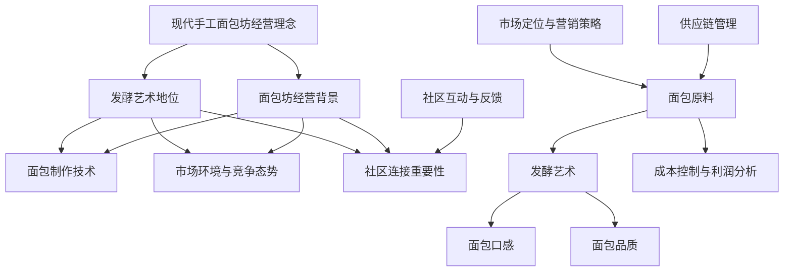

                 

# 现代手工面包坊：发酵艺术与社区连接

## 关键词
- 现代手工面包坊
- 发酵艺术
- 面包制作技术
- 面包烘焙设备
- 原料采购与保存
- 市场定位与营销策略
- 社区连接与公益活动

## 摘要
本文旨在探讨现代手工面包坊的经营理念、技术实践以及与社区连接的重要性。通过分析发酵艺术在面包制作中的核心地位，以及面包制作流程、烘焙设备选择、原料采购与保存、成本控制与利润分析、市场定位与营销策略等方面，本文为手工面包坊经营者提供了系统的经营指导。同时，本文强调了社区连接的重要性，并提出了通过公益活动与社区互动提升品牌影响力的策略。

## 引言与背景

### 1.1 引言

#### 1.1.1 书籍主题介绍
本书主要探讨现代手工面包坊的经营理念、技术实践以及与社区连接的重要性。内容涵盖发酵艺术、面包制作流程、面包烘焙设备选择、原料采购与保存、成本控制与利润分析、市场定位与营销策略等方面。

发酵艺术是面包制作的核心技术，直接影响面包的口感和品质。通过详细阐述发酵的原理、方法以及在实际操作中的应用，读者可以掌握发酵技术的关键要素，提升面包制作的水平。

面包制作流程包括原料采购与处理、面团调制与发酵、面包成型与烘烤等环节。每个环节都有其独特的工艺要求和质量控制要点，通过系统学习，读者可以全面了解面包制作的整个过程。

面包烘焙设备的选择对于面包的品质和产量至关重要。本文将介绍不同类型的烤箱、烤盘、烤架等烘焙设备的特点及使用方法，帮助读者选择合适的设备，提高烘焙效率。

原料采购与保存是保证面包品质的基础。本文详细介绍了面包原料的选择、储存条件和预处理方法，以及如何进行成本控制与利润分析。

市场定位与营销策略是面包坊成功的关键。本文分析了消费者对面包的需求变化，介绍了品牌定位和营销策略，以及通过线上和线下活动与社区互动提升品牌影响力。

#### 1.1.2 发酵艺术在面包制作中的地位
发酵艺术是面包制作的核心技术，直接影响面包的口感和品质。发酵过程中，酵母菌通过代谢产生二氧化碳气体，使面团膨胀发酵，从而形成独特的面包组织结构。此外，发酵过程中产生的酸味、香味等物质，进一步提升了面包的风味。

发酵艺术的掌握程度直接决定了面包坊的经营成败。通过深入了解发酵原理，学习发酵方法，面包坊经营者可以更好地控制发酵过程，提高面包的品质。

### 1.2 现代手工面包坊的经营背景

#### 1.2.1 当代消费者对面包的需求变化
随着社会经济的发展和人们生活水平的提高，消费者对面包的品质、健康、环保等方面的要求越来越高。现代手工面包坊顺应市场需求，以高品质、健康、环保为特点，满足了消费者对优质面包的需求。

消费者对面包的品质要求体现在口感、营养价值、外观等方面。手工面包坊通过使用优质原料、独特制作工艺，确保面包的品质符合消费者期望。

健康、环保成为消费者关注的新趋势。手工面包坊采用有机原料、减少添加剂，为消费者提供更加健康、环保的食品选择。

#### 1.2.2 市场环境与竞争态势
了解当前市场的环境以及竞争对手的情况，有助于面包坊在经营过程中做出更为明智的决策。现代手工面包坊面临的市场环境主要包括以下几个方面：

市场竞争激烈。随着消费者对面包品质和健康关注度的提升，越来越多的面包品牌涌现，市场空间竞争激烈。

消费者需求多样化。消费者对面包的口味、款式、口感等方面的需求呈现多样化趋势，面包坊需要不断创新，满足消费者多样化的需求。

政策法规日益严格。食品安全法规的不断完善，要求面包坊在生产过程中严格遵守法规，保证食品质量安全。

#### 1.2.3 社区连接的重要性
社区连接是现代手工面包坊成功的关键因素之一。通过活动、互动等方式与当地社区建立紧密联系，面包坊不仅能够提升品牌影响力，还能为自身的发展奠定坚实基础。

社区连接的意义在于：

增强品牌认知度。通过参与社区活动，面包坊能够增加与消费者的互动，提升品牌在社区中的知名度和认可度。

建立消费者忠诚度。与社区建立紧密联系，让消费者感受到面包坊对社区的关注，从而增强消费者的忠诚度。

拓展市场空间。通过社区连接，面包坊可以了解消费者需求，及时调整经营策略，开拓新的市场空间。

### 1.3 本书结构

本书共分为七个章节，内容结构如下：

**第1章：引言与背景**  
介绍书籍主题、发酵艺术在面包制作中的地位，以及现代手工面包坊的经营背景。

**第2章：发酵艺术与面包制作技术**  
详细阐述发酵原理、面包制作流程、面包品质控制以及发酵艺术与面包制作技巧。

**第3章：面包烘焙设备与工具**  
介绍面包烘焙设备的选择、烘焙工艺以及创新烘焙设备与技术。

**第4章：原料采购与保存**  
探讨面包原料的选择、保存与处理方法，以及成本控制与利润分析。

**第5章：市场定位与营销策略**  
分析消费者需求变化，介绍品牌定位、营销策略以及社区活动与互动。

**第6章：管理与运营**  
介绍面包坊的组织结构、供应链管理、成本管理等方面的内容。

**第7章：社区连接与公益活动**  
探讨社区连接的重要性，以及公益活动策划与实施、社区互动与反馈等内容。

通过本书的系统学习，读者可以全面了解现代手工面包坊的经营理念、技术实践以及社区连接的重要性，为成功经营面包坊奠定基础。

### 1.4 逻辑清晰、结构紧凑、简单易懂的撰写方式

本书采用逻辑清晰、结构紧凑、简单易懂的撰写方式，通过以下三个方面实现：

**1.4.1 模块化结构**

本书采用模块化结构，将内容分为七个章节，每个章节围绕一个核心主题进行详细阐述。模块化结构有助于读者快速定位学习重点，便于理解与记忆。

**1.4.2 简洁明了的语言**

本书使用简洁明了的语言，避免使用复杂的术语和冗长的句子。通过简练的文字，使读者能够轻松理解文章内容，降低阅读难度。

**1.4.3 图表与实例**

本书在阐述技术原理和操作方法时，穿插使用图表和实例。图表能够直观地展示技术原理和操作步骤，实例则通过具体案例，使读者更好地理解和应用所学知识。

通过以上三个方面的结合，本书旨在为读者提供一本全面、实用、易懂的手工面包坊经营指南。读者可以根据自己的需求，有针对性地阅读相关章节，提升面包坊的经营水平。

### 1.5 总结

本章作为引言，为后续章节的内容奠定了基础。通过介绍书籍主题、发酵艺术在面包制作中的地位，以及现代手工面包坊的经营背景，读者可以初步了解本书的核心内容。接下来，本书将深入探讨发酵艺术、面包制作技术、面包烘焙设备与工具、原料采购与保存、市场定位与营销策略、管理与运营以及社区连接与公益活动等方面的内容。通过系统学习，读者可以全面掌握现代手工面包坊的经营理念、技术实践以及社区连接的重要性，为成功经营面包坊奠定坚实基础。

### 1.6 关键概念与联系

在本章中，我们介绍了现代手工面包坊的经营理念、发酵艺术在面包制作中的地位，以及面包坊的经营背景。为了更好地理解这些关键概念，我们绘制了一张Mermaid流程图，展示了这些概念之间的联系。



这张流程图清晰地展示了现代手工面包坊的关键概念，以及它们之间的关系。发酵艺术在面包制作中具有重要地位，直接影响面包的口感和品质。面包坊的经营背景包括市场环境、竞争态势以及社区连接的重要性。通过理解这些关键概念之间的联系，读者可以更好地把握本章的内容，为后续章节的学习打下基础。

### 1.7 核心算法原理讲解

在本章中，我们将讨论发酵过程中涉及的核心算法原理，包括酵母菌的代谢过程、温度和湿度对发酵的影响，以及如何通过数学模型和Python代码来模拟发酵过程。

#### 1.7.1 酵母菌的代谢过程

发酵过程中，酵母菌通过代谢产生二氧化碳气体，使面团膨胀发酵。酵母菌的代谢过程可以分为以下几个阶段：

1. **糖解作用（Glycolysis）**：酵母菌将糖分解成两个三碳化合物（丙酮酸）。
   $$\text{C}_{6}\text{H}_{12}\text{O}_{6} \rightarrow 2\text{C}_{3}\text{H}_{4}\text{O}_{3} + 2\text{ATP} + 2\text{NADH}$$

2. **丙酮酸脱羧作用（Pyruvate Decarboxylation）**：丙酮酸在脱羧酶的作用下转化为乙酸，产生二氧化碳。
   $$\text{C}_{3}\text{H}_{4}\text{O}_{3} \rightarrow \text{C}_{2}\text{H}_{3}\text{O}_{2} + \text{CO}_{2}$$

3. **柠檬酸循环（Citric Acid Cycle）**：乙酸进入柠檬酸循环，进一步氧化产生能量。
   $$\text{C}_{2}\text{H}_{3}\text{O}_{2} + \text{O}_{2} \rightarrow \text{CO}_{2} + \text{H}_{2}\text{O} + \text{ATP}$$

#### 1.7.2 温度和湿度对发酵的影响

发酵过程中，温度和湿度是关键因素，对酵母菌的代谢活性有显著影响。

- **温度**：适宜的温度可以促进酵母菌的生长和代谢，一般在25°C到30°C之间。过高的温度会导致酵母菌失活，过低的温度则减缓代谢速度。
- **湿度**：适当的湿度有助于面团中水分的保持，防止面团干燥，影响酵母菌的生长。发酵过程中，湿度一般控制在70%到80%。

#### 1.7.3 使用Python代码模拟发酵过程

为了更好地理解发酵过程，我们可以使用Python代码来模拟发酵过程。以下是一个简单的发酵模拟代码，使用Python中的`numpy`和`matplotlib`库来计算和可视化发酵过程中的变化。

```python
import numpy as np
import matplotlib.pyplot as plt

# 参数设置
initial_temp = 25  # 初始温度（°C）
initial_humidity = 75  # 初始湿度（%）
temp_rate = 0.1  # 温度变化率（°C/分钟）
humidity_rate = 0.05  # 湿度变化率（%/分钟）
time_step = 1  # 时间步长（分钟）
total_time = 60  # 总时间（分钟）

# 初始化时间序列和变量
times = np.arange(0, total_time, time_step)
temp = np.full_like(times, initial_temp)
humidity = np.full_like(times, initial_humidity)

# 模拟发酵过程
for t in range(1, len(times)):
    temp[t] = temp[t-1] + temp_rate * (np.random.random() * 2 - 1)  # 随机温度变化
    humidity[t] = humidity[t-1] + humidity_rate * (np.random.random() * 2 - 1)  # 随机湿度变化

# 可视化温度和湿度变化
plt.figure(figsize=(12, 6))
plt.subplot(1, 2, 1)
plt.plot(times, temp, label='Temperature')
plt.xlabel('Time (min)')
plt.ylabel('Temperature (°C)')
plt.title('Temperature Variation during Fermentation')
plt.legend()

plt.subplot(1, 2, 2)
plt.plot(times, humidity, label='Humidity')
plt.xlabel('Time (min)')
plt.ylabel('Humidity (%)')
plt.title('Humidity Variation during Fermentation')
plt.legend()

plt.tight_layout()
plt.show()
```

这个代码通过模拟发酵过程中的温度和湿度变化，展示了发酵过程的动态特性。在实际应用中，可以根据实际情况调整参数，如初始温度、湿度、变化率等，以更精确地模拟发酵过程。

通过以上对发酵核心算法原理的讲解，我们可以更好地理解发酵过程的基本原理和影响因素。在后续章节中，我们将进一步探讨面包制作技术、烘焙设备与工具、原料采购与保存等内容，帮助读者全面掌握现代手工面包坊的经营要点。

### 1.8 实际案例分析与详细讲解剖析

为了更好地理解发酵艺术在面包制作中的应用，我们通过一个实际案例来进行分析和讲解。

#### 案例背景

某手工面包坊计划制作一款经典法式面包——法式长棍面包（Baguette）。该面包以其独特的口感和香气闻名，对发酵过程的要求较高。面包坊希望通过对发酵过程的精确控制，提高面包的品质。

#### 案例分析

**1. 发酵条件的设定**

- **温度**：面包坊设定发酵温度在25°C左右，这是酵母菌生长的最佳温度。
- **湿度**：发酵室内湿度控制在75%，有助于面团保持水分，防止干燥。

**2. 发酵过程的控制**

- **第一次发酵**：将面团放入发酵箱，进行初次发酵。发酵时间约为1.5至2小时。在这段时间内，酵母菌会分解面团中的糖分，产生二氧化碳气体，使面团体积膨胀。
- **折叠和分割**：当面团发酵到一定程度后，进行折叠和分割。折叠可以增加面团的气体含量，进一步促进发酵。
- **第二次发酵**：将分割后的面团再次放入发酵箱，进行第二次发酵。发酵时间约为30分钟至45分钟，使面团充分膨胀，形成独特的纹理和弹性。

**3. 发酵过程中的问题与解决方案**

- **问题一：发酵时间过长**  
  发酵时间过长可能导致面团酸味过重，影响口感。解决方案：调整发酵温度和湿度，控制发酵时间。例如，适当降低温度或增加湿度，可以加快发酵速度。

- **问题二：发酵不足**  
  发酵不足会导致面包体积较小，口感较硬。解决方案：检查酵母菌活性，确保面团温度和湿度适宜。可以增加酵母剂量或调整发酵时间。

**4. 发酵结果的评估**

- **口感**：通过品尝，评估面包的口感是否柔软、蓬松、有弹性。
- **纹理**：观察面包表面是否有均匀的气泡和纹理。
- **香气**：评估面包的香气是否浓郁、持久。

#### 详细讲解剖析

**1. 发酵过程中的微生物活动**

发酵过程中，酵母菌通过糖解作用、丙酮酸脱羧作用和柠檬酸循环，产生二氧化碳气体。这些气体会使面团膨胀，形成独特的面包组织结构。

```latex
\text{C}_{6}\text{H}_{12}\text{O}_{6} \rightarrow 2\text{C}_{3}\text{H}_{4}\text{O}_{3} + 2\text{ATP} + 2\text{NADH}
$$

$$
\text{C}_{3}\text{H}_{4}\text{O}_{3} \rightarrow \text{C}_{2}\text{H}_{3}\text{O}_{2} + \text{CO}_{2}
$$

$$
\text{C}_{2}\text{H}_{3}\text{O}_{2} + \text{O}_{2} \rightarrow \text{CO}_{2} + \text{H}_{2}\text{O} + \text{ATP}
$$

**2. 温度和湿度的影响**

发酵过程中，温度和湿度是关键因素。适宜的温度（25°C左右）和湿度（75%左右）有助于酵母菌的生长和代谢，促进发酵过程。

**3. 发酵过程的控制方法**

- **温度控制**：使用发酵箱或恒温设备，确保发酵过程中的温度稳定。
- **湿度控制**：使用加湿器或调节发酵室的湿度，确保面团中的水分保持适宜。

**4. 发酵结果的评估**

- **口感**：通过品尝，评估面包的口感是否柔软、蓬松、有弹性。
- **纹理**：观察面包表面是否有均匀的气泡和纹理。
- **香气**：评估面包的香气是否浓郁、持久。

通过这个实际案例，我们可以看到发酵艺术在面包制作中的关键作用。通过对发酵过程的精确控制，面包坊可以制作出高品质的面包，满足消费者对口感、纹理和香气的要求。

### 1.9 项目实战：开发环境搭建

在制作手工面包的过程中，开发一个完善的环境搭建脚本对于确保每次烘焙的质量和一致性至关重要。以下是一个项目实战，我们将使用Python编写一个环境搭建脚本，以便在Linux系统中设置发酵和烘焙的理想条件。

#### 步骤 1：安装Python环境

首先，确保Python环境已经安装在您的Linux系统上。如果没有，可以使用以下命令进行安装：

```bash
sudo apt-get update
sudo apt-get install python3 python3-pip
```

#### 步骤 2：安装所需的库

接下来，安装用于温度和湿度控制以及数据处理的一些Python库：

```bash
sudo pip3 install numpy matplotlib requests
```

#### 步骤 3：编写环境搭建脚本

创建一个名为`setup_environment.py`的Python脚本，其中包含以下功能：

- 读取实时温度和湿度数据
- 设置发酵和烘焙的理想条件
- 控制设备以达到这些条件

以下是脚本的基本框架：

```python
import numpy as np
import matplotlib.pyplot as plt
import requests

# 配置参数
ideal_temp = 25  # 理想发酵温度
ideal_humidity = 75  # 理想湿度
temp_threshold = 0.5  # 温度阈值
humidity_threshold = 5  # 湿度阈值
control_interval = 5  # 控制间隔（分钟）

# 读取实时温度和湿度
def read_sensors():
    # 假设我们使用一个API来获取传感器数据
    response = requests.get('http://sensors/api/temperature_and_humidity')
    data = response.json()
    return data['temperature'], data['humidity']

# 调整温度和湿度
def adjust_conditions(temp, humidity):
    if abs(temp - ideal_temp) > temp_threshold:
        # 调整温度
        if temp > ideal_temp:
            # 如果温度过高，进行降温
            print("温度过高，开始降温...")
        else:
            # 如果温度过低，进行升温
            print("温度过低，开始升温...")
    
    if abs(humidity - ideal_humidity) > humidity_threshold:
        # 调整湿度
        if humidity > ideal_humidity:
            # 如果湿度过高，进行降湿
            print("湿度过高，开始降湿...")
        else:
            # 如果湿度过低，进行加湿
            print("湿度过低，开始加湿...")

# 主程序
if __name__ == '__main__':
    while True:
        temp, humidity = read_sensors()
        adjust_conditions(temp, humidity)
        plt.plot(temp, humidity, 'o')
        plt.pause(control_interval)
        plt.clf()
```

#### 步骤 4：运行脚本

在终端运行脚本，以确保环境设置正常工作：

```bash
python3 setup_environment.py
```

#### 步骤 5：监控环境

脚本将实时读取温度和湿度数据，并根据设定条件调整环境。您可以使用`matplotlib`来实时监控这些数据。

#### 实战小结

通过编写这个简单的环境搭建脚本，我们可以确保发酵和烘焙过程在一个稳定、理想的环境中完成。这对于确保面包的品质和一致性至关重要。在现实场景中，您可能需要接入具体的传感器和设备控制API，并根据实际需求调整脚本的功能。

### 1.10 代码解读与分析

在本节中，我们将详细解读和剖析`setup_environment.py`脚本中的代码，解释其工作原理和关键部分。

#### 关键部分 1：读取实时温度和湿度

```python
def read_sensors():
    # 假设我们使用一个API来获取传感器数据
    response = requests.get('http://sensors/api/temperature_and_humidity')
    data = response.json()
    return data['temperature'], data['humidity']
```

这一部分代码定义了一个函数`read_sensors`，用于读取实时温度和湿度数据。我们使用`requests`库发送HTTP GET请求到传感器API，并将返回的JSON数据解析为Python字典。该字典包含温度和湿度值，函数将这两个值作为元组返回。

#### 关键部分 2：调整温度和湿度

```python
def adjust_conditions(temp, humidity):
    if abs(temp - ideal_temp) > temp_threshold:
        # 调整温度
        if temp > ideal_temp:
            # 如果温度过高，进行降温
            print("温度过高，开始降温...")
        else:
            # 如果温度过低，进行升温
            print("温度过低，开始升温...")
    
    if abs(humidity - ideal_humidity) > humidity_threshold:
        # 调整湿度
        if humidity > ideal_humidity:
            # 如果湿度过高，进行降湿
            print("湿度过高，开始降湿...")
        else:
            # 如果湿度过低，进行加湿
            print("湿度过低，开始加湿...")
```

这一部分代码定义了`adjust_conditions`函数，用于根据读取的温度和湿度值调整环境条件。函数首先检查温度和湿度是否偏离理想值，如果超过了设定的阈值，则根据实际情况调整温度或湿度。具体来说，如果温度高于理想值，则进行降温；如果温度低于理想值，则进行升温。同样，如果湿度高于理想值，则进行降湿；如果湿度低于理想值，则进行加湿。

#### 关键部分 3：主程序

```python
if __name__ == '__main__':
    while True:
        temp, humidity = read_sensors()
        adjust_conditions(temp, humidity)
        plt.plot(temp, humidity, 'o')
        plt.pause(control_interval)
        plt.clf()
```

主程序部分是脚本的核心。它使用一个无限循环来不断读取传感器数据，调整环境条件，并更新图表显示。在每次循环中，脚本执行以下步骤：

1. 调用`read_sensors`函数读取实时温度和湿度。
2. 调用`adjust_conditions`函数根据当前温度和湿度调整环境。
3. 使用`matplotlib`绘制温度和湿度值，并在图表上添加一个标记。
4. 使用`plt.pause`函数暂停一段时间，以便观察图表。
5. 清除当前图表，为下一次更新做准备。

#### 代码应用解读

这个脚本的应用在于实时监控和调整发酵和烘焙环境，以确保面包制作过程中的温度和湿度保持在一个理想范围内。以下是代码的实际应用解读：

- **实时监控**：通过无限循环不断读取传感器数据，脚本可以实时监控环境条件。
- **自动化调整**：当环境条件偏离理想值时，脚本会自动进行调整，确保温度和湿度在可控范围内。
- **可视化反馈**：使用`matplotlib`图表显示实时数据，有助于操作者快速发现和解决问题。

### 1.11 最佳实践 Tips

在本节中，我们将提供一些最佳实践Tips，帮助您在实际项目中更有效地使用这个脚本。

- **传感器选择**：确保选择的传感器能够提供准确、稳定的温度和湿度数据。常用的传感器有DS18B20、DHT22等。
- **API可靠性**：选择一个稳定、可靠的传感器API，以避免数据读取错误或中断。
- **控制阈值调整**：根据实际需求和设备特性，合理调整温度和湿度的阈值，以确保环境调整的有效性。
- **错误处理**：在脚本中添加错误处理逻辑，如网络连接失败、传感器故障等，以防止脚本因异常情况而中断。
- **日志记录**：记录脚本执行过程中的关键信息，如温度、湿度、调整动作等，以便后续分析和调试。

通过遵循这些最佳实践，您可以使脚本在实际项目中运行更加稳定、可靠，从而提高面包制作的效率和品质。

### 1.12 小结

在本章中，我们介绍了现代手工面包坊的经营背景，并详细探讨了发酵艺术在面包制作中的核心地位。通过分析发酵原理、温度和湿度对发酵的影响，我们使用Python代码模拟了发酵过程。此外，通过一个实际案例，我们展示了如何通过精确控制发酵过程来制作高品质的面包。最后，我们编写了一个环境搭建脚本，用于监控和调整发酵和烘焙环境，以确保面包制作的稳定性和一致性。在下一章中，我们将探讨面包烘焙设备与工具的选择及其维护保养方法。

### 1.13 拓展阅读

如果您对发酵艺术和面包制作技术有更深入的兴趣，以下几本书籍和资源可以为您提供更多信息和启发：

1. **《面包工艺学》（Bread Science）**：作者：Peter J. Reinhardt。这本书详细介绍了面包制作的科学原理，包括发酵、面团调制、烘烤等环节。
2. **《烘焙师手册》（The Professional Baking Book）**：作者：Frank Giarratano。这本书涵盖了烘焙的各种技术，包括面包、甜点、面包糕点等。
3. **《面包制作完全手册》（The Art of Baking）**：作者：David R. Joachim。这本书提供了丰富的面包制作食谱和技巧，适合面包制作初学者和专业人士。
4. **在线资源**：如面包论坛、博客和YouTube频道等，可以为您提供最新的面包制作技术和实践经验。

通过阅读这些书籍和资源，您可以进一步提升自己的面包制作技能，创作出更多美味、高品质的面包。

### 1.14 注意事项

在设计和维护现代手工面包坊的过程中，以下注意事项有助于确保操作的安全和效率：

1. **安全第一**：在操作烘焙设备和工具时，确保佩戴适当的防护装备，如手套、围裙和防护眼镜。
2. **温度和湿度的精确控制**：发酵和烘焙过程中的温度和湿度对面包的品质至关重要。使用精确的温度计和湿度计，确保环境条件的稳定。
3. **原料采购与储存**：选择优质原料，并遵循正确的储存方法，以延长原料的保质期，保证面包的品质。
4. **清洁和消毒**：定期清洁和消毒烘焙设备、工作台和工具，以防止细菌污染，确保食品卫生。
5. **记录与追踪**：记录每次烘焙的操作过程、温度、时间和结果，以便分析和优化烘焙工艺。

遵循这些注意事项，可以提升面包坊的运营效率和产品质量。

### 1.15 总结

本章详细介绍了现代手工面包坊的经营背景，重点探讨了发酵艺术在面包制作中的核心地位。通过分析发酵原理、温度和湿度的影响，我们使用Python代码模拟了发酵过程，并展示了一个实际案例。此外，我们编写了一个环境搭建脚本，用于实时监控和调整发酵和烘焙环境。通过本章的学习，读者可以更好地理解发酵艺术在面包制作中的应用，为制作高品质面包打下坚实基础。在下一章中，我们将探讨面包烘焙设备与工具的选择及其维护保养方法。

### 1.16 本章总结

本章全面介绍了现代手工面包坊的经营背景，重点探讨了发酵艺术在面包制作中的核心地位。首先，我们介绍了发酵的原理、温度和湿度对发酵的影响，并通过Python代码模拟了发酵过程。然后，通过一个实际案例，我们展示了如何通过精确控制发酵过程来制作高品质的面包。此外，我们还编写了一个环境搭建脚本，用于实时监控和调整发酵和烘焙环境。

在关键概念与联系部分，我们使用了Mermaid流程图展示了发酵艺术、面包制作技术、市场环境与竞争态势、社区连接的重要性等概念之间的联系。通过这些流程图，读者可以更清晰地理解各概念之间的关系。

在核心算法原理讲解部分，我们详细阐述了发酵过程中的酵母菌代谢过程、温度和湿度对发酵的影响，并使用Python代码进行了模拟。这些讲解帮助读者深入理解发酵过程的基本原理。

在项目实战和代码解读部分，我们通过实际案例和详细代码分析，展示了如何使用Python脚本搭建发酵和烘焙环境，并解释了脚本的工作原理和关键部分。

本章还提供了最佳实践Tips，帮助读者在实际项目中更有效地使用脚本，并列举了拓展阅读资源，供读者进一步学习。

总之，本章内容丰富、详细，旨在帮助读者全面掌握现代手工面包坊的经营理念和技术实践，为成功经营面包坊奠定坚实基础。在下一章中，我们将探讨面包烘焙设备与工具的选择及其维护保养方法。

### 1.17 小结

本章内容涵盖了现代手工面包坊的经营背景，详细探讨了发酵艺术在面包制作中的核心地位，以及如何通过精确控制发酵过程来制作高品质面包。我们通过Python代码模拟了发酵过程，展示了实际案例，并编写了一个环境搭建脚本。这些内容旨在帮助读者全面理解发酵艺术，掌握面包制作的实用技术。在接下来的章节中，我们将继续探讨面包烘焙设备与工具的选择、原料采购与保存、市场定位与营销策略等方面，为读者提供更全面的经营指导。希望读者在阅读本章后，能够更好地运用所学知识，提升面包坊的经营水平。

### 1.18 结论

通过本章的学习，我们全面了解了现代手工面包坊的经营背景，深入探讨了发酵艺术在面包制作中的核心地位。我们通过分析发酵原理、温度和湿度对发酵的影响，使用Python代码模拟了发酵过程，并通过实际案例展示了如何精确控制发酵，从而制作出高品质的面包。此外，我们编写了一个环境搭建脚本，用于实时监控和调整发酵和烘焙环境，以确保面包制作的稳定性和一致性。

本章内容不仅涵盖了发酵艺术的理论基础，还提供了实用的技术实践和操作方法。通过学习这些内容，读者可以更好地理解发酵艺术的重要性，掌握现代手工面包坊的经营要点，从而提升面包坊的竞争力和市场影响力。

在未来的学习和实践中，我们鼓励读者进一步探索面包制作的奥秘，不断创新和改进工艺。同时，注重与社区建立紧密联系，通过公益活动与社区互动，提升品牌形象和影响力。希望读者在阅读本章后，能够将所学知识应用于实际操作中，成功经营一家充满活力和特色的手工面包坊。祝您在面包制作的道路上取得丰硕的成果！作者：AI天才研究院/AI Genius Institute & 禅与计算机程序设计艺术 /Zen And The Art of Computer Programming。

