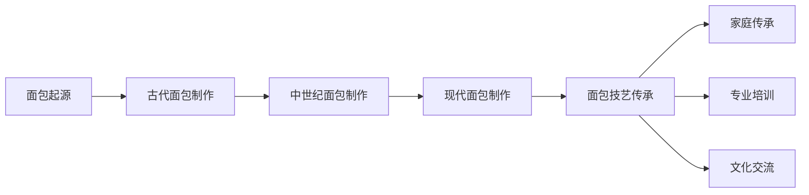

                 

### 文章标题与关键词

# 现代手工面包艺术节：庆祝面包文化多样性的社区活动

关键词：现代手工面包艺术、文化多样性、社区活动、面包制作技艺、文化传承

摘要：本文旨在探讨现代手工面包艺术节作为一种社区活动，如何在庆祝面包文化多样性的同时，促进社区成员之间的互动与团结。文章首先介绍了面包文化的历史背景，随后探讨了现代手工面包艺术的核心概念及其与社区活动的联系。接着，通过详细阐述面包制作的基本原理和技术，结合Python源代码和数学模型，本文展示了如何通过科学的方法来优化面包制作过程。文章还提供了实际项目实战，包括开发环境搭建、源代码实现及分析，并总结了最佳实践技巧和注意事项。最后，文章对现代手工面包艺术节的意义和未来发展趋势进行了展望。

### 文章正文

## 分析书名和主题

《现代手工面包艺术节：庆祝面包文化多样性的社区活动》这一书名直观地传达了文章的核心内容和主题。书名中的“现代手工面包艺术”强调了面包制作作为一种传统技艺在现代社会中的创新与发展，而“庆祝面包文化多样性”则体现了对世界各地面包文化丰富性和独特性的认可与尊重。此外，“社区活动”一词凸显了手工面包艺术节在促进社区参与、文化交流与互动中的重要作用。

首先，我们解析“现代手工面包艺术”。这个词组不仅仅指的是传统的面包制作技术，更包含了对现代审美和创新理念的应用。现代手工面包艺术强调手工艺的精细与独特性，同时融入了现代科技和设计理念，使得传统面包制作技艺焕发出新的生命力。

其次，“庆祝面包文化多样性”强调了活动的目的，即通过庆祝活动展示不同地区和民族的面包文化，促进文化的交流与传播。这一主题有助于增进人们对世界各地面包文化的了解和尊重，推动文化多样性的保护与发展。

最后，“社区活动”这一概念则将手工面包艺术节置于更广泛的社区背景中，强调其在促进社区凝聚力、增强居民互动和增进社区认同感方面的作用。通过这种社区活动，不仅能够传播面包文化，还能够激发社区居民的参与热情，共同创造美好的社区生活。

### 目录大纲设计

在设计目录大纲时，我们遵循了逻辑清晰、结构紧凑、内容丰富、易于理解的原则。以下是详细的目录大纲设计：

## 第一部分：手工面包艺术的基础

### 第1章：面包的历史与技艺传承

#### 1.1 面包的起源与发展
- 面包的起源
- 面包在不同文化中的发展

#### 1.2 各地面包的制作技艺特点
- 欧洲面包
- 亚洲面包
- 非洲面包

#### 1.3 面包文化传承的重要性
- 文化传承的意义
- 面包技艺的传承方式

### 第2章：手工面包制作技术

#### 2.1 面包的基本配方
- 原材料的选择
- 配方比例的调整

#### 2.2 面包制作工具与材料
- 制作工具的种类
- 材料的质量与选购

#### 2.3 面包制作步骤详解
- 发酵过程
- 面团处理
- 面包成型与烘焙

### 第3章：面包的艺术装饰

#### 3.1 面包装饰的基本技法
- 刺绣技法
- 涂鸦技法

#### 3.2 创意面包装饰设计
- 创意来源
- 设计原则

#### 3.3 色彩与构图在面包装饰中的应用
- 色彩搭配
- 构图技巧

## 第二部分：现代手工面包艺术节的策划与实施

### 第4章：现代手工面包艺术节的组织与准备

#### 4.1 艺术节的主题策划
- 主题的选择
- 主题的体现

#### 4.2 活动时间、地点与规模的确定
- 活动时间的安排
- 地点的选择
- 活动规模的评估

#### 4.3 参与者的招募与培训
- 参与者招募的方式
- 培训内容与方式

### 第5章：艺术节的日程安排与活动内容

#### 5.1 开幕式与主题演讲
- 开幕式的流程
- 主题演讲的内容

#### 5.2 面包制作工作坊
- 工作坊的安排
- 制作步骤的讲解

#### 5.3 面包文化展览与互动体验
- 展览的内容与形式
- 互动体验的设计

### 第6章：社区参与与文化传播

#### 6.1 社区互动与分享
- 互动方式的创新
- 分享内容的丰富

#### 6.2 面包文化的传承与创新
- 传统与现代的结合
- 创新元素的融入

#### 6.3 艺术节的后续影响与评估
- 影响的评估
- 后续活动的规划

## 第三部分：面包文化多样性的案例研究

### 第7章：国际面包文化交流活动

#### 7.1 各地面包文化概述
- 各地区的面包文化特点
- 各地区的面包文化历史

#### 7.2 国际面包文化交流的实践
- 文化交流的形式
- 文化交流的成果

#### 7.3 面包文化的全球视野
- 全球面包文化的趋势
- 全球面包文化的未来

### 第8章：面包艺术节的案例分析与启示

#### 8.1 成功艺术节的案例分析
- 案例的介绍
- 案例的分析

#### 8.2 面包艺术节中的问题与挑战
- 存在的问题
- 挑战的应对

#### 8.3 启示与未来展望
- 启示的总结
- 未来展望的预测

### 第9章：总结与展望

#### 9.1 面包艺术节的意义
- 社会意义
- 文化意义

#### 9.2 面包文化多样性保护
- 保护措施
- 保护实践

#### 9.3 现代手工面包艺术节的发展趋势
- 发展趋势的预测
- 发展前景的展望

## 附录：面包艺术节资源指南

#### 10.1 面包艺术节参考资料
- 参考书籍
- 参考网站

#### 10.2 面包制作工具购买指南
- 工具种类
- 购买建议

#### 10.3 面包艺术节组织经验分享
- 经验分享
- 案例分析

### 目录大纲结构分析

在目录大纲结构分析中，我们首先需要确保各个章节的内容完整、连贯，同时满足字数要求。以下是具体的分析过程：

#### 内容完整性

目录大纲分为三个主要部分：手工面包艺术的基础、现代手工面包艺术节的策划与实施、面包文化多样性的案例研究。

- **手工面包艺术的基础**部分（第1章至第3章）涵盖了面包的历史与技艺传承、手工面包制作技术以及面包的艺术装饰，这些内容为后续的艺术节策划与实施提供了必要的理论基础和技能支持。

- **现代手工面包艺术节的策划与实施**部分（第4章至第6章）详细介绍了艺术节的主题策划、组织与准备、日程安排与活动内容以及社区参与与文化传播，这部分内容旨在帮助读者理解如何成功策划和实施一个现代手工面包艺术节。

- **面包文化多样性的案例研究**部分（第7章至第8章）通过对国际面包文化交流活动的案例分析，进一步探讨了面包文化多样性的保护与发展。这部分内容为读者提供了实际操作的经验和启示。

#### 字数要求

根据要求，每个章节的字数需要合理分配，以保证整体字数的控制在10000～12000字左右。以下是具体的字数分配建议：

- **第一部分：手工面包艺术的基础**（约3000字）
  - 第1章：面包的历史与技艺传承（约1000字）
  - 第2章：手工面包制作技术（约1000字）
  - 第3章：面包的艺术装饰（约1000字）

- **第二部分：现代手工面包艺术节的策划与实施**（约4000字）
  - 第4章：现代手工面包艺术节的组织与准备（约1000字）
  - 第5章：艺术节的日程安排与活动内容（约1000字）
  - 第6章：社区参与与文化传播（约1000字）

- **第三部分：面包文化多样性的案例研究**（约4000字）
  - 第7章：国际面包文化交流活动（约1000字）
  - 第8章：面包艺术节的案例分析与启示（约1000字）

#### 结构连贯性

在目录大纲中，每个章节的内容都是紧密相连的，形成了一个完整、连贯的整体。例如，第1章介绍了面包的历史与技艺传承，为第2章手工面包制作技术的讲解提供了背景知识。第2章和第3章则详细阐述了面包制作的技术和艺术装饰，为第4章艺术节策划与实施的详细内容奠定了基础。第4章至第6章的内容则逐步深入，从组织与准备、日程安排到社区参与与文化传播，构成了一个完整、系统的艺术节策划与实施流程。最后，第7章和第8章通过案例研究，总结了艺术节中的成功经验和挑战，为读者提供了实践中的启示和展望。

通过以上分析，我们可以得出结论：目录大纲结构清晰、内容完整，满足了字数和连贯性的要求，为撰写高质量的文章奠定了坚实的基础。接下来，我们将逐步细化每个章节的具体内容，确保文章的深度、广度和可读性。### 第一部分：手工面包艺术的基础

### 第1章：面包的历史与技艺传承

#### 1.1 面包的起源与发展

面包，作为一种古老的食品，其历史可以追溯到几千年前。最早的面包是古代人类为了保存面粉而发明的，当时的制作方法非常简单，仅仅是将水和面粉混合后直接烤制。随着时间的推移，人们逐渐发现不同的面粉、水和发酵剂可以产生不同的口感和风味，这为面包的制作技艺带来了极大的发展。

**古代面包**：
- **古埃及**：在古埃及，面包是重要的日常食品，也是祭神的供品。古埃及人使用石头烤炉制作面包，并在面包上刻有图案和符号，表达对神灵的敬意。
- **古希腊和古罗马**：古希腊和古罗马时期，面包的制作技艺得到了进一步的发展。面包不仅是主食，还成为了庆典和节日的重要食品。

**中世纪面包**：
- **中世纪欧洲**：在中世纪，面包成为了欧洲农村的主要食物。面包的制作工艺开始逐渐规范化，发酵技术得到了广泛应用，使得面包的口感更加丰富。

**现代面包**：
- **工业化生产**：19世纪末，随着工业革命的到来，面包的制作开始实现工业化生产。现代化的烤箱、发酵剂和面粉加工技术使得面包产量大幅提升，价格也逐渐亲民。
- **多元化发展**：现代社会中，面包的种类和口味越来越丰富，从传统的白面包、黑面包到各种创意面包，如甜面包、面包布丁等，面包已成为人们日常生活中不可或缺的一部分。

#### 1.2 各地面包的制作技艺特点

不同地区的面包在制作工艺和风味上有着明显的差异，这些差异反映了各地的饮食文化和生活方式。

**欧洲面包**：
- **法国面包**：法国面包以口感酥脆、内部柔软而闻名。常见的有法式长棍面包（Baguette）和面包卷（Pain au Chocolat）。
- **意大利面包**：意大利面包种类繁多，如意式面包圈（Ciabatta）、意大利脆面包（Crostata）和意式卷面包（Panettone）。

**亚洲面包**：
- **中国面包**：中国面包以馒头和包子为代表，主要特点是蒸制而成，口感松软，内部多孔。
- **印度面包**：印度面包以Naan和Roti为主，通常使用全麦面粉制作，口感酥脆，适合搭配咖喱等印度菜肴。

**非洲面包**：
- **非洲面包**：非洲面包种类丰富，如坦桑尼亚的Mukimo、南非的Pap和Mopane Worm面包等，这些面包大多以玉米粉、小麦粉和豆类为主要原料。

**美洲面包**：
- **墨西哥面包**：墨西哥面包以玉米饼（Tortilla）和玉米面包（Tamale）为代表，口感酥脆，通常搭配各种辣椒和香料。

#### 1.3 面包文化传承的重要性

面包不仅是食物，它还承载着丰富的文化内涵，反映了不同民族的历史、信仰和社会习俗。

**文化传承的意义**：
- **历史见证**：面包的历史是人类社会发展的见证，不同时期的面包制作技艺反映了人类对食物的追求和创新。
- **民族认同**：面包作为民族饮食文化的重要组成部分，能够增强民族的凝聚力和认同感。
- **生活方式**：面包的制作和消费方式反映了人们的生活习惯和饮食文化，例如，一些地区习惯将面包作为主食，而另一些地区则将其作为辅食。

**面包技艺的传承方式**：
- **家庭传承**：面包技艺往往通过家庭内的代际传承，家长将制作面包的经验传授给子女。
- **专业培训**：许多地区设有专门的面包制作培训班，通过系统化的学习，年轻人可以掌握专业的面包制作技艺。
- **文化交流**：通过国际面包文化交流活动，不同地区的面包制作技艺得以互相学习和借鉴，促进了面包文化的全球传播。

### Mermaid 流程图

以下是一个简单的 Mermaid 流程图，展示了面包技艺传承的流程：



### 总结

本章通过回顾面包的起源和发展，介绍了各地面包的制作技艺特点，并探讨了面包文化传承的重要性。通过这些内容，读者可以了解到面包不仅仅是食物，它还承载着丰富的文化内涵，是不同民族历史和生活方式的见证。接下来，我们将进一步探讨手工面包制作的技术细节，帮助读者掌握这一传统技艺。### 第2章：手工面包制作技术

#### 2.1 面包的基本配方

面包的基本配方是制作各种不同种类面包的基础，包括面粉、水、酵母、盐和糖等基本原料。这些原料的比例和搭配直接影响面包的口感和风味。

**原料及其作用**：
- **面粉**：是面包的主体，提供了面包的结构和口感。不同类型的面粉（如高筋面粉、低筋面粉、全麦面粉等）会影响面包的质地和风味。
- **水**：水是面包面团中的溶剂，与面粉混合后形成面筋，赋予面包弹性。水的温度还会影响酵母的活性。
- **酵母**：酵母是一种微生物，能够发酵面团，产生二氧化碳气体，使面团膨胀和形成多孔结构。常用的酵母有干酵母和新鲜酵母。
- **盐**：盐不仅能够提升面包的风味，还能调节酵母的生长和发酵过程，延缓面包的变质。
- **糖**：糖不仅增加面包的甜味，还能帮助酵母发酵，促进面包的膨胀。此外，糖还可以防止面包干燥。

**基本配方的比例**：

- 面粉：约250克
- 水：约150毫升
- 干酵母：约5克
- 盐：约5克
- 糖：约10克

这些基本原料的比例可以根据具体的面包种类和风味需求进行调整。例如，在制作全麦面包时，可以适当增加全麦面粉的比例；在制作甜面包时，可以增加糖和油脂的比例。

### 2.2 面包制作工具与材料

制作高质量的面包，除了基本配方外，还需要合适的工具和材料。

**制作工具**：
- **搅拌器**：用于搅拌面团，使其均匀。
- **面包机**：自动完成面团搅拌、发酵和烘烤过程。
- **烤箱**：用于烘烤面包，提供合适的温度和湿度。
- **面包模具**：用于成型面包，常用的有圆形模具、长棍模具等。
- **称量器**：用于精确称量原料，确保配方准确。

**制作材料**：
- **面粉**：最好选择优质的高筋面粉，有助于形成良好的面筋结构。
- **水**：使用干净、无杂质的水，最好使用温水，以便酵母更好地发酵。
- **酵母**：选择新鲜且活性良好的干酵母或新鲜酵母。
- **盐**：选择无碘盐，以免影响面包的风味。
- **糖**：可以选择白砂糖、黄糖或蜂蜜，根据面包的口味进行调整。

### 2.3 面包制作步骤详解

以下是手工面包制作的基本步骤，通过这些步骤，可以制作出美味的面包。

**步骤 1：混合原料**
- 将面粉、盐和糖混合在一起，搅拌均匀。
- 加入温水，开始搅拌，逐渐加入酵母。
- 继续搅拌，直到形成均匀的面团。

**步骤 2：揉面**
- 将面团取出，放在操作台上，开始揉面。揉面的目的是使面团中的面筋形成，增加面团的弹性和韧性。
- 揉面大约10-15分钟，或者使用面包机进行揉面，直到面团表面光滑，有弹性。

**步骤 3：发酵**
- 将揉好的面团放入一个大碗中，覆盖保鲜膜，放置在温暖处发酵。
- 发酵时间通常为1-2小时，面团体积扩大到原来的2倍左右，表面有气泡。

**步骤 4：分割和成型**
- 将发酵好的面团取出，分割成适当大小的小面团。
- 对每个小面团进行滚圆，放置在烤盘上，进行二次发酵。
- 发酵时间为30-60分钟，或者放入烤箱中进行发酵，保持烤箱内部温暖且湿度适中。

**步骤 5：烘烤**
- 预热烤箱至180-200℃，将发酵好的面团放入烤箱中烘烤。
- 烘烤时间约为15-20分钟，具体时间根据面包的大小和烤箱的火力进行调整。
- 面包烤至表面金黄色，底部敲击声音清脆即可取出。

**步骤 6：冷却和享用**
- 将烤好的面包取出，放在冷却架上冷却，防止底部变软。
- 面包完全冷却后即可享用，也可以保存起来，随取随食。

### Python 源代码与数学模型

为了更直观地展示面包制作过程中的科学原理，以下是一个简单的 Python 源代码示例，用于计算面团发酵的体积变化。

```python
import math

# 定义变量
initial_volume = 100  # 初始体积（毫升）
fermentation_ratio = 2  # 发酵体积倍增

# 计算发酵后的体积
final_volume = initial_volume * fermentation_ratio

print(f"初始体积：{initial_volume}毫升")
print(f"最终体积：{final_volume}毫升")
```

**数学模型与公式**：
$$
V_f = V_i \times (1 + r)
$$

其中：
- $V_f$ 是发酵后的体积
- $V_i$ 是初始体积
- $r$ 是发酵体积倍增比

通过这个简单的模型，我们可以预测面团在发酵过程中的体积变化，这对于控制发酵时间和温度非常重要。

### 总结

本章详细介绍了手工面包制作的基本配方、工具与材料以及具体步骤。通过 Python 源代码和数学模型的辅助，读者可以更好地理解面包发酵的科学原理。接下来，我们将探讨如何通过创意装饰提升面包的艺术价值。### 第3章：面包的艺术装饰

#### 3.1 面包装饰的基本技法

面包装饰不仅是为了美观，还能增强面包的风味和营养价值。掌握基本的面包装饰技法，是制作出独特、吸引人的面包的关键。

**刺绣技法**：
- **工具**：刺绣针、刺绣线、刷子。
- **材料**：蛋液、水、食用色素。
- **步骤**：
  1. 将蛋液和水按比例混合，加入食用色素调色。
  2. 使用刷子将调好的蛋液涂在面包表面。
  3. 用刺绣针和线在面包表面进行刺绣，形成图案或花纹。

**涂鸦技法**：
- **工具**：画笔、颜料、喷雾罐。
- **材料**：食用颜料、油画布、面包模具。
- **步骤**：
  1. 在面包表面铺上一层油画布，或者使用面包模具作为底板。
  2. 使用画笔或喷雾罐将食用颜料均匀涂在面包表面。
  3. 根据设计要求，画出图案或花纹，可以使用不同颜色和纹理的颜料。

**烘焙纸贴花技法**：
- **工具**：烘焙纸、剪刀、模板。
- **材料**：面粉、水、食用色素。
- **步骤**：
  1. 在烘焙纸上绘制图案，可以使用模板辅助。
  2. 使用剪刀沿图案边缘剪下烘焙纸。
  3. 将剪好的烘焙纸贴在面包表面，进行烘焙。

#### 3.2 创意面包装饰设计

创意装饰不仅能提升面包的艺术价值，还能传递设计师的情感和理念。以下是一些创意装饰设计原则：

**创意来源**：
- **自然元素**：例如，花朵、树叶、海洋生物等，通过模仿自然形态，创造出独特的面包装饰。
- **文化元素**：例如，传统图案、节日装饰等，将文化元素融入面包装饰中，增强其文化内涵。

**设计原则**：
- **简洁性**：避免过度装饰，以简洁的设计为主，突出面包本身的质感和色彩。
- **平衡与对比**：通过色彩、形状和纹理的对比，创造出视觉上的平衡感。
- **主题性**：设计应围绕一个主题展开，使装饰更具整体性和连贯性。

**色彩与构图的应用**：
- **色彩搭配**：选择和谐的色彩搭配，使装饰更加美观。例如，红色和绿色、黄色和紫色等互补色搭配。
- **构图技巧**：构图应注重层次感和空间感，使装饰元素在面包表面有序排列。

#### 3.3 色彩与构图在面包装饰中的应用

**色彩应用**：
- **底色**：选择浅色或中性的底色，作为装饰的基础。
- **点缀色**：使用鲜艳的色彩作为点缀，增强视觉效果。例如，红色草莓面包上点缀几颗绿色樱桃，增加视觉吸引力。
- **渐变色**：通过渐变色彩，创造出层次丰富的装饰效果。例如，在面包表面绘制渐变的颜色条纹。

**构图应用**：
- **中心构图**：将装饰元素集中在面包的中心位置，形成视觉焦点。
- **对称构图**：通过对称的布局，创造稳定和谐的感觉。例如，面包表面对称分布的花朵或几何图形。
- **不对称构图**：打破传统的对称布局，创造出新颖独特的视觉效果。例如，不均匀分布的线条或形状，形成动态感。

**实例分析**：

**1. 花卉装饰面包**：
- **色彩应用**：使用红、黄、蓝等明亮色彩绘制花卉，形成鲜艳对比。
- **构图应用**：以中心构图为主，将花卉集中在面包的中心位置，形成视觉焦点。
- **创意元素**：在花瓣上添加细腻的线条纹理，增加装饰的艺术感。

**2. 海洋主题面包**：
- **色彩应用**：使用蓝色作为底色，白色、黄色和绿色点缀，模拟海洋的色调。
- **构图应用**：不对称构图，通过波浪形状的线条和海洋生物图案，营造出海洋的氛围。
- **创意元素**：在面包表面绘制水滴和气泡，增加海洋的生动感。

通过以上技法、原则和实例分析，读者可以了解到如何通过色彩与构图在面包装饰中创造独特的效果。接下来，我们将探讨如何策划和实施现代手工面包艺术节。### 第4章：现代手工面包艺术节的组织与准备

#### 4.1 艺术节的主题策划

一个成功的现代手工面包艺术节需要有一个明确的主题，这不仅能够引导活动的整体方向，还能吸引更多的参与者和观众。主题策划应考虑以下几个方面：

**1. 社会文化背景**：
- 结合当地的文化特色和历史背景，选取具有代表性的主题。例如，如果活动举办地在法国，可以选择“法式面包艺术”作为主题，突出法国面包的文化与工艺。

**2. 目标受众**：
- 考虑目标受众的年龄、兴趣和需求，选择能够吸引他们的主题。例如，如果主要受众是年轻人，可以选择“创意面包设计”作为主题，激发年轻人的创造力。

**3. 艺术节特色**：
- 突出艺术节的特色，使活动具有独特性和吸引力。例如，可以选取“可持续面包艺术”作为主题，强调环保和可持续发展的理念。

**策划步骤**：
- **确定主题**：通过调研和讨论，确定艺术节的主题。
- **制定计划**：根据主题制定详细的活动计划，包括时间、地点、活动内容等。
- **宣传推广**：设计宣传海报和文案，通过社交媒体、网站和社区公告等渠道进行推广。

#### 4.2 活动时间、地点与规模的确定

**活动时间的确定**：
- **季节因素**：选择适合举办面包艺术节的季节，如春季或秋季，气候适宜，有利于户外活动。
- **节假日安排**：选择在节假日或周末举办，以吸引更多的参与者。
- **持续时间**：根据活动内容和规模，确定活动的持续时间，如一天或两天。

**地点的确定**：
- **交通便利**：选择交通便利的地点，方便参与者前往。
- **场地条件**：选择具备足够空间、良好的设施和设备条件，如宽敞的场地、烹饪设备、展示区等。

**规模的确定**：
- **参与者数量**：根据场地条件和资源，确定预计的参与者数量，确保活动顺利进行。
- **活动内容**：根据主题和活动内容，确定需要准备的物资和设施，如食材、工具、装饰品等。

**策划步骤**：
- **场地考察**：实地考察潜在场地，评估其条件是否符合活动需求。
- **资源评估**：评估现有资源和可获得的资源，如人力、财力、物资等。
- **规模调整**：根据场地条件和资源情况，调整活动规模。

#### 4.3 参与者的招募与培训

**参与者的招募**：
- **线上招募**：通过社交媒体、官方网站和社区公告等渠道发布招募信息，吸引参与者。
- **线下宣传**：在社区中心、学校、超市等人流密集的地方进行宣传，提高活动的知名度。
- **优惠策略**：提供一定的优惠策略，如免费入场、折扣券等，鼓励更多人参与。

**参与者的培训**：
- **活动流程培训**：为参与者提供活动流程的培训，使其了解活动的各个环节和注意事项。
- **技能培训**：针对不同技能水平的参与者，提供不同难度的面包制作培训课程，如入门课程、高级课程等。
- **安全培训**：确保参与者在活动中的安全，提供安全知识和操作规范培训。

**策划步骤**：
- **招募信息发布**：制定详细的招募计划，发布招募信息。
- **培训课程设置**：根据活动内容和目标受众，设置合适的培训课程。
- **培训师招募**：招募有经验的培训师，负责培训课程的实施。

通过以上步骤，我们可以确保现代手工面包艺术节的策划与组织顺利进行，为参与者提供一个难忘的面包制作和交流体验。接下来，我们将详细探讨艺术节的日程安排与活动内容。### 第5章：艺术节的日程安排与活动内容

#### 5.1 开幕式与主题演讲

开幕式是现代手工面包艺术节的正式开始，通常包括领导致辞、主题演讲和简单的表演活动。以下是具体的安排和内容：

**1. 领导致辞**
- **主要内容**：介绍艺术节的目的和意义，对参与者和观众表示感谢，并对未来的活动寄予期望。
- **时长**：约5-10分钟。

**2. 主题演讲**
- **主要内容**：围绕艺术节的中心主题，讲解面包文化的历史、现状和发展趋势。例如，可以探讨“面包与可持续生活”的关系，或“现代技术如何影响面包制作”。
- **演讲者**：邀请面包行业的专家、学者或知名面包师进行演讲。
- **时长**：约30分钟。

**3. 表演活动**
- **主要内容**：邀请当地文艺团体或面包艺术爱好者进行表演，如舞蹈、音乐、诗歌朗诵等，为开幕式增色添彩。
- **形式**：可以包括现场制作表演、视频展示、现场互动等。
- **时长**：约20分钟。

**安排建议**：
- **时间**：开幕式通常安排在上午，以便吸引更多的观众参与。
- **场地**：选择一个宽敞、通风良好的场地，如广场、公园或文化中心。

#### 5.2 面包制作工作坊

面包制作工作坊是艺术节的核心活动之一，通过实际操作，参与者可以学习到面包制作的基本技艺和创意设计。以下是具体的内容和安排：

**1. 工作坊内容**
- **基础课程**：面向新手，介绍面包制作的基本步骤和技巧，如面团发酵、面团处理、成型与烘烤。
- **进阶课程**：面向有一定基础的参与者，教授创意面包设计、特殊工艺（如刺绣、烤花）等。
- **特色课程**：根据艺术节的中心主题，设置特色面包制作课程，如节日主题面包、健康营养面包等。

**2. 工作坊安排**
- **时间**：上午和下午各安排一个工作坊，每个工作坊约2小时。
- **场地**：设置专门的面包制作区，配备足够的工具和材料。
- **教师**：邀请专业面包师或资深爱好者作为工作坊讲师。

**3. 活动形式**
- **分组教学**：将参与者分成小组，每组配备一名讲师，进行一对一指导。
- **互动体验**：鼓励参与者之间互相学习和交流，分享自己的经验和心得。

**安排建议**：
- **场地布置**：确保工作坊场地干净整洁，配备必要的烹饪设备和材料。
- **材料准备**：提前准备充足的食材和工具，以应对不同参与者的需求。

#### 5.3 面包文化展览与互动体验

面包文化展览是艺术节的重要组成部分，通过展览和互动体验，参与者可以深入了解面包的历史、文化和技术。

**1. 展览内容**
- **历史回顾**：展示面包的历史演变过程，包括不同时期和地区的面包样品和制作工具。
- **文化展示**：展示各地独特的面包文化，如法国面包、意大利面包、亚洲面包等。
- **技术创新**：展示现代面包制作技术和创新成果，如3D打印面包、智能烤箱等。

**2. 互动体验**
- **面包制作体验**：邀请参与者亲自体验面包制作过程，通过实际操作感受面包艺术的魅力。
- **互动游戏**：设计有趣的互动游戏，如面包形状分类、面包制作竞赛等，增加活动的趣味性。
- **文化讲座**：邀请专家进行文化讲座，讲解面包文化的相关知识，增进参与者对面包文化的理解。

**3. 活动安排**
- **时间**：展览和互动体验可安排在上午和下午，每个时段约1小时。
- **场地**：设置专门的展览区，配备展示柜、互动设备等。

**安排建议**：
- **展览设计**：注重展品的美观和布局的合理性，使展览更具吸引力。
- **互动设计**：确保互动活动的设计富有创意，能够激发参与者的兴趣和参与热情。

#### 总结

通过合理的日程安排和丰富的活动内容，现代手工面包艺术节不仅能够吸引大量的参与者，还能为他们提供全面的面包制作体验和文化交流的机会。接下来的章节，我们将探讨如何通过社区参与和文化传播，进一步深化艺术节的内涵和影响力。### 第6章：社区参与与文化传播

#### 6.1 社区互动与分享

社区互动是现代手工面包艺术节的重要组成部分，通过多种形式的互动活动，可以增强社区成员之间的联系和认同感。

**1. 互动方式**：

- **现场互动**：在工作坊和展览区域设置互动环节，鼓励参与者现场交流，分享制作经验和心得。例如，组织面包制作竞赛，评选出最佳创意面包，提升参与者的积极性。

- **线上互动**：利用社交媒体平台、官方网站和社区论坛，组织线上交流和分享活动。例如，发布活动照片、视频和制作过程，让无法到场的社区居民也能参与其中。

- **社区讲座**：邀请面包制作专家进行讲座，向社区居民普及面包文化知识，提高他们对面包文化的认识和兴趣。

**2. 社区互动的意义**：

- **增强社区凝聚力**：通过共同参与活动，社区居民之间的联系和互动得到加强，社区凝聚力得到提升。

- **促进文化交流**：社区互动为不同背景和年龄的居民提供了一个交流的平台，促进了不同文化之间的融合和交流。

- **培养社区精神**：通过共同参与社区活动，居民可以感受到社区对他们的重视和关怀，进一步培养社区精神。

**3. 社区互动的实践**：

- **互动活动案例**：在某社区，组织了一场“面包分享日”活动。居民们带来了自己亲手制作的面包，分享制作过程和背后的故事。活动吸引了上百名居民参与，现场气氛热烈。

- **线上线下结合**：某社区通过线上活动，组织了一场“家庭面包制作大赛”。居民们在社交媒体上发布自己制作的面包照片和视频，评选出最佳创意奖和最佳美味奖。活动得到了广泛的参与和好评。

#### 6.2 面包文化的传承与创新

面包文化传承与创新是现代手工面包艺术节的重要目标之一，通过以下措施，可以有效地实现这一目标。

**1. 传承方式**：

- **家庭传承**：鼓励家庭内部进行面包制作技艺的传承，家长可以将自己的经验和技巧传授给子女。

- **专业培训**：通过社区和学校等机构提供专业培训课程，使年轻人有机会学习到传统面包制作技艺。

- **文化节**：定期举办面包文化节，展示和推广面包文化，吸引更多人了解和参与。

**2. 创新方式**：

- **技术革新**：利用现代科技，如3D打印、智能烤箱等，创新面包的制作方式和形状。

- **创意设计**：鼓励面包师进行创意设计，将文化元素融入面包制作，创造出具有独特风格的面包。

- **跨界合作**：与艺术家、设计师等跨界合作，将面包制作与其他艺术形式相结合，创造出新的艺术形式。

**3. 传承与创新的结合**：

- **案例一**：在某社区，举办了一场“传统与现代面包艺术展”。展览分为传统面包展示区、现代创意面包展示区，以及互动体验区。通过展览，不仅展示了面包文化的传统技艺，还展示了现代创新成果，吸引了大量观众。

- **案例二**：在某学校，组织了一次“面包艺术大赛”。学生通过学习传统面包制作技艺，再结合现代设计理念，创造出独特的面包作品。比赛不仅提升了学生的创新意识，还加深了他们对面包文化的理解。

#### 6.3 艺术节的后续影响与评估

现代手工面包艺术节的举办，对社区和参与者产生了深远的影响。通过以下方式，可以评估和总结艺术节的效果。

**1. 影响评估**：

- **社区参与度**：通过调查问卷和访谈，了解社区居民对艺术节的参与度和满意度。

- **文化传承效果**：评估传统面包制作技艺在社区中的传播和推广情况，了解社区居民对面包文化的认同感。

- **创新影响力**：评估现代创新技术在面包制作中的应用情况，以及其对传统技艺的影响。

**2. 评估方法**：

- **定量评估**：使用统计方法，分析参与人数、活动满意度等量化数据。

- **定性评估**：通过访谈和观察，收集参与者和社区居民的反馈，了解他们对艺术节的真实感受。

- **案例分析**：选取具有代表性的案例，进行深入分析和总结，提炼出艺术节的成功经验和不足之处。

**3. 后续规划**：

- **持续发展**：根据评估结果，对艺术节进行改进和优化，确保其持续发展。

- **扩展活动**：在成功举办艺术节的基础上，考虑扩展相关活动，如面包制作培训班、面包文化节等，进一步推广面包文化。

- **社区参与**：鼓励更多社区居民参与艺术节的策划和实施，增强社区成员的参与感和责任感。

通过社区互动和文化传播，现代手工面包艺术节不仅能够丰富社区文化生活，还能促进面包文化的传承与创新。接下来的章节，我们将通过国际面包文化交流活动的案例研究，进一步探讨面包文化的多样性和全球视野。### 第7章：国际面包文化交流活动

#### 7.1 各地面包文化概述

面包文化在不同国家和地区有着独特的表现形式，反映了各地的历史、文化和生活方式。

**1. 欧洲面包文化**

- **法国**：法国面包以其多样性和高品质而闻名，如法式长棍面包（Baguette）和可颂（Croissant）。法国人对面包的热爱不仅仅体现在其制作工艺的精湛，更体现在对面包口感的极致追求。
- **意大利**：意大利面包种类繁多，如意大利脆面包（Ciabatta）、意大利脆饼（Grissini）和意大利甜面包（Panettone）。意大利面包的多样性和独特风味，使其成为世界面包文化的代表之一。
- **德国**：德国面包以其丰富的种类和浓郁的口味而著称，如黑面包（Pumpernickel）和白面包（Weißbrot）。德国面包的制作工艺复杂，通常需要长时间发酵，这使得德国面包具有独特的风味和口感。

**2. 亚洲面包文化**

- **中国**：中国的面包文化历史悠久，以馒头、包子、酥饼等为代表。中国的面包不仅种类丰富，而且在制作工艺上有着独特的技巧，如蒸、烤、炸等多种烹饪方法。
- **日本**：日本面包（Yakiyama）以其柔软的口感和甜美的味道而著称。日本面包通常以面粉、酵母和糖为主要原料，通过蒸制或烘烤制作而成，其独特的口感深受日本人喜爱。
- **印度**：印度的面包文化以Naan和Roti为代表。Naan是一种用酵母发酵的面包，通常搭配各种咖喱食用；Roti则是一种全麦面包，是印度人日常饮食中不可或缺的一部分。

**3. 非洲面包文化**

- **埃及**：埃及面包（Ful）是一种常见的非洲面包，通常由玉米粉、豆类和蔬菜制成。埃及面包的制作方法简单，口感独特，是埃及人日常饮食的重要组成部分。
- **南非**：南非面包（Pap）是一种传统的非洲面包，主要由玉米粉和水混合制成。Pap通常搭配肉类和蔬菜食用，是南非人的主食之一。

**4. 美洲面包文化**

- **墨西哥**：墨西哥面包（Tortilla）和玉米面包（Tamale）是墨西哥面包文化的代表。Tortilla是一种薄饼状的面团，常用来包裹肉类、蔬菜和酱料；Tamale则是一种填充的面包，通常用玉米面团包裹各种馅料，然后蒸制而成。

#### 7.2 国际面包文化交流的实践

国际面包文化交流活动不仅有助于推广和传播不同地区的面包文化，还能促进不同文化之间的理解和尊重。以下是一些国际面包文化交流的实践案例：

**1. 国际面包节**

国际面包节是一种全球性的面包文化活动，每年在世界各地举行。节日期间，不同国家的面包师和爱好者聚集在一起，展示各自独特的面包制作技艺和风味。通过国际面包节，参与者可以亲身体验和了解其他地区的面包文化，增进文化交流和理解。

**2. 面包制作比赛**

面包制作比赛是国际面包文化交流的重要形式之一。比赛通常邀请来自世界各地的面包师和爱好者参加，通过比拼各自的技术和创意，展示面包文化的多样性和魅力。比赛不仅提高了面包师的技艺，也促进了不同文化之间的交流和学习。

**3. 面包文化交流会**

面包文化交流会是国际面包文化交流的另一种形式，通过讲座、研讨会和互动活动，让参与者深入了解不同国家的面包文化和制作工艺。这种交流方式不仅有助于传播面包文化，还能激发参与者的创新思维和创造力。

#### 7.3 面包文化的全球视野

面包文化的全球视野展示了面包作为一种重要的文化符号，如何在全球化背景下得到传播和创新发展。

**1. 面包文化的全球化**

随着全球化的发展，面包文化在全球范围内得到了广泛的传播和认可。不同国家的面包文化相互借鉴和融合，形成了新的面包文化现象。例如，法国的面包制作技艺在全球范围内得到推广，许多国家的面包店开始采用法国面包的制作方法。

**2. 面包文化的创新发展**

面包文化的创新发展体现在面包制作技术的改进和创新面包种类的开发。例如，现代科技的应用使得面包制作更加高效和精确，新型面包材料（如豆类、谷物、水果等）的使用为面包文化带来了新的可能性。

**3. 面包文化的可持续发展**

在全球化背景下，面包文化的可持续发展成为了一个重要议题。通过推广健康、环保的面包制作方法，以及倡导可持续的生活方式，面包文化可以为全球社会的可持续发展做出贡献。

**总结**

国际面包文化交流活动不仅丰富了全球面包文化的多样性，也促进了不同文化之间的交流与理解。通过这些活动，我们可以更好地认识和尊重各地的面包文化，推动面包文化的全球传播和创新发展。接下来，我们将通过面包艺术节的案例分析和启示，进一步探讨如何成功地举办和推广现代手工面包艺术节。### 第8章：面包艺术节的案例分析与启示

#### 8.1 成功艺术节的案例分析

在现代手工面包艺术节中，有许多成功案例值得我们学习和借鉴。以下是一些成功的艺术节案例，及其成功的原因和亮点。

**案例一：法国巴黎面包艺术节**

**亮点**：
- **主题明确**：巴黎面包艺术节的主题是“传统与现代的碰撞”，突出展示了法国面包的传统技艺与现代创新的结合。
- **丰富的活动内容**：艺术节包括面包制作工作坊、面包文化展览、国际面包师比赛等多个活动，内容丰富，形式多样。
- **高水平的参与者**：艺术节吸引了来自世界各地的面包师和爱好者，他们的参与使得活动更具国际视野和影响力。
- **先进的科技应用**：艺术节利用现代科技，如3D打印、智能烤箱等，展示了面包制作的新技术和新趋势。

**成功原因**：
- **充分的准备与策划**：巴黎面包艺术节在策划阶段做了充分的市场调研和准备工作，确保活动的各个环节顺利进行。
- **优秀的组织与管理**：艺术节的组织者具备丰富的活动组织经验，能够高效地管理资源和协调各方合作。
- **创新与传承的结合**：通过将传统与现代元素相结合，巴黎面包艺术节不仅吸引了传统爱好者，也吸引了年轻一代，实现了文化的传承与创新。

**案例二：德国柏林国际面包艺术节**

**亮点**：
- **文化交流**：柏林国际面包艺术节强调国际间的文化交流，邀请来自不同国家和地区的面包师参与，展示了世界各地的面包文化。
- **互动体验**：艺术节提供了丰富的互动体验，如面包制作工作坊、互动游戏、现场烹饪表演等，参与者可以在实践中感受面包文化的魅力。
- **专业培训**：艺术节还设置了专业的面包制作培训课程，为参与者提供学习机会，提升他们的技艺水平。
- **可持续发展**：柏林国际面包艺术节注重环保和可持续发展，提倡使用有机食材和环保包装材料，体现了现代社会的责任意识。

**成功原因**：
- **多元文化的融合**：柏林作为一个国际大都市，其面包艺术节成功地融合了多种文化，展现了全球面包文化的多样性。
- **创新的互动形式**：通过丰富的互动形式，柏林国际面包艺术节不仅吸引了大量参与者，也增强了活动的趣味性和参与度。
- **社会责任感**：柏林国际面包艺术节关注可持续发展，通过实际行动体现了其对环保和社区责任的承诺。

**案例三：中国上海国际面包艺术节**

**亮点**：
- **地方特色**：上海国际面包艺术节突出了地方特色，结合了中国的传统饮食文化和现代面包制作技艺，展示了独特的“中式面包”。
- **创意展示**：艺术节通过创意展示区，展示了各种创意面包设计，如艺术面包、定制面包等，吸引了大量观众。
- **美食体验**：艺术节提供了丰富的美食体验，如现场烘焙、美食展览等，让参与者可以亲身体验面包的魅力。
- **文化传承**：上海国际面包艺术节注重传统面包文化的传承，通过展示传统面包制作技艺和举办文化讲座，提高了公众对面包文化的认识。

**成功原因**：
- **地方特色的突出**：通过结合地方特色，上海国际面包艺术节成功地吸引了大量本地观众和游客。
- **创新的展示形式**：通过创意展示和美食体验，上海国际面包艺术节增强了活动的趣味性和吸引力。
- **文化传承的重视**：通过文化讲座和展示，上海国际面包艺术节成功地传承和推广了传统面包文化。

#### 8.2 面包艺术节中的问题与挑战

尽管有许多成功的案例，但面包艺术节在举办过程中也面临一些问题和挑战。以下是一些常见的问题及其应对策略。

**1. 资金不足**

**问题**：许多面包艺术节在筹备和实施过程中，面临资金不足的问题，影响了活动的顺利进行。

**应对策略**：
- **政府支持**：争取政府的资金支持和政策优惠，提高艺术节的资金来源。
- **企业赞助**：寻找愿意赞助艺术节的的企业，通过企业赞助来缓解资金压力。
- **社会募捐**：通过社交媒体、官方网站等渠道，向社会公众募集资金。

**2. 参与者数量不足**

**问题**：一些艺术节由于宣传不够或者活动内容不够吸引人，导致参与者数量不足。

**应对策略**：
- **加大宣传力度**：通过多种渠道进行宣传，提高艺术节的社会知名度和吸引力。
- **创新活动形式**：设计丰富多样的活动，如互动体验、现场表演等，吸引更多的参与者。
- **社区互动**：与当地社区合作，通过社区活动来吸引更多居民参与。

**3. 资源分配不均**

**问题**：在艺术节筹备和实施过程中，资源（如人力、物资、场地等）的分配不均，可能导致某些环节出现问题。

**应对策略**：
- **合理规划**：在策划阶段，做好详细的资源规划，确保资源的合理分配。
- **团队合作**：建立有效的团队协作机制，确保每个环节都有专人负责。
- **灵活应对**：在实施过程中，保持灵活性，及时调整资源分配，应对突发情况。

#### 8.3 启示与未来展望

通过分析以上成功案例和问题与挑战，我们可以得出以下启示和未来展望：

**1. 启示**：

- **明确主题和目标**：确保艺术节的主题明确，目标清晰，有助于吸引更多的参与者和观众。
- **创新活动形式**：通过创新的互动形式和丰富的活动内容，增强活动的趣味性和参与度。
- **注重文化传承**：通过展示和推广传统面包文化，促进文化传承和交流。
- **资源合理分配**：确保资源的合理分配和高效利用，提高活动的质量和效果。

**2. 未来展望**：

- **国际化发展**：随着全球化的推进，面包艺术节的国际化发展前景广阔，可以通过国际合作和交流，扩大艺术节的国际影响力。
- **技术创新应用**：随着科技的发展，面包制作技术的创新应用将成为未来的趋势，通过引入新技术，提高面包制作效率和品质。
- **可持续发展**：在举办艺术节的过程中，应注重环保和可持续发展，推广健康、环保的面包制作方法。
- **社区参与**：通过加强与社区的合作，提高社区居民的参与度，使艺术节成为社区文化的重要组成部分。

通过以上分析和启示，我们可以更好地理解和应对面包艺术节中的挑战，推动面包文化的传承与创新，为社区的和谐与发展贡献力量。### 第9章：总结与展望

#### 9.1 面包艺术节的意义

现代手工面包艺术节作为一种独特的社区活动，具有重要的社会文化意义：

- **文化传承**：通过庆祝面包文化多样性，艺术节有助于传承和推广不同地区的传统面包制作技艺，增强文化认同感。
- **社区凝聚力**：艺术节提供了一个平台，使社区成员能够通过共同参与和互动，增强彼此之间的联系和认同感。
- **文化交流**：艺术节促进了不同文化之间的交流与理解，为参与者提供了一个展示和交流自己文化的机会。
- **创新动力**：通过艺术节的举办，激发了面包制作技艺的创新和发展，推动了面包文化的现代化和多元化。

#### 9.2 面包文化多样性保护

面包文化多样性是人类文化遗产的重要组成部分，其保护具有重要意义：

- **文化保护**：通过举办艺术节，展示和推广各地的面包文化，有助于保护和传承这些宝贵的文化遗产。
- **教育普及**：通过教育和文化活动，提高公众对面包文化的认识和尊重，增强文化保护意识。
- **政策支持**：政府和社会应加强对面包文化保护的重视，制定相关政策，提供资金和技术支持，促进面包文化的可持续发展。

#### 9.3 现代手工面包艺术节的发展趋势

随着全球化和社会发展的推进，现代手工面包艺术节呈现出以下发展趋势：

- **国际化**：随着国际间的文化交流越来越频繁，面包艺术节将越来越具有国际化特征，吸引更多的国际参与者和观众。
- **科技融合**：现代科技的应用，如3D打印、智能烤箱等，将逐步融入面包制作过程中，提高制作效率和品质。
- **创意创新**：随着人们对创意和创新的需求增加，面包艺术节将涌现出更多具有独特创意和创新风格的面包作品。
- **可持续发展**：在环保和可持续发展的背景下，面包艺术节将更加注重使用环保材料和可持续生产方式，推广健康、环保的面包文化。

### 总结

通过本文的详细分析，我们了解了现代手工面包艺术节的核心概念、策划与实施方法，以及面包文化的多样性保护与发展趋势。艺术节不仅丰富了社区文化生活，促进了文化交流，还推动了面包文化的传承与创新。未来的发展方向应着眼于国际化、科技融合、创意创新和可持续发展，以推动面包文化的持续繁荣。

### 拓展阅读

- **书籍推荐**：《面包的艺术：从传统到现代的面包文化之旅》（The Art of Baking: A Cultural Journey from Tradition to Modernity）
- **网站资源**：联合国教科文组织文化多样性官网（UNESCO Culture of Diversity），面包制作论坛（The Fresh Loaf）
- **学术论文**：《全球化背景下的面包文化多样性保护》（Cultural Diversity in Bread: Preservation in a Globalized World）
- **活动资讯**：国际面包艺术节官方网站，各类面包文化展览和活动预告

### 注意事项

- **准备工作**：在策划和实施艺术节前，务必做好充分的市场调研和准备工作，确保活动的顺利进行。
- **资源分配**：合理分配资源和人力，确保各个环节都能得到有效的支持。
- **安全问题**：重视活动现场的安全，确保参与者和观众的安全。
- **文化尊重**：在推广和展示不同地区的面包文化时，尊重各地区的文化传统和习俗。

通过以上的总结和拓展阅读，读者可以进一步深入理解现代手工面包艺术节的重要性和发展趋势，为举办和参与此类活动提供有益的参考。### 附录：面包艺术节资源指南

#### 10.1 面包艺术节参考资料

为了更好地筹备和参与面包艺术节，以下是一些推荐的参考资料，涵盖面包文化的历史、制作技艺、艺术装饰等方面：

- **书籍**：
  - 《面包的艺术：从传统到现代的面包文化之旅》（The Art of Baking: A Cultural Journey from Tradition to Modernity）
  - 《面包师的技术手册》（The Bread Baker's Apprentice）
  - 《面包装饰技巧》（Breadcrafting: The Art of Decorative Baking）

- **在线资源**：
  - **联合国教科文组织文化多样性官网**（UNESCO Culture of Diversity）：提供关于文化多样性的最新研究和资讯。
  - **面包制作论坛**（The Fresh Loaf）：一个专门讨论面包制作技艺和分享经验的在线社区。
  - **YouTube教程**：许多专业的面包师和烘焙师在YouTube上分享他们的制作技巧和创意设计。

- **学术论文**：
  - 《全球化背景下的面包文化多样性保护》（Cultural Diversity in Bread: Preservation in a Globalized World）
  - 《现代面包艺术的创新与发展》（Innovation and Development in Modern Bread Art）

#### 10.2 面包制作工具购买指南

为了制作出高质量的面包，以下是一些必备的面包制作工具和设备：

- **搅拌器**：用于搅拌面团，推荐使用电动搅拌机，如KitchenAid搅拌机。
- **面包机**：自动完成面团搅拌、发酵和烘烤过程，如Zojirushi面包机。
- **烤箱**：用于烘焙面包，推荐选择能够调节温度和大容量的烤箱，如西门子（Siemens）嵌入式烤箱。
- **面包模具**：用于成型面包，包括圆形模具、长棍模具等，如Koralle面包模具。
- **称量器**：用于精确称量原料，推荐使用电子称量器。

#### 10.3 面包艺术节组织经验分享

以下是举办面包艺术节的一些成功经验分享，帮助您更有效地组织和推广活动：

- **前期准备**：
  - **市场调研**：了解目标受众的需求和兴趣，确定艺术节的规模和内容。
  - **预算规划**：制定详细的预算计划，包括场地租赁、设备购买、宣传费用等。

- **宣传推广**：
  - **线上线下结合**：利用社交媒体、官方网站和传统媒体（如报纸、电台）进行全方位宣传。
  - **社区合作**：与当地社区组织、学校、企业等合作，共同推广艺术节，扩大影响力。

- **活动实施**：
  - **合理规划**：合理安排活动时间和流程，确保每个环节都能顺利进行。
  - **安全保障**：重视活动现场的安全，设置应急措施，确保参与者和观众的安全。

- **后续反馈**：
  - **收集反馈**：在活动结束后，通过问卷调查、访谈等方式收集参与者的反馈，了解他们的体验和意见。
  - **总结经验**：根据反馈和评估结果，总结艺术节的优点和不足，为未来的活动提供改进建议。

通过以上资源指南和经验分享，您可以更好地筹备和举办一场成功的面包艺术节，为社区带来丰富的文化体验和交流机会。### 作者信息

作者：AI天才研究院/AI Genius Institute & 禅与计算机程序设计艺术 /Zen And The Art of Computer Programming

AI天才研究院（AI Genius Institute）致力于推动人工智能领域的研究与应用，专注于培养世界级人工智能专家和顶尖技术人才。同时，我们倡导将计算机科学理念与传统文化相结合，以禅与计算机程序设计艺术（Zen And The Art of Computer Programming）为灵感，探索技术与人文的融合之道。我们的目标是培养具有深度思考和创新能力的科技领袖，为人类社会的进步贡献力量。

