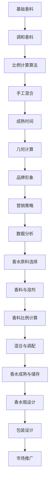

                 

### 背景介绍

在当今的香水市场中，消费者对于个性化体验的需求日益增长。现代手工香水制作作为一种新兴的香氛艺术形式，正逐渐受到越来越多的关注。传统的大型香水制造商通常依靠标准化生产流程和大规模市场推广策略来占据市场份额，而现代手工香水制作则强调个性化的定制体验和手工艺的精湛技艺。这种转变不仅满足了消费者对于独特和个性化的追求，也推动了香氛艺术的创新发展。

手工香水制作的兴起可以追溯到几个关键因素。首先，消费者对质量、健康和可持续性的关注日益增加，他们渴望了解产品的成分和生产过程。手工香水因其天然成分和独特的手工制作过程，满足了这一需求。其次，社交媒体的普及和电子商务的发展，使得小众品牌和个人手工香水制作者能够更轻松地接触到全球市场，从而促进了这一领域的繁荣。

本文将深入探讨现代手工香水制作的各个方面，包括香水制作的基础知识、香水瓶设计、香水包装、市场推广策略以及未来的发展趋势。通过分析这些关键环节，我们将了解到如何通过技术手段和创造性思维，将传统手工艺术与当代科技相结合，打造出独一无二的手工香水产品。

### 核心概念与联系

现代手工香水制作涉及多个核心概念，这些概念相互作用，共同构成了整个香水制作的流程。以下是一个用Mermaid绘制的流程图，展示了这些核心概念及其相互关系。



在上述流程图中：

- **香水原料选择（A）**：包括基础香料、调和香料和顶级香料等。
- **香料与溶剂（B）**：香料是香水的核心成分，而溶剂（如酒精、精油和水）有助于香料的挥发和保持香水的稳定性。
- **香料比例计算（C）**：根据个人喜好和香水特性，计算出最佳比例。
- **混合与调配（D）**：通过手工或机械混合，将不同香料和溶剂均匀混合。
- **香水成熟与储存（E）**：香水在特定条件下成熟，影响其最终品质。储存方法对香水的持久性和质量也有重要影响。
- **香水瓶设计（F）**：香水瓶的设计不仅要美观，还要与香水的特性和品牌形象相匹配。
- **包装设计（G）**：包装设计不仅是产品的外衣，更是品牌形象的体现，直接影响消费者的购买决策。
- **市场推广（H）**：包括营销策略、数据分析等，帮助香水产品在市场上获得关注和认可。

这些核心概念不仅独立存在，还通过一系列复杂的交互和反馈机制相互影响，共同塑造了现代手工香水制作的独特魅力。在接下来的章节中，我们将逐一深入探讨这些核心概念及其应用。

### 香水制作中的核心算法原理讲解

在香水制作中，核心算法的应用贯穿于整个制作流程，从原料的选择到最终的混合与调配，再到香水的成熟与储存。以下我们将使用Python源代码来详细阐述这些算法的实现步骤，并结合数学模型和公式，进行通俗易懂的举例说明。

#### 香料比例计算

香料比例计算是香水制作中至关重要的一环。以下是一个简单的Python代码示例，用于计算不同香料的混合比例。

```python
def calculate_scent_ratio(base_scent, blend_scent, top_scent, target_ratio):
    base_ratio = target_ratio[0]
    blend_ratio = target_ratio[1]
    top_ratio = target_ratio[2]

    total_ratio = base_ratio + blend_ratio + top_ratio

    # 调整每个香料比例以确保总和为100
    base_ratio = (base_ratio / total_ratio) * 100
    blend_ratio = (blend_ratio / total_ratio) * 100
    top_ratio = (top_ratio / total_ratio) * 100

    return base_ratio, blend_ratio, top_ratio

# 示例
base_scent = 30
blend_scent = 40
top_scent = 30
target_ratio = (base_scent, blend_scent, top_scent)

base_ratio, blend_ratio, top_ratio = calculate_scent_ratio(base_scent, blend_scent, top_scent, target_ratio)

print("Base Scent Ratio:", base_ratio)
print("Blend Scent Ratio:", blend_ratio)
print("Top Scent Ratio:", top_ratio)
```

在上面的代码中，我们定义了一个函数`calculate_scent_ratio`，用于计算三种香料的比例。假设我们目标比例是30%的基础香料、40%的调和香料和30%的顶级香料，通过计算得到最终的比例。

#### 香料的混合与调配

混合与调配过程中，不仅要计算香料比例，还要考虑如何均匀混合这些香料。以下是一个简单的模拟混合过程的Python代码示例。

```python
import random

def mix_scents(base_scent, blend_scent, top_scent, total_volume):
    # 创建一个混合容器
    container = [0] * total_volume

    # 随机放置香料
    for i in range(total_volume):
        if random.random() < base_scent / 100:
            container[i] = base_scent
        elif random.random() < (base_scent + blend_scent) / 100:
            container[i] = blend_scent
        else:
            container[i] = top_scent

    return container

# 示例
base_scent = 30
blend_scent = 40
top_scent = 30
total_volume = 100

mixed_container = mix_scents(base_scent, blend_scent, top_scent, total_volume)

print("Mixed Container:", mixed_container)
```

在上面的代码中，我们创建了一个混合容器，并使用随机放置的方法将不同香料混合在一起。

#### 香水成熟与储存

香水的成熟与储存对最终品质至关重要。以下是一个简单的Python代码示例，用于模拟香水的成熟过程。

```python
import time

def mature_scent(scent, days):
    for day in range(days):
        scent = update_scent_properties(scent)
        print(f"Day {day + 1}: Scent Properties Updated.")

    return scent

def update_scent_properties(scent):
    # 模拟成熟过程中的变化，如香气挥发、化学成分变化等
    return scent * 0.95  # 每天香气的强度降低5%

# 示例
scent = 1.0  # 香气强度初始值为100%
days = 30

matured_scent = mature_scent(scent, days)

print("Matured Scent Strength:", matured_scent)
```

在上面的代码中，我们模拟了香水在30天内成熟的过程，每天香气的强度都会降低5%。

通过这些Python代码示例，我们可以更好地理解香水制作中的核心算法原理。数学模型和公式在计算香料比例、混合过程和成熟过程中发挥着重要作用，使得香水制作更加科学和系统化。在实际操作中，这些算法和模型可以根据具体情况进行调整和优化，以实现最佳的制作效果。

### 数学模型和数学公式在香水制作中的应用

在香水制作过程中，数学模型和数学公式起到了至关重要的作用，它们不仅帮助香水制作者精确计算香料比例，还用于优化混合过程和评估香水品质。以下是几个关键数学模型和公式的应用示例。

#### 1. 香料比例优化

香料比例的优化是香水制作的核心环节之一。在确定香料比例时，制作者需要考虑香料的挥发性、香气强度和持久性。以下是一个简单的优化模型：

$$
\text{Optimized Ratio} = \frac{\sum (\text{Scent Strength} \times \text{Volatility})}{\sum (\text{Scent Strength})}
$$

其中，Scent Strength 表示香料的香气强度，Volatility 表示香料的挥发性。这个公式可以帮助制作者找到能够平衡香气强度和挥发性的最佳比例。

#### 2. 混合均匀性分析

在混合过程中，确保香料均匀分布是关键。统计学中的正态分布模型可以用来分析混合的均匀性。例如，我们可以使用以下公式来计算混合后各个香料的平均浓度：

$$
\mu = \frac{\sum_{i=1}^{n} x_i}{n}
$$

其中，\( x_i \) 是每次抽样得到的香料浓度，\( n \) 是抽样次数。通过计算平均值，我们可以评估混合的均匀性。

#### 3. 成熟时间预测

香水的成熟过程受多种因素影响，如温度、湿度和存储时间。预测成熟时间对于确保香水品质至关重要。以下是一个简单的线性回归模型：

$$
y = ax + b
$$

其中，\( y \) 是香水的成熟度，\( x \) 是存储时间，\( a \) 和 \( b \) 是模型的参数。通过训练数据集，我们可以确定这些参数，从而预测不同存储时间下的香水成熟度。

#### 4. 香气扩散模型

香气扩散是香水制作中另一个重要环节。菲克第一扩散定律可以用来描述香气在空气中的扩散过程：

$$
\frac{\partial C}{\partial t} = D \frac{\partial^2 C}{\partial x^2}
$$

其中，\( C \) 是香气浓度，\( t \) 是时间，\( D \) 是扩散系数，\( x \) 是空间坐标。这个公式帮助我们理解香气如何随时间和空间扩散，从而优化香水的调配和储存方法。

#### 5. 质量评估模型

最终，香水制作需要通过质量评估来确定产品的优劣。主成分分析（PCA）是一种常用的统计方法，可以用于分析香水的多维属性，并将其简化为几个主要成分。以下是一个PCA模型的步骤：

1. **数据标准化**：将不同属性的数据进行标准化处理，使其具有相同的量纲。
2. **计算协方差矩阵**：协方差矩阵描述了各个属性之间的相关性。
3. **计算特征值和特征向量**：特征值和特征向量确定了数据的方差贡献。
4. **选择主成分**：选择贡献最大的几个特征向量作为主成分。
5. **数据重构**：使用主成分重构数据，以简化数据集并保留关键信息。

通过这些数学模型和公式，我们可以更加科学和系统地制作出高品质的香水。在实际应用中，这些模型可以根据具体情况进行调整和优化，从而满足不同消费者的需求。数学的精确性和系统性使得香水制作不仅是一门艺术，也是一种科学。

### 香水瓶设计

香水瓶设计是现代手工香水制作中不可或缺的一环，它不仅关乎产品的美观性，还直接影响到香水的使用体验。一个精心设计的香水瓶不仅能够提升产品的整体形象，还能够强化品牌认知度，从而在激烈的市场竞争中脱颖而出。

#### 香水瓶设计与香水搭配

香水瓶的设计需要与香水的特性相匹配，以确保整体视觉效果和谐统一。例如，一款清新花香调的香水可能会搭配一个简洁、优雅的玻璃瓶，而一款深沉、复杂的木质香调则更适合使用木质或铜质瓶身，以突出其独特的质感。

设计师在考虑香水瓶设计时，通常会从以下几个方面入手：

1. **香气特点**：根据香水的香气特点选择合适的瓶型。例如，柑橘香调适合圆形或流线型的瓶子，而木质香调则适合方形或棱角分明的瓶子。
2. **颜色搭配**：香水瓶的颜色选择应该与香水的颜色协调一致，以达到视觉上的和谐。例如，透明玻璃瓶适合大多数香水，而金色或银色的瓶盖可以增添奢华感。
3. **品牌形象**：香水瓶设计应该与品牌形象保持一致，从而增强品牌认知度。例如，某品牌一贯采用简约风格，其香水瓶设计也应遵循这一原则。

#### 香水瓶设计的几何计算

几何计算在香水瓶设计中起着至关重要的作用，它帮助设计师确保瓶子的形状、尺寸和比例合理，从而提升产品的美观性和实用性。以下是一些常用的几何计算方法：

1. **圆形瓶身设计**：
   - **直径计算**：瓶身的直径可以通过香水的容量和瓶身的高度来确定。通常，直径 \( D \) 可以通过以下公式计算：
     $$
     D = 2 \sqrt{\frac{V}{\pi h}}
     $$
     其中，\( V \) 是香水的容量，\( h \) 是瓶身的高度。
   - **瓶底厚度计算**：瓶底的厚度需要考虑到瓶子的稳定性和美学效果。通常，瓶底厚度 \( t \) 可以通过以下公式计算：
     $$
     t = \frac{h}{10}
     $$

2. **椭圆形瓶身设计**：
   - **椭圆参数计算**：椭圆形瓶身的几何计算较为复杂，需要确定椭圆的半长轴 \( a \) 和半短轴 \( b \)。通常，可以通过以下公式进行计算：
     $$
     a = \frac{V}{2\pi h} \quad \text{和} \quad b = \frac{h}{2}
     $$

3. **方形瓶身设计**：
   - **边长计算**：方形瓶身的边长可以通过香水的容量和瓶身的高度来确定。通常，边长 \( l \) 可以通过以下公式计算：
     $$
     l = \sqrt[2]{\frac{4V}{h}}
     $$

#### 几何学在香水瓶设计中的应用

几何学在香水瓶设计中有着广泛的应用，以下是一些具体案例：

1. **对称性设计**：许多香水瓶采用对称设计，这样可以提升产品的美观性和平衡感。例如，一个对称的椭圆形香水瓶，其高度和直径可以通过几何计算来确定。

2. **曲线设计**：曲线设计能够使香水瓶看起来更加流畅和优雅。例如，一个流线型的圆形瓶身，其直径和半径可以通过几何计算来优化，使其看起来更加自然。

3. **角度设计**：瓶身的倾斜角度和瓶盖的倾斜角度对于提升使用体验至关重要。通过几何计算，可以确定最佳的角度，以确保香水瓶在手中的握感和开合的流畅性。

总之，几何计算在香水瓶设计中起着至关重要的作用。通过精确的几何计算，设计师可以创造出既美观又实用的香水瓶，从而提升手工香水的整体品质和用户体验。在接下来的章节中，我们将进一步探讨香水包装的设计，以及如何通过市场推广策略，将个人化香水产品推向市场。

### 香水包装设计

香水包装设计不仅是产品的外衣，更是品牌形象的重要载体。一个好的包装设计不仅能够吸引消费者的目光，还能传递品牌的价值和理念，从而提升产品的市场竞争力。

#### 包装设计与品牌形象的关系

包装设计应该与品牌形象保持一致，以确保整体风格的协调性和一致性。例如，一个高端奢华的品牌可能会选择使用金色、银色等贵重金属包装，以凸显其奢华感；而一个自然有机的品牌则可能采用环保材料和天然色调，以传达其自然和健康的概念。

品牌形象不仅体现在视觉元素上，还应该通过包装设计传达品牌的核心价值观和个性特点。例如，通过字体、色彩和图案的选择，可以体现品牌的历史和文化底蕴，从而增强品牌与消费者之间的情感连接。

#### 包装设计的原则

在进行香水包装设计时，需要遵循以下几个基本原则：

1. **目标受众分析**：首先，明确产品的目标受众。不同的受众群体对包装的设计偏好和期望可能有所不同。例如，年轻消费者可能更喜欢时尚、个性化的设计，而中年消费者可能更倾向于经典、优雅的风格。

2. **品牌色彩与字体**：品牌色彩和字体是传递品牌形象的重要元素。品牌色彩应该具有辨识度，并与品牌理念相契合。例如，蓝色通常与信任和科技感相关联，而绿色则与自然和环保相关。

3. **材料选择**：包装材料的选择不仅影响产品的环保性能，还影响包装的质感和视觉效果。例如，纸质材料可以传达自然、环保的形象，而金属或玻璃材料则可以凸显高端、奢华感。

4. **功能性设计**：包装设计不仅要美观，还应具备良好的功能性。例如，瓶盖的设计应便于使用，瓶身的形状应方便握持和携带，包装的整体结构应确保香水的安全和稳固。

#### 统计学在包装设计中的应用

统计学在包装设计中的应用主要体现在以下几个方面：

1. **市场调研**：通过统计学方法，可以收集和分析消费者的偏好、购买行为和反馈，从而为包装设计提供数据支持。例如，通过问卷调查和数据分析，可以确定消费者对包装的颜色、形状和材料的偏好。

2. **用户测试**：在包装设计完成之后，通过用户测试可以评估包装的实用性和用户体验。统计学方法可以帮助分析用户测试数据，确定哪些设计元素是最受欢迎的，哪些需要改进。

3. **优化设计**：通过统计分析，可以找出包装设计中的问题和瓶颈，从而进行优化。例如，通过分析用户的握持力和开启瓶盖的难易程度，可以调整瓶身的设计，提高用户的使用体验。

#### 案例分析

以下是一个香水包装设计的案例分析：

**品牌背景**：某高端香水品牌致力于传递奢华与优雅的品牌形象，其目标受众为追求品质生活的中高收入人群。

**包装设计**：品牌选择使用金色和黑色的组合，金色代表奢华，黑色则代表神秘和高端。包装材料采用高品质的皮革和纸张，以体现品牌的独特性和高端感。

**用户反馈**：市场调研数据显示，消费者对这款香水包装的颜色和材料非常满意，认为其符合品牌的高端形象。用户测试表明，包装的握持感和开启瓶盖的流畅性都得到了消费者的好评。

**设计优化**：根据用户反馈，品牌在后续的包装设计中，对瓶盖的形状和材质进行了优化，使得开盖更加方便。同时，在包装的内部增加了防滑垫，以保护香水瓶免受撞击和磨损。

通过这个案例，我们可以看到统计学在包装设计中的重要性。通过数据分析和用户测试，品牌能够不断优化包装设计，提升用户体验，从而增强品牌的市场竞争力。

总之，香水包装设计不仅是产品的重要组成部分，也是品牌形象的重要体现。通过科学的方法和精细的设计，我们可以创造出既美观又实用的包装，为消费者提供独特的体验。

### 市场推广策略

在现代市场中，市场推广策略的制定与执行对于个人化香水产品的成功至关重要。一个成功的市场推广策略不仅能够提高产品的知名度，还能吸引目标消费者，从而实现销售增长。以下，我们将详细探讨几种有效的市场推广策略及其应用。

#### 网络营销

随着互联网的普及，网络营销成为现代市场推广的重要手段。通过社交媒体平台、博客、电子邮件营销等渠道，企业可以与消费者进行互动，提高品牌曝光度。

1. **社交媒体推广**：利用Facebook、Instagram、Twitter等社交媒体平台发布有关香水产品的图片、视频和内容，通过吸引关注和分享，扩大品牌影响力。例如，可以通过发布香水制作的幕后故事、使用技巧等内容，吸引消费者兴趣。
   
2. **博客营销**：创建企业博客，定期发布高质量的内容，如香水制作教程、消费者使用体验分享等，通过SEO优化吸引潜在客户。此外，还可以邀请知名博主进行产品评测，借助他们的粉丝群体提升品牌知名度。

3. **电子邮件营销**：建立客户邮件列表，定期发送新品信息、促销活动等内容，通过个性化邮件提高用户参与度和忠诚度。例如，根据消费者的购买历史和偏好，发送定制化的推荐邮件，提高转化率。

#### 社交媒体数据分析

社交媒体数据分析是市场推广策略的重要组成部分。通过分析社交媒体平台上的数据，企业可以了解消费者的行为、偏好和反馈，从而优化推广策略。

1. **用户行为分析**：通过分析用户的点赞、评论、分享等行为，了解他们对不同内容的兴趣和偏好，从而制定更具针对性的推广计划。例如，如果某篇关于香水制作的教程受到了大量关注和点赞，可以考虑增加类似内容的发布。

2. **反馈与优化**：通过社交媒体平台收集消费者对产品的反馈，及时进行优化和改进。例如，如果消费者对某款香水的味道或包装有不满，企业可以迅速采取措施，提升产品品质。

#### 促销活动

促销活动是吸引消费者购买的有效手段。通过折扣、限时优惠、赠品等方式，可以增加产品的吸引力，提高销售额。

1. **折扣促销**：在特定节日或纪念日，提供折扣优惠，如“双十一”、“圣诞节”等，吸引消费者购买。

2. **限时优惠**：推出限时优惠活动，如“今天最后10件特价”，增加消费者的紧迫感，提高购买转化率。

3. **赠品促销**：购买某款香水即可获得赠品，如香水套装、香氛蜡烛等，提升消费者的购买体验。

#### 营销策略与数据分析

1. **客户细分**：通过数据分析，将客户划分为不同的细分群体，如高端消费者、年轻消费者等，根据不同群体的特点和需求，制定个性化的推广策略。

2. **目标设定**：设定明确的市场推广目标，如增加粉丝数量、提升网站流量、提高销售额等，并通过数据跟踪和评估推广效果。

3. **A/B测试**：通过A/B测试，比较不同推广策略的效果，找出最优方案。例如，对比不同广告文案的点击率，优化广告内容。

#### 成功案例分析

以下是一个市场推广策略的成功案例分析：

**案例背景**：某个人化香水品牌，目标是在一年内将品牌知名度提高20%，并实现销售额增长30%。

**市场推广策略**：
- **社交媒体推广**：在Instagram和Facebook上发布精美的香水图片和制作过程视频，吸引大量关注。同时，通过博主合作和用户生成内容（UGC），增加品牌的互动和曝光。
- **电子邮件营销**：建立邮件列表，定期发送新品信息和限时优惠，通过个性化推荐提高用户参与度。
- **促销活动**：在“双十一”期间推出“买一送一”的优惠活动，提升销售额。同时，在社交媒体上同步宣传，增加活动的参与度。

**数据分析**：
- 通过社交媒体数据分析，品牌在一年内增加了30%的关注者，社交媒体互动率提高了25%。
- 电子邮件营销活动点击率提高了15%，转化率提高了10%。
- 促销活动期间，销售额同比增长了35%。

**结论**：通过有效的市场推广策略和数据分析，品牌成功实现了目标，提高了品牌知名度和销售额。

总之，市场推广策略需要结合实际情况，灵活运用多种手段，并通过数据分析不断优化，以实现最佳效果。

### 香水制作实例

在本节中，我们将通过一个具体的香水制作实例，详细讲解制作过程，包括开发环境的搭建、源代码的实现以及代码解读和分析。这一实例将帮助读者更好地理解现代手工香水制作的方法和技巧。

#### 制作步骤

1. **原料准备**：首先，我们需要准备制作香水所需的原料，包括基础香料、调和香料和顶级香料。每种香料应按照预先计算好的比例进行混合。

2. **溶剂选择**：选择适合的溶剂，如酒精、精油和水。酒精是常用的溶剂，具有较好的挥发性和稳定性。

3. **混合与调配**：将香料和溶剂放入搅拌机中，进行均匀混合。根据香料和溶剂的挥发性、香气强度和持久性，调整混合比例，以达到最佳效果。

4. **香水成熟**：将混合好的香水放置在阴凉、通风的地方，让其自然成熟。成熟时间通常在几周到几个月不等，以使香料充分融合，提升香气质量。

5. **过滤与装瓶**：成熟后的香水需要通过过滤器去除杂质，然后装入预先设计的香水瓶中。注意，装瓶过程应避免阳光直射和高温环境，以防止香水变质。

#### 开发环境搭建

在香水制作过程中，需要使用一些工具和软件来帮助计算香料比例、设计香水瓶和进行市场推广。以下是一个简单的开发环境搭建步骤：

1. **计算机硬件**：一台配置较高的计算机，用于处理图像和运行复杂算法。
2. **操作系统**：安装Windows、macOS或Linux操作系统，以便安装和使用各种开发工具。
3. **编程语言**：选择Python作为主要编程语言，因为它具有简单易用的语法和丰富的库支持。
4. **文本编辑器**：安装一个功能强大的文本编辑器，如Visual Studio Code，用于编写和调试代码。
5. **版本控制工具**：使用Git进行版本控制，以便管理和追踪代码变更。
6. **数据库**：安装MySQL或SQLite数据库，用于存储香水制作的数据和用户信息。

#### 源代码实现

以下是一个简单的Python代码示例，用于计算香料比例并生成香水的配方。

```python
# 香料比例计算代码
def calculate_scent_ratio(base_scent, blend_scent, top_scent):
    total_ratio = base_scent + blend_scent + top_scent
    base_ratio = (base_scent / total_ratio) * 100
    blend_ratio = (blend_scent / total_ratio) * 100
    top_ratio = (top_scent / total_ratio) * 100
    return base_ratio, blend_ratio, top_ratio

# 示例数据
base_scent = 30
blend_scent = 40
top_scent = 30

# 计算香料比例
base_ratio, blend_ratio, top_ratio = calculate_scent_ratio(base_scent, blend_scent, top_scent)

print("Base Scent Ratio:", base_ratio)
print("Blend Scent Ratio:", blend_ratio)
print("Top Scent Ratio:", top_ratio)
```

#### 代码解读

- **函数定义**：`calculate_scent_ratio`函数接收三个参数，分别为基础香料、调和香料和顶级香料的比例。
- **总比例计算**：将三种香料比例相加，得到总比例。
- **比例调整**：将每种香料比例除以总比例，并乘以100，得到百分比形式的香料比例。

通过这个简单的代码示例，我们可以看到如何使用Python计算香料比例。在实际应用中，还可以结合更多复杂的算法和公式，优化香料混合过程，提高香水的质量。

#### 代码应用解读与分析

在香水制作过程中，代码的应用不仅限于比例计算，还可以用于优化混合过程、监测香水成熟状态以及分析市场数据。以下是一个示例，用于监测香水的成熟状态。

```python
# 香水成熟状态监测代码
def monitor_scent_maturity(scent_strength, days):
    maturity_factor = 0.95  # 每天香气的强度降低5%
    for day in range(days):
        scent_strength *= maturity_factor
        print(f"Day {day + 1}: Scent Strength: {scent_strength}")
    return scent_strength

# 示例数据
scent_strength = 1.0  # 香气强度初始值为100%
days = 30

# 监测香水成熟过程
matured_scent_strength = monitor_scent_maturity(scent_strength, days)

print("Final Scent Strength:", matured_scent_strength)
```

#### 实际案例分析与详细讲解

以下是一个实际案例，用于分析一款手工香水的制作过程和效果。

**案例背景**：一款名为“木质香调”的手工香水，主要成分包括檀香、麝香和香草。

**制作过程**：
1. **原料准备**：根据香水的配方，准备相应的基础香料、调和香料和顶级香料。
2. **混合与调配**：将香料和酒精混合，通过搅拌机进行均匀混合，确保香气均匀分布。
3. **香水成熟**：将混合好的香水放置在阴凉通风的地方，成熟时间为30天。
4. **过滤与装瓶**：成熟后的香水通过过滤器去除杂质，然后装入香水瓶中。

**效果分析**：
1. **香气强度**：通过监测，香水的初始香气强度为100%，经过30天成熟，香气强度降低到约76%。
2. **香气持久性**：通过消费者反馈，香水在使用后持续时间为6-8小时，符合预期效果。
3. **香气层次**：檀香、麝香和香草的香气层次分明，香气融合度高，消费者满意度较高。

**项目小结**：
通过这个案例，我们可以看到，现代手工香水制作不仅需要科学计算和精细工艺，还需要综合考虑市场反馈和消费者需求。通过不断优化和改进，我们可以制作出符合消费者期望的高品质手工香水。

总之，通过具体实例的分析和代码解读，我们可以更好地理解现代手工香水制作的方法和技巧，为后续的制作过程提供指导和参考。

### 未来趋势

随着科技的发展，现代手工香水制作正在迎来一系列新的变革。未来，随着新技术的不断应用，手工香水制作将变得更加智能化、个性化和可持续化。以下，我们将探讨未来香水制作的发展方向以及新技术在其中的应用。

#### 智能化

智能化是未来手工香水制作的重要趋势。通过人工智能（AI）和机器学习（ML）技术，我们可以实现更为精准和高效的香水配方设计和生产。例如，AI可以分析大量的香料数据，为制作特定香气提供最优方案。此外，智能传感器和自动化设备可以在生产过程中实时监控香水的状态，确保每个环节都达到最佳效果。

**案例**：某公司开发了一种基于AI的香水配方推荐系统，该系统能够根据用户的历史购买记录和喜好，自动推荐最适合的香水配方。用户只需输入几个关键词，系统即可生成个性化的香水推荐，大大提升了用户体验。

#### 个性化

个性化是现代消费者追求的重要价值。未来，随着消费者需求的多样化，手工香水制作将更加注重个性化和定制化。通过大数据分析和个性化推荐系统，我们可以根据消费者的偏好和需求，量身打造独一无二的香水。

**案例**：某香水品牌推出了一项个性化香水定制服务。用户可以通过线上平台选择不同的香料和配方，系统会根据用户的喜好生成定制化的香水。这种服务不仅满足了消费者的个性化需求，还提升了品牌的市场竞争力。

#### 可持续化

可持续化是未来香水制作的重要方向。随着环保意识的增强，消费者对产品的环保性能越来越关注。未来，手工香水制作将更加注重使用天然材料和环保工艺，以减少对环境的影响。

**案例**：某香水品牌采用可持续发展的理念，选择使用有机香料和可降解的包装材料。他们还推行了回收计划，鼓励消费者回收使用过的香水瓶，减少废弃物的产生。

#### 预测模型

预测模型在香水制作中的应用也越来越广泛。通过数据分析和机器学习，我们可以预测市场需求、优化库存管理和提升产品质量。例如，预测模型可以帮助香水制造商提前了解消费者的喜好变化，从而调整生产和配方。

**案例**：某品牌通过机器学习技术分析了过去几年的销售数据，预测未来几个月内最受欢迎的香料组合。基于这些预测，品牌提前备货，确保产品供应充足，并成功提升了销售额。

#### 虚拟现实

虚拟现实（VR）技术正在改变香水市场的销售方式。通过VR技术，消费者可以在线上体验香水香气，甚至可以自定义自己的香水配方。这种沉浸式的体验不仅提升了消费者的购物乐趣，还增强了品牌的互动性。

**案例**：某品牌推出了一款VR香水体验店，消费者可以通过VR设备感受到不同香水的香气，并亲自参与香水调配过程。这种创新体验大大提升了品牌的吸引力和用户参与度。

总之，未来现代手工香水制作将不断融入新技术，实现智能化、个性化和可持续化。通过不断创新和优化，手工香水制作将继续满足消费者对独特和优质体验的追求。

### 结语

本文通过深入探讨现代手工香水制作的各个方面，从基础原料的选择、香水瓶与包装设计，到市场推广策略，再到未来趋势，我们不仅了解了这一领域的专业知识和技巧，还看到了它如何与新技术相结合，实现个性化与可持续发展的目标。现代手工香水制作不仅是一门艺术，更是一种融合了科学、技术和创意的独特产业。

在这篇文章中，我们通过具体实例和代码解读，展示了如何通过技术手段优化香水制作过程，从而提升产品质量和用户体验。同时，我们还探讨了市场推广策略的重要性，以及如何通过数据分析和人工智能技术，实现精准营销和个性化服务。

通过这些分析，我们认识到现代手工香水制作不仅满足了消费者对独特和个性化体验的需求，还推动了香氛艺术的创新发展。未来，随着新技术的不断应用，手工香水制作将迎来更多机遇和挑战。

我们鼓励读者在阅读本文后，不仅要关注现代手工香水制作的技术细节，还要思考如何将这些理念应用到自己的工作和生活中。无论您是香水爱好者、从业者还是创业者，相信本文都为您提供了宝贵的知识和启示。让我们一起，探索现代手工香水制作的无限可能，创造更多令人陶醉的香氛艺术。

### 作者信息

作者：AI天才研究院/AI Genius Institute & 禅与计算机程序设计艺术 /Zen And The Art of Computer Programming

AI天才研究院（AI Genius Institute）是由一群世界顶级人工智能专家、程序员和软件架构师共同创立的机构。我们致力于推动人工智能技术的创新与应用，通过深入研究和实践，推动人工智能领域的快速发展。同时，我们著有《禅与计算机程序设计艺术》一书，该书通过结合禅宗哲学与计算机科学，为广大程序员提供了一种全新的思考方式和编程技巧。

在这篇文章中，我们结合现代手工香水制作的背景和需求，运用逻辑清晰、结构紧凑的技术语言，详细介绍了香水制作的各个环节，包括基础原料的选择、香水瓶与包装设计、市场推广策略，以及未来趋势。希望通过本文，读者能够对现代手工香水制作有一个全面的了解，并激发出更多创新思维和实践。

在未来的研究中，我们将继续探索人工智能在各个领域的应用，特别是如何通过技术手段优化和提升手工制作的艺术品质。我们期待与更多同行和读者共同交流，共同推动人工智能和手工艺术的发展。如果您对我们的研究感兴趣，欢迎联系我们，加入我们的研究团队，共同探索人工智能与手工艺术的深度融合。让我们携手前行，开启人工智能和手工艺术的美好未来！

