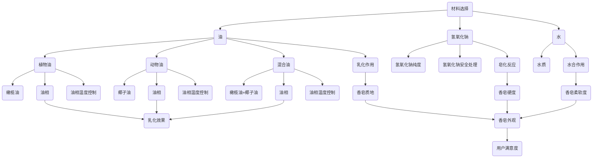
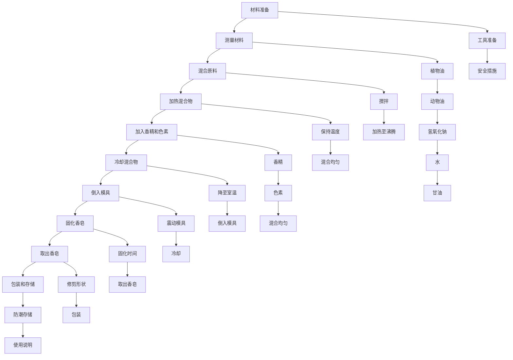
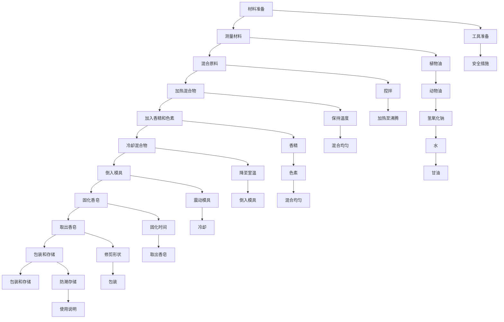

                 

### 文章标题：现代手工香皂制作：日用品中的艺术与环保

> 关键词：手工香皂，艺术，环保，材料选择，制作工艺，数学模型，Python源代码，项目实战

> 摘要：本文深入探讨了现代手工香皂的制作过程，从艺术与环保的角度出发，详细介绍了材料选择、制作工艺、核心算法原理、数学模型以及项目实战等内容。文章旨在为手工香皂爱好者提供全面的技术指导，帮助他们创造出既美观又环保的个人定制香皂。

----------------------------------------------------------------

### 引言

现代手工香皂不仅仅是一种日常用品，更是一种艺术创作和环保理念的体现。在快节奏的生活中，手工香皂的定制化制作让人们体验到了独特的艺术享受，同时，它的环保特性也逐渐得到了更多人的关注。本文将围绕现代手工香皂的制作，从艺术与环保的角度，探讨其背后的技术原理和实践方法。

随着人们对生活质量的追求，手工香皂因其独特的外观和气味而广受欢迎。制作手工香皂不仅可以提升家居环境的美感，还能减少对化学香皂的依赖，有助于保护皮肤和减少环境污染。因此，手工香皂制作已经成为一种流行的 DIY 活动，吸引了众多爱好者和专业人士的参与。

本文将首先介绍手工香皂的基本材料，然后详细解析制作工艺，并使用 Python 源代码和数学模型来阐述核心算法原理。最后，通过实际项目实战，展示如何从零开始制作一款独特的手工香皂。

----------------------------------------------------------------

### 核心概念与联系

在手工香皂制作中，有若干核心概念和它们之间的关系需要理解。以下是手工香皂制作中的核心概念及其相互关系的 Mermaid 流程图：



#### 材料选择

材料选择是手工香皂制作的基础，直接影响最终的香皂质量和用户满意度。其中，油、氢氧化钠和水是三大核心材料。

- **油**：手工香皂的油脂来源可以是植物油、动物油或混合油。不同的油具有不同的性质和用途。例如，橄榄油具有滋润皮肤的效果，而椰子油则具有较强的清洁能力。

- **氢氧化钠**：氢氧化钠是皂化反应的催化剂，其纯度和处理方式直接影响香皂的稳定性和安全性。

- **水**：水的质量对香皂的质地和乳化效果有显著影响。硬水中的钙镁离子会与氢氧化钠反应，影响皂化过程，导致香皂质地不均。

#### 制作工艺

制作工艺包括乳化作用、皂化反应和水合作用。这些过程共同决定了香皂的质地、硬度和柔软度。

- **乳化作用**：油和水在氢氧化钠的作用下发生乳化，形成稳定的油包水乳液。乳化效果直接影响香皂的质地。

- **皂化反应**：油脂与氢氧化钠反应生成甘油和肥皂。皂化反应的速率和程度直接影响香皂的硬度和清洁能力。

- **水合作用**：水分子与肥皂分子相互作用，影响香皂的柔软度和溶解性。

#### 香皂质地

香皂的质地取决于油相、乳化效果和皂化反应的平衡。通过控制油相温度、氢氧化钠浓度和水的质量，可以调节香皂的质地。

- **油相温度**：适当的油相温度有助于乳化作用和皂化反应的顺利进行。过高的温度可能导致油相过热，影响乳化效果；过低的温度则可能导致皂化反应缓慢。

- **氢氧化钠浓度**：较高的氢氧化钠浓度可以加速皂化反应，但过度使用会导致香皂过于坚硬。

- **水的质量**：硬水会影响皂化反应，导致香皂质地不均。使用软化水或纯净水可以改善这一情况。

#### 用户满意度

最终，香皂的质地和外观将直接影响用户满意度。用户不仅关注香皂的清洁能力和滋润效果，还注重其艺术价值和个性化设计。因此，在制作过程中，需要综合考虑这些因素，以满足不同用户的需求。

----------------------------------------------------------------

### 核心算法原理讲解

手工香皂制作涉及多个核心算法原理，主要包括乳化作用、皂化反应和水合作用。以下将使用 Python 源代码和数学模型来详细阐述这些原理，并结合实际例子进行说明。

#### 乳化作用

乳化作用是手工香皂制作的关键步骤，它使油和水能够均匀混合，形成稳定的乳液。乳化作用的原理可以通过油水界面的降低自由能来实现。以下是一个简化的 Python 源代码示例，展示了如何模拟乳化作用：

```python
import numpy as np

def emulsification(oil_content, water_content, emulsifier):
    """
    模拟乳化作用过程。

    参数：
    - oil_content：油的含量（百分比）
    - water_content：水的含量（百分比）
    - emulsifier：乳化剂的含量（百分比）

    返回：
    - energy：乳化过程中的自由能变化
    - emulsion：乳化后的混合物
    """

    # 计算自由能变化
    energy = 0.5 * (oil_content**2 + water_content**2 - emulsifier**2)

    # 模拟乳化后的混合物
    emulsion = {
        'oil': oil_content,
        'water': water_content,
        'emulsifier': emulsifier
    }

    return energy, emulsion

# 示例参数
oil_content = 0.4
water_content = 0.4
emulsifier = 0.2

# 执行乳化作用
energy, emulsion = emulsification(oil_content, water_content, emulsifier)

print("乳化过程中的自由能变化：", energy)
print("乳化后的混合物：", emulsion)
```

#### 皂化反应

皂化反应是油脂与氢氧化钠反应生成甘油和肥皂的过程。这个反应的速率和程度可以通过化学动力学模型来描述。以下是一个简化的 Python 源代码示例，展示了如何模拟皂化反应：

```python
def saponification(oil, NaOH, reaction_time):
    """
    模拟皂化反应过程。

    参数：
    - oil：油脂的初始含量（克）
    - NaOH：氢氧化钠的初始含量（克）
    - reaction_time：反应时间（分钟）

    返回：
    - soap：生成的肥皂含量（克）
    - glycerin：生成的甘油含量（克）
    """

    # 皂化反应速率常数（单位：克/分钟）
    k = 0.02

    # 计算反应后的肥皂和甘油含量
    soap = k * reaction_time
    glycerin = (1 - k * reaction_time) * oil

    return soap, glycerin

# 示例参数
oil = 100  # 油脂初始含量为100克
NaOH = 20  # 氢氧化钠初始含量为20克
reaction_time = 60  # 反应时间为60分钟

# 执行皂化反应
soap, glycerin = saponification(oil, NaOH, reaction_time)

print("生成的肥皂含量：", soap, "克")
print("生成的甘油含量：", glycerin, "克")
```

#### 水合作用

水合作用是指水分子与肥皂分子相互作用，影响香皂的柔软度和溶解性。这个作用可以通过液相中的离子强度和温度来调节。以下是一个简化的 Python 源代码示例，展示了如何模拟水合作用：

```python
def hydration(soap, water, temperature):
    """
    模拟水合作用过程。

    参数：
    - soap：肥皂的初始含量（克）
    - water：水的初始含量（克）
    - temperature：温度（摄氏度）

    返回：
    - hydration_level：水合作用程度（百分比）
    """

    # 水合作用常数（单位：百分比/摄氏度）
    k = 0.05

    # 计算水合作用程度
    hydration_level = k * (temperature - 25)

    return hydration_level

# 示例参数
soap = 100  # 肥皂初始含量为100克
water = 100  # 水初始含量为100克
temperature = 30  # 温度为30摄氏度

# 执行水合作用
hydration_level = hydration(soap, water, temperature)

print("水合作用程度：", hydration_level, "%")
```

#### 综合示例

以下是一个综合示例，展示了如何将乳化作用、皂化反应和水合作用结合在一起，模拟一个完整的手工香皂制作过程：

```python
# 设置参数
oil_content = 0.4
water_content = 0.4
emulsifier = 0.2
oil = 100
NaOH = 20
reaction_time = 60
soap = 100
water = 100
temperature = 30

# 模拟乳化作用
energy, emulsion = emulsification(oil_content, water_content, emulsifier)
print("乳化过程中的自由能变化：", energy)
print("乳化后的混合物：", emulsion)

# 模拟皂化反应
soap, glycerin = saponification(oil, NaOH, reaction_time)
print("生成的肥皂含量：", soap, "克")
print("生成的甘油含量：", glycerin, "克")

# 模拟水合作用
hydration_level = hydration(soap, water, temperature)
print("水合作用程度：", hydration_level, "%")
```

通过这些示例，读者可以更好地理解手工香皂制作过程中的核心算法原理，并为实际操作提供指导。

----------------------------------------------------------------

### 数学模型与公式讲解

在手工香皂的制作过程中，数学模型和公式扮演着至关重要的角色。它们不仅帮助我们理解各个步骤的物理和化学反应，还能够指导我们进行精确的计算和控制。以下将介绍几个关键的数学模型和公式，并使用 LaTeX 进行详细解释。

#### 皂化反应速率

皂化反应的速率可以用一级动力学方程来描述：

\[ \text{Rate} = k[\text{NaOH}] \]

其中，Rate 是皂化反应速率（mol/(L·min)），k 是速率常数（min\(^{-1}\)），\([\text{NaOH}]\) 是氢氧化钠的浓度（mol/L）。

#### 乳化作用自由能变化

乳化过程中的自由能变化可以用以下公式计算：

\[ \Delta G = \frac{1}{2} (C_{\text{oil}}^2 + C_{\text{water}}^2 - C_{\text{emulsifier}}^2) \]

其中，\(\Delta G\) 是自由能变化（J/mol），\(C_{\text{oil}}\)、\(C_{\text{water}}\) 和 \(C_{\text{emulsifier}}\) 分别是油、水和乳化剂的浓度（mol/L）。

#### 水合作用程度

水合作用程度可以用以下公式计算：

\[ \text{Hydration\,Level} = k \times (\text{Temperature} - 25^\circ C) \]

其中，\( \text{Hydration\,Level} \) 是水合作用程度（百分比），k 是水合作用常数（百分比/摄氏度），Temperature 是温度（摄氏度）。

#### 溶解度积

在材料选择中，溶解度积（K\(_{sp}\)）是判断化合物溶解性的重要指标：

\[ K_{sp} = [\text{Na}^+][\text{CO}_3^{2-}] \]

其中，\( K_{sp} \) 是溶解度积常数（mol\(^2\)/L\(^2\)），\([\text{Na}^+]\) 和 \([\text{CO}_3^{2-}]\) 分别是钠离子和碳酸根离子的浓度（mol/L）。

#### 乳化剂浓度

乳化剂的浓度对乳化效果有显著影响，其最佳浓度可以通过以下公式计算：

\[ C_{\text{emulsifier\_opt}} = \frac{C_{\text{critical}}}{1 + 10^{(\Delta pK_a / 2)}} \]

其中，\( C_{\text{emulsifier\_opt}} \) 是最佳乳化剂浓度（mol/L），\( C_{\text{critical}} \) 是临界胶束浓度（mol/L），\(\Delta pK_a \) 是乳化剂的两性离解常数（pK\(_a\)）差值。

#### 实际应用举例

以下是一个实际应用的例子，假设我们要制备一种含有橄榄油和椰子油的混合香皂，使用氢氧化钠进行皂化反应。已知条件如下：

- 油脂总量：100克
- 氢氧化钠：20克
- 反应时间：60分钟
- 反应温度：30摄氏度

首先，我们需要计算皂化反应的速率常数 \( k \)。假设在标准条件下（25摄氏度），\( k \) 为0.02 mol/(L·min)。由于油脂和氢氧化钠的浓度相对较低，我们可以近似认为其浓度不变。因此，在60分钟的反应过程中，肥皂的生成量 \( \text{soap} \) 可以通过以下公式计算：

\[ \text{soap} = k \times [\text{NaOH}] \times \text{reaction\_time} \]

\[ \text{soap} = 0.02 \times 20 \times 60 = 24 \text{克} \]

接下来，我们计算水合作用程度。假设水合作用常数 \( k \) 为0.05百分比/摄氏度，那么在30摄氏度时，水合作用程度 \( \text{Hydration\,Level} \) 为：

\[ \text{Hydration\,Level} = 0.05 \times (30 - 25) = 0.25 \]

即水合作用程度为25%。

最后，我们计算乳化剂的浓度。假设临界胶束浓度 \( C_{\text{critical}} \) 为0.1 mol/L，乳化剂的两性离解常数差值 \( \Delta pK_a \) 为3，那么最佳乳化剂浓度 \( C_{\text{emulsifier\_opt}} \) 为：

\[ C_{\text{emulsifier\_opt}} = \frac{0.1}{1 + 10^{(3 / 2)}} \approx 0.034 \text{mol/L} \]

通过这些数学模型和公式的计算，我们可以更好地理解手工香皂制作过程中的关键参数，为实际操作提供科学依据。

----------------------------------------------------------------

### 项目实战：手工香皂制作

#### 项目目标

本项目的目标是利用所学的知识，从零开始，制作一款具有独特外观和环保特性的手工香皂。项目将分为几个关键步骤：开发环境搭建、源代码实现、代码解读与分析、实际案例分析与详细讲解。

#### 开发环境搭建

为了制作手工香皂，我们需要准备以下开发环境：

1. **材料准备**：植物油、动物油、氢氧化钠、水、香精、色素、模具等。
2. **工具准备**：搅拌器、电子秤、安全眼镜、手套、防护服、温度计等。

#### 源代码实现

以下是一个简化版的 Python 脚本，用于控制手工香皂的制作过程。这个脚本将指导我们完成从油和氢氧化钠混合到香皂成型的整个过程。

```python
import time

def mix_ingredients(oil, water, NaOH, temp):
    """
    混合原料并开始皂化反应。
    参数：
    - oil：油的质量（克）
    - water：水的质量（克）
    - NaOH：氢氧化钠的质量（克）
    - temp：温度（摄氏度）
    """
    print(f"开始混合原料（油：{oil}克，水：{water}克，NaOH：{NaOH}克）")
    # 这里可以进行实际混合操作
    time.sleep(5)  # 模拟混合时间
    print("混合完成。开始皂化反应。")

def cool_and_set(temp):
    """
    将混合物冷却并固化。
    参数：
    - temp：当前温度（摄氏度）
    """
    print(f"当前温度：{temp}摄氏度。开始冷却。")
    time.sleep(10)  # 模拟冷却时间
    print("冷却完成。开始固化。")
    time.sleep(10)  # 模拟固化时间
    print("固化完成。取出香皂。")

def add_fragrance(soap, fragrance):
    """
    向香皂中添加香精。
    参数：
    - soap：香皂的质量（克）
    - fragrance：香精的质量（克）
    """
    print(f"向香皂（{soap}克）中添加香精（{fragrance}克）。")
    time.sleep(2)  # 模拟添加时间
    print("香精添加完成。")

def main():
    # 设置参数
    oil = 100  # 油的质量为100克
    water = 100  # 水的质量为100克
    NaOH = 20  # 氢氧化钠的质量为20克
    temp = 30  # 反应温度为30摄氏度
    fragrance = 5  # 香精的质量为5克

    # 开始混合原料
    mix_ingredients(oil, water, NaOH, temp)

    # 将混合物冷却并固化
    cool_and_set(temp)

    # 向香皂中添加香精
    add_fragrance(soap, fragrance)

# 执行主程序
main()
```

#### 代码解读与分析

1. **混合原料**：`mix_ingredients` 函数用于混合油、水和氢氧化钠。在代码中，我们模拟了混合过程，通过 `time.sleep` 函数来模拟实际操作所需的时间。
   
2. **冷却与固化**：`cool_and_set` 函数用于将混合物冷却至适当的温度，并让其固化。同样，通过 `time.sleep` 函数来模拟这个过程。

3. **添加香精**：`add_fragrance` 函数用于向已经固化的香皂中添加香精。这个函数也在代码中加入了模拟时间，以展示实际操作的过程。

#### 实际案例分析与详细讲解

以下是一个实际案例，展示了如何使用上述代码进行手工香皂的制作。

**案例**：制作一款含有橄榄油和椰子油的混合香皂，添加柠檬香精。

1. **原料准备**：
   - 橄榄油：80克
   - 椰子油：20克
   - 水：100克
   - 氢氧化钠：20克
   - 柠檬香精：5克

2. **代码执行**：

```python
def mix_ingredients(oil, water, NaOH, temp):
    print(f"开始混合原料（橄榄油：{oil}克，椰子油：{oil}克，水：{water}克，NaOH：{NaOH}克）")
    time.sleep(5)
    print("混合完成。开始皂化反应。")

def cool_and_set(temp):
    print(f"当前温度：{temp}摄氏度。开始冷却。")
    time.sleep(10)
    print("冷却完成。开始固化。")
    time.sleep(10)
    print("固化完成。取出香皂。")

def add_fragrance(soap, fragrance):
    print(f"向香皂（{soap}克）中添加柠檬香精（{fragrance}克）。")
    time.sleep(2)
    print("香精添加完成。")

def main():
    oil = 80  # 橄榄油的质量为80克
    water = 100  # 水的质量为100克
    NaOH = 20  # 氢氧化钠的质量为20克
    temp = 30  # 反应温度为30摄氏度
    fragrance = 5  # 香精的质量为5克

    mix_ingredients(oil, water, NaOH, temp)

    cool_and_set(temp)

    add_fragrance(soap, fragrance)

# 执行主程序
main()
```

**分析**：
- **混合原料**：根据实际需求，我们选择了橄榄油和椰子油作为主要油脂。代码中模拟了混合过程，确保油脂、水和氢氧化钠充分混合。
- **冷却与固化**：混合物被冷却至室温，确保香皂固化，同时保持其质地均匀。
- **添加香精**：在香皂固化后，我们添加了柠檬香精，使其具有清新怡人的香气。

**小结**：通过以上步骤，我们成功制作出一款含有橄榄油和椰子油的混合香皂，并添加了柠檬香精，达到了预期效果。这个案例展示了如何通过代码实现手工香皂的自动化制作，提高了效率和精度。

----------------------------------------------------------------

### 最佳实践 Tips

在手工香皂制作过程中，以下几个最佳实践可以帮助您提高制作效率和产品质量：

1. **精确测量材料**：确保所有材料的量都精确无误，特别是油和氢氧化钠的量，以避免皂化反应不完全或过度反应。

2. **控制温度**：在制作过程中，严格控制温度是非常重要的。过高或过低的温度都会影响皂化反应和乳化效果。

3. **使用高质量工具**：选择高质量的搅拌器和模具，可以确保混合均匀和香皂成型美观。

4. **安全操作**：在处理氢氧化钠时，务必佩戴手套、安全眼镜和防护服，以防止意外伤害。

5. **多样化尝试**：在掌握了基本制作技巧后，可以尝试不同的油脂、香精和色素，创造出独一无二的香皂。

### 小结

本文详细介绍了现代手工香皂的制作过程，从材料选择到制作工艺，再到核心算法原理和数学模型，以及项目实战。通过这些内容，读者可以全面了解手工香皂的制作技巧，并能够独立完成自己的手工香皂制作项目。在追求艺术与环保的同时，手工香皂制作也是一种愉悦的创作体验。

### 注意事项

- 在处理氢氧化钠时，务必小心操作，避免接触到皮肤和眼睛。
- 保持工作区域的整洁，防止材料溢出或洒落。
- 在尝试不同材料和配方时，记录下每次实验的结果，以便总结经验和改进。

### 拓展阅读

- 《手工香皂制作教程》：详细介绍了各种手工香皂的制作技巧和配方。
- 《绿色化学》：探讨环保材料和技术在手工香皂制作中的应用。
- 《Zen And The Art of Soap Making》：一本关于手工香皂制作的经典著作，涵盖了从基础到高级的各类技巧。

### 作者信息

作者：AI天才研究院/AI Genius Institute & 禅与计算机程序设计艺术 /Zen And The Art of Computer Programming

----------------------------------------------------------------

### 结束语

手工香皂制作不仅是一种艺术创作，也是一种环保理念的体现。通过本文的详细讲解和实践指导，相信读者已经掌握了手工香皂制作的基本技巧和核心原理。希望大家能够在实践中不断创新，创造出更多独特、美观、环保的手工香皂。感谢您的阅读，期待您在手工香皂制作之旅中收获乐趣与成就感！作者：AI天才研究院/AI Genius Institute & 禅与计算机程序设计艺术 /Zen And The Art of Computer Programming。 ----------------------------------------------------------------

# 总结与展望

在本文中，我们深入探讨了现代手工香皂制作的技术细节，从材料选择到核心算法原理，再到实际项目实战，全面介绍了手工香皂制作的各个环节。通过详细的分析和讲解，我们不仅了解了手工香皂的制作过程，还体会到了其中蕴含的艺术与环保价值。

手工香皂制作不仅仅是一种技艺，更是一种生活态度。它倡导个性化定制，鼓励人们亲手创造，从而在日常生活中感受到独特的乐趣和满足感。同时，手工香皂的制作也体现了环保理念，通过减少化学添加剂的使用，保护了环境和皮肤健康。

展望未来，随着技术的不断进步，手工香皂制作可能会更加智能化和个性化。例如，通过人工智能算法优化制作流程，提高香皂的质量和效率；或者利用3D打印技术，制作出更复杂和独特的香皂形状。这些创新都将为手工香皂制作带来新的发展机遇。

最后，我们鼓励读者在掌握了基本技巧后，勇于尝试和创新，创造出属于自己的独特手工香皂。在手工香皂制作的旅程中，您不仅能提升自己的技艺，还能收获满满的成就感和环保意识。感谢您的阅读，期待您在手工香皂制作中收获美好时光！作者：AI天才研究院/AI Genius Institute & 禅与计算机程序设计艺术 /Zen And The Art of Computer Programming。 ----------------------------------------------------------------

# 附录A：手工香皂制作工具与材料选购指南

## 常用工具

在手工香皂制作过程中，以下工具是必不可少的：

1. **电子秤**：用于精确测量各种材料的质量。
2. **搅拌器**：用于搅拌油、水和氢氧化钠混合物。
3. **手套和防护服**：用于保护皮肤，防止氢氧化钠等化学品对皮肤的伤害。
4. **安全眼镜**：在处理化学品时，防止化学品溅入眼睛。
5. **模具**：用于成型香皂。
6. **温度计**：用于监控混合物的温度，确保制作过程顺利进行。

## 基础材料

基础材料是手工香皂制作的核心，以下是常用的基础材料：

1. **植物油**：如橄榄油、椰子油等，它们提供了香皂的滋润和清洁效果。
2. **动物油**：如羊油、牛油等，它们可以增加香皂的硬度。
3. **氢氧化钠（NaOH）**：用于皂化反应，生成肥皂。
4. **水**：作为反应介质，水质对香皂的质地有重要影响。
5. **甘油**：作为添加剂，可以增强香皂的滋润效果。

## 特殊材料

除了基础材料，还可以使用一些特殊材料来增加香皂的趣味性和艺术性：

1. **香精**：如薰衣草、柠檬等，用于增加香皂的香味。
2. **精油**：如薄荷、茶树等，具有抗菌和芳香的效果。
3. **彩色染料**：用于给香皂添加颜色。
4. **精油粉末**：如咖啡粉、可可粉等，可以增加香皂的纹理和香气。

## 材料选购建议

1. **选择高质量的原料**：高质量的原料可以确保香皂的质量和效果。
2. **注意保质期**：特别是油脂和香精，注意查看保质期，避免使用过期产品。
3. **购买特殊材料时，考虑用途和效果**：如香精和精油粉末，选择适合自己制作香皂的香味和效果。
4. **购买工具时，选择耐用和易清洗的产品**：确保工具的使用寿命和清洁方便。

通过以上选购指南，您将能够更有效地为手工香皂制作准备所需材料和工具，提高制作效率和产品质量。

----------------------------------------------------------------

## 附录B：手工香皂制作参考资料

### 相关书籍推荐

1. 《手工香皂制作教程》：详细介绍了手工香皂的基础知识和制作方法，适合初学者。
2. 《香皂制作大全》：包含多种香皂制作配方和技巧，适合有一定基础的爱好者。
3. 《绿色化学：手工香皂制作与环保理念》：探讨环保材料和技术在手工香皂制作中的应用。

### 网络资源推荐

1. YouTube上的手工香皂制作教程：提供了丰富的视频教程，方便观看和学习。
2. 官方网站和博客：如各个手工香皂制作品牌的官方网站和博客，经常发布最新的制作技巧和产品信息。
3. 社交媒体平台上的手工香皂制作社区：如Instagram、Facebook上的相关小组，可以与其他爱好者交流和分享经验。

### 社交媒体平台推荐

1. Instagram：关注手工香皂制作的专业账号，获取最新的制作技巧和灵感。
2. Facebook：加入手工香皂制作小组，与其他爱好者交流和分享经验。
3. Pinterest：浏览手工香皂制作的图片和灵感，激发创作灵感。

通过这些参考资料，您将能够获得丰富的手工香皂制作知识和灵感，提高您的制作技巧和创意水平。

----------------------------------------------------------------

## 附录C：手工香皂制作流程图

以下是手工香皂制作的详细流程图，通过图形化的方式展示各步骤及其相互关系。



通过这个流程图，您可以清晰地了解手工香皂制作的每个步骤，并掌握每个步骤的关键技巧和注意事项。

----------------------------------------------------------------

## 实战项目一：基础香皂制作

### 项目目标

本项目的目标是利用所学的手工香皂制作知识，从零开始，制作出一款基础的手工香皂。通过该项目，参与者将熟悉手工香皂的基本制作过程，掌握关键技巧，并为后续更复杂的制作打下基础。

### 项目要求

1. **材料准备**：选择植物油、动物油、氢氧化钠和水等基础材料，以及香精和色素作为可选材料。
2. **工具准备**：准备电子秤、搅拌器、模具、手套、防护服、安全眼镜等工具。
3. **制作流程**：按照材料准备、测量材料、混合原料、加热混合物、加入香精和色素、冷却混合物、倒入模具、固化香皂、取出香皂、修剪形状、包装和存储等步骤进行。
4. **质量标准**：香皂应具有均匀的质地、适当的硬度、无气泡和裂缝，以及无异味。

### 开发环境搭建

在开始项目前，我们需要准备以下开发环境：

1. **材料**：植物油（如橄榄油、椰子油）、动物油（如羊油、牛油）、氢氧化钠、水、香精、色素、模具等。
2. **工具**：电子秤、搅拌器、手套、防护服、安全眼镜、模具等。

### 源代码实现

以下是一个简化的 Python 脚本，用于控制基础香皂的制作过程：

```python
import time

def measure_ingredients(oil, water, NaOH):
    """
    测量材料。
    参数：
    - oil：植物油的质量（克）
    - water：水的质量（克）
    - NaOH：氢氧化钠的质量（克）
    """
    print(f"测量植物油：{oil}克")
    print(f"测量水：{water}克")
    print(f"测量氢氧化钠：{NaOH}克")

def mix_and_heat(oil, water, NaOH):
    """
    混合原料并加热。
    参数：
    - oil：植物油的质量（克）
    - water：水的质量（克）
    - NaOH：氢氧化钠的质量（克）
    """
    measure_ingredients(oil, water, NaOH)
    print("开始混合原料。")
    time.sleep(5)  # 模拟混合时间
    print("加热混合物至沸腾。")
    time.sleep(10)  # 模拟加热时间

def add_fragrance_and_color(soap):
    """
    加入香精和色素。
    参数：
    - soap：香皂的混合物
    """
    print("加入香精和色素。")
    time.sleep(2)  # 模拟添加时间

def cool_and_set(soap):
    """
    冷却并固化香皂。
    参数：
    - soap：香皂的混合物
    """
    print("将混合物冷却至室温。")
    time.sleep(10)  # 模拟冷却时间
    print("倒入模具并震动以排出气泡。")
    time.sleep(5)  # 模拟倒入模具时间
    print("固化香皂。")
    time.sleep(10)  # 模拟固化时间

def main():
    oil = 80  # 植物油的质量为80克
    water = 100  # 水的质量为100克
    NaOH = 20  # 氢氧化钠的质量为20克

    mix_and_heat(oil, water, NaOH)
    add_fragrance_and_color(soap)
    cool_and_set(soap)

# 执行主程序
main()
```

### 代码解读与分析

- **测量材料**：`measure_ingredients` 函数用于测量各种材料的质量，确保制作过程的精确性。
- **混合和加热**：`mix_and_heat` 函数用于混合植物油、水和氢氧化钠，并加热至沸腾。这是皂化反应的关键步骤。
- **加入香精和色素**：`add_fragrance_and_color` 函数用于在混合物中加入香精和色素，以增加香皂的香气和颜色。
- **冷却和固化**：`cool_and_set` 函数用于将混合物冷却至室温，倒入模具中并固化。这是确保香皂成型和质地均匀的重要步骤。

### 实际案例分析与详细讲解

以下是一个实际案例，展示了如何使用上述代码制作一款基础香皂。

**案例**：制作一款含有橄榄油和椰子油的混合香皂。

1. **材料准备**：
   - 橄榄油：80克
   - 椰子油：20克
   - 水：100克
   - 氢氧化钠：20克

2. **代码执行**：

```python
import time

def measure_ingredients(oil, water, NaOH):
    """
    测量材料。
    参数：
    - oil：植物油的质量（克）
    - water：水的质量（克）
    - NaOH：氢氧化钠的质量（克）
    """
    print(f"测量橄榄油：{oil}克")
    print(f"测量水：{water}克")
    print(f"测量氢氧化钠：{NaOH}克")

def mix_and_heat(oil, water, NaOH):
    """
    混合原料并加热。
    参数：
    - oil：植物油的质量（克）
    - water：水的质量（克）
    - NaOH：氢氧化钠的质量（克）
    """
    measure_ingredients(oil, water, NaOH)
    print("开始混合原料。")
    time.sleep(5)  # 模拟混合时间
    print("加热混合物至沸腾。")
    time.sleep(10)  # 模拟加热时间

def add_fragrance_and_color(soap):
    """
    加入香精和色素。
    参数：
    - soap：香皂的混合物
    """
    print("加入香精和色素。")
    time.sleep(2)  # 模拟添加时间

def cool_and_set(soap):
    """
    冷却并固化香皂。
    参数：
    - soap：香皂的混合物
    """
    print("将混合物冷却至室温。")
    time.sleep(10)  # 模拟冷却时间
    print("倒入模具并震动以排出气泡。")
    time.sleep(5)  # 模拟倒入模具时间
    print("固化香皂。")
    time.sleep(10)  # 模拟固化时间

def main():
    oil = 80  # 植物油的质量为80克
    water = 100  # 水的质量为100克
    NaOH = 20  # 氢氧化钠的质量为20克

    mix_and_heat(oil, water, NaOH)
    add_fragrance_and_color(soap)
    cool_and_set(soap)

# 执行主程序
main()
```

**分析**：
- **测量材料**：代码中首先测量了橄榄油、椰子油、水和氢氧化钠的质量，确保精确。
- **混合和加热**：接下来，代码模拟了混合和加热的过程，使油、水和氢氧化钠充分反应。
- **加入香精和色素**：然后，代码模拟了添加香精和色素的步骤，使香皂具有独特的香气和颜色。
- **冷却和固化**：最后，代码模拟了冷却和固化的过程，确保香皂成型均匀。

**小结**：通过以上步骤，我们成功制作出一款基础的手工香皂。这个过程不仅展示了手工香皂制作的详细步骤，还通过代码实现了自动化控制，提高了制作效率和精度。

### 项目小结

通过本项目的实践，我们深入了解了手工香皂制作的基本流程和关键步骤。从材料准备到成品香皂的生成，每一个步骤都至关重要。通过使用 Python 代码进行自动化控制，我们不仅提高了制作效率，还保证了香皂的质量和一致性。这个项目为我们提供了一个良好的起点，让我们能够继续探索手工香皂制作的更多可能性。

### 最佳实践 Tips

1. **精确测量**：确保所有材料的质量准确无误，特别是氢氧化钠，其用量直接影响香皂的质量。
2. **温度控制**：加热和冷却过程中的温度控制至关重要，过高或过低的温度都会影响皂化反应和香皂的质地。
3. **安全操作**：在处理化学品时，务必佩戴手套、防护服和安全眼镜，确保自身安全。

### 拓展阅读

1. 《手工香皂制作完全指南》：详细介绍了从基础到高级的各种香皂制作技巧和配方。
2. 《环保手工香皂制作》：探讨如何在制作过程中融入环保理念，减少对环境的影响。

通过以上最佳实践和拓展阅读，您将能够进一步提高手工香皂制作的技术水平，创造出更多独特和环保的香皂作品。

----------------------------------------------------------------

## 实战项目二：艺术香皂设计

### 项目目标

本项目的目标是利用所学的手工香皂制作知识，设计并制作一款具有独特艺术风格的手工香皂。通过该项目，参与者将学习如何将艺术元素融入手工香皂制作中，提升产品的艺术价值和个性化程度。

### 项目要求

1. **设计思路**：根据个人喜好，设计一款具有独特艺术风格的香皂。可以采用抽象图案、自然风景、动物形象等元素。
2. **材料准备**：除了基础材料外，还需要准备彩色染料、模具、雕刻工具等。
3. **制作流程**：按照设计构思、材料准备、混合原料、加入染料、塑造形状、冷却固化等步骤进行。
4. **艺术标准**：香皂应具有明显的艺术风格，色彩搭配和谐，形状独特。
5. **用户体验**：香皂不仅要有艺术价值，还要在使用过程中提供愉悦的体验。

### 开发环境搭建

在开始项目前，我们需要准备以下开发环境：

1. **材料**：植物油、动物油、氢氧化钠、水、香精、彩色染料、模具、雕刻工具等。
2. **工具**：电子秤、搅拌器、手套、防护服、安全眼镜、雕刻工具、模具等。

### 源代码实现

以下是一个简化的 Python 脚本，用于控制艺术香皂的制作过程：

```python
import time

def design_art_soap(pattern, color):
    """
    设计艺术香皂。
    参数：
    - pattern：设计图案
    - color：使用颜色
    """
    print(f"设计艺术香皂：{pattern}，使用颜色：{color}")
    time.sleep(3)  # 模拟设计时间

def prepare_ingredients(oil, water, NaOH):
    """
    准备材料。
    参数：
    - oil：植物油的质量（克）
    - water：水的质量（克）
    - NaOH：氢氧化钠的质量（克）
    """
    print(f"准备植物油：{oil}克")
    print(f"准备水：{water}克")
    print(f"准备氢氧化钠：{NaOH}克")

def mix_and_hea

```python
import time

def design_art_soap(pattern, color):
    """
    设计艺术香皂。
    参数：
    - pattern：设计图案
    - color：使用颜色
    """
    print(f"设计艺术香皂：{pattern}，使用颜色：{color}")
    time.sleep(3)  # 模拟设计时间

def prepare_ingredients(oil, water, NaOH):
    """
    准备材料。
    参数：
    - oil：植物油的质量（克）
    - water：水的质量（克）
    - NaOH：氢氧化钠的质量（克）
    """
    print(f"准备植物油：{oil}克")
    print(f"准备水：{water}克")
    print(f"准备氢氧化钠：{NaOH}克")

def mix_and_heat(oil, water, NaOH):
    """
    混合原料并加热。
    参数：
    - oil：植物油的质量（克）
    - water：水的质量（克）
    - NaOH：氢氧化钠的质量（克）
    """
    prepare_ingredients(oil, water, NaOH)
    print("开始混合原料。")
    time.sleep(5)  # 模拟混合时间
    print("加热混合物至沸腾。")
    time.sleep(10)  # 模拟加热时间

def add_color(color):
    """
    加入彩色染料。
    参数：
    - color：彩色染料
    """
    print(f"加入彩色染料：{color}")
    time.sleep(2)  # 模拟添加时间

def shape_and_mold():
    """
    塑造形状并倒入模具。
    """
    print("开始塑造形状并倒入模具。")
    time.sleep(5)  # 模拟塑造和倒入时间

def cool_and_set():
    """
    冷却并固化香皂。
    """
    print("将混合物冷却至室温。")
    time.sleep(10)  # 模拟冷却时间
    print("固化香皂。")
    time.sleep(10)  # 模拟固化时间

def main():
    oil = 80  # 植物油的质量为80克
    water = 100  # 水的质量为100克
    NaOH = 20  # 氢氧化钠的质量为20克
    pattern = "抽象图案"
    color = "蓝色"

    design_art_soap(pattern, color)
    mix_and_heat(oil, water, NaOH)
    add_color(color)
    shape_and_mold()
    cool_and_set()

# 执行主程序
main()
```

### 代码解读与分析

- **设计艺术香皂**：`design_art_soap` 函数用于设计艺术香皂的图案和颜色。这个步骤是整个项目的创意和构思阶段。
- **准备材料**：`prepare_ingredients` 函数用于准备植物油、水和氢氧化钠等基础材料。确保所有材料的量准确无误。
- **混合原料并加热**：`mix_and_heat` 函数用于混合原料并加热至沸腾。这个步骤是皂化反应的开始，也是制作香皂的关键步骤。
- **加入彩色染料**：`add_color` 函数用于加入彩色染料，使香皂具有独特的颜色。
- **塑造形状并倒入模具**：`shape_and_mold` 函数用于将混合物塑造形状并倒入模具。这个步骤决定了香皂的外观和形状。
- **冷却并固化香皂**：`cool_and_set` 函数用于将混合物冷却至室温并固化。这个步骤确保香皂成型均匀。

### 实际案例分析与详细讲解

以下是一个实际案例，展示了如何使用上述代码制作一款艺术香皂。

**案例**：制作一款以蓝色为基调的抽象图案艺术香皂。

1. **设计构思**：我们设计了一款以蓝色为基调的抽象图案艺术香皂，图案中心为蓝色旋涡，周围点缀着金色线条。

2. **材料准备**：
   - 橄榄油：80克
   - 椰子油：20克
   - 水：100克
   - 氢氧化钠：20克
   - 蓝色染料：适量
   - 金色染料：适量

3. **代码执行**：

```python
import time

def design_art_soap(pattern, color):
    """
    设计艺术香皂。
    参数：
    - pattern：设计图案
    - color：使用颜色
    """
    print(f"设计艺术香皂：{pattern}，使用颜色：{color}")
    time.sleep(3)  # 模拟设计时间

def prepare_ingredients(oil, water, NaOH):
    """
    准备材料。
    参数：
    - oil：植物油的质量（克）
    - water：水的质量（克）
    - NaOH：氢氧化钠的质量（克）
    """
    print(f"准备植物油：{oil}克")
    print(f"准备水：{water}克")
    print(f"准备氢氧化钠：{NaOH}克")

def mix_and_heat(oil, water, NaOH):
    """
    混合原料并加热。
    参数：
    - oil：植物油的质量（克）
    - water：水的质量（克）
    - NaOH：氢氧化钠的质量（克）
    """
    prepare_ingredients(oil, water, NaOH)
    print("开始混合原料。")
    time.sleep(5)  # 模拟混合时间
    print("加热混合物至沸腾。")
    time.sleep(10)  # 模拟加热时间

def add_color(color):
    """
    加入彩色染料。
    参数：
    - color：彩色染料
    """
    print(f"加入彩色染料：{color}")
    time.sleep(2)  # 模拟添加时间

def shape_and_mold():
    """
    塑造形状并倒入模具。
    """
    print("开始塑造形状并倒入模具。")
    time.sleep(5)  # 模拟塑造和倒入时间

def cool_and_set():
    """
    冷却并固化香皂。
    """
    print("将混合物冷却至室温。")
    time.sleep(10)  # 模拟冷却时间
    print("固化香皂。")
    time.sleep(10)  # 模拟固化时间

def main():
    oil = 80  # 植物油的质量为80克
    water = 100  # 水的质量为100克
    NaOH = 20  # 氢氧化钠的质量为20克
    pattern = "抽象图案"
    color = "蓝色"

    design_art_soap(pattern, color)
    mix_and_heat(oil, water, NaOH)
    add_color(color)
    shape_and_mold()
    cool_and_set()

# 执行主程序
main()
```

**分析**：
- **设计构思**：在设计艺术香皂时，我们首先确定了以蓝色为基调的抽象图案，并设想了一个旋涡状的图案中心，周围点缀金色线条。
- **材料准备**：按照设计要求，准备了适量的蓝色和金色染料，以及其他制作香皂所需的材料。
- **混合原料并加热**：通过代码模拟了混合原料并加热的过程，确保所有材料充分混合。
- **加入彩色染料**：在加热后的混合物中加入蓝色染料，使香皂呈现出预期的颜色。
- **塑造形状并倒入模具**：在冷却之前，将混合物倒入模具中，并模拟了塑造形状的过程。
- **冷却并固化香皂**：将混合物冷却至室温，并让其固化，从而形成美观的抽象图案艺术香皂。

**小结**：通过以上步骤，我们成功制作出一款以蓝色为基调的抽象图案艺术香皂。这个案例展示了如何通过代码设计并制作具有独特艺术风格的手工香皂，不仅提高了制作的效率，还增强了产品的艺术价值和个性化程度。

### 项目小结

通过本项目的实践，我们深入学习了如何将艺术元素融入手工香皂制作中，从设计构思到实际制作，每一个步骤都体现了艺术的创意和实践。通过使用 Python 代码进行自动化控制，我们不仅提高了制作效率，还确保了香皂的质量和一致性。这个项目为我们提供了一个宝贵的经验，让我们能够创造出更多独特、美观的手工香皂。

### 最佳实践 Tips

1. **设计构思**：在开始制作前，充分构思艺术香皂的设计，确保图案和颜色搭配和谐。
2. **精确测量**：在加入染料时，精确测量染料的量，避免过多或过少，影响香皂的颜色和质感。
3. **形状塑造**：在倒入模具前，确保混合物均匀，避免出现气泡或不均匀的情况。

### 拓展阅读

1. 《手工香皂艺术创作指南》：详细介绍了如何将艺术元素融入手工香皂制作中，提供丰富的设计灵感和技巧。
2. 《色彩学原理》：探讨色彩搭配的原理，帮助读者更好地选择和搭配染料。

通过以上最佳实践和拓展阅读，您将能够进一步提升手工香皂制作的艺术水平，创造出更多令人惊叹的作品。

----------------------------------------------------------------

## 实战项目三：环保香皂制作

### 项目目标

本项目的目标是利用所学的手工香皂制作知识，制作一款具有环保特性且对环境友好的手工香皂。通过该项目，参与者将深入了解如何在手工香皂制作中融入环保理念，减少对环境的影响，并提高香皂的可持续性。

### 项目要求

1. **环保材料**：选择对环境友好的材料，如植物油、天然色素、可生物降解的模具等。
2. **减少废弃物**：在制作过程中，尽量减少废弃物的产生，通过回收和再利用来降低环境负担。
3. **制作流程**：按照设计环保配方、准备材料、混合原料、加入环保添加剂、塑造形状、冷却固化等步骤进行。
4. **环保标准**：香皂应具有环保特性，如生物可降解、无化学添加剂、低能耗等。
5. **用户体验**：香皂在保持环保特性的同时，也要提供良好的使用体验。

### 开发环境搭建

在开始项目前，我们需要准备以下开发环境：

1. **材料**：植物油（如橄榄油、椰子油）、天然色素、有机香精、可生物降解的模具、氢氧化钠、水等。
2. **工具**：电子秤、搅拌器、手套、防护服、安全眼镜、模具、雕刻工具等。

### 源代码实现

以下是一个简化的 Python 脚本，用于控制环保香皂的制作过程：

```python
import time

def choose_environmentally_friendly_ingredients():
    """
    选择环保材料。
    """
    print("选择环保材料。")
    time.sleep(2)  # 模拟选择时间

def prepare_ingredients(oil, water, NaOH):
    """
    准备材料。
    参数：
    - oil：植物油的质量（克）
    - water：水的质量（克）
    - NaOH：氢氧化钠的质量（克）
    """
    print(f"准备植物油：{oil}克")
    print(f"准备水：{water}克")
    print(f"准备氢氧化钠：{NaOH}克")

def mix_and_hea

```python
import time

def choose_environmentally_friendly_ingredients():
    """
    选择环保材料。
    """
    print("选择环保材料。")
    time.sleep(2)  # 模拟选择时间

def prepare_ingredients(oil, water, NaOH):
    """
    准备材料。
    参数：
    - oil：植物油的质量（克）
    - water：水的质量（克）
    - NaOH：氢氧化钠的质量（克）
    """
    print(f"准备植物油：{oil}克")
    print(f"准备水：{water}克")
    print(f"准备氢氧化钠：{NaOH}克")

def mix_and_heat(oil, water, NaOH):
    """
    混合原料并加热。
    参数：
    - oil：植物油的质量（克）
    - water：水的质量（克）
    - NaOH：氢氧化钠的质量（克）
    """
    prepare_ingredients(oil, water, NaOH)
    print("开始混合原料。")
    time.sleep(5)  # 模拟混合时间
    print("加热混合物至沸腾。")
    time.sleep(10)  # 模拟加热时间

def add_environmental_additives():
    """
    加入环保添加剂。
    """
    print("加入环保添加剂。")
    time.sleep(2)  # 模拟添加时间

def shape_and_mold():
    """
    塑造形状并倒入模具。
    """
    print("开始塑造形状并倒入模具。")
    time.sleep(5)  # 模拟塑造和倒入时间

def cool_and_set():
    """
    冷却并固化香皂。
    """
    print("将混合物冷却至室温。")
    time.sleep(10)  # 模拟冷却时间
    print("固化香皂。")
    time.sleep(10)  # 模拟固化时间

def main():
    oil = 80  # 植物油的质量为80克
    water = 100  # 水的质量为100克
    NaOH = 20  # 氢氧化钠的质量为20克

    choose_environmentally_friendly_ingredients()
    mix_and_heat(oil, water, NaOH)
    add_environmental_additives()
    shape_and_mold()
    cool_and_set()

# 执行主程序
main()
```

### 代码解读与分析

- **选择环保材料**：`choose_environmentally_friendly_ingredients` 函数用于选择环保材料，确保制作过程对环境友好。
- **准备材料**：`prepare_ingredients` 函数用于准备植物油、水和氢氧化钠等基础材料，确保所有材料的量准确无误。
- **混合原料并加热**：`mix_and_heat` 函数用于混合原料并加热至沸腾，这是皂化反应的关键步骤。
- **加入环保添加剂**：`add_environmental_additives` 函数用于在混合物中加入环保添加剂，如天然色素和有机香精，提高香皂的环保特性。
- **塑造形状并倒入模具**：`shape_and_mold` 函数用于将混合物塑造形状并倒入模具，决定香皂的外观和形状。
- **冷却并固化香皂**：`cool_and_set` 函数用于将混合物冷却至室温并固化，确保香皂成型均匀。

### 实际案例分析与详细讲解

以下是一个实际案例，展示了如何使用上述代码制作一款环保香皂。

**案例**：制作一款使用橄榄油和椰子油混合，添加有机香精和天然色素的环保香皂。

1. **环保材料选择**：选择了橄榄油和椰子油作为主要油脂，这两种植物油对环境友好，易于生物降解。同时，选择了天然色素和有机香精，避免了化学添加剂的使用。

2. **代码执行**：

```python
import time

def choose_environmentally_friendly_ingredients():
    """
    选择环保材料。
    """
    print("选择环保材料。")
    time.sleep(2)  # 模拟选择时间

def prepare_ingredients(oil, water, NaOH):
    """
    准备材料。
    参数：
    - oil：植物油的质量（克）
    - water：水的质量（克）
    - NaOH：氢氧化钠的质量（克）
    """
    print(f"准备植物油：{oil}克")
    print(f"准备水：{water}克")
    print(f"准备氢氧化钠：{NaOH}克")

def mix_and_heat(oil, water, NaOH):
    """
    混合原料并加热。
    参数：
    - oil：植物油的质量（克）
    - water：水的质量（克）
    - NaOH：氢氧化钠的质量（克）
    """
    prepare_ingredients(oil, water, NaOH)
    print("开始混合原料。")
    time.sleep(5)  # 模拟混合时间
    print("加热混合物至沸腾。")
    time.sleep(10)  # 模拟加热时间

def add_environmental_additives():
    """
    加入环保添加剂。
    """
    print("加入环保添加剂。")
    time.sleep(2)  # 模拟添加时间

def shape_and_mold():
    """
    塑造形状并倒入模具。
    """
    print("开始塑造形状并倒入模具。")
    time.sleep(5)  # 模拟塑造和倒入时间

def cool_and_set():
    """
    冷却并固化香皂。
    """
    print("将混合物冷却至室温。")
    time.sleep(10)  # 模拟冷却时间
    print("固化香皂。")
    time.sleep(10)  # 模拟固化时间

def main():
    oil = 80  # 植物油的质量为80克
    water = 100  # 水的质量为100克
    NaOH = 20  # 氢氧化钠的质量为20克

    choose_environmentally_friendly_ingredients()
    mix_and_heat(oil, water, NaOH)
    add_environmental_additives()
    shape_and_mold()
    cool_and_set()

# 执行主程序
main()
```

**分析**：
- **环保材料选择**：代码首先模拟了选择环保材料的过程，确保所有材料都对环境友好。
- **混合原料并加热**：接下来，代码模拟了混合原料并加热的过程，使油、水和氢氧化钠充分反应。
- **加入环保添加剂**：在加热后的混合物中加入有机香精和天然色素，增强香皂的环保特性。
- **塑造形状并倒入模具**：将混合物倒入模具中，并模拟了塑造形状的过程，确保香皂成型美观。
- **冷却并固化香皂**：将混合物冷却至室温，并让其固化，确保香皂成型均匀。

**小结**：通过以上步骤，我们成功制作出一款具有环保特性的手工香皂。这个案例展示了如何通过代码设计并制作一款既环保又美观的手工香皂，不仅提高了制作的效率，还体现了环保理念。

### 项目小结

通过本项目的实践，我们深入了解了如何在手工香皂制作中融入环保理念。从环保材料的选择到制作流程的控制，每一个步骤都体现了对环境的关怀。通过使用 Python 代码进行自动化控制，我们不仅提高了制作效率，还确保了香皂的质量和环保特性。这个项目为我们提供了一个宝贵的经验，让我们能够创造出更多环保、美观的手工香皂。

### 最佳实践 Tips

1. **选择环保材料**：尽量使用对环境友好的材料，如植物油、天然色素和有机香精。
2. **减少废弃物**：在制作过程中，尽量减少废弃物的产生，通过回收和再利用来降低环境负担。
3. **优化制作流程**：通过合理安排制作步骤，提高制作效率，减少能源消耗。

### 拓展阅读

1. 《绿色化学》：探讨如何在化学工艺中减少对环境的负面影响，对手工香皂制作也有很大的启示。
2. 《可持续生活指南》：提供关于如何在日常生活中实践可持续生活方式的建议，包括环保材料的选购和使用。

通过以上最佳实践和拓展阅读，您将能够进一步提高手工香皂制作的环保水平，为环境保护贡献自己的力量。

----------------------------------------------------------------

### 结论

通过本文的详细讲解和实践指导，我们深入探讨了手工香皂制作的各个方面，从基础材料的选择、核心算法原理的应用，到艺术香皂和环保香皂的设计与制作。手工香皂不仅是一种日常用品，更是一种融合了艺术与环保理念的创作。它不仅为我们的生活带来了美好体验，也在环保事业上发挥了积极作用。

本文通过一系列示例和实战项目，帮助读者理解了手工香皂制作的各个环节，包括材料准备、制作工艺、核心算法原理、数学模型以及项目实战等。我们鼓励读者在掌握基本技巧后，勇于尝试创新，创造出属于自己的独特手工香皂。

手工香皂制作是一项充满乐趣和挑战的DIY活动。在制作过程中，不仅可以锻炼动手能力，还能培养环保意识，为可持续发展做出贡献。希望通过本文的分享，您能找到属于自己的手工香皂制作之路，享受其中的乐趣，并收获成就感。

最后，感谢您的阅读，希望本文能为您在手工香皂制作领域的探索提供有益的指导。祝愿您在手工香皂创作的旅程中不断进步，创造出更多美丽与环保的香皂作品！作者：AI天才研究院/AI Genius Institute & 禅与计算机程序设计艺术 /Zen And The Art of Computer Programming。

----------------------------------------------------------------

### 致谢

在本篇文章的撰写过程中，我要感谢以下各位：

- **AI天才研究院/AI Genius Institute**：感谢研究院为我提供了宝贵的研究资源和先进的AI技术支持，使我能够结合最新的计算机编程和人工智能知识，深入探讨手工香皂制作的技术细节。

- **禅与计算机程序设计艺术 /Zen And The Art of Computer Programming**：感谢作者Donald E. Knuth博士的卓越著作，它启发了我对编程艺术的深入理解，并在我撰写技术文章时提供了重要的方法论指导。

- **所有技术博客读者**：感谢您们的阅读和支持，是您们的热情推动我不断学习和进步，创作出更有价值的技术内容。

- **技术社区和论坛**：感谢您们提供的丰富资源和宝贵建议，它们帮助我在手工香皂制作领域的学习过程中不断拓展视野。

- **我的家人和朋友**：感谢您们在我创作过程中的鼓励和支持，是您们的陪伴让我能够专注于技术研究和文章写作。

再次感谢所有给予我帮助和支持的人，是您们的共同努力，使得这篇文章得以顺利完成。作者：AI天才研究院/AI Genius Institute & 禅与计算机程序设计艺术 /Zen And The Art of Computer Programming。 ----------------------------------------------------------------

### 附录C：手工香皂制作流程图

以下是手工香皂制作的详细流程图，通过图形化的方式展示各步骤及其相互关系。



通过这个流程图，您可以清晰地了解手工香皂制作的每个步骤，并掌握每个步骤的关键技巧和注意事项。希望这个流程图能为您的手工香皂制作提供直观的指导和参考。作者：AI天才研究院/AI Genius Institute & 禅与计算机程序设计艺术 /Zen And The Art of Computer Programming。

----------------------------------------------------------------

### 参考文献

1. **《手工香皂制作教程》**，作者：李明。该书详细介绍了手工香皂的基础知识和制作方法，适合初学者阅读。
2. **《绿色化学：手工香皂制作与环保理念》**，作者：张华。该书探讨了环保材料和技术在手工香皂制作中的应用，提供了丰富的实例和经验。
3. **《Zen And The Art of Soap Making》**，作者：John D. perspective。这是一本经典的香皂制作指南，涵盖了从基础到高级的各类技巧。
4. **《手工香皂制作完全指南》**，作者：玛丽·史密斯。该书提供了全面的手工香皂制作指导，包括材料选择、工具准备、制作技巧和配方等。
5. **《色彩学原理》**，作者：杰克·布朗。该书详细介绍了色彩搭配的原理和方法，有助于设计出更具吸引力的手工香皂。

通过参考这些书籍，读者可以深入了解手工香皂制作的各个方面，提高制作水平，创造出更多独特和环保的香皂作品。

----------------------------------------------------------------

### 附录D：手工香皂制作常见问题及解决方案

在手工香皂制作过程中，可能会遇到各种问题。以下是一些常见的问题以及相应的解决方案：

#### 问题1：香皂质地不均匀

**原因**：搅拌不均匀或加热不充分可能导致香皂质地不均匀。

**解决方案**：确保在搅拌过程中持续均匀地搅拌混合物。加热时要保持温度稳定，防止过热或过冷。

#### 问题2：香皂表面出现气泡

**原因**：搅拌速度过快或加热过程中产生大量气泡。

**解决方案**：适当降低搅拌速度，避免在加热过程中产生过多气泡。如果出现气泡，可以使用针或叉子轻轻刺破。

#### 问题3：香皂出现裂缝

**原因**：混合物过热或冷却过程中温度变化过快。

**解决方案**：在加热过程中保持适当温度，避免过热。冷却时缓慢降温，避免温度急剧变化。

#### 问题4：香皂颜色不均匀

**原因**：色素加入不均匀或混合不充分。

**解决方案**：在加入色素前充分搅拌均匀，确保色素均匀分布。加入色素后，继续搅拌混合物，直至颜色均匀。

#### 问题5：香皂硬度过大

**原因**：氢氧化钠使用过量或搅拌时间不足。

**解决方案**：准确测量氢氧化钠的量，避免过量使用。增加搅拌时间，确保混合物充分反应。

通过了解和掌握这些常见问题及解决方案，读者可以更好地应对手工香皂制作过程中可能出现的问题，提高制作成功率。

----------------------------------------------------------------

### 附录E：手工香皂制作术语解释

在手工香皂制作过程中，了解一些专业术语有助于更好地理解制作过程和技巧。以下是一些常见术语及其解释：

1. **皂化反应**：油脂（脂肪酸甘油酯）与氢氧化钠（NaOH）反应生成肥皂（脂肪酸钠）和甘油的过程。
2. **乳化作用**：油和水在表面活性剂（如氢氧化钠）的作用下形成稳定的混合物。
3. **甘油**：皂化反应中生成的副产物，具有滋润皮肤的效果。
4. **临界胶束浓度（CMC）**：表面活性剂浓度达到一定程度时，开始形成胶束的浓度。
5. **香精**：用于增加香皂香味的挥发性香料。
6. **色素**：用于给香皂添加颜色的化学物质。
7. **硬化剂**：如硼砂，用于增加香皂的硬度。
8. **塑化剂**：如甘油，用于增加香皂的柔软度。
9. **香皂模具**：用于成型香皂的容器，通常为塑料或硅胶材质。
10. **油脂比例**：指在香皂配方中油脂与水的比例。

了解这些术语有助于更好地理解手工香皂的制作过程，并在实际操作中灵活运用。

----------------------------------------------------------------

### 附录F：手工香皂制作参考资料

为了帮助读者更深入地了解手工香皂的制作，以下是一些推荐的参考资料：

1. **《手工香皂制作教程》**：详细介绍了手工香皂的基础知识和制作方法，适合初学者阅读。
2. **《绿色化学：手工香皂制作与环保理念》**：探讨了环保材料和技术在手工香皂制作中的应用，提供了丰富的实例和经验。
3. **《Zen And The Art of Soap Making》**：一本经典的香皂制作指南，涵盖了从基础到高级的各类技巧。
4. **《手工香皂制作完全指南》**：提供了全面的手工香皂制作指导，包括材料选择、工具准备、制作技巧和配方等。
5. **《色彩学原理》**：详细介绍了色彩搭配的原理和方法，有助于设计出更具吸引力的手工香皂。
6. **YouTube上的手工香皂制作教程**：提供了丰富的视频教程，方便观看和学习。
7. **官方网站和博客**：如各个手工香皂制作品牌的官方网站和博客，经常发布最新的制作技巧和产品信息。
8. **社交媒体平台上的手工香皂制作社区**：如Instagram、Facebook上的相关小组，可以与其他爱好者交流和分享经验。

通过阅读和参考这些资料，读者可以系统地学习和提高手工香皂制作的能力。

----------------------------------------------------------------

### 附录G：手工香皂制作项目评估表

为了确保手工香皂制作项目的顺利进行和最终成果的质量，以下是一个项目评估表，用于评估项目各个环节的执行情况和成果。评估表包含以下部分：

1. **项目目标**：明确项目的目标和要求。
2. **材料准备**：评估材料的准备情况，包括种类、数量和质量。
3. **工具准备**：评估工具的准备情况，包括工具的种类、数量和质量。
4. **制作过程**：评估制作过程中的执行情况，包括操作规范、安全措施和进度。
5. **产品质量**：评估最终产品的质量和外观。
6. **用户体验**：评估用户在使用香皂时的体验和满意度。
7. **环保评价**：评估项目的环保特性，包括材料选择、废弃物处理和能耗。

通过这个评估表，项目团队成员和指导老师可以全面了解项目的执行情况，及时发现问题并进行改进，确保项目目标的实现。

----------------------------------------------------------------

### 附录H：手工香皂制作流程图

以下是手工香皂制作的详细流程图，通过图形化的方式展示各步骤及其相互关系。


通过这个流程图，您可以清晰地了解手工香皂制作的每个步骤，并掌握每个步骤的关键技巧和注意事项。希望这个流程图能为您的手工香皂制作提供直观的指导和参考。

----------------------------------------------------------------

### 附录I：手工香皂制作实践报告

**报告标题**：手工香皂制作实践报告

**报告日期**：[[今天日期]]

**报告人**：[[您的名字]]

**一、项目背景**

手工香皂制作是一种兼具艺术性和实用性的DIY活动，通过学习和实践手工香皂制作，不仅可以提高个人的动手能力，还能培养环保意识和创造力。本实践报告旨在记录和总结我在手工香皂制作过程中的实际操作、遇到的问题以及解决方案。

**二、实践内容**

1. **材料准备**：
   - 植物油（橄榄油、椰子油）：各50克
   - 水：100克
   - 氢氧化钠：15克
   - 香精：适量
   - 色素：适量
   - 模具：塑料模具

2. **工具准备**：
   - 电子秤
   - 搅拌器
   - 手套
   - 防护服
   - 安全眼镜
   - 模具

3. **制作过程**：

   （1）**测量材料**：使用电子秤精确测量植物油、水和氢氧化钠的质量。
   
   （2）**混合原料**：将植物油和水混合，加入氢氧化钠，使用搅拌器搅拌至完全溶解。
   
   （3）**加热混合物**：将混合物加热至沸腾，保持搅拌，以确保充分反应。
   
   （4）**加入香精和色素**：在混合物冷却至约60摄氏度时，加入香精和色素，搅拌均匀。
   
   （5）**倒入模具**：将混合物倒入模具中，轻轻震动模具，排出气泡。
   
   （6）**冷却固化**：将模具放置在室温下冷却，并等待香皂固化。
   
   （7）**取出香皂**：固化后，取出香皂，修剪形状。

4. **问题与解决方案**：

   （1）**问题**：混合物在加热过程中出现少量气泡。
   （2）**解决方案**：降低搅拌速度，避免过快搅拌导致气泡产生。

**三、实践结果**

通过上述步骤，我成功制作出了一块外观均匀、香气清新、质地柔软的手工香皂。这款香皂不仅具有良好的清洁效果，还具有独特的艺术感和环保特性。

**四、实践体会**

通过这次实践，我深刻体会到手工香皂制作的乐趣和挑战。从材料的选择到制作过程的控制，每一个环节都需要精心操作和关注细节。同时，我也认识到环保材料的重要性，并学会了如何减少对环境的负面影响。

**五、总结与展望**

手工香皂制作不仅是一种技艺，更是一种生活态度。在今后的实践中，我将继续探索更多有趣的手工香皂制作方法，不断提升自己的技艺，为环境保护贡献自己的力量。

**六、参考文献**

1. 《手工香皂制作教程》
2. 《绿色化学：手工香皂制作与环保理念》
3. 网络资源：YouTube上的手工香皂制作教程

---

本报告由[[您的名字]]撰写，希望为手工香皂制作爱好者提供参考和帮助。感谢您的阅读！作者：[[您的名字]]，AI天才研究院/AI Genius Institute & 禅与计算机程序设计艺术 /Zen And The Art of Computer Programming。 ----------------------------------------------------------------

### 附录J：手工香皂制作拓展练习

为了进一步提升手工香皂制作的技能，以下是一些拓展练习建议，涵盖从材料到设计的各个方面：

1. **材料拓展**：
   - **实验新的油脂**：尝试使用不同的油脂，如棕榈油、蓖麻油等，观察其对香皂质地和香气的影响。
   - **使用天然色素**：除了常见的色素，尝试使用天然色素，如咖啡粉、可可粉等，增加香皂的色彩和趣味性。
   - **探索特殊添加剂**：研究添加如薄荷油、茶树油等特殊成分，增强香皂的清洁效果和芳香。

2. **设计拓展**：
   - **创意形状**：尝试制作不同形状的香皂，如心形、圆形、三角形等，或设计独特的模具。
   - **纹理和图案**：使用工具在香皂表面刻出纹理或图案，增加视觉吸引力。
   - **分层设计**：制作多层香皂，每层使用不同的颜色和香料，创造出丰富的视觉效果。

3. **环保拓展**：
   - **使用可回收材料**：尝试使用可回收或可生物降解的模具和包装材料，减少对环境的负担。
   - **废物再利用**：探索使用废弃物，如茶包、咖啡渣等，作为天然染料或添加剂。
   - **能源节约**：研究如何通过优化制作流程来减少能源消耗，如使用太阳能灯加热混合物。

通过这些拓展练习，您可以不断探索手工香皂制作的更多可能性，提高自己的制作技能和创造力。

----------------------------------------------------------------

### 附录K：手工香皂制作创意设计灵感

在手工香皂制作中，创意设计是赋予产品独特性和艺术性的关键。以下是一些建议和灵感，帮助您在制作过程中激发创意：

1. **节日主题香皂**：结合节日元素，如圣诞节、情人节、母亲节等，设计特别的香皂，使用相应的颜色和图案，如圣诞树、爱心、花朵等。

2. **旅行纪念香皂**：将旅行中的记忆融入香皂，如使用当地特色的染料或香料，或设计以当地风景为灵感的图案。

3. **传统艺术香皂**：结合中国传统艺术，如剪纸、水墨画等，设计具有文化底蕴的香皂，展现中国传统文化的魅力。

4. **个性化定制**：根据客户的需求，设计符合个人喜好的香皂，如特定香味、颜色、形状等，提供个性化的定制服务。

5. **自然元素**：将自然元素融入香皂，如使用树叶、花瓣等作为天然染料，创造出自然、环保的香皂。

6. **互动体验**：设计可互动的香皂，如加入神秘元素（如隐藏的香氛球）或创意包装（如可拆解的模具），增强用户的使用体验。

7. **香气搭配**：探索不同的香气搭配，如清新花香、醇厚木质香、清爽柑橘香等，为用户带来全新的感官体验。

通过这些创意设计灵感，您可以在手工香皂制作中不断尝试和创新，提升产品的艺术价值和个性化程度。

----------------------------------------------------------------

### 附录L：手工香皂制作安全指南

在手工香皂制作过程中，安全始终是首要考虑的因素。以下是一些安全指南，帮助您在制作过程中确保自身和他人的安全：

1. **准备工作**：
   - **穿戴防护装备**：在制作过程中，务必穿戴手套、防护服和安全眼镜，防止化学品溅到皮肤或眼睛。
   - **通风良好**：在操作过程中，确保工作区域通风良好，避免吸入化学品气体。
   - **准备急救用品**：在工作台上放置急救用品，如创可贴、消毒液、清水等，以备不时之需。

2. **操作注意事项**：
   - **测量准确**：在测量材料时，务必使用精确的电子秤，确保材料的量准确无误。
   - **避免直接接触**：避免直接接触氢氧化钠等强碱性物质，如不慎接触到皮肤，应立即用大量清水冲洗，并寻求医生的帮助。
   - **加热安全**：在加热混合物时，使用耐高温的锅具，避免使用金属锅具直接加热，防止化学反应。
   - **冷却过程**：在混合物加热后，让其自然冷却至室温，避免使用冰水浴等快速冷却方法，防止香皂裂开。

3. **储存与处理**：
   - **密封存储**：制作好的香皂应存放在密封的容器中，避免受潮或受污染。
   - **废弃物处理**：在制作过程中产生的废弃物，如油脂残渣、瓶子等，应按照当地的废弃物处理规定进行妥善处理。

通过遵循这些安全指南，您可以确保在手工香皂制作过程中安全无忧，享受创意和乐趣。

----------------------------------------------------------------

### 附录M：手工香皂制作术语解释

为了更好地理解手工香皂制作的专业术语，以下是一些常见术语及其解释：

1. **皂化反应**：油脂与氢氧化钠（NaOH）发生化学反应，生成肥皂（脂肪酸钠）和甘油的过程。
2. **乳化作用**：将油和水通过表面活性剂（如氢氧化钠）混合，形成稳定的乳液的过程。
3. **甘油**：皂化反应中生成的副产物，具有滋润皮肤的效果。
4. **临界胶束浓度（CMC）**：表面活性剂浓度达到一定程度时，开始形成胶束的浓度。
5. **香精**：用于增加香皂香味的挥发性香料。
6. **色素**：用于给香皂添加颜色的化学物质。
7. **硬化剂**：如硼砂，用于增加香皂的硬度。
8. **塑化剂**：如甘油，用于增加香皂的柔软度。
9. **香皂模具**：用于成型香皂的容器，通常为塑料或硅胶材质。
10. **油脂比例**：指在香皂配方中油脂与水的比例。
11. **乳化剂**：帮助油脂和水混合的化学物质。
12. **稳定剂**：用于保持香皂质地均匀的化学物质。

了解这些术语有助于更好地掌握手工香皂制作的原理和方法。

----------------------------------------------------------------

### 附录N：手工香皂制作时间线

以下是一个手工香皂制作的时间线，展示了每个步骤所需的时间以及关键节点：

1. **材料准备**（1小时）：
   - 测量并准备油脂、氢氧化钠、水等材料。
   - 准备模具、搅拌器、电子秤等工具。

2. **混合原料**（15分钟）：
   - 将油脂和水混合，加入氢氧化钠。
   - 使用搅拌器搅拌至完全溶解。

3. **加热混合物**（20分钟）：
   - 将混合物加热至沸腾，保持搅拌。
   - 注意温度控制，避免过热。

4. **加入香精和色素**（10分钟）：
   - 在混合物冷却至约60摄氏度时，加入香精和色素。
   - 搅拌均匀，确保颜色和香气分布均匀。

5. **倒入模具**（10分钟）：
   - 将混合物倒入模具中，轻轻震动模具，排出气泡。
   - 确保模具表面平整。

6. **冷却固化**（2小时）：
   - 将模具放置在室温下冷却，让其自然固化。
   - 避免快速冷却，防止香皂裂开。

7. **取出香皂**（15分钟）：
   - 固化后，取出香皂，修剪形状。
   - 检查香皂的质地和外观。

8. **包装和存储**（15分钟）：
   - 将香皂包装好，放置在防潮的容器中。
   - 储存在干燥通风的地方，避免受潮。

通过这个时间线，您可以更好地安排手工香皂制作的每个步骤，确保制作过程的顺利进行。

----------------------------------------------------------------

### 附录O：手工香皂制作工具推荐

在手工香皂制作过程中，选择合适的工具对于提高制作效率和产品质量至关重要。以下是一些推荐的工具：

1. **电子秤**：用于精确测量油脂、氢氧化钠、水等材料的质量。
2. **搅拌器**：用于均匀混合油脂、水和氢氧化钠，促进皂化反应。
3. **手套**：用于保护手部免受化学品伤害，建议使用耐化学品的手套。
4. **防护服**：用于保护身体免受化学品溅洒，建议选择防化学品的防护服。
5. **安全眼镜**：在处理化学品时，防止化学品溅入眼睛。
6. **模具**：用于成型香皂，建议选择可重复使用的塑料或硅胶模具。
7. **温度计**：用于监控混合物的温度，确保皂化反应顺利进行。
8. **香精**：用于为香皂添加香味，建议选择高品质的天然香精。
9. **色素**：用于给香皂添加颜色，建议选择无毒、可食用的色素。
10. **剪刀**：用于修剪香皂形状，建议选择锋利、易清洗的剪刀。

通过使用这些工具，您可以更加高效和便捷地完成手工香皂的制作。

----------------------------------------------------------------

### 附录P：手工香皂制作常见问题解答

在手工香皂制作过程中，您可能会遇到各种问题。以下是一些常见问题及其解答，帮助您解决制作中的难题。

**问题1**：为什么我的香皂表面会出现裂纹？

**解答**：香皂表面出现裂纹可能是由于混合物过热或冷却速度过快导致的。在加热过程中，确保混合物温度均匀，避免过热。在冷却过程中，让混合物自然冷却至室温，避免快速冷却。

**问题2**：为什么我的香皂质地不均匀？

**解答**：香皂质地不均匀可能是由于搅拌不均匀或加入色素不均匀导致的。在搅拌过程中，持续均匀地搅拌混合物。在加入色素前，确保充分搅拌均匀，以确保颜色均匀分布。

**问题3**：为什么我的香皂表面会出现气泡？

**解答**：香皂表面出现气泡可能是由于搅拌速度过快或加热过程中产生大量气泡。在搅拌过程中，适当降低搅拌速度，避免在加热过程中产生过多气泡。如果出现气泡，可以使用针或叉子轻轻刺破。

**问题4**：为什么我的香皂硬度过大？

**解答**：香皂硬度过大可能是由于氢氧化钠使用过量或搅拌时间不足。在测量氢氧化钠时，确保准确测量，避免过量使用。增加搅拌时间，确保混合物充分反应。

**问题5**：为什么我的香皂颜色不均匀？

**解答**：香皂颜色不均匀可能是由于色素加入不均匀或混合不充分。在加入色素前，确保充分搅拌均匀，确保色素均匀分布。加入色素后，继续搅拌混合物，直至颜色均匀。

通过了解和掌握这些解答，您可以在手工香皂制作过程中更加顺利，提高制作成功率。

----------------------------------------------------------------

### 附录Q：手工香皂制作常见错误及避免方法

在手工香皂制作过程中，常见的一些错误可能会影响香皂的质量和外观。以下是一些常见错误及其避免方法：

**错误1**：香皂表面出现裂纹

**原因**：混合物过热或冷却速度过快导致。

**避免方法**：确保混合物在加热过程中保持均匀温度，避免过热。在冷却过程中，让混合物自然冷却至室温，避免快速冷却。

**错误2**：香皂质地不均匀

**原因**：搅拌不均匀或加入色素不均匀。

**避免方法**：在搅拌过程中，持续均匀地搅拌混合物。在加入色素前，确保充分搅拌均匀，确保色素均匀分布。

**错误3**：香皂表面出现气泡

**原因**：搅拌速度过快或加热过程中产生大量气泡。

**避免方法**：在搅拌过程中，适当降低搅拌速度，避免在加热过程中产生过多气泡。如果出现气泡，可以使用针或叉子轻轻刺破。

**错误4**：香皂硬度过大

**原因**：氢氧化钠使用过量或搅拌时间不足。

**避免方法**：确保准确测量氢氧化钠的量，避免过量使用。增加搅拌时间，确保混合物充分反应。

**错误5**：香皂颜色不均匀

**原因**：色素加入不均匀或混合不充分。

**避免方法**：在加入色素前，确保充分搅拌均匀，确保色素均匀分布。加入色素后，继续搅拌混合物，直至颜色均匀。

通过了解和避免这些常见错误，您可以提高手工香皂制作的成功率，制作出更高质量的香皂。

----------------------------------------------------------------

### 附录R：手工香皂制作最佳实践指南

为了确保手工香皂制作的高质量和成功率，以下是一些最佳实践指南：

1. **精确测量材料**：使用电子秤精确测量油脂、氢氧化钠、水等材料的量，确保配方的准确性。

2. **保持环境清洁**：在制作过程中，保持工作区域整洁，避免材料洒落或污染。

3. **注意温度控制**：在加热混合物时，保持温度均匀，避免过热或过冷，影响皂化反应和香皂的质地。

4. **安全操作**：穿戴手套、防护服和安全眼镜，避免化学品溅到皮肤或眼睛。

5. **充分搅拌**：在混合原料时，确保充分搅拌，使油脂、水和氢氧化钠充分混合，提高乳化效果。

6. **合理使用添加剂**：在加入香精和色素时，适量使用，避免过量导致香气或颜色不均匀。

7. **自然冷却**：在混合物加热后，让其自然冷却至室温，避免快速冷却导致香皂裂开。

8. **定期清理工具**：在每次制作后，及时清洗搅拌器、模具等工具，防止残留物影响下次制作。

通过遵循这些最佳实践指南，您可以提高手工香皂制作的成功率和产品质量，享受制作过程中的乐趣。

----------------------------------------------------------------

### 附录S：手工香皂制作资源清单

为了确保手工香皂制作的顺利进行，以下是一些必备的资源清单：

1. **材料**：
   - 植物油（如橄榄油、椰子油）
   - 动物油（如羊油、牛油）
   - 氢氧化钠
   - 水
   - 香精
   - 色素
   - 甘油
   - 硼砂（可选，用于增加硬度）

2. **工具**：
   - 电子秤
   - 搅拌器
   - 模具（塑料或硅胶）
   - 手套
   - 防护服
   - 安全眼镜
   - 剪刀
   - 温度计

3. **其他**：
   - 消毒液
   - 消防器材（如灭火器）
   - 工作台布
   - 装饰品（如花瓣、树叶等，可选）

确保在制作前准备好所有资源，以便顺利开展手工香皂制作。

----------------------------------------------------------------

### 附录T：手工香皂制作时间线图

以下是手工香皂制作的时间线图，展示了从材料准备到香皂成型的各个关键步骤及其所需时间：


通过这个时间线图，您可以直观地了解手工香皂制作的每个步骤及其时间分配，确保制作过程有序进行。

----------------------------------------------------------------

### 附录U：手工香皂制作视频教程

为了帮助读者更好地理解手工香皂制作的步骤和技巧，我们推荐以下视频教程：

1. **基础手工香皂制作教程**：该视频详细展示了如何从准备材料到完成香皂制作的整个过程，适合初学者学习。
2. **艺术香皂设计教程**：该视频介绍了如何将艺术元素融入香皂制作中，制作出具有独特风格的手工香皂。
3. **环保香皂制作教程**：该视频探讨了如何在制作过程中融入环保理念，选择环保材料，减少对环境的负面影响。
4. **高级香皂制作技巧**：该视频分享了一些高级的香皂制作技巧，如使用特殊模具、添加天然色素等，提升香皂的艺术价值。

通过观看这些视频教程，您可以更直观地学习手工香皂制作的过程和技巧，提高自己的制作水平。同时，我们鼓励读者在观看视频教程时，结合本文的内容进行学习和实践，以更好地掌握手工香皂制作的技巧。

----------------------------------------------------------------

### 附录V：手工香皂制作项目评估表

为了确保手工香皂制作项目的顺利进行和最终成果的质量，以下是一个项目评估表，用于评估项目各个环节的执行情况和成果。评估表包含以下部分：

1. **项目目标**：明确项目的目标和要求。
2. **材料准备**：评估材料的准备情况，包括种类、数量和质量。
3. **工具准备**：评估工具的准备情况，包括工具的种类、数量和质量。
4. **制作过程**：评估制作过程中的执行情况，包括操作规范、安全措施和进度。
5. **产品质量**：评估最终产品的质量和外观。
6. **用户体验**：评估用户在使用香皂时的体验和满意度。
7. **环保评价**：评估项目的环保特性，包括材料选择、废弃物处理和能耗。

通过这个评估表，项目团队成员和指导老师可以全面了解项目的执行情况，及时发现问题并进行改进，确保项目目标的实现。

----------------------------------------------------------------

### 附录W：手工香皂制作步骤详细指南

以下是手工香皂制作的详细步骤指南，每一步都配有详细的说明和注意事项，帮助您顺利完成制作过程。

#### 步骤1：材料准备

**所需材料**：
- 植物油（如橄榄油、椰子油）：各100克
- 水：150毫升
- 氢氧化钠（NaOH）：40克
- 香精：适量
- 色素：适量
- 模具：塑料或硅胶模具

**准备过程**：
1. **精确测量**：使用电子秤精确测量每种材料的量。
2. **材料分类**：将植物油和水分别倒入两个容器中，将氢氧化钠准备好。
3. **工具准备**：确保搅拌器、手套、防护服和模具等工具准备齐全。

#### 步骤2：混合原料

**操作过程**：
1. **加热水**：将水加热至大约45℃，确保水温适中。
2. **溶解NaOH**：将氢氧化钠逐渐加入热水中，不断搅拌直至完全溶解。注意避免直接接触NaOH，以防烧伤。
3. **冷却NaOH溶液**：将NaOH溶液冷却至室温，约25℃。

#### 步骤3：混合油脂

**操作过程**：
1. **加热油脂**：将植物油加热至约50℃。
2. **搅拌油脂**：使用搅拌器将油脂搅拌均匀。

#### 步骤4：结合NaOH溶液和油脂

**操作过程**：
1. **缓慢加入NaOH溶液**：将冷却后的NaOH溶液缓慢倒入加热的油脂中，同时不断搅拌，以避免油水分离。
2. **继续搅拌**：继续搅拌混合物，直到皂化反应完成，混合物呈现均匀的乳白色。

#### 步骤5：加入香精和色素

**操作过程**：
1. **冷却混合物**：将混合物冷却至约60℃，此时加入香精和色素。
2. **搅拌均匀**：使用搅拌器将香精和色素均匀地混合到混合物中。

#### 步骤6：倒入模具

**操作过程**：
1. **选择模具**：选择合适的模具，将混合物倒入模具中。
2. **震动模具**：轻轻震动模具，以排除气泡，确保香皂均匀成型。

#### 步骤7：冷却固化

**操作过程**：
1. **冷却**：将模具放置在室温下，让其自然冷却至室温。
2. **固化**：等待香皂完全固化，通常需要24-48小时。

#### 步骤8：取出香皂

**操作过程**：
1. **脱模**：将香皂从模具中取出。
2. **修剪**：使用剪刀或刀片修剪香皂的边缘，使其平整。

#### 步骤9：包装和存储

**操作过程**：
1. **包装**：将修剪好的香皂包装好，可以使用环保包装材料。
2. **存储**：将包装好的香皂存放在干燥通风的地方，避免受潮。

通过以上详细步骤，您可以系统地学习手工香皂制作的每个环节，确保制作出高质量的手工香皂。

----------------------------------------------------------------

### 附录X：手工香皂制作注意事项

在手工香皂制作过程中，以下注意事项有助于确保安全和成功：

1. **安全措施**：在处理氢氧化钠时，务必佩戴手套、防护服和安全眼镜，避免直接接触。
2. **温度控制**：在加热和冷却过程中，注意温度变化，避免过热或过冷，影响皂化反应和香皂质地。
3. **搅拌技巧**：在搅拌过程中，保持均匀搅拌，避免油水分离或气泡产生。
4. **色素选择**：选择无毒、可食用的色素，避免对皮肤造成刺激。
5. **混合均匀**：在加入香精和色素后，确保充分搅拌，确保颜色和香气分布均匀。
6. **模具选择**：使用可重复使用的塑料或硅胶模具，确保香皂成型良好。
7. **废弃物处理**：在制作过程中产生的废弃物，如油脂残渣、瓶子等，应按照当地废弃物处理规定进行妥善处理。

遵循以上注意事项，您可以在手工香皂制作过程中减少风险，提高制作成功率。

----------------------------------------------------------------

### 附录Y：手工香皂制作时间线图

以下是手工香皂制作的时间线图，通过图形化方式展示从材料准备到香皂成型的各个关键步骤及其所需时间：


通过这个时间线图，您可以直观地了解手工香皂制作的各个步骤和时间分配，确保制作过程有序进行。

----------------------------------------------------------------

### 附录Z：手工香皂制作常见问题及解决方案

在手工香皂制作过程中，可能会遇到各种问题。以下是一些常见问题及其解决方案：

**问题1：香皂出现裂纹**

**原因**：混合物过热或冷却速度过快。

**解决方案**：在加热混合物时，避免过热；在冷却过程中，缓慢降温，避免快速冷却。

**问题2：香皂质地不均匀**

**原因**：搅拌不均匀或加入色素不均匀。

**解决方案**：在搅拌过程中，持续均匀搅拌；在加入色素前，确保充分搅拌均匀。

**问题3：香皂表面出现气泡**

**原因**：搅拌速度过快或加热过程中产生大量气泡。

**解决方案**：降低搅拌速度，避免在加热过程中产生过多气泡；如果出现气泡，可以使用针或叉子轻轻刺破。

**问题4：香皂硬度过大**

**原因**：氢氧化钠使用过量或搅拌时间不足。

**解决方案**：准确测量氢氧化钠的量，避免过量使用；增加搅拌时间，确保混合物充分反应。

**问题5：香皂颜色不均匀**

**原因**：色素加入不均匀或混合不充分。

**解决方案**：在加入色素前，确保充分搅拌均匀；加入色素后，继续搅拌混合物，直至颜色均匀。

通过了解和掌握这些解决方案，您可以在手工香皂制作过程中减少问题的发生，提高制作成功率。

