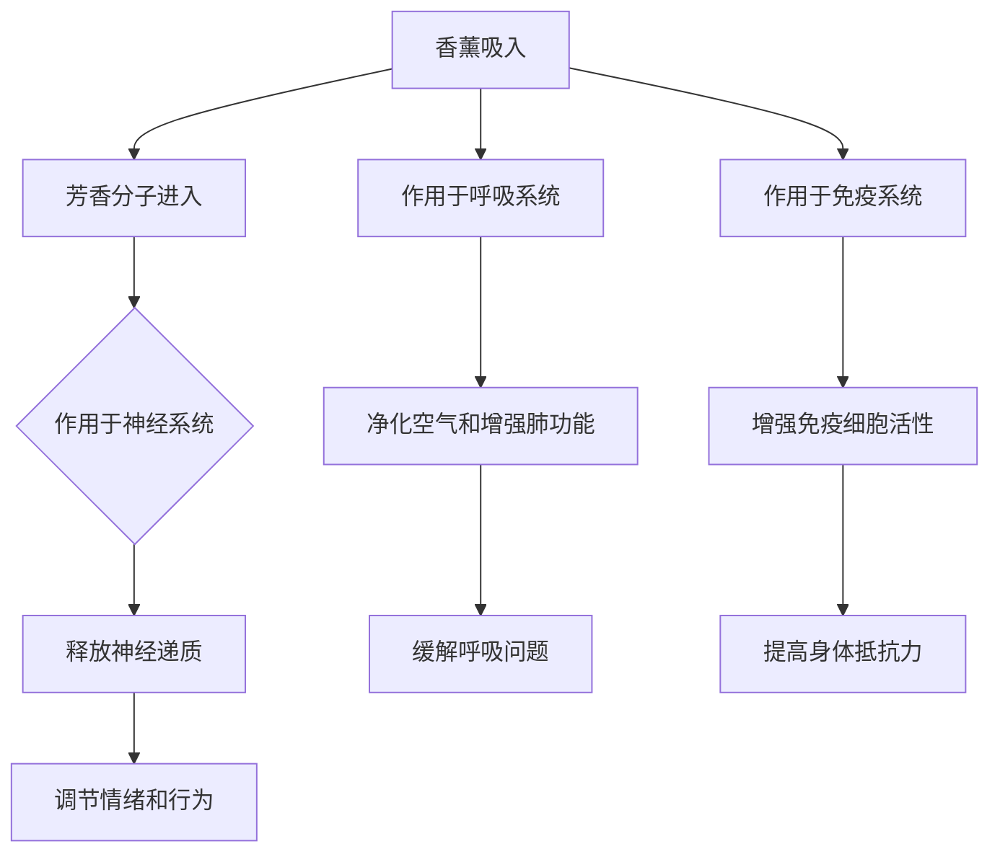

                 

# 《现代手工香薰制作：芳香疗法在日常生活中的应用》

## 关键词
- 手工香薰
- 芳香疗法
- 植物精油
- 芳香分子
- 健康护理
- 心理调适
- 生活美学

## 摘要
本文将深入探讨现代手工香薰的制作过程及其在芳香疗法中的应用。通过详细解析手工香薰的制作材料、步骤和技术，我们将揭示如何利用植物精油和芳香分子为日常生活增添健康和美学价值。此外，本文还将介绍芳香疗法的基本原理，探讨其在改善睡眠、缓解压力、调节情绪等方面的实际应用。最后，我们将总结一些制作和使用的最佳实践，为读者提供实用的指导和建议。

## 引言：手工香薰与芳香疗法的魅力

### 1.1 手工香薰的定义与起源
手工香薰是一种传统的手工艺，通过燃烧或蒸汽挥发的方式，将植物精油、香料等天然成分释放到空气中，以达到舒缓身心、净化空气、提升环境氛围的目的。手工香薰的历史可以追溯到古埃及、古希腊和罗马时期，当时的贵族和皇室将香薰视为日常生活的重要部分，用以提升生活品质和健康状态。

### 1.2 芳香疗法的基本概念
芳香疗法（Aromatherapy）是利用植物精油的芳香成分，通过吸入、涂抹或沐浴等方式，对人体进行自然疗愈的方法。芳香疗法的基本原理在于植物精油中的芳香分子能够刺激人体的神经系统、呼吸系统和免疫系统，从而调节身心状态、缓解不适、提升健康。

### 1.3 香薰在生活中的应用价值
在现代生活中，手工香薰和芳香疗法具有广泛的应用价值。首先，香薰可以改善室内空气质量，净化空气中的细菌和病毒，有助于预防感冒和流感。其次，香薰能够提升环境氛围，缓解工作压力和焦虑情绪，提高睡眠质量。此外，香薰还能促进身心健康，增强免疫力，改善皮肤状况，具有多方面的保健作用。

## 基础知识：手工香薰制作入门

### 2.1 制作香薰所需的材料与工具
制作手工香薰需要以下基本材料和工具：
- **植物精油**：是香薰的核心成分，常见的有薰衣草精油、茶树精油、迷迭香精油等。
- **蜡烛基料**：可以是蜂蜡、石蜡或植物油基料，用于制作香薰蜡烛。
- **香料**：如香草、薄荷、柠檬等，用于增强或调整香薰的香味。
- **容器**：用于盛放香薰材料，可以是玻璃瓶、陶瓷瓶等。
- **工具**：如剪刀、勺子、温度计等，用于辅助香薰制作。

### 2.2 芳香精油的类型与特性
芳香精油的类型多种多样，每种精油都有其独特的化学成分和芳香特性。以下是几种常见的芳香精油及其特性：
- **薰衣草精油**：具有镇静、舒缓、消炎作用，适用于缓解焦虑、改善睡眠。
- **茶树精油**：具有抗菌、抗病毒、抗炎作用，适用于清洁皮肤、预防感染。
- **迷迭香精油**：具有提神、健脑、抗炎作用，适用于缓解疲劳、增强记忆力。
- **橙花精油**：具有舒缓、抗抑郁、平衡情绪作用，适用于缓解压力、提升心情。

### 2.3 香薰制作的基本步骤
手工香薰的制作步骤通常包括以下几个环节：
1. **选择材料**：根据所需香薰的类型和效果，选择合适的植物精油、蜡烛基料和香料。
2. **准备工具**：将所有制作材料准备好，并确保工具清洁干净。
3. **混合材料**：将植物精油和蜡烛基料按照一定比例混合，搅拌均匀。
4. **注入容器**：将混合好的材料注入到准备好的容器中，可以是香薰蜡烛、香薰喷雾或香薰按摩油。
5. **固化**：将容器放在阴凉通风处，待其固化成固体或液体状态。
6. **装饰与包装**：根据个人喜好，对香薰进行装饰和包装，使其更具美观性和实用性。

## 核心概念与联系

### 3.1 手工香薰的核心要素
手工香薰的核心要素包括植物精油、蜡烛基料、香料和容器。植物精油是香薰的灵魂，决定了香薰的香气和疗效；蜡烛基料和香料则用于调整香薰的口感和强度；容器则是香薰的载体，决定了香薰的使用方式和美观度。

### 3.2 芳香疗法的理论基础
芳香疗法的理论基础主要涉及植物精油中的芳香分子。芳香分子通过吸入或涂抹进入人体，作用于人体的神经系统、呼吸系统和免疫系统，从而产生一系列生理和心理反应。例如，薰衣草精油中的镇静成分可以通过呼吸系统进入大脑，促进放松和睡眠；茶树精油中的抗菌成分可以通过皮肤吸收，用于清洁和预防感染。

### 3.3 香薰与身心健康的关联
香薰对身心健康的影响主要通过以下途径实现：
- **神经系统**：芳香分子可以刺激大脑释放神经递质，调节情绪和行为。
- **呼吸系统**：吸入芳香分子可以净化空气、增强肺功能、缓解呼吸问题。
- **免疫系统**：芳香分子可以增强免疫细胞的活性，提高身体抵抗力。

### Mermaid 流程图
下面是一个简单的 Mermaid 流程图，展示了香薰与身心健康之间的关联：

## 香薰配方与制作

### 4.1 睡眠香薰配方

#### 4.1.1 配方一：薰衣草与甜橙
- **材料**：薰衣草精油2滴、甜橙精油1滴、10毫升基础油。
- **步骤**：
  1. 将薰衣草精油和甜橙精油混合在基础油中。
  2. 将混合好的精油倒入香薰蜡烛或香薰灯中。
  3. 在睡前点燃香薰，享受舒缓的香气。

#### 4.1.2 配方二：檀香与依兰
- **材料**：檀香精油2滴、依兰精油1滴、10毫升基础油。
- **步骤**：
  1. 将檀香精油和依兰精油混合在基础油中。
  2. 将混合好的精油倒入香薰蜡烛或香薰灯中。
  3. 在睡前点燃香薰，放松身心。

### 4.2 日常提神香薰配方

#### 4.2.1 配方一：迷迭香与薄荷
- **材料**：迷迭香精油2滴、薄荷精油1滴、10毫升基础油。
- **步骤**：
  1. 将迷迭香精油和薄荷精油混合在基础油中。
  2. 将混合好的精油倒入香薰蜡烛或香薰灯中。
  3. 在工作或学习前点燃香薰，提升精神状态。

#### 4.2.2 配方二：橙花与薄荷
- **材料**：橙花精油2滴、薄荷精油1滴、10毫升基础油。
- **步骤**：
  1. 将橙花精油和薄荷精油混合在基础油中。
  2. 将混合好的精油倒入香薰蜡烛或香薰灯中。
  3. 在工作或学习前点燃香薰，清新提神。

### 4.3 健康调节香薰配方

#### 4.3.1 配方一：茶树与薰衣草
- **材料**：茶树精油2滴、薰衣草精油1滴、10毫升基础油。
- **步骤**：
  1. 将茶树精油和薰衣草精油混合在基础油中。
  2. 将混合好的精油倒入香薰蜡烛或香薰灯中。
  3. 在需要清洁空气或预防感染时点燃香薰。

#### 4.3.2 配方二：柠檬与迷迭香
- **材料**：柠檬精油2滴、迷迭香精油1滴、10毫升基础油。
- **步骤**：
  1. 将柠檬精油和迷迭香精油混合在基础油中。
  2. 将混合好的精油倒入香薰蜡烛或香薰灯中。
  3. 在需要增强免疫或改善消化时点燃香薰。

### 香薰蜡烛制作技巧
- **熔化蜡基料**：将蜡烛基料放入微波炉中熔化，注意不要过热，以免破坏其质量。
- **加入精油**：将熔化的蜡基料倒入容器中，加入预先混合好的精油，搅拌均匀。
- **注入容器**：将混合好的蜡基料缓慢倒入容器中，避免气泡产生。
- **固化**：将容器放在阴凉通风处，等待蜡基料固化。

### 香薰喷雾制作步骤
- **混合精油**：将所需的精油混合在基础喷雾剂中，搅拌均匀。
- **装入喷雾瓶**：将混合好的精油倒入喷雾瓶中，旋紧瓶盖。
- **使用方法**：在需要时，将喷雾瓶对准空气或皮肤，均匀喷洒。

## 芳香疗法应用

### 5.1 芳香疗法在日常生活中的应用
#### 5.1.1 睡眠质量改善
睡眠质量是人们日常生活的重要方面。通过使用薰衣草、檀香等具有镇静作用的精油，可以有效地改善睡眠质量。将适量的精油滴在香薰蜡烛或香薰灯中，睡前点燃，有助于放松身心，缓解压力，促进睡眠。

#### 5.1.2 压力缓解
现代生活节奏快，工作压力大，很多人都会感到焦虑和紧张。芳香疗法可以通过吸入或涂抹精油来缓解压力。例如，使用迷迭香、薄荷等具有提神和放松作用的精油，可以在工作间隙进行香薰，帮助缓解疲劳，提升工作效率。

#### 5.1.3 呼吸系统保健
芳香疗法对呼吸系统也有很好的保健作用。例如，茶树精油具有抗菌、抗病毒的特性，可以在流感季节或空气质量不佳时使用，有助于预防感冒和呼吸系统感染。

### 5.2 芳香疗法在健康维护中的应用
#### 5.2.1 免疫系统增强
通过使用具有免疫增强作用的精油，如茶树、柠檬等，可以提升人体的免疫力，减少生病的几率。在日常生活中，可以将这些精油加入香薰蜡烛或喷雾中，定期使用，以增强身体健康。

#### 5.2.2 呼吸系统疾病缓解
对于患有呼吸系统疾病的人群，如哮喘、支气管炎等，芳香疗法也有一定的缓解作用。通过吸入具有抗炎和扩张支气管作用的精油，如迷迭香、薄荷等，可以缓解症状，改善呼吸状况。

#### 5.2.3 肠胃问题改善
芳香疗法还可以帮助改善肠胃问题，如消化不良、胃痛等。使用如薄荷、薰衣草等具有舒缓作用的精油，可以通过香薰或按摩的方式，缓解肠胃不适，促进消化。

### 5.3 芳香疗法在情绪调节中的应用
#### 5.3.1 情绪低落缓解
对于情绪低落、抑郁等情绪问题，芳香疗法可以通过吸入或涂抹精油来调节情绪。例如，橙花、依兰等具有抗抑郁作用的精油，可以提升心情，缓解负面情绪。

#### 5.3.2 焦虑缓解
焦虑是现代人常见的心理问题。通过使用如薰衣草、檀香等具有镇静作用的精油，可以在紧张或焦虑时进行香薰，帮助放松身心，缓解焦虑情绪。

#### 5.3.3 焦虑缓解
焦虑是现代人常见的心理问题。通过使用如薰衣草、檀香等具有镇静作用的精油，可以在紧张或焦虑时进行香薰，帮助放松身心，缓解焦虑情绪。

### 芳香疗法的多种应用场景
芳香疗法不仅可以在家庭中使用，还可以在医疗、美容、酒店等行业中广泛应用。以下是一些具体的应用场景：
- **医院**：用于改善患者情绪，缓解疼痛和不适。
- **美容院**：用于按摩、护肤，促进皮肤健康。
- **酒店**：用于提升客房氛围，提供个性化服务。
- **办公室**：用于提升工作效率，缓解员工压力。

## 香薰文化的传承与创新

### 6.1 香薰的历史与文化背景
香薰的历史可以追溯到古埃及、古希腊和罗马时期，当时的人们将香薰视为宗教仪式和日常生活的重要组成部分。在中国，香薰文化也有悠久的历史，如古代宫廷中的香案、茶道中的香薰等，都是香薰文化的重要组成部分。

### 6.2 当代香薰产业的发展趋势
随着现代科技的发展，香薰产业也在不断创新和发展。目前，香薰产品已经从传统的蜡烛、喷雾扩展到精油、香薰机、香薰灯等多个品类。同时，香薰产业也在积极融入现代科技，如智能香薰机、精油雾化器等，为用户提供更多样化的选择。

### 6.3 创新香薰产品设计与营销策略
为了满足现代消费者的需求，香薰产品的设计和营销策略也在不断创新。例如，结合环保理念，推出可回收利用的香薰蜡烛；利用互联网技术，推出智能香薰机，实现远程控制；在营销策略上，通过社交媒体、短视频平台等渠道，进行创意推广，吸引更多消费者。

## 安全与注意事项

### 7.1 香薰制作过程中的安全措施
在进行香薰制作时，需要注意以下安全措施：
- **避免直接接触**：制作香薰时，应避免直接接触精油，以免引起皮肤过敏或刺激。
- **适量使用**：使用精油时，应严格按照推荐剂量，避免过量使用。
- **存储**：精油应存放在阴凉、干燥、避免阳光直射的地方，以防变质。

### 7.2 使用香薰时的注意事项
在使用香薰时，需要注意以下几点：
- **防火**：香薰蜡烛和香薰灯应在成人监护下使用，避免儿童接触。
- **通风**：使用香薰时，应保持室内通风，避免精油浓度过高，造成不适。
- **敏感性人群**：对于敏感性人群，如孕妇、婴幼儿、患有呼吸道疾病者，应慎重使用香薰。

### 7.3 香薰过敏与处理方法
如果在使用香薰时出现过敏反应，如皮肤瘙痒、红肿、呼吸急促等，应立即停止使用，并采取以下措施：
- **清洗**：用温水清洗受影响的皮肤区域，避免进一步刺激。
- **用药**：如果症状严重，可使用抗过敏药物，如抗组胺药。
- **就医**：如果症状持续或加重，应及时就医。

## 附录

### 附录 A：常用香薰材料介绍
- **薰衣草精油**：具有镇静、舒缓、消炎作用。
- **茶树精油**：具有抗菌、抗病毒、抗炎作用。
- **迷迭香精油**：具有提神、健脑、抗炎作用。
- **橙花精油**：具有舒缓、抗抑郁、平衡情绪作用。

### 附录 B：芳香疗法实用资源
- **网站**：如芳香疗法协会网站、精油购物网站等。
- **书籍**：如《芳香疗法实践指南》、《精油使用大全》等。
- **课程**：在线芳香疗法课程、工作坊等。

### 附录 C：香薰蜡烛与喷雾配方集
- **睡眠香薰配方**：薰衣草精油、檀香精油。
- **提神香薰配方**：迷迭香精油、薄荷精油。
- **健康调节香薰配方**：茶树精油、柠檬精油。

## 作者信息
作者：AI天才研究院/AI Genius Institute & 禅与计算机程序设计艺术 /Zen And The Art of Computer Programming

---

本文章内容仅供参考，实际使用时应根据个人情况和专业建议进行调整。在使用芳香疗法时，如有任何不适，请及时咨询专业医生。本文中的配方和步骤仅供参考，具体使用时请根据个人情况和需求进行适当调整。

