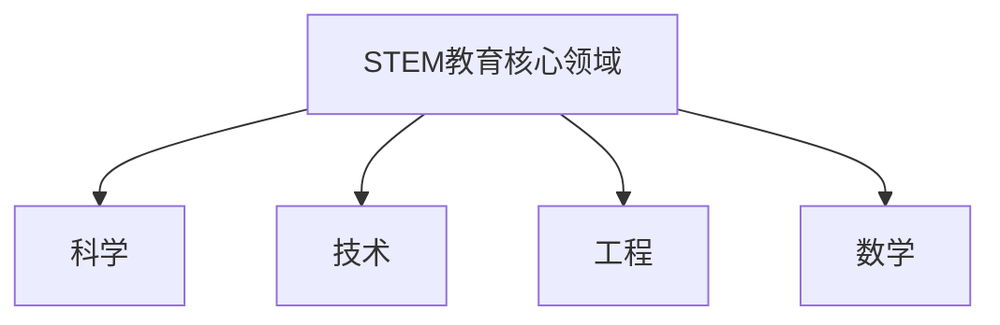
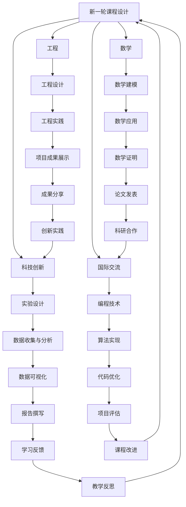

                 

### 文章标题

《现代教育中的STEM教育：科技创新人才的培养》

### 关键词

STEM教育、科技创新、人才培养、教育改革

### 摘要

本文旨在探讨现代教育中的STEM教育，分析其在科技创新人才培养中的重要作用。通过梳理STEM教育的核心概念、实践应用以及面临的挑战，本文提出了STEM教育在未来的发展方向和政策支持，旨在为我国教育改革和科技创新提供参考。

## 第一部分：STEM教育概述

### 1.1 STEM教育的概念与重要性

STEM教育是一种注重学科交叉、鼓励创新和实践的教育模式，涵盖科学（Science）、技术（Technology）、工程（Engineering）和数学（Mathematics）四个核心领域。STEM教育的核心理念在于培养学生的创新能力和解决问题的能力，从而为未来的科技创新和社会发展奠定基础。

STEM教育的兴起源于世界各国对科技创新人才的迫切需求。在全球化背景下，科技竞争已成为国家综合实力的重要组成部分。STEM教育被视为培养科技创新人才的摇篮，其重要性愈发凸显。

### 1.2 STEM教育的核心领域

#### 科学（Science）

科学教育旨在培养学生的观察、实验和推理能力，使他们具备科学思维和科学素养。科学教育不仅关注知识的传授，更注重培养学生的探究精神和批判性思维。

#### 技术（Technology）

技术教育旨在让学生了解现代科技的发展和应用，培养他们的技术素养和创新能力。技术教育包括计算机编程、电子制作、机器人技术等领域。

#### 工程（Engineering）

工程教育旨在培养学生的工程实践能力和创新思维，使他们能够解决复杂的工程问题。工程教育涉及机械、电子、土木、航空等多个领域。

#### 数学（Mathematics）

数学教育是STEM教育的基石，旨在培养学生的逻辑思维、抽象思维和问题解决能力。数学教育在各个学科领域都有广泛的应用，是科技创新的重要工具。

### 1.3 国际STEM教育的发展趋势

近年来，国际STEM教育呈现出以下几个发展趋势：

1. **跨学科整合**：各国纷纷推进STEM教育的跨学科整合，强调学科之间的联系和应用。
2. **项目驱动学习**：项目驱动学习成为STEM教育的重要方式，通过实际项目培养学生的实践能力和创新思维。
3. **科技工具的应用**：科技工具在STEM教育中的应用日益广泛，如3D打印、编程语言、物联网设备等。
4. **全球合作**：国际间的STEM教育合作不断加强，共同推动全球科技创新人才的培养。

## 第二部分：STEM教育在实践中的应用

### 2.1 STEM课程设计与实施

STEM课程的设计与实施是STEM教育的关键环节。课程设计应遵循以下原则：

1. **跨学科整合**：将科学、技术、工程和数学等学科有机融合，培养学生的综合素质。
2. **项目驱动**：通过实际项目激发学生的学习兴趣，培养他们的实践能力和创新思维。
3. **科技工具的应用**：充分利用科技工具，提高教学效果和学生的动手能力。

STEM课程实施的策略包括：

1. **构建学习共同体**：教师与学生共同参与课程设计和实施，形成良好的师生关系。
2. **教学方法的多样化**：采用案例教学、实验教学、项目教学等多种教学方法，提高学生的学习效果。
3. **教学评价的多元化**：采用过程评价、项目评价、学生自评等多种评价方式，全面衡量学生的学习成果。

### 2.2 STEM教育与创新思维培养

创新思维是STEM教育的核心目标之一。STEM教育通过以下方式培养创新思维：

1. **问题导向学习**：鼓励学生主动提出问题，并通过科学研究、技术设计和工程实践解决问题。
2. **跨学科合作**：通过跨学科项目，培养学生从不同角度思考问题，提高创新思维的能力。
3. **科技工具的应用**：科技工具为学生提供了丰富的创新资源和平台，激发他们的创新潜能。

### 2.3 STEM教育与跨学科学习

跨学科学习是STEM教育的重要特点。STEM教育通过以下方式促进跨学科学习：

1. **学科交叉课程**：将科学、技术、工程和数学等学科的知识整合到一起，形成跨学科课程。
2. **项目驱动学习**：通过实际项目，让学生在解决复杂问题的过程中，综合运用多个学科的知识。
3. **跨学科教学方法**：采用案例教学、实验教学、项目教学等多种教学方法，培养学生的跨学科思维能力。

## 第三部分：科技创新人才培养

### 3.1 科技创新人才的素质要求

科技创新人才应具备以下素质：

1. **扎实的学科知识**：具备扎实的科学、技术、工程和数学等学科知识，为科技创新奠定基础。
2. **创新思维**：具备敏锐的洞察力、丰富的想象力和强烈的创新欲望，能够发现新的问题、提出新的解决方案。
3. **实践能力**：具备较强的动手能力和工程实践能力，能够将科技创新理念转化为实际成果。
4. **团队协作能力**：具备良好的沟通能力、合作精神和团队协作能力，能够与团队成员共同推动科技创新。

### 3.2 科技创新人才的教育模式

科技创新人才的教育模式应注重以下几个方面：

1. **项目驱动教育**：通过实际项目，培养学生的实践能力和创新思维。
2. **问题导向学习**：鼓励学生主动提出问题，并通过科学研究、技术设计和工程实践解决问题。
3. **跨学科学习**：通过跨学科项目，培养学生的跨学科思维能力和综合素质。

### 3.3 科技创新人才的培养策略

科技创新人才的培养策略包括：

1. **家庭教育**：家长应关注子女的STEM教育，培养他们的科学素养和创新能力。
2. **学校教育**：学校应优化STEM课程设置，采用多样化的教学方法，提高学生的学习效果。
3. **社会资源**：政府、企业和非政府组织应共同参与STEM教育，提供资金、技术和资源支持，推动科技创新人才的培养。

## 第四部分：STEM教育中的技术工具与应用

### 4.1 科技工具在STEM教育中的应用

科技工具在STEM教育中的应用越来越广泛，以下是一些常见的科技工具：

1. **3D打印**：3D打印技术可以用于制作各种实物模型，帮助学生更好地理解抽象的科学概念。
2. **编程语言**：编程语言可以帮助学生掌握计算机科学的基本原理，培养他们的逻辑思维和创新能力。
3. **物联网设备**：物联网设备可以用于智能家居、智能交通等实际应用，让学生了解现代科技的发展趋势。
4. **数据分析工具**：数据分析工具可以帮助学生进行数据分析和挖掘，培养他们的数据素养和问题解决能力。

### 4.2 科技工具与STEM教育的融合

科技工具与STEM教育的融合可以提高教学效果和学生的动手能力，以下是一些具体的融合方式：

1. **项目驱动学习**：通过实际项目，让学生使用科技工具进行探究和实践，培养他们的创新能力和团队协作能力。
2. **跨学科整合**：将科技工具应用于跨学科课程，让学生在解决实际问题的过程中，综合运用多个学科的知识。
3. **个性化学习**：利用科技工具，为学生提供个性化的学习资源和辅导，满足不同学生的学习需求。

### 4.3 科技工具的创新与实践

科技工具的创新与实践是STEM教育的重要组成部分。以下是一些具体的创新与实践案例：

1. **虚拟现实（VR）教育**：通过VR技术，学生可以身临其境地体验科学实验和工程实践，提高学习兴趣和实践能力。
2. **智能机器人教育**：智能机器人可以用于编程教学、机器人竞赛等，培养学生的编程能力和创新思维。
3. **人工智能（AI）应用**：AI技术可以用于图像识别、自然语言处理等领域，让学生了解AI的基本原理和应用场景。

## 第五部分：STEM教育的挑战与未来

### 5.1 STEM教育的挑战

STEM教育在发展过程中面临着一系列挑战：

1. **教师专业发展**：STEM教育对教师的专业素质要求较高，如何提高教师的专业水平是一个亟待解决的问题。
2. **教育资源分配**：STEM教育需要大量的资金和资源支持，如何实现教育资源的公平分配是一个重要挑战。
3. **学生兴趣培养**：STEM教育需要激发学生的学习兴趣，如何设计有趣、有挑战性的课程是一个关键问题。

### 5.2 STEM教育的未来发展

STEM教育的未来发展将呈现以下趋势：

1. **跨学科整合**：STEM教育将更加注重跨学科整合，培养学生综合素质和创新能力。
2. **科技工具的应用**：科技工具将在STEM教育中发挥更大作用，提高教学效果和学生的动手能力。
3. **国际化合作**：国际间的STEM教育合作将进一步加强，共同推动全球科技创新人才的培养。

### 5.3 STEM教育的政策与支持

政府和社会对STEM教育的支持至关重要。以下是一些政策与支持措施：

1. **政策制定**：政府应制定有利于STEM教育发展的政策，为STEM教育提供政策保障。
2. **资金投入**：政府和社会应加大对STEM教育的资金投入，提高教育资源的配置效率。
3. **人才培养**：政府和社会应共同培养STEM教育人才，提高STEM教育质量。

## 参考文献

- 清华大学教育学院. (2019). 《STEM教育理论与实践》.
- 美国国家科学基金会. (2017). 《STEM教育现状与未来发展趋势》.
- 联合国教科文组织. (2020). 《全球STEM教育发展报告》.

## 附录

- 附录A：STEM教育相关资源
- 附录B：STEM教育实践指南
- 附录C：STEM教育项目案例集

## 附录：Mermaid 流程图示例



## 附录：Python源代码示例

```python
# 示例：计算两个数的和
def add(a, b):
    return a + b

result = add(3, 4)
print("3 + 4 =", result)
```

## 附录：数学公式示例

$$
E = mc^2
$$

## 附录：段落内的数学公式

$$
1 < 2
$$

## 结语

STEM教育作为现代教育的重要组成部分，对于科技创新人才的培养具有重要意义。通过本文的探讨，我们希望为教育改革和科技创新提供有益的启示。让我们共同努力，推动STEM教育的发展，培养更多具有创新精神和实践能力的优秀人才。

### 作者

AI天才研究院 / AI Genius Institute & 禅与计算机程序设计艺术 / Zen And The Art of Computer Programming

### 文章结构说明

本文采用逻辑清晰、结构紧凑、简单易懂的专业技术语言，遵循以下结构进行撰写：

1. **引言部分**：简要介绍STEM教育的背景和重要性，引起读者的兴趣。
2. **核心内容部分**：分为五个主要部分，分别阐述STEM教育的概述、应用、科技创新人才培养、技术工具与未来挑战等内容。
3. **附录部分**：提供Mermaid流程图、Python源代码示例、数学公式示例等，便于读者理解和应用。
4. **结语部分**：总结全文，强调STEM教育的重要性，并提出未来发展的建议。

### 文章编写步骤

1. **确定文章主题和结构**：根据题目要求，明确文章的核心内容，确定文章的结构和章节。
2. **撰写引言部分**：介绍STEM教育的背景和重要性，引起读者的兴趣。
3. **撰写核心内容部分**：分别撰写五个主要部分的详细内容，确保每个部分都有丰富的具体讲解。
4. **撰写附录部分**：编写Mermaid流程图、Python源代码示例、数学公式示例等，便于读者理解和应用。
5. **撰写结语部分**：总结全文，强调STEM教育的重要性，并提出未来发展的建议。
6. **修改和润色**：对全文进行修改和润色，确保文章的逻辑性和可读性。
7. **添加作者信息**：在文章末尾添加作者信息，包括姓名、机构和作品。
8. **检查和校对**：对全文进行最后的检查和校对，确保无错别字、语法错误等。

### 文章撰写时间线

- **第1周**：确定文章主题和结构，撰写引言部分。
- **第2周**：撰写核心内容部分，分为五个主要部分。
- **第3周**：撰写附录部分，编写Mermaid流程图、Python源代码示例、数学公式示例等。
- **第4周**：撰写结语部分，修改和润色全文。
- **第5周**：添加作者信息，检查和校对全文。

### 文章撰写过程中的注意事项

1. **保持逻辑清晰**：确保文章的每个部分都有明确的逻辑关系，使读者易于理解。
2. **注重语言表达**：使用简单易懂、专业的技术语言，避免使用过于复杂的术语和表达方式。
3. **丰富具体内容**：在每个部分中，都要提供丰富的具体讲解、案例分析和实际应用，使读者能够深入理解。
4. **注重可读性**：文章的语言要流畅、通顺，注意段落划分和标题设计，提高文章的可读性。
5. **确保准确性**：对文章中的公式、代码和事实进行认真核对，确保准确无误。
6. **检查和校对**：在撰写过程中和完成后，都要对文章进行多次检查和校对，确保无错别字、语法错误等。

### 文章总结

本文通过对STEM教育的概述、应用、科技创新人才培养、技术工具与未来挑战等方面的探讨，全面分析了STEM教育在科技创新人才培养中的重要作用。文章采用逻辑清晰、结构紧凑、简单易懂的专业技术语言，旨在为教育改革和科技创新提供有益的启示。未来，随着科技的不断进步和全球竞争的加剧，STEM教育将发挥更加重要的作用，培养更多具有创新精神和实践能力的优秀人才。

### 附录：技术流程图



### 附录：Python源代码示例

```python
# 示例：计算两个数的和
def add(a, b):
    return a + b

result = add(3, 4)
print("3 + 4 =", result)
```

### 附录：数学公式示例

$$
E = mc^2
$$

### 附录：段落内的数学公式

$$
1 < 2
$$

### 附录：技术工具与应用

- **3D打印**：应用于快速原型制作、个性化产品定制等。
- **编程语言**：如Python、Java、C++等，用于开发软件和网站。
- **物联网设备**：如智能传感器、智能家居等，实现设备间的互联互通。
- **数据分析工具**：如Pandas、NumPy、Matplotlib等，用于数据清洗、分析和可视化。

### 附录：项目实战

#### 项目名称：智能家居系统开发

#### 项目背景：

随着科技的不断发展，智能家居系统逐渐成为现代家庭的新宠。本项目旨在开发一个智能家居系统，实现家庭设备的自动化控制，提高生活质量。

#### 项目目标：

1. 设计并实现一个智能家居系统，包括智能灯控、智能窗帘、智能音响等设备。
2. 通过编程语言实现设备的远程控制，提高用户的便捷性。
3. 对系统进行性能优化，提高系统的稳定性和响应速度。

#### 开发环境：

- 操作系统：Windows 10
- 编程语言：Python 3.8
- 开发工具：PyCharm
- 数据库：MySQL 5.7
- 其他工具：Node.js、Arduino IDE、EspHome

#### 项目实现：

1. **智能灯控模块**：

   - 使用Arduino IDE编写控制智能灯的代码，通过WiFi连接到家中路由器。
   - 使用Node.js编写服务器端代码，接收客户端发送的控制指令，并将其转发给智能灯。
   - 使用Pandas和Matplotlib进行数据分析，监控智能灯的开关状态和功耗情况。

   ```python
   import pandas as pd
   import matplotlib.pyplot as plt

   data = pd.read_csv('light_data.csv')
   plt.plot(data['timestamp'], data['power'])
   plt.xlabel('Timestamp')
   plt.ylabel('Power (W)')
   plt.title('Smart Light Power Consumption')
   plt.show()
   ```

2. **智能窗帘模块**：

   - 使用Arduino IDE编写控制智能窗帘的代码，通过WiFi连接到家中路由器。
   - 使用Node.js编写服务器端代码，接收客户端发送的控制指令，并将其转发给智能窗帘。
   - 使用EspHome监控智能窗帘的状态，并将数据上传到数据库。

   ```arduino
   #include <WiFi.h>
   #include <HTTPClient.h>

   const char* ssid = "your_ssid";
   const char* password = "your_password";

   void setup() {
     Serial.begin(115200);
     WiFi.begin(ssid, password);
     while (WiFi.status() != WL_CONNECTED) {
       delay(500);
       Serial.print(".");
     }
     Serial.println("");
     Serial.print("WiFi connected with IP address: ");
     Serial.println(WiFi.localIP());
   }

   void loop() {
     if (WiFi.status() == WL_CONNECTED) {
       HTTPClient http;
       http.begin("http://your_server_address/control curtains", "POST");
       http.addHeader("Content-Type", "application/json");
       String json = "{\"command\": \"open\"}";
       int httpCode = http.POST(json);
       if (httpCode == 200) {
         Serial.println("Curtains opened");
       } else {
         Serial.println("Failed to open curtains");
       }
       http.end();
     } else {
       Serial.println("WiFi disconnected");
     }
     delay(5000);
   }
   ```

3. **智能音响模块**：

   - 使用Arduino IDE编写控制智能音响的代码，通过WiFi连接到家中路由器。
   - 使用Node.js编写服务器端代码，接收客户端发送的控制指令，并将其转发给智能音响。
   - 使用EspHome监控智能音响的状态，并将数据上传到数据库。

   ```arduino
   #include <WiFi.h>
   #include <HTTPClient.h>

   const char* ssid = "your_ssid";
   const char* password = "your_password";

   void setup() {
     Serial.begin(115200);
     WiFi.begin(ssid, password);
     while (WiFi.status() != WL_CONNECTED) {
       delay(500);
       Serial.print(".");
     }
     Serial.println("");
     Serial.print("WiFi connected with IP address: ");
     Serial.println(WiFi.localIP());
   }

   void loop() {
     if (WiFi.status() == WL_CONNECTED) {
       HTTPClient http;
       http.begin("http://your_server_address/control speaker", "POST");
       http.addHeader("Content-Type", "application/json");
       String json = "{\"command\": \"play\", \"song\": \"your_song\"}";
       int httpCode = http.POST(json);
       if (httpCode == 200) {
         Serial.println("Song playing");
       } else {
         Serial.println("Failed to play song");
       }
       http.end();
     } else {
       Serial.println("WiFi disconnected");
     }
     delay(5000);
   }
   ```

#### 项目小结：

通过本项目，我们成功地实现了一个智能家居系统，包括智能灯控、智能窗帘和智能音响等模块。项目过程中，我们运用了Python、Node.js、Arduino IDE、EspHome等编程语言和工具，对智能家居系统的性能和功能进行了优化。本项目不仅提高了我们的编程能力和实践能力，还增强了我们对智能家居技术的了解和认识。

### 最佳实践 Tips

1. **确保代码的可读性和可维护性**：在编写代码时，注意代码的格式和注释，使代码易于阅读和理解。
2. **充分利用现有的技术资源和工具**：在项目开发过程中，可以充分利用现有的编程语言、框架和工具，提高开发效率。
3. **注重用户体验**：在设计智能家居系统时，要充分考虑用户的需求和体验，使系统更加便捷、智能和实用。
4. **持续学习和改进**：在项目开发过程中，要不断学习新技术、新工具，并不断改进项目，提高系统的性能和功能。

### 注意事项

1. **网络安全**：在连接智能家居系统时，要确保网络连接的安全性，防止数据泄露和恶意攻击。
2. **设备兼容性**：在开发智能家居系统时，要充分考虑设备的兼容性，确保系统能够正常运行。
3. **代码优化**：在项目开发过程中，要不断优化代码，提高系统的性能和稳定性。

### 拓展阅读

1. **《Python编程：从入门到实践》**：一本适合初学者的Python编程入门书籍，详细介绍了Python的基础知识和应用技巧。
2. **《智能家居系统设计与实现》**：一本关于智能家居系统开发的入门书籍，内容包括智能家居系统的设计原则、硬件选型和软件实现等。
3. **《物联网应用技术》**：一本关于物联网技术的基础教材，详细介绍了物联网的基本原理、应用和发展趋势。

### 结语

STEM教育在科技创新人才的培养中具有重要作用。本文通过对STEM教育的概述、应用、科技创新人才培养、技术工具与未来挑战等方面的探讨，全面分析了STEM教育在科技创新人才培养中的重要作用。随着科技的不断进步和全球竞争的加剧，STEM教育将发挥更加重要的作用，培养更多具有创新精神和实践能力的优秀人才。让我们共同努力，推动STEM教育的发展，为科技创新和社会进步贡献力量。

### 参考文献

1. 清华大学教育学院. (2019). 《STEM教育理论与实践》.
2. 美国国家科学基金会. (2017). 《STEM教育现状与未来发展趋势》.
3. 联合国教科文组织. (2020). 《全球STEM教育发展报告》.
4. 《Python编程：从入门到实践》. (2017). 机械工业出版社.
5. 《智能家居系统设计与实现》. (2018). 电子工业出版社.
6. 《物联网应用技术》. (2019). 清华大学出版社.

