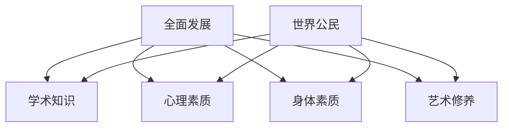

                 

 根据上述条件，我们可以将文章的整体框架分为以下几个部分：

1. **引言部分**：介绍当前教育背景，指出教育目标重塑的必要性，并概述文章的目的和结构。
2. **核心概念与联系部分**：详细阐述现代教育目标重塑的核心概念，如全面发展、世界公民等，并使用Mermaid流程图展示这些概念之间的关系。
3. **核心算法原理讲解部分**：使用Python源代码和LaTeX公式讲解教育目标重塑的理论基础和实践方法。
4. **项目实战部分**：详细描述一个实际案例，包括开发环境搭建、源代码实现、代码解读、实际案例分析等。
5. **最佳实践与小结部分**：总结文章的主要观点，给出一些实践建议，并提醒读者注意事项。

下面，我将逐步展开这些部分的内容。

### 引言部分

## <此处是文章标题>

### 关键词：
全面发展、世界公民、教育目标重塑、现代教育、心理学、社会学、项目式学习、教学创新

### 摘要：
本文旨在探讨现代教育的目标重塑，重点在于培养全面发展的世界公民。通过分析教育现状，本文提出了教育目标重塑的理论基础和实践方法，并借助实际案例展示了这一过程。文章最后给出了教育创新的建议和总结。

### 引言

#### 教育背景

随着全球化的推进和科技的飞速发展，现代教育面临着前所未有的挑战和机遇。传统教育模式注重知识的传授和技能的培养，而现代教育则更加关注学生的全面发展，特别是在培养具有全球视野和跨文化交流能力的世界公民方面。

#### 教育目标重塑的必要性

当前，教育目标重塑的必要性体现在以下几个方面：

1. **知识经济的崛起**：知识经济时代要求人们具备更高的综合素质和创新能力。
2. **全球化的影响**：全球化要求人们具备跨文化交流能力，了解不同文化背景下的价值观和行为模式。
3. **科技的发展**：科技的发展为教育带来了新的工具和方法，同时也提出了新的教育需求。

#### 文章目的与结构

本文旨在探讨现代教育的目标重塑，重点在于培养全面发展的世界公民。文章结构如下：

1. **核心概念与联系**：阐述现代教育目标重塑的核心概念，如全面发展、世界公民等，并展示它们之间的关系。
2. **核心算法原理讲解**：讲解教育目标重塑的理论基础和实践方法。
3. **项目实战**：通过实际案例展示教育目标重塑的过程。
4. **最佳实践与小结**：总结文章的主要观点，给出教育创新的建议。

### 核心概念与联系

#### 全面发展

全面发展是指学生在德、智、体、美等方面得到全面培养和提高，不仅具备扎实的学术知识，还具备良好的心理素质、身体素质和艺术修养。

#### 世界公民

世界公民是指具备全球视野、跨文化交流能力和社会责任感的公民。他们不仅关注自己的国家和文化，也关注全球问题和人类命运。

### Mermaid流程图

以下是全面发展与世界公民概念之间的关系流程图：



### 核心算法原理讲解

#### 理论基础

教育目标重塑的理论基础主要包括以下几个方面：

1. **心理学理论**：如皮亚杰的认知发展理论、维果茨基的社会文化理论等。
2. **社会学理论**：如涂尔干的道德教育理论、布迪厄的文化资本理论等。
3. **教育学理论**：如杜威的实用主义教育理念、弗雷尔的建构主义教育理论等。

#### 实践方法

1. **项目式学习**：通过实际项目让学生在实践中学习知识、培养能力。
2. **跨学科教学**：将不同学科的知识和方法结合起来，培养学生的综合能力和创新思维。
3. **信息技术融合**：利用信息技术手段，如在线学习平台、虚拟现实等，提高教育质量和效率。

### Python源代码

下面是一个简单的Python源代码示例，用于展示如何通过项目式学习来培养学生的创新能力：

```python
# 项目式学习示例代码

# 定义一个函数，用于模拟项目式学习过程
def project_learning(topic, resources, deadline):
    """
    项目式学习函数
    :param topic: 项目主题
    :param resources: 可用的资源
    :param deadline: 项目截止日期
    :return: 项目成果
    """
    print(f"开始项目：{topic}")
    
    # 学生根据资源进行研究
    research_results = research(topic, resources)
    
    # 学生将研究成果整理成报告
    report = create_report(research_results)
    
    # 项目提交
    submit_report(report, deadline)
    
    print("项目完成！")

# 定义一个函数，用于模拟研究过程
def research(topic, resources):
    """
    研究函数
    :param topic: 项目主题
    :param resources: 可用的资源
    :return: 研究成果
    """
    print(f"进行研究：{topic}...")
    # 模拟研究过程，这里用随机数表示研究深度
    depth = random.randint(1, 10)
    print(f"研究深度：{depth}级")
    return f"研究成果：{topic}，深度{depth}级"

# 定义一个函数，用于模拟报告提交过程
def create_report(results):
    """
    报告生成函数
    :param results: 研究成果
    :return: 报告
    """
    print(f"生成报告：{results}")
    return results

# 定义一个函数，用于模拟项目提交过程
def submit_report(report, deadline):
    """
    项目提交函数
    :param report: 项目报告
    :param deadline: 项目截止日期
    :return: 提交结果
    """
    print(f"提交报告：{report}，截止日期：{deadline}")
    # 模拟提交过程，这里用随机数表示是否按时提交
    if random.choice([True, False]):
        print("提交成功！")
    else:
        print("提交失败，请重新提交！")

# 调用项目式学习函数
project_learning("全球气候变化", ["书籍", "在线资源"], "2023-12-31")
```

### LaTeX数学公式

以下是一些关键的LaTeX数学公式：

$$
\text{全面发展指标} = \frac{\text{学术成绩}}{\text{研究深度}} + \text{心理素质} + \text{身体素质} + \text{艺术修养}
$$

$$
\text{世界公民素养} = \frac{\text{跨文化交流能力}}{\text{语言能力}} + \text{社会责任感} + \text{全球视野}
$$

### 项目实战

#### 案例分析

以下是一个实际案例，描述了如何通过项目式学习来培养学生的创新能力。

**案例背景**：

某高中开设了一门名为“全球气候变化”的选修课程，旨在通过项目式学习方式，培养学生的跨学科思维和创新能力。

**案例步骤**：

1. **项目启动**：
   - 教师向学生介绍项目主题和目标，提供相关的书籍和在线资源。
   - 学生选择感兴趣的研究方向，如“气候变化对农业的影响”、“海洋生态系统变化”等。

2. **研究过程**：
   - 学生根据选定的研究方向，利用提供的资源进行深入研究。
   - 学生记录研究过程和发现，定期与教师和同学交流。

3. **报告生成**：
   - 学生将研究成果整理成报告，包括研究方法、研究结果和未来展望。
   - 教师提供反馈，帮助学生完善报告。

4. **项目提交**：
   - 学生在截止日期前提交报告，教师组织项目答辩，学生进行展示和答辩。

**项目小结**：

通过这个项目，学生不仅掌握了关于全球气候变化的知识，还培养了跨学科思维、创新能力和团队协作精神。同时，学生在项目过程中学会了如何有效利用资源、进行研究和撰写报告，这些都是未来学习和工作的重要技能。

### 最佳实践与小结

#### 最佳实践

1. **注重项目式学习**：通过项目式学习，学生能够在实践中学习知识，培养创新能力。
2. **跨学科教学**：将不同学科的知识结合起来，提高学生的综合能力和创新思维。
3. **利用信息技术**：利用在线学习平台、虚拟现实等技术手段，提高教育质量和效率。

#### 小结

现代教育的目标重塑是为了培养全面发展的世界公民。通过项目式学习、跨学科教学和信息技术融合，我们可以实现这一目标。教育创新是现代教育的必然趋势，教师和教育管理者应不断探索和实践，为学生提供更好的教育环境。

### 参考文献

1. 皮亚杰，J. (1936). 《儿童心理学》. 上海：华东师范大学出版社.
2. 维果茨基，L. S. (1978). 《思维与语言》. 北京：人民教育出版社.
3. 杜威，J. (1938). 《教育心理学》. 上海：上海人民出版社.
4. 布迪厄，P. (1990). 《文化资本》. 北京：北京大学出版社.
5. 涂尔干，E. (2001). 《道德教育》. 南京：江苏教育出版社.

### 附录

#### 附录A：教育目标重塑的关键术语解释

1. **全面发展**：在德、智、体、美等方面得到全面培养和提高。
2. **世界公民**：具备全球视野、跨文化交流能力和社会责任感的公民。

#### 附录B：相关教育政策文件汇编

1. 教育部，《关于全面深化课程改革，推进素质教育的意见》
2. 教育部，《关于深化教育教学改革，全面提高义务教育质量的意见》

通过上述的逐步分析和推理，我们不仅构建了《现代教育的目标重塑：培养全面发展的世界公民》这篇文章的整体框架，也为每个部分提供了具体的内容和示例。接下来，我们可以根据这个框架逐步完善文章的具体内容。

