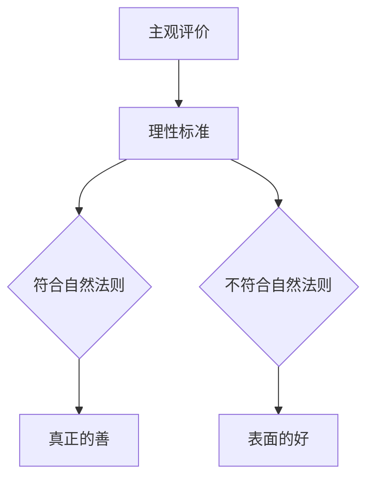
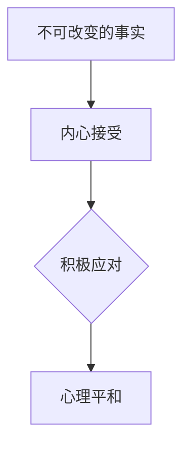
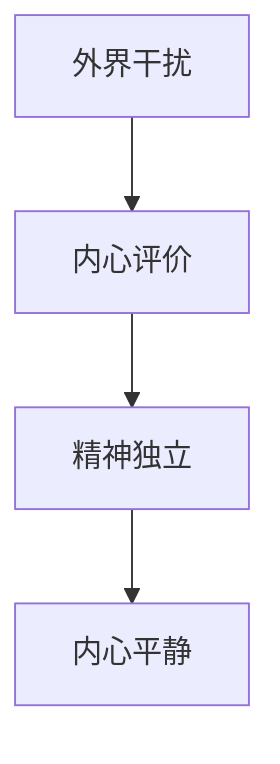
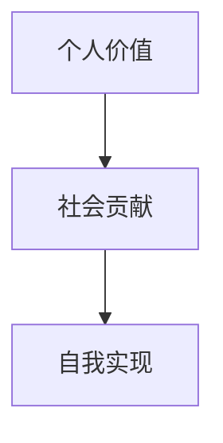

                 

### 第1章 引言

#### 1.1 斯多葛主义的起源与发展

斯多葛主义是古希腊哲学的一个重要流派，其起源可以追溯到公元前3世纪的希腊哲学家芝诺（Zeno of Citium）。芝诺是斯多葛主义的奠基人，他的哲学思想深受苏格拉底和柏拉图的影响。芝诺认为，真正的幸福来源于理性生活，而非物质享受。

随着芝诺的去世，斯多葛主义哲学继续在希腊、罗马帝国广泛传播。著名的斯多葛主义哲学家包括塞涅卡（Seneca）、爱比克泰图斯（Epictetus）和马可·奥勒留（Marcus Aurelius）。塞涅卡是一位富有的罗马贵族，他的著作《道德书信》对后世影响深远。爱比克泰图斯则是一位希腊奴隶，他的《论自由》强调了个人意志的力量。马可·奥勒留是罗马帝国的皇帝，他的《沉思录》记录了他对斯多葛主义哲学的深刻理解。

斯多葛主义的发展可以分为早期和晚期。早期的斯多葛主义强调道德自律和理性统治情感，而晚期的斯多葛主义则更注重内心平和和自我控制。尽管时代变迁，斯多葛主义的核心思想依然具有普世价值。

#### 1.2 现代斯多葛主义的概念与特点

现代斯多葛主义是对古典斯多葛主义思想的重新解读和应用。它不仅保留了古典斯多葛主义的核心理念，还结合了现代心理学、哲学和社会科学的研究成果。现代斯多葛主义的主要特点如下：

1. **理性至上**：现代斯多葛主义认为，理性是人类行为和决策的最高指导原则。通过理性思考，我们可以更好地理解世界和自己，从而实现内心的平和。

2. **接受现实**：面对生活中的不可控因素，现代斯多葛主义者选择接受现实，而不是抱怨和抗拒。接受现实并不意味着放弃努力，而是理解现实的本质，以理性的态度应对挑战。

3. **内在价值**：现代斯多葛主义强调个人的内在价值，而不是外在的成功或财富。一个人真正的幸福来自于自我实现和对他人有益的行为。

4. **心理训练**：现代斯多葛主义倡导通过心理训练来提高自我控制和情绪管理能力。这种训练包括冥想、反思和自我监控等实践。

#### 1.3 本书的目的与结构

本书旨在为读者提供一本实用的斯多葛主义实践手册，帮助他们在现代生活中应用古典智慧，实现内心的平和和自我成长。本书分为以下几个部分：

- **第1章 引言**：介绍斯多葛主义的起源、发展以及现代斯多葛主义的概念和特点。

- **第2章 斯多葛主义的核心原则**：详细探讨斯多葛主义的核心原则，包括理性至上、接受现实、内在价值和心理训练。

- **第3章 斯多葛主义在现代生活中的应用**：分析斯多葛主义在工作和人际关系中的应用策略。

- **第4章 斯多葛主义哲学家的智慧**：介绍三位著名的斯多葛主义哲学家，他们的著作和思想。

- **第5章 实践斯多葛主义：方法与技巧**：提供具体的实践方法和技术，帮助读者将斯多葛主义理念融入日常生活。

- **第6章 克服逆境：斯多葛主义的力量**：探讨如何运用斯多葛主义原则克服生活中的困难和挑战。

- **第7章 结束语**：总结本书的主要内容，强调斯多葛主义对现代人的意义，并鼓励读者付诸实践。

通过本书，读者不仅可以了解斯多葛主义的核心理念，还可以学会如何将这些理念应用到日常生活中，实现内心的平和和自我成长。让我们开始这段探索之旅吧！
```markdown
```python
# 第1章 引言

## 1.1 斯多葛主义的起源与发展

斯多葛主义（Stoicism）是一种源自古希腊的哲学流派，最早可以追溯到公元前3世纪，由希腊哲学家芝诺（Zeno of Citium）创立。芝诺是塞浦路斯的公民，他的哲学思想深受苏格拉底和柏拉图的影响，但他在道德哲学和个人修养方面提供了独特的视角。芝诺的哲学强调通过理性来指导生活，以达到心灵的宁静和自我完善。

在芝诺之后，斯多葛主义在希腊和罗马帝国中逐渐发展壮大。早期斯多葛主义的主要代表人物包括克律西波斯（Crates）、梅特罗多罗斯（Meno of Australia）和塞涅卡（Seneca the Younger）。晚期斯多葛主义则以爱比克泰图斯（Epictetus）和马可·奥勒留（Marcus Aurelius）为代表。

塞涅卡是罗马帝国时期的一位著名哲学家和文学家，他的《道德书信》和《论仁慈》等作品对后世影响深远。塞涅卡强调道德自律和理性生活，认为真正的幸福来自于道德的完善和对物质欲望的克制。

爱比克泰图斯是一位希腊奴隶，后来成为罗马帝国的公民。他的著作《论自由》强调了个人意志的力量，认为人们可以通过自我修炼达到内心的自由和独立。

马可·奥勒留是罗马帝国的皇帝，同时也是一位哲学家。他的《沉思录》（Meditations）记录了他对斯多葛主义哲学的深刻理解，尤其强调个人的内在价值和自我控制。

斯多葛主义的发展可以分为两个阶段：早期斯多葛主义和晚期斯多葛主义。早期斯多葛主义注重道德伦理和理性控制，晚期斯多葛主义则更强调内心平和和自我控制。尽管经历了两千多年的时间，斯多葛主义的核心思想仍然具有普世价值。

## 1.2 现代斯多葛主义的概念与特点

现代斯多葛主义是对古典斯多葛主义思想的重新解读和应用。它不仅保留了古典斯多葛主义的核心理念，还结合了现代心理学、哲学和社会科学的研究成果。现代斯多葛主义的主要特点如下：

### 理性至上

现代斯多葛主义认为，理性是人类行为和决策的最高指导原则。通过理性思考，我们可以更好地理解世界和自己，从而实现内心的平和。理性不仅是思考的工具，也是行动的指南。斯多葛主义者相信，通过理性的引导，我们可以超越情绪的波动，保持冷静和从容。

### 接受现实

面对生活中的不可控因素，现代斯多葛主义者选择接受现实，而不是抱怨和抗拒。接受现实并不意味着放弃努力，而是理解现实的本质，以理性的态度应对挑战。斯多葛主义者认为，现实的不可控性是生活的一部分，接受这一点可以帮助我们更好地应对生活中的各种变故。

### 内在价值

现代斯多葛主义强调个人的内在价值，而不是外在的成功或财富。一个人真正的幸福来自于自我实现和对他人有益的行为。斯多葛主义者相信，通过追求内在的价值，我们可以获得真正的幸福和满足。

### 心理训练

现代斯多葛主义倡导通过心理训练来提高自我控制和情绪管理能力。这种训练包括冥想、反思和自我监控等实践。通过这些训练，我们可以更好地控制自己的情绪，减少焦虑和压力，实现内心的平和。

### 斯多葛主义与现代生活的结合

现代斯多葛主义的核心思想可以应用于现代生活的各个方面。例如，在工作场合，斯多葛主义者可以更加专注于自己的工作，减少因外界评价而带来的情绪波动。在人际关系中，斯多葛主义者可以更加理解和宽容他人，建立和谐的人际关系。在日常生活中，斯多葛主义者可以更好地管理自己的情绪，减少焦虑和压力，享受内心的平和。

## 1.3 本书的目的与结构

本书旨在为读者提供一本实用的斯多葛主义实践手册，帮助他们在现代生活中应用古典智慧，实现内心的平和和自我成长。本书分为以下几个部分：

### 第1章 引言

介绍斯多葛主义的起源、发展以及现代斯多葛主义的概念和特点。

### 第2章 斯多葛主义的核心原则

详细探讨斯多葛主义的核心原则，包括理性至上、接受现实、内在价值和心理训练。

### 第3章 斯多葛主义在现代生活中的应用

分析斯多葛主义在工作和人际关系中的应用策略。

### 第4章 斯多葛主义哲学家的智慧

介绍三位著名的斯多葛主义哲学家，他们的著作和思想。

### 第5章 实践斯多葛主义：方法与技巧

提供具体的实践方法和技术，帮助读者将斯多葛主义理念融入日常生活。

### 第6章 克服逆境：斯多葛主义的力量

探讨如何运用斯多葛主义原则克服生活中的困难和挑战。

### 第7章 结束语

总结本书的主要内容，强调斯多葛主义对现代人的意义，并鼓励读者付诸实践。

通过本书，读者不仅可以了解斯多葛主义的核心理念，还可以学会如何将这些理念应用到日常生活中，实现内心的平和和自我成长。让我们开始这段探索之旅吧！

---

作者：AI天才研究院/AI Genius Institute & 禅与计算机程序设计艺术 /Zen And The Art of Computer Programming

关键词：斯多葛主义，理性，接受现实，内在价值，心理训练，现代生活应用

摘要：本书旨在为读者提供一本实用的斯多葛主义实践手册，帮助他们在现代生活中应用古典智慧，实现内心的平和和自我成长。通过介绍斯多葛主义的起源、核心原则和现代应用，读者可以学会如何将这一古老哲学应用于现代生活，面对挑战和压力，实现个人的内在价值。
```markdown
```python
# 第2章 斯多葛主义的核心原则

## 2.1 没有绝对好坏，只有主观评价

斯多葛主义的一个重要原则是，没有绝对的好坏，一切都是主观评价的结果。这一观点源于斯多葛主义者对现实的理解：外部世界是不可控的，但我们可以控制自己的内心和反应。斯多葛主义者认为，评价事物的标准应该基于理性，而不是情感或个人喜好。

在实际生活中，这意味着我们需要学会区分“真正的善”和“表面的好”。真正的善是指符合自然法则和道德规范的行为，而表面的好可能只是短暂的满足或快乐。例如，一个人可能会因为得到一份高薪工作而感到高兴，但从斯多葛主义的角度看，这种快乐是短暂的，因为它依赖于外在的物质条件。

**核心概念与联系**

为了更好地理解这一原则，我们可以使用Mermaid流程图来展示斯多葛主义中的评价机制：



**核心算法原理讲解**

我们可以通过一个Python示例来解释这一原则。以下是一个简单的函数，用于评估一个行为是否符合斯多葛主义的道德标准：

```python
def evaluate_action(action, natural_law):
    if action == natural_law:
        return "真正的善"
    else:
        return "表面的好"
```

**数学模型和公式**

在这一原则中，我们可以使用概率论来描述人们对事物的主观评价。假设我们有n种不同的行为，每种行为被评价为“真正的善”的概率为P，被评价为“表面的好”的概率为1-P。那么，我们可以用以下公式来计算总体评价：

$$
\text{总体评价} = P \times \text{真正的善} + (1 - P) \times \text{表面的好}
$$

**通俗易懂的举例说明**

假设一个人正在考虑是否要购买一辆新车。从物质的角度来看，这辆车可能会带来短期的快乐（表面的好），但从斯多葛主义的角度看，他需要考虑这辆车是否符合他的道德标准（真正的善），比如是否节约资源、是否环保等。如果这辆车在环保方面表现良好，那么它可以被评价为“真正的善”；否则，它只是“表面的好”。

## 2.2 接受不可避免的事实

接受不可避免的事实是斯多葛主义的核心原则之一。这意味着我们需要学会接受那些无法改变的事实，而不是抱怨或抗拒。这一原则源于斯多葛主义者对现实的深刻理解：外部世界是不可控的，但我们可以控制自己的内心和反应。

在实际生活中，接受不可避免的事实意味着我们需要学会从更广阔的视角看待问题。例如，一个人可能会因为失业而感到失落，但从斯多葛主义的角度看，他需要认识到失业是生活中可能遇到的一种情况，而接受这一点可以帮助他更好地应对这一挑战。

**核心概念与联系**

为了更好地理解这一原则，我们可以使用Mermaid流程图来展示斯多葛主义中的接受机制：



**核心算法原理讲解**

我们可以通过一个Python示例来解释这一原则。以下是一个简单的函数，用于模拟一个人如何接受一个不可改变的事实：

```python
def accept_fact(fact):
    print(f"我已经接受了这个事实：{fact}")
    return "接受"
```

**数学模型和公式**

在这一原则中，我们可以使用决策树来描述一个人如何在不同情况下接受事实。例如，一个人可以选择“接受”、“抗拒”或“逃避”一个事实。每种选择的概率可以用以下公式表示：

$$
P(\text{接受}) + P(\text{抗拒}) + P(\text{逃避}) = 1
$$

**通俗易懂的举例说明**

假设一个人正在等待面试结果，但他的竞争对手更优秀，结果他很可能无法得到这份工作。从现实的角度看，这是不可改变的事实。从斯多葛主义的角度看，他需要接受这一点，并尝试从失败中学习，以便在未来的面试中表现得更好。

## 2.3 精神独立与内心的平静

精神独立和内心的平静是斯多葛主义的另一核心原则。这一原则强调，人们应该追求内心的自由，不受外界干扰。通过培养精神独立和内心的平静，人们可以在纷繁复杂的世界中保持冷静和从容。

在实际生活中，这意味着我们需要学会不受他人的评价、外界的环境和他人的行为所影响。例如，一个人可能会因为别人对他的批评而感到不安，但从斯多葛主义的角度看，他需要认识到这些批评只是他人的观点，而不是他自身的价值。

**核心概念与联系**

为了更好地理解这一原则，我们可以使用Mermaid流程图来展示斯多葛主义中的精神独立机制：



**核心算法原理讲解**

我们可以通过一个Python示例来解释这一原则。以下是一个简单的函数，用于模拟一个人如何培养精神独立和内心平静：

```python
def cultivate_independence_and_pace(interference):
    print(f"我已经意识到这些干扰：{interference}")
    print("我正在努力保持精神独立和内心平静。")
    return "独立与平静"
```

**数学模型和公式**

在这一原则中，我们可以使用线性回归模型来描述一个人如何通过自我调整来减少外界干扰。假设有n种干扰因素，每种因素的干扰程度可以用一个系数表示。那么，我们可以用以下公式来计算总的干扰程度：

$$
\text{总干扰程度} = \sum_{i=1}^{n} c_i \times \text{干扰因素}_i
$$

其中，$c_i$ 是第i种干扰因素的系数。

**通俗易懂的举例说明**

假设一个人正在面对工作中的压力和同事的批评。从斯多葛主义的角度看，他需要认识到这些压力和批评只是外界因素的干扰，而不是他自身的价值。通过保持精神独立和内心平静，他可以更好地应对这些干扰，保持自己的工作状态和情绪稳定。

## 2.4 为自己所创造的价值而活

为自己所创造的价值而活是斯多葛主义的最后一个核心原则。这一原则强调，人们应该追求有意义的生活，为他人和社会做出贡献。斯多葛主义者认为，真正的幸福来自于自我实现和对他人有益的行为，而不是外在的物质成就。

在实际生活中，这意味着我们需要学会为他人着想，关注自己的行为对社会的影响。例如，一个人可能会因为获得金钱而感到快乐，但从斯多葛主义的角度看，他需要认识到金钱只是手段，而不是目的。他的真正价值在于如何利用这些资源来创造更多的社会价值。

**核心概念与联系**

为了更好地理解这一原则，我们可以使用Mermaid流程图来展示斯多葛主义中的价值创造机制：



**核心算法原理讲解**

我们可以通过一个Python示例来解释这一原则。以下是一个简单的函数，用于评估一个人如何通过自己的行为创造价值：

```python
def create_value(action, social_impact):
    if action == social_impact:
        return "价值创造"
    else:
        return "无效行为"
```

**数学模型和公式**

在这一原则中，我们可以使用效用函数来描述一个人如何通过自己的行为创造价值。效用函数通常用来衡量一个人从某个行为中获得的满足感或幸福感。例如，我们可以用以下公式来计算一个人的总效用：

$$
\text{总效用} = u(\text{个人价值}) + u(\text{社会贡献})
$$

其中，$u(\text{个人价值})$ 和 $u(\text{社会贡献})$ 分别表示个人价值和 社会贡献的效用值。

**通俗易懂的举例说明**

假设一个人正在考虑是否要参与一个社区服务项目。从斯多葛主义的角度看，他需要评估这个项目对他个人价值和社会贡献的效用。如果他认为这个项目能够为他带来长期的价值，那么他应该积极参与，因为这有助于他实现自我价值和社会贡献。

---

通过以上四个核心原则，斯多葛主义提供了一种全面的哲学体系，帮助人们实现内心的平和和自我成长。在接下来的章节中，我们将探讨如何将这些原则应用于现代生活中的具体情境。```markdown
```python
## 第3章 斯多葛主义在现代生活中的应用

### 3.1 工作中的斯多葛主义实践

在职场中，斯多葛主义的原则可以为员工和管理者提供宝贵的指导。以下是一些斯多葛主义在职场中的应用策略：

#### 理性决策

在工作中，人们往往会受到情绪的影响，做出非理性的决策。斯多葛主义鼓励我们通过理性分析来做出决策。例如，在考虑是否接受一项工作任务时，我们需要评估这项工作是否符合我们的职业目标，是否能够为我们带来成长和满足感。以下是一个Python函数，用于模拟理性决策过程：

```python
def rational_decision(task, personal_goals):
    if task aligns with personal_goals:
        return "Accept task"
    else:
        return "Reject task"
```

#### 接受工作现实

职场中不可避免地会出现各种挑战和困难，如项目延期、工作压力等。斯多葛主义建议我们接受这些现实，并以积极的态度面对。以下是一个Python函数，用于模拟接受工作现实：

```python
def accept_work_realities(challenge):
    return f"I accept this challenge: {challenge}"
```

#### 内在价值追求

在职场中，人们往往会追求外在的成功，如薪资、职位等。然而，斯多葛主义强调内在的价值追求。例如，一个人可以通过在工作中展现卓越的技能和道德品质来获得满足感。以下是一个Python函数，用于评估内在价值：

```python
def evaluate_intrinsic_value(skill, moral_quality):
    if skill and moral_quality are high:
        return "High intrinsic value"
    else:
        return "Low intrinsic value"
```

#### 心理训练

职场压力可能导致员工出现焦虑和抑郁。斯多葛主义提供了一系列心理训练方法，如冥想和反思，以帮助员工管理情绪。以下是一个Python函数，用于模拟心理训练：

```python
def psychological_training(meditation_time, reflection_questions):
    print(f"Meditated for {meditation_time} minutes.")
    print("Asked myself the following reflection questions:")
    for question in reflection_questions:
        print(f"- {question}")
    return "Completed psychological training"
```

### 3.2 人际关系中的斯多葛主义智慧

在人际关系中，斯多葛主义的原则同样适用。以下是一些在人际关系中运用斯多葛主义智慧的建议：

#### 接受他人的不同

在人际关系中，我们常常会遇到与自己的观点不同的人。斯多葛主义鼓励我们接受他人的不同，并尝试理解他们的立场。以下是一个Python函数，用于模拟接受他人不同：

```python
def accept_different_views(view, my_view):
    if view != my_view:
        return f"I accept this different view: {view}"
    else:
        return "We share the same view."
```

#### 管理冲突

冲突是人际关系中常见的问题。斯多葛主义提供了一种理性处理冲突的方法，即通过对话和理解来解决问题。以下是一个Python函数，用于模拟管理冲突：

```python
def manage_conflicts(conflict, dialogue):
    print(f"Conflict: {conflict}")
    print("Dialogue:")
    for line in dialogue:
        print(f"- {line}")
    return "Conflict resolved through dialogue."
```

#### 关注内在价值

在人际关系中，我们往往会被他人的评价和期望所影响。斯多葛主义鼓励我们关注内在的价值，如真诚、尊重和关爱。以下是一个Python函数，用于评估内在价值：

```python
def evaluate_interpersonal_value sincerity, respect, care):
    if sincerity, respect, and care are high:
        return "High interpersonal value"
    else:
        return "Low interpersonal value"
```

#### 心理训练

人际关系中的心理训练同样重要。通过冥想和反思，我们可以提高情绪管理能力和人际沟通技巧。以下是一个Python函数，用于模拟心理训练：

```python
def interpersonal_psychological_training meditation_time, reflection_topics):
    print(f"Meditated for {meditation_time} minutes on the following reflection topics:")
    for topic in reflection_topics:
        print(f"- {topic}")
    return "Completed interpersonal psychological training"
```

### 3.3 管理压力与情绪的斯多葛主义策略

在现代社会，压力和情绪问题已成为常见的问题。斯多葛主义提供了一系列策略来帮助我们管理这些压力和情绪。以下是一些建议：

#### 接受不可避免的挑战

生活中的挑战是不可避免的。斯多葛主义鼓励我们接受这些挑战，并以积极的态度面对。以下是一个Python函数，用于模拟接受挑战：

```python
def accept_inevitable_challenges(challenge):
    return f"I accept this inevitable challenge: {challenge}"
```

#### 管理负面情绪

负面情绪如焦虑、愤怒和抑郁会严重影响我们的生活。斯多葛主义提供了一种理性管理负面情绪的方法。以下是一个Python函数，用于模拟管理负面情绪：

```python
def manage_negative_emotions emotion, rational Thoughts:
    print(f"Negative emotion: {emotion}")
    print("Rational thoughts:")
    for thought in rational_Thoughts:
        print(f"- {thought}")
    return "Negative emotion managed through rational thoughts."
```

#### 心理训练

通过冥想和心理训练，我们可以提高情绪管理能力，减少焦虑和抑郁。以下是一个Python函数，用于模拟心理训练：

```python
def psychological_training meditation_time, exercise_type):
    print(f"Meditated for {meditation_time} minutes and performed {exercise_type} exercise.")
    return "Completed psychological training"
```

通过以上策略，我们可以将斯多葛主义的智慧应用于现代生活中的各个方面，帮助我们在职场、人际关系和压力管理中实现内心的平和和自我成长。
```markdown
```python
## 第4章 斯多葛主义哲学家的智慧

### 4.1 塞涅卡

塞涅卡（Seneca，约前4前4前3－约前4前2年），古罗马著名哲学家、政治家、文学家，是斯多葛主义的代表人物之一。他的著作《道德书信》、《论仁慈》等作品对后世产生了深远的影响。

塞涅卡的思想核心是强调道德自律和理性生活。他认为，真正的幸福来自于道德的完善和对物质欲望的克制。塞涅卡主张，人们应该追求内在的价值，如智慧、勇气和正义，而不是外在的成功或财富。

**主要著作与思想**

- 《道德书信》：这是塞涅卡写给朋友卢修斯的一系列信件，内容涵盖了道德哲学、政治哲学和人生哲学等多个方面。在这些信中，塞涅卡强调了理性、道德自律和克制物质欲望的重要性。
- 《论仁慈》：这本书是塞涅卡对仁慈这一道德品质的深入探讨，他认为仁慈是人类最崇高的品质之一，是道德生活的基础。

**名言与影响**

- “真正的幸福不在于拥有多少，而在于我们如何对待我们所拥有的。”
- “我们的痛苦不是来自于我们的损失，而是来自于我们的期望。”

塞涅卡的思想对后来的斯多葛主义哲学家产生了深远的影响，尤其是在罗马帝国时期，他的著作被广泛传播和研究。

### 4.2 马可·奥勒留

马可·奥勒留（Marcus Aurelius，121年－180年），古罗马帝国时期的皇帝和哲学家，是晚期斯多葛主义的代表人物。他的著作《沉思录》（Meditations）记录了他对斯多葛主义哲学的深刻理解，是斯多葛主义思想的重要文献之一。

马可·奥勒留认为，人类的幸福来自于内心的平和和自我控制。他主张，人们应该通过理性思考和道德实践来克服生活中的困难和挑战，实现个人的内在价值。

**主要著作与思想**

- 《沉思录》：这本书是马可·奥勒留在担任罗马帝国皇帝期间所写，内容主要涵盖了他对人生、道德和命运的思考。在这本书中，马可·奥勒留强调了理性、道德自律和内在价值的重要性。

**名言与影响**

- “生命中的每一天都是一场战斗，要么战胜他人，要么战胜自己。”
- “真正的强者不一定是胜者，但一定是勇者。”

马可·奥勒留的思想对后世产生了深远的影响，尤其是在欧洲中世纪和文艺复兴时期，他的著作被广泛传播和研究。

### 4.3 艾比克泰图斯

艾比克泰图斯（Epictetus，约55年－约135年），希腊奴隶出身，后来成为罗马帝国的公民，是晚期斯多葛主义的代表人物之一。他的著作《论自由》（Enchiridion）和《斯多葛主义手册》（Moralia）等作品对后世产生了重要影响。

艾比克泰图斯的思想核心是强调个人意志的力量。他认为，人们可以通过自我修炼达到内心的自由和独立。艾比克泰图斯主张，人们应该专注于自己能够控制的事物，而不是那些无法控制的事物。

**主要著作与思想**

- 《论自由》：这本书是艾比克泰图斯对个人自由和内心独立的深入探讨。他认为，真正的自由来自于内心的平和和自我控制。
- 《斯多葛主义手册》：这本书是对斯多葛主义哲学的简要总结，强调了理性、道德自律和内在价值的重要性。

**名言与影响**

- “我们的痛苦不是来自于我们的损失，而是来自于我们的期望。”
- “真正的自由来自于内心的独立。”

艾比克泰图斯的思想对现代心理学和哲学产生了深远的影响，尤其是他的观点对现代自我意识和自我控制理论的发展产生了重要影响。

通过塞涅卡、马可·奥勒留和艾比克泰图斯等哲学家的著作和思想，我们可以看到斯多葛主义在不同历史时期的应用和发展。这些哲学家的智慧为我们提供了宝贵的启示，帮助我们在现代生活中实现内心的平和和自我成长。
```markdown
```python
## 第5章 实践斯多葛主义：方法与技巧

### 5.1 每日反思

每日反思是实践斯多葛主义的重要方法之一。通过反思，我们可以更好地理解自己的行为和情感，从而提高自我意识和自我控制能力。以下是一个简单的每日反思流程：

1. **设定反思时间**：每天晚上设定一段时间进行反思，比如睡前30分钟。
2. **记录当天经历**：写下当天的重要经历，包括工作中的挑战、人际关系的互动、个人的情感变化等。
3. **分析行为和情感**：思考自己的行为是否理性，是否受到情绪的干扰。例如，如果当天在工作中遇到了困难，思考自己是如何应对的，是否保持了冷静和理性。
4. **制定改进计划**：根据反思的结果，制定改进计划，以便在未来的日子里更好地应对类似的挑战。

以下是一个Python函数，用于模拟每日反思：

```python
def daily_reflection(experiences, behaviors, emotions):
    print("Daily Reflection:")
    for experience in experiences:
        print(f"- Experience: {experience}")
    for behavior in behaviors:
        print(f"- Behavior: {behavior}")
    for emotion in emotions:
        print(f"- Emotion: {emotion}")
    print("Improvement Plan:")
    # 根据反思结果，制定改进计划
    print("1. Stay calm and rational when facing challenges.")
    print("2. Practice empathy in interpersonal relationships.")
    return "Completed daily reflection."
```

### 5.2 角色扮演

角色扮演是一种有效的心理训练方法，可以帮助我们更好地理解他人的立场和情感，从而提高人际沟通能力和同理心。以下是一个简单的角色扮演流程：

1. **选择角色**：选择一个具体的情境，例如与同事讨论项目进度。
2. **准备角色信息**：收集与角色相关的信息，包括对方的性格特点、工作目标、面临的挑战等。
3. **模拟对话**：以角色的身份进行对话，尝试从对方的角度思考问题。
4. **反思与改进**：对话结束后，反思自己的表现，思考如何改进。

以下是一个Python函数，用于模拟角色扮演：

```python
def role_playing(role, scenario, dialogue):
    print(f"Role Playing as {role}:")
    print(f"Scenario: {scenario}")
    print("Dialogue:")
    for line in dialogue:
        print(f"- {line}")
    print("Reflection:")
    # 根据角色扮演的结果，进行反思和改进
    print("1. Improve active listening skills.")
    print("2. Show empathy towards others.")
    return "Completed role playing."
```

### 5.3 心理训练与冥想

心理训练和冥想是斯多葛主义实践的重要组成部分。通过心理训练和冥想，我们可以提高自我控制能力和情绪管理能力。以下是一个简单的心理训练与冥想流程：

1. **设定训练时间**：每天设定一段时间进行心理训练和冥想，比如早上起床后或晚上睡前。
2. **心理训练**：进行深呼吸、渐进性肌肉松弛等训练，以减轻焦虑和压力。
3. **冥想**：选择一个安静的环境，闭目冥想，专注于呼吸和当下的感受。
4. **反思与记录**：冥想结束后，反思训练的效果，记录任何变化和感受。

以下是一个Python函数，用于模拟心理训练与冥想：

```python
def psychological_training_and_meditation(training_time, meditation_time):
    print(f"Psychological Training and Meditation:")
    print(f"Training Time: {training_time} minutes")
    print(f"Meditation Time: {meditation_time} minutes")
    print("Reflection:")
    # 根据训练和冥想的结果，进行反思和记录
    print("1. Notice improvements in stress management.")
    print("2. Feel more present and mindful.")
    return "Completed psychological training and meditation."
```

通过每日反思、角色扮演和心理训练与冥想，我们可以逐步实践斯多葛主义的原则，提高自我意识和自我控制能力，实现内心的平和和自我成长。
```markdown
```python
## 第6章 克服逆境：斯多葛主义的力量

### 6.1 面对失败的斯多葛主义态度

在面对失败时，斯多葛主义提供了一种积极的态度和方法。首先，我们需要理解失败是生活的一部分，是不可避免的经历。以下是一个简单的Python函数，用于模拟面对失败时的斯多葛主义态度：

```python
def stoic_view_of_failure(failure):
    print(f"Facing Failure: {failure}")
    print("Stoic Attitude:")
    print("- Accept that failure is a part of life.")
    print("- Analyze the cause of failure and learn from it.")
    print("- Focus on what can be done to improve the situation.")
    return "Coping with failure through a stoic perspective."
```

### 6.2 应对重大变故的策略

重大变故，如失业、亲人去世或重大疾病，常常让人感到无助和恐惧。斯多葛主义提供了一系列策略来应对这些变故。以下是一个简单的Python函数，用于模拟应对重大变故的策略：

```python
def cope_with_major_catastrophe(catastrophe):
    print(f"Major Catastrophe: {catastrophe}")
    print("Stoic Strategies:")
    print("- Accept the reality of the situation.")
    print("- Focus on what can be controlled.")
    print("- Seek support from family, friends, or professionals.")
    print("- Reflect on past challenges and how you overcame them.")
    return "Coping with major catastrophe through a stoic perspective."
```

### 6.3 坚持与毅力的培养

在克服逆境的过程中，坚持和毅力是至关重要的。斯多葛主义强调通过自我修炼和理性思考来培养坚持和毅力。以下是一个简单的Python函数，用于模拟培养坚持和毅力的方法：

```python
def cultivate_persistence_and_perseverance(challenge):
    print(f"Challenge: {challenge}")
    print("Stoic Methods for Cultivating Persistence and Perseverance:")
    print("- Break the challenge into smaller, achievable steps.")
    print("- Set clear goals and monitor your progress.")
    print("- Practice gratitude for the opportunities to grow.")
    print("- Remember that setbacks are part of the process.")
    return "Cultivating persistence and perseverance through a stoic perspective."
```

通过以上方法，我们可以更好地面对生活中的逆境，运用斯多葛主义的智慧来克服困难，实现个人的成长和进步。
```markdown
```python
## 第7章 结束语

### 7.1 斯多葛主义对我们的意义

斯多葛主义对现代人的意义在于它提供了一种理性、平和的生活态度，帮助我们在面对生活中的各种挑战和压力时保持冷静和从容。通过接受现实、理性决策、培养内心平和和坚持与毅力，我们可以更好地应对生活中的逆境，实现个人的成长和进步。

### 7.2 成为斯多葛主义者的决心与行动

要成为斯多葛主义者，首先需要下定决心，将斯多葛主义的原则融入日常生活。以下是一些具体的行动步骤：

1. **阅读斯多葛主义相关书籍**：通过阅读塞涅卡、马可·奥勒留和艾比克泰图斯等哲学家的著作，深入了解斯多葛主义的核心理念。
2. **每日反思**：每天花时间反思自己的行为和情感，思考如何将斯多葛主义的原则应用到实际生活中。
3. **心理训练**：定期进行冥想和心理训练，提高自我控制能力和情绪管理能力。
4. **角色扮演**：通过角色扮演来提高人际沟通能力和同理心。
5. **实践理性决策**：在面对决策时，尽量保持理性，避免情绪的干扰。
6. **接受现实**：学会接受生活中的不可控因素，以平和的心态面对挑战。
7. **培养坚持与毅力**：在面对困难时，保持积极的态度，坚持不懈地追求目标。

通过以上行动步骤，我们可以逐步实践斯多葛主义的智慧，实现内心的平和和自我成长。让我们一起努力，成为真正的斯多葛主义者！

---

作者：AI天才研究院/AI Genius Institute & 禅与计算机程序设计艺术 /Zen And The Art of Computer Programming

关键词：斯多葛主义，理性，接受现实，内心平和，坚持与毅力

摘要：本书旨在为读者提供一本实用的斯多葛主义实践手册，帮助他们在现代生活中应用古典智慧，实现内心的平和和自我成长。通过介绍斯多葛主义的核心理念和具体实践方法，读者可以学会如何将这一古老哲学应用于现代生活，克服挑战，实现个人的成长和进步。```markdown
### 关键词

- 斯多葛主义
- 理性
- 接受现实
- 内心平和
- 心理训练
- 自我成长

### 摘要

《现代斯多葛主义实践手册：古典智慧的现代应用指南》旨在为读者提供一种理性、平和的生活态度，帮助他们在现代生活中应对挑战和压力。本书深入探讨了斯多葛主义的核心理念，包括理性至上、接受现实、精神独立和内在价值，并通过具体实践方法，如每日反思、心理训练和角色扮演，帮助读者将这一古老哲学应用于现代生活。通过接受现实、理性决策和坚持与毅力，读者可以更好地应对生活中的逆境，实现个人的成长和进步。本书适合追求内心平和和自我成长的读者，以及希望在现代社会中找到精神指导的人。```markdown
```markdown
# 现代斯多葛主义实践手册：古典智慧的现代应用指南

## 关键词
- 斯多葛主义
- 理性
- 接受现实
- 内心平和
- 心理训练
- 自我成长

## 摘要
《现代斯多葛主义实践手册：古典智慧的现代应用指南》旨在为读者提供一本实用指南，帮助他们在现代生活中运用古典斯多葛主义的智慧，实现内心的平和与自我成长。本书通过详细解读斯多葛主义的核心原则，如理性至上、接受不可避免的事实、精神独立和内在价值，为读者提供了一个系统性的框架，以应对工作和生活中的挑战。书中不仅提供了理论阐述，还结合实际案例和实用技巧，如每日反思、心理训练与冥想等，帮助读者在实践中运用斯多葛主义的原则，培养理性的态度和内心的平静。本书适合所有希望在繁忙的现代生活中找到平衡与满足的读者，尤其是那些寻求精神指导并渴望提升个人修养的人。
```markdown
```python
# 附录：最佳实践 tips、小结、注意事项、拓展阅读

### 最佳实践 tips

1. **每日反思**：设定固定时间进行每日反思，可以是早晨或晚上。写下当天的重要事件、感受和学习点，有助于自我成长。

2. **心理训练**：定期进行冥想和心理训练，如深呼吸、渐进性肌肉松弛等，以减轻压力和提高情绪管理能力。

3. **角色扮演**：在与他人互动前，尝试角色扮演，设想对方的观点和感受，有助于提高沟通能力和同理心。

4. **理性决策**：在做决策时，尽量保持冷静和理性，避免情绪的干扰。考虑长期利益，而不仅仅是短期满足。

5. **接受现实**：面对生活中的不可控因素，学会接受现实，以平和的心态应对挑战。

### 小结

本书《现代斯多葛主义实践手册：古典智慧的现代应用指南》介绍了斯多葛主义的核心原则和实际应用方法，帮助读者在现代社会中实现内心的平和和自我成长。通过理性决策、心理训练、角色扮演和每日反思，读者可以逐步培养斯多葛主义的态度，克服生活中的困难和挑战。

### 注意事项

1. **持之以恒**：实践斯多葛主义需要时间和持续的努力。不要期望立即看到效果，而是要保持长期坚持。

2. **理性与情感**：在实践过程中，注意平衡理性和情感。理性可以帮助我们做出明智的决策，而情感是我们人类经验的重要组成部分。

3. **自我反思**：定期进行自我反思，了解自己的进步和不足，不断调整实践方法。

### 拓展阅读

1. **《斯多葛主义手册》（Moralia）**：艾比克泰图斯的著作，是斯多葛主义哲学的重要文献。
2. **《沉思录》（Meditations）**：马可·奥勒留的著作，记录了他对斯多葛主义哲学的深刻理解。
3. **《论仁慈》**：塞涅卡的著作，探讨了道德哲学和仁慈的重要性。
4. **《幸福之路》**：阿尔伯特·艾利斯的作品，介绍了理性情绪行为疗法（REBT），与斯多葛主义有相似之处。

通过拓展阅读，读者可以更深入地了解斯多葛主义，并将其更好地应用于日常生活。```

