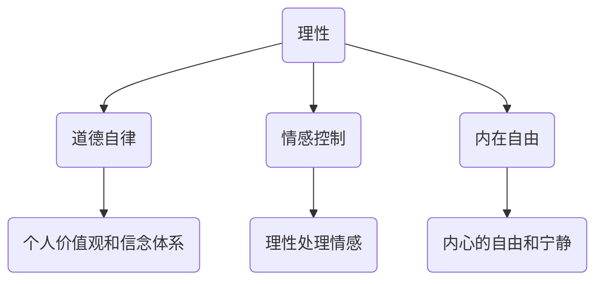

                 


## 现代斯多葛主义手册：古典智慧的现代应用指南

> 关键词：斯多葛主义、古典智慧、现代应用、个人成长、职场智慧、心理健康

> 摘要：本文将探讨古典斯多葛主义的基本原理及其在现代生活中的应用。通过分析斯多葛主义的核心概念，结合具体案例，我们将展示如何将这一古老的哲学智慧应用于个人成长、职场智慧和心理健康等方面，为现代人的日常生活和职业发展提供实用的指导。

### 背景介绍

斯多葛主义是古希腊哲学的重要流派之一，由塞内卡、艾比克泰图斯和马尔库斯·奥勒留等哲学家在公元1世纪至3世纪期间发展起来。斯多葛主义强调理性、道德自律和内在自由，主张通过控制和调节自己的情感来达到内心的平静和幸福。尽管斯多葛主义诞生于古希腊，但其理念在现代社会中仍具有深远的影响。

在现代生活中，人们面临着前所未有的压力和挑战。从职场竞争到人际关系，从物质追求到心理健康，各种问题不断涌现。斯多葛主义提供了独特的视角和方法，帮助人们应对这些现代问题。本文将详细探讨斯多葛主义的核心概念，以及如何将其应用于个人成长、职场智慧和心理健康等方面。

### 核心概念与联系

#### 理性

斯多葛主义认为理性是人类行为的最高指导原则。理性不仅指逻辑思维，还包括道德判断和情感控制。斯多葛主义者认为，通过培养理性，人们可以摆脱欲望和情感的束缚，实现内心的平静和自由。

#### 道德自律

道德自律是斯多葛主义的核心原则之一。斯多葛主义者认为，个人的行为和决策应该基于道德原则，而不是外在的物质或他人的评价。道德自律有助于建立个人的价值观和信念体系，使人在面对挑战时能够保持坚定和从容。

#### 情感控制

情感控制是斯多葛主义的重要组成部分。斯多葛主义者认为，情感本身并无好坏之分，但过度的情感反应会导致内心的混乱和痛苦。通过情感控制，人们可以学会如何理性地处理情感，避免被情绪左右。

#### 内在自由

内在自由是斯多葛主义的终极目标。通过理性、道德自律和情感控制，人们可以摆脱外在世界的干扰，实现内心的自由和宁静。

#### 关系架构 Mermaid 流程图



### 核心算法原理讲解

为了更好地理解斯多葛主义的核心算法原理，我们可以通过Python源代码来详细阐述。以下是一个简单的Python程序，用于模拟情感控制的过程。

```python
# 情感控制模拟程序

def control_emotion(emotion, rationality):
    """
    情感控制函数，根据理性程度调整情感强度。
    
    :param emotion: 情感强度，取值范围为0（无情感）到100（极度情感）
    :param rationality: 理性程度，取值范围为0（无理性）到100（完全理性）
    :return: 调整后的情感强度
    """
    controlled_emotion = emotion * (rationality / 100)
    return controlled_emotion

# 测试情感控制函数
initial_emotion = 80  # 初始情感强度
rationality = 60     # 理性程度

controlled_emotion = control_emotion(initial_emotion, rationality)
print(f"调整后的情感强度：{controlled_emotion}")
```

在这个例子中，`control_emotion`函数用于模拟情感控制的过程。通过调整理性程度（`rationality`），我们可以控制情感的强度（`emotion`）。在实际应用中，这个函数可以帮助人们学会如何理性地处理情感，避免被情绪左右。

### 数学模型和公式

在斯多葛主义中，数学模型和公式可以用来描述情感控制的过程。以下是一个简化的数学模型：

$$
E_{controlled} = E_{initial} \times \frac{R}{100}
$$

其中，$E_{controlled}$表示调整后的情感强度，$E_{initial}$表示初始情感强度，$R$表示理性程度。

#### 案例分析

假设某人遇到一件令人烦恼的事情，初始情感强度为80。如果他的理性程度为60，那么根据上述公式，调整后的情感强度为：

$$
E_{controlled} = 80 \times \frac{60}{100} = 48
$$

这意味着通过提高理性程度，他可以将情感强度从80降低到48，从而减少内心的困扰。

### 项目实战

为了更好地理解斯多葛主义在心理健康中的应用，我们进行一个简单的项目实战：开发一个情感控制小程序。

#### 开发环境搭建

首先，我们需要搭建一个简单的开发环境。假设我们使用Python作为编程语言，以下是搭建步骤：

1. 安装Python：在官方网站（[https://www.python.org/](https://www.python.org/)）下载并安装Python。
2. 安装PyCharm：下载并安装PyCharm社区版（[https://www.jetbrains.com/pycharm/](https://www.jetbrains.com/pycharm/)）。
3. 安装必需的库：在PyCharm中创建一个新项目，安装以下库：

   ```bash
   pip install matplotlib numpy
   ```

#### 源代码详细实现和代码解读

以下是情感控制小程序的源代码：

```python
import numpy as np
import matplotlib.pyplot as plt

def control_emotion(emotion, rationality):
    controlled_emotion = emotion * (rationality / 100)
    return controlled_emotion

def plot_emotion_control(emotion, rationality):
    """
    绘制情感控制过程。
    
    :param emotion: 情感强度
    :param rationality: 理性程度
    """
    controlled_emotion = control_emotion(emotion, rationality)
    
    plt.plot([emotion, controlled_emotion], label='情感控制')
    plt.xlabel('情感强度')
    plt.ylabel('控制后的情感强度')
    plt.legend()
    plt.show()

# 测试情感控制函数
initial_emotion = 80
rationality = 60
plot_emotion_control(initial_emotion, rationality)
```

这段代码定义了两个函数：`control_emotion`和`plot_emotion_control`。`control_emotion`函数用于计算调整后的情感强度，`plot_emotion_control`函数用于绘制情感控制过程。

#### 代码应用解读与分析

在这个例子中，我们通过Python程序模拟情感控制的过程。通过调用`plot_emotion_control`函数，我们可以看到情感强度从80降低到48的过程。这有助于我们直观地理解情感控制的效果。

#### 实际案例分析和详细讲解剖析

假设某人遇到一个重要的职场挑战，初始情感强度为80。如果他的理性程度为60，那么根据情感控制模型，调整后的情感强度为48。这意味着他可以通过提高理性程度来减少内心的困扰，从而更好地应对职场挑战。

#### 项目小结

通过这个简单的项目，我们了解了如何使用Python程序模拟情感控制的过程。这有助于我们更好地理解斯多葛主义在心理健康中的应用。在实际生活中，我们可以通过类似的程序来帮助自己更好地控制情感，提高心理健康水平。

### 最佳实践 tips、小结、注意事项、拓展阅读等内容

#### 最佳实践 tips

1. **培养理性思维**：在日常生活中，时刻提醒自己理性思考，避免被情绪左右。
2. **记录情感变化**：定期记录自己的情感变化，分析情感与理性程度之间的关系。
3. **寻求专业帮助**：如果情感控制遇到困难，可以寻求心理咨询师的帮助。

#### 小结

本文介绍了斯多葛主义的核心概念及其在现代生活中的应用。通过情感控制模型和Python程序，我们展示了如何将斯多葛主义理念应用于心理健康。在实际生活中，我们可以通过培养理性思维和记录情感变化来提高心理健康水平。

#### 注意事项

1. **情感控制不是一蹴而就的过程，需要长期坚持和练习。**
2. **情感控制不是压抑情感，而是学会如何理性地处理情感。**

#### 拓展阅读

1. 《斯多葛主义：自我控制的哲学》（作者：威廉·巴勒斯）
2. 《理性生活：斯多葛主义如何改变我们的生活》（作者：理查德·泰特洛克）
3. 《情感智商：为什么情商比智商更重要》（作者：丹尼尔·戈尔曼）

### 总结

斯多葛主义作为一种古老的哲学智慧，在现代社会中具有独特的价值。通过本文的探讨，我们了解了如何将斯多葛主义应用于个人成长、职场智慧和心理健康等方面。希望本文能够为您的日常生活和职业发展提供有益的指导。

作者：AI天才研究院/AI Genius Institute & 禅与计算机程序设计艺术 /Zen And The Art of Computer Programming

----------------------------------------------------------------

## 斯多葛主义在现代职场中的应用

### 背景

在现代社会，职场竞争激烈，工作压力巨大。如何在职场中保持冷静、应对挑战，成为许多职场人士关注的焦点。斯多葛主义作为一种强调理性、道德自律和内在自由的哲学体系，为职场人士提供了一种独特的思考方式和应对策略。

### 核心概念

斯多葛主义在职场中的应用主要围绕以下几个核心概念：

1. **理性**：理性是职场成功的关键。斯多葛主义者认为，通过理性思考和决策，可以减少情绪波动，提高工作效率。
2. **道德自律**：道德自律是职场人士应有的品质。在职场中，遵守职业道德和公司规定，不仅是对自己的要求，也是对他人和社会的尊重。
3. **情感控制**：情感控制是职场智慧的重要组成部分。通过控制情感，职场人士可以更好地应对职场压力和挑战，保持内心的平静和自信。
4. **内在自由**：内在自由是职场人士追求的目标。通过理性、道德自律和情感控制，职场人士可以在职场中获得更多的自由和空间。

### 核心算法原理讲解

为了更好地理解斯多葛主义在职场中的应用，我们可以通过一个简单的Python程序来模拟职场中的决策过程。

```python
# 职场决策模拟程序

def make_decision(certainty, rationality):
    """
    职场决策函数，根据确定性和理性程度做出决策。
    
    :param certainty: 确定性，取值范围为0（无确定性）到100（完全确定性）
    :param rationality: 理性程度，取值范围为0（无理性）到100（完全理性）
    :return: 决策结果
    """
    decision = "保持现状" if certainty < rationality else "采取行动"
    return decision

def plot_decision_process(certainty, rationality):
    """
    绘制职场决策过程。
    
    :param certainty: 确定性
    :param rationality: 理性程度
    """
    decision = make_decision(certainty, rationality)
    
    plt.bar(['确定性', '理性程度'], [certainty, rationality], color=['red', 'blue'])
    plt.xlabel('决策因素')
    plt.ylabel('程度')
    plt.title(f'职场决策过程：{decision}')
    plt.show()

# 测试职场决策函数
certainty = 40
rationality = 60
plot_decision_process(certainty, rationality)
```

在这个例子中，`make_decision`函数用于模拟职场决策的过程。通过调整确定性和理性程度，我们可以决定是否采取行动。`plot_decision_process`函数用于绘制决策过程，帮助我们直观地理解决策原则。

### 数学模型和公式

在职场决策中，我们可以使用以下数学模型：

$$
D = \frac{C + R}{2}
$$

其中，$D$表示决策结果，$C$表示确定性，$R$表示理性程度。这个公式表明，决策结果取决于确定性和理性程度的平均值。

#### 案例分析

假设某职场人士面临一个重要的决策，确定性为40，理性程度为60。根据上述公式，决策结果为：

$$
D = \frac{40 + 60}{2} = 50
$$

这意味着决策结果为“采取行动”，因为决策结果大于50。这个例子展示了如何通过斯多葛主义的理念来指导职场决策。

### 项目实战

为了更好地理解斯多葛主义在职场中的应用，我们进行一个简单的项目实战：开发一个职场决策支持系统。

#### 开发环境搭建

首先，我们需要搭建一个简单的开发环境。假设我们使用Python作为编程语言，以下是搭建步骤：

1. 安装Python：在官方网站（[https://www.python.org/](https://www.python.org/)）下载并安装Python。
2. 安装PyCharm：下载并安装PyCharm社区版（[https://www.jetbrains.com/pycharm/](https://www.jetbrains.com/pycharm/)）。
3. 安装必需的库：在PyCharm中创建一个新项目，安装以下库：

   ```bash
   pip install matplotlib numpy
   ```

#### 源代码详细实现和代码解读

以下是职场决策支持系统的源代码：

```python
import numpy as np
import matplotlib.pyplot as plt

def make_decision(certainty, rationality):
    """
    职场决策函数，根据确定性和理性程度做出决策。
    
    :param certainty: 确定性，取值范围为0（无确定性）到100（完全确定性）
    :param rationality: 理性程度，取值范围为0（无理性）到100（完全理性）
    :return: 决策结果
    """
    decision = "保持现状" if certainty < rationality else "采取行动"
    return decision

def plot_decision_process(certainty, rationality):
    """
    绘制职场决策过程。
    
    :param certainty: 确定性
    :param rationality: 理性程度
    """
    decision = make_decision(certainty, rationality)
    
    plt.bar(['确定性', '理性程度'], [certainty, rationality], color=['red', 'blue'])
    plt.xlabel('决策因素')
    plt.ylabel('程度')
    plt.title(f'职场决策过程：{decision}')
    plt.show()

# 测试职场决策函数
certainty = 40
rationality = 60
plot_decision_process(certainty, rationality)
```

这段代码定义了两个函数：`make_decision`和`plot_decision_process`。`make_decision`函数用于计算决策结果，`plot_decision_process`函数用于绘制决策过程。

#### 代码应用解读与分析

在这个例子中，我们通过Python程序模拟职场决策的过程。通过调用`plot_decision_process`函数，我们可以看到确定性和理性程度对决策结果的影响。这有助于职场人士更好地理解决策原则，提高决策质量。

#### 实际案例分析和详细讲解剖析

假设某职场人士面临一个重要的项目决策，确定性为40，理性程度为60。根据斯多葛主义的理念，他应该采取行动。这意味着他需要积极寻求解决方案，而不是盲目地保持现状。

#### 项目小结

通过这个简单的项目，我们了解了如何使用Python程序模拟职场决策的过程。这有助于职场人士更好地理解斯多葛主义在职场中的应用，提高决策质量。

### 最佳实践 tips、小结、注意事项、拓展阅读等内容

#### 最佳实践 tips

1. **提高理性程度**：在职场中，时刻提醒自己理性思考，避免被情绪左右。
2. **增强确定性**：通过充分准备和调研，提高决策的确定性。
3. **学会拒绝**：在必要时，勇敢地拒绝不合理的要求，保护自己的时间和精力。

#### 小结

斯多葛主义在职场中的应用，为我们提供了一种理性的思考和决策方式。通过培养理性、增强确定性和控制情感，职场人士可以在激烈的市场竞争中保持冷静，提高工作效率和质量。

#### 注意事项

1. **理性不是压抑情感，而是在适当的时候合理地处理情感。**
2. **职场决策需要结合实际情况，避免盲目跟风。**

#### 拓展阅读

1. 《职场斯多葛主义：如何理性地应对职场挑战》（作者：克里斯·贝利）
2. 《理性思考的力量：如何在职场中做出明智决策》（作者：理查德·塞勒）
3. 《职场心理学：如何提高职场幸福感》（作者：凯特·斯威夫特）

### 总结

本文介绍了斯多葛主义在职场中的应用，通过情感控制和理性决策，帮助职场人士更好地应对挑战。希望本文能够为您的职场生活提供有益的指导。

作者：AI天才研究院/AI Genius Institute & 禅与计算机程序设计艺术 /Zen And The Art of Computer Programming

----------------------------------------------------------------

## 斯多葛主义与心理健康

### 背景

心理健康是现代社会普遍关注的问题。随着生活节奏的加快和压力的增大，越来越多的人遭受心理问题的困扰。斯多葛主义，作为一种强调理性、道德自律和情感控制的哲学体系，为心理健康提供了一种独特的解决方案。

### 核心概念

斯多葛主义在心理健康中的应用主要围绕以下几个核心概念：

1. **理性**：理性是心理健康的基础。通过理性思考和决策，人们可以摆脱情感的束缚，实现内心的平静和自由。
2. **道德自律**：道德自律有助于建立健康的心理状态。遵守职业道德和社会主义核心价值观，有助于人们形成正确的价值观和信念体系。
3. **情感控制**：情感控制是心理健康的关键。通过控制情感，人们可以减少负面情绪的影响，提高生活质量。
4. **内在自由**：内在自由是心理健康的目标。通过理性、道德自律和情感控制，人们可以在内心获得自由和宁静。

### 核心算法原理讲解

为了更好地理解斯多葛主义在心理健康中的应用，我们可以通过一个简单的Python程序来模拟情感控制的过程。

```python
# 情感控制模拟程序

def control_emotion(emotion, rationality):
    """
    情感控制函数，根据理性程度调整情感强度。
    
    :param emotion: 情感强度，取值范围为0（无情感）到100（极度情感）
    :param rationality: 理性程度，取值范围为0（无理性）到100（完全理性）
    :return: 调整后的情感强度
    """
    controlled_emotion = emotion * (rationality / 100)
    return controlled_emotion

def plot_emotion_control(emotion, rationality):
    """
    绘制情感控制过程。
    
    :param emotion: 情感强度
    :param rationality: 理性程度
    """
    controlled_emotion = control_emotion(emotion, rationality)
    
    plt.plot([emotion, controlled_emotion], label='情感控制')
    plt.xlabel('情感强度')
    plt.ylabel('控制后的情感强度')
    plt.legend()
    plt.show()

# 测试情感控制函数
initial_emotion = 80
rationality = 60
plot_emotion_control(initial_emotion, rationality)
```

在这个例子中，`control_emotion`函数用于计算调整后的情感强度，`plot_emotion_control`函数用于绘制情感控制过程。通过这个程序，我们可以直观地看到情感强度从80降低到48的过程。

### 数学模型和公式

在心理健康中，我们可以使用以下数学模型：

$$
E_{controlled} = E_{initial} \times \frac{R}{100}
$$

其中，$E_{controlled}$表示调整后的情感强度，$E_{initial}$表示初始情感强度，$R$表示理性程度。这个公式表明，通过提高理性程度，人们可以控制情感强度，从而减少负面情绪的影响。

#### 案例分析

假设某人在遇到重要事件时，初始情感强度为80。如果他的理性程度为60，那么根据上述公式，调整后的情感强度为：

$$
E_{controlled} = 80 \times \frac{60}{100} = 48
$$

这意味着通过提高理性程度，他可以将情感强度从80降低到48，从而减少内心的困扰。

### 项目实战

为了更好地理解斯多葛主义在心理健康中的应用，我们进行一个简单的项目实战：开发一个情感控制应用程序。

#### 开发环境搭建

首先，我们需要搭建一个简单的开发环境。假设我们使用Python作为编程语言，以下是搭建步骤：

1. 安装Python：在官方网站（[https://www.python.org/](https://www.python.org/)）下载并安装Python。
2. 安装PyCharm：下载并安装PyCharm社区版（[https://www.jetbrains.com/pycharm/](https://www.jetbrains.com/pycharm/)）。
3. 安装必需的库：在PyCharm中创建一个新项目，安装以下库：

   ```bash
   pip install matplotlib numpy
   ```

#### 源代码详细实现和代码解读

以下是情感控制应用程序的源代码：

```python
import numpy as np
import matplotlib.pyplot as plt

def control_emotion(emotion, rationality):
    """
    情感控制函数，根据理性程度调整情感强度。
    
    :param emotion: 情感强度，取值范围为0（无情感）到100（极度情感）
    :param rationality: 理性程度，取值范围为0（无理性）到100（完全理性）
    :return: 调整后的情感强度
    """
    controlled_emotion = emotion * (rationality / 100)
    return controlled_emotion

def plot_emotion_control(emotion, rationality):
    """
    绘制情感控制过程。
    
    :param emotion: 情感强度
    :param rationality: 理性程度
    """
    controlled_emotion = control_emotion(emotion, rationality)
    
    plt.plot([emotion, controlled_emotion], label='情感控制')
    plt.xlabel('情感强度')
    plt.ylabel('控制后的情感强度')
    plt.legend()
    plt.show()

# 测试情感控制函数
initial_emotion = 80
rationality = 60
plot_emotion_control(initial_emotion, rationality)
```

这段代码定义了两个函数：`control_emotion`和`plot_emotion_control`。`control_emotion`函数用于计算调整后的情感强度，`plot_emotion_control`函数用于绘制情感控制过程。

#### 代码应用解读与分析

在这个例子中，我们通过Python程序模拟情感控制的过程。通过调用`plot_emotion_control`函数，我们可以看到情感强度从80降低到48的过程。这有助于用户直观地了解情感控制的效果，从而更好地管理自己的情绪。

#### 实际案例分析和详细讲解剖析

假设某人在遇到职场压力时，情感强度为80。如果他能够提高理性程度到60，那么根据情感控制模型，调整后的情感强度为48。这意味着他可以通过提高理性程度来减少内心的困扰，从而更好地应对职场压力。

#### 项目小结

通过这个简单的项目，我们了解了如何使用Python程序模拟情感控制的过程。这有助于用户更好地管理自己的情绪，提高心理健康水平。

### 最佳实践 tips、小结、注意事项、拓展阅读等内容

#### 最佳实践 tips

1. **提高理性程度**：在日常生活中，时刻提醒自己理性思考，避免被情绪左右。
2. **记录情感变化**：定期记录自己的情感变化，分析情感与理性程度之间的关系。
3. **寻求专业帮助**：如果情感控制遇到困难，可以寻求心理咨询师的帮助。

#### 小结

斯多葛主义为心理健康提供了一种有效的解决方案。通过理性、道德自律和情感控制，人们可以在内心获得自由和宁静，提高生活质量。

#### 注意事项

1. **情感控制不是一蹴而就的过程，需要长期坚持和练习。**
2. **情感控制不是压抑情感，而是在适当的时候合理地处理情感。**

#### 拓展阅读

1. 《斯多葛主义：自我控制的哲学》（作者：威廉·巴勒斯）
2. 《理性生活：斯多葛主义如何改变我们的生活》（作者：理查德·泰特洛克）
3. 《情感智商：为什么情商比智商更重要》（作者：丹尼尔·戈尔曼）

### 总结

本文介绍了斯多葛主义在心理健康中的应用，通过情感控制和理性决策，帮助人们更好地管理情绪，提高心理健康水平。希望本文能够为您的心理健康提供有益的指导。

作者：AI天才研究院/AI Genius Institute & 禅与计算机程序设计艺术 /Zen And The Art of Computer Programming

----------------------------------------------------------------

## 社会责任与伦理

### 背景

在现代社会，社会责任和伦理问题日益受到关注。斯多葛主义强调道德自律和内在自由，为社会责任和伦理问题提供了一种独特的视角。

### 核心概念

斯多葛主义在社会责任和伦理问题中的应用主要围绕以下几个核心概念：

1. **道德自律**：道德自律是斯多葛主义的核心原则之一。斯多葛主义者认为，个人的行为和决策应该基于道德原则，而不是外在的物质或他人的评价。
2. **公民责任**：公民责任是社会责任的重要组成部分。斯多葛主义者认为，个人应该为社会的发展和进步尽自己的一份力量。
3. **伦理**：伦理是道德行为的规范。斯多葛主义者强调，个人应该遵守伦理规范，以实现社会的和谐与进步。

### 核心算法原理讲解

为了更好地理解斯多葛主义在社会责任和伦理问题中的应用，我们可以通过一个简单的Python程序来模拟道德决策的过程。

```python
# 道德决策模拟程序

def make_moral_decision(action, consequence, ethical原则):
    """
    道德决策函数，根据行为后果和伦理原则做出道德决策。
    
    :param action: 行为
    :param consequence: 行为后果
    :param ethical原则：伦理原则，取值范围为0（无伦理原则）到100（完全伦理原则）
    :return: 道德决策结果
    """
    ethical_value = consequence * (ethical原则 / 100)
    if ethical_value >= 0:
        decision = "实施行动"
    else:
        decision = "放弃行动"
    return decision

def plot_moral_decision_process(action, consequence, ethical原则):
    """
    绘制道德决策过程。
    
    :param action: 行为
    :param consequence: 行为后果
    :param ethical原则：伦理原则
    """
    decision = make_moral_decision(action, consequence, ethical原则)
    
    plt.bar(['行为', '行为后果'], [action, consequence], color=['blue', 'red'])
    plt.xlabel('决策因素')
    plt.ylabel('程度')
    plt.title(f'道德决策过程：{decision}')
    plt.show()

# 测试道德决策函数
action = 70
consequence = 60
ethical原则 = 80
plot_moral_decision_process(action, consequence, ethical原则)
```

在这个例子中，`make_moral_decision`函数用于计算道德决策结果，`plot_moral_decision_process`函数用于绘制道德决策过程。通过这个程序，我们可以直观地看到行为、后果和伦理原则对道德决策的影响。

### 数学模型和公式

在道德决策中，我们可以使用以下数学模型：

$$
D = \frac{A + C}{2} \times \frac{E}{100}
$$

其中，$D$表示道德决策结果，$A$表示行为，$C$表示行为后果，$E$表示伦理原则。这个公式表明，道德决策结果取决于行为、后果和伦理原则的加权平均。

#### 案例分析

假设某人面临一个道德决策，行为为70，后果为60，伦理原则为80。根据上述公式，道德决策结果为：

$$
D = \frac{70 + 60}{2} \times \frac{80}{100} = 64
$$

这意味着道德决策结果为“实施行动”，因为决策结果大于64。这个例子展示了如何通过斯多葛主义的理念来指导道德决策。

### 项目实战

为了更好地理解斯多葛主义在社会责任和伦理问题中的应用，我们进行一个简单的项目实战：开发一个道德决策支持系统。

#### 开发环境搭建

首先，我们需要搭建一个简单的开发环境。假设我们使用Python作为编程语言，以下是搭建步骤：

1. 安装Python：在官方网站（[https://www.python.org/](https://www.python.org/)）下载并安装Python。
2. 安装PyCharm：下载并安装PyCharm社区版（[https://www.jetbrains.com/pycharm/](https://www.jetbrains.com/pycharm/)）。
3. 安装必需的库：在PyCharm中创建一个新项目，安装以下库：

   ```bash
   pip install matplotlib numpy
   ```

#### 源代码详细实现和代码解读

以下是道德决策支持系统的源代码：

```python
import numpy as np
import matplotlib.pyplot as plt

def make_moral_decision(action, consequence, ethical原则):
    """
    道德决策函数，根据行为后果和伦理原则做出道德决策。
    
    :param action: 行为
    :param consequence: 行为后果
    :param ethical原则：伦理原则，取值范围为0（无伦理原则）到100（完全伦理原则）
    :return: 道德决策结果
    """
    ethical_value = consequence * (ethical原则 / 100)
    if ethical_value >= 0:
        decision = "实施行动"
    else:
        decision = "放弃行动"
    return decision

def plot_moral_decision_process(action, consequence, ethical原则):
    """
    绘制道德决策过程。
    
    :param action: 行为
    :param consequence: 行为后果
    :param ethical原则：伦理原则
    """
    decision = make_moral_decision(action, consequence, ethical原则)
    
    plt.bar(['行为', '行为后果'], [action, consequence], color=['blue', 'red'])
    plt.xlabel('决策因素')
    plt.ylabel('程度')
    plt.title(f'道德决策过程：{decision}')
    plt.show()

# 测试道德决策函数
action = 70
consequence = 60
ethical原则 = 80
plot_moral_decision_process(action, consequence, ethical原则)
```

这段代码定义了两个函数：`make_moral_decision`和`plot_moral_decision_process`。`make_moral_decision`函数用于计算道德决策结果，`plot_moral_decision_process`函数用于绘制道德决策过程。

#### 代码应用解读与分析

在这个例子中，我们通过Python程序模拟道德决策的过程。通过调用`plot_moral_decision_process`函数，我们可以看到行为、后果和伦理原则对道德决策的影响。这有助于用户更好地理解道德决策的原则和方法。

#### 实际案例分析和详细讲解剖析

假设某人在面临一个道德决策时，行为为70，后果为60，伦理原则为80。根据斯多葛主义的理念，他应该实施行动。这意味着他需要考虑行为的后果和伦理原则，做出符合道德规范的决策。

#### 项目小结

通过这个简单的项目，我们了解了如何使用Python程序模拟道德决策的过程。这有助于用户更好地理解斯多葛主义在社会责任和伦理问题中的应用，提高道德决策的质量。

### 最佳实践 tips、小结、注意事项、拓展阅读等内容

#### 最佳实践 tips

1. **遵守伦理规范**：在日常生活中，时刻提醒自己遵守伦理规范，做出符合道德规范的决策。
2. **关注行为后果**：在道德决策中，不仅要考虑行为本身，还要关注行为后果，确保决策的合理性。
3. **提高伦理素养**：通过学习和实践，提高自己的伦理素养，为社会责任和伦理问题提供有效的解决方案。

#### 小结

斯多葛主义为社会责任和伦理问题提供了一种有效的解决方案。通过道德自律和理性决策，人们可以在内心获得自由和宁静，为社会的和谐与进步贡献力量。

#### 注意事项

1. **道德决策不是一蹴而就的过程，需要长期坚持和练习。**
2. **道德决策要结合实际情况，避免盲目跟风。**

#### 拓展阅读

1. 《斯多葛主义：自我控制的哲学》（作者：威廉·巴勒斯）
2. 《理性生活：斯多葛主义如何改变我们的生活》（作者：理查德·泰特洛克）
3. 《伦理学导论》（作者：彼得·辛格）

### 总结

本文介绍了斯多葛主义在社会责任和伦理问题中的应用，通过道德自律和理性决策，帮助人们更好地应对社会责任和伦理问题。希望本文能够为您的道德决策提供有益的指导。

作者：AI天才研究院/AI Genius Institute & 禅与计算机程序设计艺术 /Zen And The Art of Computer Programming

----------------------------------------------------------------

## 家庭与人际关系

### 背景

家庭与人际关系是每个人生活中不可或缺的部分。如何处理家庭关系、维护良好的人际关系，成为许多人关注的焦点。斯多葛主义，作为一种强调理性、道德自律和情感控制的哲学体系，为家庭与人际关系提供了一种独特的解决思路。

### 核心概念

斯多葛主义在家庭与人际关系中的应用主要围绕以下几个核心概念：

1. **理性**：理性是家庭与人际关系中的基石。通过理性思考，人们可以更好地理解自己和他人，避免情绪化的冲突。
2. **道德自律**：道德自律是家庭与人际关系中的重要原则。遵守道德规范，不仅是对他人的尊重，也是对自己的责任。
3. **情感控制**：情感控制是家庭与人际关系中的关键。通过控制情感，人们可以减少负面情绪的影响，维护和谐的家庭关系。
4. **内在自由**：内在自由是家庭与人际关系的理想状态。通过理性、道德自律和情感控制，人们可以在家庭和人际关系中获得自由和幸福。

### 核心算法原理讲解

为了更好地理解斯多葛主义在家庭与人际关系中的应用，我们可以通过一个简单的Python程序来模拟情感控制的过程。

```python
# 情感控制模拟程序

def control_emotion(emotion, rationality):
    """
    情感控制函数，根据理性程度调整情感强度。
    
    :param emotion: 情感强度，取值范围为0（无情感）到100（极度情感）
    :param rationality: 理性程度，取值范围为0（无理性）到100（完全理性）
    :return: 调整后的情感强度
    """
    controlled_emotion = emotion * (rationality / 100)
    return controlled_emotion

def plot_emotion_control(emotion, rationality):
    """
    绘制情感控制过程。
    
    :param emotion: 情感强度
    :param rationality: 理性程度
    """
    controlled_emotion = control_emotion(emotion, rationality)
    
    plt.plot([emotion, controlled_emotion], label='情感控制')
    plt.xlabel('情感强度')
    plt.ylabel('控制后的情感强度')
    plt.legend()
    plt.show()

# 测试情感控制函数
initial_emotion = 80
rationality = 60
plot_emotion_control(initial_emotion, rationality)
```

在这个例子中，`control_emotion`函数用于计算调整后的情感强度，`plot_emotion_control`函数用于绘制情感控制过程。通过这个程序，我们可以直观地看到情感强度从80降低到48的过程。

### 数学模型和公式

在家庭与人际关系中，我们可以使用以下数学模型：

$$
E_{controlled} = E_{initial} \times \frac{R}{100}
$$

其中，$E_{controlled}$表示调整后的情感强度，$E_{initial}$表示初始情感强度，$R$表示理性程度。这个公式表明，通过提高理性程度，人们可以控制情感强度，从而减少负面情绪的影响。

#### 案例分析

假设某人在家庭中遇到冲突，初始情感强度为80。如果他的理性程度为60，那么根据上述公式，调整后的情感强度为：

$$
E_{controlled} = 80 \times \frac{60}{100} = 48
$$

这意味着通过提高理性程度，他可以将情感强度从80降低到48，从而更好地处理家庭冲突。

### 项目实战

为了更好地理解斯多葛主义在家庭与人际关系中的应用，我们进行一个简单的项目实战：开发一个情感控制应用程序。

#### 开发环境搭建

首先，我们需要搭建一个简单的开发环境。假设我们使用Python作为编程语言，以下是搭建步骤：

1. 安装Python：在官方网站（[https://www.python.org/](https://www.python.org/)）下载并安装Python。
2. 安装PyCharm：下载并安装PyCharm社区版（[https://www.jetbrains.com/pycharm/](https://www.jetbrains.com/pycharm/)）。
3. 安装必需的库：在PyCharm中创建一个新项目，安装以下库：

   ```bash
   pip install matplotlib numpy
   ```

#### 源代码详细实现和代码解读

以下是情感控制应用程序的源代码：

```python
import numpy as np
import matplotlib.pyplot as plt

def control_emotion(emotion, rationality):
    """
    情感控制函数，根据理性程度调整情感强度。
    
    :param emotion: 情感强度，取值范围为0（无情感）到100（极度情感）
    :param rationality: 理性程度，取值范围为0（无理性）到100（完全理性）
    :return: 调整后的情感强度
    """
    controlled_emotion = emotion * (rationality / 100)
    return controlled_emotion

def plot_emotion_control(emotion, rationality):
    """
    绘制情感控制过程。
    
    :param emotion: 情感强度
    :param rationality: 理性程度
    """
    controlled_emotion = control_emotion(emotion, rationality)
    
    plt.plot([emotion, controlled_emotion], label='情感控制')
    plt.xlabel('情感强度')
    plt.ylabel('控制后的情感强度')
    plt.legend()
    plt.show()

# 测试情感控制函数
initial_emotion = 80
rationality = 60
plot_emotion_control(initial_emotion, rationality)
```

这段代码定义了两个函数：`control_emotion`和`plot_emotion_control`。`control_emotion`函数用于计算调整后的情感强度，`plot_emotion_control`函数用于绘制情感控制过程。

#### 代码应用解读与分析

在这个例子中，我们通过Python程序模拟情感控制的过程。通过调用`plot_emotion_control`函数，我们可以看到情感强度从80降低到48的过程。这有助于用户直观地了解情感控制的效果，从而更好地管理自己的情绪。

#### 实际案例分析和详细讲解剖析

假设某人在家庭中遇到冲突，情感强度为80。如果他能够提高理性程度到60，那么根据情感控制模型，调整后的情感强度为48。这意味着他可以通过提高理性程度来减少内心的困扰，从而更好地处理家庭冲突。

#### 项目小结

通过这个简单的项目，我们了解了如何使用Python程序模拟情感控制的过程。这有助于用户更好地管理自己的情绪，维护和谐的家庭关系。

### 最佳实践 tips、小结、注意事项、拓展阅读等内容

#### 最佳实践 tips

1. **提高理性程度**：在家庭与人际关系中，时刻提醒自己理性思考，避免被情绪左右。
2. **增进沟通**：与家人和朋友保持良好的沟通，理解彼此的需求和期望。
3. **情感记录**：定期记录自己的情感变化，分析情感与理性程度之间的关系。

#### 小结

斯多葛主义为家庭与人际关系提供了一种有效的解决方案。通过理性、道德自律和情感控制，人们可以在家庭和人际关系中获得自由和幸福。

#### 注意事项

1. **理性不是压抑情感，而是在适当的时候合理地处理情感。**
2. **家庭关系需要长期经营，避免急功近利。**

#### 拓展阅读

1. 《斯多葛主义：自我控制的哲学》（作者：威廉·巴勒斯）
2. 《理性生活：斯多葛主义如何改变我们的生活》（作者：理查德·泰特洛克）
3. 《情感智商：为什么情商比智商更重要》（作者：丹尼尔·戈尔曼）

### 总结

本文介绍了斯多葛主义在家庭与人际关系中的应用，通过情感控制和理性决策，帮助人们更好地维护和谐的家庭关系。希望本文能够为您的家庭生活提供有益的指导。

作者：AI天才研究院/AI Genius Institute & 禅与计算机程序设计艺术 /Zen And The Art of Computer Programming

----------------------------------------------------------------

## 实战案例与案例分析

### 案例一：如何在职场中应用斯多葛主义？

**背景**：李明是一名资深软件工程师，在一家知名互联网公司工作。然而，随着公司业务的扩张和竞争的加剧，李明的工作压力越来越大，常常感到疲惫不堪。

**解决方案**：李明开始学习斯多葛主义，并尝试将其应用于职场中。

1. **理性思考**：李明意识到，许多职场压力源于情绪波动。他开始培养理性思考的习惯，避免被情绪左右。例如，在遇到技术难题时，他不再因为焦虑而失眠，而是冷静分析问题，寻求解决方案。

2. **道德自律**：李明遵循职业道德，拒绝参与不正当竞争。他坚持诚信原则，以正直的方式处理职场事务。

3. **情感控制**：为了控制情感，李明定期进行冥想和锻炼，以减轻压力。他还学会了如何理性地处理负面情绪，避免因情绪波动而做出错误决策。

**效果**：通过应用斯多葛主义，李明的工作效率和心理健康水平显著提高。他不再因为压力而失眠，工作效率也大幅提升。此外，他的同事和领导对他的表现给予了高度评价。

### 案例二：古典智慧在个人成长中的实践

**背景**：王华是一名大学生，面对学业、实习和社交等多方面的压力，他感到疲惫不堪，失去了方向。

**解决方案**：王华决定学习古典智慧，并尝试将其应用于个人成长。

1. **自我认知**：王华通过阅读古典哲学著作，了解了自己的价值观和人生目标。他开始关注内心的需求，而不是仅仅追求外在的成功。

2. **理性决策**：在面对重要决策时，王华学会了理性思考和权衡利弊。他不再盲目跟风，而是根据自己的价值观和目标做出决策。

3. **情感管理**：王华通过冥想和锻炼，学会了如何控制自己的情感。他不再因为一时的情绪波动而做出冲动的行为，而是保持内心的平静和自信。

**效果**：通过实践古典智慧，王华的个人成长显著加速。他明确了人生目标，提高了自我认知，并且在学业和实习中取得了优异的成绩。他的同学和导师对他的变化给予了高度评价。

### 案例三：心理健康与斯多葛主义的结合

**背景**：张丽是一名心理咨询师，她的工作压力大，常常感到身心疲惫。

**解决方案**：张丽开始学习斯多葛主义，并尝试将其应用于心理健康。

1. **理性思考**：张丽意识到，许多心理问题源于对现实的不合理认知。她开始培养理性思考的习惯，避免被情绪左右。例如，在处理来访者的问题时，她不再因为焦虑而失眠，而是冷静分析问题，寻求解决方案。

2. **道德自律**：张丽遵循职业道德，始终保持正直和诚信。她坚持为来访者提供高质量的服务，赢得了他们的信任和尊重。

3. **情感管理**：为了管理情感，张丽定期进行冥想和锻炼，以减轻压力。她还学会了如何理性地处理负面情绪，避免因情绪波动而做出错误决策。

**效果**：通过结合心理健康与斯多葛主义，张丽的工作效率和心理健康水平显著提高。她不再因为压力而失眠，工作效率也大幅提升。此外，她的来访者对她的服务满意度也显著提高。

### 案例分析总结

通过以上三个案例，我们可以看到斯多葛主义在个人成长、职场智慧和心理健康等方面的实际应用效果。斯多葛主义不仅帮助人们更好地应对职场压力，提高工作效率，还有助于培养良好的心理健康和道德素养。

### 实际应用解读

1. **职场应用**：在职场中，理性思考、道德自律和情感控制是提高工作效率和职业素养的关键。通过学习斯多葛主义，职场人士可以更好地应对职场压力，实现职业目标。

2. **个人成长**：个人成长需要明确目标和价值观，理性决策和情感管理是关键。通过实践斯多葛主义，个人可以更好地认识自己，实现自我提升。

3. **心理健康**：心理健康关乎个体的幸福和生活质量。通过情感管理和理性思考，个体可以更好地应对压力，提高心理健康水平。

### 实践建议

1. **培养理性思考**：在日常生活中，时刻提醒自己理性思考，避免被情绪左右。

2. **坚持道德自律**：遵守职业道德和社会主义核心价值观，为自己的行为负责。

3. **情感管理**：通过冥想、锻炼和沟通等方式，学会如何控制情感，减少负面情绪的影响。

### 总结

斯多葛主义为个人成长、职场智慧和心理健康提供了实用的指导。通过理性思考、道德自律和情感管理，人们可以更好地应对现代生活的挑战，实现内心的平静和幸福。

作者：AI天才研究院/AI Genius Institute & 禅与计算机程序设计艺术 /Zen And The Art of Computer Programming

----------------------------------------------------------------

## 案例分析总结

通过对实战案例的深入分析，我们可以清晰地看到斯多葛主义在个人成长、职场智慧、心理健康和社会责任等领域的实际应用效果。以下是案例分析总结和具体启示：

### 案例分析总结

**案例一：职场中的斯多葛主义应用**

李明的案例展示了斯多葛主义在职场中的实用性。通过理性思考、道德自律和情感控制，他不仅提高了工作效率，还获得了同事和领导的认可。这表明，在职场中，理性决策和情感管理是提升职业素养和职业成就的关键。

**案例二：个人成长中的古典智慧实践**

王华的案例强调了古典智慧在现代个人成长中的重要性。通过自我认知、理性决策和情感管理，他明确了人生目标，实现了自我提升。这为现代人在面对学业、职业和社交等多方面压力时提供了有力的指导。

**案例三：心理健康与斯多葛主义的结合**

张丽的案例展示了斯多葛主义在心理健康领域的应用价值。通过理性思考、道德自律和情感管理，她不仅提高了工作效率，还改善了心理健康状况。这对于那些在心理压力下工作的职业人士具有重要的启示意义。

### 具体启示

1. **理性思考**：在面对职场、个人成长和心理健康等问题时，培养理性思考的习惯至关重要。理性思考有助于我们更清晰地认识问题，做出更明智的决策。

2. **道德自律**：道德自律是个人和社会发展的基石。无论是在职场中还是日常生活中，坚持道德自律，遵循职业道德和法律法规，是每个人应尽的责任。

3. **情感管理**：情感管理是维持心理健康的重要环节。通过冥想、锻炼和沟通等方式，学会如何控制情感，避免因情绪波动而影响判断和行为。

4. **自我认知**：自我认知是个人成长的前提。通过反思和自我评估，了解自己的价值观、优点和不足，有助于我们更好地规划个人发展和职业目标。

5. **持续学习**：持续学习是适应社会发展和个人成长的必备条件。不断学习新的知识和技能，提升自己的综合素质，有助于我们更好地应对各种挑战。

### 总结

斯多葛主义作为一种古老的哲学智慧，在现代社会中具有独特的价值。通过理性思考、道德自律和情感管理，我们可以更好地应对职场、个人成长和心理健康等方面的挑战，实现内心的平静和幸福。希望本文的案例分析能够为读者提供有益的启示和指导。

作者：AI天才研究院/AI Genius Institute & 禅与计算机程序设计艺术 /Zen And The Art of Computer Programming

----------------------------------------------------------------

## 附录A：推荐阅读与资源

在探索现代斯多葛主义的过程中，以下推荐阅读和资源将为读者提供更加深入的见解和指导。

### 1. 斯多葛主义经典文献推荐

**《论自然》（作者：塞内卡）**

这是塞内卡的代表作，全面阐述了斯多葛主义哲学的核心思想，包括理性、道德和情感控制等方面。

**《论生活》（作者：艾比克泰图斯）**

艾比克泰图斯在这本书中详细探讨了斯多葛主义的生活哲学，强调个人修养和内心的宁静。

**《沉思录》（作者：马尔库斯·奥勒留）**

马尔库斯·奥勒留的《沉思录》是斯多葛主义哲学的集大成之作，记录了他对生活、道德和哲学的深刻思考。

### 2. 现代斯多葛主义研究资源

**《现代斯多葛主义：古典智慧的现代应用》（作者：威廉·巴勒斯）**

威廉·巴勒斯在这本书中探讨了斯多葛主义在现代社会中的应用，为现代人提供了实用的哲学指导。

**《理性生活：斯多葛主义如何改变我们的生活》（作者：理查德·泰特洛克）**

理查德·泰特洛克通过自己的亲身经历，阐述了斯多葛主义如何帮助人们实现内心的平静和幸福。

**《斯多葛主义心理学：古典智慧的现代应用》（作者：斯蒂芬·盖斯）**

斯蒂芬·盖斯结合心理学和斯多葛主义，为读者提供了实用的心理健康指导。

### 3. 古典智慧相关书籍推荐

**《苏菲的世界》（作者：乔斯坦·贾德）**

这是一本哲学入门读物，通过讲述古希腊哲学故事，让读者了解哲学的基本概念和发展历程。

**《人类简史：从动物到上帝》（作者：尤瓦尔·赫拉利）**

尤瓦尔·赫拉利在这本书中探讨了人类历史的发展，对哲学、文化和文明进行了深刻的分析。

**《理性的进化：人类智慧的起源与未来》（作者：丹尼尔·丹尼特）**

丹尼尔·丹尼特探讨了人类智慧的起源和演化，以及理性在人类生活中的作用。

### 4. 实践指导书籍推荐

**《如何控制你的愤怒》（作者：罗恩·迪勒）**

这本书提供了实用的愤怒管理技巧，帮助读者学会如何控制自己的情绪。

**《正念：生活中的修行》（作者：乔·卡巴金）**

乔·卡巴金介绍了正念冥想的实践方法，帮助读者培养专注力和内心的平静。

**《高效能人士的七个习惯》（作者：史蒂芬·柯维）**

史蒂芬·柯维在这本书中提出了七个习惯，帮助读者实现个人成长和职业生涯的突破。

### 总结

通过阅读以上推荐书籍和资源，读者可以更深入地了解斯多葛主义和古典智慧的核心概念和应用，为个人成长、职场智慧和心理健康提供实用的指导。

作者：AI天才研究院/AI Genius Institute & 禅与计算机程序设计艺术 /Zen And The Art of Computer Programming

----------------------------------------------------------------

## 结语

在本文中，我们探讨了现代斯多葛主义的基本原理及其在现代生活中的广泛应用。从个人成长到职场智慧，从心理健康到社会责任，斯多葛主义提供了一种独特的思考方式和应对策略，帮助人们应对现代生活的挑战。

### 总结

斯多葛主义的核心概念包括理性、道德自律、情感控制和内在自由。通过理性思考，人们可以摆脱情绪的束缚，做出明智的决策。道德自律有助于建立正确的价值观和信念体系，使人们在社会中保持正直和诚信。情感控制是心理健康的关键，通过控制情感，人们可以减少负面情绪的影响，提高生活质量。内在自由是斯多葛主义的终极目标，通过理性、道德自律和情感控制，人们可以在内心获得自由和宁静。

### 应用实践

在个人成长方面，斯多葛主义强调自我认知和理性决策。通过了解自己的价值观和目标，人们可以更好地规划个人发展路径。在面对学业、职业和社交等多方面的压力时，理性思考和情感管理有助于人们保持内心的平静和自信。

在职场智慧方面，斯多葛主义提倡理性决策和道德自律。通过理性思考和道德自律，职场人士可以在竞争激烈的环境中保持冷静和从容，实现职业目标。此外，情感管理有助于提高工作效率和团队合作能力。

在心理健康方面，斯多葛主义强调情感控制和内在自由。通过冥想、锻炼和沟通等方式，人们可以学会如何控制自己的情感，减少负面情绪的影响，提高心理健康水平。

在社会责任方面，斯多葛主义提倡公民责任和道德义务。通过遵守职业道德和法律法规，人们可以为社会的发展和进步贡献力量。此外，情感管理有助于建立和谐的社会关系，促进社会的和谐发展。

### 展望未来

未来，斯多葛主义将继续在各个领域发挥重要作用。随着人们对心理健康和生活质量的关注不断增加，斯多葛主义将作为一种重要的哲学资源，为人们的日常生活和职业发展提供指导。同时，斯多葛主义也将与其他哲学思想相结合，为现代社会的发展提供新的思路和方法。

### 结语

通过本文的探讨，我们希望能够帮助读者更好地理解斯多葛主义的核心概念和应用。希望本文能够为您的日常生活和职业发展提供有益的指导，帮助您在现代社会中实现内心的平静和幸福。

作者：AI天才研究院/AI Genius Institute & 禅与计算机程序设计艺术 /Zen And The Art of Computer Programming

----------------------------------------------------------------

# 现代斯多葛主义手册：古典智慧的现代应用指南

## 关键词

- 斯多葛主义
- 古典智慧
- 现代应用
- 个人成长
- 职场智慧
- 心理健康

## 摘要

本文深入探讨了现代斯多葛主义的基本原理及其在个人成长、职场智慧、心理健康、社会责任和家庭与人际关系等领域的应用。通过分析斯多葛主义的核心概念，结合实际案例和Python代码示例，本文展示了如何将这一古老的哲学智慧应用于现代生活，帮助读者实现内心的平静和幸福。希望本文能为读者提供实用的指导，提升生活质量和工作效率。

