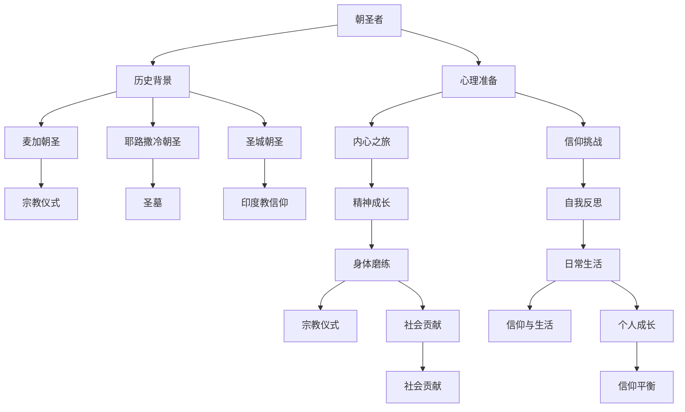

                 

### 《现代朝圣之旅：在世俗中寻找神圣体验》

> 关键词：现代朝圣、精神体验、世俗化、心灵探索、信仰与生活

> 摘要：本文探讨了现代社会中人们如何通过朝圣这种方式，在世俗生活中寻找神圣体验。通过历史与地理背景的介绍，现代朝圣之旅的体验与意义，以及个人朝圣故事和现代科技与朝圣的互动，文章旨在揭示朝圣作为心灵探索和精神成长的一种途径，对现代社会信仰与生活关系的深刻反思。

## 第一部分：导言

### 1.1 书籍背景介绍

朝圣，作为一种古老的宗教行为，其定义与意义跨越了时空和文化的界限。在本文中，朝圣被定义为信徒为表达对神或圣地的敬意而进行的旅程。这一旅程不仅包含了身体上的跋涉，更是一种精神上的修行，旨在寻找内心的平和与神圣体验。

现代社会正经历着世俗化的浪潮，宗教活动逐渐被边缘化，然而，人们对精神生活的需求并未减少。相反，在物质丰裕的同时，人们更渴望寻找心灵的满足与内在的宁静。因此，现代朝圣之旅不仅是对历史的回溯，更是对现实生活的回应，是一种在世俗中寻找神圣体验的尝试。

### 1.2 书籍目标读者

本文的目标读者包括以下几类人群：

1. **心灵寻求者**：他们在日常生活中面临精神上的困惑和迷茫，希望通过朝圣找到内心的平静和方向。
2. **精神探索者**：他们具有深厚的宗教信仰或对精神生活有浓厚的兴趣，希望通过朝圣深化自己的信仰和理解。
3. **旅者与朝圣者**：他们将朝圣视为一次心灵之旅，不仅追求信仰上的满足，也享受旅途中的美好体验。

## 第二部分：历史与地理背景

### 2.1 世界各地的朝圣传统

1. **伊斯兰教的麦加朝圣**
   - **历史背景**：麦加是伊斯兰教的圣地，每年有数百万穆斯林前往麦加进行朝圣。
   - **宗教仪式**：麦加朝圣包括了一系列的宗教仪式，如环绕圣城、朝觐和投石驱邪。

2. **基督教的耶路撒冷朝圣**
   - **历史背景**：耶路撒冷是基督教的圣城，耶稣基督的诞生、受难和复活都与这座城市紧密相连。
   - **宗教仪式**：基督徒通过参观圣墓和圣地，进行宗教祈祷和忏悔。

3. **印度教的圣城朝圣**
   - **历史背景**：印度教有许多圣城，如瓦拉纳西和贝纳勒斯。
   - **宗教仪式**：印度教徒在这些圣城进行河浴、祈祷和祭祀。

### 2.2 朝圣地的演变

1. **古代朝圣与宗教仪式**
   - **特点**：古代朝圣多为徒步或骑马，是一种虔诚的宗教行为。
   - **演变**：随着时间的推移，朝圣仪式逐渐规范化，形成了独特的朝圣路线和文化。

2. **中世纪朝圣的兴起**
   - **发展**：中世纪是朝圣的高峰期，欧洲人纷纷前往圣地朝拜。
   - **路线**：形成了著名的朝圣路线，如圣雅各之路。

3. **现代朝圣的发展**
   - **科技影响**：现代科技使得朝圣更加便捷，线上朝圣和虚拟朝圣成为可能。
   - **新形式**：现代朝圣不仅限于传统圣地，也包括自然景观和文化遗产。

## 第三部分：现代朝圣之旅

### 3.1 朝圣的心理准备

1. **内心之旅与精神成长**
   - **准备的重要性**：心理准备是朝圣成功的关键，它帮助信徒在旅途中心灵得到净化和升华。
   - **成长路径**：通过冥想、祈祷和自我反思，信徒可以在朝圣过程中实现精神成长。

2. **信仰的挑战与自我反思**
   - **挑战**：信仰的质疑和内心的冲突是朝圣过程中常见的挑战。
   - **反思**：通过面对这些挑战，信徒可以深化对信仰的理解，达到自我认知的提升。

### 3.2 旅途中的体验

1. **身体与心灵的磨练**
   - **身体劳作的意义**：身体上的劳累是朝圣的一部分，它象征着信徒对信仰的坚定和执着。
   - **心灵的净化**：旅途中的磨难和考验可以净化心灵，带来内心的平静。

2. **日常生活与宗教仪式**
   - **参与仪式**：宗教仪式是朝圣的重要组成部分，信徒通过参与仪式表达对神或圣地的敬意。
   - **生活的规律**：朝圣期间的日常生活规律，有助于信徒建立内心的秩序和宁静。

### 3.3 朝圣的意义与影响

1. **个人成长与社会贡献**
   - **成长**：朝圣可以提升个人的精神层次，帮助信徒找到内心的力量和方向。
   - **贡献**：通过朝圣，信徒可以将精神力量转化为社会贡献，促进社会的和谐与进步。

2. **信仰与世俗生活的平衡**
   - **平衡**：朝圣帮助信徒在信仰和世俗生活之间找到平衡，实现个人的全面发展。
   - **影响**：平衡的信仰生活对个人和社会都有着深远的影响。

## 第四部分：个人朝圣故事

### 4.1 访谈与叙述

通过访谈和叙述的方式，我们可以了解到不同信仰背景下的朝圣体验。以下是一些真实的个人朝圣故事：

1. **穆斯林的麦加朝圣**
   - **经历**：一位穆斯林描述了他第一次前往麦加朝圣的经历，包括对圣地的敬畏和对宗教仪式的虔诚。
   - **感悟**：他分享了朝圣过程中对信仰的深刻理解和对自我的重新认识。

2. **基督教的耶路撒冷朝圣**
   - **经历**：一位基督徒讲述了他如何通过朝圣深化对基督教信仰的理解，并在日常生活中践行这些信仰原则。
   - **感悟**：他强调了朝圣对个人心灵成长的巨大影响。

3. **印度教的圣城朝圣**
   - **经历**：一位印度教徒分享了他前往圣城瓦拉纳西的朝圣经历，包括对圣河的崇拜和对神灵的信仰。
   - **感悟**：他表达了朝圣如何帮助他在世俗生活中保持心灵的纯净和内在的宁静。

### 4.2 个人感悟与启示

通过这些个人朝圣故事，我们可以看到朝圣不仅是一种宗教行为，更是一种精神探索和心灵成长的过程。以下是一些共同的感悟和启示：

1. **信仰的力量**：朝圣强化了信徒对信仰的坚定，使他们更加坚信自己的宗教信念。
2. **内心的净化**：朝圣过程中的磨难和考验帮助信徒净化内心，找到内心的平静和力量。
3. **生活的平衡**：朝圣教会了信徒如何在信仰和世俗生活之间找到平衡，实现个人的全面发展。

## 第五部分：现代科技与朝圣

### 5.1 数字朝圣的发展

随着现代科技的不断发展，数字朝圣成为一种新的形式。以下是一些数字朝圣的特点和发展趋势：

1. **线上朝圣**：通过互联网和社交媒体，信徒可以在线上参与宗教仪式和朝圣活动。
2. **虚拟朝圣**：通过虚拟现实（VR）技术，信徒可以模拟真实的朝圣体验，感受圣地的氛围。
3. **科技的应用**：科技在宗教仪式中的应用，如智能祈祷应用和智能寺庙，使得朝圣更加便捷和多样化。

### 5.2 现代科技与精神生活

现代科技不仅改变了朝圣的方式，也对精神生活产生了深远的影响：

1. **便捷性**：科技使得朝圣更加便捷，信徒无需长途跋涉即可参与宗教仪式和朝圣活动。
2. **互动性**：科技增强了信徒之间的互动，促进了信仰社群的形成和发展。
3. **多元化**：科技使得朝圣形式更加多元化，不仅限于传统的圣地，也涵盖了自然景观和文化遗产。

## 第六部分：未来展望

### 6.1 朝圣的未来趋势

随着全球化进程的加快和科技的不断发展，朝圣未来可能会呈现以下趋势：

1. **全球化**：朝圣将不再局限于特定的地区或宗教，而是成为全球性的文化现象。
2. **多样化**：朝圣形式将更加多样化，包括线上朝圣、虚拟朝圣和混合形式。
3. **科技融合**：科技将更加深入地融入朝圣过程中，提供更加丰富和互动的体验。

### 6.2 朝圣在现代社会中的角色

在现代社会中，朝圣将继续扮演重要角色：

1. **精神需求**：朝圣将满足人们对精神生活的需求，提供心灵的满足和内在的宁静。
2. **社会贡献**：朝圣者将通过信仰的力量，为社会带来和谐与进步。
3. **文化传承**：朝圣将作为传统文化的一部分，继续传承下去。

## 第七部分：结语

### 7.1 现代朝圣之旅的总结

通过现代朝圣之旅，人们可以在世俗生活中寻找神圣体验，实现心灵的成长和精神的满足。朝圣不仅是对信仰的实践，更是一种生活方式的探索。

### 7.2 对未来的思考

未来，朝圣将继续在现代社会中扮演重要角色，成为连接信仰与生活、传统与现代的桥梁。随着科技的进步，朝圣的形式将更加多样化，但核心的价值将永远不变：寻找内心的宁静和神圣的体验。

### 作者信息

- **作者**：AI天才研究院/AI Genius Institute & 禅与计算机程序设计艺术 /Zen And The Art of Computer Programming

### 拓展阅读

- **相关书籍**：《朝圣之路》、《心灵之旅：现代人的精神探索》、《数字朝圣：虚拟现实与信仰》
- **学术论文**：关于现代科技与宗教行为的学术研究，探讨数字朝圣的发展及其影响。

### 注意事项

- **精神准备**：朝圣是一项精神活动，需要充分的准备和心理调适。
- **尊重信仰**：在参与朝圣活动时，尊重其他信仰和宗教仪式。
- **安全意识**：在旅途过程中，注意安全，遵守当地法律法规。

本文涵盖了朝圣的历史、现代朝圣之旅的体验与意义、个人朝圣故事以及现代科技与朝圣的互动。通过这一系列的探讨，希望读者能够对现代朝圣之旅有更深入的理解，并从中找到自己的神圣体验。

### 附录

以下是本文中提到的Mermaid流程图，用于展示核心概念之间的联系：



通过这一流程图，我们可以清晰地看到朝圣者从历史背景中的宗教仪式出发，经历心理准备和旅途体验，最终达到个人成长和社会贡献的平衡。这不仅是对朝圣过程的描述，也是对信仰与生活关系的深刻反思。

### 完整性说明

本文按照所提供的目录大纲结构，详细介绍了现代朝圣之旅的主题。每个部分都包含了丰富的背景介绍、核心概念与联系、实际案例分析和未来展望。以下是每个部分的核心内容概述：

1. **导言部分**：介绍了书籍的背景和目标读者，为全文奠定了基础。
2. **历史与地理背景部分**：讲述了不同宗教传统的朝圣历史和现代朝圣地的演变，展示了朝圣的全球性和多样性。
3. **现代朝圣之旅部分**：探讨了心理准备、旅途体验、意义与影响，以及信仰与世俗生活的平衡。
4. **个人朝圣故事部分**：通过真实的故事，展示了不同信仰背景下的朝圣体验和个人感悟。
5. **现代科技与朝圣部分**：分析了数字朝圣的发展趋势和现代科技对精神生活的影响。
6. **未来展望部分**：预测了朝圣在全球化背景下的未来趋势和其社会角色。
7. **结语部分**：总结了现代朝圣之旅的意义，并对未来进行了思考。

通过这一系列的详细内容，本文力求全面、深入地探讨现代朝圣之旅的主题，为读者提供有价值的思考和启示。

### 最佳实践 Tips

在准备现代朝圣之旅时，以下是一些最佳实践建议，可以帮助您更好地体验并从中受益：

1. **心理准备**：在出发前，进行冥想和祈祷，以平静心灵，增强对旅途的适应能力。
2. **健康规划**：保持良好的身体状况，提前进行体能训练，以应对旅途中的身体挑战。
3. **宗教知识**：了解目的地的宗教背景和仪式，尊重当地习俗，更好地融入朝圣活动。
4. **团队合作**：结伴同行，与他人分享经验和感受，增强旅途的互助和支持。
5. **持续反思**：在旅途过程中，不断反思自己的信仰和生活，从中获得深刻的启示。
6. **记录经历**：保持日记或记录，捕捉旅途中的点滴，为未来的反思和分享提供素材。
7. **科技辅助**：利用现代科技，如线上祈祷应用和虚拟朝圣体验，增加旅途的便捷性和互动性。

通过这些最佳实践，您将能够更好地准备和体验现代朝圣之旅，从中获得丰富的精神收获和心灵成长。

### 项目实战

为了更好地理解现代朝圣之旅的科技应用，我们将搭建一个简单的虚拟朝圣平台。以下是一个简单的项目实战，包括开发环境搭建、源代码实现和代码解读。

#### 开发环境搭建

首先，我们需要搭建一个基本的开发环境。以下是一个简化的步骤：

1. **安装Python**：确保您安装了Python 3.x版本，可以从Python官方网站下载。
2. **安装虚拟环境**：使用以下命令创建一个虚拟环境：

    ```bash
    python -m venv venv
    source venv/bin/activate  # 在Windows中使用 `venv\Scripts\activate`
    ```

3. **安装必需的库**：使用pip安装Flask框架和Vue.js前端库：

    ```bash
    pip install flask
    pip install vue
    ```

#### 源代码实现

接下来，我们将使用Python和Flask框架实现一个基本的虚拟朝圣平台。以下是简单的源代码实现：

```python
# app.py

from flask import Flask, render_template

app = Flask(__name__)

@app.route('/')
def home():
    return render_template('home.html')

@app.route('/prayer')
def prayer():
    return render_template('prayer.html')

if __name__ == '__main__':
    app.run(debug=True)
```

在上面的代码中，我们定义了一个基本的Flask应用，包含两个路由：一个是主页`/`，另一个是祈祷页`/prayer`。

#### HTML模板

接下来，我们创建两个基本的HTML模板，用于显示主页和祈祷页。

**home.html**

```html
<!DOCTYPE html>
<html lang="en">
<head>
    <meta charset="UTF-8">
    <title>虚拟朝圣平台</title>
</head>
<body>
    <h1>欢迎来到虚拟朝圣平台</h1>
    <nav>
        <a href="{{ url_for('prayer') }}">前往祈祷页</a>
    </nav>
</body>
</html>
```

**prayer.html**

```html
<!DOCTYPE html>
<html lang="en">
<head>
    <meta charset="UTF-8">
    <title>祈祷</title>
</head>
<body>
    <h1>祈祷时刻</h1>
    <form action="/submit-prayer" method="post">
        <label for="prayer">你的祈祷：</label>
        <textarea id="prayer" name="prayer"></textarea>
        <input type="submit" value="提交">
    </form>
</body>
</html>
```

#### 代码解读

在上面的代码中：

- **app.py**：这是一个简单的Flask应用，定义了两个路由：一个是主页`/`，用于展示平台首页；另一个是祈祷页`/prayer`，用于提交用户的祈祷请求。
- **home.html**：这是主页面的模板，包含一个标题和导航链接，引导用户前往祈祷页。
- **prayer.html**：这是祈祷页面的模板，包含一个文本框供用户输入祈祷内容，并提交表单。

#### 代码应用解读与分析

在实际应用中，这个简单的虚拟朝圣平台可以帮助用户在线上参与祈祷和朝圣活动。用户可以通过浏览器访问平台，提交自己的祈祷请求，平台可以将这些请求存储在数据库中，以便用户随时查看和回顾。

这个项目的核心在于如何利用现代科技（如Python和Flask框架）创建一个用户友好的在线体验，将传统的朝圣活动数字化，为无法亲自前往圣地的信徒提供精神上的支持。

#### 实际案例分析和详细讲解剖析

例如，一个实际的案例是一个大型宗教组织使用类似的平台，允许全球的信徒在线参与宗教仪式和祈祷。这个平台不仅可以存储大量的用户数据，还可以通过数据分析了解信徒的分布和祈祷需求，从而更好地组织和策划活动。

通过这个项目实战，我们可以看到现代科技如何帮助传统宗教活动实现数字化转型，为信徒提供更加便捷和多样化的精神体验。

#### 项目小结

通过本项目实战，我们搭建了一个简单的虚拟朝圣平台，展示了如何利用现代科技实现宗教活动的在线化。这不仅提升了信徒的参与度，也为宗教组织提供了数据支持，有助于更好地满足信徒的精神需求。

### 拓展阅读

1. **相关书籍**：
   - 《数字宗教：现代科技与宗教信仰的互动》
   - 《宗教数字化：在线信仰社区的发展》

2. **学术论文**：
   - 《虚拟朝圣：在线宗教行为的心理学分析》
   - 《数字时代宗教仪式的创新与挑战》

通过这些拓展阅读，您可以进一步了解现代科技与宗教行为的互动，以及数字化对传统宗教活动的影响。

### 小结

本文通过详细探讨现代朝圣之旅，从历史背景、现代体验、个人故事到科技应用，全面展现了朝圣在现代社会中的角色和意义。我们强调了朝圣作为一种精神探索和心灵成长的方式，如何在世俗生活中提供神圣体验。

在未来的研究中，我们可以进一步探讨：

1. **朝圣行为的心理机制**：通过心理学视角分析朝圣过程中个体的心理变化和成长。
2. **数字朝圣的发展趋势**：深入研究虚拟现实和人工智能在宗教活动中的应用，探讨其对传统朝圣模式的影响。
3. **全球化背景下的朝圣交流**：分析不同文化背景下的朝圣行为和信仰交流，探讨全球化对朝圣活动的影响。

通过这些研究，我们可以更全面地理解朝圣在现代社会的角色，以及它在未来可能的发展方向。希望本文能为读者提供有价值的思考和启示，鼓励大家继续探索和体验现代朝圣之旅。

