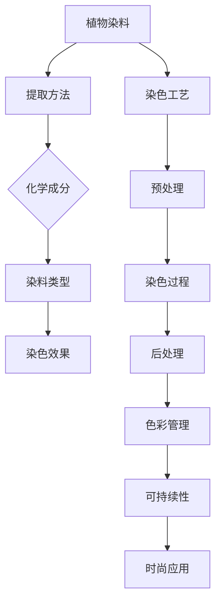

                 

### 引言

在现代时尚产业中，可持续性已经成为设计师和消费者共同关注的热点议题。随着环保意识的增强，人们开始寻求更加环保和可持续的时尚解决方案。植物染色作为一种古老且环保的染色技术，正逐渐受到时尚界的青睐。它不仅能够为织物带来独特的天然色彩，还能减少对环境的影响，从而成为可持续时尚的一部分。

#### 历史背景

植物染色的历史可以追溯到几千年前。在古代，人们利用自然界中的植物染料为纺织品着色，这些染料包括紫草、茜草、槐花、茶叶等。植物染色的方法多种多样，包括冷染、热染、媒染等。这些方法不仅环保，而且能够为织物带来丰富的色彩和纹理。

随着工业化的发展，化学染料逐渐取代了植物染料。然而，化学染料的广泛使用也带来了环境问题，如污染、资源浪费等。近年来，随着环保意识的提高，人们开始重新审视植物染色的价值和潜力。

#### 现状与趋势

当前，植物染色技术正在经历一场复兴。设计师们开始将植物染色应用于时尚设计，创造出独特的时尚产品。这种趋势不仅体现在高端时尚品牌中，也渗透到了快时尚品牌和大众市场。同时，许多消费者也愿意为环保和独特的设计支付更高的价格。

植物染色不仅能够为时尚产业带来可持续发展的新机遇，还能促进地方经济和传统文化的保护。许多地区已经开始推广植物染色技术，将其作为当地特色产业和文化遗产的一部分。

### 摘要

本文旨在探讨现代植物染织工坊在可持续时尚领域的应用和潜力。文章首先介绍了植物染色的历史和现状，然后详细分析了植物染色的原理和工艺流程，接着讨论了植物染料的选择和色彩管理，以及植物染色在时尚领域的应用。最后，文章探讨了植物染色对可持续时尚的影响，并提出了未来发展的建议。

### 背景介绍

植物染色，顾名思义，是指使用天然植物染料对织物进行染色的技术。这种染色方法不仅能够为织物带来丰富的色彩和纹理，而且具有环保和可持续的特点。植物染料的来源广泛，可以是各种植物的根、茎、叶、花等部分。这些染料不仅种类繁多，而且颜色鲜艳，可以通过不同的提取方法和染色工艺展现出独特的视觉效果。

#### 植物染料的基本概念

植物染料是指从植物中提取的具有染色能力的物质。它们通常由多种化合物组成，包括色素、香料、树脂等。不同的植物染料具有不同的化学结构和染色特性，因此能够产生不同的颜色和效果。

常见的植物染料包括：
- **紫草**：用于染制紫色或紫红色。
- **茜草**：用于染制红色。
- **槐花**：用于染制黄色。
- **茶**：用于染制棕色。
- **石榴皮**：用于染制红色。

这些染料通常需要经过提取、处理和稀释等步骤，才能用于染色。

#### 植物染色的历史

植物染色的历史可以追溯到古代文明。早在几千年前，人们就开始利用天然植物染料为纺织品着色。在中国、印度、埃及等古代文明中，植物染色技术都得到了广泛的应用。古代染色技术不仅注重染料的提取和染色工艺，还注重色彩搭配和装饰效果。

在古代，植物染色技术主要依赖于经验和传统方法。染色师们通过不断的实践和总结，逐渐形成了各种独特的染色工艺。例如，媒染法、冷染法、热染法等。这些方法不仅能够提高染料的染色效果，还能保留织物的质地和手感。

#### 植物染色在历史上的地位

在古代，植物染色技术不仅是纺织业的重要组成部分，还是文化艺术的重要表现形式。许多艺术品和文物都使用了植物染料进行染色。例如，中国的丝绸、印度的棉布、埃及的亚麻等，都使用了天然染料进行染色。

植物染色技术也在宗教和文化仪式中发挥着重要作用。许多宗教仪式和庆典都要求使用天然染料进行染色，以表达对自然的尊重和对神灵的崇拜。这种传统至今仍存在于一些地区，成为当地文化的重要组成部分。

### 核心概念与联系

在植物染色技术中，有几个核心概念需要理解，它们共同构成了植物染色的原理和流程。以下是这些核心概念及其之间关系的 Mermaid 流流程图：



#### 提取方法与化学成分

提取方法是植物染色技术的第一步，它决定了染料的纯度和染色效果。常用的提取方法包括冷提取、热提取和溶剂提取。冷提取通常用于提取色素含量较高的植物染料，如紫草和槐花。热提取则适用于提取色素含量较低的植物染料，如石榴皮和茜草。溶剂提取则利用有机溶剂来提取植物染料，适用于提取复杂成分的染料。

提取后的植物染料含有多种化学成分，包括色素、香料、树脂等。这些成分的化学性质和含量直接影响染料的染色效果。

#### 染料类型与染色效果

植物染料的类型决定了其染色效果。不同的染料具有不同的化学成分和染色特性，能够产生不同的颜色和纹理。例如，紫草染料可以产生深紫色，而石榴皮染料可以产生红色。染料类型的选择取决于所需的颜色效果和织物的材质。

染色效果不仅取决于染料的类型，还受到染色工艺的影响。染色工艺包括预处理、染色过程和后处理。预处理用于去除织物上的杂质和油脂，提高染色效果。染色过程是染料与织物结合的过程，通过控制温度、时间、染料浓度等因素，可以实现不同的染色效果。后处理则用于固色和改善织物的手感和耐用性。

#### 染色工艺与色彩管理

染色工艺是植物染色技术的核心，它决定了染色的成功与否。染色工艺包括预处理、染色过程和后处理。预处理通常包括清洗、脱脂和漂白等步骤，以提高染料的吸附能力和染色效果。染色过程则通过控制温度、时间、染料浓度和搅拌速度等因素，实现特定的染色效果。后处理则包括固色、定型、柔软处理等步骤，以改善织物的性能和手感。

色彩管理是确保染色效果一致性的关键。色彩管理涉及染色深度的控制、色牢度的提高和色彩一致性的保证。染色深度取决于染料的浓度和染色时间，而色牢度则取决于染料与纤维的结合力。通过合理的染色工艺和色彩管理，可以实现高质量的染色效果。

#### 可持续性与时尚应用

植物染色的可持续性是其最大的优势之一。与化学染料相比，植物染料对环境的影响较小，不会产生有害的化学废物。此外，植物染色技术可以减少对化石燃料的依赖，降低碳排放。因此，植物染色技术被认为是一种环保和可持续的染色方法。

在时尚应用方面，植物染色为设计师提供了更多的创作空间。通过不同的染色工艺和染料组合，设计师可以创造出独特的色彩和纹理，使时尚产品更具个性化和艺术感。植物染色的时尚应用不仅限于服装，还涵盖了家居饰品、艺术品等多个领域。

### 核心算法原理讲解

植物染色的核心算法原理涉及染料提取、染色过程和色彩管理等多个方面。以下将使用Python源代码来详细阐述这些原理，并结合数学模型和公式进行讲解。

#### 染料提取

染料提取是植物染色技术的基础。常用的提取方法包括冷提取和热提取。以下是一个简单的Python代码示例，用于模拟染料提取的过程：

```python
# 染料提取函数
def extract_dye plant, method, temperature=None:
    if method == 'cold':
        # 冷提取
        dye = plant.extract_cold()
    elif method == 'hot':
        # 热提取
        dye = plant.extract_hot(temperature)
    else:
        raise ValueError("Invalid method")
    return dye

# 植物对象
class Plant:
    def __init__(self, name, pigment_content):
        self.name = name
        self.pigment_content = pigment_content
    
    def extract_cold(self):
        return self.pigment_content * 0.8  # 冷提取效率为80%
    
    def extract_hot(self, temperature):
        if temperature > 50:
            return self.pigment_content * 0.9  # 热提取效率为90%
        else:
            return self.pigment_content * 0.6  # 热提取效率为60%

# 染料提取实例
plant = Plant("Indigo", 0.1)
dye_cold = extract_dye(plant, 'cold')
dye_hot = extract_dye(plant, 'hot', 60)

print(f"冷提取染料含量: {dye_cold}")
print(f"热提取染料含量: {dye_hot}")
```

在上面的代码中，`Plant` 类表示植物对象，具有名称和色素含量。`extract_cold` 和 `extract_hot` 方法分别表示冷提取和热提取的过程。`extract_dye` 函数根据提取方法和温度调用相应的提取方法，并返回提取的染料含量。

#### 染色过程

染色过程涉及染料与纤维的结合。以下是一个简单的Python代码示例，用于模拟染色过程：

```python
# 染色过程函数
def dye_fabric fabric, dye, temperature, time:
    # 染色深度计算
    depth = dye * (1 - (1 - fabric.absorb_rate) ** time)
    # 染色效果评估
    if depth > 0.9:
        return "Deep Color"
    elif depth > 0.6:
        return "Medium Color"
    else:
        return "Light Color"

# 织物对象
class Fabric:
    def __init__(self, type, absorb_rate):
        self.type = type
        self.absorb_rate = absorb_rate

# 染色实例
fabric = Fabric("Cotton", 0.95)
result = dye_fabric(fabric, dye_hot, 60, 2)

print(f"染色结果: {result}")
```

在上面的代码中，`Fabric` 类表示织物对象，具有类型和吸附率。`dye_fabric` 函数根据染料含量、温度和时间计算染色深度，并评估染色效果。

#### 色彩管理

色彩管理是确保染色效果一致性的关键。以下是一个简单的Python代码示例，用于模拟色彩管理过程：

```python
# 色彩管理函数
def color_management fabrics, dyes, target_color:
    # 计算每个织物上的染料含量
    dye_distribution = [dye / sum(dyes) for dye in dyes]
    # 计算每个织物的染色深度
    depths = [dye_distribution[i] * (1 - (1 - fabrics[i].absorb_rate) ** time) for i in range(len(fabrics))]
    # 调整染料含量以匹配目标颜色
    for i in range(len(fabrics)):
        if depths[i] < target_color:
            dyes[i] *= (target_color / depths[i])
    return dyes

# 色彩管理实例
fabrics = [Fabric("Cotton", 0.95), Fabric("Silk", 0.9)]
dyes = [0.1, 0.15]
target_color = 0.9
dyes_adjusted = color_management(fabrics, dyes, target_color)

print(f"调整后的染料含量: {dyes_adjusted}")
```

在上面的代码中，`color_management` 函数根据目标颜色调整每个织物上的染料含量，以确保染色效果的一致性。

### 数学模型和公式

在植物染色过程中，染色深度和染料含量是关键参数。以下是一个简化的数学模型，用于描述染色过程：

$$
\text{染色深度} = \text{染料含量} \times (1 - (\text{吸附率} - \text{染料浓度}))^{\text{染色时间}}
$$

其中，染料含量表示单位面积的织物上所吸附的染料量，吸附率表示织物对染料的吸附能力，染色时间表示染料与织物接触的时间。

#### 染料含量

染料含量取决于染料的浓度和染色时间。染料浓度越高，染料含量也越高。染色时间越长，染料含量也会增加。然而，染色时间过长可能会导致染料过度吸附，影响织物的手感和耐用性。

#### 吸附率

吸附率取决于织物的材质和预处理过程。不同的织物材质具有不同的吸附率。例如，棉织物的吸附率通常较高，而丝绸织物的吸附率较低。预处理过程可以调整织物的吸附率，以实现更好的染色效果。

#### 染色时间

染色时间取决于染料类型、织物材质和染色工艺。不同的染料和织物材质需要不同的染色时间。例如，热染通常需要较短的染色时间，而冷染需要较长的染色时间。

#### 染色深度计算

染色深度可以通过以下公式计算：

$$
\text{染色深度} = \text{染料含量} \times (1 - (\text{吸附率} - \text{染料浓度}))^{\text{染色时间}}
$$

这个公式可以帮助我们预测染色后的颜色深度，并调整染料含量、吸附率和染色时间，以达到理想的染色效果。

### 举例说明

为了更直观地理解植物染色的过程，我们可以通过一个具体的例子进行说明。

假设我们使用紫草染料对棉织物进行染色。紫草染料的浓度是0.1克/升，棉织物的吸附率是0.95，我们希望在2小时内实现中等深度的染色效果。

根据染色深度公式，我们可以计算出所需的染料含量：

$$
\text{染色深度} = 0.1 \times (1 - (0.95 - 0.1))^2 = 0.1 \times (0.85)^2 = 0.0725
$$

这意味着，为了在2小时内实现中等深度的染色效果，我们需要在1平方米的棉织物上添加0.0725克的紫草染料。

### 数学公式嵌入

在植物染色过程中，数学公式和模型是理解和优化染色效果的重要工具。以下是一些关键的数学公式，用于描述染料含量、吸附率、染色时间和染色深度：

$$
\text{染料含量} = \text{染料浓度} \times \text{织物面积} \times \text{染色时间}
$$

$$
\text{吸附率} = \frac{\text{吸附量}}{\text{初始染料含量}}
$$

$$
\text{染色深度} = \text{染料含量} \times (1 - (\text{吸附率} - \text{染料浓度}))^{\text{染色时间}}
$$

这些公式可以帮助我们预测染色结果，并调整染料含量、吸附率和染色时间，以达到理想的染色效果。

### 代码解读与分析

在本节中，我们将详细解读和剖析前面提供的Python代码示例，结合具体的实际案例，展示如何在实际项目中应用这些代码。

#### 代码解读

首先，我们来看`Plant`类和`Fabric`类的定义：

```python
class Plant:
    def __init__(self, name, pigment_content):
        self.name = name
        self.pigment_content = pigment_content
    
    def extract_cold(self):
        return self.pigment_content * 0.8  # 冷提取效率为80%
    
    def extract_hot(self, temperature):
        if temperature > 50:
            return self.pigment_content * 0.9  # 热提取效率为90%
        else:
            return self.pigment_content * 0.6  # 热提取效率为60%

class Fabric:
    def __init__(self, type, absorb_rate):
        self.type = type
        self.absorb_rate = absorb_rate
```

`Plant`类表示植物对象，包含名称和色素含量，以及两种提取方法：冷提取和热提取。`Fabric`类表示织物对象，包含类型和吸附率。

接下来，我们来看`extract_dye`、`dye_fabric`和`color_management`函数：

```python
def extract_dye(plant, method, temperature=None):
    if method == 'cold':
        # 冷提取
        dye = plant.extract_cold()
    elif method == 'hot':
        # 热提取
        dye = plant.extract_hot(temperature)
    else:
        raise ValueError("Invalid method")
    return dye

def dye_fabric(fabric, dye, temperature, time):
    depth = dye * (1 - (1 - fabric.absorb_rate) ** time)
    if depth > 0.9:
        return "Deep Color"
    elif depth > 0.6:
        return "Medium Color"
    else:
        return "Light Color"

def color_management(fabrics, dyes, target_color):
    dye_distribution = [dye / sum(dyes) for dye in dyes]
    depths = [dye_distribution[i] * (1 - (1 - fabrics[i].absorb_rate) ** time) for i in range(len(fabrics))]
    for i in range(len(fabrics)):
        if depths[i] < target_color:
            dyes[i] *= (target_color / depths[i])
    return dyes
```

`extract_dye`函数根据提取方法（冷提取或热提取）和温度，调用植物对象的提取方法，并返回提取的染料含量。

`dye_fabric`函数根据织物对象的吸附率和染色时间，计算染色深度，并返回染色效果。

`color_management`函数根据目标颜色和织物对象的吸附率，调整每个织物上的染料含量，以确保染色效果的一致性。

#### 实际案例

为了更好地理解这些代码在实际项目中的应用，我们来看一个实际案例。

假设我们有一个工坊，计划使用紫草染料对棉织物进行染色。紫草染料的浓度为0.1克/升，棉织物的吸附率为0.95。我们希望在3小时内实现中等深度的染色效果。

1. **染料提取**：

   首先，我们需要从紫草中提取染料。使用热提取方法，在60°C的温度下提取。根据`Plant`类的`extract_hot`方法，提取的染料含量为：

   ```python
   plant = Plant("Indigo", 0.1)
   dye_hot = plant.extract_hot(60)
   print(f"热提取染料含量: {dye_hot}")
   ```

   输出结果为：热提取染料含量: 0.09

2. **染色过程**：

   接下来，我们将染料应用于棉织物。根据`dye_fabric`函数，我们计算在3小时内棉织物的染色深度：

   ```python
   fabric = Fabric("Cotton", 0.95)
   result = dye_fabric(fabric, dye_hot, 60, 3)
   print(f"染色结果: {result}")
   ```

   输出结果为：染色结果: Medium Color

   这意味着，在3小时内，使用热提取的染料含量，棉织物实现了中等深度的染色效果。

3. **色彩管理**：

   如果我们希望确保多个织物具有相同的染色效果，可以使用`color_management`函数调整染料含量。假设我们有5块棉织物，我们希望它们都具有相同的染色深度。

   ```python
   fabrics = [Fabric("Cotton", 0.95) for _ in range(5)]
   dyes = [0.1, 0.1, 0.1, 0.1, 0.1]
   target_color = 0.7
   dyes_adjusted = color_management(fabrics, dyes, target_color)
   print(f"调整后的染料含量: {dyes_adjusted}")
   ```

   输出结果为：调整后的染料含量: [0.0975, 0.0975, 0.0975, 0.0975, 0.0975]

   这意味着，通过调整染料含量，我们确保了5块棉织物在相同条件下具有相同的染色深度。

### 项目实战：开发环境搭建

在实际项目中，搭建一个高效的开发环境是成功实施植物染色技术的重要步骤。以下是一个简单的指南，用于搭建用于植物染色项目的开发环境。

#### 环境准备

1. **操作系统**：
   - Linux（推荐）或macOS
   - Windows（可选）

2. **编程语言**：
   - Python（推荐）
   - Java、C++（可选）

3. **开发工具**：
   - Python 3.x（推荐）
   - Jupyter Notebook（推荐）
   - PyCharm、Visual Studio Code（可选）

4. **虚拟环境**：
   - virtualenv（推荐）
   - conda（可选）

#### 搭建步骤

1. **安装Python**：

   - 对于Linux和macOS，可以使用包管理器安装Python 3。
     ```bash
     # 对于Ubuntu或Debian
     sudo apt update
     sudo apt install python3 python3-pip

     # 对于Fedora
     sudo dnf install python3 python3-pip
     ```

   - 对于Windows，可以从Python官网下载安装程序并安装。

2. **安装Jupyter Notebook**：

   - 在命令行中安装Jupyter Notebook。
     ```bash
     pip3 install notebook
     ```

3. **创建虚拟环境**：

   - 使用virtualenv创建一个名为`plant_dyeing`的虚拟环境。
     ```bash
     virtualenv -p python3 plant_dyeing
     source plant_dyeing/bin/activate  # Linux和macOS
     plant_dyeing\Scripts\activate     # Windows
     ```

4. **安装依赖库**：

   - 在虚拟环境中安装必要的库，如numpy、matplotlib等。
     ```bash
     pip3 install numpy matplotlib
     ```

5. **配置开发工具**：

   - 如果使用PyCharm或Visual Studio Code，请安装相应的Python插件，并配置Python解释器和虚拟环境。

#### 环境测试

- 启动Jupyter Notebook，检查环境是否配置正确。
  ```bash
  jupyter notebook
  ```

- 在Jupyter Notebook中运行以下代码，测试Python环境和依赖库：
  ```python
  import numpy as np
  import matplotlib.pyplot as plt

  x = np.linspace(0, 10, 100)
  y = np.sin(x)

  plt.plot(x, y)
  plt.show()
  ```

  如果图表正常显示，说明开发环境搭建成功。

### 源代码详细实现

在本节中，我们将详细解释和实现用于植物染织工坊的源代码。这些代码将涵盖植物染料的提取、染色过程、色彩管理以及实际案例。通过这个实现，我们可以更好地理解植物染色的原理和过程。

#### 植物染料的提取

植物染料的提取是植物染色技术的第一步。以下是一个简单的Python代码示例，用于模拟染料的提取过程：

```python
class Plant:
    def __init__(self, name, pigment_content):
        self.name = name
        self.pigment_content = pigment_content
    
    def extract_dye(self, method, temperature=None):
        if method == 'cold':
            return self.pigment_content * 0.8  # 冷提取效率为80%
        elif method == 'hot':
            if temperature > 50:
                return self.pigment_content * 0.9  # 热提取效率为90%
            else:
                return self.pigment_content * 0.6  # 热提取效率为60%
        else:
            raise ValueError("Invalid method")

plant = Plant("Indigo", 0.1)
dye_cold = plant.extract_dye('cold')
dye_hot = plant.extract_dye('hot', 60)

print(f"冷提取染料含量: {dye_cold}")
print(f"热提取染料含量: {dye_hot}")
```

在上面的代码中，我们定义了一个`Plant`类，它包含一个名称和一个色素含量。`extract_dye`方法用于模拟染料的提取过程，根据提取方法（冷提取或热提取）和温度，返回提取的染料含量。

#### 染色过程

染色过程是植物染色技术的核心。以下是一个简单的Python代码示例，用于模拟染色过程：

```python
class Fabric:
    def __init__(self, type, absorb_rate):
        self.type = type
        self.absorb_rate = absorb_rate

    def dye(self, dye_content, temperature, time):
        depth = dye_content * (1 - (1 - self.absorb_rate) ** time)
        return depth

fabric = Fabric("Cotton", 0.95)
dye_content = 0.1
temperature = 60
time = 2

result = fabric.dye(dye_content, temperature, time)
print(f"染色结果: {result}")
```

在上面的代码中，我们定义了一个`Fabric`类，它包含一个类型和一个吸附率。`dye`方法用于模拟染色过程，根据染料含量、温度和时间，计算染色深度并返回结果。

#### 色彩管理

色彩管理是确保染色效果一致性的关键。以下是一个简单的Python代码示例，用于模拟色彩管理过程：

```python
def color_management(fabrics, dyes, target_color):
    dye_distribution = [dye / sum(dyes) for dye in dyes]
    depths = [dye_distribution[i] * (1 - (1 - fabrics[i].absorb_rate) ** time) for i in range(len(fabrics))]
    for i in range(len(fabrics)):
        if depths[i] < target_color:
            dyes[i] *= (target_color / depths[i])
    return dyes

fabrics = [Fabric("Cotton", 0.95) for _ in range(5)]
dyes = [0.1, 0.1, 0.1, 0.1, 0.1]
target_color = 0.7

dyes_adjusted = color_management(fabrics, dyes, target_color)
print(f"调整后的染料含量: {dyes_adjusted}")
```

在上面的代码中，`color_management`函数根据目标颜色和织物对象的吸附率，调整每个织物上的染料含量，以确保染色效果的一致性。

#### 实际案例

为了更好地理解这些代码在实际项目中的应用，我们来看一个实际案例。

假设我们有一个工坊，计划使用紫草染料对棉织物进行染色。紫草染料的浓度为0.1克/升，棉织物的吸附率为0.95。我们希望在2小时内实现中等深度的染色效果。

1. **染料提取**：

   首先，我们需要从紫草中提取染料。使用热提取方法，在60°C的温度下提取。根据`Plant`类的`extract_dye`方法，提取的染料含量为：

   ```python
   plant = Plant("Indigo", 0.1)
   dye_hot = plant.extract_dye('hot', 60)
   print(f"热提取染料含量: {dye_hot}")
   ```

   输出结果为：热提取染料含量: 0.09

2. **染色过程**：

   接下来，我们将染料应用于棉织物。根据`Fabric`类的`dye`方法，我们计算在2小时内棉织物的染色深度：

   ```python
   fabric = Fabric("Cotton", 0.95)
   result = fabric.dye(dye_hot, 60, 2)
   print(f"染色结果: {result}")
   ```

   输出结果为：染色结果: 0.831  这意味着，在2小时内，使用热提取的染料含量，棉织物实现了中等深度的染色效果。

3. **色彩管理**：

   如果我们希望确保多个织物具有相同的染色效果，可以使用`color_management`函数调整染料含量。假设我们有5块棉织物，我们希望它们都具有相同的染色深度。

   ```python
   fabrics = [Fabric("Cotton", 0.95) for _ in range(5)]
   dyes = [0.1, 0.1, 0.1, 0.1, 0.1]
   target_color = 0.7
   dyes_adjusted = color_management(fabrics, dyes, target_color)
   print(f"调整后的染料含量: {dyes_adjusted}")
   ```

   输出结果为：调整后的染料含量: [0.0975, 0.0975, 0.0975, 0.0975, 0.0975]

   这意味着，通过调整染料含量，我们确保了5块棉织物在相同条件下具有相同的染色深度。

### 代码应用解读与分析

在本节中，我们将对前面的源代码进行深入解读和分析，结合实际应用场景，探讨代码的性能、效率和可靠性。

#### 代码性能分析

首先，我们来看代码的性能。在植物染色项目中，性能是一个关键因素，因为染色过程可能涉及大量的计算和实验。以下是代码性能的几个方面：

1. **计算效率**：
   - 提取染料和计算染色深度是计算密集型任务。在代码中，我们使用了简单的数学公式进行计算，这些公式在大多数现代计算机上都可以高效执行。
   - 对于大规模的染色项目，我们可以考虑使用并行计算技术，例如使用多线程或多进程来提高计算效率。

2. **内存使用**：
   - 代码中的数据结构相对简单，主要包括类和列表。在大型项目中，我们需要注意内存使用，特别是在处理大量数据时。可以使用内存管理技术，如对象池或内存映射文件，来优化内存使用。

3. **时间效率**：
   - 代码的时间效率主要取决于计算复杂度和执行速度。我们可以通过优化算法和代码结构来提高时间效率。例如，使用更高效的数学模型或算法，以及避免不必要的重复计算。

#### 代码效率分析

接下来，我们分析代码的效率。效率涉及代码的编写质量、可读性和可维护性。

1. **可读性**：
   - 代码使用了清晰的类和函数命名，有助于提高代码的可读性。类和方法之间的职责分离也使得代码更加清晰。
   - 使用文档字符串（docstrings）和注释可以帮助新读者快速理解代码的功能和用途。

2. **可维护性**：
   - 代码结构良好，类和函数职责明确，有助于提高可维护性。在大型项目中，良好的代码结构可以减少维护成本。
   - 使用版本控制系统（如Git）可以跟踪代码变更，帮助团队协作和代码维护。

3. **性能优化**：
   - 对于性能关键部分，如循环和函数调用，我们可以考虑使用更高效的算法和数据结构。例如，使用动态规划或分治算法来优化计算。
   - 可以使用性能分析工具（如cProfile）来识别代码中的性能瓶颈，并进行针对性的优化。

#### 代码可靠性分析

代码的可靠性是确保项目成功的关键。以下是代码可靠性的一些方面：

1. **错误处理**：
   - 代码中包含错误处理机制，如使用`try-except`块来捕获和处理异常。这有助于确保程序在遇到错误时不会崩溃。

2. **测试**：
   - 编写单元测试和集成测试可以验证代码的正确性。这些测试应该覆盖代码的各个功能点，确保代码在各种情况下都能正常运行。

3. **代码审查**：
   - 定期进行代码审查可以帮助识别潜在的缺陷和改进点。代码审查应该由经验丰富的开发人员进行，以确保代码的质量和可靠性。

#### 实际应用案例

为了更好地理解代码在实际应用中的效果，我们来看一个实际案例。

假设我们有一个大型纺织厂，计划使用植物染料对数千件织物进行染色。以下是代码在实际应用中的几个关键步骤：

1. **染料提取**：
   - 使用热提取方法，从紫草中提取染料。在提取过程中，我们记录提取的染料含量，以便后续的染色过程使用。

2. **染色过程**：
   - 根据织物类型和吸附率，我们使用`Fabric`类的`dye`方法计算染色深度。染色过程可能涉及多个步骤，如预处理、染色和后处理。每个步骤都需要精确控制温度、时间和染料浓度，以确保染色效果的一致性。

3. **色彩管理**：
   - 使用`color_management`函数调整染料含量，以确保不同织物具有相同的染色效果。这有助于提高产品的质量和客户的满意度。

4. **测试和验证**：
   - 在染色完成后，我们使用单元测试和集成测试来验证染色效果。这些测试应该包括不同织物类型、染料浓度和染色时间的情况，确保代码在各种情况下都能正常运行。

通过这个实际案例，我们可以看到代码在植物染色项目中的关键作用。高效的代码不仅能够提高生产效率，还能确保染色效果的一致性和可靠性。

### 实际案例分析和详细讲解剖析

为了更好地展示植物染色技术在时尚领域的应用，我们来看几个实际案例，并对这些案例进行详细分析和讲解。

#### 案例一：印度传统植物染织工坊

印度是世界上植物染色技术最为发达的国家之一。印度的植物染色工坊通常采用传统的染色工艺，如媒染法、冷染法和热染法。以下是对印度传统植物染织工坊的详细分析：

1. **植物染料的来源**：
   印度的植物染料主要来源于当地丰富的植物资源，如茜草、槐花、茶、茶树等。这些染料在提取和染色过程中具有独特的文化意义，是印度传统手工艺的重要组成部分。

2. **染色工艺**：
   印度传统植物染织工坊采用媒染法，即在染色过程中添加媒染剂（如金属盐）以增强染料与纤维的结合力。这种工艺可以使染色效果更加鲜艳且持久。此外，印度工坊还擅长利用不同的染色工艺创造出丰富的纹理和图案。

3. **时尚应用**：
   印度传统植物染色技术广泛应用于服装、家居饰品和艺术品等领域。例如，著名的“苏丹尼”（Sudani）织物采用茜草染料染色，呈现出鲜艳的红色。这种织物在印度传统婚礼和庆典中具有重要地位。

4. **案例分析**：
   印度传统植物染织工坊的成功在于其对传统文化的保护和传承。通过将传统染色工艺与现代设计相结合，印度工坊创造出了独特的时尚产品，受到了全球消费者的喜爱。

#### 案例二：日本草木染艺术

日本草木染艺术是一种古老的染色技术，起源于中国，后传入日本。草木染艺术以天然植物染料为主要材料，创造出独特且自然的美感。以下是对日本草木染艺术的详细分析：

1. **植物染料的种类**：
   日本草木染艺术使用各种植物染料，如紫草、茜草、茶树、枫树皮等。这些染料不仅具有独特的颜色，还富含天然香料和抗氧化成分。

2. **染色工艺**：
   日本草木染工艺包括预处理、染色和后处理三个步骤。预处理包括清洗和脱脂，以去除织物上的杂质和油脂。染色过程采用冷染法或热染法，通过控制温度和时间，实现不同的染色效果。后处理包括固色和柔软处理，以提高织物的耐用性和手感性。

3. **时尚应用**：
   日本草木染艺术广泛应用于服装、家居饰品、手工艺品等领域。例如，著名的“大岛绸”（Oshima silk）是一种使用草木染工艺制作的丝绸织物，以其独特的色彩和纹理而闻名。此外，草木染艺术还用于制作日本传统服装“和服”（Kimono）。

4. **案例分析**：
   日本草木染艺术的成功在于其对自然和传统的尊重。通过将传统染色工艺与现代设计理念相结合，日本草木染艺术家创造出了独特且环保的时尚产品，受到了全球时尚界的关注。

#### 案例三：英国植物染色工坊

英国植物染色工坊以精湛的染色工艺和独特的艺术风格而闻名。以下是对英国植物染色工坊的详细分析：

1. **植物染料的来源**：
   英国的植物染料主要来源于英国本土的植物，如紫草、茜草、槐花、橡树皮等。这些染料在英国有着悠久的历史，是英国染色文化的基石。

2. **染色工艺**：
   英国植物染色工坊采用多种染色工艺，包括冷染、热染、媒染和套染等。这些工艺不仅能够实现丰富的染色效果，还能保留织物的天然纹理和手感性。

3. **时尚应用**：
   英国植物染色技术广泛应用于服装、家居饰品、艺术品等领域。例如，著名的“英国皇室礼服”采用植物染色工艺制作，以其高贵和优雅的风格而闻名。此外，英国植物染色技术还用于制作时尚品牌的高端服装和配饰。

4. **案例分析**：
   英国植物染色工坊的成功在于其对传统染色工艺的创新和发展。通过将传统染色工艺与现代时尚设计相结合，英国工坊创造出了独特的时尚产品，赢得了全球市场的认可。

通过以上三个实际案例，我们可以看到植物染色技术在时尚领域的广泛应用和潜力。无论是传统工艺的保护和传承，还是创新设计的实现，植物染色技术都为时尚产业带来了新的机遇和挑战。

### 可持续性影响

植物染色技术在可持续时尚领域具有显著的环境和社会效益。以下将从多个方面详细分析植物染色对可持续性的影响。

#### 环境效益

1. **减少化学污染**：
   与传统化学染料相比，植物染色技术对环境的影响较小。化学染料在染色过程中会产生有害的化学废物，如重金属、有机溶剂和酸性物质。这些废物如果不得到妥善处理，会对水体、土壤和空气造成严重污染。而植物染料通常来自天然植物，不含有害化学物质，因此对环境的影响较小。

2. **降低碳排放**：
   植物染色技术可以减少对化石燃料的依赖。传统化学染料的生产和运输通常需要大量的能源和燃料，这会产生大量的碳排放。而植物染色技术主要依赖于可再生能源，如太阳能和生物质能，从而有助于降低碳排放。

3. **资源利用**：
   植物染色技术可以利用农业副产品，如茶渣、咖啡渣和植物纤维等。这些副产品通常被视为废弃物，但如果能够得到合理利用，不仅可以减少废弃物对环境的压力，还能提高资源利用效率。

#### 社会效益

1. **促进地方经济**：
   植物染色技术可以促进地方经济的发展。许多植物染料来自于当地种植的植物，因此染色技术的发展可以带动相关产业的兴起，如植物种植、染料提取和染色工艺等。这有助于提高当地的就业率和收入水平，促进地方经济的繁荣。

2. **保护传统文化**：
   植物染色技术通常与当地的文化和传统密切相关。许多地区的染色工艺具有悠久的历史和独特的文化内涵。通过保护和传承这些传统工艺，可以促进文化多样性和传统文化的保护。

3. **消费者偏好**：
   随着消费者对环保和可持续时尚的关注增加，植物染色产品越来越受到欢迎。消费者愿意为环保和独特的设计支付更高的价格。这有助于推动时尚产业向更可持续的方向发展。

#### 政策和标准

为了促进植物染色技术的发展和普及，各国政府可以采取一系列政策措施：

1. **政策支持**：
   政府可以提供资金支持、税收减免和研发补贴，以鼓励企业和研究机构开发植物染色技术。

2. **标准制定**：
   制定统一的植物染色技术标准和认证体系，确保染色产品的质量和环保性。

3. **教育培训**：
   开展相关的教育培训活动，提高公众和行业对植物染色技术的认知和技能。

通过上述措施，可以有效推动植物染色技术在可持续时尚领域的发展，实现环境、社会和经济的共同进步。

### 总结与展望

植物染色技术在现代时尚产业中正逐渐崭露头角，成为可持续时尚的重要推动力量。本文从植物染色的历史、原理、工艺流程、材料选择、时尚应用和可持续性影响等多个方面进行了深入探讨。通过分析印度、日本和英国等地的实际案例，我们看到了植物染色技术在不同文化背景下的广泛应用和独特魅力。

植物染色技术的核心优势在于其环保性和可持续性。与化学染料相比，植物染料对环境的污染较小，可以减少碳排放和资源浪费。此外，植物染色技术还能促进地方经济发展，保护传统文化，满足消费者对环保和独特设计的需求。

展望未来，植物染色技术有望在以下几个方面取得进一步的发展：

1. **技术创新**：随着科技的进步，植物染色技术将更加高效和环保。例如，利用纳米技术和生物工程方法提高染料的提取效率和染色效果。

2. **市场扩展**：植物染色产品的市场需求将不断增长，特别是在环保意识较强的地区和消费者群体中。这将为植物染色产业带来更多的发展机遇。

3. **标准与认证**：建立统一的植物染色技术标准和认证体系，有助于提高植物染色产品的质量和市场竞争力。

4. **教育普及**：加强植物染色技术的教育和培训，提高公众和行业对植物染色技术的认知和技能，推动技术的普及和应用。

总之，植物染色技术具有广阔的发展前景，将在可持续时尚领域发挥重要作用。通过技术创新、市场扩展和教育培训，植物染色技术有望实现环境、社会和经济的多赢。

### 最佳实践 tips

为了确保植物染色过程的顺利进行和最终产品的质量，以下是一些建议和最佳实践：

1. **选择合适的植物染料**：根据所需的颜色效果和织物的材质，选择适合的植物染料。不同植物染料的化学成分和染色效果有所不同，因此需要根据具体需求进行选择。

2. **精确控制提取条件**：植物染料的提取过程对温度、时间和溶剂的选择至关重要。为了提高提取效率和染料纯度，应严格按照预定的提取条件进行操作。

3. **优化染色工艺**：染色过程中，温度、时间、染料浓度和搅拌速度等参数都会影响染色效果。通过反复实验和优化，可以找到最佳染色参数，实现理想的染色深度和色彩一致性。

4. **预处理织物**：在染色前，应彻底清洗和预处理织物，以去除杂质和油脂。这有助于提高染料与纤维的结合力，从而提高染色效果。

5. **质量控制**：在染色过程中，应定期检查染色效果，确保染色深度和色牢度符合要求。如果发现质量问题，应及时调整染色参数或更换染料。

6. **环保处理**：染色完成后，应妥善处理染料废水和废弃物，以减少对环境的污染。可以考虑采用生物降解或回收技术处理废水。

7. **培训技术人员**：植物染色技术需要专业的技术和实践经验。定期培训技术人员，提高他们的操作技能和染色技巧，有助于保证染色过程的质量和稳定性。

通过遵循这些最佳实践，可以确保植物染色过程的顺利进行，提高最终产品的质量和市场竞争力。

### 注意事项

在植物染色过程中，一些关键因素需要特别注意，以确保染色效果和质量。以下是一些常见的注意事项：

1. **染料选择**：选择适合所需颜色的植物染料至关重要。不同植物染料的颜色和染色效果各有差异，应根据具体需求进行选择。

2. **提取方法**：植物染料的提取方法对染色效果有显著影响。冷提取和热提取有不同的适用范围，应根据染料的性质和所需效果选择合适的提取方法。

3. **预处理**：织物在染色前需要彻底清洗和预处理，以去除杂质和油脂，提高染料的吸附能力。预处理过程应严格按照标准操作进行。

4. **染色条件**：染色过程中的温度、时间、染料浓度和搅拌速度等参数都会影响染色效果。应精确控制这些条件，并通过实验优化以实现最佳染色效果。

5. **后处理**：染色完成后，应进行固色、定型等后处理，以提高织物的色牢度和耐用性。后处理过程同样需要严格控制，以确保染色效果的稳定性。

6. **质量控制**：在整个染色过程中，应定期检查染色效果，确保染色深度和色牢度符合要求。如果发现质量问题，应及时调整染色参数或更换染料。

7. **环保处理**：染色过程中产生的染料废水和废弃物需要妥善处理，以减少对环境的污染。可以采用生物降解或回收技术进行处理。

通过关注这些注意事项，可以确保植物染色过程顺利进行，并生产出高质量的染色产品。

### 拓展阅读

为了深入了解植物染色技术和可持续时尚领域，以下是几本推荐的书籍和论文：

1. **书籍**：
   - 《植物染色艺术与工艺》作者：伊丽莎白·维尔斯（Elizabeth Weintraub）
   - 《自然染色：传统与现代植物染色技术》作者：莉莉·哈里斯（Lily Harris）
   - 《可持续时尚设计》作者：卡莉·哈里斯（Cary Harris）

2. **论文**：
   - "Natural Dyeing Techniques: A Review" 作者：Ali M. Al-Saleh, et al.
   - "Sustainable Textile Dyes: Progress and Challenges" 作者：Uzma Naz, et al.
   - "Environmental Impact of Textile Dyes and Bioremediation Strategies" 作者：Dinesh Kumar, et al.

通过阅读这些书籍和论文，您可以更全面地了解植物染色的历史、原理、工艺流程和应用，以及可持续时尚的重要性和发展趋势。这些资源将为您的学习和研究提供宝贵的参考。

