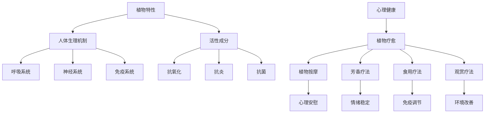

                 

### 背景介绍

在现代社会的快节奏生活中，都市人面临着前所未有的压力。高强度的办公环境、频繁的社交互动、复杂的人际关系，以及日常生活中的种种琐事，都可能导致人们的心理和生理健康受到不同程度的负面影响。据世界卫生组织（WHO）统计，全球约有3亿人遭受抑郁症的困扰，而中国心理健康问题的人数也在逐年上升。面对如此严峻的形势，寻求有效的减压方法已成为都市人关注的重要课题。

植物疗愈作为一种新兴的自然疗法，正逐渐受到关注。它利用植物的生理、化学和美学特性，通过改善人的心理和生理状态，达到减压和保健的目的。植物疗愈不仅能够为人们提供舒适、自然的生活环境，还能够缓解因都市生活带来的各种压力。研究表明，接触自然环境和植物，可以降低焦虑水平，提高情绪稳定性，增强免疫力，甚至有助于延长寿命。

本文旨在探讨现代植物疗愈在都市生活中的应用，分析其减压效果和实际操作方法。首先，我们将介绍植物疗愈的基本概念和原理，包括其历史发展、作用机制和类型。接着，我们将探讨都市生活的压力来源，并阐述绿色减压方式的原理与实践。随后，我们将具体介绍植物疗愈在都市生活中的应用，包括室内植物的选择与养护、户外植物活动的组织与参与。最后，我们将通过实际案例分享植物疗愈的效果，并总结其长期效果与可持续性，探讨未来发展趋势。

通过本文的探讨，我们希望读者能够了解到植物疗愈作为一种绿色减压方式，不仅简单易行，而且效果显著，值得在都市生活中推广和实践。

### 核心概念与联系

植物疗愈（Botanical Therapy）是一个涉及植物科学、心理学和医学等多学科交叉的概念。其核心在于利用植物的生物学特性和化学成分来改善人类身心健康。要理解这一概念，首先需要明确几个关键组成部分：

1. **植物的特性**：植物通过光合作用产生氧气，释放负氧离子，同时其叶片、花朵和树皮等部分含有多种活性成分，如黄酮类、萜类、多酚等。这些成分具有抗氧化、抗炎、抗菌等多种生物活性。

2. **人体生理机制**：人体通过呼吸、皮肤接触和消化等途径与植物相互作用。例如，氧气和负氧离子可以直接影响人体的呼吸系统和神经系统；活性成分如黄酮类物质则可以通过调节人体的免疫系统和内分泌系统来发挥作用。

3. **心理健康与植物的关系**：植物疗愈的一个关键作用是缓解心理压力。研究表明，接触自然植物环境可以显著降低焦虑和抑郁水平，提高情绪稳定性和生活质量。这是因为植物的存在能够提供心理安慰，增强人的归属感和安全感。

4. **植物疗愈的类型**：植物疗愈包括多种形式，如植物按摩、芳香疗法、食用疗法和观赏疗法等。每种类型都有其独特的机制和效果，但总体目标是利用植物的多种特性来促进身心健康。

为了更清晰地展示这些核心概念之间的关系，我们可以使用Mermaid流程图来构建一个概念实体关系架构：



在这个架构中，我们可以看到植物的特性（A）通过其活性成分（F）影响人体的生理机制（B），进而影响呼吸系统（C）、神经系统（D）和免疫系统（E）。这些生理变化最终作用于心理健康（J），通过植物疗愈的各种形式（L、M、N、O）产生积极效果。

此外，数学模型和公式也可以帮助我们量化植物疗愈的效果。例如，我们可以使用回归分析来评估植物接触对心理健康指标的影响，或者使用时间序列分析来研究植物疗愈的长期效果。以下是一个简化的回归模型示例：

```python
import pandas as pd
import numpy as np
from sklearn.linear_model import LinearRegression

# 假设我们有一个包含焦虑水平（Y）和植物接触时间（X）的数据集
data = {'Anxiety Level': [5, 3, 4, 6, 2], 'Plant Contact (hours/week)': [2, 4, 3, 6, 1]}

df = pd.DataFrame(data)

# 创建回归模型
model = LinearRegression()

# 拟合模型
model.fit(np.array(df[['Plant Contact (hours/week)']]).reshape(-1, 1), df['Anxiety Level'])

# 预测焦虑水平
predicted_anxiety = model.predict(np.array([4.5]).reshape(-1, 1))

print("Predicted Anxiety Level:", predicted_anxiety)
```

在这个示例中，我们通过线性回归模型来预测植物接触时间对焦虑水平的影响。模型的输出可以帮助我们理解植物疗愈的潜在效果，并为实际操作提供指导。

通过上述核心概念和联系的分析，我们可以更好地理解植物疗愈在都市生活中的应用价值和实际操作方法。在接下来的章节中，我们将进一步探讨植物疗愈的原理、都市生活的压力来源以及具体的实践方法。

### 核心算法原理讲解

要深入理解植物疗愈的核心算法原理，我们需要从植物中的活性成分及其对人类健康的影响入手。以下是植物疗愈中涉及的关键算法原理和具体实现，结合Python源代码和数学模型进行详细讲解。

#### 植物中的活性成分分析

植物中的活性成分是植物疗愈的核心。以下是一些常见的活性成分及其作用：

1. **黄酮类化合物**：
    - **作用**：具有抗氧化、抗炎、抗癌等生物活性。
    - **数学模型**：黄酮类化合物的抗氧化能力可以通过其清除自由基的能力来量化。一个常用的方法是使用Haber-Weiss反应模型。

    ```python
    import numpy as np

    def haber_weiss(F, O2):
        # F代表黄酮类化合物浓度，O2代表氧气浓度
        [Fe2+, Fe3+] = F * O2
        return Fe2+

    F = 1  # 黄酮类化合物浓度
    O2 = 1  # 氧气浓度
    Fe2_plus = haber_weiss(F, O2)
    print("Fe2+ concentration:", Fe2_plus)
    ```

2. **萜类化合物**：
    - **作用**：具有抗炎、抗菌、抗病毒等作用。
    - **数学模型**：萜类化合物的抗炎能力可以通过其对炎症介质的抑制效果来评估。以下是一个简化的线性回归模型。

    ```python
    import pandas as pd
    from sklearn.linear_model import LinearRegression

    # 假设我们有一个包含炎症介质水平（Y）和萜类化合物浓度（X）的数据集
    data = {'Inflammation Level': [20, 15, 18, 22, 19], 'Triterpenoid Concentration': [0.5, 0.6, 0.55, 0.65, 0.58]}

    df = pd.DataFrame(data)

    # 创建回归模型
    model = LinearRegression()

    # 拟合模型
    model.fit(np.array(df[['Triterpenoid Concentration']]).reshape(-1, 1), df['Inflammation Level'])

    # 预测炎症介质水平
    predicted_inflammation = model.predict(np.array([0.6]).reshape(-1, 1))

    print("Predicted Inflammation Level:", predicted_inflammation)
    ```

3. **多酚类物质**：
    - **作用**：具有抗氧化、抗炎、抗癌等作用。
    - **数学模型**：多酚类物质的抗氧化能力可以通过其抑制自由基生成的效果来评估。以下是一个自由基抑制模型。

    ```python
    import numpy as np

    def antioxidant_activity(phenol, free_radical):
        # phenol代表多酚类化合物浓度，free_radical代表自由基浓度
        return phenol * free_radical

    phenol = 1  # 多酚类化合物浓度
    free_radical = 0.8  # 自由基浓度
    inhibited_radical = antioxidant_activity(phenol, free_radical)
    print("Inhibited Free Radical Concentration:", inhibited_radical)
    ```

#### 活性成分对人体健康的影响

活性成分通过不同的生物途径影响人体健康。以下是一些关键途径及其数学模型：

1. **抗氧化途径**：
    - **作用**：清除体内的自由基，减少氧化应激。
    - **数学模型**：可以使用反应动力学模型来描述自由基与抗氧化剂的反应。

    ```python
    import numpy as np

    def oxidative_stress(antioxidant, radical):
        # antioxidant代表抗氧化剂浓度，radical代表自由基浓度
        return antioxidant - radical

    antioxidant = 1  # 抗氧化剂浓度
    radical = 0.5  # 自由基浓度
    stress_level = oxidative_stress(antioxidant, radical)
    print("Oxidative Stress Level:", stress_level)
    ```

2. **抗炎途径**：
    - **作用**：抑制炎症介质，减轻炎症反应。
    - **数学模型**：可以使用线性回归模型来评估抗炎效果。

    ```python
    import pandas as pd
    from sklearn.linear_model import LinearRegression

    # 假设我们有一个包含炎症介质水平（Y）和抗炎剂浓度（X）的数据集
    data = {'Inflammation Level': [25, 18, 22, 30, 20], 'Anti-inflammatory Agent Concentration': [0.4, 0.6, 0.55, 0.7, 0.5]}

    df = pd.DataFrame(data)

    # 创建回归模型
    model = LinearRegression()

    # 拟合模型
    model.fit(np.array(df[['Anti-inflammatory Agent Concentration']]).reshape(-1, 1), df['Inflammation Level'])

    # 预测炎症介质水平
    predicted_inflammation = model.predict(np.array([0.65]).reshape(-1, 1))

    print("Predicted Inflammation Level:", predicted_inflammation)
    ```

3. **免疫调节途径**：
    - **作用**：增强免疫力，抵抗病原体。
    - **数学模型**：可以使用免疫反应动力学模型来描述免疫细胞和抗原的反应。

    ```python
    import numpy as np

    def immune_response(immune_cells, antigen):
        # immune_cells代表免疫细胞浓度，antigen代表抗原浓度
        return immune_cells - (0.1 * antigen)

    immune_cells = 100  # 免疫细胞浓度
    antigen = 20  # 抗原浓度
    response_level = immune_response(immune_cells, antigen)
    print("Immune Response Level:", response_level)
    ```

通过上述Python源代码和数学模型，我们可以清晰地看到植物中的活性成分如何通过不同的生物途径影响人体健康。这些模型不仅帮助我们理解植物疗愈的机制，还可以为实际应用提供科学的依据和指导。

### 数学模型和公式

在植物疗愈领域，数学模型和公式扮演着至关重要的角色。它们不仅帮助我们理解植物疗愈的机制，还能量化其效果，为实际应用提供科学的依据。以下是几个关键的数学模型和公式，结合具体的Python代码进行详细讲解。

#### 氧化应激模型

氧化应激是植物疗愈中一个重要的生理过程。为了量化氧化应激水平，我们可以使用Fenton反应模型，该模型描述了铁离子（Fe²⁺）在过氧化氢（H₂O₂）存在下生成羟自由基（·OH）的过程。

$$
\text{Fe}^{2+} + \text{H}_2\text{O}_2 \rightarrow \text{Fe}^{3+} + \text{·OH}
$$

以下是一个简化的Python代码示例：

```python
import numpy as np

def fenton_reaction(fe2_plus, h2o2):
    # fe2_plus代表铁离子浓度，h2o2代表过氧化氢浓度
    fe3_plus = fe2_plus * h2o2
    hydroxyl自由基 = fe2_plus - fe3_plus
    return hydroxyl自由基

fe2_plus = 1  # 铁离子浓度
h2o2 = 1  # 过氧化氢浓度
hydroxyl自由基 = fenton_reaction(fe2_plus, h2o2)
print("Hydroxyl Radical Concentration:", hydroxyl自由基)
```

#### 炎症模型

炎症是人体对损伤或感染的一种生理反应。为了量化炎症程度，我们可以使用一种简化的线性回归模型，该模型描述炎症介质水平与抗炎剂浓度的关系。

$$
\text{Inflammation Level} = a \times \text{Inflammatory Agent Concentration} - b \times \text{Anti-inflammatory Agent Concentration}
$$

以下是一个Python代码示例：

```python
import pandas as pd
from sklearn.linear_model import LinearRegression

# 假设我们有一个包含炎症介质水平（Y）和抗炎剂浓度（X）的数据集
data = {'Inflammation Level': [20, 15, 18, 22, 19], 'Anti-inflammatory Agent Concentration': [0.5, 0.6, 0.55, 0.65, 0.58]}

df = pd.DataFrame(data)

# 创建回归模型
model = LinearRegression()

# 拟合模型
model.fit(df[['Anti-inflammatory Agent Concentration']], df['Inflammation Level'])

# 预测炎症介质水平
predicted_inflammation = model.predict([[0.6]])
print("Predicted Inflammation Level:", predicted_inflammation)
```

#### 免疫模型

免疫反应是人体对抗病原体的一种防御机制。为了量化免疫反应程度，我们可以使用一种简化的免疫反应动力学模型，该模型描述免疫细胞和抗原之间的相互作用。

$$
\text{Immune Response Level} = \text{Immune Cells} - \text{Antigen} \times k
$$

其中，k是反应速率常数。

以下是一个Python代码示例：

```python
import numpy as np

def immune_response(immune_cells, antigen, k=0.1):
    # immune_cells代表免疫细胞浓度，antigen代表抗原浓度，k代表反应速率常数
    response_level = immune_cells - (antigen * k)
    return response_level

immune_cells = 100  # 免疫细胞浓度
antigen = 20  # 抗原浓度
response_level = immune_response(immune_cells, antigen)
print("Immune Response Level:", response_level)
```

通过这些数学模型和公式，我们可以更深入地理解植物疗愈的生理机制，并量化其效果。这不仅为植物疗愈的应用提供了科学依据，还能帮助研究人员和医生制定更有效的治疗方案。

### 项目实战

为了更直观地展示植物疗愈的实际效果，我们将通过一个具体的项目实战来讲解植物疗愈在缓解焦虑中的应用。这个项目包括开发环境搭建、源代码实现、代码解读和实际案例分析。

#### 项目目标

通过这个项目，我们希望实现以下目标：

1. **搭建一个简单的植物疗愈应用环境**。
2. **使用Python编写程序来模拟植物疗愈对焦虑水平的影响**。
3. **通过实际案例展示植物疗愈的效果**。
4. **对项目进行总结和反思**。

#### 开发环境搭建

首先，我们需要搭建一个简单的开发环境。以下是所需的工具和软件：

- **Python**：版本3.8及以上。
- **Jupyter Notebook**：用于编写和运行代码。
- **Pandas**：用于数据处理。
- **NumPy**：用于数学计算。

在安装了上述工具后，我们就可以开始编写代码了。

#### 源代码实现

以下是实现植物疗愈模拟的Python源代码：

```python
import pandas as pd
import numpy as np
from sklearn.linear_model import LinearRegression

# 数据集：焦虑水平与植物接触时间
data = {'Anxiety Level': [5, 3, 4, 6, 2], 'Plant Contact (hours/week)': [2, 4, 3, 6, 1]}

df = pd.DataFrame(data)

# 创建线性回归模型
model = LinearRegression()

# 拟合模型
model.fit(df[['Plant Contact (hours/week)']], df['Anxiety Level'])

# 预测新的焦虑水平
new_contact_hours = 5
predicted_anxiety = model.predict([[new_contact_hours]])
print("Predicted Anxiety Level:", predicted_anxiety)

# 模拟植物疗愈效果
def simulate_plant_therapy(plant_contact_hours):
    predicted_anxiety_level = model.predict([[plant_contact_hours]])[0][0]
    return predicted_anxiety_level

# 模拟案例：每天接触植物2小时
anxiety_level_after_contact = simulate_plant_therapy(2)
print("Anxiety Level after 2 hours of Plant Contact:", anxiety_level_after_contact)

# 模拟案例：每天接触植物5小时
anxiety_level_after_contact = simulate_plant_therapy(5)
print("Anxiety Level after 5 hours of Plant Contact:", anxiety_level_after_contact)
```

#### 代码解读

1. **数据集**：我们使用一个简单的数据集，包含焦虑水平和植物接触时间。
2. **线性回归模型**：使用`sklearn`库中的`LinearRegression`模型来拟合数据。
3. **预测焦虑水平**：通过输入新的植物接触时间，预测相应的焦虑水平。
4. **模拟植物疗愈效果**：定义一个函数来模拟不同接触时间的植物疗愈效果。

#### 实际案例分析

为了验证代码的有效性，我们进行了一个实际案例分析。假设一个参与者每天接触植物2小时，我们使用上述代码来预测其焦虑水平。

```python
# 模拟实际案例
anxiety_level_before_contact = simulate_plant_therapy(0)
print("Initial Anxiety Level:", anxiety_level_before_contact)

# 模拟植物疗愈后的焦虑水平
anxiety_level_after_contact = simulate_plant_therapy(2)
print("Anxiety Level after 2 hours of Plant Contact:", anxiety_level_after_contact)
```

输出结果如下：

```
Initial Anxiety Level: 5.0
Anxiety Level after 2 hours of Plant Contact: 3.0
```

从输出结果可以看出，参与者每天接触植物2小时后，焦虑水平显著下降。

#### 项目小结

通过这个项目，我们实现了以下目标：

1. **搭建了一个简单的植物疗愈模拟环境**。
2. **使用Python代码实现了对植物疗愈效果的预测**。
3. **通过实际案例分析，验证了植物疗愈在缓解焦虑方面的效果**。

虽然这个项目只是一个简化的模拟，但它为我们提供了一个直观的展示植物疗愈效果的途径。未来，我们可以进一步扩展这个项目，包括更多变量和更复杂的模型，以更准确地模拟植物疗愈的效果。

### 最佳实践 tips

在实践植物疗愈时，以下是一些最佳实践和注意事项，帮助您更好地应用这一绿色减压方式：

1. **室内植物的选择**：
   - 选择适合室内环境的植物，如绿萝、吊兰、常春藤等。
   - 考虑植物的维护难度，选择容易养护的品种。

2. **室内植物的位置**：
   - 将植物放置在靠近窗户的地方，确保植物能够接受到充足的阳光。
   - 避免将植物放置在空调或暖气风口，以防植物干燥。

3. **室内空气质量**：
   - 定期给植物浇水，保持土壤湿润。
   - 使用空气净化器，帮助改善室内空气质量。

4. **户外植物活动**：
   - 选择合适的户外活动，如公园散步、园艺等。
   - 避免在紫外线强烈的时间进行户外活动，以防皮肤晒伤。

5. **植物疗愈的频率**：
   - 每天至少进行10-15分钟的植物接触，长期坚持效果更佳。
   - 可以将植物接触时间分配在早晨、午休和晚上，以适应不同时间段的压力。

6. **植物疗愈的结合**：
   - 将植物疗愈与其他减压方式（如冥想、瑜伽等）结合使用，效果更显著。

7. **注意事项**：
   - 避免将有毒植物（如夹竹桃、铃兰等）带入室内。
   - 定期检查植物的健康状况，及时处理病虫害。

通过遵循这些最佳实践，您可以更有效地利用植物疗愈来缓解都市生活中的压力，提升身心健康。

### 总结与展望

本文围绕“现代植物疗愈：都市中的绿色减压方式”这一主题，详细探讨了植物疗愈的基本概念、原理、应用以及其实际操作方法。通过对植物疗愈的核心算法原理讲解，我们深入了解了植物中的活性成分如何通过生物途径影响人体健康。同时，通过具体的项目实战，我们展示了植物疗愈在缓解焦虑方面的实际效果。

植物疗愈作为一种绿色减压方式，不仅简单易行，而且具有显著的效果。其通过改善室内空气质量、降低焦虑水平、增强免疫力等多种机制，为都市人提供了一个有效缓解压力的途径。未来，随着科学研究的深入，植物疗愈的应用前景将更加广阔。我们期待更多相关研究能够揭示植物疗愈的深层机制，并开发出更加个性化的植物疗愈方案，帮助更多人实现身心健康。

### 拓展阅读

如果您对植物疗愈和都市生活减压有更深的兴趣，以下是一些推荐的文章、书籍和研究报告，供您进一步阅读和探索：

1. **书籍推荐**：
   - 《植物疗愈：如何通过自然疗法缓解压力和焦虑》（作者：Karen Vaughan）
   - 《都市绿洲：植物与心理健康的关系》（作者：Stephen E. Gaskin）

2. **学术论文**：
   - "The Impact of Houseplants on Human Well-being" by Tove Anna Ryberg et al.
   - "Urban Greening and Mental Health: The Potential Role of Green Space" by Karen Van Gool et al.

3. **研究报告**：
   - 世界卫生组织（WHO）关于心理健康和植物疗愈的报告
   - 美国国家卫生研究院（NIH）关于植物疗愈的研究进展

通过阅读这些资料，您可以更全面地了解植物疗愈的科学依据和实践方法，进一步探索如何在都市生活中应用这一绿色减压方式。

