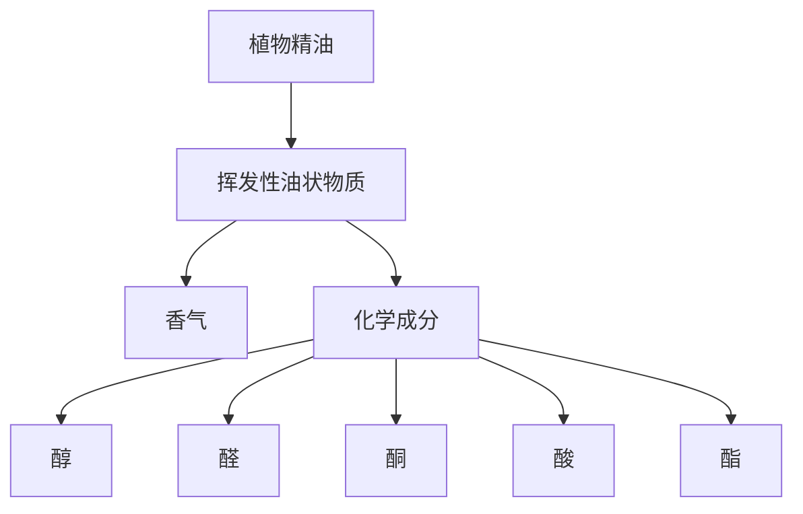
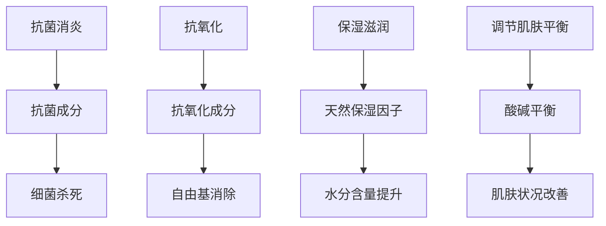

                 

### 现代植物精油萃取：都市芳疗师的天然护肤工作坊

#### 关键词
- 植物精油萃取
- 芳疗护肤
- 天然护肤
- 都市生活
- 精油工作坊

#### 摘要
本文将深入探讨现代植物精油萃取技术及其在都市芳疗护肤中的应用。我们将从植物精油的基础知识开始，逐步介绍其萃取方法、芳疗护肤原理和应用，并通过具体案例展示如何设计一个精油护肤工作坊。本文旨在为都市生活中的芳疗师和护肤爱好者提供实用指南，帮助他们在繁忙的生活中找到天然、有效的护肤方式。

## 引言

在现代快节奏的都市生活中，人们越来越注重健康和自然的生活方式。植物精油作为一种天然、有效的护肤成分，正逐渐受到人们的青睐。现代植物精油萃取技术的发展，使得我们能够以更高的纯度和效率提取植物中的精华，为芳疗护肤提供了坚实的基础。

### 植物精油萃取的历史背景

植物精油萃取的历史可以追溯到古埃及时期。那时，人们就已经开始利用蒸馏、压榨等方法提取植物精油，用于医疗和香薰。随着时间的推移，萃取技术不断进步，现代植物精油萃取方法主要包括水蒸气蒸馏、冷压法、溶剂萃取等。

### 芳疗护肤的兴起与发展

芳疗护肤是一门结合植物精油和生理学的科学，旨在通过自然方式改善肌肤健康。近年来，随着对植物精油的研究不断深入，芳疗护肤在化妆品和护肤行业中的应用越来越广泛。现代科技的发展，也使得精油提取更加精确，有效成分的纯度和活性得到了显著提升。

### 本书的目的与结构

本书旨在介绍现代植物精油萃取技术及其在都市芳疗护肤中的应用。我们将从植物精油的基础知识开始，逐步介绍萃取方法、芳疗护肤原理和应用，并通过具体案例展示如何设计一个精油护肤工作坊。本书结构如下：

1. **引言**：介绍植物精油萃取的背景和芳疗护肤的重要性。
2. **植物精油基础**：介绍植物精油的基本概念、化学成分、种类等。
3. **精油萃取技术**：详细讲解不同萃取方法及其优缺点。
4. **芳疗护肤应用**：探讨植物精油在护肤中的具体应用。
5. **工作坊实践**：提供具体的精油护肤工作坊案例。
6. **附录**：附加一些实用信息，如精油配方、工具材料列表等。

## 植物精油基础

### 核心概念与联系

植物精油是由植物的花、叶、茎、根等部位提取的挥发性油状物质。它们通常具有独特的香气和丰富的化学成分，包括醇、醛、酮、酸、酯等。植物精油不仅具有独特的香气，还具有广泛的生理活性，如抗菌、抗炎、抗氧化、保湿等。

以下是植物精油的基本概念和它们之间的联系：



### 植物精油的种类

植物精油种类繁多，根据植物来源和化学成分可以分为以下几类：

1. **按植物来源分类**：
   - **花类精油**：如玫瑰精油、薰衣草精油。
   - **叶类精油**：如迷迭香精油、薄荷精油。
   - **茎类精油**：如薰衣草茎精油。
   - **根类精油**：如檀香精油。

2. **按化学性质分类**：
   - **单萜烯类**：如薄荷油、尤加利油。
   - **倍半萜烯类**：如薰衣草油、茶树油。
   - **芳香醇类**：如玫瑰精油、橙花精油。
   - **酸类**：如柠檬精油、橙皮精油。

## 精油萃取技术

### 核心算法原理讲解

不同的植物精油萃取方法具有各自的原理和特点。以下是几种常见的萃取方法及其原理：

1. **水蒸气蒸馏**：
   - **原理**：利用水蒸气将植物中的精油分子蒸发，然后冷却凝结成液体。
   - **优点**：萃取效率高，能保留精油中的挥发性成分。
   - **应用**：适用于大部分植物精油的提取。

2. **冷压法**：
   - **原理**：通过机械压榨将植物中的精油挤出。
   - **优点**：保持精油的原有结构和活性。
   - **应用**：适用于柑橘类果皮精油的提取。

3. **溶剂萃取**：
   - **原理**：使用有机溶剂溶解植物中的精油成分，然后通过蒸馏等方法分离。
   - **优点**：萃取深度高，能提取出难以蒸馏的精油。
   - **应用**：适用于高倍浓缩的精油提取。

以下是水蒸气蒸馏的Python代码示例，用于计算萃取时间和温度：

```python
# 水蒸气蒸馏时间与温度计算

def calculate_distillation_time(temperature):
    # 假设萃取时间与温度呈线性关系
    time_coefficient = 0.1
    time = temperature * time_coefficient
    return time

# 示例计算
temperature = 100  # 摄氏度
distillation_time = calculate_distillation_time(temperature)
print(f"在{temperature}℃下，萃取时间预计为：{distillation_time}小时")
```

### 精油萃取技术的比较

以下是不同萃取方法的优缺点分析：

| 萃取方法 | 优点 | 缺点 |
| --- | --- | --- |
| 水蒸气蒸馏 | 萃取效率高，能保留精油中的挥发性成分 | 成本较高，设备要求严格 |
| 冷压法 | 保持精油的原有结构和活性 | 适用于柑橘类果皮精油，其他植物不适用 |
| 溶剂萃取 | 萃取深度高，能提取出难以蒸馏的精油 | 有机溶剂残留问题，处理复杂 |

### 精油萃取技术的选择

选择萃取方法时，应考虑以下因素：

1. **植物类型**：不同植物适合不同的萃取方法。
2. **成本和效率**：根据预算和萃取需求选择合适的萃取方法。
3. **环保要求**：考虑萃取过程中对环境的影响。

## 芳疗护肤应用

### 护肤原理

植物精油在护肤中的效果主要体现在以下几个方面：

1. **抗菌消炎**：许多植物精油具有抗菌消炎作用，如薰衣草精油、茶树精油。
2. **抗氧化**：植物精油中的抗氧化成分能有效抵御自由基，延缓衰老。
3. **保湿滋润**：植物精油中的天然保湿因子能改善肌肤的水分含量。
4. **调节肌肤平衡**：植物精油能调节肌肤的酸碱平衡，改善肌肤状况。

以下是植物精油在护肤中的核心原理：



### 应用实例

以下是几种常见的植物精油护肤配方：

1. **抗菌消炎面膜**：
   - 材料：薰衣草精油2滴，茶树精油1滴，甘油适量。
   - 步骤：将精油与甘油混合，涂抹在面部，保持10-15分钟，然后洗净。

2. **抗氧化紧致面膜**：
   - 材料：玫瑰精油3滴，橙花精油2滴，蜂蜜适量。
   - 步骤：将精油与蜂蜜混合，涂抹在面部，轻轻按摩，保持20分钟，然后洗净。

3. **保湿滋润面膜**：
   - 材料：薰衣草精油2滴，甜杏仁油10毫升。
   - 步骤：将精油与甜杏仁油混合，涂抹在面部，轻轻按摩，保持15分钟，然后洗净。

### 精油护肤的注意事项

1. **浓度控制**：精油浓度不宜过高，以免引起皮肤刺激。
2. **敏感性测试**：首次使用前，应在手臂内侧进行敏感性测试。
3. **避免直射**：使用精油后，避免长时间暴露在阳光下。

## 工作坊实践

### 工作坊设计

一个典型的精油护肤工作坊应包括以下几个步骤：

1. **准备工作**：
   - 准备精油、基础油、工具等材料。
   - 整理工作区域，确保清洁、安全。

2. **操作步骤**：
   - 向参与者介绍精油护肤的基本知识和注意事项。
   - 进行实际操作演示，如制作薰衣草保湿面膜。
   - 分组进行实操，指导参与者完成自己的护肤产品。

3. **效果评估**：
   - 观察参与者的肌肤反应，收集反馈。
   - 根据反馈调整配方和操作步骤。

### 实际案例

以下是一个精油护肤工作坊的实际案例：

**工作坊主题**：薰衣草保湿面膜制作

**参与者**：10位护肤爱好者

**操作步骤**：
1. **准备工作**：提供薰衣草精油、甜杏仁油、面膜纸、勺子等工具和材料。
2. **讲解和演示**：向参与者介绍薰衣草精油的功效、保湿面膜的制作方法和注意事项。
3. **实操**：分组进行面膜制作，指导参与者将薰衣草精油与甜杏仁油混合，浸泡面膜纸，敷在面部。
4. **效果评估**：观察参与者的肌肤反应，收集反馈。大部分参与者表示面膜具有良好的保湿效果，但少数人表示对薰衣草精油有轻微过敏反应。

**项目小结**：

本次工作坊成功地为参与者提供了实用的精油护肤知识，并让他们亲自体验了精油面膜的制作过程。通过实际操作，参与者不仅学会了如何制作薰衣草保湿面膜，还了解了精油护肤的基本原理。工作坊的反馈显示，大部分参与者对工作坊的效果表示满意，但需要进一步优化配方和操作步骤，以减少过敏反应。

## 附录

### 精油配方集

以下是几种常用的精油配方：

1. **抗菌消炎面膜**：
   - 材料：薰衣草精油2滴，茶树精油1滴，甘油适量。
   - 步骤：将精油与甘油混合，涂抹在面部，保持10-15分钟，然后洗净。

2. **抗氧化紧致面膜**：
   - 材料：玫瑰精油3滴，橙花精油2滴，蜂蜜适量。
   - 步骤：将精油与蜂蜜混合，涂抹在面部，轻轻按摩，保持20分钟，然后洗净。

3. **保湿滋润面膜**：
   - 材料：薰衣草精油2滴，甜杏仁油10毫升。
   - 步骤：将精油与甜杏仁油混合，涂抹在面部，轻轻按摩，保持15分钟，然后洗净。

### 工具材料列表

以下是制作精油护肤产品所需的基本工具和材料：

- **工具**：
  - 倒模杯
  - 电子秤
  - 剪刀
  - 搅拌棒
  - 玻璃容器

- **材料**：
  - 精油
  - 基础油
  - 面膜纸
  - 蜂蜜
  - 甘油

### 最佳实践 tips

1. **选择优质精油**：选择有信誉的品牌和产地，确保精油的质量和纯度。
2. **个性化配方**：根据个人肤质和需求，调整精油配方。
3. **定期清洁**：保持工作区域的清洁，避免细菌滋生。

### 小结

本文从植物精油萃取的背景和芳疗护肤的重要性出发，系统地介绍了植物精油的基础知识、萃取技术、护肤应用和工作坊实践。通过本文，读者可以了解现代植物精油萃取技术及其在都市芳疗护肤中的应用，掌握精油护肤的基本原理和操作方法。希望本文能为都市生活中的护肤爱好者提供实用的指南，帮助他们找到适合自己的天然护肤方式。

### 注意事项

1. **安全性**：在使用精油护肤时，务必进行敏感性测试，避免过敏反应。
2. **浓度控制**：精油浓度不宜过高，以免对皮肤造成刺激。
3. **正确使用**：遵循精油的使用方法和时间，确保护肤效果。

### 拓展阅读

1. 《植物精油护肤全书》
2. 《芳香疗法实践指南》
3. 《精油按摩疗法》

作者：AI天才研究院/AI Genius Institute & 禅与计算机程序设计艺术 /Zen And The Art of Computer Programming

