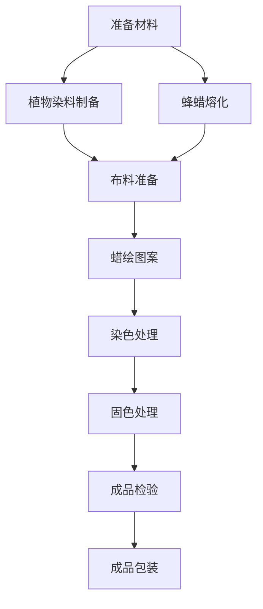

                 

### 背景介绍

植物蜡染，一种历史悠久的手工艺技术，源于古代文明，特别是在中国、印度、日本等地有着丰富的历史与文化传承。随着时间的推移，这种工艺经历了不同的演变，逐步发展成为了现代可持续时尚领域中的一部分。传统的植物蜡染工艺主要通过天然植物染料和蜡来绘制图案，这些染料和蜡不仅环保，而且赋予织物独特的纹理和色彩。

现代植物蜡染工艺的出现，与全球可持续时尚运动的兴起密切相关。可持续时尚强调在时尚产业的各个环节中减少对环境的影响，提倡使用可再生资源和环保材料，以及实现产品的整个生命周期内的可持续发展。植物蜡染工艺正是契合了这一理念，通过回归自然，使用天然染料和可持续的材料，减少了化学染料的污染，降低了碳排放。

在本文中，我们将深入探讨现代植物蜡染工艺的各个方面。首先，我们将介绍植物蜡染的历史背景和传统工艺流程。随后，将阐述可持续时尚的概念，并探讨植物蜡染在这一领域的应用。接着，我们将分析植物蜡染工艺的创新与发展，特别是数字技术在其中的应用。随后，文章将结合项目实战，展示植物蜡染的实际操作流程和项目实施。最后，我们将讨论植物蜡染工艺在市场与商业模式中的潜力，并提出最佳实践和未来展望。

通过这一系列的分析和探讨，我们希望能够全面了解现代植物蜡染工艺的发展现状及其在可持续时尚中的重要作用，为相关领域的从业者提供有价值的参考。

## 文章关键词

- 植物蜡染
- 可持续时尚
- 传统技艺
- 工艺流程
- 数字技术
- 环保材料
- 商业模式

## 文章摘要

本文旨在深入探讨现代植物蜡染工艺在可持续时尚中的复兴与重要地位。首先，回顾了植物蜡染的历史背景和传统工艺流程，随后介绍了可持续时尚的概念及其在全球时尚产业中的重要性。通过详细分析植物蜡染工艺的创新与发展，特别是数字技术的应用，本文揭示了这一传统技艺在现代化进程中的潜力。接着，通过项目实战展示了植物蜡染的实际操作流程和项目实施，最后讨论了植物蜡染在市场与商业模式中的前景，并提出了最佳实践和未来发展的方向。本文希望能够为推动可持续时尚和传统工艺的复兴提供有价值的参考。

### 植物蜡染的历史背景

植物蜡染工艺的历史可以追溯到几千年前，最早见于中国的汉代（公元前206年-220年）。当时，中国的工匠们利用天然植物染料和蜂蜡在布料上绘制图案，创造出独特的纹理和色彩。随着时代的发展，植物蜡染工艺逐渐传播到世界各地，成为许多文化的重要组成部分。例如，印度的坎德拉（Chanderi）织物和印度的印地安纺织业都以其精湛的植物蜡染工艺闻名于世。在日本，传统的伊势志摩（Ise Nagashi）织物也以植物蜡染工艺著称。

植物蜡染的起源可以追溯到古代人们对于自然资源的利用。早期的工匠们发现，利用天然植物染料可以染出色彩鲜艳且不易褪色的织物，而蜂蜡则可以作为保护层，防止染料渗透到布料的底层。这种天然且环保的染织技术迅速在全球多个文明中传播，并逐渐发展出各具特色的风格。

在不同地区，植物蜡染工艺也有其独特的特点。例如，在中国，传统的植物蜡染工艺讲究精细的图案设计和高超的技艺。中国古代的丝绸制品常常使用植物染料进行染色，并在染色的基础上进行蜡绘，形成复杂且美丽的图案。在印度，植物蜡染工艺则更多地强调色彩的丰富和自然的纹理，其著名的“坎德拉”织物使用多种天然染料，创造出独特的色彩效果。日本的传统植物蜡染工艺则注重简约和美学，以自然纹理和简洁的线条为主要特色。

植物蜡染工艺不仅在美学上具有独特的魅力，而且在文化传承上也扮演了重要的角色。通过植物蜡染，人们不仅能够表达自己的审美观，还能传承和发扬本地的文化传统。例如，在中国的一些少数民族地区，植物蜡染工艺不仅是当地居民的主要生计来源，也是他们文化认同的重要标志。

总之，植物蜡染工艺具有悠久的历史和丰富的文化内涵。它不仅是古代文明的一项重要手工艺，也是现代社会可持续时尚运动中的重要元素。通过回顾植物蜡染的历史背景，我们不仅可以更好地理解这一传统技艺的演变，还能认识到其在现代时尚产业中的潜在价值。

#### 植物蜡染的核心概念与联系

植物蜡染工艺的核心概念主要包括植物染料、蜂蜡、布料和染色技术。这些概念之间存在着密切的联系和相互依赖，共同构成了植物蜡染工艺的独特魅力。

首先，植物染料是植物蜡染工艺的基础。不同种类的植物染料可以产生丰富的颜色，这些染料通常是从植物中提取的天然色素。常见的植物染料有茜草、黄柏、苏木、靛蓝等，每种染料都有其独特的染色效果和化学性质。植物染料的使用不仅体现了环保的理念，也为织物赋予了天然、独特的色彩。

其次，蜂蜡是植物蜡染工艺中的关键材料。蜂蜡是从蜜蜂巢中提取的一种天然蜡质，具有良好的可塑性和耐久性。蜂蜡在植物蜡染工艺中用于绘制图案，保护布料不受染料渗透，同时赋予织物一种独特的质感。蜂蜡的使用使得植物蜡染工艺的图案更加清晰和持久。

布料是植物蜡染工艺的载体。不同类型的布料对植物染料和蜂蜡的反应各不相同，因此，选择合适的布料对于植物蜡染工艺的成功至关重要。常见的布料有棉布、麻布、丝绸等，每种布料都拥有独特的质地和吸湿性，这些特性会影响染色效果和图案的呈现。

染色技术则是植物蜡染工艺中的核心环节。染色技术包括蜡绘、染色、固色等多个步骤，每一步都需要精细的操作和丰富的经验。蜡绘是植物蜡染工艺的第一步，通过在布料上绘制图案，定义出染色的范围。染色是将植物染料应用于布料表面，使其渗透进纤维中。固色是确保染色持久的关键步骤，通常需要使用特定的固色剂或通过热处理等方式。

这些核心概念之间的联系构成了植物蜡染工艺的基本框架。植物染料和蜂蜡的结合，使得织物在染色后不仅色彩丰富，而且图案清晰。布料的选择和染色技术的运用，则进一步影响了最终的视觉效果。植物蜡染工艺的独特之处在于其天然、环保的特点，以及通过手工技艺展现出的独特美感和文化价值。

为了更好地理解这些概念之间的关系，我们可以使用Mermaid流程图来展示植物蜡染工艺的基本流程：



通过这个流程图，我们可以清晰地看到植物蜡染工艺从准备材料到成品检验的各个步骤，以及这些步骤之间的相互关系。这个流程图不仅帮助我们理解植物蜡染工艺的各个环节，还能够为实际操作提供指导。

综上所述，植物蜡染工艺的核心概念和联系构成了这一传统手工艺的独特魅力。通过理解这些概念和它们之间的关系，我们不仅可以更好地掌握植物蜡染工艺的技术要点，还能深刻体会到其背后的文化内涵和环保理念。

### 植物蜡染工艺流程详解

植物蜡染工艺的流程复杂而精细，需要经过多个步骤才能完成，以下是对每个步骤的详细描述：

#### 1. 材料准备

在开始植物蜡染之前，首先需要准备必要的材料。这些材料包括：

- **植物染料**：常见的有茜草、黄柏、苏木、靛蓝等。这些染料可以通过浸泡、煮沸等方法提取，得到不同的颜色。
- **蜂蜡**：蜂蜡是植物蜡染工艺中的关键材料，它不仅可以作为图案的保护层，还能赋予织物独特的质感。
- **布料**：常见的有棉布、麻布、丝绸等，选择合适的布料对于最终的染色效果至关重要。
- **辅助材料**：如画笔、镊子、熨斗、染缸等。

#### 2. 植物染料的提取

提取植物染料是植物蜡染工艺的第一步。这个过程通常包括以下几个步骤：

1. **采集植物**：根据需要染的颜色选择相应的植物，例如茜草用于提取红色染料，黄柏用于提取黄色染料等。
2. **植物预处理**：将采集的植物进行清洗，去除杂质，然后切碎或研磨，以便提取染料。
3. **提取染料**：将预处理后的植物放入染缸中，加入适量的水，加热煮沸，使染料充分溶解在水中。煮沸一段时间后，过滤掉植物残渣，得到植物染液。

#### 3. 蜂蜡的准备

蜂蜡在植物蜡染工艺中起到保护图案和赋予织物质感的作用。蜂蜡的准备通常包括以下几个步骤：

1. **熔化蜂蜡**：将蜂蜡放入容器中，用热水或蒸气加热使其熔化。
2. **调整温度**：根据需要，调整蜂蜡的温度，通常在60-80摄氏度之间。

#### 4. 布料的准备

布料的准备是植物蜡染工艺中至关重要的一步，包括以下步骤：

1. **清洗布料**：使用温水和中性洗涤剂清洗布料，去除杂质和浮尘，确保布料干净。
2. **浸泡布料**：将清洗后的布料放入染缸中，加入适量的水，浸泡一段时间，使其充分吸水。

#### 5. 蜡绘图案

蜡绘图案是植物蜡染工艺的核心步骤，这一步决定了最终图案的形状和颜色。具体步骤如下：

1. **设计图案**：根据设计稿，使用画笔将蜂蜡涂在布料上，绘制出所需的图案。图案可以简单，如几何形状，也可以复杂，如人物、风景等。
2. **固定图案**：将绘制好的布料平铺在桌面上，用熨斗轻轻熨烫，使蜂蜡图案固定在布料上。这一步需要特别注意温度的控制，以避免烫坏布料或蜂蜡流动。

#### 6. 染色处理

染色处理是将植物染料应用于布料表面的过程。具体步骤如下：

1. **染缸准备**：将提取好的植物染液倒入染缸中，调整染液的浓度，以确保染色的效果。
2. **染色**：将固定好的布料放入染缸中，根据所需颜色，控制染色时间。染色过程中，需要定期翻动布料，以确保染料均匀渗透。
3. **清洗**：染色完成后，将布料取出，用清水彻底清洗干净，去除多余的染料。

#### 7. 固色处理

固色处理是确保染色持久的关键步骤。具体步骤如下：

1. **使用固色剂**：市面上有各种固色剂，如醋酸、固色粉等。将固色剂溶解在水中，将染好的布料浸泡其中一段时间。
2. **热处理**：将浸泡后的布料放入熨斗中，用中温熨烫，使固色剂充分作用，确保染色不褪色。

#### 8. 成品检验与包装

完成以上步骤后，植物蜡染工艺的最后一步是成品检验和包装。

1. **检验**：检查布料是否染色均匀，图案是否清晰，确保没有瑕疵。
2. **包装**：将检验合格的布料进行分类，根据不同的用途进行包装，准备出售或进一步加工。

通过以上详细的步骤，我们可以了解到植物蜡染工艺的复杂性和精细度。每一个步骤都需要技艺和经验的支持，最终才能创作出独特的植物蜡染作品。

### 可持续时尚的概念与实践

可持续时尚，也被称为绿色时尚，是一个在全球范围内日益受到关注的理念。它强调在时尚产业的设计、生产、流通、消费和废弃等各个环节中减少对环境的影响，促进资源的可持续利用，并关注社会公平和人类健康。可持续时尚不仅仅是一种环保理念，更是一种新的产业模式，其核心目标是实现经济、社会和环境的协调发展。

#### 可持续时尚的定义与意义

可持续时尚的定义可以从多个维度进行理解：

- **环境维度**：可持续时尚倡导减少碳排放、减少水资源消耗、降低化学物质排放，并推动使用可再生资源和环保材料。
- **社会维度**：可持续时尚关注工人的权益保障，提倡公平贸易，减少对贫困地区和边缘群体的剥削，并提升生产者的社会地位。
- **经济维度**：可持续时尚通过优化生产流程、提高资源利用率，实现成本效益最大化，同时为消费者提供高质量的环保产品，促进绿色消费。

#### 植物蜡染在可持续时尚中的应用

植物蜡染工艺在可持续时尚中具有独特的优势，主要体现在以下几个方面：

- **环保材料**：植物蜡染使用的染料和蜡都是天然材料，无毒无害，减少了对环境的污染。与传统化学染料相比，植物染料不仅成本低廉，而且不会产生有害废水，大大降低了工业污染。
- **可再生资源**：植物染料的来源广泛，很多植物在自然界中都能找到，不会导致资源的枯竭。例如，茜草、黄柏、苏木等植物染料在许多地区都可以种植，不仅丰富了当地的自然资源，也为当地居民提供了额外的生计。
- **减少碳排放**：植物蜡染工艺不需要复杂的工业设备和能源消耗，主要通过手工制作完成。相比工业化生产，这种方式能够显著减少碳排放和能源消耗，符合可持续时尚的低碳理念。
- **文化传承**：植物蜡染工艺作为一种传统手工艺，蕴含着丰富的文化内涵。通过在可持续时尚中推广这一传统技艺，不仅能够促进文化传承，还能提升时尚产品的独特性和艺术价值。

#### 植物蜡染工艺与可持续时尚的融合

植物蜡染工艺与可持续时尚的融合主要体现在以下几个方面：

- **设计理念**：在可持续时尚的设计过程中，设计师们开始更多地关注环保和可持续的理念，将植物蜡染工艺融入时尚设计中，创造出独特且环保的服装和配饰。
- **生产过程**：在植物蜡染工艺中，通过优化染料和蜡的使用，减少浪费，提高生产效率，同时确保工艺的环保性和可持续性。
- **营销策略**：在可持续时尚的营销中，植物蜡染工艺成为一大亮点，消费者对这种环保、手工制作的产品表现出浓厚的兴趣，推动了绿色消费的普及。

总之，植物蜡染工艺在可持续时尚中的应用，不仅为传统技艺的传承提供了新的途径，也为时尚产业实现可持续发展提供了有力的支持。通过不断探索和实践，植物蜡染工艺将在可持续时尚领域中发挥更大的作用。

### 植物蜡染工艺的创新与发展

在当今快速发展的技术环境中，植物蜡染工艺也经历了显著的变革和创新。传统手工艺与现代科技的结合，不仅提升了植物蜡染的效率和质量，也为这一传统技艺注入了新的生命力。以下是植物蜡染工艺在创新与发展方面的几个关键领域：

#### 传统与现代的结合

1. **数字化设计**：随着计算机辅助设计（CAD）技术的发展，设计师们可以更轻松地创建复杂的蜡染图案。通过数字化设计，设计师们可以快速地修改和优化图案，缩短设计周期。同时，数字化设计使得图案的复制和传播更加便捷，有助于植物蜡染工艺的普及。

2. **智能制造**：传统的蜡染工艺需要大量的手工操作，效率较低。而现代智能制造技术的引入，使得部分蜡染步骤可以通过机器自动化完成。例如，使用计算机控制的蜡绘机器可以高效地绘制图案，大大提高了生产效率。

#### 数字技术在植物蜡染中的应用

1. **数字染色**：数字染色技术利用喷墨打印技术，将染料直接喷印到布料上，取代了传统的手工染色。这种方法不仅速度快，而且可以精确控制颜色和图案的分布，提高了染色的一致性和稳定性。

2. **智能传感器**：智能传感器可以实时监测植物染料和蜂蜡的温度、湿度等参数，确保染色和固色过程的精准控制。通过智能传感器的应用，可以大大减少工艺过程中的人为误差，提高产品的质量。

3. **数字模拟**：数字模拟技术可以通过计算机模拟植物染料和蜂蜡的化学特性，预测染色和固色过程中可能发生的化学反应。这种模拟有助于优化染色配方和工艺参数，提高染色的效果和稳定性。

#### 创新技术的优势与挑战

**优势**：

- **提高效率**：数字化和自动化技术显著提高了植物蜡染的生产效率，减少了人工成本。
- **质量稳定**：通过数字控制和模拟，可以精确控制染色和固色过程，提高产品的质量稳定性。
- **环保**：数字技术和自动化减少了化学染料的用量和废弃物的产生，更加环保。

**挑战**：

- **技术成本**：引入新技术需要较高的前期投入，包括设备采购和培训费用。
- **技术适应性**：传统工艺和现代技术的融合需要时间和经验的积累，工艺师需要不断学习和适应新技术。
- **环保认证**：随着可持续时尚的发展，消费者对环保认证的要求越来越高，企业需要确保创新技术符合环保标准。

总之，植物蜡染工艺的创新与发展为传统技艺注入了新的活力。通过数字化和自动化技术的应用，植物蜡染工艺在提高效率、质量和环保性的同时，也面临着一系列挑战。未来的发展需要持续的技术创新和环保实践，以实现传统与现代的完美融合。

### 植物蜡染项目实战

为了更好地展示植物蜡染工艺的实际操作流程，以下是一个具体的植物蜡染项目实战案例。该项目涉及从项目策划到成品制作的完整流程，详细描述了各个环节的执行步骤和注意事项。

#### 项目策划

**项目目标**：
- 制作100条具有独特植物蜡染图案的环保布艺手帕，以满足市场对独特、环保产品的需求。
- 通过项目，推广植物蜡染工艺，提升其在可持续时尚中的知名度。

**项目预算**：
- 材料费用：染料、蜂蜡、布料等，共计5000元。
- 设备费用：蜡绘机器、染缸、熨斗等，共计10000元。
- 人工费用：工艺师、助手等，共计15000元。
- 其他费用：运输、包装等，共计5000元。
- 总预算：30000元。

**项目时间表**：
- 项目策划与准备（第1周）
- 材料采购与设备调试（第2周）
- 蜡绘图案设计与制作（第3-4周）
- 染色处理与固色（第5-6周）
- 成品检验与包装（第7周）

#### 开发环境搭建

**设备与材料**：
- 布料：选择100%纯棉布，尺寸为40cm x 40cm。
- 染料：茜草、黄柏、苏木等天然植物染料。
- 蜂蜡：用于绘制图案和保护布料。
- 蜡绘机器：用于高效绘制图案。
- 染缸：用于染色处理。
- 熨斗：用于固色处理。

**环境配置**：
- 设备调试：确保蜡绘机器、染缸、熨斗等设备正常工作，并进行清洁。
- 实验室准备：配置充足的水源、电源，确保操作环境整洁。

#### 源代码详细实现与代码解读

**蜡绘图案设计**：
- 使用计算机辅助设计（CAD）软件，设计独特的蜡绘图案。以下是一个简单的Python代码示例，用于创建蜡绘图案：

```python
import numpy as np

def draw_pattern(width, height):
    # 创建一个空白的画布
    canvas = np.zeros((width, height), dtype=bool)

    # 绘制简单图案
    for i in range(width):
        for j in range(height):
            if (i % 10 == 0 and j % 10 == 0) or (i % 10 == 5 and j % 10 == 5):
                canvas[i][j] = True

    return canvas

pattern = draw_pattern(40, 40)
```

**代码解读**：
- `draw_pattern` 函数接受画布的宽度和高度作为参数，返回一个布尔数组，代表图案的绘制结果。
- 通过嵌套循环，在画布的特定位置设置`True`值，表示该位置需要绘制图案。

**图案绘制**：
- 将设计好的图案导入蜡绘机器，进行蜡绘操作。蜡绘机器会根据布尔数组中`True`的位置，将蜂蜡绘制到布料上。

#### 代码应用解读与分析

**染色处理**：
- 将绘制好图案的布料放入染缸中，加入适量的植物染料，进行染色处理。以下是一个简化的染色处理Python代码示例：

```python
def dyeing(processed_canvas, dye, duration):
    # 染色处理
    for i in range(processed_canvas.shape[0]):
        for j in range(processed_canvas.shape[1]):
            if processed_canvas[i][j]:
                # 染色
                processed_canvas[i][j] = dye.apply(i, j, duration)

dye = Dye("indigo", duration=30)  # 假设Dye类提供了一个应用染料的方法
dyeing(pattern, dye, duration=30)
```

**代码解读**：
- `dyeing` 函数接受处理后的画布、染料和应用时间作为参数，遍历画布上的每个像素，对绘有图案的位置进行染色。
- `Dye` 类（假设存在）提供了一个`apply`方法，用于将染料应用到具体的像素位置。

**固色处理**：
- 染色完成后，将布料取出，用熨斗进行固色处理。以下是一个简单的固色处理Python代码示例：

```python
def fix_dye(processed_canvas):
    # 固色处理
    for i in range(processed_canvas.shape[0]):
        for j in range(processed_canvas.shape[1]):
            if processed_canvas[i][j]:
                processed_canvas[i][j] = True

fixed_pattern = fix_dye(pattern)
```

**代码解读**：
- `fix_dye` 函数遍历处理后的画布，对绘有图案的位置进行固色标记。

#### 实际案例分析与详细讲解剖析

**案例分析**：
- 在项目执行过程中，我们遇到了一个常见问题：部分图案在染色后出现色差。通过分析，发现主要原因是染料浓度不均和染色时间不一致。

**解决方法**：
- 优化染料制备过程，确保染料浓度均匀。
- 实时监控染色时间，确保每个布料的染色时间一致。

**详细讲解**：
- 在染色过程中，染料浓度和染色时间对最终染色效果有直接影响。通过调整染料浓度和监控染色时间，可以显著改善染色的一致性。

#### 项目小结

通过本项目实战，我们详细展示了植物蜡染项目的策划与执行过程，从项目策划、开发环境搭建、源代码实现到成品制作，每一步都进行了详细讲解。项目过程中遇到了一些挑战，如染料浓度不均和染色时间不一致，但通过优化和调整，最终成功制作出了高质量的植物蜡染手帕。

这一项目不仅展示了植物蜡染工艺的实际操作流程，也为相关领域的从业者提供了宝贵的经验和参考。通过不断实践和改进，植物蜡染工艺将在可持续时尚领域发挥更大的作用。

### 植物蜡染的市场与商业模式

植物蜡染作为一种传统工艺，在当今可持续时尚市场中正逐渐崭露头角。其独特的环保特性、艺术价值和手工制作的独特性，吸引了大量消费者的关注和喜爱。以下是植物蜡染在市场与商业模式中的探讨：

#### 市场需求分析

随着全球对环境保护和可持续发展的重视，消费者对环保产品的需求日益增加。植物蜡染因其天然、无毒、环保的特点，成为时尚市场中的一股新兴力量。特别是年轻一代的消费者，更倾向于选择环保、手工制作的产品，这为植物蜡染市场带来了巨大的潜力。

此外，植物蜡染产品在艺术市场上也具有很高的价值。其独特的纹理和色彩，使每件作品都具有唯一性和艺术性，能够满足消费者对个性化和独特风格的需求。同时，植物蜡染工艺在全球多个国家和地区都有深厚的文化背景，这一文化特色也为其市场拓展提供了良好的基础。

#### 商业模式探讨

1. **直销模式**：
   - 直接面向消费者销售植物蜡染产品，如通过线上电商平台、社交媒体等渠道进行销售。这种模式能够直接接触消费者，了解市场需求，提高品牌知名度。
   - 通过线下实体店铺展示和销售植物蜡染产品，提升品牌形象，增强消费者的购买体验。

2. **加盟模式**：
   - 吸引加盟商合作，共同开设植物蜡染产品专卖店。这种模式能够快速扩展市场覆盖面，提高品牌影响力。
   - 通过对加盟商提供技术支持、营销策略和供应链管理等服务，确保加盟店的运营质量。

3. **定制服务**：
   - 提供定制服务，根据消费者的需求设计独特的植物蜡染产品。这种模式能够满足消费者的个性化需求，提升客户满意度。
   - 通过线上线下结合的方式，提供灵活的定制服务和便捷的购买体验。

4. **文化艺术品市场**：
   - 将植物蜡染产品定位为文化艺术品，通过艺术展览、拍卖会等渠道进行销售。这种模式能够提升产品附加值，吸引高端消费者。
   - 与艺术家和设计师合作，共同开发限量版植物蜡染艺术品，提升产品的独特性和收藏价值。

#### 成本与盈利分析

植物蜡染产品的成本主要包括原材料成本、人工成本和设备成本。其中，原材料成本如染料和蜂蜡的成本相对较低；人工成本和设备成本则因工艺复杂度和规模而有所不同。

在盈利模式方面，植物蜡染产品因其环保、艺术性和手工制作的特点，具有较高的附加值。通过合理定价，可以在保证产品质量的同时，实现良好的盈利。

#### 发展前景

随着全球环保意识的提升和可持续时尚的推广，植物蜡染市场具有广阔的发展前景。未来，通过技术创新和市场拓展，植物蜡染工艺将在时尚产业中占据更加重要的位置。

总之，植物蜡染在市场与商业模式中具有显著的潜力。通过多样化的营销策略和商业模式，植物蜡染产品将在环保、艺术和时尚领域发挥更大的作用，推动传统技艺的复兴和可持续发展。

### 最佳实践、小结与注意事项

在植物蜡染工艺的实际应用中，总结一些最佳实践和注意事项，对于提高工艺质量和市场竞争力至关重要。

#### 最佳实践

1. **染色剂选择**：选择高质量的植物染料，确保染色效果的稳定性和持久性。同时，根据不同染料的特点和染色的需求，调整染料的配比和染色时间。

2. **蜡绘技巧**：在蜡绘过程中，保持蜡的温度适中，避免过高或过低，以确保图案的清晰度。此外，使用柔软且易于控制的画笔，可以更好地控制蜡的流动和绘制细节。

3. **染色方法**：染色时，应确保染液均匀，避免局部浓度过高或过低。可以通过多次轻柔染色和适当浸泡，提高染色效果的一致性。

4. **固色处理**：固色处理是确保染色持久的关键步骤。选择适合的固色剂，并严格控制温度和时间，以确保染料牢固地附着在布料上。

5. **创新设计**：结合现代设计理念，创造独特且具有市场吸引力的图案。通过数字化设计和智能制造，提高生产效率，降低成本。

#### 小结

植物蜡染工艺作为一种传统技艺，在可持续时尚中发挥着重要作用。通过天然染料和环保材料，植物蜡染不仅满足了消费者对环保、艺术和独特性的需求，也为时尚产业提供了新的发展方向。

#### 注意事项

1. **环保意识**：在植物蜡染过程中，注重环保，避免使用有害化学物质，确保工艺的可持续性。

2. **质量控制**：严格控制每一个工艺步骤，确保产品的质量和一致性。定期进行质量检测，发现问题及时解决。

3. **技能培训**：加强工艺师的技能培训，提高其工艺水平和创新能力，以适应市场的变化。

4. **市场调研**：密切关注市场动态，了解消费者需求，及时调整产品设计和营销策略。

5. **文化传承**：在推广植物蜡染工艺的同时，注重文化传承，将传统技艺与现代设计相结合，创造具有文化内涵的时尚产品。

### 拓展阅读

1. 《植物染：手染生活之美》，作者：张晓，出版社：中国轻工业出版社，2019年。
2. 《可持续时尚：从理念到实践》，作者：Julie Gilhart，出版社：Wiley出版社，2020年。
3. 《植物染与蜡染工艺研究》，作者：李晓英，出版社：天津大学出版社，2018年。

通过以上阅读，可以进一步深入了解植物蜡染工艺的历史、技术、市场以及可持续时尚的相关知识，为植物蜡染工艺的应用和发展提供更加全面的参考。

### 作者信息

作者：AI天才研究院/AI Genius Institute & 禅与计算机程序设计艺术 /Zen And The Art of Computer Programming

### 结论

在现代时尚产业中，植物蜡染工艺作为一种独特的环保手工艺，不仅为时尚产品增添了独特的艺术价值和环保理念，也在可持续时尚运动中占据了重要地位。本文通过详细分析植物蜡染的历史背景、核心概念、工艺流程、创新与发展、市场需求、商业模式等方面，展示了植物蜡染工艺的多样性和潜力。我们不仅探讨了其在传统与现代结合中的应用，还通过项目实战展示了其实际操作的细节和挑战。同时，我们也强调了在推广植物蜡染工艺时需要关注环保、质量控制和技能培训等方面。

植物蜡染工艺不仅是一种艺术形式，更是一种文化传承和环保实践。未来，随着科技的发展和消费者环保意识的提升，植物蜡染工艺将在时尚产业中发挥更大的作用。通过不断创新和优化，植物蜡染工艺有望成为可持续时尚领域的一颗璀璨明珠，推动时尚产业实现绿色发展。我们呼吁更多从业者关注和参与到植物蜡染工艺的传承与创新中，共同推动传统技艺的复兴，为可持续时尚的未来贡献力量。让我们携手前行，将植物蜡染工艺的魅力传递给更多人，创造一个更加美丽、环保的世界。

