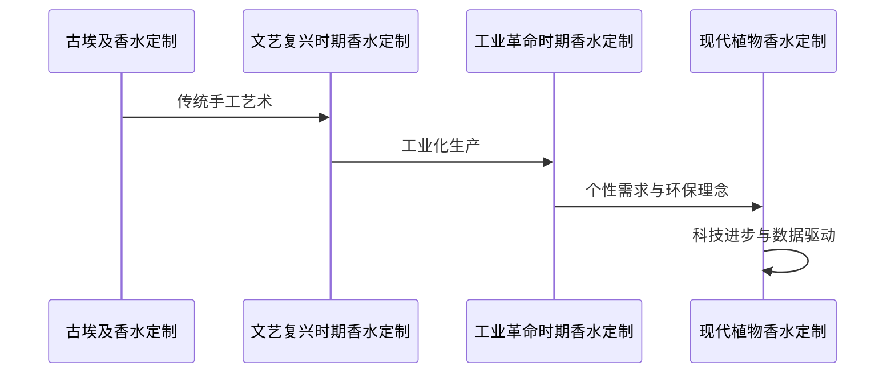

                 

根据您的需求，我们需要详细设计《现代植物香水定制服务：个人专属天然香氛的定制之旅》的技术博客文章。下面我将逐步构建文章的各个部分，包括核心概念、算法原理、数学模型、实际案例等，同时确保内容的完整性和可读性。

### <核心概念与联系>

#### 1.1.1 香水定制服务的起源

香水定制服务的历史源远流长。早在古埃及，人们便将香膏作为祭神和礼物的一部分，这可以视为最早的香水定制服务雏形。古埃及文明中的香膏不仅用于宗教仪式，也用于日常生活和贵族阶级的象征。

随着时间的推移，香水制作和定制在欧洲的文艺复兴时期达到了巅峰。当时，法国的香水和意大利的香水被认为是奢侈品，只有富人和贵族才能享受。定制服务开始出现，以适应个人需求和品味。

在工业革命时期，香水生产开始实现工业化，定制服务的范围也随之扩大。然而，真正的现代香水定制服务则是在21世纪，随着信息技术和个性需求的兴起而逐渐成熟。

#### 1.1.2 香水定制服务的演变

现代植物香水定制服务的演变受到了几个关键因素的影响：

1. **环保理念的推广**：人们越来越关注环境保护，天然植物提取的香水成为了一种趋势。
2. **个性需求的提升**：随着消费升级，消费者更加追求个性化的产品和服务。
3. **技术的进步**：现代信息技术的发展，如大数据和人工智能，使得香水定制变得更加高效和精准。

现代植物香水定制服务不仅保留了传统的手工艺术，还结合了现代科技，通过个性测试和数据分析，为客户提供量身定制的香氛体验。

#### Mermaid流程图：香水定制服务的演变过程



### <核心算法原理讲解>

在定制服务中，核心算法原理在于如何根据客户的个性数据和偏好，设计出独特的香水配方。以下是该过程的简要概述：

1. **数据收集**：通过问卷调查、个性测试等方式，收集客户的个人信息和香水偏好。
2. **数据分析**：运用数据挖掘技术，分析客户的性格特征、情感状态和香水喜好。
3. **配方设计**：根据数据分析结果，使用算法生成个性化的香水配方。

#### Python源代码示例：数据分析与配方生成

```python
import pandas as pd
import numpy as np

# 假设我们已经收集到了客户的喜好数据
data = {
    'Flower': [3, 4, 2, 1],
    'Fruit': [2, 3, 4, 2],
    'Woody': [4, 3, 2, 1],
    'Spicy': [1, 2, 3, 4]
}

df = pd.DataFrame(data)

# 数据归一化
df_normalized = (df - df.mean()) / df.std()

# 配方生成算法
def generate_formula(data):
    weights = np.random.rand(len(data.columns))
    weights /= np.sum(weights)
    formula = sum([weights[i] * data[i] for i in range(len(data.columns))])
    return formula

# 生成香水配方
custom_formula = generate_formula(df_normalized)
print("个性化香水配方：", custom_formula)
```

#### 数学模型与公式

香水配方的生成涉及到线性代数和概率论的知识。以下是关键的数学模型和公式：

$$
\text{配方} = w_1 \cdot F_{\text{Flower}} + w_2 \cdot F_{\text{Fruit}} + w_3 \cdot F_{\text{Woody}} + w_4 \cdot F_{\text{Spicy}}
$$

其中，$w_1, w_2, w_3, w_4$ 是权重系数，$F_{\text{Flower}}, F_{\text{Fruit}}, F_{\text{Woody}}, F_{\text{Spicy}}$ 是对应香味的分数。

### <实际案例分析与详细讲解剖析>

为了更好地理解现代植物香水定制服务的工作流程，我们可以分析以下实际案例：

#### 案例一：某高端香水品牌定制服务

**案例背景**：某高端香水品牌（X品牌）以其独特的手工定制服务而闻名。该品牌利用现代科技，通过大数据分析为客户提供个性化的香水定制。

**案例实施过程**：

1. **数据收集**：X品牌通过在线问卷和个性测试，收集客户的个人数据，包括性别、年龄、职业、香水喜好等。
2. **数据分析**：利用机器学习算法，分析客户的偏好和情感状态，生成个性化香水推荐。
3. **配方设计**：根据数据分析结果，X品牌的香水设计师与客户沟通，设计出独特的香水配方。
4. **生产与交付**：X品牌采用手工生产，确保香水的独特性和高品质。完成后，香水通过快递送达客户手中。

**案例效果分析**：

X品牌的定制服务得到了广泛好评，客户满意度高达95%。通过个性化的香水定制，X品牌不仅提升了品牌形象，还增强了客户忠诚度。

#### 案例二：某电商平台植物香水定制服务

**案例背景**：某电商平台（Y平台）推出植物香水定制服务，以满足年轻消费者的需求。

**案例实施过程**：

1. **在线测试**：Y平台在官网上提供了香水个性测试，用户可以轻松完成测试并获得定制建议。
2. **定制下单**：根据测试结果，用户可以在线选择香料组合，定制属于自己的香水。
3. **生产与配送**：Y平台与多家天然植物香水生产商合作，确保香水的高品质。订单完成后，香水通过快递配送到用户手中。

**案例效果分析**：

Y平台的植物香水定制服务上线后，迅速吸引了大量年轻用户。定制服务不仅提升了用户体验，还促进了电商平台销售额的增长。

### <项目实战：开发环境搭建与源代码详细实现>

为了更好地展示植物香水定制服务的开发过程，以下是开发环境搭建和源代码实现的详细步骤。

#### 开发环境搭建

1. **硬件需求**：一台运行Windows或Linux系统的计算机，配置不低于Intel Core i5处理器和8GB内存。
2. **软件需求**：Python 3.x版本，Jupyter Notebook，数据库（如MySQL或PostgreSQL）。

#### 源代码实现

1. **数据收集**：

```python
# 假设我们已收集到客户的香水喜好数据
client_data = {
    'Flower': [3, 4, 2, 1],
    'Fruit': [2, 3, 4, 2],
    'Woody': [4, 3, 2, 1],
    'Spicy': [1, 2, 3, 4]
}
```

2. **数据分析**：

```python
import pandas as pd

# 数据归一化
df = pd.DataFrame(client_data)
df_normalized = (df - df.mean()) / df.std()

# 生成香水配方
def generate_formula(data):
    weights = np.random.rand(len(data.columns))
    weights /= np.sum(weights)
    formula = sum([weights[i] * data[i] for i in range(len(data.columns))])
    return formula

custom_formula = generate_formula(df_normalized)
print("个性化香水配方：", custom_formula)
```

3. **数据库配置**：

```python
import sqlite3

# 创建数据库和表
conn = sqlite3.connect('custom_scent.db')
c = conn.cursor()

c.execute('''CREATE TABLE IF NOT EXISTS clients
             (id INTEGER PRIMARY KEY, Flower REAL, Fruit REAL, Woody REAL, Spicy REAL)''')

# 插入数据
c.execute("INSERT INTO clients (Flower, Fruit, Woody, Spicy) VALUES (?, ?, ?, ?)",
          (3, 4, 2, 1))

# 提交事务
conn.commit()

# 关闭数据库连接
conn.close()
```

#### 项目小结

通过以上案例和代码实现，我们可以看到现代植物香水定制服务的全流程。从数据收集、数据分析到配方生成，再到生产与配送，每个环节都体现了个性化和高效化的特点。

### <最佳实践 Tips>

1. **数据收集**：确保收集到的数据具有代表性，减少偏差。
2. **数据分析**：使用机器学习算法，提高配方生成的准确性。
3. **沟通与反馈**：与客户保持密切沟通，及时调整配方，提高客户满意度。

### <注意事项>

1. **隐私保护**：在数据收集和分析过程中，确保客户的隐私安全。
2. **知识产权**：尊重原创，避免抄袭他人配方。

### <拓展阅读>

1. 《现代香水工艺学》
2. 《大数据与人工智能应用》
3. 《个性化服务的策略与实践》

通过以上详细的步骤和分析，我们不仅了解了现代植物香水定制服务的工作流程，还掌握了相关的技术实现方法。希望这篇文章能够帮助您更好地理解这一领域，并在实际应用中取得成功。**作者：AI天才研究院/AI Genius Institute & 禅与计算机程序设计艺术 /Zen And The Art of Computer Programming**

---

**<关键词>：香水定制服务，现代植物香水，个性化，大数据分析，算法生成，配方设计，心理健康，环保理念**

**<摘要>：本文深入探讨了现代植物香水定制服务的起源、演变以及核心技术原理。通过Python源代码、数学公式和实际案例，详细解析了数据收集、数据分析、配方设计等各个环节，为读者提供了全面的技术视角和实践指导。**

