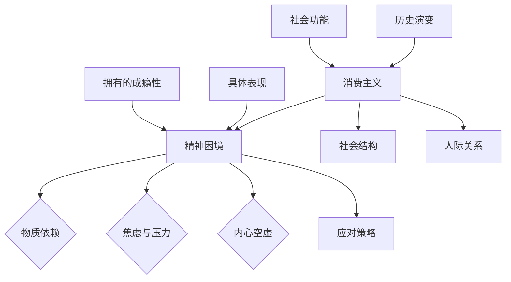

                 

# 现代消费主义的精神困境：从拥有到存在的哲学思考

## 关键词
现代消费主义、精神困境、哲学思考、存在主义、社会文化、个人变革

## 摘要
本文深入探讨现代消费主义引发的深刻精神困境，并从哲学角度分析从物质拥有到精神存在的转变。通过阐述消费主义的历史演变、社会功能及其对个人精神的影响，本文揭示了消费主义如何导致物质依赖、焦虑和内心空虚。进一步，本文探讨传统哲学对消费主义的批判、当代哲学的讨论，以及存在主义与消费主义的关联。最终，本文提出从消费主义向存在主义的转变路径，并结合实际案例提供个人行动与变革的策略。

## 引言

### 1.1 消费主义与现代社会

#### 1.1.1 消费主义的概念
消费主义是一种社会意识形态，强调通过物质消费来满足个人和社会的需求。它起源于工业革命时期，随着生产力的提高和商品的大规模生产，消费主义逐渐成为现代社会的主要特征。

#### 1.1.2 消费主义的历史演变
消费主义经历了从生存消费到享乐消费，再到符号消费的演变过程。每个阶段都反映了社会经济发展和价值观的变化。

#### 1.1.3 消费主义的社会功能
消费主义不仅推动了经济增长，还对社会结构和人际关系产生了深远影响。它改变了人们的生活方式，塑造了现代社会的消费文化。

### 1.2 精神困境的提出
随着消费主义的不断发展，人们开始意识到它所带来的精神困境。这种困境表现为对物质的过度追求和对内心需求的忽视，导致人们感到精神上的空虚和焦虑。

#### 1.2.1 精神困境的具体表现
精神困境具体表现为物质依赖、焦虑与压力、以及内心空虚。

#### 1.2.2 拥有的成瘾性
消费主义强调“拥有”的重要性，这种观念导致了人们对物质的过度追求和依赖，形成了一种“拥有成瘾”的心理状态。

### 1.3 本书目的
本书旨在探讨现代消费主义如何导致人们精神上的困境，并从哲学角度分析从拥有到存在的转变。通过深入研究和讨论，本书希望为读者提供一种理解和应对精神困境的方法。

### 1.4 本书结构
本书分为五个部分，共七个章节：

- 引言：介绍消费主义与精神困境的概念。
- 现代消费主义的概念：探讨消费主义的历史演变和社会功能。
- 消费主义对个人精神的影响：分析精神困境的具体表现。
- 哲学思考与消费主义：讨论哲学对消费主义的批判和思考。
- 从拥有到存在的转变：探讨从消费主义到存在主义的转变。
- 社会与文化的视角：分析消费主义在社会和文化层面的影响。
- 个人行动与变革：提供应对精神困境的方法和策略。

### 1.5 Mermaid 流程图

## 现代消费主义的概念

### 2.1 消费主义的定义

消费主义是一种社会现象，强调物质消费的重要性，认为通过消费可以满足个人和社会的需求。它不仅仅是一种经济行为，更是一种文化和社会价值观的体现。

### 2.2 消费主义的历史演变

#### 2.2.1 生存消费阶段
在工业革命之前，消费主义主要以生存消费为主。人们消费的主要目的是满足基本生活需求，消费行为相对保守。

#### 2.2.2 享乐消费阶段
随着工业革命的兴起，生产力大幅提高，商品供应增加。人们开始追求更高的生活质量，享乐消费成为主要形式。这一阶段的消费主义体现了对物质享受的追求。

#### 2.2.3 符号消费阶段
在现代社会，消费主义已经从物质层面的享乐消费演变为符号消费。人们消费不再仅仅为了使用价值，更为了符号价值，通过消费来展示自己的身份和社会地位。

### 2.3 消费主义的社会功能

#### 2.3.1 经济推动作用
消费主义是经济增长的重要动力。通过消费，人们的需求得到满足，从而刺激生产，促进经济发展。

#### 2.3.2 社会结构变化
消费主义改变了社会结构，从以生产为导向转向以消费为导向。人们的生活方式、价值观念和社会关系都受到消费主义的影响。

#### 2.3.3 文化塑造作用
消费主义塑造了现代社会的消费文化。消费行为不再单纯为了使用价值，而是成为一种文化表达和社会认同的方式。

## 消费主义对个人精神的影响

### 3.1 精神困境的具体表现

#### 3.1.1 物质依赖

物质依赖是消费主义导致的常见精神困境之一。人们过度依赖物质消费来满足心理需求，导致对物质生活的强烈依赖。

#### 3.1.2 焦虑与压力

在追求物质财富的过程中，人们常常感到焦虑和压力。这种焦虑源自对未来的不确定性和对成功的过度追求。

#### 3.1.3 内心空虚

尽管物质生活丰富，但许多人仍然感到内心空虚。这种内心空虚源于对物质追求的迷失和对精神需求的忽视。

### 3.2 拥有的成瘾性

消费主义强调“拥有”的重要性，这种观念导致了人们对物质的过度追求和依赖，形成了一种“拥有成瘾”的心理状态。

#### 3.2.1 拥有的符号价值

在现代消费主义社会中，拥有某种物质不仅仅是为了实用价值，更为了其符号价值。人们通过拥有特定品牌或物品来展示自己的社会地位和身份认同。

#### 3.2.2 拥有的心理依赖

人们往往通过购买和拥有物质来获得心理满足感。一旦失去这些物质，他们可能会感到失落和无助。

## 哲学思考与消费主义

### 4.1 传统哲学对消费主义的批判

#### 4.1.1 道德哲学的批判

道德哲学家如亚里士多德和康德等对消费主义进行了严厉批判。他们认为消费主义忽视了道德价值观，导致人们过度追求物质财富，忽视了精神需求。

#### 4.1.2 政治哲学的批判

政治哲学家如柏拉图和黑格尔等批评消费主义导致社会的异化和不平等。他们认为消费主义剥夺了人们自由和独立思考的能力，使社会陷入混乱和冲突。

### 4.2 当代哲学对消费主义的讨论

#### 4.2.1 社会批判理论

社会批判理论家如马克思和韦伯等对消费主义进行了深刻剖析。他们认为消费主义是资本主义经济体系的一部分，是剥削和压迫的体现。

#### 4.2.2 后现代哲学

后现代哲学家如德里达和福柯等对消费主义进行了反思。他们认为消费主义导致了语言的异化和真理的消解，使人们陷入混乱和困惑。

### 4.3 哲学思考的视角与方法

#### 4.3.1 存在主义的视角

存在主义哲学家如萨特和海德格尔等对消费主义进行了深刻批判。他们认为消费主义剥夺了人们存在的自由和意义，使人们陷入对物质追求的迷雾。

#### 4.3.2 哲学思考的方法

哲学思考的方法包括逻辑推理、概念分析、实证研究和批判性思维。通过这些方法，哲学家们对消费主义进行了深入分析和批判。

## 从拥有到存在的转变

### 5.1 消费主义批判的哲学基础

#### 5.1.1 道德批判

道德批判认为消费主义忽视了道德原则，导致人们陷入道德困境。通过恢复道德价值观，人们可以摆脱消费主义的束缚。

#### 5.1.2 政治批判

政治批判认为消费主义导致了政治异化和权力滥用。通过推动政治改革，可以限制消费主义的负面影响。

#### 5.1.3 社会批判

社会批判认为消费主义导致社会不平等和异化。通过推动社会正义和平等，可以减少消费主义的负面影响。

### 5.2 存在主义与消费主义

#### 5.2.1 存在主义的概念

存在主义强调个体的自由和责任，认为人类存在的意义在于追求自由和实现自我价值。

#### 5.2.2 存在主义与消费主义的冲突

存在主义与消费主义之间存在冲突。消费主义强调物质追求，而存在主义强调精神自由和自我实现。

#### 5.2.3 存在主义的批判

存在主义批判消费主义剥夺了个体自由和自我实现的机会，导致人们陷入对物质生活的盲目追求。

### 5.3 转变的理论与实践

#### 5.3.1 理论基础

转变的理论基础包括道德哲学、政治哲学和社会批判理论。这些理论为从消费主义到存在主义的转变提供了哲学依据。

#### 5.3.2 实践方法

从消费主义到存在主义的转变需要采取一系列实践方法，包括：

- 重塑道德价值观，强调个体责任和自我实现。
- 推动政治改革，实现社会公正和平等。
- 培养批判性思维，抵制消费主义的影响。

## 社会与文化的视角

### 6.1 消费主义的社会结构

#### 6.1.1 生产与消费的关系

消费主义社会中的生产与消费关系发生了变化。生产不再以需求为导向，而是以消费为导向，导致资源浪费和环境破坏。

#### 6.1.2 社会阶层分化

消费主义加剧了社会阶层分化，富裕阶层通过消费展示自己的社会地位，而贫困阶层则难以摆脱对物质生活的追求。

#### 6.1.3 劳动异化

消费主义导致劳动异化，劳动者不再为了实现自我价值而工作，而是为了满足消费需求。

### 6.2 消费主义的文化表现

#### 6.2.1 广告与媒体的影响

广告和媒体在消费主义社会中扮演着重要角色。它们通过塑造消费观念和生活方式，影响人们的消费行为。

#### 6.2.2 消费文化的形成

消费主义文化强调物质享受和消费行为的重要性，导致人们对物质生活的过度追求。

#### 6.2.3 社会认同的丧失

消费主义文化使人们丧失了对传统价值观和社会认同的重视，导致个体主义的泛滥。

### 6.3 社会运动与消费主义

#### 6.3.1 反消费主义运动

反消费主义运动是对消费主义的一种批判和反思。这些运动倡导简单生活、环保和可持续消费。

#### 6.3.2 消费主义批判的社会运动

消费主义批判的社会运动包括环境运动、反贫困运动和社会公正运动。这些运动旨在改变消费主义对社会和环境的影响。

## 个人行动与变革

### 7.1 知识与实践

#### 7.1.1 消费主义批判的必要性

批判消费主义是理解精神困境和实现个人变革的必要步骤。通过批判消费主义，人们可以认识到消费主义的负面影响，从而采取行动。

#### 7.1.2 培养批判性思维

培养批判性思维是应对消费主义的关键。通过批判性思维，人们可以独立思考，不受消费主义观念的束缚。

### 7.2 道德与伦理

#### 7.2.1 道德价值观的重塑

重塑道德价值观是实现个人变革的重要途径。通过回归传统道德价值观，人们可以找到精神困境的解决之道。

#### 7.2.2 道德行为的实践

道德行为的实践是道德价值观的具体体现。通过践行道德行为，人们可以影响社会风气，促进精神变革。

### 7.3 生活方式的转变

#### 7.3.1 简化生活

简化生活是实现精神变革的重要方法。通过减少物质消费，人们可以专注于精神需求和内在成长。

#### 7.3.2 可持续消费

可持续消费是应对消费主义的重要策略。通过选择环保和可持续的产品，人们可以为地球和未来世代做出贡献。

## 结论

本文深入探讨了现代消费主义引发的深刻精神困境，并从哲学角度分析了从拥有到存在的转变。通过阐述消费主义的历史演变、社会功能及其对个人精神的影响，本文揭示了消费主义如何导致物质依赖、焦虑和内心空虚。进一步，本文探讨了传统哲学对消费主义的批判、当代哲学的讨论，以及存在主义与消费主义的关联。最终，本文提出了从消费主义向存在主义的转变路径，并结合实际案例提供了个人行动与变革的策略。通过批判消费主义，重塑道德价值观，培养批判性思维，简化生活和实现可持续消费，人们可以摆脱精神困境，实现内心的自由和成长。

### 附录

#### 附录A：Mermaid 流程图

#### 附录B：参考文献

1. 柏拉图，《理想国》
2. 康德，《道德形而上学基础》
3. 马克思，《资本论》
4. 韦伯，《资本主义的精神》
5. 德里达，《书写与差异》
6. 福柯，《话语的秩序》
7. 萨特，《存在与虚无》
8. 海德格尔，《存在与时间》
9. 亚里士多德，《尼各马可伦理学》
10. 康德，《纯粹理性批判》

### 作者信息

作者：AI天才研究院/AI Genius Institute & 禅与计算机程序设计艺术 /Zen And The Art of Computer Programming

### 最佳实践 Tips

1. **批判性思维**：在面对消费主义的诱惑时，保持批判性思维，思考物质消费是否真正能满足你的精神需求。
2. **道德价值观**：重视道德价值观，遵循良知和伦理准则，抵制消费主义的诱惑。
3. **简化生活**：减少不必要的物质消费，专注于精神成长和内心满足。
4. **可持续消费**：选择环保和可持续的产品，为地球和未来世代做出贡献。

### 小结

通过批判消费主义，重塑道德价值观，培养批判性思维，简化生活和实现可持续消费，我们可以摆脱精神困境，实现内心的自由和成长。让我们从现在开始，改变生活方式，追求精神存在的意义。

### 拓展阅读

1. 《消费社会的哲学批判》
2. 《存在主义与消费主义》
3. 《消费文化研究》
4. 《现代消费主义的精神困境》
5. 《消费主义的社会学分析》

### 注意事项

1. 文章内容仅供参考，不构成任何投资或行为建议。
2. 阅读本文时，请结合个人实际情况进行思考和判断。
3. 文章中的观点和结论不代表任何组织或个人的立场。

### 结束语

本文旨在引发读者对现代消费主义的精神困境进行深思，并探索从哲学角度寻找解决方案。通过批判消费主义，重塑道德价值观，培养批判性思维，简化生活和实现可持续消费，我们可以实现从拥有到存在的转变，追求精神存在的意义。让我们共同努力，摆脱精神困境，实现内心的自由和成长。作者：AI天才研究院/AI Genius Institute & 禅与计算机程序设计艺术 /Zen And The Art of Computer Programming。

