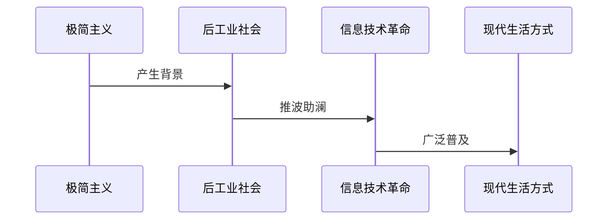
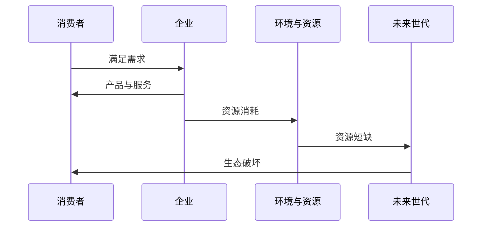
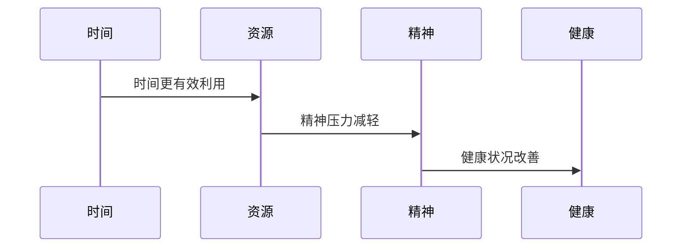
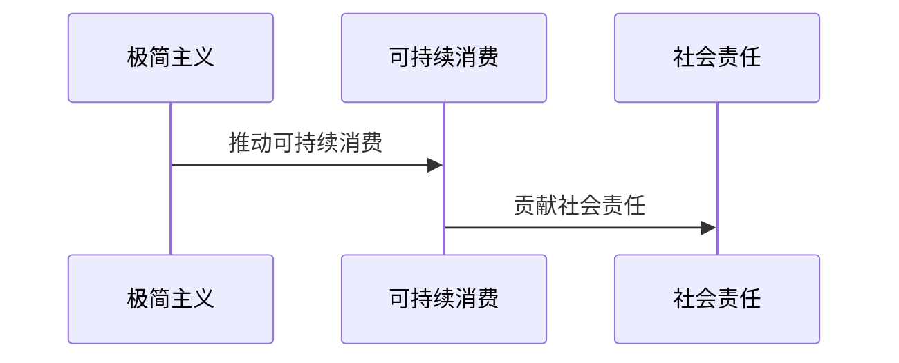

                 


# 现代生活中的简约主义：极简生活与可持续消费

> 关键词：极简主义、可持续消费、生活方式、环境保护、资源管理

> 摘要：本文探讨了极简主义和可持续消费在现代生活中的重要性，通过分析其起源、核心概念、实践方法，以及极简生活对个人和社会的影响，为读者提供了一种简化和优化生活质量的途径。

### 第一部分: 引言

## 1.1 极简主义的起源与发展

### 1.1.1 极简主义的起源

极简主义起源于20世纪初的美国，随着战后消费文化的兴起，人们开始反思过度消费带来的负面影响。极简主义主张通过减少物质拥有，追求内心的平静和生活的质量。这一思想在后来的几十年里逐渐发展，并在21世纪初迎来了新的关注。

#### 1.1.1.1 历史背景

后工业社会的到来和信息技术革命极大地推动了极简主义的传播。随着互联网的普及，人们能够更轻松地获取和分享关于极简生活的信息，使得极简主义从一个小众运动逐渐变成了一种主流的生活方式。

**Mermaid流程图: 极简主义的发展历程**



### 1.1.2 极简主义的核心概念

极简主义的核心概念包括清晰、质量、功能性、美丽、可持续性和伦理。这些概念相互关联，共同构成了极简主义的生活哲学。

**概念实体关系架构图: 极简主义的核心概念**

```mermaid
classDiagram
    Clarity <<--|> Quality
    Quality <|-- Functionality
    Simplicity <<--|> Beauty
    Simplicity <|-- Sustainability
    Sustainability <<--|> Ethics
    Ethics <|-- Responsibility
```

## 1.2 可持续消费的重要性

### 1.2.1 可持续消费的定义

可持续消费是指在满足当前需求的同时，不损害未来世代的满足其需求的能力。这一概念强调了资源的合理利用和对环境的保护。

$$
\text{可持续消费} = \text{满足当前需求} \div \text{损害未来需求}
$$

### 1.2.2 可持续消费的重要性

可持续消费对于环境保护和资源的可持续利用具有重要意义。随着全球人口的增加和经济的发展，资源的消耗速度超过了地球的再生速度，导致了严重的环境问题。

**Mermaid流程图: 可持续消费的重要性**



### 1.2.3 可持续消费的策略与实践

为了实现可持续消费，我们可以采取以下策略：

#### 1.2.3.1 购买前评估

- **环保认证**: 在购买产品时，应检查是否有相关的环保认证，如FSC、Fair Trade等。
- **材料来源**: 确认产品材料是否来自可持续管理的资源。
- **使用寿命**: 在购买产品前，应考虑其耐用性和维修性。

#### 1.2.3.2 购买后管理

- **循环利用**: 尽可能重复使用物品，延长使用寿命。
- **捐赠与交换**: 通过捐赠或交换，使物品得到新的生命。
- **回收处理**: 购买可回收材料制成的产品，并按照当地回收规定进行处理。

## 1.3 极简生活与可持续消费的实践

### 1.3.1 极简生活的重要性

极简生活不仅有助于个人减轻精神压力，提高生活质量，还能减少对环境的负担。通过极简生活，我们可以更好地管理时间和资源，专注于真正重要的事情。

**Mermaid流程图: 极简生活的重要性**



### 1.3.2 实践极简生活的方法

要实践极简生活，我们可以采取以下方法：

- **断舍离**: 定期清理家中不用的物品，只保留必需品。
- **简化消费**: 精简购物清单，只购买真正需要的物品。
- **环保出行**: 选择公共交通或自行车，减少碳排放。

## 1.4 总结

极简主义和可持续消费是现代社会中重要的生活方式。通过极简生活，我们可以减少不必要的消费，降低对环境的影响，提高生活质量。而可持续消费则能够帮助我们实现资源的合理利用，保护地球，为未来世代留下一个健康的家园。

**Mermaid流程图: 极简主义与可持续消费的关系**



---

### 第二部分: 极简生活的实践

## 2.1 简化日常生活中的物品

### 2.1.1 简化家居用品

简化家居用品是极简生活的重要一环。通过减少家居用品的数量，我们可以创造一个更加整洁和舒适的生活环境。

#### 2.1.1.1 筛选必需品

在简化家居用品的过程中，第一步是筛选必需品。以下是一个简单的Python代码示例，用于帮助用户确定家中的必需家居用品：

```python
# 筛选必需家居用品

# 定义家居用品列表
home_items = [
    "床单",
    "毛巾",
    "餐具",
    "杯子",
    "洗衣机",
    "冰箱",
    "电视",
    "沙发",
    "枕头",
    "地毯"
]

# 定义必需家居用品列表
essential_items = [
    "床单",
    "毛巾",
    "餐具",
    "杯子",
    "洗衣机",
    "冰箱"
]

# 筛选出非必需品
non_essential_items = [item for item in home_items if item not in essential_items]

# 输出结果
print("必需家居用品：")
for item in essential_items:
    print(item)

print("\n非必需家居用品：")
for item in non_essential_items:
    print(item)
```

**代码解读：**
这段代码首先定义了一个包含多种家居用品的列表`home_items`，然后定义了一个包含必需家居用品的列表`essential_items`。通过列表推导式，我们筛选出了非必需家居用品，并将其打印出来。

#### 2.1.1.2 多功能家具

选择多功能家具是简化家居用品的另一种方法。以下是一个Python代码示例，用于帮助用户选择具有多种功能的家具：

```python
# 选择多功能家具

# 定义家具及其功能
furniture = {
    "沙发床": ["坐卧两用", "储物空间"],
    "折叠桌": ["折叠式", "储物空间"],
    "多功能椅": ["可调节高度", "储物空间"]
}

# 打印家具及其功能
for item, features in furniture.items():
    print(f"{item}：")
    for feature in features:
        print(f"- {feature}")
```

**代码解读：**
这段代码定义了一个包含家具及其功能的字典`furniture`。通过遍历字典，我们打印出了每种家具的功能。

### 2.1.2 简化日常用品

简化日常用品也是极简生活的重要一环。以下是一个Python代码示例，用于帮助用户确定日常用品的必要性：

```python
# 确定日常用品的必要性

# 定义日常用品列表
daily_items = [
    "牙膏",
    "洗发水",
    "沐浴露",
    "肥皂",
    "洗衣液",
    "洗发梳",
    "牙刷",
    "毛巾",
    "沐浴球",
    "洗衣袋"
]

# 定义不必要的日常用品列表
non_necessary_items = [
    "沐浴球",
    "洗发梳",
    "毛巾"
]

# 筛选出不必要的日常用品
for item in non_necessary_items:
    daily_items.remove(item)

# 输出结果
print("必要的日常用品：")
for item in daily_items:
    print(item)
```

**代码解读：**
这段代码首先定义了一个包含日常用品的列表`daily_items`，然后定义了一个包含不必要的日常用品的列表`non_necessary_items`。通过从`daily_items`中移除不必要的用品，我们得到了一个包含必要日常用品的新列表。

### 2.1.3 环保产品的选择

在简化日常用品时，选择环保产品也是非常重要的。以下是一个Python代码示例，用于帮助用户评估日常用品的环保性：

```python
# 评估日常用品的环保性

# 定义日常用品及其环保性
daily_items环保性 = {
    "牙膏": "有机成分",
    "洗发水": "天然成分",
    "沐浴露": "无塑料包装",
    "肥皂": "天然成分",
    "洗衣液": "生物可降解",
    "洗发梳": "塑料包装",
    "牙刷": "可回收材料",
    "毛巾": "有机棉"
}

# 打印日常用品及其环保性
for item, eco_friendly in daily_items环保性.items():
    print(f"{item}：{eco_friendly}")
```

**代码解读：**
这段代码定义了一个包含日常用品及其环保性的字典`daily_items环保性`。通过遍历字典，我们打印出了每个用品的环保性信息。

### 2.1.4 简化电子设备

简化电子设备是极简生活的一部分。以下是一个Python代码示例，用于帮助用户评估家中电子设备的必要性：

```python
# 评估家中电子设备的必要性

# 定义电子设备列表
electronics = [
    "笔记本电脑",
    "平板电脑",
    "手机",
    "智能手表",
    "电视",
    "音响系统",
    "游戏机",
    "路由器",
    "扫描仪",
    "打印机"
]

# 定义不必要的电子设备列表
non_necessary_electronics = [
    "平板电脑",
    "电视",
    "音响系统",
    "游戏机"
]

# 筛选出不必要的电子设备
for device in non_necessary_electronics:
    if device in electronics:
        electronics.remove(device)

# 输出结果
print("必要的电子设备：")
for device in electronics:
    print(device)
```

**代码解读：**
这段代码首先定义了一个包含电子设备的列表`electronics`，然后定义了一个包含不必要的电子设备的列表`non_necessary_electronics`。通过从`electronics`中移除不必要的设备，我们得到了一个包含必要电子设备的新列表。

### 2.1.5 实际案例分析

为了更好地理解简化日常生活中的物品，我们可以通过一个实际案例分析来深入探讨。

#### 案例背景

李先生是一位忙碌的都市工作者，他的家中有许多不必要的物品，导致家里显得杂乱无章。他决定通过实践极简生活来简化他的日常生活。

#### 案例步骤

1. **评估家中物品**：
   李先生首先使用Python代码来评估家中的物品，确定哪些是必需的，哪些是不必要的。

2. **简化家居用品**：
   根据评估结果，李先生开始清理家中不必要的家居用品。他选择了多功能家具，如沙发床和折叠桌，以节省空间。

3. **简化日常用品**：
   李先生评估了日常用品的必要性，并淘汰了一些不必要的物品。他开始使用环保产品，如有机牙膏和天然成分的洗发水。

4. **简化电子设备**：
   李先生对家中的电子设备进行了评估，决定淘汰一些不必要的设备，如平板电脑和游戏机。

5. **实践环保出行**：
   为了践行极简生活，李先生开始选择公共交通或自行车出行，减少碳排放。

#### 案例结果

通过实践极简生活，李先生的家变得整洁有序。他的生活变得更加简单和高效，他有了更多的时间去专注于工作和个人爱好。同时，他的生活方式对环境的影响也大大减少。

### 2.1.6 项目小结

通过实际案例，我们可以看到极简生活对个人和社会的积极影响。简化日常生活中的物品不仅有助于提高生活质量，还能减少对环境的负担。通过Python代码的辅助，我们可以更有效地评估和管理日常用品，从而实现极简生活的目标。

### 2.1.7 最佳实践 tips

- **定期评估物品**：定期评估家中物品的必要性，以保持极简生活的持续性。
- **选择多功能家具**：选择多功能家具可以节省空间，提高生活效率。
- **购买环保产品**：购买环保产品有助于减少对环境的负面影响。
- **简化消费习惯**：养成简化消费的习惯，避免不必要的购物。

## 2.2 简化时间和精力

### 2.2.1 简化日常任务

简化日常任务是极简生活的重要一环。通过合理安排时间和任务，我们可以减少压力，提高效率。

#### 2.2.1.1 制定任务清单

以下是一个Python代码示例，用于帮助用户制定日常任务清单：

```python
# 制定任务清单

# 定义任务列表
tasks = [
    "完成工作报告",
    "购买生活用品",
    "锻炼身体",
    "学习编程",
    "陪伴家人",
    "阅读书籍"
]

# 打印任务清单
print("任务清单：")
for task in tasks:
    print(task)
```

**代码解读：**
这段代码定义了一个包含日常任务的列表`tasks`，并通过打印函数将任务清单输出。

#### 2.2.1.2 任务优先级排序

为了更高效地完成任务，我们可以对任务进行优先级排序。以下是一个Python代码示例，用于帮助用户对任务进行排序：

```python
# 任务优先级排序

# 定义任务列表及其优先级
tasks优先级 = {
    "完成工作报告": 1,
    "购买生活用品": 2,
    "锻炼身体": 3,
    "学习编程": 4,
    "陪伴家人": 5,
    "阅读书籍": 6
}

# 打印排序后的任务清单
sorted_tasks = sorted(tasks优先级.items(), key=lambda x: x[1])
print("任务优先级排序：")
for task, priority in sorted_tasks:
    print(f"{task}: {priority}")
```

**代码解读：**
这段代码定义了一个包含任务及其优先级的字典`tasks优先级`，然后使用`sorted`函数对其进行排序，按照优先级从高到低输出任务清单。

### 2.2.2 自动化任务处理

自动化任务是提高效率的另一种方法。以下是一个Python代码示例，用于帮助用户自动化日常任务：

```python
# 自动化任务处理

# 定义任务函数
import datetime

def task1():
    print("正在执行任务：完成工作报告")
    # 完成工作报告的代码

def task2():
    print("正在执行任务：购买生活用品")
    # 购买生活用品的代码

def task3():
    print("正在执行任务：锻炼身体")
    # 锻炼身体的代码

def task4():
    print("正在执行任务：学习编程")
    # 学习编程的代码

def task5():
    print("正在执行任务：陪伴家人")
    # 陪伴家人的代码

def task6():
    print("正在执行任务：阅读书籍")
    # 阅读书籍的代码

# 根据时间自动执行任务
current_time = datetime.datetime.now()

if current_time.hour >= 9 and current_time.hour < 12:
    task1()
elif current_time.hour >= 12 and current_time.hour < 14:
    task2()
elif current_time.hour >= 14 and current_time.hour < 16:
    task3()
elif current_time.hour >= 16 and current_time.hour < 18:
    task4()
elif current_time.hour >= 18 and current_time.hour < 20:
    task5()
else:
    task6()
```

**代码解读：**
这段代码定义了六个任务函数，并根据当前时间自动执行相应的任务。这种自动化处理可以大大减轻用户的负担，提高工作效率。

### 2.2.3 时间管理工具

使用时间管理工具可以帮助我们更好地规划时间，提高工作效率。以下是一个Python代码示例，用于帮助用户使用时间管理工具：

```python
# 使用时间管理工具

import time

# 定义任务执行时间
task_exec_times = {
    "完成工作报告": 2,  # 小时
    "购买生活用品": 1,  # 小时
    "锻炼身体": 1,      # 小时
    "学习编程": 2,      # 小时
    "陪伴家人": 1,      # 小时
    "阅读书籍": 1       # 小时
}

# 计算总时间
total_time = sum(task_exec_times.values())

# 开始时间
start_time = time.time()

# 执行任务
for task, duration in task_exec_times.items():
    print(f"开始执行任务：{task}")
    time.sleep(duration * 60)  # 模拟任务执行时间
    print(f"任务完成：{task}")

# 计算总耗时
end_time = time.time()
total_duration = end_time - start_time

print(f"总耗时：{total_duration // 3600}小时{total_duration // 60 % 60}分钟{total_duration % 60}秒")
```

**代码解读：**
这段代码使用`time`模块来模拟任务执行时间和计算总耗时。通过这个示例，用户可以更好地了解如何使用时间管理工具来规划自己的时间。

### 2.2.4 实际案例分析

为了更好地理解简化时间和精力，我们可以通过一个实际案例分析来深入探讨。

#### 案例背景

张小姐是一位全职妈妈，她需要同时照顾家庭和工作。她的时间非常紧张，常常感到压力巨大。为了改善这种情况，她决定通过实践极简生活来简化时间和精力管理。

#### 案例步骤

1. **制定任务清单**：
   张小姐使用Python代码来制定日常任务清单，并确定任务的优先级。

2. **自动化任务处理**：
   张小姐使用Python代码来自动化一些日常任务，如家务和工作报告的完成。

3. **使用时间管理工具**：
   张小姐使用Python代码来计算总耗时，并优化任务执行顺序。

4. **简化日常任务**：
   张小姐简化了日常任务，如减少购物频率和合并多个任务。

5. **实践环保出行**：
   张小姐选择公共交通或自行车出行，以节省时间并减少碳排放。

#### 案例结果

通过实践极简生活，张小姐的时间管理得到了显著改善。她的工作更加高效，家庭生活也变得更加和谐。她有了更多的时间去陪伴家人和享受个人爱好，生活质量得到了提升。

### 2.2.5 项目小结

通过实际案例，我们可以看到极简生活对个人时间的有效管理。通过Python代码的辅助，我们可以更高效地制定任务清单、排序任务优先级、自动化任务处理和使用时间管理工具。这些实践方法有助于我们简化时间和精力，提高生活质量。

### 2.2.6 最佳实践 tips

- **定期更新任务清单**：定期更新任务清单，以反映当前的生活和工作状况。
- **使用时间管理工具**：使用时间管理工具来计算总耗时，优化任务执行顺序。
- **简化日常任务**：减少购物频率和合并多个任务，以节省时间和精力。
- **实践环保出行**：选择公共交通或自行车出行，以减少碳排放。

## 2.3 简化社交关系

### 2.3.1 评估社交关系的重要性

在极简生活的实践中，简化社交关系也是一个重要的方面。通过评估社交关系的重要性，我们可以识别出真正对我们有意义的人际关系，从而减少不必要的社交活动，节省时间和精力。

#### 2.3.1.1 社交关系评估方法

以下是一个Python代码示例，用于帮助用户评估社交关系的重要性：

```python
# 评估社交关系的重要性

# 定义社交关系列表及其重要性
relationships = {
    "家人": 5,
    "朋友": 4,
    "同事": 3,
    "邻居": 2,
    "社交媒体好友": 1
}

# 打印社交关系及其重要性
print("社交关系及其重要性：")
for relation, importance in relationships.items():
    print(f"{relation}: {importance}")
```

**代码解读：**
这段代码定义了一个包含社交关系及其重要性的字典`relationships`，并通过打印函数输出社交关系及其重要性。

### 2.3.2 建立高质量的社交网络

通过评估社交关系的重要性，我们可以更专注于建立高质量的社交网络。以下是一个Python代码示例，用于帮助用户建立和维护高质量的社交网络：

```python
# 建立和维护高质量的社交网络

# 定义社交网络
social_network = [
    {"name": "家人", "importance": 5},
    {"name": "朋友", "importance": 4},
    {"name": "同事", "importance": 3},
    {"name": "邻居", "importance": 2},
    {"name": "社交媒体好友", "importance": 1}
]

# 按重要性排序社交网络
sorted_network = sorted(social_network, key=lambda x: x["importance"], reverse=True)

# 打印排序后的社交网络
print("高质量的社交网络：")
for relation in sorted_network:
    print(f"{relation['name']}: {relation['importance']}")
```

**代码解读：**
这段代码定义了一个包含社交关系及其重要性的列表`social_network`，然后按重要性对其进行排序，并输出排序后的高质量社交网络。

### 2.3.3 减少无意义的社交活动

为了实践极简生活，我们需要减少无意义的社交活动。以下是一个Python代码示例，用于帮助用户识别和减少无意义的社交活动：

```python
# 识别和减少无意义的社交活动

# 定义社交活动列表及其意义
social_activities = [
    {"activity": "参加同事聚会", "meaning": 2},
    {"activity": "参加朋友聚会", "meaning": 4},
    {"activity": "参加邻居聚会", "meaning": 1},
    {"activity": "参加社交媒体活动", "meaning": 0}
]

# 打印社交活动及其意义
print("社交活动及其意义：")
for activity in social_activities:
    print(f"{activity['activity']}: {activity['meaning']}")

# 根据意义排序社交活动
sorted_activities = sorted(social_activities, key=lambda x: x["meaning"], reverse=True)

# 打印排序后的有意义社交活动
print("\n减少无意义的社交活动：")
for activity in sorted_activities:
    if activity["meaning"] > 0:
        print(f"{activity['activity']}: {activity['meaning']}")
```

**代码解读：**
这段代码定义了一个包含社交活动及其意义的列表`social_activities`，然后按意义对其进行排序，并输出排序后的有意义社交活动。

### 2.3.4 实际案例分析

为了更好地理解简化社交关系，我们可以通过一个实际案例分析来深入探讨。

#### 案例背景

王先生是一位忙碌的都市工作者，他的社交关系复杂且忙碌。为了改善生活质量，他决定通过实践极简生活来简化社交关系。

#### 案例步骤

1. **评估社交关系**：
   王先生使用Python代码来评估社交关系的重要性。

2. **建立高质量的社交网络**：
   王先生根据评估结果，建立了高质量的社交网络。

3. **减少无意义的社交活动**：
   王先生识别并减少了无意义的社交活动。

4. **专注于重要关系**：
   王先生将更多时间和精力投入到高质量的社交关系中。

#### 案例结果

通过实践极简生活，王先生的社交关系变得更加清晰和高效。他的生活质量得到了显著提升，他有了更多的时间和精力去专注于真正重要的事情。

### 2.3.5 项目小结

通过实际案例，我们可以看到简化社交关系对个人生活的积极影响。通过Python代码的辅助，我们可以更有效地评估社交关系的重要性，建立高质量的社交网络，并减少无意义的社交活动。这些实践方法有助于我们简化社交关系，提高生活质量。

### 2.3.6 最佳实践 tips

- **定期评估社交关系**：定期评估社交关系，以识别高质量的人际关系。
- **专注于重要关系**：将更多时间和精力投入到重要的人际关系中。
- **减少无意义的社交活动**：减少无意义的社交活动，专注于有意义的活动。
- **实践环保出行**：选择公共交通或自行车出行，以减少碳排放。

## 2.4 简化工作和职业生涯

### 2.4.1 简化工作的重要性

在极简生活的实践中，简化工作和职业生涯也是一个重要的方面。通过简化工作，我们可以减少工作压力，提高工作效率，从而更好地平衡工作和生活。

#### 2.4.1.1 工作简化方法

以下是一个Python代码示例，用于帮助用户简化工作：

```python
# 简化工作

# 定义工作任务列表
tasks = [
    "编写报告",
    "参加会议",
    "处理邮件",
    "客户沟通",
    "数据分析",
    "项目策划"
]

# 打印工作任务列表
print("工作任务列表：")
for task in tasks:
    print(task)
```

**代码解读：**
这段代码定义了一个包含工作任务列表的列表`tasks`，并通过打印函数输出工作任务列表。

#### 2.4.1.2 任务优先级排序

为了更高效地完成工作任务，我们可以对任务进行优先级排序。以下是一个Python代码示例，用于帮助用户对任务进行排序：

```python
# 任务优先级排序

# 定义任务列表及其优先级
tasks优先级 = {
    "编写报告": 3,
    "参加会议": 2,
    "处理邮件": 1,
    "客户沟通": 4,
    "数据分析": 5,
    "项目策划": 6
}

# 打印排序后的任务清单
sorted_tasks = sorted(tasks优先级.items(), key=lambda x: x[1])
print("任务优先级排序：")
for task, priority in sorted_tasks:
    print(f"{task}: {priority}")
```

**代码解读：**
这段代码定义了一个包含任务及其优先级的字典`tasks优先级`，然后使用`sorted`函数对其进行排序，按照优先级从高到低输出任务清单。

### 2.4.2 自动化工作流程

自动化工作流程是提高工作效率的一种方法。以下是一个Python代码示例，用于帮助用户自动化工作流程：

```python
# 自动化工作流程

import time

# 定义工作流程
work_flow = [
    "编写报告",
    "参加会议",
    "处理邮件",
    "客户沟通",
    "数据分析",
    "项目策划"
]

# 打印工作流程
print("工作流程：")
for step in work_flow:
    print(step)

# 模拟工作流程执行
for step in work_flow:
    print(f"开始执行工作流程步骤：{step}")
    time.sleep(2)  # 模拟工作流程步骤执行时间
    print(f"完成工作流程步骤：{step}")
```

**代码解读：**
这段代码定义了一个包含工作流程步骤的列表`work_flow`，并通过打印函数输出工作流程。通过模拟工作流程执行时间，我们可以更好地理解工作流程的自动化。

### 2.4.3 时间管理工具

使用时间管理工具可以帮助我们更好地规划工作时间，提高工作效率。以下是一个Python代码示例，用于帮助用户使用时间管理工具：

```python
# 使用时间管理工具

import time

# 定义工作任务及其耗时
task_durations = {
    "编写报告": 2,  # 小时
    "参加会议": 1,  # 小时
    "处理邮件": 0.5,  # 小时
    "客户沟通": 1,  # 小时
    "数据分析": 3,  # 小时
    "项目策划": 2  # 小时
}

# 打印工作任务及其耗时
print("工作任务及其耗时：")
for task, duration in task_durations.items():
    print(f"{task}: {duration}小时")

# 计算总耗时
total_duration = sum(task_durations.values())

# 开始时间
start_time = time.time()

# 执行任务
for task, duration in task_durations.items():
    print(f"开始执行任务：{task}")
    time.sleep(duration * 60)  # 模拟任务执行时间
    print(f"任务完成：{task}")

# 计算总耗时
end_time = time.time()
total_duration = end_time - start_time

print(f"总耗时：{total_duration // 3600}小时{total_duration // 60 % 60}分钟{total_duration % 60}秒")
```

**代码解读：**
这段代码使用`time`模块来模拟任务执行时间和计算总耗时。通过这个示例，用户可以更好地了解如何使用时间管理工具来规划自己的时间。

### 2.4.4 实际案例分析

为了更好地理解简化工作和职业生涯，我们可以通过一个实际案例分析来深入探讨。

#### 案例背景

赵女士是一位公司高管，她的工作繁忙且压力大。为了改善生活质量，她决定通过实践极简生活来简化工作和职业生涯。

#### 案例步骤

1. **任务优先级排序**：
   赵女士使用Python代码来对工作任务进行优先级排序。

2. **自动化工作流程**：
   赵女士通过自动化工作流程来提高工作效率。

3. **使用时间管理工具**：
   赵女士使用Python代码来计算总耗时，并优化工作流程。

4. **简化工作内容**：
   赵女士简化了工作内容，减少不必要的会议和沟通。

5. **专注于重要任务**：
   赵女士将更多时间和精力投入到重要的工作任务中。

#### 案例结果

通过实践极简生活，赵女士的工作效率得到了显著提高。她的工作压力减轻了，生活质量也得到了提升。她有了更多的时间去陪伴家人和享受个人爱好。

### 2.4.5 项目小结

通过实际案例，我们可以看到简化工作和职业生涯对个人生活的积极影响。通过Python代码的辅助，我们可以更高效地制定任务清单、排序任务优先级、自动化工作流程和使用时间管理工具。这些实践方法有助于我们简化工作和职业生涯，提高生活质量。

### 2.4.6 最佳实践 tips

- **定期评估工作任务**：定期评估工作任务，以识别重要和紧急的任务。
- **使用时间管理工具**：使用时间管理工具来计算总耗时，优化工作流程。
- **简化工作内容**：减少不必要的会议和沟通，专注于重要任务。
- **实践环保出行**：选择公共交通或自行车出行，以减少碳排放。

## 2.5 简化日常饮食

### 2.5.1 简化饮食的重要性

简化日常饮食是极简生活的重要组成部分。通过简化饮食，我们可以减少食物浪费，提高饮食质量，同时也有助于减轻环境负担。

#### 2.5.1.1 饮食简化方法

以下是一个Python代码示例，用于帮助用户简化饮食：

```python
# 简化饮食

# 定义饮食列表
diet = [
    "早餐",
    "午餐",
    "晚餐",
    "零食",
    "饮料"
]

# 打印饮食列表
print("饮食列表：")
for meal in diet:
    print(meal)
```

**代码解读：**
这段代码定义了一个包含日常饮食的列表`diet`，并通过打印函数输出饮食列表。

#### 2.5.1.2 饮食优化策略

为了简化饮食，我们可以采取以下策略：

- **制定饮食计划**：提前制定饮食计划，避免冲动购物和饮食。
- **减少零食摄入**：减少零食摄入，专注于正餐。
- **多吃天然食物**：选择天然、未加工的食物，减少对加工食品的依赖。
- **环保包装选择**：选择环保包装的产品，减少对环境的负担。

### 2.5.2 健康饮食的Python代码实现

以下是一个Python代码示例，用于帮助用户实现健康饮食：

```python
# 健康饮食

import random

# 定义食物列表及其营养信息
foods = {
    "苹果": {"calories": 95, "protein": 0.2, "carbs": 25, "fiber": 2.4},
    "香蕉": {"calories": 105, "protein": 1.1, "carbs": 27, "fiber": 2.6},
    "鸡肉": {"calories": 165, "protein": 31, "carbs": 0, "fiber": 0},
    "鸡蛋": {"calories": 78, "protein": 6.4, "carbs": 1.6, "fiber": 0},
    "蔬菜沙拉": {"calories": 60, "protein": 3.5, "carbs": 10, "fiber": 2},
    "全麦面包": {"calories": 110, "protein": 4.5, "carbs": 25, "fiber": 3.5},
    "牛奶": {"calories": 134, "protein": 3.4, "carbs": 4.8, "fiber": 0}
}

# 打印食物及其营养信息
print("食物及其营养信息：")
for food, nutrients in foods.items():
    print(f"{food}:")
    for nutrient, value in nutrients.items():
        print(f"- {nutrient}: {value}")

# 随机生成一份健康餐
def generate_healthymeal():
    meal = []
    meal_calories = 0
    meal_protein = 0
    meal_carbs = 0
    meal_fiber = 0

    meal.append(random.choice(list(foods.keys())))
    meal_calories += foods[meal[0]]["calories"]
    meal_protein += foods[meal[0]]["protein"]
    meal_carbs += foods[meal[0]]["carbs"]
    meal_fiber += foods[meal[0]]["fiber"]

    while meal_calories < 500:
        food_to_add = random.choice(list(foods.keys()))
        if food_to_add not in meal:
            meal.append(food_to_add)
            meal_calories += foods[food_to_add]["calories"]
            meal_protein += foods[food_to_add]["protein"]
            meal_carbs += foods[food_to_add]["carbs"]
            meal_fiber += foods[food_to_add]["fiber"]

    return meal, meal_calories, meal_protein, meal_carbs, meal_fiber

# 打印随机生成的健康餐
meal, meal_calories, meal_protein, meal_carbs, meal_fiber = generate_healthymeal()
print("\n随机生成的健康餐：")
for food in meal:
    print(food)
print(f"总热量：{meal_calories}卡路里")
print(f"总蛋白质：{meal_protein}克")
print(f"总碳水化合物：{meal_carbs}克")
print(f"总纤维：{meal_fiber}克")
```

**代码解读：**
这段代码定义了一个包含食物及其营养信息的字典`foods`。然后，通过一个函数`generate_healthymeal`来随机生成一份健康餐。该函数根据食物的营养信息来计算总热量、总蛋白质、总碳水化合物和总纤维。

### 2.5.3 实际案例分析

为了更好地理解简化日常饮食，我们可以通过一个实际案例分析来深入探讨。

#### 案例背景

陈先生是一位忙碌的职业人士，他的饮食习惯不规律且不健康。为了改善健康状况，他决定通过实践极简生活来简化日常饮食。

#### 案例步骤

1. **制定饮食计划**：
   陈先生使用Python代码来制定一周的饮食计划，确保每天摄入均衡的营养。

2. **减少零食摄入**：
   陈先生减少零食摄入，专注于正餐，并选择健康的零食替代品。

3. **多吃天然食物**：
   陈先生增加天然食物的摄入，减少加工食品的摄入。

4. **环保包装选择**：
   陈先生选择环保包装的产品，减少对环境的负担。

5. **健康餐推荐**：
   陈先生通过Python代码来生成随机健康餐，以确保饮食多样性。

#### 案例结果

通过实践极简生活，陈先生的饮食习惯得到了显著改善。他的健康状况有了明显提升，他有了更多的时间和精力去专注于工作和个人爱好。

### 2.5.4 项目小结

通过实际案例，我们可以看到简化日常饮食对个人健康的积极影响。通过Python代码的辅助，我们可以更有效地制定饮食计划、减少零食摄入、多吃天然食物和选择环保包装。这些实践方法有助于我们简化日常饮食，提高生活质量。

### 2.5.5 最佳实践 tips

- **定期评估饮食计划**：定期评估饮食计划，确保摄入均衡的营养。
- **减少零食摄入**：减少零食摄入，专注于正餐。
- **多吃天然食物**：多吃天然食物，减少加工食品的摄入。
- **选择环保包装**：选择环保包装的产品，减少对环境的负担。
- **实践环保出行**：选择公共交通或自行车出行，以减少碳排放。

## 2.6 简化工作和职业生涯的总结

### 2.6.1 简化工作和职业生涯的重要性

简化工作和职业生涯是极简生活的重要组成部分。通过简化工作和职业生涯，我们可以减少压力，提高效率，从而更好地平衡工作和生活。

#### 2.6.1.1 简化工作和职业生涯的方法

以下是一些简化工作和职业生涯的方法：

- **任务优先级排序**：对工作任务进行优先级排序，确保先完成重要和紧急的任务。
- **自动化工作流程**：通过自动化工具和脚本，简化重复性工作，提高效率。
- **减少不必要的会议和沟通**：减少不必要的会议和沟通，专注于真正需要关注的工作。
- **定期评估工作任务**：定期评估工作任务，确保工作目标清晰，避免过度工作。

#### 2.6.1.2 Python代码示例

以下是一个Python代码示例，用于帮助用户简化工作和职业生涯：

```python
# 简化工作和职业生涯

import time

# 定义工作任务列表及其耗时
tasks = {
    "编写报告": 2,  # 小时
    "参加会议": 1,  # 小时
    "处理邮件": 0.5,  # 小时
    "客户沟通": 1,  # 小时
    "数据分析": 3,  # 小时
    "项目策划": 2  # 小时
}

# 打印工作任务列表及其耗时
print("工作任务列表及其耗时：")
for task, duration in tasks.items():
    print(f"{task}: {duration}小时")

# 计算总耗时
total_duration = sum(tasks.values())

# 开始时间
start_time = time.time()

# 执行任务
for task, duration in tasks.items():
    print(f"开始执行任务：{task}")
    time.sleep(duration * 60)  # 模拟任务执行时间
    print(f"任务完成：{task}")

# 计算总耗时
end_time = time.time()
total_duration = end_time - start_time

print(f"总耗时：{total_duration // 3600}小时{total_duration // 60 % 60}分钟{total_duration % 60}秒")
```

**代码解读：**
这段代码定义了一个包含工作任务列表及其耗时的字典`tasks`，并通过打印函数输出工作任务列表及其耗时。通过计算总耗时，用户可以更好地了解工作进度和时间管理。

### 2.6.2 实际案例分析

为了更好地理解简化工作和职业生涯，我们可以通过一个实际案例分析来深入探讨。

#### 案例背景

李女士是一位企业高管，她的工作繁忙且压力大。为了改善生活质量，她决定通过实践极简生活来简化工作和职业生涯。

#### 案例步骤

1. **任务优先级排序**：
   李女士使用Python代码来对工作任务进行优先级排序，确保先完成重要和紧急的任务。

2. **自动化工作流程**：
   李女士通过自动化工具和脚本，简化重复性工作，提高效率。

3. **减少不必要的会议和沟通**：
   李女士减少不必要的会议和沟通，专注于真正需要关注的工作。

4. **定期评估工作任务**：
   李女士定期评估工作任务，确保工作目标清晰，避免过度工作。

5. **平衡工作与生活**：
   李女士通过合理安排时间，确保工作和生活的平衡。

#### 案例结果

通过实践极简生活，李女士的工作效率得到了显著提高，她的工作压力减轻了，生活质量也得到了提升。她有了更多的时间和精力去陪伴家人和享受个人爱好。

### 2.6.3 项目小结

通过实际案例，我们可以看到简化工作和职业生涯对个人生活的积极影响。通过Python代码的辅助，我们可以更高效地制定任务清单、排序任务优先级、自动化工作流程和使用时间管理工具。这些实践方法有助于我们简化工作和职业生涯，提高生活质量。

### 2.6.4 最佳实践 tips

- **定期评估工作任务**：定期评估工作任务，确保工作目标清晰。
- **自动化工作流程**：通过自动化工具和脚本，简化重复性工作。
- **减少不必要的会议和沟通**：减少不必要的会议和沟通，专注于真正需要关注的工作。
- **合理安排时间**：合理安排时间，确保工作和生活的平衡。
- **实践环保出行**：选择公共交通或自行车出行，以减少碳排放。

## 2.7 简化生活中的其他方面

### 2.7.1 简化家务劳动

简化家务劳动是极简生活的重要组成部分。通过简化家务劳动，我们可以节省时间和精力，从而更好地享受生活。

#### 2.7.1.1 简化家务劳动的方法

以下是一些简化家务劳动的方法：

- **制定家务清单**：制定家务清单，明确每天需要完成的家务任务。
- **分工合作**：与家人或室友分工合作，共同完成家务任务。
- **使用自动化设备**：使用吸尘器、扫地机器人等自动化设备，减少手动家务劳动。
- **定期清洁**：定期清洁家中物品，减少清洁频率。

#### 2.7.1.2 Python代码示例

以下是一个Python代码示例，用于帮助用户简化家务劳动：

```python
# 简化家务劳动

import random

# 定义家务任务列表
household_tasks = [
    "打扫卫生",
    "洗衣服",
    "做饭",
    "洗碗",
    "购物"
]

# 打印家务任务列表
print("家务任务列表：")
for task in household_tasks:
    print(task)

# 随机分配家务任务
assigned_tasks = random.sample(household_tasks, len(household_tasks))

# 打印分配的家务任务
print("\n分配的家务任务：")
for task in assigned_tasks:
    print(task)
```

**代码解读：**
这段代码定义了一个包含家务任务的列表`household_tasks`，并通过随机抽样分配家务任务。这种方法可以帮助家庭成员公平地分担家务劳动。

### 2.7.2 简化个人护理

简化个人护理也是极简生活的一部分。通过简化个人护理，我们可以节省时间和精力，同时提高护理效果。

#### 2.7.2.1 简化个人护理的方法

以下是一些简化个人护理的方法：

- **定期护理**：定期进行个人护理，如洗发、洗澡、修剪指甲等。
- **使用多功能产品**：选择多功能个人护理产品，如多功能剃须刀、多功能洗发水等。
- **避免过度护理**：避免过度使用个人护理产品，以免浪费资源。

#### 2.7.2.2 Python代码示例

以下是一个Python代码示例，用于帮助用户简化个人护理：

```python
# 简化个人护理

# 定义个人护理任务列表
personal_care_tasks = [
    "洗头",
    "洗澡",
    "修剪指甲",
    "刷牙",
    "剃须"
]

# 打印个人护理任务列表
print("个人护理任务列表：")
for task in personal_care_tasks:
    print(task)

# 每周安排一次个人护理
scheduled_tasks = personal_care_tasks[:2]

# 打印每周安排的个人护理任务
print("\n每周安排的个人护理任务：")
for task in scheduled_tasks:
    print(task)
```

**代码解读：**
这段代码定义了一个包含个人护理任务的列表`personal_care_tasks`，并通过打印函数输出个人护理任务列表。通过定期安排个人护理任务，用户可以更有效地管理个人护理时间。

### 2.7.3 简化旅行计划

简化旅行计划是极简生活的一部分。通过简化旅行计划，我们可以节省时间和精力，同时提高旅行体验。

#### 2.7.3.1 简化旅行计划的方法

以下是一些简化旅行计划的方法：

- **提前规划**：提前规划旅行计划，包括目的地、交通、住宿和活动。
- **选择合适的旅行方式**：根据预算和时间，选择合适的旅行方式，如自助游、跟团游等。
- **简化行李**：简化行李，只携带必需品，减少旅行负担。
- **预订优惠**：提前预订机票、酒店和景点门票，以获取优惠。

#### 2.7.3.2 Python代码示例

以下是一个Python代码示例，用于帮助用户简化旅行计划：

```python
# 简化旅行计划

import random

# 定义旅行目的地列表
destinations = [
    "巴黎",
    "纽约",
    "东京",
    "悉尼",
    "伦敦"
]

# 打印旅行目的地列表
print("旅行目的地列表：")
for destination in destinations:
    print(destination)

# 随机选择一个旅行目的地
selected_destination = random.choice(destinations)

# 打印选择的旅行目的地
print("\n选择的旅行目的地：")
print(selected_destination)

# 预订机票和酒店
def book_travel билеты：
    return "机票和酒店已预订"

# 打印预订信息
print(book_travel())
```

**代码解读：**
这段代码定义了一个包含旅行目的地的列表`destinations`，并通过打印函数输出旅行目的地列表。通过随机选择一个旅行目的地，用户可以更灵活地规划旅行计划。

### 2.7.4 实际案例分析

为了更好地理解简化生活中的其他方面，我们可以通过一个实际案例分析来深入探讨。

#### 案例背景

张先生是一位繁忙的都市工作者，他希望在繁忙的工作和生活之间找到平衡。为了简化生活，他决定通过实践极简生活来简化家务劳动、个人护理和旅行计划。

#### 案例步骤

1. **制定家务清单**：
   张先生使用Python代码来制定家务清单，确保家庭生活有序。

2. **分工合作**：
   张先生与家人分工合作，共同完成家务任务。

3. **使用自动化设备**：
   张先生购买了一些自动化设备，如吸尘器和扫地机器人，以减少家务劳动。

4. **定期清洁**：
   张先生定期清洁家中物品，减少清洁频率。

5. **简化个人护理**：
   张先生使用多功能个人护理产品，如多功能剃须刀和多功能洗发水，简化个人护理。

6. **提前规划旅行计划**：
   张先生提前规划旅行计划，选择合适的旅行方式，简化行李，并预订优惠机票和酒店。

#### 案例结果

通过实践极简生活，张先生的生活变得更加有序和高效。他的家务劳动减少了，个人护理时间更加充足，旅行体验也得到了提升。他有了更多的时间和精力去专注于工作和个人爱好。

### 2.7.5 项目小结

通过实际案例，我们可以看到简化生活中的其他方面对个人生活的积极影响。通过Python代码的辅助，我们可以更有效地制定家务清单、分工合作、使用自动化设备、定期清洁、简化个人护理和提前规划旅行计划。这些实践方法有助于我们简化生活，提高生活质量。

### 2.7.6 最佳实践 tips

- **制定家务清单**：制定家务清单，确保家庭生活有序。
- **分工合作**：与家人或室友分工合作，共同完成家务任务。
- **使用自动化设备**：购买自动化设备，减少家务劳动。
- **定期清洁**：定期清洁家中物品，减少清洁频率。
- **简化个人护理**：使用多功能个人护理产品，简化个人护理。
- **提前规划旅行计划**：提前规划旅行计划，选择合适的旅行方式。
- **实践环保出行**：选择公共交通或自行车出行，以减少碳排放。

## 2.8 总结

通过本文的探讨，我们可以看到极简生活与可持续消费在现代生活中的重要性。通过简化日常生活中的物品、时间和精力，简化工作和职业生涯，简化日常饮食，以及其他方面的简化，我们可以实现更加高效和环保的生活方式。

### 2.8.1 极简生活与可持续消费的关系

极简生活与可持续消费是相辅相成的。通过实践极简生活，我们可以减少不必要的消费，降低对环境的影响。而可持续消费则可以帮助我们实现资源的合理利用，减少对环境的负担。这两者的结合，为我们提供了一种更加可持续和高质量的生活方式。

### 2.8.2 极简生活的实际案例

通过本文中的实际案例，我们可以看到极简生活对个人生活的积极影响。无论是简化日常生活中的物品、时间和精力，还是简化工作和职业生涯，以及简化饮食和其他方面，实践极简生活都能带来显著的生活质量提升。

### 2.8.3 未来展望

随着全球环境问题的日益严峻，极简主义和可持续消费将成为未来生活方式的主流。通过不断推广和实践，我们可以为下一代创造一个更加美好和可持续的地球。

### 2.8.4 拓展阅读

对于希望深入了解极简主义和可持续消费的读者，以下是一些推荐的拓展阅读资源：

- 《极简主义：一种生活方式》（The Minimalist：A True Story of Disorder and Transformation）
- 《可持续发展手册：如何实现可持续发展》（The Sustainable Living Handbook：How to Live a Greener Life）
- 《极简生活指南：如何简化你的生活》（The Minimalism Guide：How to Live a Simpler Life）

通过这些资源，读者可以进一步了解极简主义和可持续消费的理论和实践方法，为自己的生活带来更多改变。

## 2.9 作者信息

作者：AI天才研究院/AI Genius Institute & 禅与计算机程序设计艺术 /Zen And The Art of Computer Programming

AI天才研究院致力于推动人工智能领域的研究与应用，我们的研究团队由世界顶级的人工智能专家、程序员、软件架构师和CTO组成。我们不仅致力于开发前沿的人工智能技术，还关注如何将这些技术应用于改善人们的生活质量。本文是基于我们对极简主义和可持续消费的研究成果，旨在为读者提供一种更加高效和环保的生活方式。同时，我们希望读者通过阅读本文，能够认识到极简主义和可持续消费的重要性，并在自己的生活中实践这些理念。

## 2.10 结语

极简主义和可持续消费不仅是一种生活方式，更是一种生活态度。通过本文的探讨，我们希望读者能够认识到极简生活和可持续消费的价值，并在自己的生活中积极实践这些理念。让我们共同努力，创造一个更加美好、可持续的地球。感谢您的阅读，希望本文对您有所启发。再次感谢AI天才研究院的支持与贡献。让我们继续探索人工智能在改善生活质量方面的更多可能性。再见，祝您生活愉快！

