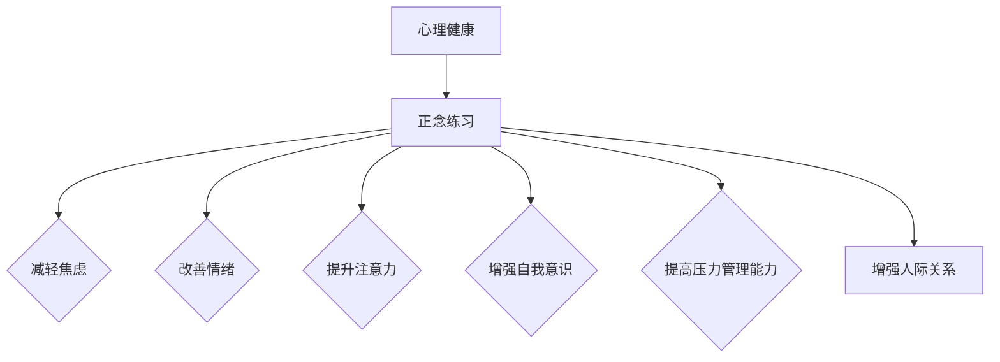
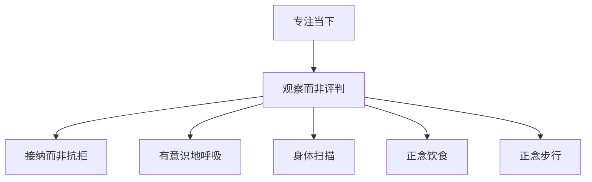
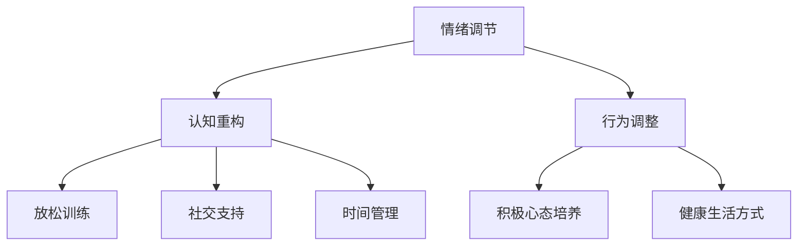

                 

# 《现代社会中的心理健康：正念练习与压力管理》

## 关键词
- 心理健康
- 正念练习
- 压力管理
- 焦虑缓解
- 情绪调节
- 时间管理

## 摘要
在快速发展的现代社会中，心理健康问题逐渐成为人们关注的焦点。本文将探讨心理健康的基础理论，重点介绍正念练习及其在压力管理中的应用。通过深入分析正念练习的基本原理和实践方法，结合情绪调节、时间管理和社交支持等策略，本文旨在为读者提供一套完整的心理健康维护方案，帮助他们更好地应对现代生活的压力。

## 第一部分：心理健康基础理论

### 第1章：心理健康概述
心理健康是一个多维度的概念，不仅涉及情感的稳定，还包括认知功能、社会适应能力和整体生活满意度。在技术日益进步、生活节奏加快的当下，心理健康的重要性愈加凸显。本章节将详细探讨心理健康的定义、重要性以及评估标准，同时探讨心理健康与心理健康的关系，为后续章节的深入探讨奠定基础。

### 第2章：正念练习原理
正念是一种源自佛教禅修的练习方式，强调专注于当下的体验，接纳而非抗拒内心的感受。本章节将详细介绍正念的定义、起源与发展，解析正念练习的基本原理和心理学基础。通过理解正念的核心思想，读者将能够更好地掌握这一有助于提升心理健康的实践方法。

### 第3章：压力管理的概念与影响
压力是现代社会中不可避免的一部分，长期的慢性压力会对身心健康产生严重影响。本章节将定义压力，分析其来源、生理与心理影响，并讨论压力管理的必要性。了解压力的本质和影响，有助于读者更加重视压力管理，并在日常生活中采取有效措施减轻压力。

### 第4章：心理健康的常见问题
心理健康问题种类繁多，包括焦虑、抑郁、强迫症等。本章节将概述常见心理疾病的定义、识别方法以及干预与治疗策略。同时，提供一系列心理健康维护策略，帮助读者提高心理弹性，预防和缓解心理健康问题。

## 第二部分：正念练习实践

### 第5章：正念呼吸练习
呼吸是正念练习中最基本的元素之一，通过专注呼吸，可以帮助人们放松身心，缓解压力。本章节将详细介绍正念呼吸练习的步骤、益处以及常见问题与解决方案，帮助读者在实践中更好地掌握这一简单的却强大的放松技巧。

### 第6章：正念行走练习
步行是一种简单有效的锻炼方式，结合正念练习，可以进一步提升其心理和身体效益。本章节将探讨正念行走练习的步骤、益处以及常见问题与解决方案，帮助读者在日常步行中融入正念练习，提升身心健康。

### 第7章：正念饮食练习
饮食不仅影响身体健康，也与心理健康密切相关。正念饮食强调对食物的专注和感激，有助于改善饮食质量和心理健康。本章节将介绍正念饮食的步骤、益处以及常见问题与解决方案，帮助读者建立健康的饮食习惯。

## 第三部分：压力管理策略

### 第8章：情绪调节与压力管理
情绪调节是压力管理的重要组成部分，有效的情绪调节策略可以帮助人们更好地应对压力。本章节将探讨情绪调节的概念、方法及其与压力管理的关系，提供一系列常见的情绪调节技巧，帮助读者掌握情绪调节的技巧，提升心理健康。

### 第9章：时间管理与压力管理
时间管理是减轻压力的重要手段之一，合理的时间管理可以提升工作效率，减少焦虑。本章节将介绍时间管理的原则、方法及其对压力的影响，提供实用的时间管理策略，帮助读者优化时间安排，减轻生活压力。

### 第10章：社交支持与压力管理
社交支持在压力管理中起着至关重要的作用。本章节将探讨社交支持的概念、形式及其与压力管理的关系，提供建立有效社交支持网络的方法，帮助读者在压力面前获得更多的支持和帮助。

## 第四部分：案例研究与实践应用

### 第11章：心理健康案例分析
通过实际案例的分析，读者可以更直观地了解正念练习与压力管理在实际生活中的应用效果。本章节将选取多个案例，分别探讨正念练习在焦虑管理、职场压力应对以及老年人心理健康中的应用，为读者提供实践参考。

### 第12章：正念练习与压力管理的实践应用
本章节将提供正念练习与压力管理的实践指南，包括具体的练习方法、技巧和注意事项。通过实际案例的应用解读，读者可以更深入地了解如何将正念练习和压力管理策略应用于日常生活中，提升心理健康水平。

## 附录

### 附录A：正念练习资源
本附录将推荐一些正念练习的书籍、在线资源和团体活动指南，为读者提供更多的学习资源和实践机会。

### 附录B：压力管理工具
本附录将介绍一些压力评估工具、压力管理技巧手册以及压力管理应用软件，帮助读者更有效地进行自我评估和管理压力。

### 图1：心理健康与正念练习的关系流程图



### 图2：正念练习的基本原理流程图



### 图3：压力管理策略流程图



### 伪代码：正念呼吸练习

```plaintext
function 正念呼吸练习() {
    // 初始化变量
    深呼吸次数 = 5
    每次呼吸时间 = 5秒
    静坐时间 = 20分钟

    // 开始静坐
    静坐(静坐时间)

    // 开始深呼吸
    for (i = 1; i <= 深呼吸次数; i++) {
        深吸一口气(每次呼吸时间)
        慢慢呼出气体(每次呼吸时间)
    }

    // 结束练习
    结束练习()
}
```

### 数学模型：压力水平评估

$$
压力水平 = f(情绪状态, 时间管理能力, 社交支持度)
$$

- 情绪状态：用0到100的数值表示，越高表示情绪越不稳定
- 时间管理能力：用0到100的数值表示，越高表示时间管理能力越强
- 社交支持度：用0到100的数值表示，越高表示社交支持越强

### 总结
在现代社会中，心理健康问题不容忽视。通过正念练习与压力管理策略，我们可以更好地维护心理健康，提高生活质量。本文提供了全面的理论与实践指导，希望对读者有所启发。让我们从现在开始，积极关注心理健康，享受更加美好的生活。

### 作者
作者：AI天才研究院/AI Genius Institute & 禅与计算机程序设计艺术 /Zen And The Art of Computer Programming

### 注意事项
1. 正念练习和压力管理策略需要持续实践，效果可能需要一段时间才能显现。
2. 如果您遇到严重的心理健康问题，建议寻求专业心理咨询和治疗。
3. 在实践正念练习和压力管理策略时，注意结合个人实际情况进行调整，避免过度或不当的练习导致负面效果。
4. 保持积极的生活态度和健康的生活习惯，是维护心理健康的重要基础。

