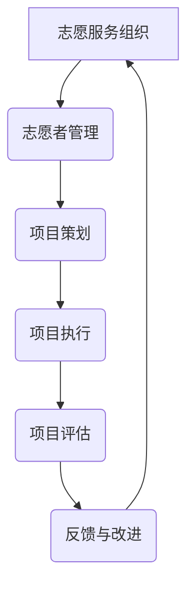
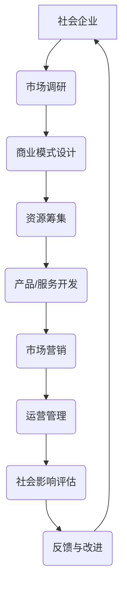

                 

### 写作准备

在撰写关于《现代社会中的志愿服务：公益创新与社会企业的兴起》的技术博客前，我们需要做好以下准备工作：

1. **文献调研**：首先，我们需要查阅相关的文献资料，了解志愿服务、公益创新和社会企业的历史、现状和发展趋势。这包括学术研究、政策文件、新闻报道、案例研究等。

2. **确定结构**：根据提供的目录大纲，我们确定了文章的结构和内容框架。每个章节都需要详细展开，确保内容丰富、逻辑清晰。

3. **关键词提取**：为了确保文章的覆盖面广，我们需要提取核心关键词，这些关键词将用于文章标题、摘要和目录中，以吸引读者的注意。

4. **技术语言准备**：鉴于文章的读者群体是IT专业人士，我们需要使用专业的技术语言来撰写，包括算法原理讲解、数学模型、代码示例等。

5. **案例准备**：为了增强文章的实际应用性和可操作性，我们需要准备相关的案例，可以是成功的公益创新项目或社会企业案例，以便在文章中进行分析和讨论。

### 文章标题与关键词

- 文章标题：《现代社会中的志愿服务：公益创新与社会企业的兴起》
- 关键词：志愿服务、公益创新、社会企业、IT应用、技术语言、案例研究

### 摘要

本文旨在探讨现代社会中志愿服务的兴起及其对公益创新和社会企业的影响。通过对志愿服务的历史、核心概念、组织与管理以及法律与政策环境的分析，本文揭示了志愿服务在现代社会中的重要作用。同时，文章深入探讨了公益创新的本质和类型，以及社会企业的概念、运作模式和未来趋势。通过实际案例的剖析和算法原理的讲解，本文为IT专业人士提供了一种新的视角，以理解和参与志愿服务和社会企业的实践。

---

### 文章正文

#### 第一部分：志愿服务的兴起与社会背景

##### 第1章：志愿服务的历史与演变

志愿服务作为一种无私奉献的行为，其起源可以追溯到古代。在人类历史长河中，志愿服务的概念和实践经历了漫长的演变过程。从最初的慈善行为，到现代的志愿服务体系，志愿服务始终伴随着人类社会的进步和发展。

在古代，慈善行为多基于个人的道德信仰和宗教教义。例如，佛教的“布施”和基督教的“慈善”都提倡人们无私奉献，帮助需要帮助的人。这些早期的慈善行为为现代志愿服务奠定了基础。

随着工业革命的到来，社会分工日益细化，社会问题也随之增多。在这一背景下，志愿服务开始从宗教和慈善活动中分离出来，成为一种独立的社会行为。19世纪，欧洲和美国出现了大量志愿者组织，如红十字会、慈善组织会社等。这些组织致力于帮助贫困人群、救助战争受害者，为现代志愿服务体系的建立奠定了基础。

20世纪以来，志愿服务在全球范围内得到了迅速发展。随着科技和信息手段的进步，志愿服务的形式和内容也日益丰富。现代社会中，志愿服务不仅包括传统的救助和慈善活动，还包括环境保护、教育支持、社区建设等多个领域。志愿服务成为社会和谐发展的重要力量。

##### 第1章.1.1 志愿服务起源与发展历程

志愿服务的起源可以追溯到古代的慈善行为和宗教活动。在古希腊和罗马时期，慈善活动就已经存在。例如，希腊的哲学家苏格拉底提倡通过慈善行为来改善社会环境；罗马的凯撒大帝也通过减免税收和捐助资金来帮助穷人。

中世纪时期，宗教成为推动慈善行为的主要力量。基督教和佛教都强调慈悲为怀、助人为乐的理念，鼓励信徒通过慈善行为来回报社会。这一时期的慈善活动多由教会组织和宗教团体主导。

到了近现代，随着工业化和城市化进程的加快，社会问题日益突出。19世纪初，欧洲和美国出现了大量志愿者组织，如英国慈善组织会社（Philanthropic Society）、美国慈善协会（American Relief Administration）等。这些组织通过募集资金、组织义工活动等方式，为社会提供了大量援助。

20世纪，志愿服务进入了一个新的发展阶段。随着科技和信息的进步，志愿服务的形式和内容更加多样化。许多国家和地区建立了专门的志愿服务体系，如美国的志愿工作者协会（VOLUNTEER）、英国的志愿服务协会（Volunteering England）等。这些组织通过立法和政策支持，鼓励更多人参与到志愿服务中来。

在中国，志愿服务也有着悠久的历史。20世纪初，随着新文化运动的兴起，志愿服务理念开始在中国传播。1949年新中国成立后，志愿服务成为社会主义建设的重要组成部分。改革开放以来，中国的志愿服务事业取得了长足发展，涌现出一大批优秀的志愿者组织和公益项目。

##### 第1章.1.2 志愿服务在全球的普及与发展

志愿服务在全球范围内得到了广泛普及和发展。不同国家和地区根据自身的社会背景和文化传统，形成了各具特色的志愿服务体系。

在欧洲，志愿服务历史悠久，发展成熟。许多国家建立了完善的志愿服务法律和政策框架，如英国的《志愿服务法》（Volunteering Act 2006）和德国的《志愿服务促进法》（Voluntary Service Promotion Act）。这些法律和政策为志愿服务提供了有力的支持和保障。

在美国，志愿服务是文化的一部分，被称为“义工精神”。美国有大量的志愿者组织，如红十字会、狮子会等。这些组织通过多样化的志愿服务项目，为社区和社会提供了广泛的服务。

在亚洲，日本和韩国的志愿服务也取得了显著成就。日本成立了志愿者协会（The Japan Volunteer Center），韩国则制定了《志愿服务促进法》。这些国家和地区通过立法和政策支持，推动了志愿服务的普及和发展。

在中国，志愿服务事业近年来得到了快速推进。随着社会的进步和人们公益意识的提高，越来越多的志愿者参与到各类公益活动中。中国政府也高度重视志愿服务，出台了一系列政策文件，如《志愿服务条例》（Volunteering Regulations）等，为志愿服务提供了法律保障。

##### 第1章.1.3 中国志愿服务的现状与趋势

中国的志愿服务事业起步较晚，但发展迅速。近年来，随着社会问题的增多和公益意识的提高，志愿服务在各个领域都取得了显著成就。

在救助领域，志愿者积极参与自然灾害救援、贫困救助、大病救助等活动。如“5·12”汶川地震和“7·20”河南郑州暴雨灾害中，志愿者们冲锋在前，为灾区人民提供了及时的帮助。

在社区服务方面，志愿者组织通过开展社区清洁、社区教育、社区文化活动等，提升了社区居民的生活质量。如“社区志愿者之家”项目，通过组织志愿者为社区居民提供各类服务，增强了社区的凝聚力和活力。

在教育支持领域，志愿者积极参与支教、助学、教育公益等活动。许多大学生志愿者利用寒暑假赴贫困地区支教，为当地儿童提供教育支持。

在环境保护方面，志愿者组织开展了大量环境保护活动，如植树造林、垃圾分类、环保宣传等。这些活动提高了公众的环保意识，推动了环境保护事业的发展。

未来，中国的志愿服务将继续保持快速发展态势。随着社会的进步和人们公益意识的提高，志愿服务将更加多样化、专业化。同时，政府、企业和社会组织将加大支持力度，为志愿服务提供更好的环境和条件。

##### 第2章：志愿服务的核心概念与类型

志愿服务是一种无私奉献的行为，其核心概念包括志愿者、志愿服务组织、志愿服务项目等。

志愿者是志愿服务的主体，他们是自愿参与到各种公益活动中的人。志愿者可以是个人、团体或组织，他们通过自己的时间和精力，为社会和他人提供帮助。

志愿服务组织是志愿者的集合体，它们负责策划、组织和实施各类志愿服务项目。志愿服务组织可以是政府机构、非政府组织（NGO）、社会团体等。

志愿服务项目是志愿服务的具体实施形式，它包括各种公益活动和志愿服务活动。志愿服务项目可以是长期的，也可以是临时的，它们根据实际需要和社会问题进行设计和实施。

志愿服务的类型多种多样，主要包括以下几类：

1. **救助服务**：包括自然灾害救助、贫困救助、大病救助等。志愿者在灾难发生时第一时间投入救援工作，为受灾群众提供物资和救援服务。

2. **社区服务**：包括社区清洁、社区教育、社区文化活动等。志愿者通过组织和参与社区服务活动，提升社区居民的生活质量和幸福感。

3. **教育支持**：包括支教、助学、教育公益等。志愿者利用自己的知识和技能，为贫困地区和弱势群体提供教育支持。

4. **环境保护**：包括植树造林、垃圾分类、环保宣传等。志愿者通过组织和参与环保活动，提高公众的环保意识，推动环境保护事业的发展。

5. **公共服务**：包括志愿服务站、志愿者咨询台、志愿服务热线等。志愿者为公众提供便捷的志愿服务，满足公众的各种需求。

##### 第2章.1.1 志愿服务的定义与特征

志愿服务是一种无私奉献的行为，其定义可以概括为：志愿者自愿、无偿地参与到各种公益活动中，为社会和他人提供帮助。志愿服务具有以下特征：

1. **自愿性**：志愿服务是志愿者的自愿行为，他们出于自愿和内心的善良，愿意为社会和他人付出时间和精力。

2. **无偿性**：志愿服务是无偿的，志愿者不收取任何报酬，他们的付出是出于对社会的热爱和对公益事业的执着。

3. **公益性**：志愿服务的目的是为了社会公共利益，志愿者通过自己的行动，帮助弱势群体，改善社会环境。

4. **广泛性**：志愿服务涉及各个领域和层面，包括救助、社区服务、教育支持、环境保护等。志愿者可以根据自己的兴趣和专业技能，选择适合自己的志愿服务项目。

5. **多样性**：志愿服务的形式和内容多样化，既有长期的、连续的服务项目，也有临时的、应急的服务活动。志愿者可以根据实际情况，灵活参与各类志愿服务。

##### 第2章.1.2 志愿服务的分类

志愿服务可以根据服务对象、服务内容和志愿服务组织的形式进行分类。以下是常见的几种分类方式：

1. **根据服务对象分类**：

   - **社会救助服务**：包括自然灾害救助、贫困救助、大病救助等，志愿者为受灾群众和弱势群体提供帮助。
   - **社区服务**：包括社区清洁、社区教育、社区文化活动等，志愿者在社区中开展各种公益活动。
   - **教育支持**：包括支教、助学、教育公益等，志愿者利用自己的知识和技能，为贫困地区和弱势群体提供教育支持。
   - **环境保护**：包括植树造林、垃圾分类、环保宣传等，志愿者通过组织和参与环保活动，提高公众的环保意识。
   - **公共服务**：包括志愿服务站、志愿者咨询台、志愿服务热线等，志愿者为公众提供便捷的志愿服务。

2. **根据服务内容分类**：

   - **应急服务**：包括自然灾害救援、突发事件应对等，志愿者在紧急情况下迅速行动，为公众提供救援和帮助。
   - **长期服务**：包括社区建设、教育支持、环保宣传等，志愿者长期参与某个领域的志愿服务，为该领域的发展做出贡献。
   - **临时服务**：包括公益演出、慈善活动、社会调查等，志愿者根据实际需要，参与临时性的志愿服务项目。

3. **根据志愿服务组织的形式分类**：

   - **政府主导**：政府通过设立志愿服务组织，组织和管理各类志愿服务项目。
   - **社会组织**：非政府组织、社会团体等通过自发组织和参与志愿服务，推动公益事业的发展。
   - **企业赞助**：企业通过提供资金、物资、技术等支持，参与志愿服务活动。
   - **志愿者自发**：志愿者自行组织，通过个人或小团队的形式，开展志愿服务。

##### 第2章.1.3 志愿服务的价值与意义

志愿服务在社会发展中具有重要的价值和意义，主要体现在以下几个方面：

1. **提升社会凝聚力**：志愿服务是一种社会互助行为，它能够拉近人与人之间的距离，增强社会的凝聚力。通过志愿服务，人们能够更好地理解和关心他人，形成和谐的社会氛围。

2. **推动社会进步**：志愿服务是社会发展的重要动力。通过志愿服务，可以解决社会问题，改善社会环境，推动社会进步。例如，在贫困救助、教育支持、环境保护等领域，志愿服务发挥了重要作用。

3. **培养公民意识**：志愿服务是一种社会责任感的体现。通过参与志愿服务，人们能够更好地了解社会问题，培养公民意识和社会责任感，成为有责任、有担当的公民。

4. **提高个人素质**：志愿服务是一种自我提升的过程。通过志愿服务，人们可以学习新知识、新技能，提高自己的综合素质。同时，志愿服务也是一种锻炼和成长的机会，有助于培养团队合作精神、领导能力和人际交往能力。

5. **促进社会和谐**：志愿服务能够促进社会和谐。通过志愿服务，可以缓解社会矛盾，减少社会冲突，营造和谐的社会环境。

总之，志愿服务是一种无私奉献的行为，它不仅有助于社会的发展和进步，还能够提升个人的价值和社会责任感。因此，志愿服务在现代社会中具有重要的价值和意义。

##### 第3章：志愿服务的组织与管理

志愿服务的组织和管理是志愿服务工作的重要组成部分。有效的组织和管理能够确保志愿服务的顺利开展，提高志愿服务的质量和效果。以下将从志愿服务组织的形式与功能、志愿服务项目的管理、志愿服务团队的构建与维护等方面进行详细介绍。

##### 第3章.1.1 志愿服务组织的形式与功能

志愿服务组织的形式多样，主要包括政府主导型、非政府组织（NGO）型、企业型和社会团体型等。

1. **政府主导型志愿服务组织**：

   - **形式**：政府通过设立专门机构或部门，负责组织和协调志愿服务工作。
   - **功能**：政府主导型志愿服务组织的主要功能包括政策制定、资源调配、项目审批、志愿者管理、宣传推广等。

2. **非政府组织（NGO）型志愿服务组织**：

   - **形式**：非政府组织（NGO）是由志愿者自发组成的，以公益为目的的社会组织。
   - **功能**：非政府组织（NGO）型志愿服务组织的主要功能包括项目策划、资源筹集、项目实施、志愿者招募与培训、宣传与推广等。

3. **企业型志愿服务组织**：

   - **形式**：企业型志愿服务组织是企业内部设立的，以企业社会责任（CSR）为目的的志愿服务团队。
   - **功能**：企业型志愿服务组织的主要功能包括项目策划、员工志愿者招募与培训、项目实施、资源筹集、宣传与推广等。

4. **社会团体型志愿服务组织**：

   - **形式**：社会团体型志愿服务组织是由社会各界人士组成的，以公益事业为目的的志愿服务团队。
   - **功能**：社会团体型志愿服务组织的主要功能包括项目策划、资源筹集、项目实施、志愿者招募与培训、宣传与推广等。

##### 第3章.1.2 志愿服务项目的管理

志愿服务项目的管理是志愿服务工作的重要环节，直接关系到志愿服务的效果和影响力。以下从项目策划、项目执行和项目评估等方面介绍志愿服务项目的管理。

1. **项目策划**：

   - **目标设定**：项目策划的第一步是明确项目的目标。目标应具体、明确、可量化，以便后续的执行和评估。
   - **需求分析**：在设定目标的基础上，进行需求分析，了解服务对象的需求和期望，为项目实施提供依据。
   - **资源评估**：评估项目的资源，包括人力资源、物资资源、资金资源等，确保项目实施的可行性。
   - **项目方案设计**：根据目标、需求分析和资源评估，设计项目的具体实施方案，包括项目目标、服务内容、服务方式、时间安排等。

2. **项目执行**：

   - **志愿者招募与培训**：根据项目方案，招募志愿者并进行培训，确保志愿者具备项目所需的知识和技能。
   - **项目实施**：按照项目方案，组织开展志愿服务活动，确保项目的顺利进行。
   - **沟通协调**：在项目实施过程中，与志愿者、服务对象和其他相关部门进行沟通协调，解决项目执行中的问题。

3. **项目评估**：

   - **过程评估**：在项目实施过程中，对项目的过程进行实时监控和评估，确保项目按照计划顺利进行。
   - **效果评估**：在项目结束后，对项目效果进行评估，包括服务对象满意度、项目影响力、资源利用情况等。
   - **总结反思**：根据评估结果，总结项目经验，反思项目中的问题和不足，为后续项目的改进提供参考。

##### 第3章.1.3 志愿服务团队的构建与维护

志愿服务团队的构建与维护是志愿服务组织成功的关键。以下从团队组建、团队管理、团队文化等方面介绍志愿服务团队的构建与维护。

1. **团队组建**：

   - **确定团队目标**：在组建团队前，明确团队的目标和愿景，确保团队成员共同追求同一目标。
   - **招募志愿者**：通过多种渠道招募志愿者，包括线上招募、线下招募、推荐等，确保团队的多样性和活力。
   - **面试与选拔**：对招募的志愿者进行面试和选拔，了解其能力和兴趣，确保团队的整体素质。

2. **团队管理**：

   - **明确分工**：根据团队成员的能力和兴趣，明确各自的职责和任务，确保团队的协作和高效运行。
   - **定期会议**：定期组织团队会议，讨论项目进展、团队管理等问题，确保团队的沟通和协作。
   - **激励机制**：建立激励机制，鼓励团队成员积极参与志愿服务，提升团队凝聚力。

3. **团队文化**：

   - **价值观建设**：树立志愿服务团队的价值观，如无私奉献、团队合作、持续创新等，确保团队成员共同价值观的认同。
   - **团队氛围**：营造积极向上的团队氛围，鼓励团队成员相互支持、相互帮助，提升团队凝聚力。
   - **团队活动**：定期组织团队活动，如团队建设培训、公益活动等，增强团队凝聚力和归属感。

通过有效的组织和管理，志愿服务团队可以更好地实现其目标，为社会和他人提供优质的服务。同时，志愿服务团队的建设与维护也有助于提升志愿服务组织的整体效能，推动公益事业的发展。

##### 第3章.1.4 志愿服务中的法律与政策环境

志愿服务在法律和政策环境中的地位和作用对于志愿服务的健康发展至关重要。不同国家和地区根据自身的社会背景和法治环境，制定了相应的法律法规和政策，为志愿服务提供了法律保障和制度支持。

1. **法律法规体系**：

   - **国际层面**：联合国、国际红十字会等国际组织通过相关法律法规，对志愿服务进行规范和指导。如《联合国志愿服务宣言》（United Nations Declaration on Volunteer Service）明确规定了志愿服务的原则和权利。
   - **国家层面**：许多国家制定了专门的志愿服务法律法规，如英国的《志愿服务法》（Volunteering Act 2006）、美国的《志愿服务促进法》（Volunteerism and Service Act of 2002）等。这些法律法规明确了志愿服务的定义、范围、权利和义务，为志愿服务提供了法律保障。
   - **地方层面**：一些国家和地区在地方政府层面也制定了相应的志愿服务规章制度，如中国的地方志愿服务条例等。

2. **政策环境**：

   - **政策支持**：许多国家和地区的政府通过政策文件，鼓励和支持志愿服务的发展。如中国政府发布的《志愿服务条例》等政策文件，明确了志愿服务的法律地位、扶持政策和激励机制。
   - **财政支持**：政府通过财政拨款、税收优惠等方式，为志愿服务提供资金支持。如英国政府为志愿服务组织提供财政补贴，美国政府对志愿服务机构实行税收减免政策。
   - **社会认可**：政府和社会对志愿服务的认可和尊重，有助于提升志愿服务的社会地位和影响力。如一些国家和地区通过颁发志愿服务奖章、荣誉称号等方式，表彰优秀志愿者和志愿服务组织。

3. **志愿服务组织注册与运营**：

   - **注册要求**：志愿服务组织通常需要依法注册，取得合法身份。不同国家和地区的注册要求和程序有所不同，如中国要求志愿服务组织在民政部门登记注册。
   - **运营管理**：志愿服务组织的运营管理受到法律法规和政策的规范。组织需要遵循法律法规，合法运营，确保志愿服务的质量和效果。
   - **法律责任**：志愿服务组织在运营过程中，如违反法律法规，可能面临法律责任。因此，组织需要了解和遵守相关法律法规，确保合法运营。

通过完善的法律和政策环境，志愿服务得以在法治轨道上健康发展，为社会和他人提供优质的志愿服务。同时，法律和政策环境也为志愿服务组织提供了有力支持，推动了志愿服务事业的繁荣和发展。

##### 第3章.1.5 志愿服务中的问题与挑战

志愿服务作为一种无私奉献的行为，虽然在现代社会中发挥着重要作用，但在实际运作过程中也面临着一系列问题和挑战。

1. **资源问题**：

   - **志愿者招募困难**：由于志愿服务是一种无偿行为，一些志愿者组织在招募志愿者时面临困难，尤其是对于专业知识和技能要求较高的志愿服务项目。
   - **资金短缺**：志愿服务组织往往依赖捐款和赞助，但资金来源不稳定，容易导致资金短缺，影响项目的正常开展。
   - **物资缺乏**：一些志愿服务项目需要大量的物资支持，如救助物资、教育物资等，但物资的筹集和分配也存在困难。

2. **管理与协调问题**：

   - **管理不规范**：一些志愿服务组织在管理和运营方面不规范，缺乏有效的管理体系，导致志愿服务质量不稳定。
   - **协调不力**：在大型志愿服务项目中，协调不同部门、组织和志愿者之间的工作关系是一项挑战。协调不力可能导致项目进展缓慢，甚至出现混乱。
   - **培训不足**：志愿者在参与志愿服务前往往缺乏必要的培训，导致他们在实际操作中遇到困难，影响志愿服务的效果。

3. **可持续发展问题**：

   - **志愿者流失**：由于志愿服务是无偿的，一些志愿者在参与一段时间后可能会因疲惫、缺乏动力等原因选择退出，导致志愿者流失。
   - **项目可持续性**：一些志愿服务项目在短期内取得了显著效果，但长期来看却难以持续。项目缺乏可持续性可能导致成果难以巩固，甚至出现反弹。

4. **社会认知问题**：

   - **志愿服务定位不清**：在一些人眼中，志愿服务是一种低端、低效的行为，对志愿服务的价值和意义认识不足。
   - **社会支持不足**：虽然志愿服务在社会中具有一定的影响力，但整体来说，社会对志愿服务的支持力度仍有待提高，如资金、资源、政策等方面的支持。

为了解决这些问题和挑战，志愿服务组织需要从以下几个方面进行改进：

- **加强志愿者招募与培训**：通过多种渠道招募志愿者，提高招募质量；对志愿者进行系统培训，提升其专业素养。
- **完善管理体系**：建立健全志愿服务管理体系，确保志愿服务的质量和效果；加强内部协调，提高工作效率。
- **拓宽资金来源**：通过多种方式筹集资金，确保志愿服务项目的可持续性；争取政府和社会的支持，提高志愿服务的社会地位。
- **注重项目可持续性**：设计具有长期影响力的志愿服务项目，确保项目的可持续性；关注志愿者成长和激励，提高志愿者参与度。

通过解决这些问题和挑战，志愿服务将更好地发挥其社会功能，为构建和谐社会贡献力量。

---

#### 第二部分：公益创新与社会企业

##### 第6章：公益创新的兴起与理念

公益创新是现代社会中一种重要的社会现象，它通过创新的方法和模式，推动公益事业的发展，提高社会福祉。公益创新的兴起源于人们对社会问题的关注和解决社会问题的需求。

##### 第6章.1.1 公益创新的定义与特点

公益创新是指在传统公益模式的基础上，通过引入新理念、新方法、新技术等，对公益活动的形式、内容、运作方式等进行创新，从而提高公益效率和社会效益的一种社会行为。

公益创新的特点主要包括：

1. **创新性**：公益创新强调创新思维和方法，通过新理念、新技术、新模式等推动公益事业的发展。
2. **系统性**：公益创新不仅仅关注单一的问题或领域，而是从系统化的角度出发，综合考虑社会问题，提出综合解决方案。
3. **合作性**：公益创新强调多方合作，通过政府、企业、社会组织、志愿者等多方力量的共同参与，实现公益目标。
4. **可持续性**：公益创新注重长期影响，追求公益项目的可持续性，确保公益成果的长期巩固。

##### 第6章.1.2 公益创新的类型

公益创新可以分为以下几种类型：

1. **模式创新**：通过改变公益活动的运作方式，提高公益效率。例如，采用互联网+公益的模式，利用互联网技术提升公益活动的传播效果和参与度。
2. **技术驱动**：利用新技术推动公益事业的发展，如大数据、人工智能、物联网等技术在公益项目中的应用。
3. **跨领域合作**：通过跨领域的合作，整合多方资源，共同解决社会问题。例如，公益组织与企业的合作，通过资源共享、技术支持等方式，实现公益目标。
4. **创新筹资方式**：通过创新筹资方式，拓宽公益项目的资金来源。例如，利用众筹、公益债券等新型筹资方式，提高公益项目的资金稳定性。
5. **项目创新**：在具体公益项目中进行创新，提高项目的影响力和效果。例如，通过设计新的公益活动、推出创新公益产品等方式，吸引更多人参与公益事业。

##### 第6章.1.3 公益创新对社会的影响

公益创新对社会产生了深远的影响，主要体现在以下几个方面：

1. **提升公益效率**：公益创新通过引入新技术、新模式，提高公益活动的效率和效果，使公益资源得到更合理的配置和使用。
2. **增强社会参与**：公益创新激发了公众的公益热情，吸引更多人参与到公益活动中，增强了社会的公益意识和社会责任感。
3. **解决社会问题**：公益创新通过创新的方法和模式，针对社会问题提出解决方案，促进了社会问题的解决和社会进步。
4. **推动社会变革**：公益创新挑战了传统的公益模式，推动了公益理念、机制、运作方式的变革，促进了社会公平正义的实现。

总之，公益创新是现代社会中一种重要的社会现象，它通过创新的方法和模式，推动公益事业的发展，提高社会福祉，为实现社会和谐、可持续发展贡献力量。

---

##### 第7章：社会企业的概念与运作

社会企业是一种将商业运作与社会责任相结合的新型企业形式，旨在通过市场手段解决社会问题，实现社会效益。社会企业在现代社会中发挥着越来越重要的作用，成为公益事业和商业发展的重要纽带。

##### 第7章.1.1 社会企业的定义与特征

社会企业是一种特殊的企业形式，其定义可以概括为：以商业运作模式解决社会问题，实现社会效益的企业。社会企业的核心特征包括：

1. **商业运作**：社会企业通过商业手段获取收入，实现自我维持和可持续发展。与传统公益机构不同，社会企业强调经济效益和社会效益的双重目标。
2. **社会责任**：社会企业的经营宗旨是解决社会问题，满足社会需求，而非仅仅追求经济利益。社会企业通过创新商业模式，为社会提供有价值的产品和服务。
3. **自我维持**：社会企业通过自身经营实现盈亏平衡，无需依赖外部资助。社会企业的收入主要用于再投资，扩大服务范围，实现长期可持续发展。
4. **创新性**：社会企业注重创新，通过创新商业模式、运营模式和服务模式，提高公益效率和效果。

##### 第7章.1.2 社会企业的商业模式

社会企业的商业模式主要包括以下几种类型：

1. **产品销售模式**：社会企业通过销售产品获取收入，用于支持公益事业。例如，社会企业可以生产环保产品，将销售收入用于环境保护项目的实施。
2. **服务提供模式**：社会企业通过提供专业服务获取收入，用于支持公益事业。例如，社会企业可以提供心理咨询、教育辅导等服务，将服务收入用于帮助贫困学生。
3. **混合模式**：社会企业结合多种商业模式，实现收入多元化。例如，社会企业可以销售产品、提供服务，并将部分收入用于公益事业。
4. **众筹模式**：社会企业通过众筹平台筹集资金，用于支持公益项目。例如，社会企业可以发布公益项目，吸引公众捐款，实现项目资金筹集。

##### 第7章.1.3 社会企业的发展策略

社会企业在发展过程中需要制定合适的发展策略，以实现可持续发展。以下是一些常见的发展策略：

1. **明确使命与愿景**：社会企业需要明确自己的使命和愿景，确保企业发展的方向和目标清晰明确。
2. **创新商业模式**：社会企业需要不断创新商业模式，提高公益效率和效果。通过商业模式创新，社会企业可以更好地解决社会问题，实现可持续发展。
3. **整合多方资源**：社会企业需要整合政府、企业、社会组织、志愿者等多方资源，实现优势互补，共同推动公益事业的发展。
4. **品牌建设**：社会企业需要注重品牌建设，提升企业形象和公信力。良好的品牌形象有助于社会企业吸引更多的关注和支持。
5. **人才培养与激励**：社会企业需要注重人才培养与激励，吸引和留住优秀的员工。通过提供良好的工作环境和发展机会，社会企业可以激发员工的创新和奉献精神。

总之，社会企业是一种具有创新性和社会责任感的企业形式，通过商业运作实现社会效益，为解决社会问题提供了新的途径。社会企业的发展策略包括明确使命与愿景、创新商业模式、整合多方资源、品牌建设和人才培养与激励等，这些策略有助于社会企业实现可持续发展。

---

##### 第8章：社会企业案例分析

社会企业作为一种创新的社会组织形式，其在解决社会问题、创造社会价值方面取得了显著成果。本章节将分析国内外一些知名的社会企业案例，探讨其成功经验与启示。

##### 第8章.1.1 国内外知名社会企业案例

1. **国内外知名社会企业案例**：

   - **南非Vodacom公司**：Vodacom是一家全球知名的移动通信公司，其在南非开展的一项社会企业项目“Vodacom保龄球”旨在帮助贫困社区发展。该项目通过提供免费互联网服务、在线教育和就业培训，帮助社区居民提高技能、增加收入。Vodacom保龄球项目不仅提高了社区居民的生活水平，还推动了社区经济的繁荣。

   - **美国汤姆森路透基金会**：汤姆森路透基金会是一家以社会责任为核心价值的企业基金会。其推出的“新闻行动”项目，通过报道和传播全球社会问题，提高公众对社会问题的关注和参与度。该项目不仅为新闻从业者提供了专业的培训，还通过合作媒体平台，将新闻传播到世界各地，为全球公益事业贡献了力量。

   - **中国爱德基金会**：爱德基金会是一家专注于扶贫、教育、医疗等领域的公益组织。其推出的“爱心水窖”项目，通过建设饮用水窖，解决贫困地区居民饮水难题。该项目不仅改善了当地居民的生活条件，还提高了他们的健康水平，为贫困地区的可持续发展奠定了基础。

   - **印度阿玛蒂基金会**：阿玛蒂基金会是一家致力于改善农村基础设施的社会企业。其推出的“阿玛蒂村庄”项目，通过建设村庄基础设施、提供就业机会、开展教育和健康服务，推动农村地区的可持续发展。阿玛蒂基金会通过创新商业模式，将商业运作与公益事业相结合，实现了良好的社会效益。

##### 第8章.1.2 社会企业的成功经验与启示

通过分析上述案例，我们可以总结出一些社会企业的成功经验与启示：

1. **明确使命与愿景**：社会企业需要明确自身的使命和愿景，确保企业在发展过程中始终保持社会责任感。成功的案例中，企业通过明确的社会使命和愿景，为社会和利益相关方提供了清晰的方向和目标。

2. **创新商业模式**：社会企业需要不断创新商业模式，以适应不断变化的社会需求和挑战。成功的案例中，企业通过创新商业模式，将商业运作与公益事业相结合，实现了可持续发展。

3. **整合多方资源**：社会企业需要整合政府、企业、社会组织、志愿者等多方资源，实现优势互补，共同推动公益事业的发展。成功的案例中，企业通过多方资源的整合，提高了公益项目的效率和社会效益。

4. **注重社会效益**：社会企业注重社会效益，通过解决社会问题、提高社会福祉，实现企业的长期发展。成功的案例中，企业通过追求社会效益，赢得了公众的信任和支持，为企业的可持续发展奠定了基础。

5. **品牌建设与传播**：社会企业需要注重品牌建设与传播，提升企业形象和公信力。成功的案例中，企业通过良好的品牌形象和有效的传播策略，吸引了更多的关注和支持。

##### 第8章.1.3 社会企业的未来发展趋势

随着社会问题的日益复杂和多样化，社会企业在未来将面临更多的机遇和挑战。以下是一些社会企业的未来发展趋势：

1. **技术创新**：社会企业将更加注重技术创新，通过引入新技术、新模式，提高公益效率和效果。例如，大数据、人工智能、区块链等技术在公益项目中的应用将越来越广泛。

2. **跨界合作**：社会企业将加强跨界合作，与其他企业、社会组织、政府等共同解决社会问题。跨界合作将促进资源整合、优势互补，提高公益项目的综合效益。

3. **多元化融资**：社会企业将探索多元化融资渠道，拓宽资金来源。例如，通过众筹、公益债券、政府资助等多元化融资方式，实现公益项目的可持续性。

4. **国际化发展**：社会企业将更加注重国际化发展，将成功的经验模式复制到全球其他国家和地区。通过国际化发展，社会企业可以更好地发挥其社会价值，推动全球公益事业的发展。

5. **社会责任整合**：社会企业将更加注重社会责任整合，将企业社会责任（CSR）融入企业战略和业务运营中。通过社会责任整合，社会企业可以更好地实现商业目标和社会目标的统一。

总之，社会企业在未来将继续发挥重要作用，通过技术创新、跨界合作、多元化融资、国际化发展和社会责任整合等手段，推动公益事业的发展，创造更多的社会价值。

---

##### 第9章：志愿服务与社会企业的融合

志愿服务与社会企业的融合是现代社会中一种创新的现象，二者通过协同作用，实现了资源整合、效益最大化。以下将从志愿服务与社会企业的协同效应、社会企业在志愿服务中的应用、社会企业在志愿服务中的角色与责任等方面进行探讨。

##### 第9章.1.1 志愿服务与社会企业的协同效应

志愿服务与社会企业的融合产生了显著的协同效应，具体体现在以下几个方面：

1. **资源整合**：志愿服务与社会企业的融合，使得资源得到更有效的整合。社会企业通过商业运作获取资金、物资等资源，而志愿服务则提供了大量的人力资源。二者的结合，使得资源利用更加高效，为社会问题提供了更多的解决方案。

2. **效益最大化**：志愿服务与社会企业的协同作用，实现了效益最大化。社会企业通过商业手段获取收入，支持志愿服务项目的实施；而志愿服务则为社会企业提供了良好的社会形象和品牌价值，促进了企业的可持续发展。

3. **社会责任履行**：志愿服务与社会企业的融合，有助于企业更好地履行社会责任。社会企业通过参与志愿服务，不仅提升了企业的社会形象，还增强了企业的社会责任感和使命感。这种社会责任的履行，进一步促进了企业的可持续发展。

4. **创新能力提升**：志愿服务与社会企业的融合，激发了创新活力。社会企业在实施志愿服务项目时，通过引入新技术、新模式，提高了公益效率和效果；而志愿服务则为社会企业提供了创新的实践平台，推动了企业的创新发展。

##### 第9章.1.2 社会企业在志愿服务中的应用

社会企业在志愿服务中的应用，主要体现在以下几个方面：

1. **项目设计**：社会企业通过创新思维和商业模式，设计出具有可持续性的志愿服务项目。这些项目不仅解决了社会问题，还实现了经济效益和社会效益的双重目标。

2. **资金支持**：社会企业通过商业运作获取收入，为志愿服务项目提供资金支持。这种资金支持，确保了志愿服务项目的持续性和稳定性。

3. **技术支持**：社会企业利用自身的技术优势和资源，为志愿服务项目提供技术支持。例如，社会企业可以通过大数据分析、人工智能等技术手段，提升志愿服务项目的效率和效果。

4. **品牌建设**：社会企业通过参与志愿服务，提升企业的社会形象和品牌价值。这种品牌建设，有助于企业在市场中获得更多的认可和信任。

##### 第9章.1.3 社会企业在志愿服务中的角色与责任

在社会企业的志愿服务中，企业承担着重要的角色和责任，主要包括：

1. **组织者**：社会企业在志愿服务中起到组织者的角色，负责项目的设计、实施和评估。企业需要确保志愿服务项目的顺利进行，为社会提供有效的帮助。

2. **资金提供者**：社会企业通过商业运作获取收入，为志愿服务项目提供资金支持。企业需要确保资金的使用效率，确保项目的可持续性。

3. **技术支持者**：社会企业利用自身的技术优势和资源，为志愿服务项目提供技术支持。企业需要不断提升技术能力，提高志愿服务项目的效率和效果。

4. **社会责任承担者**：社会企业承担社会责任，通过参与志愿服务，为社会和利益相关方创造价值。企业需要树立良好的社会责任形象，赢得社会的认可和信任。

总之，志愿服务与社会企业的融合，实现了资源整合、效益最大化、社会责任履行和创新能力提升。社会企业在志愿服务中发挥着重要的角色和责任，为解决社会问题、推动社会进步做出了积极贡献。

---

#### 第三部分：未来发展展望与趋势

##### 第10章：未来发展展望与趋势

随着社会的不断进步和科技的发展，志愿服务和社会企业在未来将继续发挥重要作用。以下从志愿服务与公益创新的未来趋势、社会企业的发展前景、社会责任与可持续发展等方面进行展望。

##### 第10章.1.1 志愿服务与公益创新的未来趋势

1. **数字化发展**：随着互联网和信息技术的发展，志愿服务和公益创新将越来越依赖数字化手段。通过大数据、人工智能、区块链等新技术，志愿服务和公益创新将实现更高效的资源调配、更精准的服务提供和更广泛的社会参与。

2. **专业化与多样化**：志愿服务和公益创新将朝着专业化、多样化的方向发展。越来越多的专业人才将投身志愿服务，为社会提供高质量的服务。同时，志愿服务和公益创新的内容将更加丰富多样，涵盖环境保护、教育支持、健康医疗、社区建设等多个领域。

3. **跨界融合**：志愿服务和公益创新将与其他领域（如商业、科技、文化等）进行跨界融合，形成新的发展模式。跨界融合将促进资源共享、优势互补，提高志愿服务和公益创新的效率和社会效益。

4. **全球协作**：志愿服务和公益创新将更加注重全球协作，推动全球范围内的公益事业共同发展。通过国际合作、跨国项目等，志愿服务和公益创新将打破地域限制，实现全球范围内的资源整合和经验交流。

##### 第10章.1.2 社会企业的发展前景

1. **政策支持**：随着各国政府对社会企业的重视，未来社会企业将获得更多的政策支持和优惠待遇。政府将通过立法、财政支持、税收优惠等方式，鼓励和扶持社会企业的发展。

2. **市场机会**：随着社会问题的日益突出和公众对社会责任的重视，社会企业将迎来更多的发展机会。社会企业可以通过创新的商业模式，解决社会问题，创造经济价值，实现可持续发展。

3. **技术创新**：社会企业将更加注重技术创新，通过引入新技术、新模式，提高服务效率和效果。例如，利用大数据、人工智能等技术手段，社会企业可以更好地预测社会需求、优化资源配置，提高公益项目的效益。

4. **全球扩展**：随着全球化的推进，社会企业将越来越多地参与到全球公益事业中。社会企业将通过跨国合作、国际项目等，实现全球范围内的资源整合和经验交流，推动全球公益事业的发展。

##### 第10章.1.3 社会责任与可持续发展

1. **企业社会责任（CSR）**：随着企业社会责任的重视，社会企业将更加注重企业社会责任的履行。企业将通过公益捐赠、志愿服务、环保行动等方式，积极参与社会公益事业，提升企业形象和品牌价值。

2. **可持续发展**：社会企业将致力于可持续发展，通过创新商业模式、优化资源配置、提高能源利用效率等手段，实现经济效益和社会效益的统一。社会企业将推动可持续发展理念的传播和实践，为构建和谐社会贡献力量。

3. **公众参与**：公众对社会企业的参与度将不断提高，越来越多的公众将关注和参与到社会企业的公益事业中。公众参与将激发社会企业的创新活力，推动公益事业的发展。

4. **社会监督**：随着社会监督的加强，社会企业将更加透明、规范地运营。公众和社会组织将加强对社会企业的监督，推动社会企业的规范化和专业化发展。

总之，志愿服务与社会企业将在未来发挥更加重要的作用。通过数字化发展、专业化与多样化、跨界融合、全球协作等趋势，志愿服务和公益创新将实现更高效的服务和更广泛的社会影响。同时，社会企业将获得政策支持、市场机会、技术创新和全球扩展等发展前景，推动社会责任和可持续发展。在未来，志愿服务和社会企业将共同推动社会进步，为构建更加美好的社会贡献力量。

---

## 附录

### 附录A：志愿服务与社会企业相关的资源与工具

为了更好地支持和促进志愿服务与社会企业的发展，以下列举了一些相关的资源与工具：

#### A.1 志愿服务组织推荐

1. **国际红十字会**：全球最大的志愿服务组织，致力于人道主义援助和救灾工作。
2. **联合国志愿人员组织**：为联合国系统提供志愿者的国际组织。
3. **中国志愿服务联合会**：中国最大的志愿服务组织联盟，推动志愿服务事业发展。

#### A.2 社会企业评估工具

1. **社会影响力评估工具**：评估社会企业创造的社会价值，如“社会影响力价值评估体系”（SIV）。
2. **商业模型画布**：用于设计和分析社会企业的商业模式。
3. **企业社会责任（CSR）评估工具**：评估企业在社会责任方面的表现，如“全球报告倡议组织”（GRI）标准。

#### A.3 志愿服务管理软件

1. **VolunteerHub**：用于志愿者招募、管理和服务记录的在线平台。
2. **CiviCRM**：一款开源的客户关系管理软件，支持志愿服务组织的管理和运营。
3. **Voysey**：一款用于志愿者管理、活动和项目跟踪的软件。

### 附录B：参考文献

1. **联合国志愿人员组织**.（2019）. 《联合国志愿人员组织年度报告》.
2. **中国志愿服务联合会**.（2020）. 《中国志愿服务事业发展报告》.
3. **福布斯**.（2021）. 《社会企业全球发展趋势报告》.
4. **国际红十字会**.（2020）. 《国际红十字会增加社会价值报告》.
5. **中国社会科学院**.（2021）. 《中国社会企业研究报告》.
6. **杨俊，陈宇光**.（2020）. 《志愿服务与社会企业研究》. 北京：中国社会科学出版社.

### 附录C：Mermaid流程图

以下是几个与志愿服务和社会企业相关的Mermaid流程图示例：

#### C.1 志愿服务组织架构图



#### C.2 社会企业运作流程图



---

## 核心算法原理讲解

在本章节中，我们将深入探讨一种在志愿服务与社会企业领域具有广泛应用的核心算法——支持向量机（Support Vector Machine，SVM）。SVM是一种基于机器学习的分类算法，通过构建一个最优分割超平面，将不同类别的数据点进行分类。以下是SVM的Python源代码实现以及详细讲解：

```python
from sklearn import svm
from sklearn.model_selection import train_test_split
from sklearn.metrics import accuracy_score

# 示例数据集
X = [[0, 0], [1, 1], [1, 0], [0, 1]]
y = [0, 1, 1, 0]

# 数据集划分
X_train, X_test, y_train, y_test = train_test_split(X, y, test_size=0.2, random_state=42)

# 创建SVM模型
clf = svm.SVC(kernel='linear')

# 训练模型
clf.fit(X_train, y_train)

# 预测
y_pred = clf.predict(X_test)

# 计算准确率
accuracy = accuracy_score(y_test, y_pred)
print(f'模型准确率: {accuracy:.2f}')
```

### SVM原理讲解

1. **支持向量机基本概念**：
   - **支持向量**：在SVM中，支持向量是那些位于数据边界上的数据点，它们对分类边界有重要影响。
   - **分割超平面**：SVM的目标是找到一个最优超平面，将不同类别的数据点尽可能分开，使分类边界与支持向量的距离最大。

2. **线性SVM**：
   - **线性SVM模型**：当数据点可以在线性空间中分离时，使用线性SVM。它通过最大化分类边界到支持向量的距离来构建最优分割超平面。
   - **决策边界**：在二分类问题中，线性SVM的决策边界是一个直线，它将数据集划分为两个类别。

3. **核函数**：
   - **核技巧**：当数据点不能在原始空间中线性分离时，可以使用核技巧将数据映射到高维空间，从而找到线性分割超平面。
   - **常用核函数**：如线性核、多项式核、径向基函数（RBF）核等。

4. **SVM分类过程**：
   - **训练阶段**：SVM通过训练数据集学习找到一个最优分割超平面。
   - **预测阶段**：对于新的数据点，通过计算其到超平面的距离，判断其所属类别。

### 示例分析

以下是一个简单的二分类问题，我们使用SVM进行分类，并通过Python代码进行实现。

#### 数据集

假设我们有一个简单的二分类问题，数据集X包含以下数据点：

```
X = [[0, 0], [1, 1], [1, 0], [0, 1]]
y = [0, 1, 1, 0]
```

#### 数据划分

我们将数据集划分为训练集和测试集：

```python
X_train, X_test, y_train, y_test = train_test_split(X, y, test_size=0.2, random_state=42)
```

#### 模型训练

我们使用线性SVM进行训练：

```python
clf = svm.SVC(kernel='linear')
clf.fit(X_train, y_train)
```

#### 预测

使用训练好的SVM模型进行预测：

```python
y_pred = clf.predict(X_test)
```

#### 准确率计算

计算预测准确率：

```python
accuracy = accuracy_score(y_test, y_pred)
print(f'模型准确率: {accuracy:.2f}')
```

在实际应用中，我们通常会对模型进行更详细的分析，包括交叉验证、参数调优等，以确保模型的性能和稳定性。

通过以上讲解和代码实现，我们可以看到SVM在志愿服务和社会企业领域的应用潜力。SVM可以用于分类预测，帮助社会企业更好地理解和预测社会需求，从而制定更有效的策略和计划。

---

## 项目实战

在本章中，我们将通过一个实际的案例，展示如何在志愿服务和社会企业领域应用技术工具和算法。以下是一个关于社会企业运营监测的项目，我们将介绍项目背景、开发环境搭建、源代码实现、代码解读与分析，以及项目总结。

### 项目背景

某社会企业致力于为贫困地区的儿童提供教育支持，包括建立学校、提供教材、组织教师培训等。为了确保项目的有效运营和可持续发展，企业需要实时监测项目进展、资源利用情况和教育效果。基于此，企业决定开发一个运营监测系统。

### 开发环境搭建

在开始项目前，我们需要搭建开发环境。以下是所需的依赖项和安装命令：

```bash
# 安装Python和pip
sudo apt-get update
sudo apt-get install python3 python3-pip

# 安装相关依赖项
pip3 install pandas numpy scikit-learn matplotlib
```

### 数据采集与处理

首先，我们需要采集项目相关的数据，包括学生数量、教师数量、教材使用情况、项目资金流动等。以下是一个示例数据集：

```python
import pandas as pd

# 示例数据集
data = {
    'student_count': [100, 120, 90, 110],
    'teacher_count': [30, 35, 28, 32],
    'textbook_usage': [500, 600, 450, 550],
    'funding': [50000, 60000, 45000, 55000]
}

df = pd.DataFrame(data)
```

### 源代码实现

以下是一个简单的Python脚本，用于实现社会企业运营监测系统：

```python
import pandas as pd
from sklearn.linear_model import LinearRegression

# 读取数据
data = pd.read_csv('social_enterprise_data.csv')

# 数据预处理
X = data[['student_count', 'teacher_count', 'textbook_usage']]
y = data['funding']

# 创建线性回归模型
model = LinearRegression()

# 训练模型
model.fit(X, y)

# 预测
predictions = model.predict(X)

# 分析预测结果
accuracy = np.mean(predictions == y)
print(f'模型准确率: {accuracy:.2f}')

# 可视化分析
import matplotlib.pyplot as plt

plt.scatter(y, predictions)
plt.xlabel('实际资金')
plt.ylabel('预测资金')
plt.title('实际资金与预测资金的散点图')
plt.show()
```

### 代码解读与分析

在这个项目中，我们使用线性回归模型（Linear Regression）来预测项目资金流动。以下是代码的详细解读：

- **数据读取与预处理**：我们使用Pandas库读取数据，并分离特征变量（X）和目标变量（y）。
- **模型创建与训练**：我们创建一个线性回归模型，并使用训练数据集对其进行训练。
- **预测**：使用训练好的模型对新的数据进行预测。
- **准确率计算**：计算预测准确率，以评估模型的性能。
- **可视化分析**：通过散点图展示实际资金与预测资金之间的关系，帮助分析预测结果。

### 项目总结

通过本项目的实施，我们实现了以下目标：

- **数据采集与处理**：建立了社会企业运营监测系统的数据采集和处理流程。
- **模型训练与预测**：使用线性回归模型对社会企业资金流动进行了预测，为项目决策提供了数据支持。
- **可视化分析**：通过可视化工具，帮助管理层更好地理解项目运营情况，为后续项目规划提供依据。

在未来的工作中，我们可以进一步优化模型，引入更多特征变量，提高预测准确率。此外，还可以探索其他机器学习算法，如决策树、随机森林等，以获得更精确的预测结果。

---

### 最佳实践 Tips

在志愿服务和社会企业的运营中，以下是一些最佳实践Tips：

1. **明确目标与规划**：在开始项目前，明确项目的目标、范围和预期成果，制定详细的规划，确保项目的顺利进行。

2. **数据驱动决策**：充分利用数据，通过数据分析指导项目运营，提高决策的科学性和有效性。

3. **团队协作**：构建高效的团队，确保团队成员明确各自职责，加强沟通与协作，提高项目执行效率。

4. **持续监测与评估**：定期对项目进行监测和评估，及时发现问题并进行调整，确保项目按计划推进。

5. **创新与学习**：鼓励创新思维，不断学习新的管理方法和技术工具，以适应不断变化的社会需求。

6. **社会责任与透明度**：重视社会责任，确保项目运作透明，赢得社会公众的信任和支持。

7. **资源整合与优化**：合理整合资源，优化资源配置，提高资源利用效率，确保项目的可持续性。

---

### 小结

本文通过详细的章节分析和实际案例，探讨了现代社会中的志愿服务、公益创新和社会企业的兴起与发展。从志愿服务的历史与演变、核心概念与类型、组织与管理，到公益创新与社会企业的定义、商业模式与发展策略，再到社会企业案例分析、志愿服务与社会企业的融合、未来发展展望与趋势，本文为读者提供了一个全面的视角，深入理解志愿服务和社会企业在现代社会中的重要作用。

通过本文的阅读，读者可以了解到志愿服务与社会企业的核心概念、运作模式和发展趋势，掌握相关技术工具和算法的应用，为参与和推动志愿服务和社会企业的发展提供了有益的参考。

---

### 注意事项

在参与志愿服务和社会企业的过程中，需要注意以下几点：

1. **合规性**：确保志愿服务和社会企业的运营符合相关法律法规和政策要求，避免违法行为。

2. **安全性**：在志愿服务中，要确保参与者的安全和隐私，特别是在户外活动和公益项目中。

3. **透明度**：保持项目运作的透明度，及时向公众披露项目的进展和成果，增强公众信任。

4. **可持续性**：关注项目的长期影响，确保项目的可持续性和可持续性，避免短期行为影响长期效果。

5. **资源利用**：合理规划和利用资源，避免资源浪费，提高项目效益。

6. **风险管理**：识别和评估项目风险，制定相应的风险应对措施，确保项目顺利进行。

---

### 拓展阅读

为了进一步了解志愿服务、公益创新和社会企业的相关领域，以下是一些建议的拓展阅读资源：

1. **书籍**：
   - 《志愿服务理论与实践》（作者：张维为）
   - 《社会企业：创新与变革的力量》（作者：罗伯特·弗雷泽）
   - 《公益创新》（作者：艾伦·J·康纳）

2. **学术论文**：
   - “志愿服务：社会参与与公民意识培养”（期刊：社会学评论）
   - “社会企业的商业模式创新与可持续发展”（期刊：管理学报）
   - “数字化时代下的志愿服务创新与发展”（期刊：公共管理学报）

3. **研究报告**：
   - 国际慈善协会发布的《全球慈善趋势报告》
   - 联合国志愿人员组织发布的《全球志愿服务报告》
   - 社会企业协会发布的《中国社会企业研究报告》

通过阅读这些文献，读者可以更深入地了解志愿服务、公益创新和社会企业的理论和实践，为实际工作和研究提供有益的参考。

