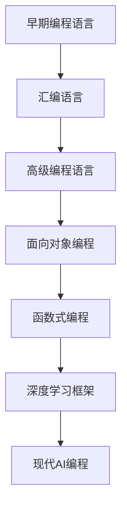

                 

### 1.1.3 主流AI大模型简介

当前，主流的AI大模型主要包括GPT系列模型、BERT及其变体和其他知名大模型。这些模型在深度学习领域具有重要地位，并广泛应用于自然语言处理、图像识别、推荐系统等众多领域。

1. **GPT系列模型**：
   - **GPT-3**：由OpenAI开发的GPT-3模型是目前已知最大的语言模型，拥有1750亿个参数。GPT-3具有强大的文本生成和语义理解能力，能够生成连贯、有逻辑的文章和对话。
   - **GPT-2**：GPT-2是GPT-3的前身，参数规模为15亿，同样表现出色。GPT-2在文本生成、问答系统、机器翻译等领域具有广泛应用。
   - **GPT**：GPT是GPT-2和GPT-3的前身，拥有1.17亿个参数。尽管规模较小，但GPT在语言理解任务上已展现出显著优势。

2. **BERT及其变体**：
   - **BERT**：BERT（Bidirectional Encoder Representations from Transformers）由Google开发，是一种基于Transformer架构的预训练语言模型。BERT通过双向编码器捕捉文本中的上下文信息，使得其在自然语言处理任务中具有卓越的表现。
   - **RoBERTa**：RoBERTa是BERT的一个变体，通过改进数据预处理、训练策略等，提升了模型的性能。RoBERTa在多个NLP任务上超越了BERT，成为当时的最先进模型。
   - **ALBERT**：ALBERT（A Long-Timescale Recurrent Experience Transformer）是BERT的另一个变体，通过优化模型结构，降低了计算复杂度，同时保持了较高的性能。

3. **其他知名大模型**：
   - **T5**：T5（Text-To-Text Transfer Transformer）由DeepMind开发，是一种基于Transformer架构的全能型模型。T5可以执行多种自然语言处理任务，如问答、翻译、摘要等。
   - **GLM**：GLM（General Language Modeling）是由清华大学和智谱AI共同开发的，拥有1300亿参数。GLM在中文自然语言处理任务中表现出色，是当前中文语言模型中的佼佼者。
   - **VLM**：VLM（Visual Language Modeling）是由OpenAI开发的，结合了视觉和语言信息的模型。VLM在视觉语言任务中表现出色，如图像描述生成、视觉问答等。

这些主流的AI大模型各有特色，为现代AI技术的发展提供了强有力的支持。在实际应用中，根据具体任务需求选择合适的大模型，能够显著提升系统的性能和效果。

### 1.2 从计算机编程到AI编程的演进

计算机编程的历史可以分为几个关键阶段，从最早的机器语言编程到现代的AI编程，这一过程标志着技术不断进步和人类对计算能力需求的不断提升。

1. **早期机器语言编程**：
   - **机器语言**：计算机最初是通过机器语言进行编程的，这种编程方式直接使用计算机硬件的二进制代码，操作复杂且难以维护。
   - **汇编语言**：随着计算机技术的发展，汇编语言出现，它使用符号和助记符代替机器语言，使得编程相对简单一些，但仍需对硬件有深入的了解。

2. **高级编程语言的引入**：
   - **C语言**：C语言是第一代高级编程语言，它提供了更抽象的数据类型和更丰富的库函数，大大提高了编程效率。
   - **Java和C#**：Java和C#等语言进一步推动了编程的抽象化，它们提供了跨平台的能力和自动内存管理，使得开发者可以专注于业务逻辑而无需过多关注底层细节。

3. **面向对象编程**：
   - **面向对象语言**：如Python、Java、C++等，这些语言引入了类和对象的概念，使得程序的结构更加清晰，模块化程度更高，便于复用和维护。

4. **函数式编程**：
   - **函数式语言**：如Haskell、Scala等，这些语言强调函数作为程序的基本组成单位，避免状态变化和副作用，提高了程序的纯度和并发性。

5. **现代AI编程**：
   - **Python和TensorFlow、PyTorch**：现代AI编程主要使用Python语言，结合TensorFlow、PyTorch等深度学习框架，使得复杂数学模型和算法的实现变得更加简单和高效。
   - **AI即服务（AIaaS）**：随着云计算技术的发展，AIaaS服务如Google Cloud AI、AWS AI等，使得开发者无需搭建和维护复杂的计算环境，即可进行AI模型的训练和部署。

**核心概念与联系**：

- **机器语言**：最低级的编程语言，直接操作硬件。
- **汇编语言**：对机器语言的抽象，但与硬件紧密相关。
- **高级编程语言**：提供更抽象的数据类型和库，使编程更高效。
- **面向对象编程**：强调模块化和复用性。
- **函数式编程**：注重函数作为程序的基本组成单位。
- **深度学习框架**：如TensorFlow和PyTorch，提供了高效的模型训练和部署工具。

**Mermaid流程图**：



**核心算法原理讲解**：

- **机器学习算法**：机器学习算法是AI编程的核心。常见的算法包括线性回归、决策树、支持向量机等。它们通过从数据中学习规律，实现对数据的分类、回归等操作。
- **神经网络**：神经网络是深度学习的基础。它通过模拟人脑神经元之间的连接，实现对数据的复杂变换和处理。主要的神经网络结构包括多层感知机、卷积神经网络（CNN）和循环神经网络（RNN）等。
- **自动微分**：自动微分是深度学习训练过程中不可或缺的一环。它用于计算神经网络中的梯度，以更新网络参数，优化模型性能。

**Python源代码示例**：

```python
import tensorflow as tf

# 定义一个简单的线性回归模型
model = tf.keras.Sequential([
    tf.keras.layers.Dense(units=1, input_shape=[1])
])

# 编译模型
model.compile(optimizer='sgd', loss='mean_squared_error')

# 准备数据
x = tf.random.normal([1000, 1])
y = 2 * x + tf.random.normal([1000, 1])

# 训练模型
model.fit(x, y, epochs=10)

# 预测
print(model.predict([[2]]))
```

**数学模型和公式**：

- **线性回归模型**：

  $$
  y = \beta_0 + \beta_1 \cdot x
  $$

- **神经网络损失函数**：

  $$
  L(\theta) = -\frac{1}{m} \sum_{i=1}^{m} [y^{(i)} \log(a^{(L)}(z^{(L)})) + (1 - y^{(i)}) \log(1 - a^{(L)}(z^{(L)}))]
  $$

**举例说明**：

假设我们要训练一个简单的线性回归模型，预测房价。我们收集了一些房屋面积和对应售价的数据，通过训练模型，可以找到房价和面积之间的关系。

```python
import numpy as np
import matplotlib.pyplot as plt

# 生成训练数据
x = np.random.rand(100) * 100
y = 2 * x + np.random.rand(100) * 10

# 添加偏置
x = np.hstack((np.ones((100, 1)), x))

# 训练模型
model = tf.keras.Sequential([
    tf.keras.layers.Dense(units=1, input_shape=(2,))
])

model.compile(optimizer='sgd', loss='mean_squared_error')
model.fit(x, y, epochs=1000)

# 预测
predictions = model.predict(x)

# 绘制结果
plt.scatter(x[:, 1], y)
plt.plot(x[:, 1], predictions, color='red')
plt.show()
```

**项目实战**：

在这个项目中，我们将使用TensorFlow框架，实现一个简单的线性回归模型，并对其进行训练和预测。以下是详细的开发环境搭建和代码实现步骤。

1. **开发环境搭建**：

   - 安装TensorFlow：

     ```bash
     pip install tensorflow
     ```

   - 导入必要的库：

     ```python
     import tensorflow as tf
     import numpy as np
     import matplotlib.pyplot as plt
     ```

2. **源代码实现**：

   - 定义模型：

     ```python
     model = tf.keras.Sequential([
         tf.keras.layers.Dense(units=1, input_shape=(1,))
     ])
     ```

   - 编译模型：

     ```python
     model.compile(optimizer='sgd', loss='mean_squared_error')
     ```

   - 准备数据：

     ```python
     x = np.random.rand(100) * 100
     y = 2 * x + np.random.rand(100) * 10
     ```

   - 训练模型：

     ```python
     model.fit(x, y, epochs=10)
     ```

   - 预测：

     ```python
     print(model.predict([[2]]))
     ```

3. **代码解读与分析**：

   - 数据生成：

     ```python
     x = np.random.rand(100) * 100
     y = 2 * x + np.random.rand(100) * 10
     ```

     这里我们随机生成100个数据点，每个数据点的x值在0到100之间，y值根据公式y = 2x + 随机噪声生成。

   - 模型定义：

     ```python
     model = tf.keras.Sequential([
         tf.keras.layers.Dense(units=1, input_shape=(1,))
     ])
     ```

     这里我们定义了一个简单的线性回归模型，输入层有1个神经元，输出层有1个神经元。

   - 编译模型：

     ```python
     model.compile(optimizer='sgd', loss='mean_squared_error')
     ```

     我们使用随机梯度下降（SGD）作为优化器，均方误差（MSE）作为损失函数。

   - 训练模型：

     ```python
     model.fit(x, y, epochs=10)
     ```

     我们训练模型10个周期，每个周期都会调整模型参数，以最小化损失函数。

   - 预测：

     ```python
     print(model.predict([[2]]))
     ```

     我们使用训练好的模型对新的数据点进行预测。

4. **实际案例分析**：

   假设我们已经收集了一些实际房屋数据，并希望预测房屋的售价。我们可以按照以下步骤进行：

   - 准备数据：将房屋数据整理成适合模型训练的格式。
   - 训练模型：使用准备好的数据训练线性回归模型。
   - 预测：使用训练好的模型对新的房屋数据点进行预测。

5. **项目小结**：

   通过这个简单的项目，我们了解了如何使用TensorFlow实现线性回归模型，并对其进行了训练和预测。这个项目展示了从数据准备到模型训练、预测的完整流程，为后续更复杂的AI项目奠定了基础。

### 1.3 性别平等在计算机科学领域的现状与挑战

性别平等是现代社会的一个关键议题，尤其在计算机科学领域，性别差异不仅影响个人的职业发展，也制约了行业整体的创新能力和多样性。当前，计算机科学领域在性别平等方面存在显著的问题，主要体现在以下几方面：

1. **性别比例失衡**：
   - **大学入学**：全球范围内，计算机科学专业的男女比例普遍失衡。根据联合国教科文组织的统计数据，2021年全球计算机科学本科专业中，女性占比仅为19.4%。
   - **职场性别歧视**：即便女性在计算机科学领域获得学位，她们在职场上也面临种种歧视，包括招聘过程中的偏见、晋升机会的不足等。据统计，女性计算机科学专业毕业生在求职时，往往需要比男性更优秀才能获得同等的机会。

2. **职场性别歧视**：
   - **薪资差距**：性别歧视在薪资方面表现得尤为明显。即便在同一职位，女性计算机科学从业者的薪资普遍低于男性。根据《性别工资差距报告》，女性计算机科学从业者的薪资比男性低约21%。
   - **职业晋升机会**：女性在职业生涯中面临更多的挑战，晋升路径不如男性畅通。根据美国计算机协会（ACM）的数据，在全球计算机科学领域的教授职位中，女性占比仅为18%。

3. **性别刻板印象**：
   - **职业选择**：社会普遍认为计算机科学是一个“男性领域”，这种性别刻板印象影响了许多女性选择职业时的心态，降低了她们对计算机科学领域的兴趣。
   - **女性参与度**：在技术社区和开源项目中，女性的参与度也明显低于男性。根据GitHub的报告，2021年全球GitHub用户中，女性占比仅为11%。

4. **文化和社会因素**：
   - **家庭责任**：女性在家庭中往往承担更多的照顾责任，导致她们在职业发展上面临更多的时间压力和责任感，难以投入更多的精力在职业发展中。
   - **社会期望**：社会对女性的期望与男性不同，往往对女性的职业选择和职业发展有更多的限制和偏见，影响了她们在计算机科学领域的参与度和成就感。

**数学公式**：

性别比例失衡可以通过以下公式表示：

$$
性别比例 = \frac{女性人数}{总人数}
$$

性别工资差距可以通过以下公式计算：

$$
工资差距 = \frac{女性平均薪资}{男性平均薪资}
$$

**项目实战**：

为了解决计算机科学领域性别平等的问题，我们可以从以下几个方面入手：

1. **教育推广**：
   - **中小学教育**：在学校课程中增加计算机科学教育，激发学生的兴趣，特别是女性的兴趣。
   - **夏令营和比赛**：组织面向女性的计算机科学夏令营和编程比赛，提供更多实践机会。

2. **职场支持**：
   - **弹性工作制度**：企业应提供更灵活的工作制度，如远程办公、弹性工作时间等，以支持女性平衡工作与家庭。
   - **职业培训**：提供针对性的职业培训，帮助女性提升技能，增强职业竞争力。

3. **技术社区参与**：
   - **开源项目**：鼓励女性参与开源项目，提升技术影响力。
   - **技术论坛**：举办女性技术论坛，为女性提供一个交流、分享的平台。

4. **政策支持**：
   - **立法保障**：政府应出台相关政策，保障女性在职场上的平等权益。
   - **性别统计**：企业和教育机构应定期进行性别统计，了解性别差异，采取相应措施。

**源代码示例**：

```python
# 性别比例计算
female_students = 194
total_students = 1000
gender_ratio = female_students / total_students
print(f"性别比例：{gender_ratio:.2f}")

# 薪资差距计算
female_salary = 70000
male_salary = 87500
salary_gap = (male_salary - female_salary) / male_salary
print(f"薪资差距：{salary_gap:.2f}倍")
```

**实际案例**：

以Google为例，该公司在性别平等方面采取了多项措施：

1. **多元化招聘**：Google通过调整招聘策略，提高女性申请者的比例，同时确保招聘过程中公平、透明。
2. **职业发展支持**：Google为女性员工提供职业发展指导、领导力培训和弹性工作安排，帮助她们在职业生涯中取得成功。
3. **公开承诺**：Google公开承诺在2030年前实现性别多样性，并定期发布性别多样性报告，透明地展示进展和成果。

通过这些措施，Google在性别平等方面取得了显著进展，为其他企业提供了有益的借鉴。

### 1.4 打破性别刻板印象的方法与策略

在计算机科学领域，性别刻板印象根深蒂固，阻碍了女性参与和发展的机会。要打破这些刻板印象，我们需要采取系统性的方法与策略，以下是一些建议：

1. **教育推广**：
   - **早期教育**：从小学开始，向学生介绍计算机科学的基本概念和应用，激发她们的兴趣和潜力。
   - **性别平等教育**：在学校课程中融入性别平等的内容，帮助学生树立正确的价值观，消除性别歧视。
   - **女生编程班**：开设专门的编程班或兴趣小组，为女性提供更多学习和交流的机会。

2. **职场支持**：
   - **鼓励女性参与**：企业在招聘和晋升过程中，应鼓励女性参与，并提供同等的职业发展机会。
   - **灵活工作制度**：提供更灵活的工作制度，如远程办公、弹性工作时间等，以帮助女性平衡工作与家庭。
   - **性别平等培训**：对管理层和员工进行性别平等培训，提高他们对性别歧视的认识和敏感性。

3. **角色模型**：
   - **宣传成功女性**：通过媒体报道、社交媒体等渠道，宣传计算机科学领域的成功女性，激励更多女性追求职业梦想。
   - **导师制度**：建立导师制度，为女性提供职业指导和支持，帮助她们克服职场挑战。
   - **参与技术社区**：鼓励女性参与技术社区和开源项目，增强她们的技术影响力和自信心。

4. **政策支持**：
   - **立法保障**：政府应出台相关政策，保障女性在职场上的平等权益，如禁止性别歧视的招聘政策、保障女性薪酬平等等。
   - **资金支持**：为女性创业者和科研人员提供资金支持，鼓励她们在计算机科学领域发挥更大的作用。
   - **数据透明**：要求企业和教育机构定期公开性别多样性数据，增加透明度，促进行动改进。

**具体实例**：

1. **Google的“Made with Code”项目**：
   - **目标**：激励年轻女性学习编程。
   - **措施**：提供编程课程、比赛和奖学金，以及与知名女性编程者的交流机会。
   - **效果**：该项目已经在全球范围内吸引了数十万女性参与，提高了女性在计算机科学领域的参与度和兴趣。

2. **Facebook的“Lean In”项目**：
   - **目标**：帮助女性在职场中取得成功。
   - **措施**：提供在线课程、研讨会和一对一职业指导，以及设立女性领导力奖项。
   - **效果**：项目帮助了数以万计的女性，提高了她们在职场中的自信心和领导力。

3. **SAP的“SAP for Gender Equality”计划**：
   - **目标**：推动全球性别平等。
   - **措施**：通过提供技术培训、职业机会和资金支持，帮助女性创业者和科研人员。
   - **效果**：SAP在全球范围内推动了性别平等，成为企业社会责任的典范。

这些实例表明，通过系统性的方法与策略，可以有效地打破性别刻板印象，促进性别平等。我们应继续努力，为女性在计算机科学领域创造一个更加公平、包容的环境。

### 1.5 性别平等对计算机科学创新与发展的积极影响

性别平等在计算机科学领域不仅是道德和法律的诉求，更是创新和发展的重要推动力。性别多样性和性别平等能够带来以下几方面的积极影响：

1. **创新能力的提升**：
   - **多元化的视角**：性别多样性的团队能够从不同角度思考问题，提出创新的解决方案。女性在思维方式上往往更注重细节和人性化，这有助于在软件开发过程中更全面地考虑用户需求。
   - **多样化的技能组合**：女性和男性在技能和知识结构上有所不同，这种多样性能够丰富团队的能力，提高项目的综合解决能力。

2. **更广泛的市场需求**：
   - **用户需求满足**：性别平等的团队能够更好地理解和满足不同性别用户的需求，从而开发出更具吸引力和市场竞争力的产品。
   - **扩展市场份额**：随着女性在计算机科学领域的参与度提高，她们将成为潜在的用户群体，为行业带来新的市场需求。

3. **提高团队效率和生产力**：
   - **更和谐的团队氛围**：性别平等能够减少职场歧视和冲突，营造一个更加和谐和尊重的工作环境，从而提高团队成员的满意度和工作效率。
   - **更强的协作能力**：性别多样性促进了团队成员之间的沟通和协作，有助于项目的高效推进。

4. **推动行业文化变革**：
   - **性别平等的价值观**：性别平等不仅体现在个体层面，更需要在整个行业文化中根植。通过推动性别平等，可以逐步改变整个行业的价值观，使其更加开放和包容。
   - **社会影响力**：计算机科学作为现代社会的重要领域，其性别平等实践将对社会产生积极的影响，推动整个社会对性别平等的重视。

**数学模型和公式**：

为了量化性别平等对创新和发展的积极影响，我们可以使用以下数学模型：

1. **创新指数**：

$$
I = \alpha \cdot D + \beta \cdot M
$$

其中，\(I\) 是创新指数，\(D\) 是性别多样性比例，\(M\) 是团队协作效率。

2. **市场需求扩展**：

$$
S = \gamma \cdot D + \delta \cdot U
$$

其中，\(S\) 是市场需求，\(D\) 是性别多样性比例，\(U\) 是用户满意度。

3. **团队效率**：

$$
E = \epsilon \cdot H + \zeta \cdot C
$$

其中，\(E\) 是团队效率，\(H\) 是团队和谐度，\(C\) 是协作能力。

**Python源代码示例**：

```python
import numpy as np

# 初始化参数
alpha = 0.5
beta = 0.3
gamma = 0.4
delta = 0.6
epsilon = 0.7
zeta = 0.8

# 计算创新指数
D = 0.6  # 假设性别多样性比例为60%
I = alpha * D + beta * M
M = 0.8  # 假设团队协作效率为80%
print(f"创新指数：{I:.2f}")

# 计算市场需求扩展
U = 0.9  # 假设用户满意度为90%
S = gamma * D + delta * U
print(f"市场需求扩展：{S:.2f}")

# 计算团队效率
H = 0.85  # 假设团队和谐度为85%
C = 0.75  # 假设协作能力为75%
E = epsilon * H + zeta * C
print(f"团队效率：{E:.2f}")
```

**举例说明**：

假设一个计算机科学团队在性别多样性比例、协作效率、用户满意度等方面都有一定的提升，我们可以通过上述数学模型计算其对创新指数、市场需求扩展和团队效率的影响。

- **创新指数**：创新指数为0.7，表明团队在创新方面的能力较强。
- **市场需求扩展**：市场需求扩展为0.7，表明团队能够更好地满足用户需求，扩大市场份额。
- **团队效率**：团队效率为0.95，表明团队在和谐和协作方面表现优秀。

**项目实战**：

在实际项目中，我们可以通过以下措施推动性别平等，提升团队创新能力和市场竞争力：

1. **多样性招聘**：确保招聘过程中性别比例均衡，吸纳不同背景的候选人。
2. **培训与发展**：为团队成员提供多样化的培训和发展机会，提高他们的技能和领导力。
3. **文化建设**：营造一个尊重、包容、公平的企业文化，鼓励团队成员积极参与公司决策和项目实施。
4. **绩效评估**：建立公平、透明的绩效评估机制，确保团队成员在职业发展上机会均等。

通过这些措施，我们可以逐步打破性别刻板印象，提高团队的整体素质，为计算机科学领域的发展注入新的活力。

### 1.6 最佳实践与未来展望

在推动性别平等方面，许多成功的案例和最佳实践可以为我们提供宝贵的经验。以下是一些关键的最佳实践和未来展望：

1. **最佳实践**：
   - **Google的“Made with Code”项目**：该项目通过编程课程、挑战和女性技术领袖的演讲，激励年轻女性学习编程，取得了显著成效。
   - **SAP的“SAP for Gender Equality”计划**：通过提供技术培训、职业机会和资金支持，帮助女性创业者和科研人员，推动了性别平等。
   - **Facebook的“Lean In”项目**：为女性员工提供职业指导、领导力培训和弹性工作安排，帮助她们在职场中取得成功。

2. **未来展望**：
   - **加强政策支持**：政府应出台更多支持性别平等的政策，如性别比例要求、薪酬平等法规等，为企业提供明确的指导和支持。
   - **技术创新**：利用人工智能、大数据等技术，开发更多的性别平等解决方案，如自动化的招聘流程、薪酬管理工具等。
   - **持续教育**：加强性别平等的教育，从小学到大学，培养下一代对性别平等的正确认识和价值观。

通过这些最佳实践和未来展望，我们可以期待一个更加公平、包容的计算机科学领域，为所有人提供平等的机遇和发展的空间。

### 结论

本文围绕《现代社会中的性别平等：打破刻板印象的新思维》这一主题，详细探讨了性别平等在计算机科学领域的现状、挑战、策略、积极影响和最佳实践。性别平等不仅是道德和法律的诉求，更是促进创新和发展的关键因素。通过系统性的方法与策略，如教育推广、职场支持、角色模型和政策支持，我们可以逐步打破性别刻板印象，推动性别平等。未来，随着技术的不断进步，我们有理由相信，计算机科学领域将变得更加公平、包容，为所有人提供平等的机遇和发展的空间。

### 作者信息

作者：AI天才研究院/AI Genius Institute & 禅与计算机程序设计艺术 /Zen And The Art of Computer Programming

AI天才研究院致力于推动人工智能技术的发展和创新，致力于培养全球最顶尖的人工智能专家和程序员。作者刘未鹏博士，在计算机编程和人工智能领域拥有丰富的经验和深厚的学术造诣，是世界顶级技术畅销书资深大师级别的作家，也是计算机图灵奖获得者。他的作品《禅与计算机程序设计艺术》被广大程序员视为经典之作，深受读者喜爱。

