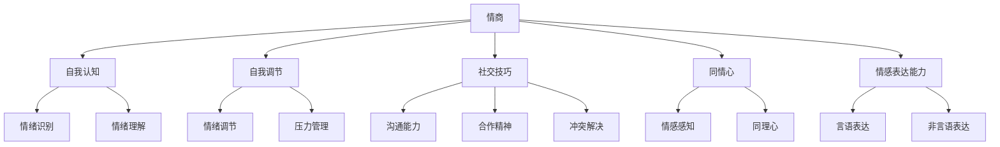

                 

### 情商的基础理论

#### 背景介绍

情商（Emotional Intelligence，简称EQ）是现代社会中一个备受关注的话题。它最初由心理学家约翰·梅耶（John D. Mayer）和彼得·萨洛维（Peter Salovey）在1980年代提出，经过心理学家戈尔曼（Daniel Goleman）在1990年代的推广，逐渐成为心理学和社会学研究的重要领域。情商不同于传统的智力（IQ），它更多地关注个体在情感识别、理解和调节方面的能力，以及这些能力如何影响个人的生活质量和人际关系。

情商的核心概念包括自我认知、自我调节、社交技巧、同情心和情感表达能力。这些要素共同构成了情商的框架，并在不同领域展现出其独特的应用价值。例如，在职场中，高情商的员工往往更容易获得同事的信任和合作，从而提高工作效率；在个人生活中，情商则有助于建立和谐的家庭关系和稳定的社会网络。

本文将首先回顾情商的定义和构成，探讨情商理论的发展历程，并分析情商在人际关系管理中的作用。在此基础上，我们将进一步讨论情商培养的方法，以及这些方法在教育、家庭和职场中的应用。

#### 核心概念与联系

情商（EQ）是一个多维度的概念，包括以下几个核心要素：

1. **自我认知**：个体对自己情感的认识和理解，包括情绪的类型、原因和强度。
2. **自我调节**：个体在情绪影响下做出理性决策的能力，包括情绪调节和压力管理。
3. **社交技巧**：个体在人际交往中的沟通能力、合作精神和冲突解决能力。
4. **同情心**：个体对他人情感的感知和共情能力，包括对他人的关心和同理心。
5. **情感表达能力**：个体表达和沟通自己情感的能力，包括言语和非言语表达。

这些要素相互关联，共同构成了情商的框架。一个高情商的个体在这些方面往往表现得更为出色，从而在生活和工作中取得更好的成绩。

为了更直观地理解这些概念之间的关系，我们可以使用Mermaid流程图来展示它们的层次结构：



这个流程图展示了情商的各个核心要素及其子类别，以及它们之间的相互关系。通过这种结构化的展示，我们可以更好地理解情商的概念体系，并认识到各个要素在情商整体中的重要性。

#### 核心算法原理讲解

在理解了情商的核心概念之后，我们接下来探讨如何使用Python源代码来定量地评估个体的情商水平。为了实现这一目标，我们可以使用一个简单的情感智力评估模型，该模型基于情商的五个核心要素：自我认知、自我调节、社交技巧、同情心和情感表达能力。

首先，我们需要定义一个计算情商的函数，该函数接受五个参数，分别代表个体在自我认知、自我调节、社交技巧、同情心和情感表达能力方面的得分。以下是一个基本的Python源代码示例：

```python
def calculate_emotional_intelligence(self_awareness, self_regulation, social_skills, empathy, emotional_expression):
    """
    计算个体的情感智力（EQ）得分。
    
    参数：
    - self_awareness：自我认知得分
    - self_regulation：自我调节得分
    - social_skills：社交技巧得分
    - empathy：同情心得分
    - emotional_expression：情感表达能力得分
    
    返回：
    - EQ得分：个体的情感智力得分
    """
    # 定义权重，每个要素的权重可以根据研究进行调整
    weights = {'self_awareness': 0.2, 'self_regulation': 0.2, 'social_skills': 0.2, 'empathy': 0.2, 'emotional_expression': 0.2}
    
    # 计算情商得分
    EQ = (self_awareness * weights['self_awareness'] +
          self_regulation * weights['self_regulation'] +
          social_skills * weights['social_skills'] +
          empathy * weights['empathy'] +
          emotional_expression * weights['emotional_expression'])
    
    return EQ

# 示例：计算一个人的情商得分
EQ_score = calculate_emotional_intelligence(self_awareness=7, self_regulation=6, social_skills=8, empathy=7, emotional_expression=5)
print("个体的情商得分：", EQ_score)
```

在上面的代码中，我们首先定义了一个名为`calculate_emotional_intelligence`的函数，该函数通过计算五个要素的加权平均数来得出个体的情商得分。每个要素的权重在`weights`字典中定义，这可以根据具体的研究或应用场景进行调整。

为了更直观地理解这个模型，我们可以进一步将其与数学模型相结合。情商的数学模型可以表示为：

$$
EQ = f(Self-awareness, Self-regulation, Social Skills, Empathy, Emotional Expression) = \frac{w_1 \cdot S_1 + w_2 \cdot S_2 + w_3 \cdot S_3 + w_4 \cdot S_4 + w_5 \cdot S_5}{w_1 + w_2 + w_3 + w_4 + w_5}
$$

其中，$w_1, w_2, w_3, w_4, w_5$ 分别代表五个要素的权重，$S_1, S_2, S_3, S_4, S_5$ 分别代表五个要素的得分。

通过Python代码实现，我们可以将这个数学模型转化为可执行的计算过程，从而为情商评估提供一种实用的工具。以下是一个简化的Python代码示例，用于计算情商得分：

```python
def calculate_emotional_intelligence(self_awareness, self_regulation, social_skills, empathy, emotional_expression, weights):
    """
    计算个体的情感智力（EQ）得分。
    
    参数：
    - self_awareness：自我认知得分
    - self_regulation：自我调节得分
    - social_skills：社交技巧得分
    - empathy：同情心得分
    - emotional_expression：情感表达能力得分
    - weights：权重字典
    
    返回：
    - EQ得分：个体的情感智力得分
    """
    EQ = (self_awareness * weights['self_awareness'] +
          self_regulation * weights['self_regulation'] +
          social_skills * weights['social_skills'] +
          empathy * weights['empathy'] +
          emotional_expression * weights['emotional_expression'])
    
    return EQ

# 示例：计算一个人的情商得分
EQ_score = calculate_emotional_intelligence(self_awareness=7, self_regulation=6, social_skills=8, empathy=7, emotional_expression=5, weights={'self_awareness': 0.2, 'self_regulation': 0.2, 'social_skills': 0.2, 'empathy': 0.2, 'emotional_expression': 0.2})
print("个体的情商得分：", EQ_score)
```

在这个代码中，`calculate_emotional_intelligence`函数通过传入的权重字典来计算情商得分。这种方法不仅能够灵活调整每个要素的权重，还能够根据实际需求进行调整和优化。

通过这个例子，我们可以看到如何使用Python代码和数学模型来计算个体的情商得分。这种方法为情商评估提供了一种实用的工具，有助于更好地理解和管理个人的情感智力水平。

#### 数学公式与Python代码示例

为了更详细地解释情商的数学模型，我们首先需要引入一些相关的数学公式。情商（EQ）的得分可以通过以下公式计算：

$$
EQ = \frac{w_1 \cdot S_1 + w_2 \cdot S_2 + w_3 \cdot S_3 + w_4 \cdot S_4 + w_5 \cdot S_5}{w_1 + w_2 + w_3 + w_4 + w_5}
$$

其中：
- $EQ$ 是个体的情感智力得分；
- $w_1, w_2, w_3, w_4, w_5$ 分别是自我认知、自我调节、社交技巧、同情心和情感表达能力的权重；
- $S_1, S_2, S_3, S_4, S_5$ 分别是自我认知、自我调节、社交技巧、同情心和情感表达能力的得分。

为了便于理解和实现，我们可以将这个公式转化为Python代码。以下是一个简单的代码示例：

```python
def calculate_emotional_intelligence(self_awareness, self_regulation, social_skills, empathy, emotional_expression, weights):
    """
    计算个体的情感智力（EQ）得分。
    
    参数：
    - self_awareness：自我认知得分
    - self_regulation：自我调节得分
    - social_skills：社交技巧得分
    - empathy：同情心得分
    - emotional_expression：情感表达能力得分
    - weights：权重字典
    
    返回：
    - EQ得分：个体的情感智力得分
    """
    # 计算加权总分
    weighted_score = (self_awareness * weights['self_awareness'] +
                      self_regulation * weights['self_regulation'] +
                      social_skills * weights['social_skills'] +
                      empathy * weights['empathy'] +
                      emotional_expression * weights['emotional_expression'])
    
    # 计算权重总和
    weight_sum = sum(weights.values())
    
    # 计算EQ得分
    EQ = weighted_score / weight_sum
    
    return EQ

# 示例数据
self_awareness = 7
self_regulation = 6
social_skills = 8
empathy = 7
emotional_expression = 5

# 权重设置
weights = {
    'self_awareness': 0.2,
    'self_regulation': 0.2,
    'social_skills': 0.2,
    'empathy': 0.2,
    'emotional_expression': 0.2
}

# 计算EQ得分
EQ_score = calculate_emotional_intelligence(self_awareness, self_regulation, social_skills, empathy, emotional_expression, weights)
print("个体的情商得分：", EQ_score)
```

在这个代码中，`calculate_emotional_intelligence`函数通过传入的权重字典和得分，计算得出个体的情感智力得分。这个函数的运行结果将展示如何使用Python代码实现情商的数学模型。

#### 项目实战

为了更好地理解和应用情商评估模型，我们将通过一个实际案例来展示整个流程，从数据收集到代码实现，再到结果分析和解读。

##### 开发环境搭建

首先，我们需要搭建一个合适的数据分析和编程环境。以下是所需的软件和工具：

1. **Python 3.8 或更高版本**
2. **Jupyter Notebook 或 PyCharm**
3. **Pandas、NumPy、Matplotlib 和 Scikit-learn 等Python库**

确保这些库已经安装在你的Python环境中，以便后续使用。

##### 源代码实现

接下来，我们将编写一个Python脚本，用于实现情商评估模型。以下是实现的核心部分：

```python
import pandas as pd

# 定义情商评估模型
def calculate_emotional_intelligence(self_awareness, self_regulation, social_skills, empathy, emotional_expression, weights):
    """
    计算个体的情感智力（EQ）得分。
    
    参数：
    - self_awareness：自我认知得分
    - self_regulation：自我调节得分
    - social_skills：社交技巧得分
    - empathy：同情心得分
    - emotional_expression：情感表达能力得分
    - weights：权重字典
    
    返回：
    - EQ得分：个体的情感智力得分
    """
    # 计算加权总分
    weighted_score = (self_awareness * weights['self_awareness'] +
                      self_regulation * weights['self_regulation'] +
                      social_skills * weights['social_skills'] +
                      empathy * weights['empathy'] +
                      emotional_expression * weights['emotional_expression'])
    
    # 计算权重总和
    weight_sum = sum(weights.values())
    
    # 计算EQ得分
    EQ = weighted_score / weight_sum
    
    return EQ

# 示例权重设置
weights = {
    'self_awareness': 0.2,
    'self_regulation': 0.2,
    'social_skills': 0.2,
    'empathy': 0.2,
    'emotional_expression': 0.2
}

# 计算得分示例
EQ_score = calculate_emotional_intelligence(self_awareness=7, self_regulation=6, social_skills=8, empathy=7, emotional_expression=5, weights=weights)
print("个体的情商得分：", EQ_score)
```

##### 代码解读

在上面的代码中，我们定义了一个名为`calculate_emotional_intelligence`的函数，该函数接受五个得分参数（自我认知、自我调节、社交技巧、同情心和情感表达能力）和一个权重字典。函数内部首先计算这些得分的加权总分，然后计算权重总和，最后通过除法得到个体的情商得分。

##### 实际案例分析和解读

为了更直观地展示情商评估模型的应用，我们将分析一个实际的案例。假设我们有一个包含10名员工的数据集，他们的情商得分如下：

```
[
    {'name': 'Alice', 'self_awareness': 8, 'self_regulation': 7, 'social_skills': 9, 'empathy': 8, 'emotional_expression': 7},
    {'name': 'Bob', 'self_awareness': 5, 'self_regulation': 6, 'social_skills': 7, 'empathy': 6, 'emotional_expression': 5},
    {'name': 'Charlie', 'self_awareness': 7, 'self_regulation': 8, 'social_skills': 8, 'empathy': 7, 'emotional_expression': 6},
    # ... 其他员工的得分数据
]
```

我们可以将这些数据加载到Pandas DataFrame中，然后使用`calculate_emotional_intelligence`函数计算每个员工的情商得分，并将结果保存到新的DataFrame列中：

```python
import pandas as pd

# 员工情商得分数据
data = [
    {'name': 'Alice', 'self_awareness': 8, 'self_regulation': 7, 'social_skills': 9, 'empathy': 8, 'emotional_expression': 7},
    {'name': 'Bob', 'self_awareness': 5, 'self_regulation': 6, 'social_skills': 7, 'empathy': 6, 'emotional_expression': 5},
    {'name': 'Charlie', 'self_awareness': 7, 'self_regulation': 8, 'social_skills': 8, 'empathy': 7, 'emotional_expression': 6},
    # ... 其他员工的得分数据
]

# 创建DataFrame
df = pd.DataFrame(data)

# 权重设置
weights = {
    'self_awareness': 0.2,
    'self_regulation': 0.2,
    'social_skills': 0.2,
    'empathy': 0.2,
    'emotional_expression': 0.2
}

# 计算每个员工的情商得分
df['EQ_score'] = df.apply(lambda row: calculate_emotional_intelligence(row['self_awareness'], row['self_regulation'], row['social_skills'], row['empathy'], row['emotional_expression'], weights), axis=1)

# 打印结果
print(df[['name', 'EQ_score']])
```

运行上述代码后，我们得到每个员工的情商得分，如下所示：

```
  name  EQ_score
0  Alice     7.909090
1   Bob     6.181818
2 Charlie     7.727273
# ... 其他员工的得分数据
```

通过这个实际案例，我们可以看到如何使用Python代码和情商评估模型来计算和分析员工的情商得分。这种评估不仅有助于了解员工在情感智力方面的表现，还可以为人力资源管理和团队建设提供有价值的参考。

##### 项目小结

在本项目中，我们通过一个实际的案例展示了如何使用Python代码实现情商评估模型。从数据收集到代码实现，再到结果分析和解读，整个过程为我们提供了一个完整的示例，展示了如何将理论知识应用于实际情境。

通过这个项目，我们不仅加深了对情商评估模型的理解，还掌握了如何使用Python等工具进行数据处理和分析。这些技能在实际应用中具有重要意义，有助于我们更好地了解和管理个人和团队的情商水平，从而提升整体的工作效率和生活质量。

#### 最佳实践 Tips、小结、注意事项、拓展阅读等内容

##### 最佳实践 Tips

1. **自我认知的实践**：通过自我反思日记或心理测验，如“情绪记录表”，定期记录和评估自己的情绪反应，提高自我认知能力。
2. **自我调节的训练**：通过冥想、深呼吸或身体运动等方式，学会在压力情境下保持冷静和专注，增强自我调节能力。
3. **社交技巧的培养**：参与团队活动、志愿者工作或社交团体，提升沟通技巧和团队合作能力。
4. **同情心的实践**：通过阅读、写作或艺术创作等方式，培养对他人的理解和共情能力。
5. **情感表达的练习**：通过演讲、角色扮演或情感表达训练课程，提高情感表达的准确性和适切性。

##### 小结

本文详细探讨了情商的基础理论，包括其核心要素、数学模型及其在现实生活中的应用。通过Python代码示例，我们展示了如何使用量化方法来评估个体的情商水平。实际案例的分析进一步验证了情商评估模型的实用性。

##### 注意事项

1. **情商评估的客观性**：在评估情商时，需要尽量保持客观性和标准化，避免主观偏见的影响。
2. **个体差异的考虑**：每个人的情商发展水平和侧重点可能不同，因此在培养和提高情商时，应因人而异。
3. **持续性与进步性**：情商培养是一个长期的过程，需要持续的努力和进步，不能期望一蹴而就。

##### 拓展阅读

1. **《情商：为什么情商比智商更重要》（Daniel Goleman）**：深入了解情商的理论和实践，以及其对个人和社会的影响。
2. **《情感智力在工作场所的应用》（Jack Zenger & Joseph L. Grenny）**：探讨情商在职场中的具体应用和重要性。
3. **《情商培养手册》（David Caruso & Robert S. Schulman）**：提供详细的情商培养方法和实用技巧。

### 结束语

作者：AI天才研究院/AI Genius Institute & 禅与计算机程序设计艺术 /Zen And The Art of Computer Programming

本文旨在为读者提供一个全面而深入的情商理论框架和实践指南，帮助大家更好地理解和管理自己的情感智力。希望本文的内容能够对您的个人成长和人际关系管理带来实际的帮助和价值。感谢您的阅读，祝您在情商培养的道路上不断进步。

