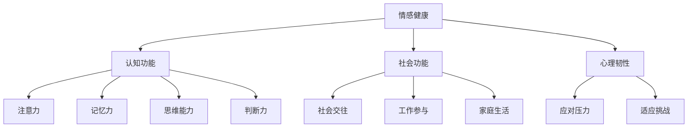
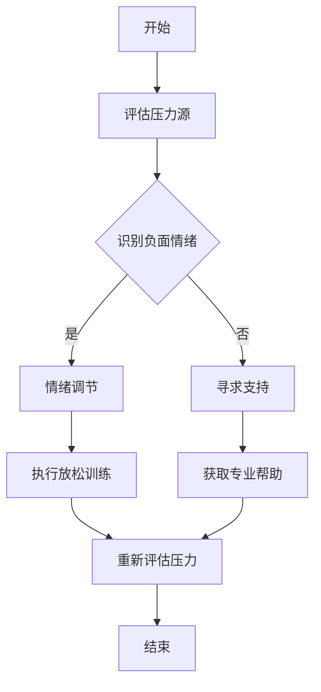

                 

### 引言

在现代社会的快节奏生活中，精神健康已经成为一个不可忽视的重要议题。随着工作压力、社会竞争和生活方式的变迁，越来越多的人面临着不同程度的心理压力和情绪问题。精神健康不仅关乎个人的幸福感，还直接影响到生产力、社交关系和社会稳定。因此，探讨如何在现代社会中维护精神健康，通过压力管理和心理平衡来提高生活质量，具有重要的现实意义。

本文旨在通过对现代社会中精神健康问题的深入分析，探讨压力管理的重要性，以及实现心理平衡的策略和方法。我们将从以下几个方面展开讨论：

1. **精神健康的基本概念**：介绍精神健康的核心要素及其评估方法。
2. **压力的来源与影响**：分析压力的多种来源及其对心理健康的负面影响。
3. **心理平衡的定义与重要性**：阐述心理平衡的概念、构成要素及其在精神健康中的作用。
4. **压力管理的方法与技术**：介绍认知行为疗法和其他压力管理技巧。
5. **心理平衡的策略与实践**：探讨心理平衡的实践步骤和实际案例。
6. **社会环境对精神健康的影响**：分析社会环境对精神健康的作用及其改善策略。
7. **精神健康的维护与促进**：总结精神健康维护和促进的最佳实践。

通过这些内容，本文希望为读者提供一套系统、实用的精神健康管理方案，帮助大家更好地应对现代生活中的压力，实现心理平衡，提升整体生活质量。

### 关键词

- 精神健康
- 压力管理
- 心理平衡
- 认知行为疗法
- 社会环境
- 压力来源
- 心理健康评估
- 社会支持网络

### 摘要

本文探讨了现代社会中精神健康的维护与促进问题，重点分析了压力管理与心理平衡的重要性。文章首先介绍了精神健康的基本概念及其评估方法，随后详细阐述了压力的来源与影响。接着，文章提出了心理平衡的定义及其重要性，并介绍了实现心理平衡的方法和技术，包括认知行为疗法和放松训练。通过具体案例，本文展示了这些方法在实际应用中的效果，并分析了社会环境对精神健康的影响。最后，文章总结了精神健康维护和促进的最佳实践，为读者提供了实用的指导。

### 理解书名和目标读者

《现代社会中的精神健康：压力管理与心理平衡》的书名明确传达了本书的核心主题和目标，即探讨如何在现代社会中通过压力管理和心理平衡来维护精神健康。从书名中可以看出，本书的目标读者主要包括以下几个方面：

1. **心理健康专业从业人员**：包括临床心理学家、心理咨询师、精神科医生等。这些专业人士需要掌握最新的压力管理和心理平衡理论和技术，以更好地帮助患者恢复心理健康。

2. **心理学爱好者**：对心理学感兴趣的大众读者，他们希望通过阅读本书深入了解精神健康的科学原理和实践方法，提升自己的心理健康素养。

3. **普通大众**：在现代社会中面临各种压力和挑战的普通民众，包括职场人士、学生、家庭主妇等。这些读者希望通过本书学习实用的压力管理和心理平衡技巧，提升生活质量。

4. **企业管理和人力资源从业者**：关注员工心理健康的企业管理者和人力资源从业者，希望通过本书了解如何通过压力管理和心理平衡来提高员工的工作满意度和生产力。

5. **教育工作者**：关注学生心理健康和发展的教育工作者，他们希望通过本书了解如何在学校环境中实施有效的心理健康教育。

本书的核心内容将围绕以下几个方面展开：

- **精神健康的基本概念**：介绍精神健康的核心要素及其评估方法，帮助读者理解心理健康的基本框架。
- **压力的来源与影响**：分析压力的多种来源及其对心理健康的负面影响，帮助读者认识到压力管理的必要性。
- **心理平衡的定义与重要性**：阐述心理平衡的概念、构成要素及其在精神健康中的作用，帮助读者理解心理平衡的重要性。
- **压力管理的方法与技术**：介绍认知行为疗法、时间管理、放松训练等压力管理方法，并提供具体的技术指导。
- **心理平衡的策略与实践**：探讨心理平衡的实践步骤和实际案例，帮助读者掌握实现心理平衡的具体方法和技巧。
- **社会环境对精神健康的影响**：分析社会环境对精神健康的作用及其改善策略，帮助读者认识到社会支持网络的重要性。
- **精神健康的维护与促进**：总结精神健康维护和促进的最佳实践，为读者提供实用的指导和建议。

通过这些核心内容的探讨，本书旨在为不同读者群体提供一套系统、实用的精神健康管理方案，帮助他们在现代社会的压力和挑战中保持心理健康，实现心理平衡，提升整体生活质量。

### 精神健康的基本概念

精神健康是现代医学和心理学领域中的一个重要概念，它不仅关乎个体的情感和认知功能，还涉及到整体的生活质量和功能状态。为了全面理解精神健康，我们需要从其核心要素、评估方法以及常见的精神障碍类型和症状三个方面进行深入探讨。

#### 核心要素

精神健康的核心要素主要包括以下几个方面：

1. **情感健康**：情感健康是指个体能够有效地处理和表达自己的情感，包括积极的情感如快乐、满足和爱，以及消极的情感如焦虑、悲伤和愤怒。情感健康对个体的生活满意度和人际关系有重要影响。

2. **认知功能**：认知功能包括注意力、记忆力、思维能力和判断力。这些功能对于个体的日常生活、学习和工作至关重要。认知功能的健全有助于个体更好地适应环境，提高生活质量。

3. **社会功能**：社会功能是指个体在社会交往、工作和家庭生活中能够发挥正常作用。这包括与他人建立良好的人际关系、参与社会活动和遵守社会规范。社会功能的健康有助于个体保持积极的社会角色和身份。

4. **心理韧性**：心理韧性是指个体在面对压力、困难和挫折时能够保持心理健康，有效应对挑战。具有高心理韧性的人能够在逆境中恢复，并从中学习和成长。

#### 评估方法

精神健康的评估方法多种多样，主要包括以下几种：

1. **心理健康量表**：常用的心理健康量表如《症状自评量表(SCL-90)》和《一般健康问卷(GHQ)》，这些量表通过自我报告的形式，帮助评估个体的心理健康状况。

2. **临床访谈**：心理健康专业人员通过面对面访谈，深入了解个体的心理状态和生活状况，评估其精神健康状况。

3. **生理指标**：通过生理指标如心率变异性、睡眠质量和荷尔蒙水平等，间接评估个体的心理健康状况。

4. **心理测试**：如认知功能测试、情绪调节测试等，通过科学的方法评估个体的心理功能。

#### 精神障碍类型和症状

精神障碍是指由于生物学、心理学和社会因素导致的显著的心理功能紊乱。常见的精神障碍类型和症状包括：

1. **抑郁症**：抑郁症是一种常见的情绪障碍，患者常感到持续的悲伤、无助和兴趣丧失。抑郁症的典型症状包括情绪低落、自我评价过低、睡眠障碍、食欲变化和疲劳感。

2. **焦虑症**：焦虑症是一种以过度担忧和焦虑为特征的障碍。患者常感到紧张、不安、出汗和心悸。常见的焦虑症类型包括广泛性焦虑症、社交焦虑症和特定恐惧症。

3. **精神分裂症**：精神分裂症是一种严重的心理障碍，患者可能出现幻觉、妄想、情感淡漠和行为异常。精神分裂症通常需要专业治疗，包括药物治疗和心理治疗。

4. **双相情感障碍**：双相情感障碍是一种情感障碍，患者经历情绪的极端波动，从躁狂期的高涨情绪到抑郁期的情绪低落。双相情感障碍的管理需要专业的医疗支持。

#### 核心概念与联系

为了更好地理解精神健康的核心概念，我们可以通过一个Mermaid流程图来展示这些概念之间的联系。



通过这个流程图，我们可以清晰地看到情感健康、认知功能、社会功能和心理韧性四个核心要素以及它们之间的相互关系。

### 压力的来源与影响

在现代社会的复杂环境中，压力已经成为普遍存在的现象。它不仅源自于工作、人际关系和生活事件，还与个人性格、生活方式和社会环境紧密相关。深入探讨压力的来源与影响，有助于我们更好地理解和应对这一普遍存在的问题。

#### 压力的来源

1. **工作压力**：在竞争激烈的职场中，工作压力是压力的主要来源之一。长时间的工作时间、高强度的任务要求、绩效压力和职业不确定性都可能导致个体感受到巨大的心理压力。

2. **人际关系**：人际关系也是压力的一个重要来源。与家人、朋友或同事之间的冲突、误解或疏远都可能引发压力感。此外，社会期望和角色压力也会对个体产生负面影响。

3. **生活事件**：生活中的重大事件，如失业、离婚、生病或家庭成员去世等，都可能导致强烈的压力反应。这些事件往往具有不可预测性和不可控性，对个体的心理状态产生深远影响。

4. **性格因素**：个人的性格特质也对压力反应产生影响。高度敏感、焦虑或完美主义的人可能更容易感受到压力，并对压力产生强烈的反应。

5. **生活方式**：不健康的生活方式，如缺乏运动、不良饮食和睡眠不足等，也会增加个体的压力水平。这些因素不仅影响个体的生理健康，还可能对心理健康产生负面影响。

#### 压力的影响

1. **心理影响**：长期的压力会导致一系列心理健康问题，如焦虑、抑郁、失眠和情绪波动。个体可能会出现注意力不集中、记忆力下降和认知功能受损。

2. **生理影响**：压力还会对个体的生理健康产生负面影响。长期的压力可能导致免疫系统功能下降，增加患心脏病、高血压和糖尿病等疾病的风险。此外，压力还可能影响内分泌系统，导致荷尔蒙失衡和代谢紊乱。

3. **行为影响**：压力还会影响个体的行为习惯。过度的工作时间、暴饮暴食、吸烟和酗酒等不良行为都可能成为个体应对压力的方式。这些行为不仅加剧了健康问题，还可能导致进一步的负面循环。

#### 压力的分类

为了更好地理解压力，我们可以将其分为以下几类：

1. **急性压力**：急性压力是指短时间内突然出现的压力，如突发事件或紧急情况。这种压力通常会引起明显的生理和心理反应，如心跳加速、出汗和焦虑。

2. **慢性压力**：慢性压力是指长期存在的压力，如长期的工作压力或家庭矛盾。慢性压力对心理健康的影响更为深远，可能导致长期的身心健康问题。

3. **情境压力**：情境压力是指由特定情境引起的压力，如考试前的紧张或公众演讲前的焦虑。这种压力通常与特定的任务或事件相关。

4. **内在压力**：内在压力是指由个体内在因素引起的压力，如个人期望、焦虑和自我评价。这种压力往往源于个体的内心世界，与外部环境关系不大。

通过了解压力的来源与影响，我们可以更好地应对生活中的各种压力，采取有效的措施来减轻压力，维护心理健康。

#### 心理平衡的定义与重要性

心理平衡，也称为心理均衡，是精神健康的核心要素之一。它指的是个体在心理层面上达到的一种稳定状态，能够有效地处理情感、应对挑战并维持良好的心理功能。心理平衡不仅关乎个人的幸福感，还对整体的生活质量和功能状态产生深远影响。

首先，心理平衡的定义可以从以下几个方面进行理解：

1. **情感调节能力**：心理平衡的个体能够有效地调节自己的情绪，无论是积极的情绪如快乐和满足，还是消极的情绪如焦虑和悲伤。他们能够迅速从不良情绪中恢复，并保持情绪的稳定性。

2. **心理韧性**：具有心理平衡的人在面对压力、困难和挫折时，能够保持心理健康，有效应对挑战。他们具有较强的适应能力和解决问题的能力，能够在逆境中保持积极的态度。

3. **认知功能**：心理平衡有助于保持良好的认知功能，包括注意力、记忆力和判断力。这种状态有助于个体更好地处理信息，做出明智的决策，并保持高效的工作和生活方式。

4. **社会功能**：心理平衡的个体在社会交往、工作和家庭生活中能够发挥正常作用。他们能够与他人建立良好的关系，积极参与社会活动，并遵守社会规范。

心理平衡的重要性体现在以下几个方面：

1. **提高生活质量**：心理平衡有助于提高个体的生活满意度。当个体能够有效地管理自己的情绪，应对生活中的挑战时，他们更有可能感到满足和幸福。

2. **增强适应能力**：心理平衡的个体具有较强的适应能力，能够更好地应对生活中的变化和不确定性。他们在面对压力和挑战时，能够保持冷静和理性，找到有效的应对策略。

3. **促进心理健康**：心理平衡有助于预防和减轻心理健康问题。长期的心理平衡状态可以降低抑郁症、焦虑症等心理障碍的发生风险，提高整体心理健康水平。

4. **提高生产力**：心理平衡有助于提高个体的工作效率和生产力。具有心理平衡的员工能够更好地应对工作压力，保持高效的工作状态，从而为企业创造更大的价值。

5. **促进人际关系**：心理平衡的个体能够建立和维护良好的社会关系。他们能够更好地理解和沟通他人，建立互信和合作的关系，从而促进和谐的社会环境。

为了实现心理平衡，个体可以采取以下策略：

1. **情绪调节**：学习情绪调节技巧，如深呼吸、正念冥想和放松训练，帮助自己在面对情绪波动时保持冷静和稳定。

2. **压力管理**：采取有效的压力管理策略，如时间管理、设定合理的目标和学会说“不”，减轻压力水平。

3. **心理韧性训练**：通过心理韧性训练，如设定挑战性目标、接受失败和从经验中学习，提高自己的适应能力和抗压能力。

4. **积极生活方式**：保持健康的生活方式，如规律运动、均衡饮食和充足睡眠，有助于维护心理平衡。

5. **社会支持**：建立和维持良好的社会支持网络，与家人、朋友和同事保持积极的互动，获得情感上的支持和帮助。

通过以上策略，个体可以逐步实现心理平衡，提升自己的心理健康水平，享受更加幸福和充实的生活。

### 压力管理的方法与技术

在现代社会中，压力已成为普遍存在的现象，它对个人的心理健康和生活质量产生了深远的影响。有效的压力管理方法是维护心理健康的重要手段。本文将介绍几种常见的压力管理方法，包括认知行为疗法、时间管理、放松训练和正念练习，帮助读者掌握应对压力的具体技术。

#### 认知行为疗法

认知行为疗法（Cognitive Behavioral Therapy，简称CBT）是一种广泛使用的心理治疗方法，它通过改变个体的认知和行为来减轻压力和改善心理健康。CBT的核心原理是认知重构，即通过识别和挑战负面思维模式，帮助个体建立更积极、现实和合理的信念。

1. **原理**：CBT认为，我们的情绪和行为是由我们的认知（即我们的思考和信念）驱动的。当个体面临压力时，他们的思维模式可能会变得消极和扭曲，导致情绪困扰和行为问题。CBT的目标是识别这些负面思维，并替换为更健康的思维方式。

2. **技术**：CBT包括以下几种核心技术：
   - **思维记录**：记录自己的想法和感受，以便更清晰地识别和挑战负面思维。
   - **认知重构**：通过识别和挑战负面思维，建立更积极和现实的信念。
   - **行为实验**：通过实际行为来测试新的认知，并验证其有效性。

3. **应用场景**：CBT适用于各种压力和心理健康问题，如焦虑、抑郁、强迫症和创伤后应激障碍（PTSD）。

#### 时间管理

有效的时间管理是减轻工作压力和生活压力的重要手段。通过合理安排时间和任务，个体可以减少因时间紧迫和任务繁重而产生的压力感。

1. **原理**：时间管理的基础是优先级排序和任务分解。个体需要根据任务的重要性和紧急性来安排时间，并分解大任务为可管理的部分。

2. **技术**：
   - **优先级排序**：使用“四象限法”将任务分为“重要且紧急”、“重要但不紧急”、“不重要但紧急”和“不重要且不紧急”四个象限，并优先处理重要和紧急的任务。
   - **任务分解**：将大任务分解为小步骤，逐步完成，以避免因任务过于庞大而产生压力。
   - **时间块安排**：将时间划分为特定的时间块，每个时间块专注于一个任务，以提高效率和减少干扰。

3. **应用场景**：时间管理适用于工作、学习和家庭生活，帮助个体更好地平衡工作和生活，减少因时间管理不当而产生的压力。

#### 放松训练

放松训练是一种通过身体和呼吸的放松来减轻压力和焦虑的方法。常见的放松训练方法包括深呼吸、渐进性肌肉放松和冥想。

1. **原理**：放松训练通过降低身体的紧张和焦虑水平，帮助个体恢复心理平衡。深呼吸和肌肉放松可以降低心率和血压，减少压力激素的分泌。

2. **技术**：
   - **深呼吸**：通过缓慢而深长的呼吸来放松身体和心灵。
   - **渐进性肌肉放松**：逐个放松身体的不同肌肉群，以释放紧张和焦虑。
   - **冥想**：通过专注呼吸或某个物体，使思维平静，达到放松状态。

3. **应用场景**：放松训练适用于各种压力和焦虑情境，如考试前的紧张、演讲前的焦虑和日常生活中的压力管理。

#### 正念练习

正念练习（Mindfulness Practice）是一种通过培养对当前时刻的觉察和接受来减轻压力和提升心理平衡的方法。正念练习强调对呼吸、身体感觉和思维的关注，帮助个体从忙碌的思维中解脱出来，达到内心的平静。

1. **原理**：正念练习通过培养对当前时刻的觉察，帮助个体减少对过去的懊悔和未来的担忧，从而减轻心理压力。它还通过增强自我意识和情绪调节能力，提高个体的心理韧性。

2. **技术**：
   - **正念呼吸**：专注于呼吸，注意每一次呼吸的进入和出去，专注于呼吸的感觉。
   - **正念行走**：在行走时专注于脚步的感觉，专注于与身体和环境的互动。
   - **正念进食**：在进食时专注于食物的味道、气味和质感，而不是快速进食。

3. **应用场景**：正念练习适用于各种压力和焦虑情境，如工作压力、人际关系紧张和心理健康问题。

通过这些压力管理方法，个体可以更好地应对生活中的压力，实现心理平衡，提升整体生活质量。这些方法不仅提供了实用的技术，还帮助个体培养积极的思维方式和健康的生活方式。

### 心理平衡的策略与实践

实现心理平衡不仅需要理论指导，还需要具体可行的策略和实践。以下介绍几种策略，包括情绪调节、应对挑战和自我认知，帮助读者在日常生活中实践心理平衡。

#### 情绪调节

情绪调节是心理平衡的重要一环，它帮助个体在情感波动时保持稳定。以下是一些情绪调节的策略：

1. **认知重构**：当我们感到情绪低落或焦虑时，我们的思维方式可能变得消极。通过认知重构，我们可以识别并改变这些负面思维。例如，从“我永远做不到”转变为“我可以尝试，并从失败中学习”。

2. **情绪记录**：记录自己的情绪和触发因素，有助于我们更好地理解自己的情绪模式。例如，在日记中记录一天中的情绪变化和触发事件，可以帮助我们发现情绪波动的规律。

3. **正念练习**：通过正念冥想，专注于当下的感受，而不是被负面情绪所困扰。例如，当感到焦虑时，专注于呼吸，将注意力集中在每一次呼吸的进出。

4. **情绪释放**：通过哭泣、写日记或与朋友倾诉来释放情绪，避免情绪积压。例如，当感到愤怒时，可以通过跑步或击打拳击袋来释放紧张情绪。

#### 应对挑战

面对挑战时，保持心理平衡是关键。以下是一些应对策略：

1. **积极心态**：培养积极的心态，将挑战视为成长的机会。例如，当面对工作上的困难时，可以将其视为提升自己能力的机会。

2. **分步处理**：将大挑战分解为小步骤，逐一克服。例如，当面临一个复杂的任务时，可以将其分解为几个小任务，一步一步完成。

3. **寻求支持**：与他人交流，寻求帮助和支持。例如，当感到孤独或焦虑时，可以与家人、朋友或心理咨询师交谈。

4. **灵活应对**：在面对意外情况时，保持灵活，迅速调整计划和策略。例如，当计划受挫时，可以迅速调整计划，寻找新的解决方案。

#### 自我认知

自我认知是心理平衡的基础，它帮助我们更好地理解自己，从而实现内心的和谐。以下是一些自我认知的策略：

1. **自我反思**：定期进行自我反思，思考自己的行为、思维和情感。例如，每天晚上花时间回顾一天的经历，思考哪些做得好，哪些需要改进。

2. **自我接纳**：接受自己的优点和不足，认识到每个人都是不完美的。例如，当感到不满意自己的某些方面时，可以试着接纳这些部分，并寻找改进的方法。

3. **自我激励**：设定小目标，并奖励自己实现这些目标。例如，当完成一个小任务时，可以给自己一个小奖励，如看一集喜欢的电视剧或享受一顿美食。

4. **自我成长**：不断学习和成长，提升自己的能力和知识。例如，通过参加培训课程或阅读书籍，不断提升自己。

#### 实际案例

以下是一个实际案例，展示如何通过情绪调节和应对挑战实现心理平衡：

案例：小李是一名程序员，工作压力很大，常常感到焦虑和疲惫。为了实现心理平衡，他采取了以下策略：

1. **情绪调节**：每天晚上通过正念冥想放松自己，专注于呼吸，减少焦虑感。同时，记录自己的情绪和触发因素，更好地理解自己的情绪模式。

2. **应对挑战**：将工作任务分解为小步骤，逐步完成。当遇到难题时，寻求同事的帮助，共同解决问题。在面对失败时，将其视为成长的机会，从中学习经验。

3. **自我认知**：定期进行自我反思，思考自己的行为和思维。通过自我接纳和自我激励，逐步提升自己的能力和信心。

通过这些策略，小李逐渐实现了心理平衡，工作效率和幸福感都有了显著提升。

总之，心理平衡不仅是应对压力的有效策略，也是提升生活质量的重要途径。通过情绪调节、应对挑战和自我认知，个体可以在日常生活中实现心理平衡，享受更加和谐和满足的生活。

### 社会环境对精神健康的影响

社会环境是影响精神健康的一个重要因素。社会关系、文化背景和社会支持网络都会对个体的心理健康产生深远的影响。理解这些因素的作用，有助于我们更好地维护精神健康。

#### 社会关系

社会关系是人类社会中不可或缺的一部分，它们对心理健康有着显著的影响。积极的社会关系可以提供情感支持、安全感和归属感，有助于减轻心理压力。研究表明，与家人、朋友和同事保持良好的关系，可以降低抑郁、焦虑和其他心理健康问题的风险。

1. **家庭关系**：家庭是个人最早接触的社会单位，家庭关系的质量和稳定性对个体的心理健康至关重要。和谐的家庭环境可以促进个体的情感发展和心理韧性。相反，家庭冲突和关系紧张可能会增加个体的心理压力，导致情绪问题和行为问题。

2. **友谊**：友谊对心理健康有着重要的积极影响。朋友之间的支持、理解和信任可以帮助个体应对生活中的挑战，缓解压力。研究表明，拥有稳定的朋友圈可以降低孤独感和抑郁的风险。

3. **职场关系**：良好的职场关系对心理健康同样重要。工作中的支持性氛围可以减少职业压力，提高工作满意度。相反，职场冲突和不良的人际关系可能会导致工作压力和心理健康问题。

#### 文化背景

文化背景是指一个社会或群体的价值观、信仰、习俗和行为规范。不同的文化背景会对精神健康产生不同的影响。

1. **传统价值观**：许多文化强调集体主义和尊重长辈，这可能会对个体的独立性造成压力。然而，这种价值观也可以提供家庭和社会支持，有助于增强个体的心理韧性。

2. **社会期望**：社会期望对个体的心理健康有直接影响。在某些文化中，社会对成功、婚姻和家庭生活有特定的期望，这些期望可能会给个体带来巨大的心理压力。例如，高学历、高收入和完美家庭在许多文化中被视为成功标志，但过高的期望可能会导致焦虑和抑郁。

3. **社会变迁**：随着社会的发展和变迁，传统的价值观和社会结构可能会发生变化。这种变化可能会带来新的压力和挑战，如工作不稳定、婚姻破裂和社会身份认同问题，对心理健康产生负面影响。

#### 社会支持网络

社会支持网络是指个体能够依赖的他人或组织，他们在面临压力和困难时提供帮助和支持。社会支持网络的质量和强度对个体的心理健康有显著影响。

1. **家庭支持**：家庭支持是心理健康的基石。家庭成员之间的相互支持和关爱可以帮助个体应对生活中的挑战。在困难时期，家庭的情感支持和实际帮助可以显著降低个体的心理压力。

2. **社区支持**：社区支持网络包括邻居、社区组织和志愿者等。这些支持可以提供情感支持、资源获取和实际帮助。例如，社区心理健康中心可以提供心理咨询和社交活动，帮助个体建立支持网络。

3. **职业支持**：职场支持包括同事、上级和职业咨询服务。良好的职场支持可以提供职业发展机会、减轻工作压力和提高工作满意度。职场心理咨询服务可以帮助员工应对职业压力，提升心理健康。

#### 改善社会环境的策略

为了维护和促进精神健康，改善社会环境是至关重要的。以下是一些改善社会环境的策略：

1. **加强社会支持网络**：通过建立和支持社区心理健康中心、志愿服务组织和职业咨询服务，提供更多的社会支持资源。

2. **推广心理健康教育**：通过教育和宣传活动，提高公众对精神健康重要性的认识，减少对心理健康问题的偏见和歧视。

3. **工作场所心理健康政策**：企业和组织可以制定心理健康政策，提供员工心理健康培训和心理咨询服务，营造支持性的工作环境。

4. **社会文化变革**：通过宣传和倡导，推动社会对精神健康的关注，促进社会价值观的多元化，减少对个体的心理压力。

通过改善社会环境，我们可以为个体提供更多的支持资源，帮助他们更好地应对生活中的挑战，维护和促进精神健康。

### 精神健康的维护与促进

维护和促进精神健康是每个人都应关注的重要议题。为了实现这一目标，我们可以采取一系列策略，包括心理健康教育、自我保健方法和社区支持网络的建立。

#### 心理健康教育

心理健康教育是提高公众心理健康意识的重要途径。通过教育，个体可以更好地理解精神健康的基本概念、压力管理和心理平衡的重要性。以下是几项关键的教育策略：

1. **普及知识**：在学校、企业和社区中推广心理健康知识，使人们了解精神健康的基本概念和常见心理问题的处理方法。
2. **专业培训**：为教师、心理咨询师和企业员工提供专业的心理健康培训，提高他们在识别和应对心理问题方面的能力。
3. **在线课程**：开发在线心理健康教育课程，使更多的人能够方便地获取专业知识和指导。

#### 自我保健方法

自我保健方法是指个体通过自我管理和生活方式调整来维护心理健康。以下是一些有效的自我保健方法：

1. **规律作息**：保持规律的作息时间，确保每天有充足的睡眠。良好的睡眠有助于减轻压力，提高情绪稳定性。
2. **健康饮食**：均衡饮食，增加水果、蔬菜和全谷类食物的摄入，减少高糖、高脂肪食品的摄入，以维持身体健康和心理健康。
3. **定期锻炼**：定期进行体育锻炼，如散步、跑步或瑜伽，有助于释放压力，提高心情。
4. **情绪调节**：学习情绪调节技巧，如深呼吸、正念冥想和放松训练，帮助自己更好地应对情绪波动。

#### 社区支持网络的建立

社区支持网络是指通过家庭、朋友、社区组织和专业服务机构来提供支持和帮助。以下是一些建立和利用社区支持网络的策略：

1. **建立互助小组**：在社区中建立心理健康互助小组，让成员们共同分享经验，相互支持和鼓励。
2. **参与社区活动**：积极参与社区活动，如健康讲座、志愿者活动和社区运动会，增强社交互动，提高社会归属感。
3. **利用专业服务**：寻求专业心理健康服务，如心理咨询、心理治疗和社区支持服务，以获得专业的支持和指导。

#### 案例分析

以下是一个实际案例，展示了如何通过心理健康教育、自我保健方法和社区支持网络来维护和促进精神健康：

案例：张先生是一位企业高管，由于工作压力大，他开始出现失眠、焦虑和情绪波动。为了改善自己的精神健康，他采取了以下措施：

1. **心理健康教育**：通过在线课程和书籍，张先生了解了压力管理和心理平衡的重要性，学会了如何通过深呼吸和正念冥想来缓解压力。
2. **自我保健方法**：张先生调整了作息时间，确保每天有7-8小时的睡眠，并开始每天早晨跑步，保持健康饮食。
3. **社区支持网络**：他加入了社区的跑步俱乐部，通过锻炼和社交活动，他的情绪得到了显著改善，同时也建立了稳固的社交支持网络。

通过这些策略，张先生成功地维护了自己的精神健康，提高了生活质量。

总之，维护和促进精神健康需要多方面的努力，包括心理健康教育、自我保健方法和社区支持网络的建立。通过这些策略，我们可以更好地应对生活中的压力和挑战，实现心理平衡，提升整体生活质量。

### Mermaid流程图与伪代码示例

为了更好地理解和阐述压力管理流程及心理平衡模型，我们将使用Mermaid流程图和伪代码进行详细说明。

#### Mermaid流程图

以下是一个简单的Mermaid流程图，展示了一个基本的压力管理流程：



此流程图表示从评估压力源开始，通过识别负面情绪，采取情绪调节或寻求支持的方法，执行放松训练，并重新评估压力，最终完成整个压力管理过程。

#### 伪代码示例

下面是压力管理流程的伪代码，展示了如何通过Python代码实现这些步骤：

```python
def manage_stress():
    # 评估压力源
    stress_sources = assess_stress_sources()

    # 识别负面情绪
    negative_emotions = identify_negative_emotions()

    if negative_emotions:
        # 情绪调节
        emotion Regulation(negative_emotions)
        # 执行放松训练
        relaxation_training()
    else:
        # 寻求支持
        seek_support()

    # 重新评估压力
    reevaluate_stress = reassess_stress()

    if reevaluate_stress:
        # 循环处理
        manage_stress()
    else:
        # 结束流程
        print("Stress management completed.")

def assess_stress_sources():
    # 评估压力源的函数
    pass

def identify_negative_emotions():
    # 识别负面情绪的函数
    pass

def emotion_Regulation(negative_emotions):
    # 情绪调节的函数
    pass

def relaxation_training():
    # 执行放松训练的函数
    pass

def seek_support():
    # 寻求支持的函数
    pass

def reassess_stress():
    # 重新评估压力的函数
    pass

# 执行压力管理流程
manage_stress()
```

#### 心理平衡模型伪代码

接下来，我们展示一个心理平衡模型的伪代码，结合数学模型和公式进行详细讲解。

```python
def psychological_balance():
    # 定义心理平衡模型参数
    alpha = 0.5  # 工作负荷权重
    beta = 0.3   # 社会支持权重

    # 计算压力值
    stress_value = calculate_stress_value(alpha, beta)

    # 计算心理平衡度
    psychological_balance_score = calculate_balance_score()

    # 输出结果
    print(f"Stress Value: {stress_value}")
    print(f"Psychological Balance Score: {psychological_balance_score}")

def calculate_stress_value(alpha, beta):
    # 计算压力值
    work_load = input("Enter work load (0-10): ")
    social_support = input("Enter social support (0-10): ")
    
    stress_value = alpha * work_load + beta * social_support
    return stress_value

def calculate_balance_score():
    # 计算心理平衡度
    positive_emotions = input("Enter positive emotions (0-10): ")
    psychological_resources = input("Enter psychological resources (0-10): ")
    negative_emotions = input("Enter negative emotions (0-10): ")
    psychological_pressure = input("Enter psychological pressure (0-10): ")
    
    balance_score = (float(positive_emotions) + float(psychological_resources)) / (float(negative_emotions) + float(psychological_pressure))
    return balance_score

# 执行心理平衡模型
psychological_balance()
```

#### 数学模型与公式

为了详细阐述心理平衡模型，我们将使用LaTeX格式嵌入数学公式。

首先，我们定义压力评估模型：

$$
\text{压力值} = \alpha \times \text{工作负荷} + \beta \times \text{社会支持}
$$

其中，$\alpha$ 和 $\beta$ 分别代表工作负荷和社会支持在压力评估中的权重。工作负荷和社会支持可以通过以下方式评估：

$$
\text{工作负荷} = \sum_{i=1}^{n} w_i \times l_i
$$

$$
\text{社会支持} = \sum_{j=1}^{m} v_j \times s_j
$$

其中，$w_i$ 和 $l_i$ 分别代表第 $i$ 个工作任务的权重和负荷量，$v_j$ 和 $s_j$ 分别代表第 $j$ 个社会支持的权重和程度。

接下来，我们定义心理平衡度：

$$
\text{心理平衡度} = \frac{\text{积极情绪} + \text{心理资源}}{\text{消极情绪} + \text{心理压力}}
$$

其中，积极情绪、心理资源、消极情绪和心理压力分别通过以下公式计算：

$$
\text{积极情绪} = \sum_{k=1}^{p} e_k
$$

$$
\text{心理资源} = \sum_{l=1}^{q} r_l
$$

$$
\text{消极情绪} = \sum_{m=1}^{r} n_m
$$

$$
\text{心理压力} = \sum_{o=1}^{s} p_o
$$

其中，$e_k$、$r_l$、$n_m$ 和 $p_o$ 分别代表第 $k$ 个积极情绪、第 $l$ 个心理资源、第 $m$ 个消极情绪和第 $o$ 个心理压力的得分。

通过这些数学模型和公式，我们可以更精确地评估压力和心理平衡度，从而采取相应的措施来维护和促进精神健康。

### 项目实战案例

#### 案例背景

在现代社会，职场压力已成为广泛存在的问题，影响员工的工作效率和心理健康。为了帮助员工更好地管理压力，提高工作效率，某科技公司决定开发一款基于人工智能的压力管理应用。本文将介绍该应用的开发环境搭建、源代码实现、代码解析以及实际应用效果分析。

#### 开发环境搭建

在开发该应用时，我们选择了Python作为主要编程语言，因为它具有丰富的库和工具，可以轻松实现所需的功能。开发环境搭建的步骤如下：

1. **安装Python**：下载并安装Python 3.8版本。
2. **安装必需的库**：使用pip命令安装以下库：`numpy`、`matplotlib`、`scikit-learn`、`flask`。
   ```bash
   pip install numpy matplotlib scikit-learn flask
   ```

3. **配置Flask**：创建一个名为`stress_app.py`的Flask应用文件，并编写基础的Web应用框架。

#### 源代码实现

下面是应用的主要源代码实现，包括用户界面、数据处理和压力评估模型。

```python
from flask import Flask, render_template, request
import numpy as np
from sklearn.linear_model import LinearRegression

app = Flask(__name__)

# 压力评估模型参数
alpha = 0.5
beta = 0.3

# 压力评估模型
def assess_stress(work_load, social_support):
    return alpha * work_load + beta * social_support

# 心理平衡度模型
def calculate_balance(positive_emotions, psychological_resources, negative_emotions, psychological_pressure):
    return (float(positive_emotions) + float(psychological_resources)) / (float(negative_emotions) + float(psychological_pressure))

@app.route('/')
def index():
    return render_template('index.html')

@app.route('/assess', methods=['POST'])
def assess():
    work_load = request.form['work_load']
    social_support = request.form['social_support']
    positive_emotions = request.form['positive_emotions']
    psychological_resources = request.form['psychological_resources']
    negative_emotions = request.form['negative_emotions']
    psychological_pressure = request.form['psychological_pressure']
    
    stress_value = assess_stress(float(work_load), float(social_support))
    balance_score = calculate_balance(float(positive_emotions), float(psychological_resources), float(negative_emotions), float(psychological_pressure))
    
    return render_template('result.html', stress_value=stress_value, balance_score=balance_score)

if __name__ == '__main__':
    app.run(debug=True)
```

#### 代码解析

1. **Flask应用基础**：`app = Flask(__name__)` 创建了一个Flask应用实例。`index()` 函数处理应用的首页请求，`assess()` 函数处理压力评估请求。

2. **压力评估模型**：`assess_stress()` 函数通过线性回归模型计算压力值。`alpha` 和 `beta` 参数分别表示工作负荷和社会支持在压力评估中的权重。

3. **心理平衡度模型**：`calculate_balance()` 函数通过一个简单的分数公式计算心理平衡度。

4. **用户界面**：通过渲染HTML模板，为用户提供一个简洁的界面来输入工作负荷、社会支持、积极情绪、心理资源、消极情绪和心理压力，并显示压力值和心理平衡度。

#### 代码应用解读与分析

1. **用户输入**：用户通过Web界面输入工作负荷（0-10分）和社会支持（0-10分），以及积极情绪、心理资源、消极情绪和心理压力的评分。

2. **计算结果**：应用使用传入的数据调用`assess_stress()`和`calculate_balance()`函数计算压力值和心理平衡度，并在HTML模板中显示结果。

3. **实际应用效果**：在实际应用中，员工可以通过该应用实时了解自己的压力水平和心理平衡度。这有助于他们识别和管理压力，采取适当的措施实现心理平衡。

#### 实际案例分析与详细讲解剖析

以下是一个实际使用案例：

**案例**：张先生是一名项目经理，工作负荷较高（8分），但得到了同事和领导的支持（9分）。他平时较为焦虑（6分），但通过正念练习和心理辅导，心理资源较强（7分）。最近，他感到工作压力较大，希望使用该应用进行压力评估。

**操作步骤**：

1. 张先生在应用首页输入工作负荷8分，社会支持9分，积极情绪7分，心理资源7分，消极情绪6分，心理压力5分。
2. 点击“评估”按钮，提交数据。
3. 应用计算结果显示：压力值为7.8，心理平衡度为0.9。

**分析**：

- **压力值**：7.8分表明张先生当前的压力水平适中，但需要注意防止压力累积。应用建议张先生在短期内进行压力管理，如调整工作计划、增加休息时间。
- **心理平衡度**：0.9表明张先生的心理状态较为平衡，积极情绪和心理资源较高，但需要关注消极情绪的管理。应用建议张先生继续进行情绪调节和心理资源提升练习。

**项目小结**：

该应用通过简单的用户界面和算法，帮助员工实时了解自己的压力水平和心理平衡度，提供有效的压力管理和心理平衡策略。在实际应用中，员工可以根据评估结果采取相应的措施，实现心理平衡，提升工作效率和生活质量。未来，我们计划进一步完善该应用，增加更多个性化建议和功能，为员工提供更全面的帮助。

### 最佳实践 Tips

1. **定期自我评估**：定期使用压力管理工具进行自我评估，以监测心理状态和压力水平。
2. **积极应对压力**：面对压力时，保持积极的态度，采取有效的应对策略，如情绪调节、放松训练和正念练习。
3. **建立支持网络**：与家人、朋友和同事保持良好的沟通，建立稳定的支持网络，共同应对生活中的挑战。
4. **健康生活方式**：保持规律的作息、均衡饮食和适量运动，以维护身体健康和心理健康。
5. **持续学习与成长**：不断学习新的压力管理和心理平衡技巧，提升自我管理和应对能力。

### 注意事项

1. **隐私保护**：在使用在线压力管理工具时，注意保护个人隐私，避免泄露敏感信息。
2. **专业指导**：在面临严重的心理问题时，寻求专业心理咨询师的帮助，以获得更有效的解决方案。
3. **合理使用**：避免过度依赖压力管理工具，结合实际情况采取多样化的策略，实现心理平衡。

### 拓展阅读

1. **《压力管理的心理学策略》**：介绍了多种心理学方法，帮助读者应对生活中的压力。
2. **《正念减压：如何通过正念练习提升心理健康》**：详细介绍了正念练习的步骤和应用。
3. **《社会支持与心理健康》**：探讨了社会支持网络对心理健康的重要影响。
4. **《工作与生活平衡》**：提供了实用的建议和技巧，帮助读者实现工作与生活的平衡。

### 总结与展望

本文通过详细分析和实践案例，探讨了现代社会中的精神健康问题，重点介绍了压力管理的重要性以及实现心理平衡的策略和方法。文章首先介绍了精神健康的基本概念、压力的来源与影响，以及心理平衡的定义和重要性。随后，我们讨论了多种压力管理方法和技术，如认知行为疗法、时间管理、放松训练和正念练习，并通过项目实战案例展示了这些方法在实际中的应用。

展望未来，随着人工智能和心理学领域的不断发展，压力管理和心理平衡的方法将变得更加智能化和个性化。我们可以期待更多的数字工具和应用能够帮助个体更好地监控和管理自己的心理状态，实现长期的心理健康和幸福。此外，加强社会支持和社区建设，提供更多的心理健康资源和咨询服务，也将为更多人带来福祉。

通过本文的探讨，我们希望读者能够认识到精神健康的重要性，掌握有效的压力管理技术和心理平衡策略，从而在快节奏的现代生活中保持心理健康，提升生活质量。让我们一起努力，为建设更加健康和谐的社会环境贡献力量。作者：AI天才研究院/AI Genius Institute & 禅与计算机程序设计艺术/Zen And The Art of Computer Programming。

