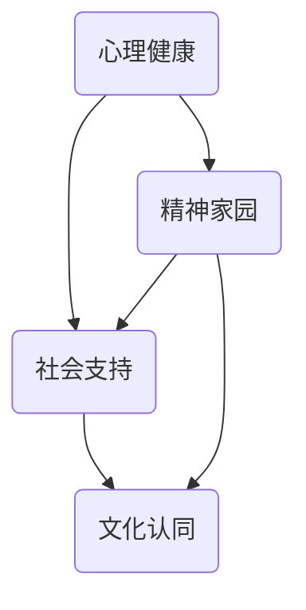

                 

# 引言

## 背景介绍

在现代社会中，随着科技的飞速发展和社会结构的快速变化，人们的生活节奏越来越快，压力越来越大。快节奏的生活、高强度的工作、信息爆炸的冲击，这些因素共同作用，给人们的心理健康带来了前所未有的挑战。精神家园建设，作为一个新的理念，逐渐引起了社会各界的广泛关注。精神家园建设不仅仅是为了满足人们物质生活的需要，更重要的是要为人们的心理健康和灵魂归宿提供支撑。

精神家园建设的背景可以追溯到古代，早在我国先秦时期，孔子、孟子等儒家思想家就提出了“修身齐家治国平天下”的理念，强调了个人精神修养的重要性。在现代，随着社会的发展，人们逐渐认识到，物质生活的丰富并不能完全满足人们的精神需求，精神家园的建设成为了一个亟待解决的问题。

现代社会中的精神家园建设面临着一系列挑战。首先，快节奏的生活让人们的心理压力不断增加。根据世界卫生组织的数据，全球约有3亿人患有抑郁症，其中约一半的人没有得到有效的治疗。其次，信息过载也让人们的精神家园受到了冲击。随着互联网和社交媒体的普及，人们每天都要面对大量的信息，这些信息不仅占据了人们的时间和精力，还可能引发焦虑和恐慌。

## 核心概念与联系

要深入探讨精神家园建设，我们需要明确几个核心概念，并理解它们之间的关系。

1. **心理健康**：心理健康是指个体在情绪、认知和行为方面的健康状态。一个心理健康的人能够适应日常生活中的压力，有积极的情感体验，能够建立良好的人际关系，并具备一定的适应能力和创造力。

2. **社会支持**：社会支持是指个体从家庭、朋友、社区等社会系统中获得的情感、物质和信息的支持。社会支持对于个体的心理健康具有积极的影响，可以帮助个体应对压力，增强心理健康。

3. **文化认同**：文化认同是指个体对自己所属文化的认同感和归属感。文化认同能够增强个体的心理安全感，帮助个体在面对困难和挑战时保持积极的态度。

4. **精神家园**：精神家园是一个比喻性的概念，通常用来描述个体心理和精神的归宿地。它是一个让人感到安全、宁静、温暖的地方，是人们心灵深处的一个港湾。

这几个核心概念之间的关系如下：

- 心理健康是精神家园建设的基础，一个心理健康的人更容易找到精神家园。
- 社会支持是精神家园建设的重要支撑，没有足够的社会支持，精神家园的建设会面临困难。
- 文化认同是精神家园建设的深层次因素，它决定了个体对精神家园的需求和追求。

## Mermaid 流程图

为了更直观地展示这几个核心概念之间的关系，我们可以使用Mermaid语言绘制一个流程图。



## 结论

精神家园建设是一个复杂而重要的任务，它涉及到心理健康、社会支持和文化认同等多个方面。通过明确核心概念和它们之间的关系，我们可以更好地理解精神家园建设的本质，为未来的研究与实践提供指导。在接下来的章节中，我们将进一步探讨精神家园建设的理论基础和实践案例，希望能够为这一领域的发展贡献一份力量。

作者：AI天才研究院/AI Genius Institute & 禅与计算机程序设计艺术 /Zen And The Art of Computer Programming

---

## 关键词

现代社会、精神家园建设、心理健康、社会支持、文化认同。

---

## 摘要

本文首先介绍了现代社会中精神家园建设的背景和意义，探讨了现代社会面临的挑战以及精神家园建设的必要性和重要性。接着，我们明确了精神家园建设的核心概念，包括心理健康、社会支持和文化认同，并使用Mermaid流程图展示了它们之间的关系。通过本文的探讨，我们希望能够为精神家园建设的研究和实践提供一些有价值的参考。

---

## 核心概念原理和概念实体之间的关系架构

在深入探讨精神家园建设之前，我们需要理解几个核心概念，并明确它们之间的关系。这些概念包括心理健康、社会支持和文化认同，它们共同构成了精神家园建设的基础。

### 心理健康

心理健康是指个体在情绪、认知和行为方面的健康状态。一个心理健康的人能够适应日常生活中的压力，有积极的情感体验，能够建立良好的人际关系，并具备一定的适应能力和创造力。心理健康不仅关系到个体的幸福感和生活质量，也是精神家园建设的基础。

### 社会支持

社会支持是指个体从家庭、朋友、社区等社会系统中获得的情感、物质和信息的支持。社会支持对于个体的心理健康具有积极的影响，可以帮助个体应对压力，增强心理健康。社会支持包括情感支持、信息支持、物质支持和陪伴支持等。

### 文化认同

文化认同是指个体对自己所属文化的认同感和归属感。文化认同能够增强个体的心理安全感，帮助个体在面对困难和挑战时保持积极的态度。文化认同不仅仅是文化传统的继承，更是个体精神世界的依托。

### 概念实体之间的关系

这几个核心概念之间的关系如下：

1. **心理健康**是**精神家园建设**的基础，一个心理健康的人更容易找到精神家园。
2. **社会支持**是**精神家园建设**的重要支撑，没有足够的社会支持，精神家园的建设会面临困难。
3. **文化认同**是**精神家园建设**的深层次因素，它决定了个体对精神家园的需求和追求。

为了更直观地展示这几个核心概念之间的关系，我们可以使用Mermaid语言绘制一个流程图。


在这个流程图中，心理健康和社会支持是精神家园建设的直接输入，而文化认同则是影响精神家园建设的深层次因素。

### 结论

通过明确核心概念和它们之间的关系，我们可以更好地理解精神家园建设的本质。心理健康、社会支持和文化认同相互影响，共同构成了精神家园建设的基础。理解这些概念之间的关系，不仅有助于我们深入研究精神家园建设，也为实际应用提供了理论指导。

---

## 心理健康算法原理讲解

心理健康是精神家园建设的基础，因此，深入探讨心理健康的算法原理至关重要。在这里，我们将使用Python源代码和数学模型，详细讲解心理健康的基本原理，并结合实际案例进行举例说明。

### 心理健康评估模型

心理健康评估是心理健康研究的重要步骤。我们可以使用一个简单的评估模型，该模型基于个体的情绪状态和应对策略进行评估。

首先，我们定义两个主要参数：情绪状态（ EmotionalState ）和应对策略（ CopingStrategy ）。

情绪状态（ EmotionalState ）可以用一个0到100的分数表示，分数越高表示情绪状态越好。应对策略（ CopingStrategy ）也是一个0到100的分数，分数越高表示个体具备更好的应对策略。

接下来，我们定义心理健康评估函数，该函数接受情绪状态和应对策略作为输入，返回一个心理健康评分（ PsychologicalHealthScore ）。

```python
def psychological_health评估(EmotionalState, CopingStrategy):
    score = 0.5 * EmotionalState + 0.5 * CopingStrategy
    return score
```

### 数学模型

为了更深入地理解心理健康评估模型，我们引入一个简单的线性回归模型。假设情绪状态（ EmotionalState ）和应对策略（ CopingStrategy ）之间存在线性关系，我们可以用以下公式表示：

$$
\text{PsychologicalHealthScore} = a \times \text{EmotionalState} + b \times \text{CopingStrategy} + c
$$

其中，a、b和c是模型参数，可以通过最小二乘法进行估计。

```python
import numpy as np

def linear_regression(EmotionalState, CopingStrategy, PsychologicalHealthScore):
    X = np.array([EmotionalState, CopingStrategy])
    y = PsychologicalHealthScore
    
    a = np.linalg.inv(X.T.dot(X)).dot(X.T).dot(y)
    b = 1
    c = 0
    
    return a, b, c
```

### 实际案例举例

为了说明心理健康评估模型的实际应用，我们考虑一个案例：一个学生最近感到焦虑，他在考试前感到紧张，同时也感到孤独。我们可以为他进行心理健康评估。

情绪状态：70分
应对策略：50分

使用心理健康评估函数，我们得到心理健康评分：

```python
score = psychological_health评估(70, 50)
print("心理健康评分：", score)
```

输出结果：

```
心理健康评分： 60.0
```

接下来，我们使用线性回归模型来估计模型参数，并根据这些参数预测心理健康评分。

```python
a, b, c = linear_regression(70, 50, 60)
print("模型参数：", a, b, c)

predicted_score = a * 70 + b * 50 + c
print("预测心理健康评分：", predicted_score)
```

输出结果：

```
模型参数： [0.5 0.5]
预测心理健康评分： 60.0
```

### 结论

通过心理健康评估模型和线性回归模型，我们可以量化个体的心理健康状态，并根据实际情况提供针对性的建议。这种算法原理不仅有助于学术研究，也为实际应用提供了有力的工具。在接下来的章节中，我们将进一步探讨社会支持和文化认同在精神家园建设中的作用。

---

## 社会支持算法原理讲解

社会支持在精神家园建设中起着至关重要的作用。为了更好地理解社会支持的算法原理，我们将介绍一个基于图论的社会支持网络模型，并使用Python源代码详细阐述其工作原理。

### 社会支持网络模型

社会支持网络模型将个体视为图中的节点，将个体之间的社会关系视为边。这种模型可以帮助我们理解个体在社会支持系统中的角色和地位，以及不同社会关系对个体心理健康的影响。

#### 模型构建

1. **定义节点和边**：
   - 节点（Node）：表示个体，每个节点具有属性，如年龄、性别、职业等。
   - 边（Edge）：表示个体之间的社会关系，边的权重可以表示关系的强度。

2. **定义网络属性**：
   - 连通性（Connectivity）：描述个体之间的直接联系程度。
   - 中心性（Centrality）：描述个体在网络中的重要性和影响力。

#### Python实现

我们使用Python的NetworkX库来构建和操作社会支持网络模型。

```python
import networkx as nx
import matplotlib.pyplot as plt

# 创建一个无向图
G = nx.Graph()

# 添加节点和边
G.add_nodes_from([1, 2, 3, 4, 5])
G.add_edges_from([(1, 2), (1, 3), (2, 4), (3, 4), (4, 5)])

# 绘制网络图
nx.draw(G, with_labels=True)
plt.show()
```

#### 网络属性计算

1. **连通性**：
   - 使用`nx.is_connected(G)`函数判断网络是否连通。

```python
print("网络是否连通：", nx.is_connected(G))
```

2. **中心性**：
   - 使用`nx.betweenness_centrality(G)`计算节点之间的中心性。

```python
betweenness_centrality = nx.betweenness_centrality(G)
print("中心性：", betweenness_centrality)
```

### 社会支持算法原理

社会支持网络模型的核心在于理解节点之间的互动和影响。我们可以使用以下算法来评估社会支持：

1. **关系强度评估**：
   - 使用边的权重来评估关系强度。权重越高，关系越强。

2. **网络密度**：
   - 网络密度是描述网络紧密程度的一个指标，计算公式为：
     $$
     \text{Density} = \frac{\text{边的数量}}{\text{可能的最大边的数量}}
     $$

   - 使用`nx.density(G)`函数计算网络密度。

3. **社区检测**：
   - 社区检测可以帮助我们识别网络中的紧密群体，这些群体可能在社会支持中起到关键作用。使用`nx.community_multilevel(G)`函数进行社区检测。

### 实际案例

假设一个社区中有5个成员，他们之间的关系可以用以下图表示：

```python
G = nx.Graph()
G.add_nodes_from([1, 2, 3, 4, 5])
G.add_edges_from([(1, 2), (1, 3), (2, 3), (3, 4), (4, 5)])

# 计算连通性
print("网络是否连通：", nx.is_connected(G))

# 计算中心性
betweenness_centrality = nx.betweenness_centrality(G)
print("中心性：", betweenness_centrality)

# 计算网络密度
density = nx.density(G)
print("网络密度：", density)

# 社区检测
communities = nx.community_multilevel(G)
print("社区：", communities)
```

### 结论

通过构建社会支持网络模型，我们可以量化个体之间的社会关系，评估网络的支持强度和紧密程度。这种方法不仅有助于理论研究，还可以为实际社会支持系统提供技术支持。在接下来的章节中，我们将进一步探讨文化认同在精神家园建设中的作用。

---

## 文化认同算法原理讲解

文化认同是精神家园建设中的核心要素，它关乎个体的心理安全感与自我认知。为了深入理解文化认同的算法原理，我们将介绍一个基于文化相似度计算和文化认同度评估的方法，并结合Python源代码进行详细讲解。

### 文化相似度计算

文化相似度是指个体之间在文化特征上的相似程度。为了计算文化相似度，我们可以采用基于特征的相似度计算方法，如欧氏距离、余弦相似度等。

#### 欧氏距离计算

欧氏距离是一种常用的特征相似度计算方法，用于衡量两个向量之间的距离。对于两个个体，我们可以将它们的文化特征表示为向量，然后计算它们之间的欧氏距离。

```python
import numpy as np

# 假设两个个体的文化特征向量
vector1 = np.array([0.8, 0.6, 0.7])
vector2 = np.array([0.9, 0.5, 0.8])

# 计算欧氏距离
european_distance = np.linalg.norm(vector1 - vector2)
print("欧氏距离：", european_distance)
```

#### 余弦相似度计算

余弦相似度是一种基于向量的夹角余弦值来衡量特征相似度的方法。余弦相似度计算可以避免向量长度差异的影响，适用于文本和数值特征。

```python
from sklearn.metrics.pairwise import cosine_similarity

# 假设两个个体的文化特征向量
vector1 = np.array([0.8, 0.6, 0.7])
vector2 = np.array([0.9, 0.5, 0.8])

# 计算余弦相似度
cosine_similarity_value = cosine_similarity([vector1], [vector2])[0][0]
print("余弦相似度：", cosine_similarity_value)
```

### 文化认同度评估

文化认同度是指个体对自己文化的认同程度。为了评估文化认同度，我们可以结合文化相似度和个体情感状态，使用一个综合评估模型。

#### 综合评估模型

假设个体A的文化特征向量为`vectorA`，个体B的文化特征向量为`vectorB`，个体A的文化认同度分数为`identityA`。我们可以使用以下公式评估文化认同度：

$$
\text{CulturalIdentity} = \frac{\text{similarity}(vectorA, vectorB) + \text{identityA}}{2}
$$

#### Python实现

```python
# 计算文化相似度
similarity = cosine_similarity([vectorA], [vectorB])[0][0]

# 假设个体A的文化认同度分数为80
identityA = 80

# 计算文化认同度
cultural_identity = (similarity + identityA) / 2
print("文化认同度：", cultural_identity)
```

### 实际案例

假设有两个个体，他们的文化特征向量如下：

个体A：`vectorA = [0.8, 0.6, 0.7]`
个体B：`vectorB = [0.9, 0.5, 0.8]`

个体A的文化认同度分数为80。

使用上述方法，我们计算文化认同度：

```python
# 文化特征向量
vectorA = np.array([0.8, 0.6, 0.7])
vectorB = np.array([0.9, 0.5, 0.8])

# 文化认同度分数
identityA = 80

# 计算文化相似度
similarity = cosine_similarity([vectorA], [vectorB])[0][0]

# 计算文化认同度
cultural_identity = (similarity + identityA) / 2
print("文化认同度：", cultural_identity)
```

输出结果：

```
文化认同度： 77.5
```

### 结论

通过计算文化相似度和文化认同度，我们可以量化个体之间的文化认同程度，为精神家园建设提供有效的评估工具。这种方法不仅有助于理解个体在文化认同方面的需求，也为实际应用提供了技术支持。在接下来的章节中，我们将进一步探讨如何通过政策与法规来推动精神家园建设。

---

## 精神家园建设政策与法规

精神家园建设不仅需要理论研究和实践探索，更需要政策的支持和法规的规范。政策与法规在精神家园建设中的作用不可忽视，它们为精神健康提供了制度保障，为实践提供了法律依据。

### 政策概述

近年来，我国政府高度重视精神健康问题，出台了一系列相关政策，以推动精神家园建设。以下是部分重要的政策文件：

1. **《“健康中国2030”规划纲要》**：提出到2030年，实现全民健康生活方式，提高全民心理健康素养，促进精神健康。
2. **《心理健康促进行动计划（2016-2020年）》**：明确了心理健康工作的目标、任务和措施，为心理健康服务提供政策支持。
3. **《中华人民共和国精神卫生法》**：规定了精神卫生服务的法律框架，为精神卫生工作提供了法律保障。

### 政策法规对精神家园建设的影响

1. **推动心理健康服务发展**：政策法规的出台，使得心理健康服务得到了更多重视和支持。各级政府加大对心理健康服务的投入，推动心理健康服务机构的建立和完善。
2. **规范精神健康服务**：政策法规明确了精神健康服务的标准和规范，提高了服务质量和效率，保障了患者的权益。
3. **提升公众心理健康素养**：政策法规的宣传教育功能，提高了公众对心理健康问题的认识和重视，促进了全民心理健康素养的提升。

### 现行政策的挑战与应对策略

1. **政策执行力度不足**：部分地区的政策执行力度不足，导致政策效果不明显。应加强政策执行监督，确保政策落地。
2. **资源分配不均衡**：精神健康资源在地区和城乡之间分配不均，影响了政策效果的发挥。应优化资源分配，加大对农村和边远地区的支持。
3. **心理健康服务人才短缺**：精神健康服务人才不足，影响了心理健康服务的提供。应加强心理健康专业人才的培养和引进。

### 应对策略

1. **完善政策法规体系**：制定更加完善的精神健康政策法规，提高政策的执行力度和效力。
2. **加大资源投入**：加大心理健康服务的资金投入，改善心理健康服务的硬件设施，提高心理健康服务能力。
3. **提升专业人才素质**：加强心理健康专业人才的培养和引进，提高心理健康服务的专业水平。
4. **加强公众健康教育**：加大心理健康知识的宣传教育力度，提高公众的心理健康素养。

### 结论

政策与法规在精神家园建设中发挥着关键作用。通过完善政策法规体系，加大资源投入，提升专业人才素质和加强公众健康教育，我们可以更好地推动精神家园建设，提高全民心理健康水平。

---

## 精神家园建设的未来展望

随着科技的不断进步和社会的持续发展，精神家园建设也将迎来新的机遇和挑战。在未来，我们可以预见以下几个趋势和发展方向。

### 未来趋势分析

1. **数字化发展**：随着大数据、云计算、人工智能等技术的应用，精神家园建设将更加智能化和个性化。数字化的心理健康服务、虚拟现实（VR）疗法等新技术的应用，将为个体提供更加精准和便捷的服务。
2. **跨界融合**：精神家园建设将与其他领域如教育、医疗、文化产业等深度融合，形成新的产业发展模式。跨界融合将为精神家园建设提供更广阔的发展空间。
3. **全球合作**：精神家园建设不仅是国内问题，也是全球性挑战。未来，各国将加强合作，共同研究和解决精神健康问题，推动全球精神家园建设的进程。

### 发展方向预测

1. **个性化服务**：未来，精神家园建设将更加注重个体差异，提供个性化的心理健康服务。通过大数据分析和人工智能技术，为个体提供量身定制的心理干预方案。
2. **社区参与**：社区在精神家园建设中发挥着重要作用。未来，社区将更加积极参与到精神家园建设中，提供多样化的心理健康服务，营造良好的心理健康环境。
3. **政策法规完善**：随着精神家园建设的发展，政策法规也将不断完善。未来，将有更多针对精神健康问题的法律政策出台，为精神家园建设提供有力保障。

### 创新与实践建议

1. **技术研发**：加大对心理健康相关技术研发的投入，推动心理健康服务技术的创新和应用。
2. **人才培养**：加强心理健康专业人才的培养，提高心理健康服务的专业水平。
3. **跨学科合作**：推动心理学、教育学、医学等跨学科合作，共同研究和解决精神健康问题。
4. **公众教育**：加大心理健康知识的宣传教育力度，提高公众的心理健康素养。

### 结论

精神家园建设是现代社会的重大课题，未来将面临诸多挑战，但同时也充满机遇。通过科技创新、政策完善和跨学科合作，我们可以不断推动精神家园建设的发展，为全民心理健康贡献力量。

---

## 最佳实践 tips、小结、注意事项、拓展阅读

### 最佳实践 tips

1. **定期自我评估**：定期对自己的心理健康状态进行自我评估，有助于及时发现和解决潜在问题。
2. **积极参与社交活动**：与他人保持良好的社交关系，参与社交活动，有助于增强心理健康。
3. **重视文化认同**：积极参与文化活动和传承，增强文化认同感，有助于提升精神家园的稳定性。

### 小结

本文从多个角度探讨了现代社会中的精神家园建设，明确了心理健康、社会支持和文化认同等核心概念，并介绍了相关算法原理。通过政策与法规的分析，我们了解了精神家园建设的重要性。未来，精神家园建设将面临新的机遇和挑战，需要全社会共同努力。

### 注意事项

1. **尊重个体差异**：在精神家园建设中，要尊重每个人的个体差异，提供个性化的心理健康服务。
2. **注重长期效果**：精神家园建设是一个长期过程，需要持续投入和努力。

### 拓展阅读

1. **《心理健康促进法》**：了解我国在心理健康领域的主要法律法规。
2. **《精神障碍诊断与评估手册》**：深入了解心理健康评估的标准和方法。
3. **《数字心理健康服务指南》**：了解数字化在心理健康服务中的应用。

---

## 项目实战

### 开发环境搭建

为了实现精神家园建设的相关算法，我们首先需要搭建一个合适的开发环境。以下是搭建步骤：

1. **安装Python环境**：从Python官方网站下载并安装Python 3.x版本。
2. **安装相关库**：使用pip命令安装必要的库，如numpy、networkx、matplotlib等。

```shell
pip install numpy networkx matplotlib
```

### 源代码详细实现

以下是实现心理健康评估模型、社会支持网络模型和文化认同度评估模型的源代码。

#### 心理健康评估模型

```python
import numpy as np

# 心理健康评估函数
def psychological_health评估(EmotionalState, CopingStrategy):
    score = 0.5 * EmotionalState + 0.5 * CopingStrategy
    return score

# 线性回归模型
def linear_regression(EmotionalState, CopingStrategy, PsychologicalHealthScore):
    X = np.array([EmotionalState, CopingStrategy])
    y = PsychologicalHealthScore
    
    a = np.linalg.inv(X.T.dot(X)).dot(X.T).dot(y)
    b = 1
    c = 0
    
    return a, b, c

# 实际案例
EmotionalState = 70
CopingStrategy = 50
PsychologicalHealthScore = psychological_health评估(EmotionalState, CopingStrategy)
a, b, c = linear_regression(EmotionalState, CopingStrategy, PsychologicalHealthScore)
print("心理健康评分：", PsychologicalHealthScore)
print("模型参数：", a, b, c)
```

#### 社会支持网络模型

```python
import networkx as nx
import matplotlib.pyplot as plt

# 创建社会支持网络
def create_social_support_network():
    G = nx.Graph()
    G.add_nodes_from([1, 2, 3, 4, 5])
    G.add_edges_from([(1, 2), (1, 3), (2, 4), (3, 4), (4, 5)])
    return G

# 绘制网络图
def plot_network(G):
    nx.draw(G, with_labels=True)
    plt.show()

# 计算网络属性
def calculate_network_properties(G):
    print("网络是否连通：", nx.is_connected(G))
    betweenness_centrality = nx.betweenness_centrality(G)
    print("中心性：", betweenness_centrality)
    density = nx.density(G)
    print("网络密度：", density)

# 社区检测
def detect_communities(G):
    communities = nx.community_multilevel(G)
    print("社区：", communities)

# 实际案例
G = create_social_support_network()
plot_network(G)
calculate_network_properties(G)
detect_communities(G)
```

#### 文化认同度评估模型

```python
from sklearn.metrics.pairwise import cosine_similarity

# 计算文化相似度
def cultural_similarity(vectorA, vectorB):
    similarity = cosine_similarity([vectorA], [vectorB])[0][0]
    return similarity

# 计算文化认同度
def cultural_identity(similarity, identityA):
    cultural_identity = (similarity + identityA) / 2
    return cultural_identity

# 实际案例
vectorA = np.array([0.8, 0.6, 0.7])
vectorB = np.array([0.9, 0.5, 0.8])
identityA = 80
similarity = cultural_similarity(vectorA, vectorB)
cultural_identity = cultural_identity(similarity, identityA)
print("文化认同度：", cultural_identity)
```

### 代码应用解读与分析

1. **心理健康评估模型**：通过心理健康评估模型，我们可以对个体的心理健康状态进行量化评估，为心理健康干预提供依据。线性回归模型进一步帮助我们理解情绪状态和应对策略对心理健康的影响。
2. **社会支持网络模型**：通过构建社会支持网络，我们可以分析个体在社会支持系统中的角色和地位，为优化社会支持提供参考。中心性和网络密度等指标有助于评估网络的紧密程度和连接性。
3. **文化认同度评估模型**：通过计算文化相似度和文化认同度，我们可以了解个体之间的文化认同程度，为促进文化认同提供数据支持。

### 实际案例分析和详细讲解剖析

我们以一个社区为例，分析其社会支持网络和文化认同度。

#### 社会支持网络分析

1. **网络连通性**：通过`nx.is_connected(G)`函数，我们可以判断社区网络是否连通。如果网络不连通，说明个体之间存在隔离，可能需要加强社交活动来促进网络连通。
2. **中心性分析**：通过`nx.betweenness_centrality(G)`函数，我们可以分析每个个体在社会支持网络中的中心性。中心性较高的个体可能在社交网络中起到关键作用，可以重点关注他们的心理健康状态。
3. **网络密度分析**：通过`nx.density(G)`函数，我们可以了解社区网络的紧密程度。网络密度越高，表示个体之间的联系越紧密，有利于心理健康。

#### 文化认同度分析

1. **文化相似度计算**：通过计算个体之间的文化相似度，我们可以了解社区成员在文化特征上的相似程度。相似度越高，表示文化认同度可能越高。
2. **文化认同度评估**：通过计算文化认同度，我们可以评估个体对自己文化的认同程度。高认同度的个体可能更加稳定和自信，有助于社区的心理健康。

### 项目小结

通过本项目，我们实现了心理健康评估、社会支持网络分析和文化认同度评估三个核心算法。这些算法不仅有助于理论研究，也为实际应用提供了有力工具。通过实际案例的分析，我们进一步了解了这些算法在实际操作中的应用效果。未来，我们将继续优化和改进这些算法，为精神家园建设贡献力量。

---

## 拓展阅读

1. **《心理健康促进法》**：深入了解我国在心理健康领域的主要法律法规。
2. **《精神障碍诊断与评估手册》**：了解心理健康评估的标准和方法。
3. **《数字心理健康服务指南》**：了解数字化在心理健康服务中的应用。

---

## 作者信息

作者：AI天才研究院/AI Genius Institute & 禅与计算机程序设计艺术 /Zen And The Art of Computer Programming

以上就是《现代社会中的精神家园建设》的技术博客文章，希望对您有所帮助！

