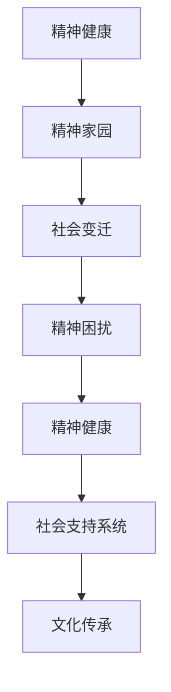

                 

### 《现代社会中的精神家园重建》

> **关键词：精神家园、社会变迁、精神困扰、精神健康、社会支持系统、文化传承**

> **摘要：本文将探讨现代社会中精神家园重建的重要性、面临的挑战以及可行的策略。通过深入分析社会变迁对精神家园的影响，识别精神困扰的类型与应对方法，以及促进精神健康的策略，本文旨在为读者提供一套系统的、实用的精神家园重建方案。**

## 第一部分：引言与概述

### 1.1 精神家园的重要性

精神家园是人类心灵深处的一处避风港，它不仅关乎个体的心理健康，还关系到社会的和谐与进步。在现代社会，随着科技的飞速发展和全球化进程的加剧，人们的生活方式发生了翻天覆地的变化。然而，这些变化也带来了新的挑战，特别是在精神层面上。

精神家园的定义不仅限于物理空间，更涵盖了情感、文化和社会互动等多方面的因素。它提供了个体心理上的安全感、归属感和自我认同感。一个健全的精神家园能够帮助人们应对压力、挫折和不确定性，从而保持良好的精神状态。

在本文中，我们将深入探讨以下几个核心概念：

- **精神家园**：定义、内涵及作用。
- **社会变迁**：类型与特征及其对精神家园的影响。
- **精神困扰**：类型与识别，以及应对策略。
- **精神健康**：评估与维护策略。
- **社会支持系统**：构成与功能。
- **文化传承**：重要性及途径。

这些概念之间存在着紧密的联系。社会变迁对精神家园的影响会产生各种精神困扰，而这些困扰又会反过来影响精神健康。通过建设健全的社会支持系统和传承优秀的文化，我们可以有效地促进精神家园的重建。

### 1.2 核心概念与联系

为了更好地理解上述核心概念之间的关系，我们可以借助Mermaid流程图来表示它们之间的相互作用：

- **精神家园**：一个心灵的港湾，提供安全感、归属感和自我认同感。
- **社会变迁**：城市化、数字化、全球化等变化，影响精神生活。
- **精神困扰**：压力、焦虑、抑郁等，源自社会变迁和个人经历。
- **精神健康**：个体的心理状态，影响精神家园的稳定。
- **社会支持系统**：社区、家庭、心理健康服务等，帮助应对精神困扰。
- **文化传承**：文化传统、价值观，增强精神归属感。

通过这个流程图，我们可以清晰地看到这些概念之间的相互影响和作用。社会变迁引发了精神困扰，而精神困扰又反过来影响精神健康。精神健康稳定时，有助于精神家园的建设；反之，精神困扰则会削弱精神家园的功能。社会支持系统和文化传承则在精神家园的重建过程中发挥关键作用。

接下来，我们将详细探讨每个核心概念，以帮助读者更好地理解精神家园重建的过程和策略。

### 第1章：精神家园的重要性

#### 1.1 精神家园的定义与内涵

精神家园是一个抽象的概念，但它对个体的心理健康和社会的和谐具有深远的影响。从定义上看，精神家园不仅仅是一个物理空间，它更是一个心灵的港湾，涵盖了情感、文化和社会互动等多个层面。

首先，精神家园提供了一种安全感。在现代社会中，人们面临着诸多不确定性和压力，如工作压力、人际关系矛盾、经济困境等。一个健全的精神家园能够为个体提供心理上的支撑，帮助他们在面对困境时保持冷静和坚定。

其次，精神家园提供了归属感。归属感是人们对于某个群体或社区的认同和归属，它是一种深层次的情感体验。一个健全的精神家园能够帮助个体找到自己的归属，增强对社会的认同感和责任感。

最后，精神家园也关乎自我认同感。自我认同感是指个体对于自己身份和角色的认同，它直接影响个体的自信心和自尊心。一个健全的精神家园能够帮助个体建立积极的自尊心和自信心，从而更好地面对生活的挑战。

从内涵上看，精神家园不仅仅是一个个人的心理空间，它还涉及到文化和社会因素。例如，文化传承中的传统价值观和道德观念，可以帮助个体建立精神家园的基石；社会互动中的互助和关爱，则可以增强个体的归属感和安全感。

总之，精神家园是一个综合性的概念，它涵盖了安全感、归属感和自我认同感等多个方面。在现代社会中，精神家园的建设对于个体的心理健康和社会的和谐发展具有重要意义。

### 第2章：社会变迁对精神家园的影响

#### 2.1 社会变迁的类型与特征

社会变迁是一个复杂的过程，它涵盖了多个方面的变化，包括经济、文化、技术、人口结构等。这些变迁不仅改变了人们的生活方式，也对他们的精神生活产生了深远的影响。

首先，城市化是现代社会变迁的一个重要特征。随着城市化进程的加快，越来越多的人从农村迁移到城市，这导致了家庭结构和社交网络的改变。在城市中，人们面临更多的压力和挑战，如高房价、就业竞争、交通拥堵等，这些因素都会对个体的心理健康产生负面影响。

其次，数字化技术的快速发展也是现代社会变迁的一个重要特征。互联网和移动设备的普及，使得人们的信息获取和交流方式发生了巨大变化。然而，数字化也带来了一些新的问题，如信息过载、隐私泄露、网络暴力等，这些问题都可能对个体的精神健康造成困扰。

最后，全球化是一个不可忽视的社会变迁特征。全球化使得不同国家和地区之间的联系更加紧密，但也带来了文化冲突、经济不平等和移民问题。全球化进程中的竞争和压力，使得一些人在追求物质成功的同时，忽视了精神层面的需求。

#### 2.2 社会变迁如何影响精神家园

社会变迁对精神家园的影响是多方面的。首先，社会变迁可能导致个体面临更多的压力和不确定性，从而增加精神困扰的风险。例如，城市化进程中的高房价和就业压力，可能导致人们产生焦虑和抑郁情绪。数字化技术带来的信息过载和隐私泄露，也可能导致人们的心理负担加重。

其次，社会变迁可能改变人们的社交网络和人际关系。例如，城市化进程可能导致人们与亲友的分离，从而减少情感支持。数字化技术虽然提供了更多的交流方式，但也可能导致人们与现实生活中的人际关系疏远。

最后，社会变迁还可能影响个体的文化认同感。全球化进程中的文化冲突，可能使一些人感到迷茫和困惑，从而削弱他们的自我认同感。

总之，社会变迁对精神家园的影响是复杂和多维的。理解这些影响，有助于我们更好地应对现代社会中的精神困扰，重建健全的精神家园。

### 第3章：精神困扰的识别与应对

#### 3.1 精神困扰的类型与表现

精神困扰是现代社会中常见的心理健康问题，它们影响着个体的日常生活和幸福感。常见的心理困扰包括焦虑、抑郁、孤独感和失眠等。以下是这些困扰的类型与表现：

1. **焦虑**：焦虑是一种常见的情绪困扰，表现为持续的担忧、紧张和恐惧感。焦虑可能会影响个体的注意力、记忆力以及日常功能。严重的情况下，焦虑可能导致恐慌发作，表现为突发性的极度恐惧和呼吸困难。

2. **抑郁**：抑郁是一种情绪低落的心理状态，持续时间较长，可能伴随悲观、绝望和无价值感。抑郁可能影响个体的睡眠、食欲和活动水平，甚至可能导致自杀行为。抑郁的表现形式包括情绪低落、兴趣丧失、疲劳和自责。

3. **孤独感**：孤独感是一种主观体验，感到与他人疏远和缺乏亲密关系。孤独感可能源于现实生活中的社交隔离或缺乏深层次的社交联系。孤独感可能导致情绪困扰、心理压力和健康问题。

4. **失眠**：失眠是一种常见的睡眠障碍，表现为难以入睡、易醒或早醒。失眠会影响个体的注意力和情绪状态，长期失眠可能导致慢性疲劳、情绪不稳定和健康问题。

#### 3.2 识别精神困扰的方法

识别精神困扰是应对它们的第一步。以下是一些常见的方法来识别精神困扰：

1. **自我观察**：通过自我反思，观察自己的情绪和行为变化。例如，如果经常感到焦虑、情绪低落或失眠，这可能是精神困扰的信号。

2. **亲友反馈**：与亲友交流，了解他们对你的行为的观察。亲友可能会提供一些你自己没有意识到的信息。

3. **专业评估**：如果怀疑自己有精神困扰，可以寻求专业的心理健康评估。心理医生或心理咨询师可以使用标准化问卷或访谈来评估个体的心理健康状况。

4. **日常记录**：保持日常记录，记录自己的情绪、睡眠和活动情况。这有助于识别可能的困扰模式和触发因素。

#### 3.3 对付精神困扰的策略

一旦识别出精神困扰，采取适当的应对策略至关重要。以下是一些应对精神困扰的策略：

1. **心理治疗**：心理治疗是一种有效的应对方法，包括认知行为疗法、心理分析和人本主义疗法等。心理治疗可以帮助个体理解自己的困扰，学习新的应对技能，并改善情绪和行为。

2. **药物治疗**：在某些情况下，药物治疗可能有助于缓解精神困扰。例如，抗抑郁药可以缓解抑郁症状，抗焦虑药可以减轻焦虑。药物治疗应在医生的指导下进行。

3. **生活方式调整**：改善生活方式是应对精神困扰的重要方面。例如，保证充足的睡眠、均衡的饮食和适量的运动都有助于改善心理健康。

4. **社交互动**：加强与亲友的社交互动，参加社区活动或加入兴趣小组，可以帮助减轻孤独感和增加社会支持。

5. **自我照顾**：学会自我照顾，包括进行放松训练、冥想和正念练习等，有助于缓解压力和焦虑。

总之，识别和应对精神困扰是维护精神健康的重要步骤。通过自我观察、亲友反馈和专业评估，我们可以更好地理解自己的心理健康状况。采取有效的应对策略，我们可以改善情绪和行为，重建精神家园。

### 第4章：精神健康的促进与维护

#### 4.1 精神健康的评估与维护策略

精神健康是人们生活质量的重要指标，维护精神健康不仅关系到个体的心理健康，也影响到家庭和社会的和谐。评估与维护精神健康需要科学的方法和有效的策略。以下是一些关键步骤和建议：

##### 4.1.1 精神健康的评估

1. **自我评估**：通过自我观察，记录自己的情绪、思维和行为模式，了解自己的精神状态。常见的自我评估工具包括情绪日记、心理问卷等。
   
2. **亲友反馈**：与亲朋好友交流，获取他们对你的情绪和行为表现的观察和反馈。亲友的视角可能帮助你发现一些自己未曾意识到的情绪变化。

3. **专业评估**：如果自我评估或亲友反馈提示可能存在精神健康问题，应寻求专业的心理健康评估。专业评估可能包括面谈、心理测试和临床检查。

4. **医学检查**：在必要时，进行医学检查以排除可能的生理原因。如甲状腺功能异常、贫血等生理问题可能会影响情绪和行为。

##### 4.1.2 维护精神健康的策略

1. **生活方式调整**：
   - **均衡饮食**：摄入足够的营养，特别是维生素B群、Omega-3脂肪酸和抗氧化剂，有助于维护心理健康。
   - **充足睡眠**：保证每晚7-9小时的睡眠，有助于大脑恢复和情绪稳定。
   - **适量运动**：定期进行有氧运动，如散步、跑步或游泳，有助于减轻压力和焦虑，提升情绪。

2. **心理治疗**：
   - **认知行为疗法（CBT）**：通过改变不合理的思维和行为模式来改善情绪和心理状态。
   - **正念冥想**：通过专注于当前的感受和体验来减少焦虑和压力。
   - **心理分析**：探索潜意识中的冲突和情绪问题，帮助个体获得更深层次的理解和成长。

3. **药物治疗**：
   - **抗抑郁药和抗焦虑药**：在医生的指导下使用，用于治疗严重的情绪障碍。
   - **补充剂**：如维生素B、Omega-3脂肪酸等，用于缓解轻度情绪问题。

4. **社交互动**：
   - **建立支持系统**：与亲朋好友保持密切联系，参加社区活动或兴趣小组，以获得情感支持和社交互动。
   - **积极交往**：与他人进行开放和真诚的交流，分享自己的感受和经历，有助于缓解压力和焦虑。

5. **自我照顾**：
   - **放松训练**：通过深呼吸、冥想或渐进性肌肉放松来缓解压力。
   - **时间管理**：合理安排工作和休息时间，避免过度劳累。
   - **兴趣爱好**：培养个人兴趣和爱好，如阅读、绘画、音乐等，有助于提升心理健康和幸福感。

##### 4.1.3 常见误区与注意事项

1. **误区一：精神健康是“软”问题**：很多人认为精神健康问题不是真正的疾病，这种观念可能导致人们忽视精神健康问题。实际上，精神健康问题与生理健康问题一样重要，需要得到同样的关注和重视。

2. **误区二：依赖药物治疗**：虽然药物治疗是精神健康问题的一种重要手段，但不应过度依赖。心理治疗和生活方式调整同样重要，它们可以帮助个体从根本上改善心理健康。

3. **误区三：自我诊断和自我治疗**：精神健康问题需要专业的评估和治疗。自我诊断和自我治疗可能会延误病情，甚至造成更严重的后果。

4. **注意事项**：
   - **及时就医**：如果出现情绪困扰或其他精神健康问题，应及时寻求专业帮助。
   - **长期管理**：精神健康问题往往需要长期的管理和治疗，不应期望短期内就能完全康复。
   - **综合治疗**：结合药物治疗、心理治疗和生活方式调整，以达到最佳的治疗效果。

通过科学的评估和有效的维护策略，我们可以更好地促进和维护精神健康，为个体和社会的和谐发展奠定坚实基础。

### 第5章：社会支持系统的建设

#### 5.1 社会支持系统的构成与功能

社会支持系统是精神家园重建的重要组成部分，它能够为个体提供情感、经济、信息和实际帮助，从而缓解精神困扰，促进精神健康。一个健全的社会支持系统包括以下几个方面：

**1. 家庭支持**：家庭是每个人最基本的支持系统。家庭成员之间的相互理解、关心和支持可以帮助个体应对生活中的各种挑战。家庭成员的陪伴和鼓励能够提供情感上的慰藉，增强个体的自信心和安全感。

**2. 社区支持**：社区支持系统包括邻里关系、社区活动、社区服务等。社区活动如社区聚会、文化节日等可以增强居民的归属感，提供社交互动的机会。社区服务则包括社区健康中心、社区心理咨询等，为居民提供实际的帮助和资源。

**3. 政府支持**：政府支持系统包括政策支持、公共设施和社会福利等。政府的政策可以为精神健康提供法律保障和资源支持，如心理健康服务、医疗保险和福利项目。公共设施如公园、图书馆等也为居民提供了放松和社交的空间。

**4. 专业机构支持**：专业机构如医院、心理咨询机构、非政府组织等提供专业的心理健康服务和技术支持。这些机构可以提供心理治疗、咨询服务、康复训练等专业服务，帮助个体克服精神困扰。

**5. 社交网络支持**：社交网络支持包括朋友、同事、社交团体等。这些人可以在情感上提供支持，帮助个体分享感受、减轻压力，并在需要时提供实际帮助。

**6. 自我支持**：自我支持是指个体通过自我学习、自我调节和自我照顾来维护自己的精神健康。自我支持包括培养兴趣爱好、学习放松技巧、建立健康的生活方式等。

#### 5.2 建立社会支持系统的策略

**1. 增强家庭支持**：
   - **加强家庭沟通**：定期与家人交流，分享彼此的感受和需求，增强家庭凝聚力。
   - **家庭教育**：通过家庭教育，提高家庭成员对精神健康的认识，学习应对压力和情绪困扰的方法。
   - **共同活动**：组织家庭共同活动，如户外旅行、家庭聚餐等，增强家庭成员之间的互动和情感联系。

**2. 发展社区支持**：
   - **社区活动**：组织多样化的社区活动，如社区健身、文化讲座、心理健康讲座等，提高居民的精神健康意识和参与度。
   - **社区服务**：建立社区服务中心，提供心理健康咨询、社区健康检查等服务，方便居民获取帮助。
   - **邻里关系**：鼓励邻里之间相互了解和帮助，建立和谐的邻里关系，增强社区的凝聚力。

**3. 加强政府支持**：
   - **政策支持**：制定和实施支持精神健康的政策，如心理健康保险、心理健康教育等，为精神健康提供法律和制度保障。
   - **公共设施**：建设公共设施，如公园、健身房、图书馆等，为居民提供放松和社交的空间。
   - **社会福利**：提供社会福利项目，如低收入家庭的住房援助、心理健康服务补贴等，帮助有需要的人获得必要的支持。

**4. 提供专业机构支持**：
   - **专业服务**：增加心理健康服务的供给，提高心理咨询、心理治疗的普及率。
   - **康复训练**：为精神疾病康复者提供职业培训和康复训练，帮助他们重返社会。
   - **社区心理健康中心**：在社区建立心理健康中心，提供心理咨询、心理治疗和健康讲座等，方便居民获取专业帮助。

**5. 强化社交网络支持**：
   - **建立社交团体**：鼓励建立各种社交团体，如兴趣小组、志愿者团队等，为个体提供社交平台。
   - **社交技能培训**：提供社交技能培训，帮助个体提高人际交往能力，增强社交支持。
   - **互助网络**：建立互助网络，鼓励个体在需要时相互支持和帮助，形成互助的社区文化。

通过上述策略，我们可以建立一个健全的社会支持系统，为个体提供全面的支持，帮助他们重建精神家园，提高整体精神健康水平。

### 第6章：文化传承与精神家园重建

#### 6.1 文化传承的重要性与途径

文化传承在精神家园重建过程中扮演着至关重要的角色。文化不仅是民族的灵魂，也是个体精神世界的根基。一个富有文化底蕴的社会能够为个体提供强大的精神支持，帮助他们在面对现代社会的挑战时保持内心的宁静和坚定。

**1. 传承传统价值观**

传统价值观是文化传承的核心。例如，中国传统文化中的“仁爱”、“孝道”和“诚信”等价值观，不仅为个体提供了行为指南，也在精神层面为个体提供了力量。通过教育和宣传，我们可以让这些价值观深入人心，成为人们日常行为的准则。

**2. 传统节日的复兴**

传统节日是文化传承的重要载体。例如，春节、端午节和中秋节等节日，不仅承载着丰富的文化内涵，还提供了家人团聚、社区互动的机会。通过复兴和庆祝传统节日，我们可以增强个体的文化认同感和归属感，从而促进精神家园的建设。

**3. 文化活动的开展**

文化活动是传承和弘扬文化的重要途径。例如，书法、绘画、音乐和戏剧等文化活动，不仅可以丰富人们的精神生活，还可以增强个体的文化自信和认同感。政府和社会组织可以支持和鼓励这些文化活动的开展，为公众提供更多的文化体验和参与机会。

**4. 教育体系的改革**

教育体系是文化传承的重要环节。通过教育，我们可以将传统文化知识传递给下一代，培养他们的文化素养和民族自豪感。教育体系应注重文化课程的设计和实施，让学生在学习中感受到文化的魅力和力量。

**5. 媒体宣传的作用**

现代媒体在文化传播中发挥着重要作用。通过电视、电影、网络等渠道，我们可以将传统文化和现代精神相结合，创造出新的文化产品，吸引更多的观众和受众。媒体宣传不仅能够提升公众对文化的认知，还可以促进文化传承的普及和深入。

**6. 社区文化的建设**

社区文化是精神家园重建的重要组成部分。通过建设富有特色的社区文化，我们可以增强居民的认同感和归属感，为个体提供精神支撑。社区文化可以包括传统文化活动、社区节庆、社区公益活动等，通过这些活动，居民可以在互动中增强彼此的了解和信任，共同营造和谐的精神家园。

通过以上途径，我们可以有效地传承和弘扬传统文化，为精神家园重建提供坚实的基础。文化传承不仅是历史的延续，更是未来的希望。只有在文化传承的支持下，精神家园才能得以重建，个体的心灵才能找到真正的归宿。

### 第7章：精神家园重建的实践与案例

#### 7.1 精神家园重建的实践经验

在精神家园重建的过程中，许多社区和机构已经开展了积极的实践，取得了显著成效。以下是一些具体的实践经验：

**1. 社区心理健康服务项目**

许多社区建立了心理健康服务中心，为居民提供心理咨询、心理治疗和心理健康教育等服务。这些项目通过定期举办心理健康讲座、心理健康筛查和一对一咨询服务，帮助居民识别和管理精神困扰，提高了整体精神健康水平。

**2. 文化传承活动**

社区通过组织传统节庆活动、文化讲座和艺术展览等，弘扬传统文化，增强居民的文化认同感和归属感。这些活动不仅丰富了居民的精神生活，还促进了社区凝聚力的提升。

**3. 社区互助网络**

一些社区建立了互助网络，鼓励居民在需要时相互支持和帮助。通过互助网络，居民可以在日常生活中获得情感支持、信息资源和实际帮助，从而增强了社区的凝聚力和互助精神。

**4. 精神健康宣传教育**

许多学校和机构开展了精神健康宣传教育活动，提高了公众对精神健康的认识和重视。这些活动包括心理健康讲座、心理剧表演和心理健康宣传活动，通过多种形式传递心理健康知识，引导居民树立正确的心理健康观念。

**5. 网络心理健康服务**

随着互联网技术的发展，一些社区和机构开始提供网络心理健康服务，如在线心理咨询、心理健康直播和心理健康应用等。这些服务为那些因时间或地理位置限制而难以获得专业帮助的人提供了便利，扩大了心理健康服务的覆盖面。

#### 7.2 案例分析与讲解

以下是一个具体的精神家园重建案例及其详细分析：

**案例：某城市社区心理健康项目**

某城市社区为了应对日益增长的精神健康问题，启动了一项全面的心理健康项目。该项目包括以下主要活动：

**1. 心理健康讲座**：定期邀请心理健康专家举办讲座，向居民普及心理健康知识，提高居民对精神健康问题的认识和应对能力。

**2. 心理咨询服务**：设立心理健康咨询室，为居民提供免费的一对一心理咨询服务。心理咨询师通过面对面咨询和电话咨询等方式，帮助居民解决心理困扰。

**3. 社区心理健康宣传活动**：通过悬挂宣传横幅、发放宣传册和举办心理健康宣传活动，提高居民对心理健康问题的关注。

**4. 文化传承活动**：组织传统节庆活动和文化展览，增强居民的文化认同感和归属感。

**5. 社区互助网络**：建立社区互助网络，鼓励居民在需要时相互支持和帮助。

**案例分析**：

该案例展示了如何通过多种途径和策略，全面推动精神家园的重建。以下是对该案例的详细分析：

**1. 效果评估**：经过一年的实施，该社区的心理健康项目取得了显著成效。居民的心理健康意识明显提高，心理困扰的识别率也显著增加。心理健康服务的利用率大幅上升，许多居民表示他们的心理状况得到了显著改善。

**2. 经验教训**：该项目在实施过程中积累了一些经验和教训。首先，心理健康讲座和文化传承活动得到了居民的积极参与，说明这些活动形式易于接受且具有吸引力。其次，心理咨询服务虽然受欢迎，但面对面的咨询需求较大，需要增加咨询师的供给。最后，社区互助网络的建立初见成效，但需要进一步加强居民的参与度和互助意识。

**3. 未来展望**：基于该项目的成功经验，社区计划进一步扩大心理健康服务的覆盖范围，包括增加心理咨询师的数量、开展更广泛的心理健康宣传活动，以及加强社区互助网络的建设。此外，社区还计划引入更多的文化传承活动，以更好地满足居民的精神需求。

通过这些实践经验，我们可以看到精神家园重建的重要性和可行性。只要我们采取科学合理的策略，就可以有效地应对现代社会中的精神困扰，重建人们的精神家园。

### 总结与展望

通过本文的详细探讨，我们深刻认识到精神家园在现代社会中的重要性。在快速发展的科技和全球化背景下，社会变迁给人们的精神生活带来了前所未有的挑战。然而，通过科学合理的策略和实际行动，我们可以有效地应对这些挑战，重建人们的精神家园。

首先，社会变迁对精神家园产生了深远的影响。城市化、数字化和全球化等进程，不仅改变了人们的生活方式，也带来了新的精神困扰。这些困扰可能影响个体的心理健康，削弱他们的安全感、归属感和自我认同感。因此，理解社会变迁的影响，对于应对精神困扰具有重要意义。

其次，识别和应对精神困扰是精神家园重建的关键步骤。通过自我观察、亲友反馈和专业评估，我们可以准确识别精神困扰的类型和表现。采取心理治疗、药物治疗、生活方式调整和社交互动等多种策略，我们可以有效地缓解精神困扰，促进精神健康。

此外，促进和维护精神健康需要全社会共同努力。建立健全的社会支持系统，如家庭支持、社区支持、政府支持和专业机构支持，可以为个体提供全面的支持。同时，通过文化传承和社区文化建设，我们可以增强个体的文化认同感和归属感，为精神家园的建设提供坚实的基础。

最后，精神家园重建需要长期的坚持和实践。通过实践经验，我们可以看到，通过科学合理的策略和实际行动，精神家园重建是可行的。无论是社区心理健康项目、文化传承活动，还是社会支持系统的建设，都取得了显著的成效。

展望未来，我们应继续深入研究和探索精神家园重建的策略和方法。通过科技创新、政策支持和社会参与，我们可以为个体提供更加完善的支持，促进社会的和谐与进步。

总之，精神家园重建是一个复杂而重要的任务，需要全社会共同努力。只要我们持之以恒，采取科学合理的策略，就一定能够重建人们的精神家园，创造一个更加美好的未来。

### 作者信息

**作者：AI天才研究院/AI Genius Institute & 禅与计算机程序设计艺术 /Zen And The Art of Computer Programming**

本文由AI天才研究院（AI Genius Institute）的专家撰写，他们致力于探索人工智能和计算机科学的前沿领域。同时，作者也借鉴了《禅与计算机程序设计艺术》（Zen And The Art of Computer Programming）的哲学思想，以此为基础，深入探讨现代社会中的精神家园重建问题。希望通过本文的探讨，为读者提供有价值的思考和实践指导。

### 最佳实践 tips、小结、注意事项、拓展阅读

#### 最佳实践 tips

1. **定期自我反思**：通过定期自我反思，了解自己的情绪和心理状态，有助于早期识别精神困扰。
2. **建立健康的生活方式**：保持充足的睡眠、均衡的饮食和适量的运动，有助于维护精神健康。
3. **寻求专业帮助**：当面临严重的情绪困扰时，及时寻求专业心理医生的帮助，不要独自承受。
4. **积极参与社交活动**：积极参与社交活动，增强社交支持，有助于缓解孤独感和焦虑。
5. **学习放松技巧**：通过冥想、深呼吸等方法，学会放松技巧，有助于缓解压力和焦虑。

#### 小结

本文探讨了现代社会中精神家园重建的重要性、面临的挑战以及可行的策略。通过深入分析社会变迁对精神家园的影响，识别精神困扰的类型与应对方法，以及促进精神健康的策略，本文旨在为读者提供一套系统的、实用的精神家园重建方案。

#### 注意事项

1. **重视精神健康**：精神健康与生理健康同等重要，应给予足够的关注和重视。
2. **结合多种策略**：在应对精神困扰时，应结合心理治疗、药物治疗和生活方式调整等多种策略。
3. **关注长远效果**：精神家园重建是一个长期过程，需要持续的努力和关注。

#### 拓展阅读

1. **《社会心理学》**：戴维·迈尔斯著，深入探讨了社会环境对个体心理和行为的影响。
2. **《心理健康自助手册》**：菲利普·蒙塔尼著，提供了实用的心理健康自我管理和应对策略。
3. **《文化心理学》**：罗伯特·派克著，分析了文化对个体心理和行为的影响，以及文化传承的重要性。

通过阅读这些拓展资源，读者可以进一步加深对精神家园重建的理解，并获取更多的实践指导。

