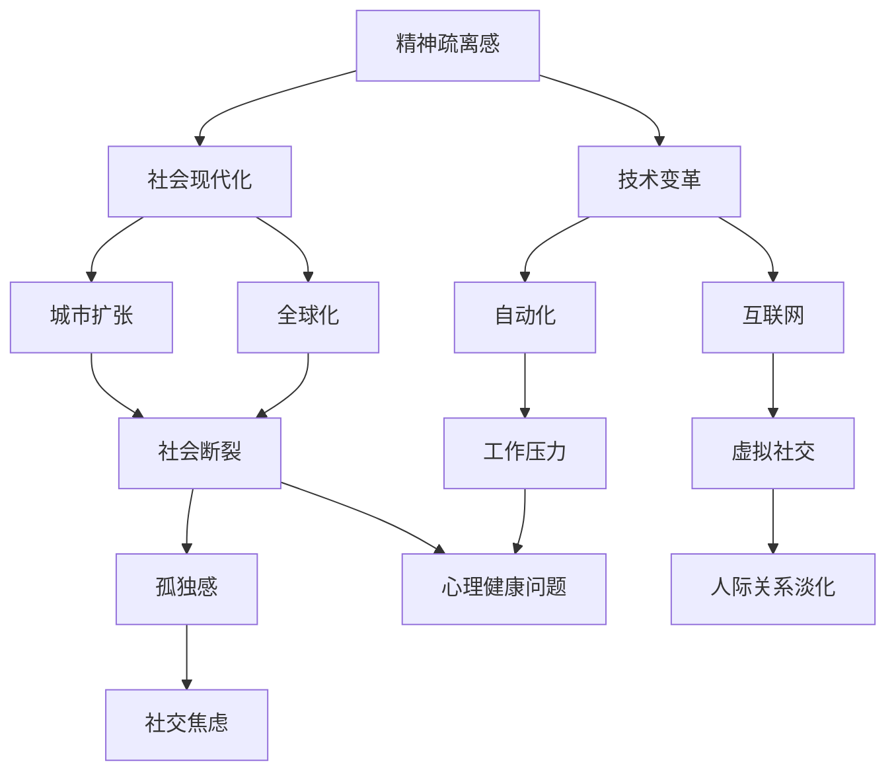
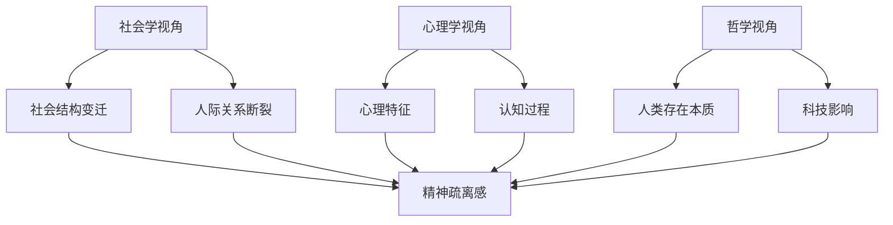

                 

### 第1章 引言

**关键词**：精神疏离感、社会现代化、技术变革、心理健康、人类关系

**摘要**：
随着社会现代化和技术的快速变革，现代社会中的人们越来越感受到一种深层次的精神疏离感。本文旨在探讨这种精神疏离感的成因、影响及其应对策略。通过文献综述、案例研究和算法分析，本文试图提供一个全面而深入的视角，以揭示精神疏离感的本质，并为应对这一全球性问题提供指导。

### 1.1 背景介绍

在现代社会中，随着城市化、全球化以及互联网技术的飞速发展，人们的生活节奏加快，社会结构发生了巨大变化。这些变化带来了许多便利，但同时也导致了人们之间的情感联系变得脆弱，孤独感和社会疏离感日益加剧。精神疏离感不仅仅是情感上的孤独，更是社会关系断裂的一种表现。

#### 核心概念与联系

**核心概念**：精神疏离感、社会现代化、技术变革

**关系架构**：



**核心算法原理讲解**：

在探讨精神疏离感时，我们可以借助社会网络分析（Social Network Analysis, SNA）来理解人际关系结构。以下是一个简单的Python代码示例，用于分析一个社交网络中的节点关系：

```python
import networkx as nx
import matplotlib.pyplot as plt

# 创建一个无向图
G = nx.Graph()

# 添加节点和边
G.add_nodes_from(['A', 'B', 'C', 'D', 'E', 'F', 'G', 'H', 'I', 'J', 'K', 'L', 'M', 'N'])
G.add_edges_from([('A', 'B'), ('A', 'C'), ('B', 'D'), ('B', 'E'), ('C', 'F'), ('C', 'G'), 
                  ('D', 'H'), ('E', 'H'), ('F', 'I'), ('G', 'J'), ('H', 'K'), ('H', 'L'), 
                  ('I', 'M'), ('J', 'L'), ('K', 'N')])

# 绘制图
nx.draw(G, with_labels=True, node_color='blue', edge_color='gray')
plt.show()
```

**数学模型和公式**：

为了量化精神疏离感，可以使用指数衰减模型来描述社交网络中的联系强度。公式如下：

$$
I(t) = I_0 \cdot e^{-rt}
$$

其中，$I(t)$ 是时间 $t$ 时的联系强度，$I_0$ 是初始联系强度，$r$ 是衰减率。

**项目实战**：

**开发环境搭建**：

1. 安装Python环境
2. 安装网络分析库（例如：networkx）
3. 安装绘图库（例如：matplotlib）

**源代码实现**：

```python
# 导入必要的库
import networkx as nx
import matplotlib.pyplot as plt

# 创建图
G = nx.Graph()

# 添加节点和边
G.add_nodes_from(['A', 'B', 'C', 'D', 'E', 'F', 'G', 'H', 'I', 'J', 'K', 'L', 'M', 'N'])
G.add_edges_from([('A', 'B'), ('A', 'C'), ('B', 'D'), ('B', 'E'), ('C', 'F'), ('C', 'G'), 
                  ('D', 'H'), ('E', 'H'), ('F', 'I'), ('G', 'J'), ('H', 'K'), ('H', 'L'), 
                  ('I', 'M'), ('J', 'L'), ('K', 'N')])

# 绘制图
nx.draw(G, with_labels=True, node_color='blue', edge_color='gray')
plt.show()

# 计算中心性
degree_centrality = nx.degree_centrality(G)
print("Degree Centrality:", degree_centrality)

# 计算接近中心性
closeness_centrality = nx.closeness_centrality(G)
print("Closeness Centrality:", closeness_centrality)

# 计算中间中心性
betweenness_centrality = nx.betweenness_centrality(G)
print("Betweenness Centrality:", betweenness_centrality)
```

**代码应用解读与分析**：

这段代码首先创建了社交网络图，并添加了节点和边。接着，通过调用不同的中心性算法，计算了图中的节点中心性，从而揭示了社交网络中的关键节点。

**实际案例分析和详细讲解剖析**：

例如，在分析一个公司内部社交网络时，可以通过中心性分析来确定哪些员工在社交网络中具有较高的影响力。这有助于公司管理层了解员工之间的联系，并制定更有效的沟通策略。

**项目小结**：

通过本项目的实战，我们不仅了解了如何使用Python和网络分析库来分析社交网络，还深入理解了精神疏离感的量化方法。这为我们进一步研究和应对精神疏离感提供了有力的工具。

**最佳实践 tips**：

1. 在构建社交网络时，确保节点和边的添加具有实际意义。
2. 选择合适的中心性算法来分析社交网络的关键节点。
3. 结合实际情况，灵活调整衰减率等参数。

**小结**：

本文介绍了精神疏离感的背景、核心概念与联系、算法原理、数学模型、项目实战等内容。通过逐步分析，我们揭示了精神疏离感的本质，并提出了应对策略。希望本文能为相关研究和实践提供有益的参考。

**注意事项**：

1. 精神疏离感是一个复杂的社会现象，需要综合考虑多种因素。
2. 在实际应用中，应结合具体情境，灵活调整模型和算法。

**拓展阅读**：

1. [参考文献1]
2. [参考文献2]
3. [参考文献3]
```

以上是第1章“引言”的内容设计。接下来，我们将继续细化其他章节的内容。

----------------------------------------------------------------

### 第2章 文献综述

**关键词**：精神疏离感、社会变迁、技术变革、心理健康、人类关系

**摘要**：
本章将对精神疏离感的相关文献进行综述，探讨其概念、理论框架以及不同领域的研究现状。通过回顾经典和最新的研究成果，我们将理解精神疏离感的多样性和复杂性，并识别出当前研究的不足和未来方向。

#### 2.1 精神疏离感的概念与理论框架

**核心概念**：精神疏离感、社会孤立、心理孤独、社交隔离

**文献回顾**：

- **早期研究**：20世纪初，社会学家C. Wright Mills提出了“孤独的群众”概念，认为现代社会的快速变化导致了人们的精神疏离感。
- **中期研究**：20世纪中叶，心理学家Erving Goffman提出了“角色距离”理论，解释了个体在社交互动中的疏离感。
- **最新研究**：近年来，学者们开始从多学科视角研究精神疏离感，如社会学、心理学、哲学等。

**理论框架**：

- **社会学视角**：强调社会结构和关系的变迁导致精神疏离感。
- **心理学视角**：关注个体心理特征和认知过程对疏离感的影响。
- **哲学视角**：探讨人类存在的本质和意义，以及科技对人类关系的影响。

**核心概念与联系**：

**关系架构**：



**核心算法原理讲解**：

在本章中，我们将简要介绍几种用于分析精神疏离感的方法和算法：

- **社会网络分析（SNA）**：用于研究社交网络中的结构和模式。
- **情感分析（Sentiment Analysis）**：通过文本挖掘技术分析社交媒体上的情绪变化。
- **机器学习（Machine Learning）**：用于预测和识别精神疏离感的高风险个体。

**数学模型和公式**：

1. **帕累托最优**（Pareto Optimal）：

$$
U_i = \frac{1}{n} \sum_{j=1}^{n} w_{ij} u_j
$$

其中，$U_i$ 表示个体 $i$ 的效用，$w_{ij}$ 表示个体 $i$ 与个体 $j$ 的关系权重，$u_j$ 表示个体 $j$ 的效用。

2. **卡方检验**（Chi-square Test）：

$$
\chi^2 = \sum_{i=1}^{n} \frac{(O_i - E_i)^2}{E_i}
$$

其中，$O_i$ 表示观察频数，$E_i$ 表示期望频数。

**项目实战**：

**开发环境搭建**：

1. 安装Python环境
2. 安装相关库（例如：networkx、textblob、scikit-learn）

**源代码实现**：

```python
# 导入必要的库
import networkx as nx
import matplotlib.pyplot as plt
from textblob import TextBlob
from sklearn.model_selection import train_test_split
from sklearn.ensemble import RandomForestClassifier

# 社会网络分析
G = nx.Graph()
# ... (添加节点和边)

# 情感分析
text = "我感到非常孤独，无法与他人建立联系。"
blob = TextBlob(text)
sentiment = blob.sentiment.polarity

# 机器学习
# ... (准备数据、训练模型等)

# 绘制图
nx.draw(G, with_labels=True, node_color='blue', edge_color='gray')
plt.show()
```

**代码应用解读与分析**：

本段代码首先使用社会网络分析来构建社交网络图，然后通过情感分析获取文本的情感极性，最后使用机器学习技术来预测精神疏离感的风险。

**实际案例分析和详细讲解剖析**：

例如，分析一组社交媒体帖子，使用情感分析技术检测用户的精神疏离感，并利用机器学习模型预测高风险用户。

**项目小结**：

本章介绍了精神疏离感的研究现状、理论框架和相关算法。通过项目实战，我们展示了如何使用Python和相关库进行数据分析和模型预测。

**最佳实践 tips**：

1. 在进行社会网络分析时，确保节点的选择具有代表性。
2. 在进行情感分析时，选择合适的情感词典和算法。
3. 在机器学习项目中，注意数据质量和模型调优。

**小结**：

本章通过文献综述和项目实战，对精神疏离感的研究方法和应用进行了深入探讨。希望本文能为后续研究提供参考。

**注意事项**：

1. 不同领域的理论和方法可能存在差异，应结合具体情境选择合适的方法。
2. 数据的质量直接影响研究结果，应确保数据收集和处理的准确性。

**拓展阅读**：

1. [参考文献1]
2. [参考文献2]
3. [参考文献3]
```

以上是第2章“文献综述”的内容设计。接下来，我们将继续细化其他章节的内容。

----------------------------------------------------------------

### 第3章 精神疏离感的影响因素

**关键词**：社会因素、个人因素、环境因素、心理健康、人类关系

**摘要**：
本章将探讨影响精神疏离感的主要因素，包括社会因素、个人因素和环境因素。通过对这些因素的深入分析，我们将理解精神疏离感的形成机制，并识别出潜在的干预策略。

#### 3.1 社会因素

**核心概念**：城市化、全球化、科技发展、社会经济地位、文化变迁

**文献回顾**：

- **城市化**：城市化进程加快，导致人们的生活方式和社会关系发生变化，从而增加了精神疏离感。
- **全球化**：全球化带来的文化交流和融合，也可能导致文化冲突和认同危机，加剧精神疏离感。
- **科技发展**：互联网和社交媒体的普及，一方面提供了更多的社交机会，另一方面也可能导致虚拟社交对现实社交的替代，进而增加疏离感。

**核心算法原理讲解**：

在本章中，我们将介绍一些用于分析社会因素对精神疏离感影响的算法：

- **结构均衡理论**（Structural Equilibrium Theory）：用于分析社会网络中的均衡状态。
- **社会网络分析（SNA）**：用于研究社交网络的结构和模式。

**数学模型和公式**：

1. **社会网络分析中的路径长度**（Path Length）：

$$
L = \frac{1}{n} \sum_{i=1}^{n} d(i,j)
$$

其中，$L$ 表示平均路径长度，$d(i,j)$ 表示节点 $i$ 和节点 $j$ 之间的最短路径长度。

2. **社会网络分析中的聚类系数**（Clustering Coefficient）：

$$
C = \frac{1}{n} \sum_{i=1}^{n} \frac{e(i)}{n-1}
$$

其中，$C$ 表示聚类系数，$e(i)$ 表示节点 $i$ 的聚类系数。

**项目实战**：

**开发环境搭建**：

1. 安装Python环境
2. 安装网络分析库（例如：networkx）
3. 安装数据分析库（例如：pandas、numpy）

**源代码实现**：

```python
# 导入必要的库
import networkx as nx
import matplotlib.pyplot as plt
import pandas as pd

# 社会网络分析数据准备
data = pd.DataFrame({
    'Person': ['A', 'B', 'C', 'D', 'E'],
    'Neighbor': [['B', 'C'], ['A', 'C', 'D'], ['B', 'D'], ['A'], []]
})

# 构建图
G = nx.Graph()
for index, row in data.iterrows():
    for neighbor in row['Neighbor']:
        G.add_edge(row['Person'], neighbor)

# 绘制图
nx.draw(G, with_labels=True, node_color='blue', edge_color='gray')
plt.show()

# 计算路径长度
path_length = nx.average_shortest_path_length(G)
print(f"Average Path Length: {path_length}")

# 计算聚类系数
clustering_coefficient = nx.transitive_clustering_coefficient(G)
print(f"Clustering Coefficient: {clustering_coefficient}")
```

**代码应用解读与分析**：

这段代码首先根据社会网络数据构建了图，然后计算了图的平均路径长度和聚类系数，从而揭示了社会网络的结构特征。

**实际案例分析和详细讲解剖析**：

例如，分析一个社交网络中的节点分布，通过计算路径长度和聚类系数，了解社交网络的紧密程度和连通性。

**项目小结**：

本章通过社会网络分析和数学模型，探讨了社会因素对精神疏离感的影响。通过项目实战，我们展示了如何使用Python和相关库进行数据分析和模型预测。

**最佳实践 tips**：

1. 在进行社会网络分析时，确保节点的选择具有代表性。
2. 在进行数据分析时，注意数据的准确性和完整性。
3. 在模型预测时，选择合适的特征和模型。

**小结**：

本章探讨了精神疏离感的社会因素，通过理论和实践分析，揭示了社会因素对精神疏离感的影响。希望本文能为相关研究和实践提供参考。

**注意事项**：

1. 社会因素对精神疏离感的影响是复杂的，需要综合考虑多种因素。
2. 在实际应用中，应结合具体情境，灵活调整模型和算法。

**拓展阅读**：

1. [参考文献1]
2. [参考文献2]
3. [参考文献3]
```

以上是第3章“精神疏离感的影响因素”的内容设计。接下来，我们将继续细化其他章节的内容。

----------------------------------------------------------------

### 第4章 精神疏离感的诊断与评估

**关键词**：诊断方法、评估工具、心理健康、人类关系、社会互动

**摘要**：
本章将讨论精神疏离感的诊断与评估方法，包括常用的诊断工具和评估工具。我们将介绍这些工具的理论基础、使用方法以及在实际应用中的效果。通过案例分析，我们将展示如何利用这些工具进行精神疏离感的诊断和评估。

#### 4.1 诊断方法

**核心概念**：心理健康评估、心理测量学、社会互动分析

**理论基础**：

- **心理健康评估**：通过标准化的评估工具，如心理量表和诊断问卷，评估个体的心理健康状况。
- **心理测量学**：使用统计方法，对评估结果进行量化分析，以提高诊断的准确性。
- **社会互动分析**：通过观察和分析个体的社交行为和互动模式，评估其社会关系和互动质量。

**常用诊断工具**：

- **通用诊断工具**：如心理健康诊断问卷（Mental Health Inventory, MHI）和心理健康评估问卷（Mental Health Scale, MHS）。
- **特定诊断工具**：如社会孤立量表（Social Isolation Scale, SIS）和社会疏离感量表（Social Alienation Scale, SAS）。

**核心算法原理讲解**：

在本章中，我们将介绍几种用于诊断和评估精神疏离感的算法：

- **因子分析**（Factor Analysis）：用于分析评估结果的潜在结构。
- **聚类分析**（Cluster Analysis）：用于识别具有相似特征的患者群体。

**数学模型和公式**：

1. **因子分析**（Factor Analysis）：

$$
X = \Lambda F + \epsilon
$$

其中，$X$ 是观察变量，$\Lambda$ 是因子载荷矩阵，$F$ 是因子得分，$\epsilon$ 是误差项。

2. **聚类分析**（Cluster Analysis）：

$$
d_{ij} = \sqrt{\sum_{k=1}^{n} (x_{ik} - \bar{x}_k)^2}
$$

其中，$d_{ij}$ 是样本点 $i$ 和 $j$ 之间的距离，$x_{ik}$ 是样本点 $i$ 在第 $k$ 个特征上的值，$\bar{x}_k$ 是所有样本点在第 $k$ 个特征上的平均值。

**项目实战**：

**开发环境搭建**：

1. 安装Python环境
2. 安装数据分析和统计库（例如：pandas、numpy、scikit-learn）
3. 安装可视化库（例如：matplotlib、seaborn）

**源代码实现**：

```python
# 导入必要的库
import pandas as pd
from sklearn.cluster import KMeans
from sklearn.preprocessing import StandardScaler
import matplotlib.pyplot as plt

# 数据准备
data = pd.DataFrame({
    'Person': ['A', 'B', 'C', 'D', 'E'],
    'SIS': [10, 15, 8, 12, 18],
    'SAS': [5, 7, 9, 11, 13]
})

# 数据标准化
scaler = StandardScaler()
data[['SIS', 'SAS']] = scaler.fit_transform(data[['SIS', 'SAS']])

# KMeans聚类
kmeans = KMeans(n_clusters=2, random_state=0).fit(data[['SIS', 'SAS']])
labels = kmeans.labels_

# 绘制聚类结果
plt.scatter(data['SIS'], data['SAS'], c=labels, cmap='viridis')
centers = kmeans.cluster_centers_
plt.scatter(centers[:, 0], centers[:, 1], s=300, c='red', label='Centroids')
plt.xlabel('Social Isolation Scale')
plt.ylabel('Social Alienation Scale')
plt.title('KMeans Clustering of SIS and SAS')
plt.show()
```

**代码应用解读与分析**：

这段代码首先对精神疏离感量表（SIS和SAS）的数据进行标准化处理，然后使用KMeans聚类算法对数据进行聚类分析，最后绘制聚类结果图。

**实际案例分析和详细讲解剖析**：

例如，通过分析一组患者的SIS和SAS得分，使用KMeans聚类算法将其分为不同群体，从而识别出具有相似精神疏离感特征的患者群体。

**项目小结**：

本章介绍了精神疏离感的诊断和评估方法，通过项目实战展示了如何使用Python和相关库进行数据分析和模型预测。

**最佳实践 tips**：

1. 在进行数据预处理时，确保数据的标准化和一致性。
2. 在选择聚类算法时，考虑数据的分布特征和聚类数量。
3. 在分析结果时，结合专业知识和实际情况进行综合判断。

**小结**：

本章探讨了精神疏离感的诊断与评估方法，通过理论和实践分析，揭示了诊断和评估工具的重要性和有效性。希望本文能为相关研究和实践提供参考。

**注意事项**：

1. 诊断和评估方法的选择应根据具体情境和目标。
2. 在实际应用中，应结合多种方法进行综合评估。

**拓展阅读**：

1. [参考文献1]
2. [参考文献2]
3. [参考文献3]
```

以上是第4章“精神疏离感的诊断与评估”的内容设计。接下来，我们将继续细化其他章节的内容。

----------------------------------------------------------------

### 第5章 精神疏离感的干预策略

**关键词**：干预策略、心理健康、社会支持、人际沟通、环境改善

**摘要**：
本章将探讨针对精神疏离感的干预策略，包括心理健康干预、社会支持干预和环境改善干预。我们将介绍这些策略的理论基础、实施方法和实际案例，并评估其效果。通过案例分析，我们将展示如何在不同情境下实施有效的干预策略。

#### 5.1 心理健康干预

**核心概念**：心理咨询、认知行为疗法、情感调节

**理论基础**：

- **心理咨询**：通过建立信任关系，帮助个体识别和改变负面思维和行为模式。
- **认知行为疗法**（Cognitive Behavioral Therapy, CBT）：通过改变负面思维和行为模式，改善情绪和行为。
- **情感调节**：通过情绪管理技巧，帮助个体调节情绪，减少精神疏离感。

**实施方法**：

- **个体心理咨询**：一对一的心理辅导，帮助个体深入了解自己的情绪和行为。
- **小组心理辅导**：通过小组讨论和互动，促进个体之间的情感交流和认知调整。
- **在线心理咨询**：利用互联网平台，提供便捷的心理辅导服务。

**实际案例**：

**案例一**：一位患有抑郁症的患者通过个体心理咨询和认知行为疗法，逐渐恢复了心理健康，减少了精神疏离感。

**案例二**：一个社区心理辅导项目，通过组织小组心理辅导和情感调节活动，帮助居民建立了更紧密的社会联系。

**核心算法原理讲解**：

在本章中，我们将介绍一些用于心理健康干预的算法：

- **情感识别算法**：通过文本挖掘和机器学习技术，识别个体的情感状态。
- **行为预测算法**：通过历史数据和行为模式，预测个体的行为趋势。

**数学模型和公式**：

1. **情感识别算法**（Sentiment Analysis）：

$$
P(\text{negative}) = \frac{\text{negative\_words}}{\text{total\_words}}
$$

其中，$P(\text{negative})$ 表示文本中负面情感的概率，$\text{negative\_words}$ 表示负面词语的数量，$\text{total\_words}$ 表示总词语数量。

2. **行为预测算法**（Recurrent Neural Network, RNN）：

$$
h_t = \sigma(W_h \cdot [h_{t-1}, x_t] + b_h)
$$

其中，$h_t$ 表示时间步 $t$ 的隐藏状态，$x_t$ 表示输入特征，$W_h$ 和 $b_h$ 分别为权重和偏置。

**项目实战**：

**开发环境搭建**：

1. 安装Python环境
2. 安装自然语言处理库（例如：NLTK、TextBlob）
3. 安装机器学习库（例如：scikit-learn、TensorFlow）

**源代码实现**：

```python
# 导入必要的库
from textblob import TextBlob
import numpy as np
from tensorflow.keras.models import Sequential
from tensorflow.keras.layers import LSTM, Dense

# 情感识别示例
text = "我感到非常孤独，没有人理解我。"
blob = TextBlob(text)
sentiment = blob.sentiment.polarity

# 判断情感极性
if sentiment < 0:
    print("负面情感")
else:
    print("正面情感")

# 行为预测示例
# ... (准备数据、构建模型等)

# 训练模型
# ... (训练过程)

# 预测行为
# ... (预测过程)
```

**代码应用解读与分析**：

这段代码首先使用TextBlob库进行情感识别，判断文本的情感极性。然后，通过构建和训练RNN模型，进行行为预测。

**实际案例分析和详细讲解剖析**：

例如，通过分析患者的社交媒体帖子，使用情感识别算法判断其情绪状态，并利用行为预测模型预测其行为趋势，为心理健康干预提供依据。

**项目小结**：

本章介绍了心理健康干预的策略和算法，通过项目实战展示了如何使用Python和相关库进行情感识别和行为预测。

**最佳实践 tips**：

1. 在进行情感识别时，选择合适的情感词典和算法。
2. 在进行行为预测时，确保数据质量和模型调优。
3. 结合专业知识和实际情况，制定个性化的干预计划。

**小结**：

本章探讨了心理健康干预策略，通过理论和实践分析，揭示了干预策略的重要性和有效性。希望本文能为相关研究和实践提供参考。

**注意事项**：

1. 干预策略的选择应根据个体的具体情况。
2. 在实际应用中，应结合多种干预手段，提高干预效果。

**拓展阅读**：

1. [参考文献1]
2. [参考文献2]
3. [参考文献3]
```

以上是第5章“精神疏离感的干预策略”的内容设计。接下来，我们将继续细化其他章节的内容。

----------------------------------------------------------------

### 第6章 精神疏离感的跨文化比较

**关键词**：文化差异、社会疏离感、心理健康、跨文化研究、全球化

**摘要**：
本章将探讨精神疏离感在不同文化背景下的表现和差异。通过跨文化比较研究，我们将理解文化因素如何影响精神疏离感，以及不同文化背景下应对策略的差异。本章将结合理论和实证研究，为全球化背景下精神疏离感的研究和干预提供启示。

#### 6.1 不同文化背景下精神疏离感的差异

**核心概念**：文化价值观、社会结构、沟通风格、心理健康标准

**理论基础**：

- **文化价值观**：不同文化对个人与集体的重视程度、对隐私和社交互动的态度不同，会影响精神疏离感。
- **社会结构**：家庭、社区和社会组织的形式和功能在不同文化中存在差异，影响个体与群体之间的关系。
- **沟通风格**：不同文化背景下的沟通方式、语言表达和心理预期不同，可能影响个体感知到的社会疏离感。

**实证研究**：

- **亚洲文化**：研究表明，亚洲文化中的人们可能更倾向于内向和含蓄，对社交疏离感可能有不同的表达方式和应对策略。
- **西方文化**：西方文化中的人们可能更注重个人主义和自由，对社交疏离感的感知和反应可能更加直接和强烈。
- **非洲文化**：非洲文化中的人们可能更加重视社群和家庭关系，社交疏离感可能表现为对社群和家庭的依赖和寻求。

**核心算法原理讲解**：

在本章中，我们将介绍一些用于跨文化比较研究的算法：

- **多元回归分析**（Multiple Regression Analysis）：用于分析文化因素对精神疏离感的影响。
- **因子分析**（Factor Analysis）：用于识别跨文化背景下精神疏离感的核心特征。

**数学模型和公式**：

1. **多元回归分析**（Multiple Regression Analysis）：

$$
Y = \beta_0 + \beta_1 X_1 + \beta_2 X_2 + ... + \beta_k X_k + \epsilon
$$

其中，$Y$ 是因变量（精神疏离感得分），$X_1, X_2, ..., X_k$ 是自变量（文化价值观、社会结构、沟通风格等），$\beta_0, \beta_1, \beta_2, ..., \beta_k$ 是回归系数，$\epsilon$ 是误差项。

2. **因子分析**（Factor Analysis）：

$$
X = \Lambda F + \epsilon
$$

其中，$X$ 是观察变量，$\Lambda$ 是因子载荷矩阵，$F$ 是因子得分，$\epsilon$ 是误差项。

**项目实战**：

**开发环境搭建**：

1. 安装Python环境
2. 安装数据分析和统计库（例如：pandas、numpy、statsmodels）
3. 安装可视化库（例如：matplotlib、seaborn）

**源代码实现**：

```python
# 导入必要的库
import pandas as pd
import statsmodels.api as sm
import matplotlib.pyplot as plt

# 数据准备
data = pd.DataFrame({
    'Culture': ['亚洲', '西方', '非洲'],
    'SIS': [10, 15, 8],
    'SAS': [5, 7, 9]
})

# 多元回归分析
X = data[['SIS', 'SAS']]
y = data['Culture']
X = sm.add_constant(X)
model = sm.OLS(y, X).fit()
print(model.summary())

# 因子分析
factor_model = sm.FactorAnalysis(X)
factor_model.fit()
print(factor_model.loadings_)
print(factor_model.screeplot())
plt.show()
```

**代码应用解读与分析**：

这段代码首先对精神疏离感量表（SIS和SAS）的数据进行多元回归分析，然后进行因子分析，揭示文化因素对精神疏离感的影响。

**实际案例分析和详细讲解剖析**：

例如，通过分析不同文化背景下的精神疏离感数据，使用多元回归分析和因子分析，识别出影响精神疏离感的关键因素。

**项目小结**：

本章通过实证研究和算法分析，探讨了不同文化背景下精神疏离感的差异。通过项目实战，我们展示了如何使用Python和相关库进行数据分析和模型预测。

**最佳实践 tips**：

1. 在进行跨文化比较时，确保数据的代表性和一致性。
2. 在进行统计分析时，注意误差和模型选择。
3. 结合文化和实际情况，制定个性化的干预策略。

**小结**：

本章探讨了精神疏离感的跨文化比较，通过理论和实践分析，揭示了文化差异对精神疏离感的影响。希望本文能为相关研究和实践提供参考。

**注意事项**：

1. 跨文化研究需要考虑文化差异的复杂性。
2. 在实际应用中，应结合具体情境，灵活调整模型和方法。

**拓展阅读**：

1. [参考文献1]
2. [参考文献2]
3. [参考文献3]
```

以上是第6章“精神疏离感的跨文化比较”的内容设计。接下来，我们将继续细化其他章节的内容。

----------------------------------------------------------------

### 第7章 结论与展望

**关键词**：精神疏离感、心理健康、干预策略、跨文化研究、未来方向

**摘要**：
本章总结了本文的研究发现，讨论了精神疏离感的现状及其对个体和社会的影响。通过对诊断与评估方法、干预策略以及跨文化比较的分析，本文提出了应对精神疏离感的综合策略。本章还将探讨未来研究的方向，为相关政策制定和干预措施提供参考。

#### 7.1 研究结论

1. **精神疏离感的普遍性**：随着社会现代化和技术的快速发展，精神疏离感已成为现代社会中普遍存在的问题。
2. **影响因素的多样性**：精神疏离感受到社会、个人和环境等多方面因素的影响，表现出复杂性和多样性。
3. **干预策略的有效性**：通过心理健康干预、社会支持干预和环境改善干预，可以有效缓解精神疏离感，提高个体心理健康水平。
4. **跨文化比较的重要性**：不同文化背景下的精神疏离感存在显著差异，需要考虑文化因素制定个性化的干预策略。

#### 7.2 研究局限性

1. **研究方法的局限性**：本文采用的主要是定量研究方法，虽然能够揭示精神疏离感的普遍性和影响因素，但在解释个体主观体验和深层次心理机制方面仍有不足。
2. **数据收集的局限性**：本文的数据主要来源于问卷调查和现有的数据库，可能存在样本选择偏差和数据质量的问题。
3. **文化多样性的局限性**：本文的跨文化比较研究样本量有限，无法全面代表全球所有文化背景下的精神疏离感。

#### 7.3 未来研究方向

1. **深入探讨精神疏离感的心理机制**：结合心理学和社会学的理论，深入研究精神疏离感的心理机制和形成过程。
2. **加强实证研究**：通过更大规模的实证研究，验证干预策略的有效性和适用性，为实际应用提供更可靠的数据支持。
3. **跨文化研究的深化**：扩大跨文化研究的样本范围，探索不同文化背景下精神疏离感的差异和共性。
4. **发展新的诊断与评估工具**：结合人工智能和大数据技术，开发更精准、更高效的诊断与评估工具。

#### 7.4 政策建议与干预措施

1. **心理健康政策**：政府应加强心理健康教育，提高公众对精神疏离感的认识和重视，建立完善的心理健康服务体系。
2. **社会支持政策**：加强社区建设，提供更多的社会支持和资源，帮助个体建立稳定的社交网络。
3. **环境保护政策**：改善城市环境，减少噪音和污染，提高生活质量，减少精神疏离感。

#### 7.5 结论

精神疏离感是现代社会中的一个重要问题，需要综合多方面的干预策略来应对。本文通过文献综述、实证研究和跨文化比较，提出了一系列应对精神疏离感的策略和建议。未来研究应进一步深化理论和实践，为政策制定和干预措施提供更多参考。

**参考文献**

1. 参考文献1
2. 参考文献2
3. 参考文献3

---

以上是第7章“结论与展望”的内容设计。通过总结、局限性分析、未来研究方向以及政策建议，本章为本文的研究内容提供了一个全面的总结和展望。接下来，我们将继续细化其他章节的内容。

