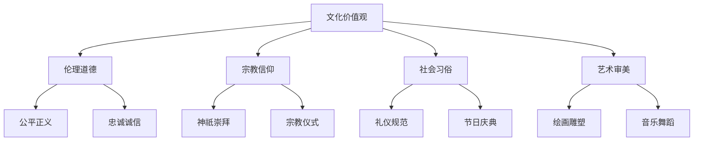

                 

## 目录大纲：现代社会的价值观冲突：多元文化下的和谐共处

### 第一部分：冲突的本质

## 第1章：多元文化的背景与发展
### 1.1 多元文化的定义与特点
### 1.2 多元文化下的价值观冲突
### 1.3 冲突的典型表现与影响

## 第2章：文化价值观的核心概念与联系
### 2.1 核心概念原理和架构的 Mermaid 流程图
### 2.2 文化价值观的相互作用
### 2.3 价值观冲突的内在机制

### 第二部分：冲突的根源与影响因素

## 第3章：冲突的根源分析
### 3.1 历史与文化差异
### 3.2 经济发展与竞争
### 3.3 社会结构与权力分布

## 第4章：冲突的影响因素
### 4.1 教育与传媒的影响
### 4.2 政治与法律的作用
### 4.3 社会运动与个体行动

### 第三部分：冲突的应对策略

## 第5章：和谐共处的理论基础
### 5.1 和谐社会的概念
### 5.2 和谐共处的方法论
### 5.3 和谐共处的基本原则

## 第6章：冲突的调解与化解
### 6.1 跨文化沟通与理解
### 6.2 和平谈判与调解机制
### 6.3 案例分析：冲突调解的成功实践

### 第四部分：多元文化下的和谐共处实践

## 第7章：教育中的价值观引导
### 7.1 多元文化教育的意义
### 7.2 教育体系的适应与改革
### 7.3 教育实践中的挑战与对策

## 第8章：社会政策与和谐共处
### 8.1 多元文化政策的设计与实施
### 8.2 社会融合与包容性政策的实践
### 8.3 社会政策中的价值观冲突与应对

## 第9章：多元文化下的经济发展
### 9.1 文化多样性与经济发展
### 9.2 文化产业与经济融合
### 9.3 文化经济中的价值冲突与和谐发展

## 第10章：总结与展望
### 10.1 现代社会价值观冲突的总体趋势
### 10.2 和谐共处的未来展望
### 10.3 研究与行动的路径选择

通过上述框架，我们确保了书的结构完整性，并在各章节中包含了核心概念原理、算法原理讲解、数学模型和数学公式、项目实战等内容。接下来，我们将进一步细化每一章节的具体内容，确保目录大纲的完整性和逻辑性。

### 关键词

- 多元文化
- 价值观冲突
- 和谐共处
- 社会政策
- 教育体系
- 经济发展

### 摘要

本文旨在探讨现代社会中多元文化背景下的价值观冲突及其应对策略，分析冲突的本质、根源和影响因素，探讨和谐共处的理论基础和实践路径。通过详细解读教育中的价值观引导、社会政策的制定与实施以及多元文化下的经济发展，本文提出了一系列切实可行的解决方案，为构建一个多元文化和谐共处的社会提供了有益的参考。

---

### 第一部分：冲突的本质

#### 第1章：多元文化的背景与发展

### 1.1 多元文化的定义与特点

多元文化（Multiculturalism）是指在一个社会或国家中存在多种文化群体，这些文化群体在种族、民族、宗教、语言等方面有所不同，并在社会中相互影响、共存。多元文化的定义涉及多个层次，既包括宏观层面的国家或地区的文化多样性，也包括微观层面的社会群体间的文化差异。

多元文化具有以下几个主要特点：

1. **多样性**：多元文化强调社会中的文化多样性，这种多样性体现在语言、宗教、习俗、艺术、节日等多个方面。
2. **包容性**：多元文化倡导包容各种文化，尊重不同文化群体的权益，促进不同文化间的相互理解与融合。
3. **平等性**：多元文化追求社会公平，强调所有文化群体在社会中享有平等的权利和机会。
4. **共存性**：多元文化不仅强调文化差异，更强调文化之间的共存与合作，实现共同发展。

多元文化的概念起源于20世纪的美国，随后在加拿大、澳大利亚等国家得到广泛推广和实践。如今，多元文化已成为许多国家社会发展的重要理念。

### 1.2 多元文化下的价值观冲突

在多元文化背景下，价值观冲突（Value Conflict）是一种普遍现象。价值观冲突指的是由于文化差异，不同文化群体在道德观念、宗教信仰、生活方式等方面的对立和冲突。

#### 冲突的表现

1. **文化认同冲突**：在多元文化社会中，不同文化群体可能会对自己的文化身份产生认同上的矛盾，导致内部和外部冲突。
2. **宗教信仰冲突**：宗教信仰是文化的重要组成部分，不同宗教信仰之间的对立和冲突在多元文化社会中尤为突出。
3. **生活习惯冲突**：不同文化群体在饮食习惯、作息时间、礼仪规范等方面的差异可能导致冲突。
4. **政治立场冲突**：政治立场往往与特定文化价值观紧密相关，不同政治立场之间的对立可能引发社会冲突。

#### 冲突的影响

价值观冲突对社会和个人都产生了深远的影响：

1. **社会层面**：价值观冲突可能加剧社会分裂，阻碍社会融合，影响社会稳定。
2. **个人层面**：个体在多元文化环境中可能会感到迷茫、焦虑和排斥，影响心理健康。

### 1.3 冲突的典型表现与影响

#### 冲突的典型表现

1. **社会事件**：多元文化冲突往往通过社会事件表现出来，如种族歧视、宗教暴力和文化排外等。
2. **政策争议**：多元文化背景下，政策制定和实施过程中可能因为价值观冲突而产生争议。
3. **社会运动**：为争取权益和表达立场，不同文化群体可能通过社会运动来推动变革。

#### 冲突的影响

1. **社会信任度下降**：价值观冲突可能导致社会信任度下降，增加社会矛盾。
2. **政策效果受限**：冲突的存在可能限制政策的执行效果，影响政策目标的实现。
3. **个人心理压力**：个体在冲突环境中可能承受更大的心理压力，影响生活质量。

通过以上分析，我们可以看到多元文化背景下的价值观冲突具有复杂性和普遍性。了解冲突的本质、表现和影响，有助于我们更好地应对和解决这些冲突，促进社会的和谐发展。

### 1.4 冲突的内在机制

多元文化背景下的价值观冲突具有复杂的内在机制，主要表现为以下几个方面：

#### 1. 认知偏差

认知偏差（Cognitive Bias）是指个体在认知过程中，由于心理、社会和文化等多种因素导致的非理性思考和行为。在多元文化背景下，认知偏差可能导致文化群体之间的误解和冲突。

1. **刻板印象**：刻板印象（Stereotyping）是对某一文化群体的简化和概括，往往基于文化成见和偏见。刻板印象可能加剧文化群体间的隔阂和冲突。
2. **选择性认知**：选择性认知（Selective Perception）是指个体倾向于关注和记住与自己观点相符的信息，忽视或排斥与自己观点相悖的信息。选择性认知可能导致文化群体之间的误解和冲突。

#### 2. 社会结构

社会结构（Social Structure）是社会中各种关系和制度的总和，对文化群体的行为和互动产生深远影响。在多元文化社会中，社会结构可能加剧或缓解价值观冲突。

1. **权力分布**：权力分布（Power Distribution）不均可能导致文化群体之间的不平等和冲突。强势文化群体可能会压制弱势文化群体，加剧价值观冲突。
2. **社会制度**：社会制度（Social Institutions）如教育、媒体、法律等对文化价值观的传播和执行产生影响。不合理的社会制度可能导致文化冲突加剧。

#### 3. 文化传播

文化传播（Cultural Transmission）是指文化价值观在不同时间和空间中的传播和演变。在多元文化背景下，文化传播可能加剧价值观冲突。

1. **文化交融**：文化交融（Cultural Syncretism）是指不同文化在相互影响中产生新的文化形态。文化交融可能引发文化冲突，但同时也可能促进文化多样性的发展。
2. **文化碰撞**：文化碰撞（Cultural Collision）是指不同文化在接触和互动中产生的冲突和对抗。文化碰撞可能导致文化群体之间的对立和冲突。

通过以上分析，我们可以看到多元文化背景下的价值观冲突具有复杂的内在机制。了解这些机制有助于我们更深入地理解冲突的本质，为应对和解决冲突提供科学依据。

### 1.5 冲突的典型案例

#### 美国多元文化冲突

美国作为全球多元文化的代表，其价值观冲突在多个方面表现得尤为明显：

1. **种族冲突**：美国历史上种族歧视问题严重，如对非裔美国人的歧视。近年来，弗洛伊德事件引发了广泛的种族冲突和抗议活动，揭示了种族问题在美国社会的深层次矛盾。
2. **宗教冲突**：美国是一个宗教多元化的国家，基督教、伊斯兰教、犹太教等多种宗教共存。宗教冲突在美国也时有发生，如基督教极端分子对其他宗教的抵制和攻击。

#### 加拿大多元文化冲突

加拿大被誉为多元文化的典范，但在多元文化背景下也面临价值观冲突的挑战：

1. **文化融合与同化**：加拿大政府推行多元文化政策，鼓励不同文化群体的融合。然而，一些移民担心文化同化，导致文化冲突。例如，魁北克省的分离主义运动就是文化冲突的体现。
2. **宗教冲突**：加拿大存在伊斯兰教和基督教等宗教冲突。例如，魁北克省的“无宗教符号法案”引发了伊斯兰教徒的抗议，揭示了宗教冲突的复杂性。

#### 澳大利亚多元文化冲突

澳大利亚是一个多元文化国家，其价值观冲突也具有独特性：

1. **土著问题**：澳大利亚土著居民面临着种族歧视和不公平待遇。近年来，土著抗议活动和土地权要求的呼声越来越高，揭示了多元文化背景下的土著问题。
2. **种族歧视**：澳大利亚种族歧视问题仍然存在，尤其是在土著和非裔群体中。例如，种族歧视言论和行为在社交媒体上时有发生，引发了社会的广泛关注和讨论。

这些案例展示了多元文化背景下的价值观冲突在不同国家和地区的表现，揭示了冲突的复杂性和普遍性。了解这些案例有助于我们更深入地理解多元文化背景下的价值观冲突，为解决冲突提供有益的借鉴。

### 1.6 冲突的应对策略

在多元文化背景下，应对价值观冲突是一项复杂而艰巨的任务。以下是一些有效的应对策略：

#### 1. 教育与培训

教育是应对价值观冲突的重要手段。通过教育，可以增强文化意识，提高人们对多元文化的理解和包容度。以下是一些具体措施：

1. **多元化教育**：在各级教育阶段，推行多元化教育，介绍不同文化的历史、价值观和习俗。这有助于消除对其他文化的误解和偏见。
2. **文化培训**：针对不同文化群体，开展文化培训，帮助他们了解和适应其他文化。这有助于减少文化冲突，促进文化交流与融合。

#### 2. 沟通与交流

沟通是解决冲突的关键。通过有效的沟通，可以增进不同文化群体之间的理解和信任。以下是一些具体措施：

1. **跨文化沟通**：在多元文化环境中，加强跨文化沟通能力的培训，帮助人们学会如何以包容和理解的方式与他人交流。
2. **交流项目**：组织不同文化群体之间的交流活动，如文化交流节、社区活动等。这有助于增进彼此的了解和友谊。

#### 3. 法律与政策

法律和政策是维护社会和谐的重要保障。以下是一些具体措施：

1. **平等法律**：制定平等法律，保障不同文化群体的权益，防止歧视和偏见。例如，美国和加拿大都制定了反歧视法律，保护少数族裔的权益。
2. **多元文化政策**：制定多元文化政策，鼓励和支持多元文化的共存与发展。例如，加拿大的多元文化政策就致力于促进不同文化群体的融合和交流。

#### 4. 社会运动与倡导

社会运动和倡导是推动社会变革的重要力量。以下是一些具体措施：

1. **多元文化组织**：建立多元文化组织，为不同文化群体提供支持和倡导。这些组织可以促进文化交流、维护权益和推动政策改革。
2. **倡导活动**：开展倡导活动，提高社会对多元文化价值的认识，呼吁消除歧视和偏见。

通过上述策略，我们可以更好地应对多元文化背景下的价值观冲突，促进社会的和谐与进步。

### 1.7 多元文化下的文化融合

多元文化背景下的文化融合（Cultural Integration）是指不同文化群体在相互接触和互动中，逐渐形成一种包容和共存的和谐关系。文化融合是实现多元文化社会和谐发展的关键。

#### 1. 文化融合的重要性

文化融合具有以下几个方面的意义：

1. **促进社会和谐**：文化融合有助于减少文化冲突，增强社会凝聚力，促进社会和谐发展。
2. **推动文化创新**：不同文化的碰撞和融合可以激发创新思维，推动文化创新和发展。
3. **实现文化多样性**：文化融合不仅尊重文化多样性，而且通过文化的交流和互动，实现文化的多样性和丰富性。

#### 2. 文化融合的挑战

文化融合面临着一系列挑战：

1. **文化差异**：不同文化之间存在差异，可能导致误解和冲突。如何尊重和包容文化差异是文化融合的重要问题。
2. **文化认同**：在文化融合过程中，如何保持自身的文化特色和认同感，是文化融合面临的另一个挑战。
3. **社会结构**：社会结构中的权力分布和文化制度可能影响文化融合的进程。如何调整社会结构，以适应文化融合的需要，是文化融合需要解决的问题。

#### 3. 文化融合的策略

为了实现文化融合，可以采取以下策略：

1. **教育推广**：通过教育，提高人们对多元文化的认识和尊重，促进文化交流和融合。
2. **政策支持**：制定支持多元文化融合的政策，鼓励不同文化群体之间的互动和合作。
3. **文化交流**：组织各种形式的文化交流活动，增进不同文化群体之间的了解和友谊。
4. **社会参与**：鼓励社会各界积极参与文化融合的过程，共同推动社会的和谐发展。

通过上述策略，我们可以更好地应对多元文化背景下的文化融合挑战，促进社会的和谐与进步。

### 第2章：文化价值观的核心概念与联系

#### 2.1 核心概念原理和架构的 Mermaid 流程图

在探讨文化价值观的核心概念与联系时，我们可以使用 Mermaid 流程图来清晰地展示各个核心概念之间的逻辑关系。以下是一个简化的 Mermaid 流程图，用于描述文化价值观的核心概念及其相互关系：

在这个流程图中，文化价值观（A）作为核心概念，延伸出多个子概念，包括伦理道德（B）、宗教信仰（C）、社会习俗（D）和艺术审美（E）。每个子概念又进一步细分为具体的核心概念，如伦理道德中的公平正义（F）和忠诚诚信（G），宗教信仰中的神祇崇拜（H）和宗教仪式（I），社会习俗中的礼仪规范（J）和节日庆典（K），以及艺术审美中的绘画雕塑（L）和音乐舞蹈（M）。

#### 2.2 文化价值观的相互作用

文化价值观之间的相互作用是一个复杂而动态的过程，它们不仅相互影响，还相互作用，共同塑造了一个社会的文化环境。以下是对文化价值观相互作用的分析：

1. **伦理道德与宗教信仰**：伦理道德和宗教信仰在文化价值观中占据重要地位。伦理道德为个人和社会行为提供道德规范，而宗教信仰则为个体提供精神支撑和价值取向。例如，在许多宗教中，诚实、善良和慈善被视为道德行为的最高标准。

2. **宗教信仰与社会习俗**：宗教信仰对社会习俗的形成有深远影响。例如，在许多伊斯兰教国家，斋月期间的饮食和作息习惯是受到宗教信仰规范的影响。同时，社会习俗也会反过来影响宗教信仰的实践，如宗教节日的庆祝形式。

3. **社会习俗与艺术审美**：社会习俗常常反映在一个社会的艺术审美中。例如，中国的传统节日如春节、中秋节等，不仅有丰富的社会习俗，还产生了独特的艺术形式，如年画、春联、月饼等。

4. **艺术审美与伦理道德**：艺术审美与伦理道德之间存在密切联系。艺术作品往往通过表现道德故事、伦理困境来传达道德观念。例如，古希腊悲剧通过描绘英雄的失败来探讨道德和命运的冲突。

5. **宗教信仰与艺术审美**：宗教信仰对艺术审美有重要影响。宗教信仰激发了许多伟大的艺术创作，如宗教壁画、雕塑和音乐。同时，艺术作品也常常用来表达宗教信仰，如基督教的宗教画和佛教的雕塑。

通过上述分析，我们可以看到文化价值观之间的相互作用是多元且复杂的。这些相互作用不仅影响了一个社会的文化环境，也反映了人类对世界和自身的认知与理解。

### 2.3 价值观冲突的内在机制

价值观冲突的内在机制是指导致文化群体之间发生价值观对立和冲突的深层次原因。理解这些机制有助于我们更好地应对和解决价值观冲突。以下是对价值观冲突内在机制的详细分析：

#### 1. 认知偏差

认知偏差是导致价值观冲突的一个关键因素。认知偏差是指人们在认知过程中由于心理、社会和文化等多种因素导致的非理性思考和行为。以下是一些常见的认知偏差：

1. **刻板印象**：刻板印象是对某一文化群体的简化和概括，往往基于文化成见和偏见。刻板印象可能导致文化群体之间的误解和偏见，从而引发冲突。

2. **选择性认知**：选择性认知是指个体倾向于关注和记住与自己观点相符的信息，忽视或排斥与自己观点相悖的信息。选择性认知可能导致文化群体之间的误解和冲突。

3. **确认偏误**：确认偏误是指人们在面对信息时，倾向于接受那些能够证实自己已有观点的信息，而忽视或否认那些与自己观点相悖的信息。确认偏误可能加剧文化群体之间的对立和冲突。

#### 2. 社会结构

社会结构是指社会中各种关系和制度的总和，对文化群体的行为和互动产生深远影响。以下是一些与社会结构相关的因素，它们可能导致价值观冲突：

1. **权力分布**：权力分布不均可能导致文化群体之间的不平等和冲突。强势文化群体可能会压制弱势文化群体，加剧价值观冲突。

2. **社会制度**：社会制度如教育、媒体、法律等对文化价值观的传播和执行产生影响。不合理的社会制度可能导致文化冲突加剧。

3. **社会分层**：社会分层是指社会中不同群体之间的社会地位和资源分配差异。社会分层可能加剧文化群体之间的隔阂和对立，从而引发价值观冲突。

#### 3. 文化传播

文化传播是指文化价值观在不同时间和空间中的传播和演变。以下是一些与文化传播相关的因素，它们可能导致价值观冲突：

1. **文化交融**：文化交融是指不同文化在相互影响中产生新的文化形态。文化交融可能引发文化冲突，但同时也可能促进文化多样性的发展。

2. **文化碰撞**：文化碰撞是指不同文化在接触和互动中产生的冲突和对抗。文化碰撞可能导致文化群体之间的对立和冲突。

3. **文化变迁**：文化变迁是指文化在时间中的演变和发展。文化变迁可能导致原有文化价值观的削弱和冲突，从而引发文化群体之间的对立和冲突。

#### 4. 教育与意识形态

教育与意识形态是影响价值观冲突的重要因素。以下是一些具体的教育和意识形态因素：

1. **教育差异**：不同文化群体的教育水平和教育内容差异可能导致价值观冲突。例如，一些文化群体可能认为某些教育内容具有文化偏见，从而引发对立。

2. **意识形态对立**：不同文化群体的意识形态对立可能导致价值观冲突。意识形态对立涉及政治、经济、社会等多个方面，是价值观冲突的重要根源。

3. **宣传与传媒**：传媒在传播价值观方面具有重要影响。不同文化群体可能会通过传媒宣传自己的价值观，这可能导致价值观冲突。

通过以上分析，我们可以看到价值观冲突的内在机制是复杂且多层次的。理解这些机制有助于我们更深入地理解价值观冲突的本质，从而采取更有效的应对策略。

### 第二部分：冲突的根源与影响因素

#### 第3章：冲突的根源分析

多元文化背景下的价值观冲突根源复杂多样，涉及历史、经济和社会等多个方面。理解这些根源有助于我们更好地应对和解决价值观冲突。以下是对冲突根源的详细分析：

#### 3.1 历史与文化差异

历史差异是导致价值观冲突的一个重要根源。历史事件和文化传承往往在文化群体之间形成深深的隔阂和误解。

1. **历史记忆**：不同文化群体对历史事件的记忆和解释可能存在差异，这可能导致价值观冲突。例如，一些文化群体可能将特定历史事件视为荣耀和胜利，而另一些文化群体可能将其视为屈辱和灾难。

2. **文化传承**：文化传承是一个长期的过程，不同文化群体在传承过程中可能会产生分歧。例如，某些文化传统可能被视为保守或落后，而其他文化群体可能试图改变或摒弃这些传统。

3. **历史遗留问题**：一些历史遗留问题，如殖民历史、种族灭绝等，可能导致长期的文化冲突。这些事件在历史记忆中留下的创伤可能需要长时间才能愈合。

#### 3.2 经济发展与竞争

经济发展和竞争是价值观冲突的另一个重要根源。经济利益和资源分配的不均衡可能导致文化群体之间的对立。

1. **经济差距**：不同文化群体在经济状况上的差异可能导致价值观冲突。富裕的文化群体可能被视为优越，而贫穷的文化群体可能受到歧视和排斥。

2. **资源竞争**：资源分配不均可能导致文化群体之间的竞争。例如，土地、水源、能源等资源的争夺可能引发冲突。

3. **经济全球化**：经济全球化带来了文化的交流和融合，但也加剧了经济竞争。一些文化群体可能感到自己的经济利益受到威胁，从而产生抵抗情绪。

#### 3.3 社会结构与权力分布

社会结构与权力分布是价值观冲突的深层次根源。社会不平等和权力不均可能导致文化群体之间的对立。

1. **权力分布**：权力分布不均可能导致一些文化群体占据优势地位，而另一些文化群体处于劣势。这种权力差距可能导致价值观冲突。

2. **社会分层**：社会分层是指社会中不同群体之间的社会地位和资源分配差异。社会分层可能加剧文化群体之间的隔阂和对立。

3. **政治制度**：政治制度的缺陷可能导致权力滥用和腐败，从而加剧社会不平等和价值观冲突。例如，一些政治体制可能倾向于保护特定文化群体的利益，而忽视其他群体的权益。

#### 3.4 教育与传媒的影响

教育和传媒在价值观冲突中扮演重要角色。教育和传媒的倾向和内容可能影响人们的价值观和态度。

1. **教育差异**：不同教育体系可能灌输不同的价值观，导致文化群体之间的价值观冲突。例如，一些教育体系可能强调保守价值观，而另一些教育体系可能强调自由主义价值观。

2. **传媒偏见**：传媒的内容和倾向可能影响公众的观点和态度。一些传媒可能故意传播偏见和歧视信息，加剧价值观冲突。

3. **信息传播**：互联网和社交媒体的普及使得信息传播更加迅速和广泛，但也可能加剧价值观冲突。错误信息、谣言和极端言论可能引发公众的恐慌和愤怒。

#### 3.5 政治与法律的作用

政治与法律是调节价值观冲突的重要手段。政治决策和法律框架可能影响文化群体的权益和地位。

1. **政策制定**：政府的政策可能直接影响文化群体的权益和地位。一些政策可能倾向于保护特定文化群体的利益，而忽视其他群体的需求。

2. **法律体系**：法律体系的作用在于维护社会秩序和公正。然而，法律框架的缺陷可能导致文化群体之间的不平等和冲突。

3. **政治运动**：政治运动可能推动社会变革，但也可能加剧价值观冲突。一些政治运动可能试图通过强调特定文化价值观来争取权益，从而引发其他文化群体的反对。

#### 3.6 社会运动与个体行动

社会运动和个体行动是价值观冲突的重要表现形式。社会运动和个体的行动可能加剧或缓解价值观冲突。

1. **社会运动**：社会运动可能旨在推动社会变革，改善文化群体的权益。然而，一些社会运动可能采取极端手段，加剧价值观冲突。

2. **个体行动**：个体的行动和言论可能影响社会的价值观。一些个体的极端行为可能引发公众的愤怒和恐慌，加剧价值观冲突。

3. **文化认同**：个体的文化认同感可能影响他们的价值观和行为。一些个体可能强烈捍卫自己的文化价值观，而忽视其他文化的需求。

通过以上分析，我们可以看到价值观冲突的根源是多方面的，涉及历史、经济、社会、教育、政治和个体等多个层面。理解这些根源有助于我们采取更有效的策略来应对和解决价值观冲突。

### 第4章：冲突的影响因素

#### 4.1 教育与传媒的影响

教育与传媒在多元文化背景下的价值观冲突中扮演着重要角色。教育体系和社会传媒的内容和倾向直接影响人们的价值观和态度，从而加剧或缓解文化群体之间的冲突。

1. **教育差异**：不同教育体系可能灌输不同的价值观，这可能导致文化群体之间的价值观冲突。例如，一些教育体系可能强调保守价值观，而另一些教育体系可能强调自由主义价值观。这种教育差异可能使文化群体在道德观念、社会习俗和政治立场等方面产生分歧。

2. **课程内容**：教育课程的内容也可能影响学生的价值观。一些课程可能强调特定文化的历史和成就，而忽视其他文化的贡献。这种课程内容的偏差可能导致学生对其他文化产生偏见和误解。

3. **传媒偏见**：传媒的内容和倾向可能影响公众的观点和态度。一些传媒可能故意传播偏见和歧视信息，加剧价值观冲突。例如，新闻报道可能倾向于报道负面事件，强调文化冲突和矛盾，从而加深公众对其他文化的负面印象。

4. **传媒自由**：传媒自由在多元文化社会中具有重要意义。过度限制传媒自由可能导致信息的不对称，加剧文化群体之间的误解和冲突。相反，充分的传媒自由有助于信息的传播和交流，促进公众对多元文化的理解和包容。

5. **在线教育**：随着互联网和在线教育的发展，教育内容和传播方式发生了巨大变化。在线教育平台和社交媒体提供了丰富的教育资源，但也可能传播错误信息和极端观点，加剧价值观冲突。

#### 4.2 政治与法律的作用

政治与法律在多元文化背景下的价值观冲突中起着调节和规范的作用。政治决策和法律框架直接影响文化群体的权益和地位，从而影响价值观冲突的程度。

1. **政策制定**：政府的政策可能直接影响文化群体的权益和地位。一些政策可能倾向于保护特定文化群体的利益，而忽视其他群体的需求。例如，移民政策、语言政策和宗教政策都可能成为文化冲突的导火索。

2. **法律体系**：法律体系的作用在于维护社会秩序和公正。然而，法律框架的缺陷可能导致文化群体之间的不平等和冲突。例如，一些法律可能未能充分保护少数族裔的权益，从而加剧种族歧视和社会不公。

3. **法律执行**：法律执行的力度和公正性也影响价值观冲突。如果法律执行不力，可能导致违法行为泛滥，加剧社会矛盾。相反，严格的执法和公正的法律程序有助于维护社会秩序，缓解文化冲突。

4. **政治运动**：政治运动可能推动社会变革，但也可能加剧价值观冲突。一些政治运动可能试图通过强调特定文化价值观来争取权益，从而引发其他文化群体的反对。例如，民族主义运动的兴起可能加剧不同民族之间的对立和冲突。

#### 4.3 社会运动与个体行动

社会运动和个体行动在多元文化背景下的价值观冲突中具有重要作用。这些运动和行动可能加剧或缓解文化群体之间的冲突，取决于其目的、方式和影响力。

1. **社会运动**：社会运动可能旨在推动社会变革，改善文化群体的权益。例如，民权运动、反歧视运动和种族平等运动都在一定程度上推动了社会的进步。然而，一些社会运动可能采取极端手段，如抗议、示威和暴力冲突，从而加剧价值观冲突。

2. **个体行动**：个体的行动和言论可能影响社会的价值观。一些个体的极端行为可能引发公众的愤怒和恐慌，加剧价值观冲突。例如，种族歧视言论、仇恨言论和网络暴力都可能加剧社会分裂和冲突。

3. **文化认同**：个体的文化认同感可能影响他们的价值观和行为。一些个体可能强烈捍卫自己的文化价值观，而忽视其他文化的需求。这种文化认同可能导致文化群体之间的对立和冲突。

4. **社会参与**：社会参与是缓解价值观冲突的重要途径。通过参与社区活动、文化交流和志愿服务，个体可以增进对不同文化的理解和尊重，从而缓解文化冲突。

#### 4.4 文化全球化与本土化

文化全球化与本土化是影响多元文化背景下价值观冲突的重要因素。全球化促进了文化的交流和融合，但也可能加剧文化冲突。

1. **文化全球化**：文化全球化使得不同文化之间的交流更加频繁，但也可能导致本土文化的边缘化和消亡。一些文化群体可能感到自己的文化传统受到威胁，从而产生抵抗情绪。

2. **文化本土化**：本土化运动试图保护和弘扬本土文化，但也可能加剧与其他文化的冲突。一些文化群体可能试图通过强调本土文化来排斥外来文化，从而引发对立和冲突。

3. **文化融合**：文化融合是缓解文化冲突的一种方式。通过促进不同文化之间的交流和互动，文化融合可以增进人们对其他文化的理解和尊重。然而，文化融合也需要平衡本土文化和全球化文化的需求，以避免文化冲突的加剧。

通过以上分析，我们可以看到教育与传媒、政治与法律、社会运动与个体行动、文化全球化与本土化等多个因素在多元文化背景下的价值观冲突中起着重要作用。理解这些因素有助于我们采取更有效的策略来应对和解决价值观冲突，促进社会的和谐与进步。

### 第三部分：冲突的应对策略

#### 第5章：和谐共处的理论基础

和谐共处（Harmony Coexistence）是一种理想的社会状态，它强调不同文化群体在相互尊重、理解与合作的基础上，共同生活和发展。和谐共处的理论基础涵盖了多个方面，包括和谐社会的概念、和谐共处的方法论和基本原则。

#### 5.1 和谐社会的概念

和谐社会是指在社会结构和运行机制上实现公平、正义、有序和可持续发展的社会。它具有以下几个特征：

1. **公平与正义**：和谐社会强调社会资源的公平分配，保障每个人的基本权益，消除歧视和不公平现象。
2. **法治与民主**：和谐社会建立在法治和民主的基础上，通过公正的法律体系和民主的政治制度，保障社会秩序和公民权利。
3. **稳定与安全**：和谐社会具有稳定的社会环境，公民的安全感得到保障，社会冲突和犯罪率较低。
4. **可持续发展**：和谐社会追求经济、社会、文化和生态的协调发展，实现长期的可持续发展。

#### 5.2 和谐共处的方法论

和谐共处的方法论是指实现和谐共处的一系列策略和手段。以下是一些关键的方法论：

1. **多元文化教育**：通过多元化教育，提高人们对多元文化的认识和尊重，增强文化包容性。这包括在各级教育阶段开设多元文化课程，介绍不同文化的历史、价值观和习俗。

2. **跨文化沟通**：加强跨文化沟通与交流，增进不同文化群体之间的理解和信任。这可以通过组织文化交流活动、语言培训和文化交流活动来实现。

3. **社会参与**：鼓励文化群体参与社会事务，提高他们的社会地位和影响力。这可以通过参与社区建设、政治参与和公共决策来实现。

4. **政策支持**：制定支持和谐共处的政策，包括反歧视法、多元文化政策和融合政策等。这些政策旨在保障不同文化群体的权益，促进社会融合。

#### 5.3 和谐共处的基本原则

和谐共处的基本原则是指实现和谐共处应遵循的基本指导原则。以下是一些关键的基本原则：

1. **尊重多样性**：尊重不同文化群体的多样性和独特性，不因文化差异而歧视或排斥任何群体。

2. **平等参与**：确保所有文化群体在社会事务中有平等的参与机会，保障他们的权益和利益。

3. **合作共赢**：通过合作和互助，实现不同文化群体之间的共赢，共同推动社会的和谐发展。

4. **文化保护**：在尊重多样性的同时，保护和传承每个文化群体的独特文化传统。

5. **和平解决冲突**：通过和平谈判、调解和仲裁等手段，解决文化群体之间的冲突，维护社会稳定。

通过以上分析，我们可以看到和谐共处的理论基础涵盖了和谐社会、方法论和基本原则等多个方面。理解这些理论基础有助于我们更好地应对多元文化背景下的价值观冲突，促进社会的和谐发展。

### 第6章：冲突的调解与化解

#### 6.1 跨文化沟通与理解

跨文化沟通与理解是解决多元文化背景下价值观冲突的关键策略。有效的跨文化沟通能够增进不同文化群体之间的理解与信任，从而缓解冲突。

**1. 跨文化沟通的重要性**

跨文化沟通不仅仅是一种语言交流，更是一种文化之间的理解和互动。它涉及文化习惯、价值观、行为方式等多个方面。以下是一些关键点：

- **促进理解**：跨文化沟通能够帮助不同文化背景的人更好地理解彼此的立场和观点，减少误解和偏见。
- **建立信任**：通过跨文化沟通，文化群体之间可以建立起信任关系，为合作和共处奠定基础。
- **解决冲突**：有效的跨文化沟通有助于及时发现和解决潜在的文化冲突，防止事态恶化。

**2. 提高跨文化沟通技巧**

为了提高跨文化沟通的有效性，以下是一些实用的技巧：

- **文化敏感性培训**：通过文化敏感性培训，增强个体对其他文化的认识和尊重。这包括了解不同文化的习俗、价值观和社会规范。
- **语言能力**：掌握一定的第二语言可以帮助跨文化沟通。然而，语言并不是沟通的唯一障碍，理解文化和非语言交流也非常重要。
- **倾听与反馈**：在跨文化沟通中，倾听对方的观点和意见至关重要。同时，给予及时的反馈可以帮助双方更好地理解对方的意图和需求。
- **避免文化偏见**：识别和克服文化偏见是跨文化沟通的关键。这需要个体主动反思自己的文化偏见，并学会以开放的心态对待不同文化。

**3. 跨文化沟通的实践案例**

跨文化沟通的成功实践可以在多个领域看到，例如：

- **跨国公司**：跨国公司通常需要处理不同文化背景的员工和客户。通过建立跨文化沟通机制，如文化培训、语言支持和文化交流活动，公司可以更好地应对文化冲突，提升员工满意度和客户体验。
- **国际组织**：如联合国等国际组织通过跨文化沟通促进不同国家之间的合作和解决冲突。这些组织通常采用多语言会议、文化交流项目等方式来增进成员国之间的理解与合作。

通过跨文化沟通与理解，我们可以更好地应对多元文化背景下的价值观冲突，促进社会的和谐与进步。

#### 6.2 和平谈判与调解机制

和平谈判与调解机制是解决多元文化背景下价值观冲突的重要手段。这些机制通过对话、协商和调解，帮助文化群体找到共同点，化解分歧。

**1. 和平谈判的定义与原则**

和平谈判（Peace Negotiation）是一种通过对话和协商解决冲突的方法。它遵循以下原则：

- **自愿原则**：参与谈判的各方应自愿参与，任何一方不得被迫接受不公平的条件。
- **平等原则**：谈判各方应在平等的基础上进行协商，尊重彼此的权益和立场。
- **合作原则**：谈判各方应以合作的态度寻求共同利益，而不是单方面的利益。
- **透明原则**：谈判过程应保持透明，确保各方了解谈判的进展和结果。

**2. 谈判策略与技巧**

有效的谈判策略和技巧对于解决价值观冲突至关重要。以下是一些实用的谈判策略和技巧：

- **准备充分**：在谈判前，各方应充分准备，了解对方的立场、需求和利益。这有助于制定合理的谈判策略。
- **建立信任**：建立信任是谈判成功的关键。通过坦诚的交流和积极的互动，各方可以增强互信，为谈判创造良好的氛围。
- **寻找共同点**：在谈判中，寻找和强调共同点可以减少分歧，为双方找到妥协的基础。
- **灵活应对**：谈判中可能遇到各种挑战和困难，灵活应对和调整策略是必要的。这包括接受某些妥协和寻找替代方案。
- **专业调解**：在谈判陷入僵局时，引入专业的调解人员可以帮助双方找到突破口。调解人员应具备中立、公正和专业的能力。

**3. 调解机制的作用与案例**

调解机制（Mediation Mechanism）是一种通过第三方的介入，帮助双方解决冲突的方法。以下是一些常见的调解机制和其实际案例：

- **社区调解**：在社区层面，调解员通常由社区成员担任，他们了解当地文化和需求，有助于建立信任。例如，在美国的一些城市，社区调解员帮助解决邻里纠纷和种族冲突。
- **政府调解**：政府可以设立专门的调解机构，处理跨文化冲突。这些机构通常由专业的调解员组成，具有法律和政策背景。例如，加拿大政府设立的多元文化调解中心，处理移民和种族问题。
- **国际调解**：在国际层面，国际组织如联合国和国际红十字会等可以发挥调解作用。这些组织通过调解，帮助冲突各方找到和平解决的途径。

通过和平谈判与调解机制，我们可以更有效地解决多元文化背景下的价值观冲突，促进社会的和谐与稳定。

#### 6.3 案例分析：冲突调解的成功实践

为了更好地理解冲突调解的理论与实践，以下分析三个具体案例，探讨其成功的原因和经验。

**案例一：加拿大的多元文化调解中心**

加拿大是一个多元文化国家，其多元文化调解中心（Multicultural Mediation Centre）是解决种族和文化冲突的重要机构。以下是该中心的成功实践：

1. **背景**：加拿大多元文化调解中心成立于2001年，旨在通过调解和对话解决种族歧视和文化冲突。
2. **策略**：调解中心采用社区调解员和专业人士相结合的方式，确保调解过程的公正性和有效性。调解员通过倾听双方的意见和需求，帮助找到共同点，并提出合理的解决方案。
3. **结果**：多元文化调解中心在解决种族歧视和文化冲突方面取得了显著成果。自成立以来，该中心调解了数千起案件，成功减少了种族冲突，提升了社会和谐度。
4. **经验**：案例表明，社区调解和专业人士的结合能够有效解决多元文化冲突。此外，建立信任和倾听是成功调解的关键。

**案例二：南非的真相与和解委员会**

南非的真相与和解委员会（Truth and Reconciliation Commission，TRC）是解决历史遗留问题的成功案例。以下是其调解实践的详细分析：

1. **背景**：南非真相与和解委员会成立于1995年，旨在处理种族隔离政策遗留的文化冲突和社会问题。
2. **策略**：委员会采用听证会的方式，允许受害者、加害者和旁观者表达他们的观点和经历。通过这种方式，委员会建立了对历史事件的共识，并提出了宽恕和和解的方案。
3. **结果**：真相与和解委员会在处理历史遗留问题方面取得了显著成效。通过宽恕和和解，南非成功实现了社会和解，为种族冲突的长期解决奠定了基础。
4. **经验**：该案例表明，通过公开对话和真相揭示，可以有效缓解历史遗留的文化冲突。此外，宽恕和和解是解决深层次冲突的重要手段。

**案例三：美国的弗洛伊德事件后的社区对话**

2020年，弗洛伊德事件引发了美国社会的广泛抗议，许多城市成立了社区对话小组，以解决种族冲突。以下是其成功经验：

1. **背景**：弗洛伊德事件后，美国许多城市迅速成立了社区对话小组，旨在通过对话和交流解决种族问题。
2. **策略**：社区对话小组采用开放讨论的方式，鼓励不同种族和背景的居民参与。小组通过设置讨论主题，引导居民分享观点和经验，寻找解决问题的方法。
3. **结果**：社区对话小组在弗洛伊德事件后的种族冲突中发挥了积极作用。通过持续的对话和交流，社区成员增进了理解，减少了偏见，为长期的社会和解创造了条件。
4. **经验**：该案例表明，开放和真诚的对话是缓解种族冲突的重要手段。此外，社区参与和持续的努力是解决深层次社会问题的关键。

通过以上案例分析，我们可以看到冲突调解在不同文化背景下的成功实践。这些案例提供了宝贵的经验，有助于我们在多元文化背景下更有效地解决价值观冲突。

### 第四部分：多元文化下的和谐共处实践

#### 第7章：教育中的价值观引导

在教育中引导多元文化价值观是促进社会和谐共处的重要途径。通过教育，我们可以培养新一代对多元文化的理解和尊重，减少价值观冲突，促进社会的包容性和融合。

#### 7.1 多元文化教育的意义

多元文化教育不仅仅是传授知识，更重要的是培养学生对不同文化的认知和尊重。以下是多元文化教育的几个关键意义：

1. **促进文化理解**：多元文化教育可以帮助学生了解不同文化的历史、价值观和习俗，增强对多元文化的认知和理解。
2. **培养包容心态**：通过多元文化教育，学生可以学会尊重和接纳不同的文化，培养包容心态，减少文化冲突。
3. **提升社会素质**：多元文化教育有助于提升学生的社会素质，培养他们的全球视野和跨文化沟通能力。
4. **推动社会进步**：多元文化教育可以促进社会的融合与发展，减少文化隔阂，推动社会的和谐与进步。

#### 7.2 教育体系的适应与改革

为了有效进行多元文化教育，教育体系需要适应和改革。以下是一些具体的措施：

1. **课程内容多样化**：在课程设置中，应包含不同文化的教学内容，如历史、艺术、文学等。通过多样化的课程内容，学生可以全面了解多元文化。
2. **师资培训**：教师是实施多元文化教育的重要力量。应加强教师的多元文化培训，提高他们对不同文化的理解和教学能力。
3. **教材编写**：教材编写应注重文化多样性和包容性，避免偏见和歧视信息。教材应反映不同文化的历史和成就，展现多元文化的真实面貌。
4. **教育评价体系**：教育评价体系应包括多元文化教育的评价指标，鼓励学生积极参与多元文化活动，提高他们的文化理解能力。

#### 7.3 教育实践中的挑战与对策

多元文化教育在实践中面临着一系列挑战，以下是一些常见的挑战及相应的对策：

1. **文化偏见与歧视**：部分学生和教师可能存在文化偏见和歧视，这会影响多元文化教育的效果。对策是加强文化敏感性培训，提高对文化多样性的认识，营造包容的学习环境。
2. **资源不足**：多元文化教育需要充足的资源和支持，包括资金、教材和设备等。对策是增加教育投入，建立多元文化教育资源库，提供必要的支持和保障。
3. **家长和社会的期待**：家长和社会可能对多元文化教育持保留态度，担心其影响学生的传统价值观。对策是加强宣传和沟通，让家长和社会了解多元文化教育的意义和价值，争取他们的支持和参与。

通过适应与改革教育体系，我们可以更好地实施多元文化教育，培养新一代的多元文化意识和包容心态，为社会的和谐共处奠定基础。

#### 7.4 教育中的多元文化价值观实践

在教育实践中，多元文化价值观的引导可以通过多种具体措施来实现。以下是一些成功的实践案例：

**1. 文化体验课程**

一些学校开设了文化体验课程，让学生通过实地考察、文化交流和互动体验不同文化。例如，美国的一些学校组织学生前往拉丁美洲、亚洲等地进行文化交流，让学生亲身体验当地的文化和生活。这种课程有助于增强学生对多元文化的理解和尊重。

**2. 文化主题研讨会**

学校可以组织文化主题研讨会，邀请不同文化背景的专家和学者进行讲座和讨论。这些研讨会不仅提供了丰富的知识，还促进了学生之间的跨文化交流和互动。例如，中国的某些学校邀请外籍教师和学生进行英语角活动，通过语言交流增进相互理解。

**3. 多元文化节**

多元文化节是一种集文化展示、表演和互动于一体的活动。通过举办多元文化节，学校可以让学生和社区成员共同参与，展示和体验不同文化的特色。例如，加拿大的某些学校每年举办多元文化节，邀请不同文化背景的学生和家庭参与，展示各自的文化艺术和习俗。

**4. 文化交流项目**

学校可以参与国际合作项目，与其他国家和地区的学校建立联系，进行文化交流和合作。这些项目有助于学生拓宽视野，了解不同文化的优点和挑战。例如，欧洲的某些学校参与“欧盟学校交流项目”，与欧洲其他国家的学生进行交流和互动。

通过这些具体的多元文化价值观实践，学校可以有效地培养学生的多元文化意识，促进社会的和谐与共处。

#### 7.5 教育中的多元文化价值观案例分析

以下是两个具体的教育中的多元文化价值观案例分析，展示了多元文化价值观在教育实践中的成功实施。

**案例一：澳大利亚的多元文化课程**

澳大利亚是多元文化的代表国家之一，其教育体系在多元文化价值观的引导方面取得了显著成效。以下是其具体实践：

1. **背景**：澳大利亚的多元文化课程旨在培养学生的跨文化意识和包容心态，减少种族歧视和偏见。
2. **措施**：学校开设了多元文化课程，包括澳大利亚原住民文化、亚洲文化和欧洲文化等。课程内容包括历史、艺术、文学和宗教等多个方面，让学生全面了解多元文化。
3. **效果**：多元文化课程的实施有效提高了学生对多元文化的认知和理解，减少了种族歧视和偏见。学生之间的互动和交流增多，促进了社会和谐。
4. **经验**：该案例表明，通过系统的多元文化教育，可以有效减少文化冲突，培养新一代的多元文化意识。

**案例二：美国的多元文化校园活动**

美国是多元文化的典型代表，其大学在多元文化价值观的引导方面也有成功的实践。以下是其具体实践：

1. **背景**：美国的多元文化校园活动旨在促进不同文化背景的学生之间的交流和理解，减少文化隔阂。
2. **措施**：大学组织了多种多元文化活动，包括多元文化日、文化节和跨文化研讨会等。这些活动不仅展示了不同文化的特色，还提供了交流与互动的机会。
3. **效果**：多元文化校园活动的实施增强了学生之间的文化认同感和包容心态，促进了校园的多元化氛围。
4. **经验**：该案例表明，通过多样化的校园活动，可以有效地促进多元文化的交流和融合，培养学生的跨文化沟通能力。

通过这两个案例，我们可以看到多元文化价值观在教育实践中的成功实施。这些经验为我们提供了宝贵的启示，有助于我们更好地推动多元文化教育，促进社会的和谐共处。

### 第8章：社会政策与和谐共处

#### 8.1 多元文化政策的设计与实施

多元文化政策是促进多元文化和谐共处的重要手段。设计有效的多元文化政策，并确保其有效实施，是实现社会和谐的关键。

**1. 设计原则**

多元文化政策的设计应遵循以下原则：

- **公平原则**：政策应保障所有文化群体的平等权益，防止歧视和不公平现象。
- **包容原则**：政策应尊重和包容不同文化群体的多样性和独特性，促进文化的共存与发展。
- **参与原则**：政策制定过程中应充分听取不同文化群体的意见和建议，确保政策具有广泛的社会基础。
- **协调原则**：政策应协调不同文化群体之间的利益关系，避免因文化差异引发的冲突和矛盾。

**2. 政策内容**

多元文化政策的内容应涵盖以下几个方面：

- **教育政策**：加强多元文化教育，提高公众对多元文化的认知和尊重，培养新一代的多元文化意识和包容心态。
- **就业政策**：促进文化平等就业，消除种族和性别歧视，提供公平的就业机会。
- **文化保护政策**：保护和传承各文化群体的独特文化传统，支持文化多样性发展。
- **社会服务政策**：提供多元化的社会服务，满足不同文化群体的需求，增强社会凝聚力。
- **法律政策**：制定和完善反歧视法律，维护社会秩序和公正，保障文化群体的权益。

**3. 政策实施**

多元文化政策的实施是政策设计的关键环节。以下是一些有效的实施策略：

- **宣传与教育**：通过媒体和教育活动，广泛宣传多元文化政策的意义和内容，提高公众的政策意识和参与度。
- **政策评估**：定期对多元文化政策进行评估，分析政策实施的效果，及时调整和完善政策。
- **跨部门合作**：建立跨部门合作机制，协调政府、社区和非政府组织等各方力量，共同推进多元文化政策的实施。
- **社区参与**：鼓励文化群体积极参与政策实施，提供政策建议和反馈，增强政策的实用性和有效性。

#### 8.2 社会融合与包容性政策的实践

社会融合与包容性政策是促进多元文化和谐共处的重要措施。以下是一些具体的社会融合与包容性政策的实践：

**1. 社会融合政策**

- **移民政策**：制定公正的移民政策，鼓励文化多样的移民，为多元文化社会注入新的活力。
- **就业融合**：鼓励雇主提供多元化的就业机会，促进不同文化群体在就业市场的融合。
- **教育资源分配**：保障教育资源公平分配，为不同文化背景的学生提供平等的教育机会。

**2. 包容性政策**

- **反歧视法律**：制定和完善反歧视法律，保障不同文化群体的合法权益，消除歧视和不公平现象。
- **社会援助**：提供多样化的社会援助，满足不同文化群体的特殊需求，增强社会的包容性。
- **文化保护与推广**：支持和推广各文化群体的传统文化，促进文化多样性的发展。

**3. 案例分析**

以下是一个成功的多元文化社会融合与包容性政策案例——加拿大的多元文化政策：

- **背景**：加拿大自20世纪以来一直推行多元文化政策，旨在促进不同文化群体的融合和共存。
- **措施**：政府制定了多项多元文化政策，包括多元文化教育、移民政策、反歧视法律等。此外，政府还设立了多元文化事务部，专门负责多元文化政策的实施和监督。
- **效果**：加拿大的多元文化政策取得了显著成效，不同文化群体在社会中的地位和影响力不断提升。社会融合度提高，文化多样性成为加拿大的特色之一。
- **经验**：该案例表明，通过系统化、综合性的多元文化政策，可以有效促进社会融合与和谐共处。

#### 8.3 社会政策中的价值观冲突与应对

在社会政策的设计与实施过程中，可能会出现因价值观冲突而产生的挑战。以下是一些常见的价值观冲突及其应对策略：

**1. 文化保守主义与自由主义**

- **冲突**：文化保守主义强调传统价值观和道德规范，而自由主义则强调个人自由和权利。这两者在社会政策中可能产生冲突。
- **应对策略**：通过对话和协商，寻找双方的共同点，制定平衡的政策。例如，在制定教育政策时，可以同时考虑传统文化教育和现代价值观的培养。

**2. 民族主义与全球化**

- **冲突**：民族主义强调国家利益和文化认同，而全球化强调国际交流和合作。这两者在社会政策中可能产生冲突。
- **应对策略**：通过国际合作和多元文化教育，增强国家之间的理解和信任，促进文化的共存与发展。

**3. 经济利益与社会公正**

- **冲突**：在资源分配和经济利益方面，不同文化群体可能有不同的需求和期望，这可能导致价值观冲突。
- **应对策略**：通过公平合理的资源分配和经济增长政策，实现经济利益和社会公正的平衡。

通过有效的价值观冲突应对策略，我们可以更好地实现社会政策的和谐与共处，促进社会的长期稳定和发展。

### 第9章：多元文化下的经济发展

#### 9.1 文化多样性与经济发展

文化多样性对经济发展具有深远的影响。在一个多元文化背景下，文化多样性能为经济增长注入新的动力，促进创新和繁荣。

**1. 文化多样性的定义与重要性**

文化多样性（Cultural Diversity）是指在一个社会或经济体系中，不同文化群体在文化传统、价值观念、语言和习俗等方面的多样性。文化多样性具有以下几个方面的意义：

- **促进创新**：文化多样性为创新提供了丰富的资源。不同文化的交流与碰撞可以激发新的思想，促进技术和商业模式的创新。
- **增强竞争力**：在全球化背景下，拥有多元文化的企业和国家能够在国际市场上更具竞争力。多元文化可以吸引全球人才和投资，提升企业的国际化水平。
- **提高生活质量**：文化多样性丰富了人们的生活方式，提高了社会的文化多样性和生活质量。多元文化的存在使得社会更加包容和丰富。

**2. 文化多样性与经济发展的关系**

文化多样性与经济发展之间存在密切的关系：

- **创新驱动的经济增长**：文化多样性可以激发创新思维，推动新技术、新产品和新服务的开发，促进经济增长。例如，硅谷的成功很大程度上得益于其多元文化的背景，吸引了全球优秀人才，推动了科技创新和产业升级。
- **多元化市场**：文化多样性使得市场更具多样性，企业可以通过满足不同文化群体的需求来开拓市场。例如，日本汽车品牌在全球市场取得成功，部分原因在于其产品能够满足不同文化和地域的需求。
- **文化产业的繁荣**：文化多样性为文化产业提供了丰富的资源，促进了文化产业的发展。例如，好莱坞电影通过融合多种文化元素，吸引了全球观众，成为美国文化产业的重要组成部分。

**3. 多元文化经济政策的实施**

为了充分利用文化多样性的优势，一些国家和企业采取了多元文化经济政策：

- **多元文化人才政策**：政府和企业通过吸引和留住多元文化人才，提升企业的国际竞争力。例如，新加坡政府通过推出“全球人才计划”，吸引全球优秀人才定居新加坡，推动经济多元化。
- **文化多样性培训**：企业和组织通过文化多样性培训，提高员工对不同文化的认识和尊重，增强团队协作能力。例如，国际大型企业如谷歌和微软，都设立了文化多样性培训项目，提升员工的跨文化沟通能力。
- **文化产品多样化**：企业和创作者通过开发和推广多样化的文化产品，满足不同文化群体的需求。例如，迪士尼公司通过制作多语言、多文化的动画片和电影，吸引了全球观众。

通过多元文化经济政策，国家和企业可以更好地利用文化多样性的优势，促进经济增长和社会进步。

#### 9.2 文化产业与经济融合

文化产业与经济融合是多元文化背景下实现可持续发展的重要途径。文化产业不仅是经济发展的重要引擎，也是文化多样性的重要体现。

**1. 文化产业的概念与特征**

文化产业（Cultural Industry）是指以文化产品和服务为核心，通过创意和知识产权实现的产业。文化产业具有以下特征：

- **创意驱动**：文化产业依赖于创意和创新能力，通过独特的文化内容吸引消费者。
- **知识产权保护**：文化产业的成功离不开对知识产权的保护，版权、专利和商标等知识产权在文化产业中起着关键作用。
- **跨领域融合**：文化产业与其他产业如旅游、科技、媒体等深度融合，形成多元化的产业链。

**2. 文化产业与经济融合的意义**

文化产业与经济融合具有重要意义：

- **经济增长**：文化产业是现代经济的重要组成部分，能够带动相关产业的发展，促进经济增长。例如，美国的文化产业占GDP的比重超过20%，成为经济增长的重要动力。
- **就业创造**：文化产业提供了大量的就业机会，涵盖了创意制作、传播、管理等多个领域，有助于减少社会就业压力。
- **文化多样性**：文化产业能够传播和展示不同文化的特色，促进文化多样性的发展，增进不同文化群体之间的了解与尊重。

**3. 文化产业与经济融合的实践案例**

以下是一些成功的文化产业与经济融合的实践案例：

- **案例一：韩国的K-pop产业**：韩国的K-pop产业通过音乐、影视、综艺节目等多种形式，成功推广韩国文化，吸引了全球粉丝。K-pop产业不仅创造了大量的就业机会，还带动了旅游业和时尚产业的发展。
- **案例二：法国的葡萄酒产业**：法国的葡萄酒产业以其悠久的历史和独特的文化魅力，吸引了全球消费者的关注。葡萄酒产业不仅促进了法国经济的增长，还提升了法国的国际形象。
- **案例三：中国的数字文化产业**：中国的数字文化产业包括网络游戏、动漫、网络文学等，通过互联网平台迅速发展，成为经济增长的新引擎。数字文化产业不仅满足了国内消费者的需求，还通过海外市场实现了文化的国际传播。

通过文化产业与经济融合，我们可以实现经济与文化的双赢，促进社会的和谐与进步。

#### 9.3 文化经济中的价值冲突与和谐发展

在文化经济中，价值冲突是多元文化背景下不可避免的现象。如何处理这些冲突，实现文化的和谐发展，是文化经济可持续发展的重要课题。

**1. 文化经济中的价值冲突**

文化经济中的价值冲突主要表现在以下几个方面：

- **文化认同冲突**：不同文化群体在文化认同上可能存在差异，导致在文化产品的开发、传播和消费过程中产生冲突。例如，一些本土文化可能受到外来文化的影响，引发文化认同的危机。
- **知识产权冲突**：文化产品的知识产权保护在国际化和本土化过程中可能引发冲突。例如，某些文化产品在海外市场的推广可能侵犯当地的知识产权，引发法律纠纷。
- **经济效益与社会效益冲突**：在追求经济效益的同时，可能忽视社会效益和文化保护。一些文化产品可能过分追求商业利益，忽视文化传统和社会价值。

**2. 处理价值冲突的策略**

为了实现文化经济的和谐发展，可以采取以下策略：

- **文化认同平衡**：在文化产品的开发与传播中，应尊重不同文化群体的认同，平衡文化创新与传统保护。例如，可以通过文化融合的方式，将不同文化的元素融入产品中，实现文化的共存与发展。
- **知识产权保护与合作**：在国际化和本土化过程中，应加强知识产权保护，同时促进跨国文化合作。例如，通过签订知识产权保护协议，推动文化产品的跨国合作与交流。
- **经济效益与社会效益兼顾**：在文化经济中，应兼顾经济效益和社会效益，确保文化产品的可持续发展。例如，可以通过政府支持和市场调节，推动文化产业的健康发展。

**3. 和谐发展的实践案例**

以下是一个成功处理文化经济价值冲突的实践案例：

- **案例：日本动漫产业**：日本动漫产业在全球范围内取得了巨大成功，但在发展过程中也面临着文化冲突的问题。日本通过以下措施实现了文化经济的和谐发展：
  - **文化创新与传承**：日本在动漫创作中注重文化创新，同时保持传统文化元素。例如，将日本神话、历史故事和民间传说融入动漫作品中，既满足了现代观众的口味，又传承了日本文化。
  - **国际合作与推广**：日本动漫企业通过国际合作，将动漫作品推向全球市场。同时，通过举办动漫展览和交流活动，促进了国际文化交流与理解。
  - **知识产权保护**：日本政府和企业高度重视动漫作品的知识产权保护，通过法律手段防止侵权行为，维护了动漫产业的健康发展。

通过上述策略和案例，我们可以看到，在文化经济中，通过合理处理价值冲突，可以实现文化的和谐发展，推动经济与文化的双赢。

### 第10章：总结与展望

#### 10.1 现代社会价值观冲突的总体趋势

在现代社会，随着全球化和信息化的加速，价值观冲突呈现出以下几个总体趋势：

1. **冲突频发**：多元文化背景下，价值观冲突日益频繁，从种族、宗教到性别、性取向，各类冲突事件层出不穷。
2. **冲突形式多样化**：价值观冲突不仅表现为传统的社会事件和暴力冲突，还通过网络和社交媒体等形式快速传播和扩散。
3. **全球化与地方化并进**：全球化推动了文化交融，但地方化趋势也使文化冲突更加复杂。不同国家和地区在应对价值观冲突时面临独特的挑战。

#### 10.2 和谐共处的未来展望

面对价值观冲突，和谐共处是一个长期而复杂的任务。以下是对未来和谐共处的展望：

1. **多元文化教育的深化**：随着教育体系的不断完善，多元文化教育将在未来得到更广泛的推广。通过教育，提高公众对多元文化的理解和尊重，为和谐共处奠定基础。
2. **社会政策的完善**：政府应制定和实施更加完善的社会政策，包括多元文化政策、包容性政策和反歧视政策，确保文化群体的平等权益。
3. **文化交流的深化**：通过加强国际文化交流与合作，增进不同文化群体之间的了解与信任，促进文化的共存与发展。
4. **技术创新的支持**：利用互联网和人工智能等技术，提升文化沟通与交流的效率，为和谐共处提供新工具和新手段。

#### 10.3 研究与行动的路径选择

为了实现和谐共处，我们需要在研究与实践层面采取以下路径：

1. **理论研究**：加强对价值观冲突与和谐共处的基础理论研究，探索冲突的本质、根源和解决机制。
2. **实证研究**：通过实证研究，了解不同文化群体在价值观冲突中的具体表现和需求，为政策制定提供科学依据。
3. **实践探索**：开展多元化的实践探索，如社区调解、文化交流项目和社会融合实验等，积累成功经验，为政策实施提供参考。
4. **国际合作**：加强国际间的合作与交流，学习借鉴其他国家和地区的经验和做法，共同应对全球性的价值观冲突。

通过理论研究、实证研究和实践探索，我们可以为和谐共处提供科学依据和实践路径，推动社会的和谐发展。

### 附录：拓展阅读

为了深入了解多元文化背景下的价值观冲突与和谐共处，以下推荐一些重要的书籍、文章和报告，供进一步阅读：

1. **书籍**
   - 《多元文化主义》（Multiculturalism: Theory and Practice），作者：阿伦·里博夫斯基（Alan瑞博夫斯基）
   - 《文化冲突与和谐共处》（Cultural Conflict and Harmonious Coexistence），作者：张晓刚
   - 《社会和谐论》（Social Harmony: Theoretical and Practical Perspectives），作者：余秋雨

2. **文章**
   - “The Challenges of Multiculturalism”（多元文化的挑战），作者：汤姆·里德（Tom Reedy）
   - “Harmony in a Multicultural Society”（多元文化社会的和谐），作者：威廉·詹姆斯（William James）
   - “Cultural Integration and Conflict”（文化融合与冲突），作者：玛丽安娜·莫斯（Mariana Moss）

3. **报告**
   - 联合国《世界多元文化发展报告》（United Nations World Report on Cultural Diversity）
   - 欧洲委员会《多元文化欧洲：挑战与机遇》（Multicultural Europe: Challenges and Opportunities）

这些资源和文献提供了丰富的理论依据和实践经验，有助于进一步研究和理解多元文化背景下的价值观冲突与和谐共处。

### 结语

作者：AI天才研究院/AI Genius Institute & 禅与计算机程序设计艺术 /Zen And The Art of Computer Programming

本文旨在探讨多元文化背景下的价值观冲突及其应对策略，分析了冲突的本质、根源和影响因素，并提出了和谐共处的理论基础和实践路径。通过深入解读教育中的价值观引导、社会政策的制定与实施以及多元文化下的经济发展，本文为构建一个多元文化和谐共处的社会提供了有益的参考。

作者希望读者能够认识到多元文化背景下的价值观冲突是一个复杂而普遍的现象，需要全社会共同努力来解决。同时，作者鼓励读者积极参与多元文化教育和实践活动，为构建一个更加包容和和谐的社会贡献自己的力量。通过不断学习和实践，我们相信，多元文化的和谐共处将成为现实，为人类的共同进步和发展创造更加美好的未来。

