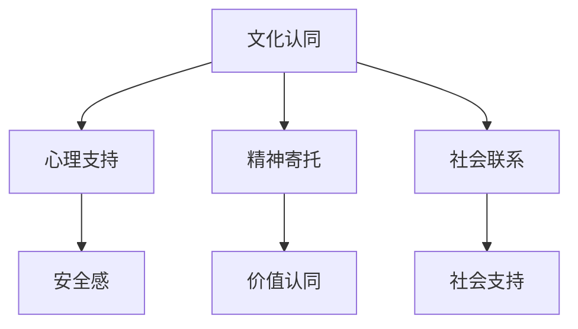

                 

### 2.1 现代社会精神家园的构成

**2.1.1 精神家园的定义与核心要素**

精神家园是指个体在精神层面的归属感、安全感、价值认同感等，它是一个复杂而多维的系统，包含多个核心要素：

1. **文化认同**：个体对所属文化的认同感，包括语言、习俗、信仰等。文化认同是精神家园的根基，它为个体提供了文化上的归属感和安全感。

2. **心理支持**：个体在面对生活挑战时所获得的心理支持和安全感。心理支持是精神家园的重要组成部分，它帮助个体在困难时期保持心理平衡和积极态度。

3. **精神寄托**：个体在精神层面所追求的目标和信仰。精神寄托为个体提供了精神上的安慰和方向，它是精神家园的灵魂。

4. **社会联系**：个体与他人的情感联系和社会支持。社会联系是精神家园的桥梁，它使个体在情感上与他人产生共鸣，获得社会支持。

**2.1.2 Mermaid 流程图**

以下是一个简单的 Mermaid 流程图，用于描述精神家园的核心要素及其关系：



在图中，文化认同、心理支持、精神寄托和社会联系是精神家园的四大核心要素。它们相互联系、相互作用，共同构成一个有机整体。

### 2.2 现代社会精神家园的现状

**2.2.1 现状概述**

现代社会中，人们的精神家园面临着诸多挑战：

- **文化多样性的冲击**：全球化带来的文化多样性，使得个体在文化认同方面面临挑战。不同文化之间的碰撞和融合，使个体在文化认同上感到迷茫。

- **快节奏生活的压力**：现代社会快节奏的生活方式，使得个体在心理支持和安全感方面受到考验。长时间的工作、生活压力、人际关系的疏离，导致个体心理问题频发。

- **价值观的多元化**：现代社会价值观的多元化，使得个体在精神寄托方面难以抉择。面对众多价值观的冲击，个体在精神寄托上感到困惑。

- **社会联系的不稳定**：现代社会中，个体之间的社会联系变得越来越脆弱。随着社交媒体的兴起，人们虽然可以在虚拟世界中保持联系，但现实生活中的亲密关系却逐渐疏远。

**2.2.2 伪代码：现代社会精神家园现状分析**

```python
def analyze_mental_home的现状():
    print("文化多样性冲击：")
    print("文化认同感降低，个体迷茫。")
    print("快节奏生活压力：")
    print("心理支持不足，安全感缺失。")
    print("价值观多元化：")
    print("精神寄托不明确，价值观混乱。")
    print("社会联系不稳定：")
    print("社会联系断裂，孤立感增强。")
```

通过上述伪代码，我们可以看到，现代社会精神家园的现状表现为文化多样性冲击、快节奏生活压力、价值观多元化和社会联系不稳定。这些挑战对个体的精神家园产生了深远的影响。

### 2.3 现代社会精神家园存在的问题

**2.3.1 数学模型与公式**

假设个体精神家园的稳定性取决于以下四个因素：文化认同（C）、心理支持（S）、精神寄托（T）和社会联系（L）。则个体精神家园的稳定性可以表示为：

$$
稳定性 = f(C, S, T, L)
$$

其中，$f$ 是一个复合函数，$C, S, T, L$ 分别代表文化认同、心理支持、精神寄托和社会联系。

**2.3.2 举例说明**

以一个30岁的城市白领为例，他面临以下问题：

- 文化认同：对本土文化认同感不强，但对西方文化有一定的兴趣。
- 心理支持：工作压力较大，缺乏有效的心理支持。
- 精神寄托：对事业有追求，但对个人生活缺乏兴趣。
- 社会联系：与家人、朋友关系较为紧张，社交圈子较为狭窄。

根据上述假设，我们可以建立一个简单的数学模型来分析这位城市白领的精神家园稳定性：

$$
稳定性 = f(C, S, T, L) = C \times S \times T \times L
$$

其中，$C, S, T, L$ 分别代表文化认同、心理支持、精神寄托和社会联系。这位城市白领的文化认同（C）较低，心理支持（S）不足，精神寄托（T）不确定，社会联系（L）较弱，因此他的精神家园稳定性（f）较低。

通过上述例子，我们可以看到，个体精神家园的稳定性受到多个因素的影响，每个因素的变化都会对整体稳定性产生影响。因此，重建现代社会精神家园需要从多个方面入手，综合考虑文化认同、心理支持、精神寄托和社会联系等因素。

