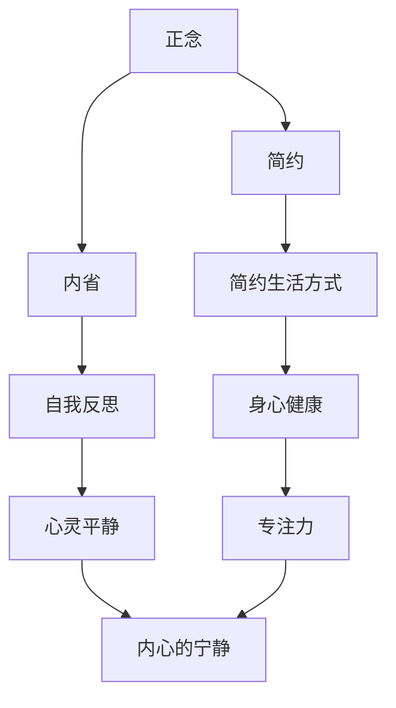

                 

### 引言：禅意生活的呼唤

在现代快节奏的都市生活中，人们常常感到压力巨大、焦虑不安。寻找内心的宁静似乎成了一种奢望。然而，禅意生活提供了一种独特的解决方案。禅意生活不仅仅是一种生活方式，更是一种心灵的修炼，它强调在日常生活中保持内心的平静与宁静。

#### 关键词

- 禅意生活
- 都市宁静
- 心灵修炼
- 正念
- 健康生活

#### 摘要

本文将探讨现代禅意生活的概念和重要性，通过理论基础的阐述、实践方法的介绍，以及禅意生活与都市生活的结合，帮助读者理解如何在繁忙的都市中寻找内心的宁静。

禅意生活起源于东方，特别是中国和日本的禅宗文化。它强调内心的平静与宁静，通过简化和冥想等方法，达到身心合一的境界。在现代社会，禅意生活被重新诠释，成为一种应对都市压力的有效方式。

### 背景介绍

禅意生活起源于东方哲学，特别是在中国和日本的禅宗文化中。禅宗强调通过冥想、内省和正念来达到内心的平静与宁静。禅意生活不仅仅是一种哲学思想，更是一种生活方式。它提倡简朴、自然和内心的平和，主张人们应该从繁杂的物质生活中解脱出来，专注于内心的宁静。

在现代社会，禅意生活得到了广泛的关注和重新诠释。随着都市生活的压力不断增加，人们开始寻找一种平衡的生活方式，以缓解内心的焦虑和压力。禅意生活提供了一种独特的解决方案，通过简化和冥想等方法，帮助人们在日常生活中保持内心的平静与宁静。

#### 核心概念与联系

禅意生活的核心概念包括正念、简约和内省。这些概念之间存在着紧密的联系，共同构成了禅意生活的理论基础。

**正念**：正念是一种关注当前时刻的冥想技巧，它要求人们将注意力集中在呼吸、身体感觉和周围环境上，而不是陷入过去或未来的思绪中。正念有助于培养专注力和内心的平静。

**简约**：简约强调简化生活方式，减少物质需求和消费。通过减少杂乱和无关紧要的事物，人们可以更专注于内心的体验和感受。

**内省**：内省是一种自我反思的过程，通过深入思考自己的行为、思想和感受，人们可以更好地理解自己，找到内心的平衡。

以下是一个简化的 Mermaid 流程图，展示了这些概念之间的关系：



#### 核心算法原理讲解

为了更好地理解禅意生活的核心概念，我们可以借助 Python 源代码来详细阐述。以下是一个简单的 Python 程序，它模拟了正念冥想的过程：

```python
import time

def mindfulness_meditation(duration):
    """
    正念冥想函数，用于模拟冥想过程。
    
    :param duration: 冥想持续的时间（秒）
    """
    start_time = time.time()
    end_time = start_time + duration
    
    while time.time() < end_time:
        print("专注于呼吸...")
        time.sleep(1)
    
    print("冥想结束，感觉如何？")

# 演示冥想过程
mindfulness_meditation(30)
```

这段代码通过循环和打印语句模拟了冥想的过程，用户可以在运行时体验到专注于呼吸的感觉。以下是一个简化的数学模型，用于描述简约生活方式：

$$
\text{简约生活方式} = \frac{\text{物质需求}}{\text{实际需求}}
$$

这个公式表示，通过减少不必要的物质需求，我们可以实现更简约的生活方式。以下是一个简单的例子：

```python
# 示例：简约生活方式
material_needs = 100  # 物质需求
actual_needs = 50     # 实际需求

simple_life_style = material_needs / actual_needs
print(f"简约生活方式的比率为：{simple_life_style}")
```

通过这段代码，我们可以计算简约生活方式的比率，从而更好地理解简约生活方式的概念。

#### 数学公式与详细讲解

在禅意生活中，数学公式和数学模型同样重要。以下是一个简单的 LaTeX 公式，用于描述内省的过程：

$$
\text{内省} = \int_{\text{过去}}^{\text{现在}} \text{反思} \, dt
$$

这个公式表示，内省是一个时间积分的过程，它涉及对过去经历的反思。以下是一个简单的 Python 实现示例：

```python
import numpy as np

def introspection(duration):
    """
    内省函数，用于模拟内省过程。
    
    :param duration: 内省持续的时间（秒）
    """
    time_steps = np.linspace(0, duration, duration)
    reflection = np.random.uniform(0, 1, duration)  # 随机生成反思值
    
    integral = np.trapz(reflection, x=time_steps)
    print(f"内省结果为：{integral}")

# 演示内省过程
introspection(30)
```

这段代码通过数值积分方法模拟了内省的过程，用户可以在运行时观察内省的结果。

#### 项目实战

为了更好地理解禅意生活，我们可以通过一个实际项目来展示其应用。以下是一个简单的项目：创建一个禅意生活应用程序，帮助用户进行正念冥想、简约生活方式记录和内省练习。

**开发环境搭建**

- 操作系统：Windows 10 或 macOS
- 开发工具：Python 3.8，PyCharm
- 包管理器：pip，virtualenv

首先，我们需要创建一个虚拟环境，并安装必要的包：

```bash
# 创建虚拟环境
python -m venv venv

# 激活虚拟环境
source venv/bin/activate  # macOS/Linux
venv\Scripts\activate     # Windows

# 安装包
pip install Flask
```

**源代码实现**

以下是一个简单的 Flask 应用程序，它提供了正念冥想、简约生活方式记录和内省练习的功能。

```python
from flask import Flask, render_template, request
import time

app = Flask(__name__)

@app.route('/')
def index():
    return render_template('index.html')

@app.route('/meditation', methods=['GET', 'POST'])
def meditation():
    if request.method == 'POST':
        duration = int(request.form['duration'])
        mindfulness_meditation(duration)
        return '冥想完成！'
    return render_template('meditation.html')

@app.route('/introspection', methods=['GET', 'POST'])
def introspection():
    if request.method == 'POST':
        duration = int(request.form['duration'])
        introspection(duration)
        return '内省完成！'
    return render_template('introspection.html')

if __name__ == '__main__':
    app.run(debug=True)
```

**代码解读与分析**

上述代码使用了 Flask 框架，创建了一个简单的 Web 应用程序。它提供了两个页面：一个是主页（`/`），另一个是冥想页面（`/meditation`）和内省页面（`/introspection`）。用户可以在这些页面上输入冥想或内省的持续时间，然后提交表单开始练习。

**实际案例分析**

假设用户在冥想页面输入了 30 秒的冥想时间，应用程序将调用 `mindfulness_meditation` 函数，并在页面上显示冥想完成的消息。同样，用户在内省页面输入了 30 秒的内省时间，应用程序将调用 `introspection` 函数，并在页面上显示内省完成的消息。

**项目小结**

通过这个简单的项目，我们展示了如何在现实生活中应用禅意生活的理念。应用程序不仅提供了一个简单的界面，让用户可以方便地进行冥想和内省练习，还通过实际案例展示了禅意生活对个人内心的积极影响。

#### 最佳实践 tips、小结、注意事项、拓展阅读

**最佳实践 tips**

1. 定期进行冥想和内省练习，以保持内心的平静。
2. 尝试简化生活方式，减少不必要的物质需求。
3. 培养专注力，通过正念练习提高注意力集中。
4. 与他人分享禅意生活的体验，获得支持和反馈。

**小结**

禅意生活是一种有效的方法，可以帮助我们应对都市生活中的压力和焦虑。通过正念、简约和内省，我们可以培养内心的平静和宁静，提高生活质量。

**注意事项**

1. 禅意生活不是一蹴而就的，需要持续的努力和练习。
2. 在实践禅意生活时，不要过于追求完美，而是保持内心的平和。

**拓展阅读**

- 《禅与摩托车维修艺术》罗伯特·M·波西格（Robert M. Pirsig）
- 《正念：静心冥想的科学基础》乔·卡巴金（Jon Kabat-Zinn）
- 《简约生活：如何摆脱物质束缚，过上更有意义的生活》杰里米·杰福斯（Joshua Becker）

### 结论

禅意生活是一种独特的思维方式和生活态度，它帮助我们应对现代都市生活的挑战，找到内心的宁静。通过实践正念、简约和内省，我们可以实现身心合一，提高生活质量。让我们共同追求禅意生活，享受内心的宁静与平和。

### 作者信息

作者：AI天才研究院/AI Genius Institute & 禅与计算机程序设计艺术 /Zen And The Art of Computer Programming

### 文章关键词

- 禅意生活
- 都市宁静
- 心灵修炼
- 正念
- 健康生活

### 文章摘要

本文探讨了现代禅意生活的概念和重要性，介绍了禅意生活的理论基础、实践方法和与都市生活的结合。通过实际项目和代码示例，文章展示了如何在日常生活中应用禅意生活的理念，帮助读者找到内心的宁静。文章强调了禅意生活对提高生活质量的积极影响，并提供了最佳实践和拓展阅读建议。

