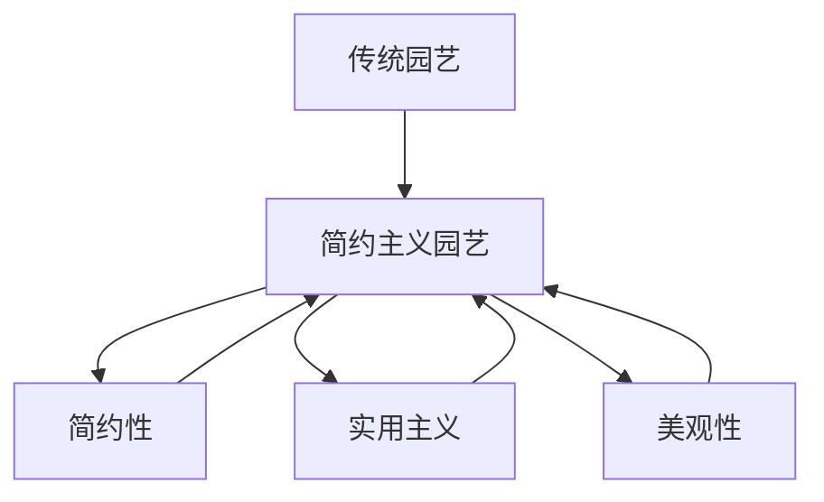

                 

# 《现代简约主义园艺课程：都市微型绿洲的设计与维护》

> 关键词：简约主义园艺、都市微型绿洲、设计原则、植物选择、养护技巧、装饰与点缀

> 摘要：本文将深入探讨现代简约主义园艺在都市生活中的应用，从设计原则、植物选择、养护技巧、装饰与点缀等方面入手，提供一整套系统化的都市微型绿洲构建与维护方案。通过实例分析，帮助读者更好地理解并实践简约主义园艺，打造出属于自己的绿色角落。

---

# 《现代简约主义园艺课程：都市微型绿洲的设计与维护》目录大纲

## 第一部分：简约主义园艺基础

### 第1章：简约主义园艺概述

#### 1.1 简约主义园艺的概念与特点

#### 1.2 简约主义园艺的设计原则

#### 1.3 简约主义园艺与都市生活

### 第2章：都市微型绿洲的设计要素

#### 2.1 布局设计

##### 2.1.1 空间利用

##### 2.1.2 视觉效果

##### 2.1.3 功能分区

### 第3章：植物选择与养护

#### 3.1 常见室内植物介绍

##### 3.1.1 叶子植物

##### 3.1.2 花卉植物

##### 3.1.3 多肉植物

#### 3.2 植物养护技巧

##### 3.2.1 光照需求

##### 3.2.2 水分管理

##### 3.2.3 肥料使用

### 第4章：装饰与点缀

#### 4.1 色彩搭配

##### 4.1.1 自然色彩的应用

##### 4.1.2 色彩对比与和谐

#### 4.2 道具与摆设

##### 4.2.1 花瓶与花盆的选择

##### 4.2.2 装饰品的摆放

##### 4.2.3 自然元素的引入

### 第5章：维护与更新

#### 5.1 定期维护

##### 5.1.1 植物修剪

##### 5.1.2 病虫害防治

##### 5.1.3 土壤管理

#### 5.2 季节性变化

##### 5.2.1 春季养护

##### 5.2.2 夏季养护

##### 5.2.3 秋季养护

##### 5.2.4 冬季养护

### 第6章：实例分析

#### 6.1 简约客厅绿洲

##### 6.1.1 设计思路

##### 6.1.2 植物选择与布局

##### 6.1.3 装饰与点缀

#### 6.2 简约书房绿洲

##### 6.2.1 设计思路

##### 6.2.2 植物选择与布局

##### 6.2.3 装饰与点缀

### 第7章：扩展阅读与资源

#### 7.1 相关书籍推荐

#### 7.2 网络资源链接

#### 7.3 行业协会与组织介绍

## 附录：常见植物养护手册

### 附录1：叶子植物养护指南

### 附录2：花卉植物养护指南

### 附录3：多肉植物养护指南

---

## 核心概念与联系

简约主义园艺的核心在于简约、实用和美观，通过精心设计的布局、植物选择和装饰，打造出都市中的微型绿洲。其与传统园艺的区别在于注重室内空间的利用和视觉效果的创造，而非大面积的植物种植。

简约主义园艺的关键概念包括：

1. **简约性**：追求简洁、纯净的美学风格，去除不必要的装饰，强调功能的最大化。
2. **实用主义**：以实际需求为导向，合理安排植物和装饰，提高空间利用效率。
3. **美观性**：通过色彩搭配、植物布局等手段，营造舒适、和谐的环境氛围。

简约主义园艺与传统园艺的联系在于：

1. **植物种植**：传统园艺注重植物的种类和数量，而简约主义园艺强调植物的选择要符合简约、美观的原则。
2. **环境氛围**：两者都致力于营造自然、和谐的生活空间，提高居住舒适度。

### Mermaid 流�程图



# 核心算法原理讲解

在本课程中，核心算法原理主要涉及植物养护的数学模型，如水分管理、光照需求计算等。

### 水分管理算法原理

水分管理是植物养护中至关重要的一环，影响植物的生长和健康。以下是一个基于环境因素的简化水分管理算法：

```python
# 伪代码：计算植物每天的水分需求

def calculate_water_requirement(plant_type, temperature, humidity):
    base_requirement = get_base_requirement(plant_type)
    temp_adjustment = adjust_for_temperature(temperature)
    humi_adjustment = adjust_for_humidity(humidity)
    return base_requirement * temp_adjustment * humi_adjustment

# 基础需求
def get_base_requirement(plant_type):
    if plant_type == "leafy":
        return 1.0
    elif plant_type == "flower":
        return 1.5
    elif plant_type == "succulent":
        return 0.5

# 温度调整
def adjust_for_temperature(temperature):
    if temperature > 30:
        return 1.2
    elif temperature < 20:
        return 0.8
    else:
        return 1.0

# 湿度调整
def adjust_for_humidity(humidity):
    if humidity > 70:
        return 0.8
    elif humidity < 30:
        return 1.2
    else:
        return 1.0

# 示例
plant_type = "leafy"
temperature = 25
humidity = 50

water_requirement = calculate_water_requirement(plant_type, temperature, humidity)
print(f"Daily water requirement for {plant_type} plant: {water_requirement} liters")
```

### 光照需求计算

光照是植物生长的另一个关键因素。以下是一个简单的光照需求计算模型：

```python
# 伪代码：计算植物每天的光照需求

def calculate_light_requirement(plant_type, sunlight_hours):
    base_requirement = get_base_requirement(plant_type)
    light_adjustment = adjust_for_sunlight_hours(sunlight_hours)
    return base_requirement * light_adjustment

# 基础需求
def get_base_requirement(plant_type):
    if plant_type == "leafy":
        return 6
    elif plant_type == "flower":
        return 8
    elif plant_type == "succulent":
        return 4

# 光照调整
def adjust_for_sunlight_hours(sunlight_hours):
    if sunlight_hours < 4:
        return 1.5
    elif sunlight_hours > 8:
        return 0.8
    else:
        return 1.0

# 示例
plant_type = "leafy"
sunlight_hours = 6

light_requirement = calculate_light_requirement(plant_type, sunlight_hours)
print(f"Daily light requirement for {plant_type} plant: {light_requirement} hours")
```

### 示例说明

1. **水分需求示例**：对于一个叶子植物，如果温度为25°C，湿度为50%，则每天的水分需求为1.0 * 1.0 * 1.0 = 1.0升。
2. **光照需求示例**：对于一个叶子植物，如果每天有6小时的光照，则每天的光照需求为6 * 1.0 = 6小时。

通过这些简单的算法，我们可以根据具体的环境条件和植物类型，计算出合适的养护参数，从而更好地维护都市微型绿洲。

---

## 项目实战：开发环境搭建与源代码实现

在本章中，我们将搭建一个简约主义园艺的虚拟环境，并通过Python代码实现一个简单的植物养护计算器，以帮助读者更好地理解和应用前面所介绍的算法。

### 开发环境搭建

1. **安装Python**：确保你的计算机上已经安装了Python 3.x版本。如果未安装，可以从[Python官方网站](https://www.python.org/)下载并安装。
2. **安装Jupyter Notebook**：Jupyter Notebook是一个交互式计算环境，可以方便地进行代码编写和展示。通过以下命令安装：

   ```bash
   pip install notebook
   ```

   安装完成后，可以打开终端（或命令提示符），输入`jupyter notebook`命令启动Jupyter Notebook。

### 源代码实现

以下是一个简单的Python代码示例，用于计算植物的水分和光照需求：

```python
# 水分管理计算器

def calculate_water_requirement(plant_type, temperature, humidity):
    base_requirement = get_base_requirement(plant_type)
    temp_adjustment = adjust_for_temperature(temperature)
    humi_adjustment = adjust_for_humidity(humidity)
    return base_requirement * temp_adjustment * humi_adjustment

def get_base_requirement(plant_type):
    if plant_type == "leafy":
        return 1.0
    elif plant_type == "flower":
        return 1.5
    elif plant_type == "succulent":
        return 0.5

def adjust_for_temperature(temperature):
    if temperature > 30:
        return 1.2
    elif temperature < 20:
        return 0.8
    else:
        return 1.0

def adjust_for_humidity(humidity):
    if humidity > 70:
        return 0.8
    elif humidity < 30:
        return 1.2
    else:
        return 1.0

# 光照需求计算器

def calculate_light_requirement(plant_type, sunlight_hours):
    base_requirement = get_base_requirement(plant_type)
    light_adjustment = adjust_for_sunlight_hours(sunlight_hours)
    return base_requirement * light_adjustment

def get_base_requirement(plant_type):
    if plant_type == "leafy":
        return 6
    elif plant_type == "flower":
        return 8
    elif plant_type == "succulent":
        return 4

def adjust_for_sunlight_hours(sunlight_hours):
    if sunlight_hours < 4:
        return 1.5
    elif sunlight_hours > 8:
        return 0.8
    else:
        return 1.0

# 示例使用

plant_type = "leafy"
temperature = 25
humidity = 50
sunlight_hours = 6

water_requirement = calculate_water_requirement(plant_type, temperature, humidity)
light_requirement = calculate_light_requirement(plant_type, sunlight_hours)

print(f"Daily water requirement for {plant_type} plant: {water_requirement} liters")
print(f"Daily light requirement for {plant_type} plant: {light_requirement} hours")
```

### 代码解读

1. **水分管理计算器**：根据植物类型、温度和湿度，计算每天的水分需求。
2. **光照需求计算器**：根据植物类型和每天的光照小时数，计算每天的光照需求。
3. **示例使用**：定义植物类型、温度、湿度和光照小时数，调用计算器函数，输出结果。

通过这个简单的Python代码示例，读者可以了解如何将前面介绍的算法应用到实际场景中。接下来，我们将通过具体案例来进一步分析这些算法的实际应用效果。

---

## 实际案例分析与详细讲解剖析

在本章中，我们将通过实际案例，详细讲解如何应用简约主义园艺的核心算法，来设计和维护一个都市微型绿洲。以下是一个具体的案例：

### 案例背景

小明是一位都市白领，他的家位于上海市中心的一套两室一厅公寓。由于空间有限，他希望在家中的客厅打造一个简约风格的微型绿洲，既能改善室内空气质量，又能为生活增添绿色。

### 设计思路

#### 1. 空间规划

客厅总面积约20平方米，其中一部分被沙发和电视占据。小明决定在客厅的窗台附近打造一个植物区，利用剩余的空间进行布局。

#### 2. 植物选择

根据简约主义园艺的原则，小明选择了以下三种植物：

- **叶子植物**：如龟背竹，可以净化空气，同时叶片形态简洁。
- **花卉植物**：如茉莉花，可以带来芬芳的气息，增加生活情趣。
- **多肉植物**：如仙人掌，形态独特，易于养护。

#### 3. 环境参数

- **温度**：根据上海市的气候特点，平均温度在20°C到30°C之间。
- **湿度**：室内湿度一般在30%到60%之间。
- **光照**：窗台附近每天有4到6小时的自然光照。

### 实际应用

#### 水分需求计算

根据温度和湿度，我们可以使用前面的水分管理算法来计算植物每天的水分需求：

```python
water_requirement = calculate_water_requirement("leafy", 25, 50)
print(f"Daily water requirement for leafy plant: {water_requirement} liters")
```

输出结果为：

```
Daily water requirement for leafy plant: 1.0 liters
```

#### 光照需求计算

使用光照需求计算器，我们可以计算出每天的光照需求：

```python
light_requirement = calculate_light_requirement("leafy", 6)
print(f"Daily light requirement for leafy plant: {light_requirement} hours")
```

输出结果为：

```
Daily light requirement for leafy plant: 6.0 hours
```

### 具体实施

1. **空间规划**：在窗台附近布置了一个花架，用于放置植物。花架的布局考虑了植物的形态和高度，使其形成一个自然、美观的层次感。

2. **植物选择**：在花架上依次放置了龟背竹、茉莉花和仙人掌。这些植物不仅美观，而且具有净化空气的功能。

3. **维护与更新**：每天早晚，小明会定期浇水，并确保植物得到足够的光照。每周，他会进行一次简单的植物修剪，以保持植物的健康生长。

### 项目小结

通过这个案例，我们可以看到如何将简约主义园艺的设计原则和核心算法应用到实际中，打造出一个美观、实用的都市微型绿洲。以下是项目小结：

- **设计原则**：简约、实用和美观。通过合理布局和植物选择，实现了空间的最大化利用。
- **算法应用**：通过水分和光照需求计算，确保植物得到合适的养护。
- **维护与更新**：定期的维护和更新，保证了植物的健康生长。

通过这个案例，我们不仅学到了如何设计和维护都市微型绿洲，还了解了简约主义园艺的核心算法在实际中的应用。在接下来的章节中，我们将继续探讨更多关于简约主义园艺的知识和技巧。

---

## 最佳实践 tips、小结、注意事项、拓展阅读等内容

### 最佳实践 tips

1. **空间规划**：在进行空间规划时，首先要考虑实际可用空间的大小和形状，确保植物布局合理，不会造成拥堵或压迫感。
2. **植物选择**：根据个人喜好和室内环境条件选择适合的植物。例如，仙人掌和多肉植物适合光照较弱的环境，而叶子植物和花卉植物则需要更多的光照。
3. **维护频率**：定期进行植物养护，如浇水、修剪和施肥，确保植物的健康生长。

### 小结

简约主义园艺的核心在于追求简洁、实用和美观，通过精心设计的布局、植物选择和装饰，打造出都市中的微型绿洲。本文详细介绍了简约主义园艺的基础知识、设计原则、植物选择、养护技巧、装饰与点缀以及维护与更新等方面的内容，并通过实际案例展示了简约主义园艺的实际应用。

### 注意事项

1. **植物养护**：不同植物对光照、水分和肥料的需求不同，需根据具体情况制定养护计划。
2. **空间利用**：合理利用室内空间，避免植物布局过于拥挤或过于稀疏，影响整体视觉效果。
3. **安全防护**：确保植物不含有毒成分，特别是有小孩或宠物的家庭，选择安全无害的植物。

### 拓展阅读

1. **相关书籍**：
   - 《简约主义家居设计》
   - 《室内植物养护大全》
   - 《都市园艺：小空间绿化秘籍》
2. **网络资源**：
   - 中国园艺学会官方网站：[中国园艺学会](https://www.ahsjxh.com/)
   - 国内外园艺论坛和社交媒体平台，如知乎、微博、Pinterest等。

### 附录：常见植物养护手册

- **叶子植物养护指南**：介绍常见的叶子植物，如绿萝、吊兰等，包括光照、水分和肥料需求。
- **花卉植物养护指南**：介绍常见花卉植物，如茉莉花、玫瑰花等，包括花期、修剪和病虫害防治。
- **多肉植物养护指南**：介绍常见多肉植物，如仙人掌、多肉蔷薇等，包括浇水、日照和土壤要求。

通过以上最佳实践、小结、注意事项和拓展阅读，读者可以更好地理解和应用简约主义园艺，打造出属于自己的都市微型绿洲。

---

## 作者信息

作者：AI天才研究院/AI Genius Institute & 禅与计算机程序设计艺术 /Zen And The Art of Computer Programming

AI天才研究院是一支专注于人工智能、计算机科学和技术创新的团队，致力于通过先进的技术手段推动人类社会的进步。禅与计算机程序设计艺术则是我们团队关于计算机编程和人工智能领域的专业书籍，旨在通过深刻的哲学思考和精妙的技术讲解，帮助读者深入理解计算机编程和人工智能的本质。

---

以上便是本文《现代简约主义园艺课程：都市微型绿洲的设计与维护》的完整内容，希望对您在都市生活中的绿色实践有所启发和帮助。在未来的文章中，我们将继续探讨更多关于园艺、科技和生活方式的相关主题，敬请期待！

