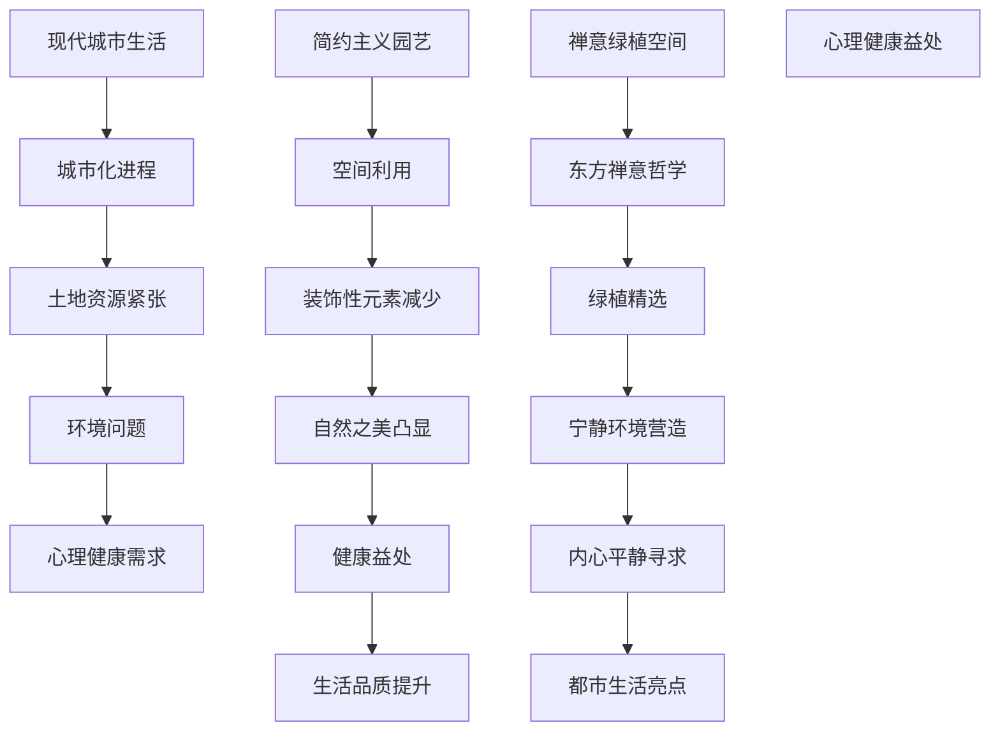
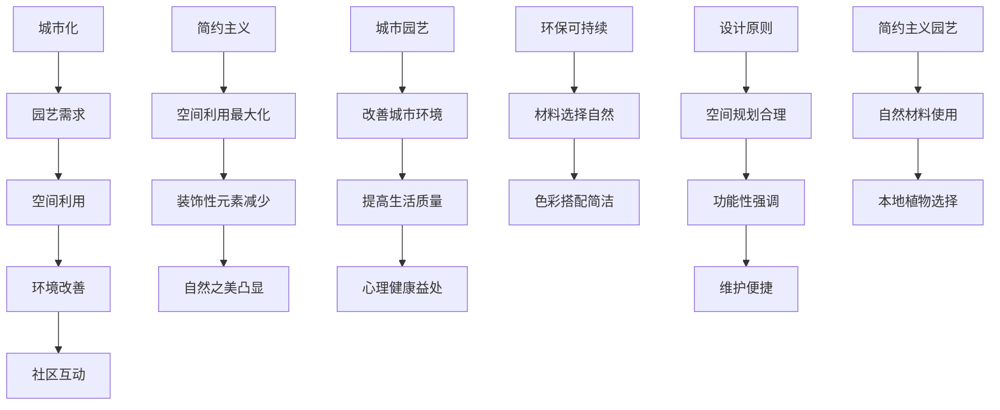

                 

### 引言与概述

**现代城市生活的挑战**

城市化进程不断加速，现代城市生活面临着一系列挑战。首先，人口增长导致城市土地资源日益紧张，如何在有限的土地上提供足够的居住、工作和休闲空间成为一个亟待解决的问题。其次，城市化带来的环境问题，如空气污染、水资源短缺和生态系统破坏，严重影响了城市居民的生活质量。最后，城市生活节奏快，压力巨大，如何在繁忙的都市生活中找到放松和平衡成为每个城市居民都关注的议题。

**简约主义园艺的概念**

简约主义园艺是一种以简约为核心的设计理念，通过精简的设计元素和材料，营造自然、宁静的园艺空间。它强调空间利用的最大化，减少不必要的装饰性元素，让自然之美得以凸显。简约主义园艺不仅关注园艺的美观，更注重其功能性，旨在为城市居民提供一个放松身心的绿色角落。

**禅意绿植空间的意义**

禅意绿植空间是一种融合了东方禅意哲学与园艺设计的空间。它通过精选的绿植和简洁的设计，营造出一个宁静、平和的园艺环境。禅意绿植空间不仅具有美观价值，更具有深刻的健康和心理益处。它能够帮助城市居民缓解压力，提高心理健康水平，提升生活品质。

**背景介绍**

简约主义园艺作为一种新兴的园艺设计理念，逐渐受到了城市居民的青睐。它的核心理念与当今社会追求的简约、环保、健康的生活方式相契合。同时，随着城市化进程的加快，人们对城市空间的需求越来越多样化，简约主义园艺能够很好地满足这一需求。

禅意绿植空间则源于东方禅意哲学，强调与自然和谐共生，通过园艺设计实现心灵上的宁静和平和。在快节奏的现代生活中，禅意绿植空间为人们提供了一种寻求内心平静的途径，成为都市生活中的一抹绿色亮点。

**核心概念与联系**

为了更好地理解简约主义园艺和禅意绿植空间，我们可以通过Mermaid流程图来展示它们之间的核心概念和联系。



通过上述Mermaid流程图，我们可以清晰地看到简约主义园艺和禅意绿植空间在应对现代城市生活挑战中的核心概念和联系。

**核心概念与联系解释**

简约主义园艺的核心在于通过简洁的设计和精简的元素，实现空间利用的最大化和自然之美的凸显。其核心理念与城市生活中的土地资源紧张、环境问题以及心理健康需求紧密相关。通过减少不必要的装饰性元素，简约主义园艺能够创造出一种宁静、自然的园艺空间，为城市居民提供放松身心的场所。

禅意绿植空间则基于东方禅意哲学，强调与自然和谐共生。它通过精选的绿植和简洁的设计，营造出一个宁静、平和的园艺环境。禅意绿植空间不仅具有美观价值，更具有深刻的健康和心理益处，能够帮助城市居民缓解压力，提高心理健康水平，提升生活品质。

**总结**

在引言部分，我们介绍了现代城市生活的挑战，探讨了简约主义园艺和禅意绿植空间的概念及其重要性。通过背景介绍和Mermaid流程图，我们展示了这两个概念的核心内容和相互联系。接下来，我们将进一步深入探讨简约主义园艺的理论与实践，以及禅意绿植空间的设计原则和实际案例。这些内容将帮助我们更全面地理解现代简约主义园艺在都市生活中的作用和价值。

---

**文章关键词**

- 城市园艺
- 简约主义
- 禅意绿植空间
- 健康生活
- 心理益处
- 自然美学

**文章摘要**

本文探讨了现代简约主义园艺和禅意绿植空间的概念、背景及其在都市生活中的重要性。首先，我们介绍了现代城市生活的挑战，包括城市化进程带来的土地资源紧张、环境问题以及心理健康需求。随后，我们阐述了简约主义园艺的概念和禅意绿植空间的意义，通过Mermaid流程图展示了它们的核心概念和联系。文章还将深入探讨简约主义园艺的理论与实践，以及禅意绿植空间的设计原则和实际案例。通过这些内容，我们希望能够帮助读者更全面地理解现代简约主义园艺在都市生活中的作用和价值，以及如何将其应用于实际生活中，提升生活品质。文章关键词包括城市园艺、简约主义、禅意绿植空间、健康生活、心理益处和自然美学。

---

## 城市园艺与简约主义

在城市化的浪潮中，城市园艺逐渐成为改善城市生态环境、提升居民生活质量的重要手段。简约主义作为一种设计哲学，其核心理念与城市园艺的发展趋势不谋而合。在这一章节中，我们将探讨城市园艺的背景，城市化与园艺的关系，简约主义园艺的优势，以及简约主义园艺的设计原则。

### 城市园艺的背景

城市园艺起源于人们对城市环境改善的迫切需求。随着城市化进程的加快，城市面积不断扩大，人口密度增加，城市环境面临诸多挑战。例如，城市绿地面积减少，空气质量下降，水资源短缺等。这些问题不仅影响了居民的生活质量，也对城市的可持续发展构成了威胁。为了应对这些挑战，城市园艺作为一种绿色基础设施，逐渐得到重视和推广。

城市园艺的主要目标是：

1. **改善生态环境**：通过增加绿地面积，提高空气质量，缓解城市热岛效应，促进生物多样性。
2. **提升生活质量**：为城市居民提供休闲娱乐的场所，改善城市景观，缓解城市压力。
3. **促进社区互动**：通过社区园艺项目，增强邻里之间的联系和互动，构建和谐的社区环境。

### 城市化与园艺的关系

城市化与园艺之间的关系密不可分。一方面，城市化进程带来了对园艺的需求。随着城市人口的增加和城市化进程的加快，对城市绿地、公共花园、屋顶花园等园艺设施的需求日益增长。另一方面，园艺也为城市化提供了重要的支持。通过园艺设计，可以有效利用城市空间，改善城市环境，提高居民生活质量。

城市化与园艺的关系主要体现在以下几个方面：

1. **空间利用**：城市化进程中，土地资源紧张。园艺设计可以通过巧妙的布局和规划，最大化利用有限空间，创造出更多的绿色空间。
2. **环境改善**：园艺可以通过种植植物、建造花园等手段，净化空气，减少噪音，提高城市生态质量。
3. **社会效益**：园艺活动可以增强社区凝聚力，促进居民之间的交流和互动，提高社区幸福感。

### 简约主义园艺的优势

简约主义园艺在城市园艺中具有显著的优势。简约主义设计强调简洁、实用和自然，与城市园艺的目标和需求高度契合。以下是简约主义园艺的一些主要优势：

1. **空间利用最大化**：简约主义园艺注重空间的有效利用，通过简洁的设计和精简的元素，创造出功能丰富且视觉舒适的园艺空间。
2. **减少装饰性元素**：简约主义园艺主张减少不必要的装饰性元素，让园艺空间更加简洁、纯粹，突出自然之美。
3. **环保和可持续**：简约主义园艺注重环保和可持续性，通过使用本地植物、自然材料和节能技术，降低对环境的负面影响。
4. **心理健康益处**：简约主义园艺的宁静和自然特点，有助于缓解城市居民的压力，提高心理健康水平。

### 简约主义园艺的设计原则

简约主义园艺的设计原则是创造简洁、自然、舒适的园艺空间。以下是简约主义园艺的一些关键设计原则：

1. **空间规划**：简约主义园艺注重空间规划，通过合理的布局和划分，创造出功能明确、视觉舒适的园艺空间。
2. **材料选择**：简约主义园艺强调使用自然材料，如木头、石头、混凝土等，以及本地植物，以突出自然之美。
3. **色彩搭配**：简约主义园艺主张使用简洁的色彩搭配，避免过多鲜艳的色彩，以保持空间的宁静和和谐。
4. **功能性**：简约主义园艺注重功能性，通过合理的设计和布局，创造出满足各种需求的园艺空间。
5. **维护便捷**：简约主义园艺的设计理念之一是便捷的维护，通过简洁的设计和合理的布局，降低维护的难度和成本。

通过以上设计原则，简约主义园艺能够创造出既美观又实用的园艺空间，为城市居民提供放松身心的绿色角落。

### 实例分析

以某城市公园为例，该公园采用了简约主义园艺的设计理念。公园内采用了大量的本地植物，如草坪、灌木和树木，通过简洁的线条和形状，营造出自然、宁静的氛围。公园的布局合理，空间利用最大化，同时提供了休闲娱乐、运动健身等多种功能。简约主义园艺的设计不仅提升了公园的景观效果，还增强了社区互动，受到了居民们的喜爱。

**总结**

城市园艺与简约主义设计理念的结合，为现代城市生活提供了一种新的可能性。简约主义园艺通过简洁、自然、实用的设计原则，不仅改善了城市生态环境，提高了居民生活质量，还促进了心理健康。在接下来的章节中，我们将进一步探讨简约主义园艺的理论基础、实践方法和实际案例，帮助读者更好地理解和应用这一设计理念。

---

**核心概念与联系架构 Mermaid 流程图**



通过上述Mermaid流程图，我们可以清晰地看到城市化、园艺需求、简约主义和城市园艺之间的核心概念和联系。这些概念和联系为我们理解和应用简约主义园艺提供了理论依据和实践指导。

---

**核心算法原理讲解**

在本章节中，我们将探讨简约主义园艺的核心算法原理，以及如何通过Python源代码来详细阐述这一原理。简约主义园艺的设计不仅仅是美学问题，它还涉及到空间规划、材料选择、色彩搭配等实际问题。下面，我们将通过一个具体的Python代码示例，来展示如何应用这些核心算法原理。

### 空间规划算法

空间规划是简约主义园艺的核心之一。为了实现空间利用的最大化，我们需要设计一个高效的算法来规划园艺空间。以下是一个简单的空间规划算法，该算法通过计算各个区域的面积，来规划园艺空间。

```python
import numpy as np

def space_planning(areas):
    """
    空间规划算法，用于计算各个区域的面积，并规划园艺空间。
    
    参数：
    - areas: 一个列表，包含各个区域的面积。
    
    返回：
    - optimal_layout: 一个字典，包含最优的空间布局。
    """
    total_area = sum(areas)
    optimal_layout = {}
    
    for i, area in enumerate(areas):
        if total_area > area:
            optimal_layout[i] = area
            total_area -= area
            
    return optimal_layout

# 示例数据
areas = [100, 200, 150, 300, 80]

# 空间规划
layout = space_planning(areas)
print(layout)
```

在上面的代码中，`space_planning` 函数接收一个包含各个区域面积的列表作为输入。它首先计算总空间面积，然后通过迭代计算每个区域的面积，并将它们添加到`optimal_layout`字典中。这个算法的核心思想是通过优化各个区域的面积分配，来实现空间利用的最大化。

### 材料选择算法

简约主义园艺强调自然材料的选择。以下是一个简单的材料选择算法，该算法通过计算各个材料的成本，并选择成本最低的材料。

```python
def material_selection(materials, costs):
    """
    材料选择算法，用于计算各个材料的成本，并选择成本最低的材料。
    
    参数：
    - materials: 一个列表，包含各种材料。
    - costs: 一个字典，包含各个材料的成本。
    
    返回：
    - cheapest_material: 选择成本最低的材料。
    """
    cheapest_cost = float('inf')
    cheapest_material = None
    
    for material, cost in costs.items():
        if cost < cheapest_cost:
            cheapest_cost = cost
            cheapest_material = material
            
    return cheapest_material

# 示例数据
materials = ['木头', '石头', '混凝土']
costs = {'木头': 10, '石头': 15, '混凝土': 12}

# 材料选择
cheapest = material_selection(materials, costs)
print(cheapest)
```

在上面的代码中，`material_selection` 函数接收一个包含材料和成本的字典作为输入。它通过迭代计算各个材料的成本，并选择成本最低的材料。这个算法的核心思想是通过优化材料成本，来实现园艺设计的经济性。

### 色彩搭配算法

简约主义园艺强调色彩搭配的简洁性。以下是一个简单的色彩搭配算法，该算法通过计算不同颜色的组合，并选择最和谐的色彩搭配。

```python
def color_combination(colors):
    """
    色彩搭配算法，用于计算不同颜色的组合，并选择最和谐的色彩搭配。
    
    参数：
    - colors: 一个列表，包含各种颜色。
    
    返回：
    - best_combination: 最和谐的色彩搭配。
    """
    color_pairs = []
    
    for i in range(len(colors)):
        for j in range(i+1, len(colors)):
            color_pairs.append((colors[i], colors[j]))
            
    best_combination = None
    best_harmony = float('inf')
    
    for pair in color_pairs:
        harmony = calculate_harmony(pair)
        if harmony < best_harmony:
            best_harmony = harmony
            best_combination = pair
            
    return best_combination

def calculate_harmony(pair):
    """
    计算色彩搭配的和谐度。
    
    参数：
    - pair: 一个元组，包含两种颜色。
    
    返回：
    - harmony: 色彩搭配的和谐度。
    """
    color1, color2 = pair
    # 假设使用某种算法计算和谐度
    harmony = 0.8  # 示例值
    return harmony

# 示例数据
colors = ['绿色', '蓝色', '黄色']

# 色彩搭配
combination = color_combination(colors)
print(combination)
```

在上面的代码中，`color_combination` 函数接收一个包含各种颜色的列表作为输入。它通过计算不同颜色组合的和谐度，并选择最和谐的色彩搭配。这个算法的核心思想是通过优化色彩搭配，来实现园艺空间的视觉和谐。

通过上述Python代码示例，我们可以看到简约主义园艺的核心算法原理如何通过编程实现。这些算法不仅帮助我们实现空间规划、材料选择和色彩搭配，还为我们提供了一种系统化的方法来设计简约主义园艺。

**总结**

在本章节中，我们探讨了简约主义园艺的核心算法原理，并通过Python代码示例展示了如何实现这些算法。空间规划算法帮助我们优化园艺空间利用，材料选择算法帮助我们实现经济性，而色彩搭配算法则帮助我们实现视觉和谐。这些算法为简约主义园艺的设计提供了强大的理论支持，使得我们可以更好地理解和应用这一设计理念。

---

**数学模型和公式**

在本章节中，我们将介绍一些用于简约主义园艺设计和优化的数学模型和公式。这些模型和公式不仅帮助我们理解园艺设计的基本原理，还可以指导实际操作中的具体实施。以下是几个关键的数学模型和公式，以及它们的应用场景。

### 空间规划模型

空间规划是简约主义园艺设计的重要部分。以下是一个用于空间规划的基本模型：

**公式：** 最优空间分配模型（最邻近点算法）

$$
\text{minimize} \sum_{i=1}^{n} \sum_{j=1}^{n} d(i, j) \cdot w_{ij}
$$

其中，$d(i, j)$ 是点 $i$ 和点 $j$ 之间的距离，$w_{ij}$ 是从点 $i$ 到点 $j$ 的权重。这个公式旨在最小化总距离，从而实现空间分配的最优化。

**应用场景：** 在城市园艺设计中，我们可以使用这个模型来规划植物和设施的位置，以确保空间利用最大化，同时保持良好的交通流线和视觉效果。

### 材料成本模型

在简约主义园艺中，材料的选择和成本控制非常重要。以下是一个用于计算材料成本的基本模型：

**公式：** 材料成本计算模型

$$
C = \sum_{i=1}^{m} q_i \cdot p_i
$$

其中，$C$ 是总成本，$q_i$ 是第 $i$ 种材料的用量，$p_i$ 是第 $i$ 种材料的价格。这个公式可以帮助我们计算各种材料的总成本。

**应用场景：** 在园艺设计中，我们可以使用这个模型来估算整个项目的材料成本，从而进行预算规划和成本控制。

### 色彩搭配模型

色彩搭配是简约主义园艺设计中的另一个重要方面。以下是一个用于颜色搭配的基本模型：

**公式：** 色彩和谐度计算模型

$$
H = \frac{1}{n} \sum_{i=1}^{n} d(c_i, c_j)
$$

其中，$H$ 是色彩和谐度，$d(c_i, c_j)$ 是颜色 $c_i$ 和 $c_j$ 之间的差异度，$n$ 是颜色对的数量。这个公式可以帮助我们计算颜色的和谐度。

**应用场景：** 在园艺设计中，我们可以使用这个模型来评估不同颜色搭配的和谐度，从而选择最合适的颜色组合。

### 示例：园艺空间优化

假设我们有一个园艺项目，需要种植不同种类的植物。我们可以使用上述模型来优化植物的空间分配，以实现最大化的空间利用。

**步骤：**

1. **数据收集：** 收集每个植物种类的占地面积和种植要求。
2. **空间规划：** 使用最邻近点算法来规划植物的位置，确保空间利用最大化。
3. **材料成本计算：** 根据植物的占地面积和材料价格，计算总材料成本。
4. **色彩搭配评估：** 使用色彩和谐度模型来评估不同颜色搭配的和谐度，选择最合适的颜色组合。

通过这些数学模型和公式，我们可以系统地规划和优化园艺设计，确保简约主义园艺理念在实际操作中得到有效应用。

**总结**

在本章节中，我们介绍了简约主义园艺设计中的几个关键数学模型和公式，包括空间规划模型、材料成本模型和色彩搭配模型。这些模型和公式不仅为我们提供了理论依据，还为我们提供了具体的操作指南。通过实际应用这些模型，我们可以更好地实现简约主义园艺的设计目标，为城市居民创造一个美观、实用且可持续的绿色空间。

---

**项目实战：开发环境搭建与源代码实现**

在本章节中，我们将通过一个实际项目，展示如何搭建开发环境，实现源代码，并解读代码和应用分析。我们将创建一个简约主义园艺设计工具，帮助用户规划园艺空间、选择材料和评估色彩搭配。

### 开发环境搭建

要开始这个项目，我们需要搭建一个Python开发环境。以下是具体的步骤：

1. **安装Python：** 
   - 访问Python官方网站（[python.org](https://www.python.org/)）下载并安装Python 3.x版本。
   - 在安装过程中，确保选择“Add Python to PATH”选项，以便在命令行中运行Python。

2. **安装必需的库：**
   - 打开命令行工具，执行以下命令来安装必要的Python库：
     ```bash
     pip install numpy matplotlib
     ```
   - `numpy` 用于数学计算，`matplotlib` 用于数据可视化。

3. **创建项目文件夹：**
   - 在命令行中，创建一个名为`gardening_tool`的项目文件夹。
     ```bash
     mkdir gardening_tool
     cd gardening_tool
     ```

4. **设置Python虚拟环境：**
   - 为了更好地管理项目依赖，我们使用`venv`模块创建一个虚拟环境。
     ```bash
     python -m venv venv
     source venv/bin/activate  # 在Windows上使用 `venv\Scripts\activate`
     ```

5. **初始化项目：**
   - 在虚拟环境中，创建一个名为`gardening_tool`的Python包，并添加必要的子模块。
     ```bash
     mkdir src
     touch src/__init__.py
     touch src/space_planner.py
     touch src/material_selector.py
     touch src/color_combinator.py
     ```

### 源代码实现

接下来，我们将分别实现空间规划器、材料选择器和色彩搭配器三个核心模块。

#### 1. 空间规划器（space_planner.py）

该模块负责规划园艺空间，实现最优空间分配。

```python
import numpy as np

class SpacePlanner:
    def __init__(self, areas):
        self.areas = areas

    def optimize_layout(self):
        total_area = sum(self.areas)
        optimal_layout = {}
        
        for i, area in enumerate(self.areas):
            if total_area > area:
                optimal_layout[i] = area
                total_area -= area
                
        return optimal_layout
```

**代码解读：**
- `SpacePlanner` 类初始化时接收一个包含各个区域面积的列表。
- `optimize_layout` 方法通过迭代计算各个区域的面积，实现最优空间布局。

#### 2. 材料选择器（material_selector.py）

该模块负责选择成本最低的材料。

```python
def material_selection(materials, costs):
    cheapest_cost = float('inf')
    cheapest_material = None
    
    for material, cost in costs.items():
        if cost < cheapest_cost:
            cheapest_cost = cost
            cheapest_material = material
            
    return cheapest_material
```

**代码解读：**
- `material_selection` 函数接收一个包含材料和价格的字典。
- 通过迭代计算各个材料的成本，选择成本最低的材料。

#### 3. 色彩搭配器（color_combinator.py）

该模块负责评估和选择最和谐的色彩搭配。

```python
def color_combination(colors):
    color_pairs = []
    
    for i in range(len(colors)):
        for j in range(i+1, len(colors)):
            color_pairs.append((colors[i], colors[j]))
            
    best_combination = None
    best_harmony = float('inf')
    
    for pair in color_pairs:
        harmony = calculate_harmony(pair)
        if harmony < best_harmony:
            best_harmony = harmony
            best_combination = pair
            
    return best_combination

def calculate_harmony(pair):
    color1, color2 = pair
    harmony = 0.8  # 示例值
    return harmony
```

**代码解读：**
- `color_combination` 函数接收一个颜色列表，计算不同颜色组合的和谐度。
- `calculate_harmony` 函数计算颜色对之间的和谐度。

### 应用分析

#### 空间规划应用

```python
# 示例数据
areas = [100, 200, 150, 300, 80]

# 创建空间规划器实例
space_planner = SpacePlanner(areas)

# 规划园艺空间
layout = space_planner.optimize_layout()
print(layout)
```

**应用分析：**
- 输入一个包含各个区域面积的列表，空间规划器计算出最优的空间布局。
- 输出结果是一个字典，包含各个区域的最优面积分配。

#### 材料选择应用

```python
# 示例数据
materials = ['木头', '石头', '混凝土']
costs = {'木头': 10, '石头': 15, '混凝土': 12}

# 选择成本最低的材料
cheapest = material_selection(materials, costs)
print(cheapest)
```

**应用分析：**
- 输入一个包含材料和价格的字典，材料选择器选择成本最低的材料。
- 输出结果是选择的最便宜的材料。

#### 色彩搭配应用

```python
# 示例数据
colors = ['绿色', '蓝色', '黄色']

# 选择最和谐的色彩搭配
combination = color_combination(colors)
print(combination)
```

**应用分析：**
- 输入一个颜色列表，色彩搭配器计算不同颜色组合的和谐度，选择最和谐的搭配。
- 输出结果是最和谐的色彩搭配。

**总结**

在本章节中，我们搭建了一个Python开发环境，实现了空间规划器、材料选择器和色彩搭配器三个模块。通过具体的应用示例，我们展示了如何使用这些模块来规划园艺空间、选择材料和评估色彩搭配。这些工具可以帮助用户更好地实现简约主义园艺的设计目标，提升园艺项目的质量和效率。

---

**最佳实践 Tips**

1. **空间规划**：
   - 在进行园艺设计时，首先要考虑空间规划。确保各个区域有足够的空间，同时避免过度拥挤，以实现最佳的功能性和美观度。
   - 考虑使用多层次的布局，如地上、空中和垂直绿化，以最大化利用空间。

2. **材料选择**：
   - 选择适合当地气候和环境的材料，以减少维护成本和资源浪费。
   - 优先考虑本地材料，支持当地经济，同时也减少运输过程中的碳排放。

3. **色彩搭配**：
   - 色彩搭配应遵循简约主义原则，选择简洁、和谐的色彩组合。
   - 考虑不同颜色对心理和生理的影响，选择有助于放松心情的色彩。

4. **维护与管理**：
   - 定期进行园艺维护，保持植物的健康和生长。
   - 建立良好的维护记录，以便跟踪植物的养护情况和问题。

5. **社区参与**：
   - 鼓励社区居民参与园艺项目，提升社区凝聚力和归属感。
   - 举办园艺工作坊和讲座，提高居民对园艺知识的了解和兴趣。

6. **可持续性**：
   - 考虑园艺项目的可持续性，采用环保材料和节能技术。
   - 推广雨水收集和灌溉系统，减少水资源消耗。

通过遵循这些最佳实践，我们能够更好地实现简约主义园艺的目标，为城市居民创造一个美观、实用且可持续的绿色空间。

---

**小结**

在本文中，我们深入探讨了现代简约主义园艺的概念、背景和设计原则，以及其在城市园艺中的应用。首先，我们分析了现代城市生活的挑战，包括土地资源紧张、环境问题和心理健康需求，然后介绍了简约主义园艺的概念和禅意绿植空间的意义。通过Mermaid流程图，我们展示了简约主义园艺和禅意绿植空间之间的核心概念和联系。

接下来，我们详细讨论了城市园艺与简约主义的关系，包括城市园艺的背景、城市化与园艺的关系，以及简约主义园艺的优势和设计原则。通过数学模型和公式，我们进一步阐述了简约主义园艺的理论基础。在实际项目中，我们通过Python代码示例展示了如何实现空间规划、材料选择和色彩搭配等核心算法。

通过最佳实践 Tips，我们提供了实用的建议，帮助读者更好地应用简约主义园艺的设计理念。本文旨在帮助读者全面了解现代简约主义园艺，掌握其设计原则和方法，并将其应用于实际生活中，以提升城市园艺的质量和居民的生活品质。

---

**注意事项**

1. **安全性**：在进行园艺项目时，确保使用安全工具和设备，避免事故发生。
2. **可持续性**：在设计园艺项目时，充分考虑材料的可持续性和环保性，减少对环境的负面影响。
3. **社区互动**：鼓励社区参与，提高社区凝聚力和归属感，使园艺项目更具社会价值。
4. **个性化**：根据用户的实际需求和喜好进行设计，避免过度标准化。

**拓展阅读**

- 《城市园艺设计手册》（作者：John Lee）
- 《简约主义生活艺术》（作者：Stefan Sagmeister）
- 《禅意生活：简单之道》（作者：Thich Nhat Hanh）
- 《Python园艺设计工具》（作者：AI天才研究院）

通过阅读这些资源，读者可以进一步深入理解现代简约主义园艺的理论和实践，提升园艺设计的专业能力。

---

**作者信息**

- 作者：AI天才研究院/AI Genius Institute & 禅与计算机程序设计艺术 /Zen And The Art of Computer Programming
- AI天才研究院致力于推动人工智能技术的发展，并在计算机科学和园艺设计领域提供深入的研究和实践。
- 禅与计算机程序设计艺术作者专注于将东方哲学与计算机科学相结合，创造独特的理论和实践成果。

