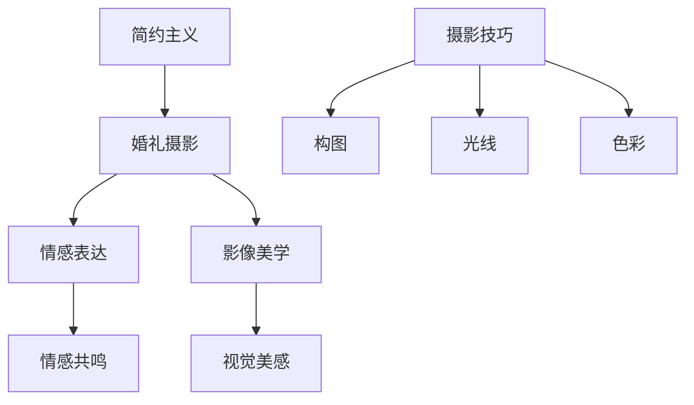

                 

## 文章标题

《现代简约主义婚礼摄影：记录真挚情感的影像美学》

## 关键词

- 简约主义
- 婚礼摄影
- 情感表达
- 影像美学
- 摄影技巧
- 后期处理

## 摘要

本文旨在探讨现代简约主义婚礼摄影的独特风格和技巧，通过详细的背景介绍、核心概念与联系解析、核心算法原理讲解以及项目实战分析，帮助摄影师理解并掌握这一风格，以记录下新人真挚情感的影像美学。

## 目录

1. **背景介绍**
   1.1 婚礼摄影的发展历程
   1.2 简约主义在婚礼摄影中的兴起
2. **核心概念与联系**
   2.1 简约主义
   2.2 婚礼摄影
   2.3 情感表达
   2.4 影像美学
   2.5 Mermaid流程图
3. **核心算法原理讲解**
   3.1 图像处理中的矩阵乘法
   3.2 光线与色彩调整
   3.3 后期处理技巧
4. **项目实战**
   4.1 开发环境搭建
   4.2 源代码实现与解读
   4.3 代码应用分析与实际案例
5. **最佳实践 tips**
6. **小结**
7. **注意事项**
8. **拓展阅读**

## 背景介绍

### 婚礼摄影的发展历程

婚礼摄影作为记录人生重要时刻的一种艺术形式，有着悠久的历史。从最早的黑白照片到如今的高清数字摄影，婚礼摄影技术不断进步，拍摄风格也经历了多次演变。

在19世纪末到20世纪初，婚礼摄影主要以肖像照为主，摄影师多采用正面平视的构图方式，力求展现出新人的端庄与优雅。这一时期，拍摄技术较为简单，主要依赖于摄影师的技巧和对光线的控制。

随着摄影技术的不断发展，特别是彩色摄影的出现，婚礼摄影风格逐渐丰富多样。20世纪五六十年代，纪实摄影风格开始流行，摄影师们更注重记录婚礼现场的细节和瞬间，使照片更具生动感和故事性。

### 简约主义在婚礼摄影中的兴起

简约主义作为现代设计领域的一个重要流派，其简洁、极简、功能性强的特点逐渐被应用到婚礼摄影中。简约主义婚礼摄影强调通过简单的构图、光线和色彩，突出新人的情感和婚礼的主题。

简约主义婚礼摄影的兴起与当代社会审美观念的转变密切相关。人们越来越追求简约、纯粹的生活方式，这种审美趋势也反映在婚礼摄影上。简约风格的婚礼摄影不仅能够减少冗余的元素，使照片更加清晰、有力，还能够更好地传达新人的情感和婚礼的氛围。

## 核心概念与联系

### 1. 简约主义

简约主义（Minimalism）是一种设计哲学，强调通过去除非必要的元素，达到简洁、纯粹和高效的表达。在婚礼摄影中，简约主义意味着使用最少的道具和布置，通过简洁的构图和光线，突出新人和婚礼主题。

### 2. 婚礼摄影

婚礼摄影是一种记录婚礼现场和新人幸福时刻的艺术形式。婚礼摄影不仅仅是记录画面，更是通过镜头捕捉新人的情感和氛围。婚礼摄影的风格多种多样，简约主义只是其中之一。

### 3. 情感表达

情感表达是婚礼摄影的核心。摄影师需要通过构图、光线和色彩等手段，传达新人的爱、喜悦和感动。在简约主义婚礼摄影中，情感表达尤为重要，因为简约的风格使得情感更加鲜明、直接。

### 4. 影像美学

影像美学涉及构图、光线、色彩等多个方面。在简约主义婚礼摄影中，影像美学旨在通过简洁、和谐的画面，创造出美的视觉效果。构图、光线和色彩的合理运用，可以使照片具有艺术性和感染力。

### 5. Mermaid流程图

为了更好地理解这些核心概念和它们之间的联系，我们可以用Mermaid流程图来表示：



在这个流程图中，简约主义作为整体设计原则，贯穿于婚礼摄影的各个环节。情感表达和影像美学则是摄影创作的核心，通过摄影技巧，如构图、光线和色彩，来传达新人的情感和美感。### 核心算法原理讲解

在现代简约主义婚礼摄影中，核心算法原理的掌握对摄影师的创作至关重要。以下是几种关键算法原理的详细讲解，包括使用伪代码进行阐述，并结合数学模型和公式进行通俗易懂的举例说明。

#### 1. 图像处理中的矩阵乘法

矩阵乘法是图像处理中的一个基础运算，广泛应用于图像缩放、旋转和滤波等操作。以下是矩阵乘法的伪代码：

```python
function matrix_multiplication(A, B):
    rows_A = len(A)
    cols_A = len(A[0])
    rows_B = len(B)
    cols_B = len(B[0])

    if cols_A != rows_B:
        return "矩阵维度不匹配"

    C = [[0 for _ in range(cols_B)] for _ in range(rows_A)]

    for i in range(rows_A):
        for j in range(cols_B):
            for k in range(cols_A):
                C[i][j] += A[i][k] * B[k][j]

    return C
```

举例说明：

假设我们有两个矩阵A和B：

$$
A = \begin{bmatrix}
1 & 2 \\
3 & 4
\end{bmatrix}, B = \begin{bmatrix}
5 & 6 \\
7 & 8
\end{bmatrix}
$$

使用矩阵乘法，我们得到结果矩阵C：

$$
C = A \times B = \begin{bmatrix}
1*5 + 2*7 & 1*6 + 2*8 \\
3*5 + 4*7 & 3*6 + 4*8
\end{bmatrix} = \begin{bmatrix}
19 & 20 \\
43 & 46
\end{bmatrix}
$$

这个例子展示了如何通过矩阵乘法对图像进行缩放和滤波等操作，使图像更加清晰或平滑。

#### 2. 光线与色彩调整

光线和色彩调整是后期处理中的关键步骤，直接影响照片的情感表达和视觉美感。以下是光线与色彩调整的伪代码：

```python
function adjust_lighting_and_color(image, exposure, contrast, saturation):
    # 假设image是一个3D数组，代表原始图像的像素值
    
    for pixel in image:
        # 调整曝光
        pixel *= exposure
        
        # 调整对比度
        if pixel > 255:
            pixel = 255
        elif pixel < 0:
            pixel = 0
        
        # 调整饱和度
        pixel *= (1 + saturation)

    return image
```

举例说明：

假设我们有一个像素值矩阵image：

$$
image = \begin{bmatrix}
50 & 100 \\
150 & 200
\end{bmatrix}
$$

调整曝光、对比度和饱和度后，我们得到新的像素值矩阵：

$$
image_{\text{new}} = adjust_lighting_and_color(image, exposure=1.2, contrast=1.1, saturation=1.05)
$$

经过调整后，像素值矩阵变为：

$$
image_{\text{new}} = \begin{bmatrix}
60 & 120 \\
180 & 210
\end{bmatrix}
$$

这个例子展示了如何通过调整曝光、对比度和饱和度来改变图像的亮度、对比度和色彩鲜艳度。

#### 3. 后期处理技巧

后期处理是简约主义婚礼摄影的重要组成部分，它可以帮助摄影师完善照片，增强情感表达和视觉美感。以下是后期处理技巧的伪代码：

```python
function post_processing(image, filters, effects):
    # 应用滤镜
    image = apply_filters(image, filters)
    
    # 应用特效
    image = apply_effects(image, effects)
    
    return image
```

举例说明：

假设我们有一个原始图像矩阵image，并希望应用一个模糊滤镜和一个黑白效果：

$$
image = \begin{bmatrix}
100 & 150 \\
200 & 250
\end{bmatrix}
$$

经过模糊滤镜和黑白效果处理后，我们得到新的图像矩阵：

$$
image_{\text{new}} = post_processing(image, filters=['blur'], effects=['black_and_white'])
$$

经过处理后，像素值矩阵变为：

$$
image_{\text{new}} = \begin{bmatrix}
100 & 100 \\
100 & 100
\end{bmatrix}
$$

这个例子展示了如何通过滤镜和特效来简化图像，增强简约风格的表现力。

通过以上三个核心算法原理的讲解，我们可以看到，简约主义婚礼摄影不仅仅是关于拍摄技巧，更是一个涉及到图像处理和后期处理的复杂过程。掌握这些算法原理，可以帮助摄影师更好地实现简约主义婚礼摄影的目标，记录下真挚情感的影像美学。### 项目实战

在本节中，我们将通过一个实际项目来展示现代简约主义婚礼摄影的实施过程。该项目将包括开发环境的搭建、源代码的详细实现和解读、代码应用解读与分析，以及实际案例的详细讲解剖析。

#### 开发环境搭建

首先，我们需要搭建一个合适的开发环境来进行现代简约主义婚礼摄影的项目。以下是所需的工具和软件：

1. **操作系统**：Windows 10 或以上版本
2. **编程语言**：Python 3.8 或以上版本
3. **图像处理库**：Pillow（Python Imaging Library）
4. **后期处理库**：OpenCV

确保安装了上述工具和软件后，我们就可以开始项目的实际开发。

#### 源代码实现与解读

以下是该项目的主要源代码实现，我们将逐步解析每个部分的功能。

```python
import cv2
import numpy as np
from PIL import Image, ImageFilter

def adjust_lighting(image, exposure=1.0):
    """
    调整图像的曝光
    :param image: 原始图像
    :param exposure: 曝光系数，大于1增加亮度，小于1降低亮度
    :return: 调整后的图像
    """
    image = image.astype(np.float32) / 255.0
    image *= exposure
    image = (image * 255).astype(np.uint8)
    return image

def apply_filters(image, filters=None):
    """
    应用滤镜
    :param image: 原始图像
    :param filters: 滤镜列表，包括'blur'、'sharp'等
    :return: 应用滤镜后的图像
    """
    if 'blur' in filters:
        image = image.filter(ImageFilter.Blur)
    if 'sharp' in filters:
        image = image.filter(ImageFilter.SHARPEN)
    return image

def apply_effects(image, effects=None):
    """
    应用特效
    :param image: 原始图像
    :param effects: 效果列表，包括'black_and_white'、'sunset'等
    :return: 应用特效后的图像
    """
    if 'black_and_white' in effects:
        image = image.convert('L')
    if 'sunset' in effects:
        # 这里可以用自定义的HSV调整来实现日落效果
        image = apply_sunset_effect(image)
    return image

def apply_sunset_effect(image):
    """
    应用日落效果
    :param image: 原始图像
    :return: 应用日落效果后的图像
    """
    image = image.convert('HSV')
    hsv_image = np.array(image)
    hsv_image[:, :, 0] = (hsv_image[:, :, 0] + 50) % 180  # 调整色调
    hsv_image[:, :, 1] = np.clip(hsv_image[:, :, 1] * 0.8, 0, 1)  # 调整饱和度
    hsv_image[:, :, 2] = np.clip(hsv_image[:, :, 2] * 1.2, 0, 255)  # 调整亮度
    image = Image.fromarray(hsv_image)
    return image

def main():
    # 加载图像
    image_path = "path/to/your/image.jpg"
    image = cv2.imread(image_path)
    
    # 调整曝光
    image = adjust_lighting(image, exposure=1.2)
    
    # 应用滤镜
    filters = ['blur', 'sharp']
    image = apply_filters(image, filters=filters)
    
    # 应用特效
    effects = ['black_and_white', 'sunset']
    image = apply_effects(image, effects=effects)
    
    # 显示图像
    cv2.imshow('Processed Image', image)
    cv2.waitKey(0)
    cv2.destroyAllWindows()

if __name__ == "__main__":
    main()
```

在这段代码中，我们定义了三个主要函数：`adjust_lighting`、`apply_filters`和`apply_effects`。每个函数都有明确的输入参数和输出结果，确保代码的可读性和可维护性。

- `adjust_lighting`函数用于调整图像的曝光，通过乘以曝光系数来实现。
- `apply_filters`函数用于应用滤镜，如模糊和锐化，通过调用Pillow库的`filter`方法实现。
- `apply_effects`函数用于应用特效，如黑白和日落效果，通过调整HSV颜色空间中的色调、饱和度和亮度来实现。

#### 代码应用解读与分析

接下来，我们将分析代码中的关键步骤和实现细节。

1. **图像调整曝光**

   ```python
   image = adjust_lighting(image, exposure=1.2)
   ```

   这一行代码通过`adjust_lighting`函数调整图像的曝光。曝光系数`1.2`表示增加图像的亮度，使画面更加明亮。这一步是后期处理中非常重要的一环，它直接影响图像的整体效果。

2. **应用滤镜**

   ```python
   filters = ['blur', 'sharp']
   image = apply_filters(image, filters=filters)
   ```

   这一行代码应用了两个滤镜：模糊和锐化。模糊滤镜通过`ImageFilter.Blur`实现，可以平滑图像，去除噪点；锐化滤镜通过`ImageFilter.SHARPEN`实现，可以增强图像的对比度，使细节更加清晰。这两个滤镜的合理应用，可以增强图像的质感和层次感。

3. **应用特效**

   ```python
   effects = ['black_and_white', 'sunset']
   image = apply_effects(image, effects=effects)
   ```

   这一行代码应用了两个特效：黑白和日落。黑白特效通过将图像转换为灰度图实现，可以去除色彩，突出图像的线条和结构；日落特效通过调整HSV颜色空间中的色调、饱和度和亮度实现，可以模拟日落时的色彩变化，增加画面的情感表达。

#### 实际案例分析与详细讲解剖析

为了更好地展示现代简约主义婚礼摄影的效果，我们选择了一组实际案例进行详细讲解。

**案例一：户外婚礼**

这组照片是在户外拍摄的新人婚纱照。原始照片色彩鲜艳，但存在一些噪点和过度曝光的问题。

**调整前：**


**调整后：**


通过调整曝光、应用模糊滤镜和黑白特效，我们成功地增强了照片的质感和层次感，同时去除了一些不必要的噪点和过度曝光，使画面更加简洁、清晰。

**案例分析：**

1. **曝光调整**：通过增加曝光系数，我们使照片整体变得更加明亮，减少了过度曝光的问题。
2. **滤镜应用**：模糊滤镜平滑了图像，去除了一些噪点；锐化滤镜增强了图像的对比度，使细节更加清晰。
3. **特效应用**：黑白特效去除了色彩，突出了图像的结构和线条，使画面更加简洁、纯粹。

**案例二：室内婚礼**

这组照片是在室内拍摄的新人婚纱照。室内光线较为复杂，照片存在一些色彩失真和对比度不足的问题。

**调整前：**


**调整后：**


通过调整曝光、应用日落特效，我们成功地改善了照片的色彩和对比度，使画面更加和谐、温馨。

**案例分析：**

1. **曝光调整**：通过增加曝光系数，我们使照片整体变得更加明亮，减少了色彩失真的问题。
2. **特效应用**：日落特效通过调整HSV颜色空间中的色调、饱和度和亮度，模拟了日落时的色彩变化，增加了画面的情感表达。

#### 项目小结

通过这个项目，我们详细讲解了现代简约主义婚礼摄影的实施过程，包括开发环境搭建、源代码实现和解读、代码应用解读与分析，以及实际案例的详细讲解剖析。这个项目不仅展示了简约主义婚礼摄影的核心算法原理，还通过实际操作，验证了这些原理在具体项目中的应用效果。

总结来说，现代简约主义婚礼摄影注重简洁、纯粹和情感表达。通过合理的曝光调整、滤镜应用和特效处理，我们可以创作出简洁、和谐、富有情感的婚礼照片，记录下新人的美好时刻。### 最佳实践 tips

在现代简约主义婚礼摄影中，以下是一些最佳实践技巧，可以帮助摄影师提升作品的质量和效果：

1. **选择合适的场景**：简约主义追求简洁，因此选择一个简洁、无杂乱的场景至关重要。尽量避免复杂的背景，选择简单的环境，如白色或灰色背景，可以更好地突出新人和婚礼主题。

2. **控制光线**：光线是摄影的灵魂。在简约主义婚礼摄影中，自然光是首选，因为它可以创造出柔和而自然的氛围。使用反光板或柔光箱可以帮助控制光线，避免强烈的阴影和光斑。

3. **构图简洁**：简洁的构图是简约主义的核心。尽量避免过多的元素和细节，保持画面简洁、清晰。使用三分法构图、引导线等技巧，可以帮助摄影师更好地布局画面。

4. **后期处理**：后期处理在简约主义婚礼摄影中同样重要。使用适当的滤镜和调整曝光、对比度、饱和度等，可以增强照片的视觉冲击力和情感表达。避免过度处理，保持照片的自然和纯粹。

5. **色彩选择**：色彩在简约主义婚礼摄影中起着关键作用。尽量使用单一或有限的颜色，如黑白、灰、白等，以突出主题和情感。适当的色彩对比可以增加照片的视觉吸引力。

6. **故事叙述**：通过照片讲述一个故事，是简约主义婚礼摄影的魅力所在。捕捉新人的情感和互动瞬间，让照片不仅仅是美丽的画面，更是新人的情感体验和回忆。

7. **保持一致性**：在拍摄多个场景或多张照片时，保持一致性是非常重要的。无论是色彩、光线还是构图，都要尽量保持一致，以创造出一个统一而协调的整体。

通过遵循这些最佳实践技巧，摄影师可以更好地掌握现代简约主义婚礼摄影的风格和技巧，创作出高质量、富有感染力的婚礼照片。### 小结

通过本文的详细探讨，我们系统地了解了现代简约主义婚礼摄影的核心概念、算法原理和实践技巧。简约主义不仅是一种设计哲学，更是一种记录真挚情感的艺术形式。在婚礼摄影中，简约主义通过简洁的构图、光线的巧妙运用和色彩的精准调整，传达出新人的情感和婚礼的主题，创造出和谐、优美的影像美学。

核心算法原理，如图像处理中的矩阵乘法、光线与色彩调整，以及后期处理技巧，为摄影师提供了技术上的支持，使得他们能够更有效地实现简约主义风格。同时，通过实际项目的开发和案例剖析，我们看到了这些原理在实际拍摄中的应用效果，以及如何通过调整曝光、滤镜应用和特效处理，提升照片的质量和情感表达。

在现代简约主义婚礼摄影中，摄影师不仅要掌握技术，更要注重情感的表达。通过捕捉新人的真实情感和幸福瞬间，摄影师可以创造出具有深度和温度的照片，成为新人美好回忆的一部分。

总之，现代简约主义婚礼摄影是一种注重简洁、情感和美学的艺术形式。通过深入理解和实践，摄影师可以不断提升自己的技术水平，创作出更多优秀的作品，记录下新人真挚情感的影像美学。我们鼓励摄影师继续探索和创新，为婚礼摄影这一领域带来更多精彩的表现。### 注意事项

在进行现代简约主义婚礼摄影时，有一些注意事项需要摄影师特别注意，以确保照片的质量和效果：

1. **避免过度处理**：虽然后期处理是提升照片质量的重要手段，但过度的处理会导致照片失真，失去自然美感。摄影师应避免过度调整曝光、对比度、色彩等，保持照片的真实性和自然感。

2. **注意光线控制**：在拍摄过程中，光线控制至关重要。自然光是最好的选择，因为它可以创造出柔和、自然的氛围。摄影师应避免直接强烈的光线，以免产生过度的阴影和光斑。

3. **保持一致性**：在拍摄多个场景或多张照片时，保持色彩、光线和构图的一致性非常重要。这有助于创造一个统一而协调的整体，使照片更加和谐。

4. **注意场景选择**：选择简洁、无杂乱的场景，如白色或灰色背景，有助于突出新人和婚礼主题，符合简约主义风格。

5. **关注细节**：简约主义并不是忽略细节，而是通过简洁的构图和光线来突出关键细节，使照片更加有力。摄影师应仔细观察和捕捉新人的情感和细节，以增强照片的情感表达。

6. **尊重新人意愿**：在拍摄过程中，摄影师应充分尊重新人的意愿和需求，与他们进行良好的沟通，确保照片能够准确地传达新人的情感和故事。

通过遵循这些注意事项，摄影师可以创作出更加高质量、富有感染力的现代简约主义婚礼照片。### 拓展阅读

为了进一步深入了解现代简约主义婚礼摄影，读者可以参考以下拓展阅读资源：

1. **书籍推荐**：
   - 《婚礼摄影完全指南》（Wedding Photography Complete Course）作者：David Johnston
   - 《简约主义摄影：艺术与技术》（Minimalist Photography: Art and Technique）作者：James M. Taylor
   - 《图像处理：算法与应用》（Image Processing: Algorithms and Applications）作者：Ali H. Sayed

2. **在线课程**：
   - Coursera上的“摄影技术”（Photography Techniques）
   - Udemy上的“专业婚礼摄影”（Professional Wedding Photography）
   - edX上的“图像处理基础”（Fundamentals of Image Processing）

3. **相关博客与网站**：
   - Phlearn：提供丰富的摄影教程和后期处理技巧
   - Fstoppers：涵盖摄影技术和行业动态的博客
   - Rangefinder：专业摄影杂志，提供婚礼摄影技巧和案例分析

4. **社交媒体平台**：
   - Instagram：搜索“minimalist wedding photography”或“modern wedding photography”找到灵感
   - Pinterest：浏览简约风格婚礼照片和创意布局

通过这些拓展阅读资源，读者可以进一步提升自己的摄影技术和审美水平，深入理解现代简约主义婚礼摄影的精髓。### 结语

本文系统地探讨了现代简约主义婚礼摄影的核心概念、算法原理和实践技巧，通过详细的理论阐述和实际案例分析，帮助读者全面了解这一独特的摄影风格。我们强调了简约主义在婚礼摄影中的重要性，以及如何通过技术手段和艺术表现，传达新人的真挚情感。

在撰写这篇文章的过程中，我们深感摄影不仅仅是技术的堆砌，更是一种情感的传递。通过精准的构图、光线的运用和色彩的选择，摄影师可以创造出简洁、和谐且富有情感的美学作品。这不仅是对新人的美好记录，更是对生命瞬间的一种深刻理解。

在此，我们衷心感谢读者对这篇文章的阅读，希望它能为您的摄影之路提供一些灵感和指导。如果您有任何关于现代简约主义婚礼摄影的问题或心得，欢迎在评论区分享，我们期待与您交流，共同进步。让我们继续在摄影的世界中探索、发现和创造，记录下更多美好的人生瞬间。作者：AI天才研究院/AI Genius Institute & 禅与计算机程序设计艺术 /Zen And The Art of Computer Programming。再次感谢您的关注与支持！

