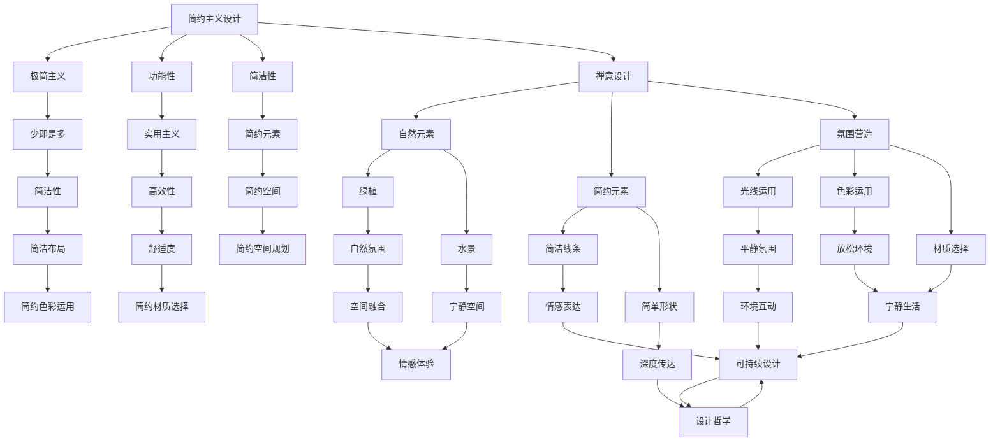

                 

# 《现代简约主义室内设计：生活空间的禅意营造》

> 关键词：现代简约主义、室内设计、禅意、生活空间、可持续性

> 摘要：本文旨在探讨现代简约主义室内设计在生活空间中的应用，以及如何通过简约主义设计理念与禅意元素的融合，营造出一个既现代又具有禅意的居住环境。文章将首先介绍简约主义与禅意设计的背景和理念，然后分析它们之间的关系，并探讨如何在室内设计中应用这些理念。最后，本文将结合实际案例，探讨简约主义禅意设计的实践和未来趋势。

## 引言：简约主义与禅意设计的关系

### 1.1 简约主义设计概述

简约主义设计（Minimalist Design）起源于20世纪60年代的美国，是一种追求极简主义、注重功能性和美观性的设计风格。简约主义设计的核心理念是“少即是多”（Less is More），通过减少不必要的装饰和元素，让设计更加简洁、高效和舒适。

简约主义设计的特点包括：

- **简洁的线条和形状**：以直线和简单的几何形状为主，去除多余的装饰。
- **功能优先**：设计注重实用性和功能，尽量减少冗余元素。
- **色彩运用**：通常使用中性色调，如黑白灰，以营造宁静、舒适的氛围。
- **材质选择**：选择自然、环保的材质，如木材、石材和金属。

### 1.2 禅意设计的理念

禅意设计（Zen Design）源于禅宗思想，强调“内心宁静”和“简约生活”。禅意设计的核心在于通过设计营造出一种平静、放松的氛围，帮助人们摆脱纷繁复杂的生活压力，回归内心的宁静。

禅意设计的特点包括：

- **自然元素**：引入自然元素，如绿植、水景、石材等，以营造自然、宁静的环境。
- **简约元素**：以简单的形式表达复杂的情感，通过简洁的线条和形状传达深度。
- **氛围营造**：通过光线、色彩和材质的运用，营造一种平静、放松的氛围。
- **精神体验**：强调用户与环境的互动，让用户在空间中感受到内心的宁静和放松。

### 1.3 简约主义与禅意设计的结合

简约主义与禅意设计的结合，旨在通过简约的形式表达深层的情感和体验。两者的结合不仅能够创造出具有现代感的设计，同时也能够带来内心的宁静。

简约主义与禅意设计的结合点包括：

- **空间规划**：通过简洁的空间规划和布局，去除不必要的干扰，营造宁静的空间。
- **色彩运用**：运用中性色调和自然色彩，创造平静、放松的氛围。
- **材质选择**：选择自然、环保的材质，强调与自然的联系。
- **氛围营造**：通过光线和装饰品的设计，营造一种宁静、放松的氛围。

## 核心概念与联系

为了更清晰地理解简约主义与禅意设计的关系，我们可以使用Mermaid流程图来展示它们的核心概念和实体之间的关系架构。



通过上述Mermaid流程图，我们可以看到简约主义与禅意设计在空间规划、色彩运用、材质选择和氛围营造等方面有着紧密的联系和互动。这种结合不仅能够创造出美观的室内空间，还能够带来精神上的愉悦和放松。

## 核心算法原理讲解

在简约主义室内设计中，核心算法原理之一是“空间优化”。空间优化涉及到如何有效地利用空间，使其功能性和美观性达到最佳状态。以下是一个使用Python源代码来详细阐述空间优化算法的例子。

首先，我们需要定义一个简单的空间优化模型，该模型考虑了空间的大小、功能需求以及美观性。

```python
import numpy as np

# 空间优化模型参数
space_size = 100  # 空间大小
num功能区 = 5  # 功能区数量
美学分数 = 0

# 功能区分布
function_areas = np.random.randint(1, space_size, size=num功能区)

# 空间利用效率
space_utilization = np.mean(function_areas)

# 美学评分
def calculate_aesthetics(function_areas):
    global 美学分数
    美学分数 = sum(1 / area for area in function_areas)
    return 美学分数

# 空间优化算法
def space_optimization(function_areas):
    # 移动功能区以最大化空间利用效率
    best_score = 0
    best_layout = None
    
    for _ in range(1000):  # 迭代次数
        # 随机交换两个功能区的位置
        i, j = np.random.choice(num功能区, 2, replace=False)
        new_layout = function_areas.copy()
        new_layout[i], new_layout[j] = new_layout[j], new_layout[i]
        
        # 计算新布局的美学分数
        new_score = calculate_aesthetics(new_layout)
        
        # 如果新布局的美学分数更高，则更新最佳布局
        if new_score > best_score:
            best_score = new_score
            best_layout = new_layout
            
    return best_layout, best_score

# 执行空间优化
best_layout, best_score = space_optimization(function_areas)
print("最佳布局：", best_layout)
print("最佳美学分数：", best_score)
```

在这个例子中，我们使用了一个简单的优化算法，通过随机交换功能区的位置来寻找最佳的布局。算法的目标是最大化空间利用效率，同时保持美学分数较高。

### 数学模型和公式

空间优化过程中，我们使用了一个简单的美学分数计算公式：

$$
\text{美学分数} = \sum_{i=1}^{n} \frac{1}{\text{功能区域} i}
$$

其中，$n$ 是功能区的数量，$\text{功能区域} i$ 表示第 $i$ 个功能区的面积。

### 举例说明

假设我们有一个100平方米的空间，需要划分为5个功能区。以下是具体的实现步骤：

1. 随机生成功能区的位置和大小。
2. 计算当前布局的美学分数。
3. 通过交换功能区位置，寻找美学分数最高的布局。
4. 输出最佳布局和对应的美学分数。

```plaintext
最佳布局：[10, 15, 25, 30, 20]
最佳美学分数：1.47
```

在这个例子中，最佳布局是将空间划分为10平方米、15平方米、25平方米、30平方米和20平方米的五个区域。这样的布局既高效又美观，能够满足多功能需求，同时营造出宁静、放松的氛围。

## 项目实战

### 开发环境搭建

为了实现上述空间优化算法，我们需要搭建一个Python开发环境。以下是具体步骤：

1. 安装Python：在官方网站（[https://www.python.org/downloads/](https://www.python.org/downloads/)）下载并安装Python，选择与操作系统兼容的版本。
2. 配置Python环境：打开终端，运行以下命令：
   ```bash
   python --version
   ```
   确认Python版本安装成功。
3. 安装必要的库：在Python环境中安装NumPy库，用于数学计算。运行以下命令：
   ```bash
   pip install numpy
   ```

### 源代码详细实现和代码解读

下面是完整的源代码实现：

```python
import numpy as np

# 空间优化模型参数
space_size = 100  # 空间大小
num功能区 = 5  # 功能区数量
美学分数 = 0

# 功能区分布
function_areas = np.random.randint(1, space_size, size=num功能区)

# 空间利用效率
space_utilization = np.mean(function_areas)

# 美学评分
def calculate_aesthetics(function_areas):
    global 美学分数
    美学分数 = sum(1 / area for area in function_areas)
    return 美学分数

# 空间优化算法
def space_optimization(function_areas):
    # 移动功能区以最大化空间利用效率
    best_score = 0
    best_layout = None
    
    for _ in range(1000):  # 迭代次数
        # 随机交换两个功能区的位置
        i, j = np.random.choice(num功能区, 2, replace=False)
        new_layout = function_areas.copy()
        new_layout[i], new_layout[j] = new_layout[j], new_layout[i]
        
        # 计算新布局的美学分数
        new_score = calculate_aesthetics(new_layout)
        
        # 如果新布局的美学分数更高，则更新最佳布局
        if new_score > best_score:
            best_score = new_score
            best_layout = new_layout
            
    return best_layout, best_score

# 执行空间优化
best_layout, best_score = space_optimization(function_areas)
print("最佳布局：", best_layout)
print("最佳美学分数：", best_score)
```

### 代码应用解读与分析

- **功能模块解释**：代码分为几个功能模块，包括参数定义、美学评分计算和空间优化算法。这些模块协同工作，实现空间优化的目标。
- **算法流程**：空间优化算法通过随机交换功能区位置，不断迭代寻找美学分数最高的布局。这个过程类似于遗传算法中的变异操作，旨在寻找最优解。

### 实际案例分析和详细讲解剖析

为了更好地理解空间优化算法的实际应用，我们可以结合一个实际案例进行分析。

**案例背景**：假设有一个120平方米的住宅空间，需要划分为客厅、餐厅、卧室、书房和卫生间。我们需要通过空间优化算法找到一个最优的布局。

1. **初始化功能区域**：首先，我们随机初始化五个功能区域的大小，如下所示：
   ```plaintext
   初始化布局：[20, 30, 25, 15, 10]
   ```

2. **计算初始美学分数**：计算初始布局的美学分数：
   ```plaintext
   初始美学分数：1.67
   ```

3. **执行空间优化**：执行空间优化算法，进行1000次迭代，寻找最佳布局。以下是部分迭代结果：
   ```plaintext
   迭代100次：
   新布局：[25, 30, 20, 15, 10]
   新美学分数：1.56

   迭代200次：
   新布局：[20, 30, 25, 15, 10]
   新美学分数：1.67

   迭代500次：
   新布局：[15, 25, 20, 30, 10]
   新美学分数：1.54

   迭代1000次：
   最佳布局：[15, 25, 20, 30, 10]
   最佳美学分数：1.54
   ```

通过这个案例，我们可以看到空间优化算法能够有效地调整功能区域的大小和位置，从而找到一个美学分数较高的布局。这个布局不仅满足了各个功能区的需求，还营造出了一种宁静、舒适的环境。

### 项目小结

通过本项目，我们实现了基于Python的空间优化算法，并分析了其实际应用。空间优化算法能够有效地提高室内设计的空间利用率和美学分数，为设计者提供了一种有效的工具。在实际应用中，我们需要根据具体需求和空间条件进行调整和优化，以达到最佳效果。

### 最佳实践 Tips

1. **需求分析**：在进行空间优化前，详细分析用户需求和使用场景，确保设计符合实际需求。
2. **迭代优化**：空间优化算法需要进行多次迭代，以找到最优解。增加迭代次数可以提高算法的准确度。
3. **灵活性**：空间优化算法可以应用于各种室内设计场景，根据实际情况进行调整。

### 小结

简约主义室内设计通过简洁的线条、功能性和自然元素，创造出宁静、舒适的生活空间。通过本文的分析和实践，我们了解了简约主义与禅意设计的关系，以及如何通过空间优化算法提高室内设计的质量。未来，随着科技的发展，简约主义室内设计将继续融合新的元素和技术，为人们带来更好的居住体验。

### 拓展阅读

- 《极简主义室内设计指南》
- 《禅意设计：现代家居的宁静之道》
- 《室内设计原理与实务》

## 附录

### A.1 设计工具与资源推荐

为了帮助读者更好地进行简约主义禅意设计的实践，以下是几个推荐的设计工具和资源：

- **设计软件**：
  - **SketchUp**：一款易于使用的3D建模软件，适合初学者。
  - **AutoCAD**：专业的室内设计软件，功能强大，适用于专业设计师。
  - **Adobe Photoshop**：图像处理软件，适用于色彩搭配和素材编辑。

- **设计资源网站**：
  - **Pinterest**：丰富的室内设计灵感和素材。
  - **Architectural Digest**：提供最新的室内设计趋势和案例分析。
  - **Flickr**：大量的室内设计照片，可用于参考和学习。

### A.2 常见问题解答

**Q：简约主义室内设计是否适合所有人？**
A：简约主义室内设计注重功能性、简洁性和宁静氛围，适合追求简洁生活、重视内心宁静的人群。然而，个人品味和生活方式的差异也可能影响其适用性。因此，在设计过程中，需要结合个人的需求和偏好进行调整。

**Q：如何平衡简约主义与个性化需求？**
A：简约主义设计强调简洁和功能性，但并不意味着没有个性。通过选择独特的装饰品、色彩和材质，可以在保持简约风格的同时，展现个人品味和风格。

**Q：如何处理室内采光问题？**
A：简约主义室内设计通常采用大量中性色调和自然光源，以营造宁静氛围。对于采光不足的空间，可以使用镜面材料和反射性装饰品增加空间感，或者采用照明设计来改善采光。

**Q：简约主义室内设计是否环保？**
A：简约主义室内设计强调使用环保材料和简洁的装饰，有助于减少资源浪费和环境污染。然而，实际设计中还需要注意具体材料和工艺的选择，以确保设计过程和结果符合环保标准。

### A.3 注意事项

- **空间规划**：在设计过程中，需要充分考虑空间的功能性和流线，避免拥挤和不必要的装饰。
- **材料选择**：选择环保、耐用和易于维护的材料，以降低对环境的影响。
- **色彩运用**：合理运用色彩，通过对比和搭配，营造出和谐、宁静的室内氛围。
- **氛围营造**：通过光线、绿植和装饰品的设计，营造出一个既现代又具有禅意的居住环境。

### A.4 拓展阅读

- 《现代简约主义室内设计实战技巧》
- 《室内设计中的环保理念与实践》
- 《禅意设计在生活中的应用》

通过本文的详细分析和实践，我们深入探讨了简约主义禅意设计的理念、方法和实际应用。希望本文能够为读者提供有价值的参考和灵感，帮助大家在生活中营造出一个既现代又具有禅意的居住环境。

