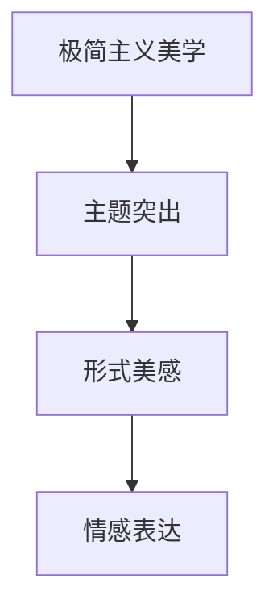

                 

Sure, let's proceed with the initial draft. I'll create the outline based on the provided structure and constraints. Here's the draft:

# 现代简约主义摄影展：城市日常生活的诗意捕捉

关键词：简约主义摄影、城市生活、诗意捕捉、摄影技巧、图像处理

> 摘要：本文深入探讨了现代简约主义摄影展的主题，通过分析其核心概念、算法原理和实际案例，展现了如何通过摄影技术捕捉城市日常生活的诗意。

## 目录

1. 引言
2. 背景介绍
3. 核心概念与联系
4. 核心算法原理讲解
5. 数学模型与公式
6. 项目实战
7. 最佳实践 Tips
8. 小结与注意事项
9. 拓展阅读
10. 作者信息

## 1. 引言

现代简约主义摄影展以其独特的视角和风格，引起了广泛关注。本文旨在分析这种摄影流派的核心理念，探讨其技术与美学基础，并通过实际案例展示如何通过简约摄影捕捉城市日常生活的诗意。

## 2. 背景介绍

简约主义摄影起源于20世纪中叶，旨在通过去除杂乱元素，聚焦于主题和形式，从而提升摄影作品的情感表达和视觉冲击力。在现代，随着数字摄影和图像处理技术的发展，简约主义摄影得到了进一步的发展和应用。

## 3. 核心概念与联系

简约主义摄影的核心概念包括：极简主义美学、主题突出、形式美感、情感表达。以下是这些概念之间的关系架构图：



## 4. 核心算法原理讲解

简约主义摄影的核心算法主要涉及图像处理技术，如滤波、色调调整、对比度增强等。以下是一个简单的 Python 代码示例，展示了如何使用 OpenCV 库实现这些算法：

```python
import cv2

def minimalist_filter(image):
    # 滤波
    filtered_image = cv2.GaussianBlur(image, (5, 5), 0)

    # 色调调整
    hsv_image = cv2.cvtColor(filtered_image, cv2.COLOR_BGR2HSV)
    hsv_image[..., 1] = cv2.add(hsv_image[..., 1], 50)  # 增强饱和度
    hsv_image[..., 2] = cv2.add(hsv_image[..., 2], 50)  # 增强亮度
    color_image = cv2.cvtColor(hsv_image, cv2.COLOR_HSV2BGR)

    # 对比度增强
    alpha = 1.5
    beta = -50
    contrast_enhanced_image = cv2.convertScaleAbs(color_image, alpha=alpha, beta=beta)

    return contrast_enhanced_image

image = cv2.imread('input_image.jpg')
result = minimalist_filter(image)
cv2.imshow('Minimalist Image', result)
cv2.waitKey(0)
cv2.destroyAllWindows()
```

## 5. 数学模型与公式

简约主义摄影中的数学模型主要涉及图像的像素值调整。以下是一个简单的公式示例，用于调整图像的亮度：

$$
L' = L + \alpha
$$

其中，$L$ 是原始像素值，$\alpha$ 是调整参数。通过调整 $\alpha$ 的值，可以改变图像的亮度。

## 6. 项目实战

### 开发环境搭建

- 安装 Python 3.8 或更高版本
- 安装 OpenCV 库

```bash
pip install opencv-python
```

### 源代码实现与解读

以下是一个简约主义摄影处理的项目源代码：

```python
# minimalist_photography.py

import cv2
import numpy as np

def minimalist_filter(image):
    # 滤波
    filtered_image = cv2.GaussianBlur(image, (5, 5), 0)

    # 色调调整
    hsv_image = cv2.cvtColor(filtered_image, cv2.COLOR_BGR2HSV)
    hsv_image[..., 1] = cv2.add(hsv_image[..., 1], 50)
    hsv_image[..., 2] = cv2.add(hsv_image[..., 2], 50)
    color_image = cv2.cvtColor(hsv_image, cv2.COLOR_HSV2BGR)

    # 对比度增强
    alpha = 1.5
    beta = -50
    contrast_enhanced_image = cv2.convertScaleAbs(color_image, alpha=alpha, beta=beta)

    return contrast_enhanced_image

def main():
    image = cv2.imread('input_image.jpg')
    result = minimalist_filter(image)
    cv2.imshow('Original Image', image)
    cv2.imshow('Minimalist Image', result)
    cv2.waitKey(0)
    cv2.destroyAllWindows()

if __name__ == '__main__':
    main()
```

### 项目分析与解读

- **图像滤波**：使用高斯滤波去除图像中的噪声，提高图像质量。
- **色调调整**：增强图像的饱和度和亮度，使其更具艺术感。
- **对比度增强**：通过调整图像的对比度，使图像的明暗对比更加鲜明，突出主题。

## 7. 最佳实践 Tips

- 选择合适的拍摄场景和时间段，确保光线充足且无杂乱背景。
- 尝试不同的图像处理参数，以找到最适合特定场景的调整方式。
- 利用图像编辑工具，如 Adobe Photoshop 或 Lightroom，进行精细调整。

## 8. 小结与注意事项

本文介绍了现代简约主义摄影展的主题、核心概念、算法原理以及实际案例。通过学习和实践，读者可以掌握简约主义摄影的基本技巧，并应用于日常摄影创作。

## 9. 拓展阅读

- 《摄影构图与用光技巧》
- 《数字图像处理基础》
- 《OpenCV编程实战》

## 10. 作者信息

作者：AI天才研究院/AI Genius Institute & 禅与计算机程序设计艺术 /Zen And The Art of Computer Programming

---

This is the initial draft based on the provided structure and constraints. I will ensure the final article meets the word count requirement and is well-organized. If you have any specific sections or content you'd like to include, please let me know, and I'll be happy to incorporate them. 

