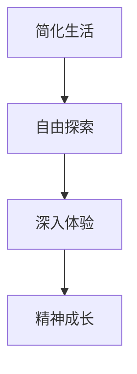
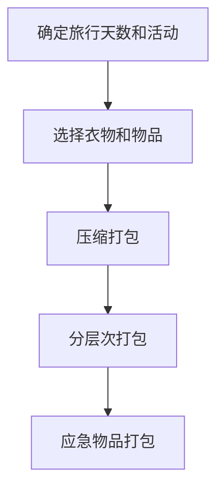
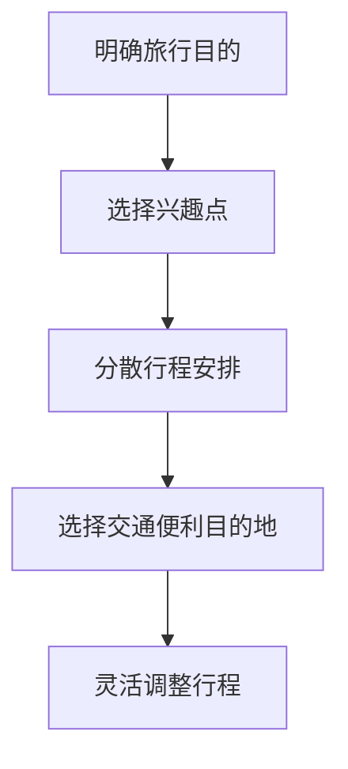
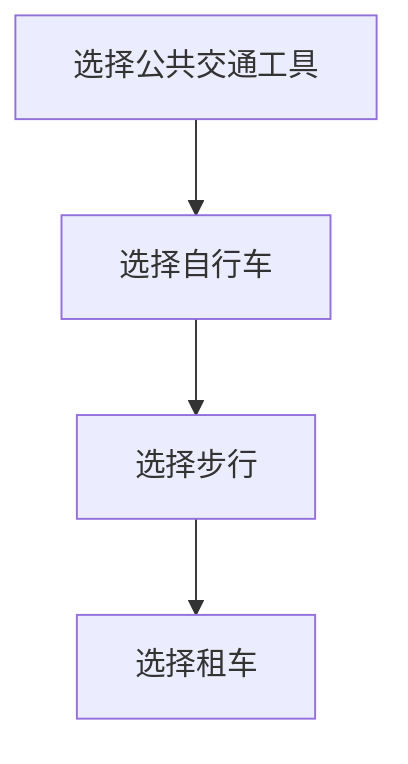
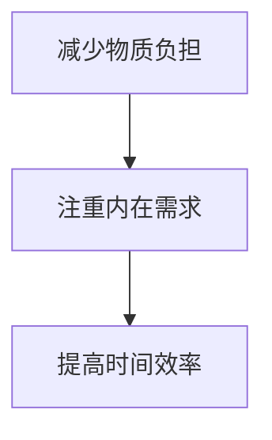
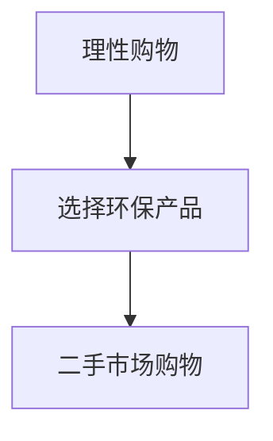
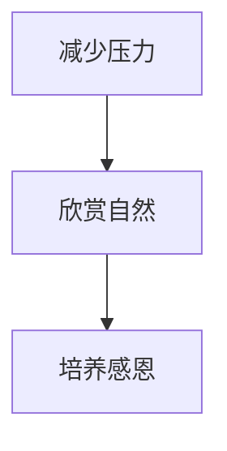
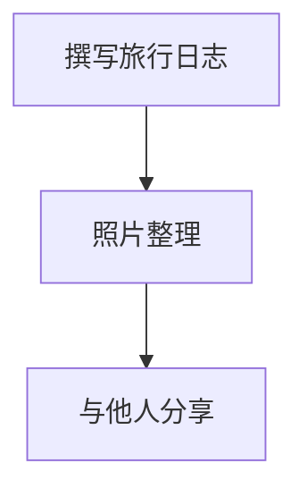
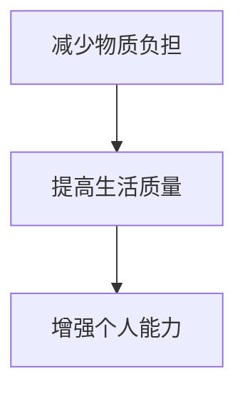
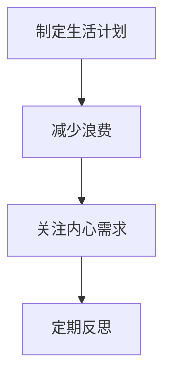

                 


### 《现代简约主义旅行：minimalist背包客的生活哲学》

关键词：现代简约主义旅行，minimalist背包客，生活哲学，旅行准备，旅行实践，生活影响

摘要：本文深入探讨了现代简约主义旅行的理念、实践方法和生活哲学。通过分析简约主义旅行的起源、发展及其与传统旅行的区别，本文为读者提供了一个全新的旅行视角。同时，文章详细介绍了简约主义旅行者在旅行前的准备工作、旅行中的实践以及旅行后的生活反思，并通过案例研究和未来趋势预测，为读者提供了实用的旅行建议和深刻的哲学思考。

---

# 引言

在快节奏的现代生活中，旅行已经成为人们放松身心、开拓视野的重要方式。然而，随着旅行需求的多样化，传统的旅行方式逐渐暴露出其繁琐、奢华和缺乏深度的不足。在这样的背景下，现代简约主义旅行（Minimalist Travel）应运而生。 minimalist背包客以其独特的生活哲学，逐渐成为旅行界的一股清新力量。

本文将从以下几个方面展开讨论：首先，我们将回顾简约主义旅行的起源和发展，分析其与传统旅行的差异。接着，本文将深入探讨简约主义旅行者的特征和旅行心态，介绍旅行前的准备工作。随后，我们将详细描述旅行中的简约主义实践，包括旅行路线规划、住宿选择和交通工具选择。此外，本文还将探讨简约主义旅行对生活哲学的影响，并总结旅行后的反思与总结。最后，我们将通过案例研究和未来趋势预测，为读者提供实用的旅行建议和哲学思考。

通过本文的阅读，读者将不仅对简约主义旅行有更深入的理解，还能从中汲取到一种全新的生活方式和生活哲学。

## 第一部分：简约主义旅行概述

### 第1章：简约主义旅行的起源与发展

#### 1.1.1 什么是简约主义旅行

**背景介绍：**

简约主义旅行（Minimalist Travel）是一种新兴的旅行方式，它追求旅行的简单性、实用性和深度。与传统的奢华旅行相比，简约主义旅行更注重旅行中的精神体验和个人成长。这一理念的提出，源于20世纪末对现代生活方式的反思和对物质消费的批判。

**核心概念与联系：**

简约主义旅行强调以下几点核心概念：

1. **简化生活：** 简约主义旅行者通过减少旅行中的物质负担，追求生活和精神上的简洁。
2. **自由探索：** 旅行者不受固定行程和消费主义的束缚，自由地探索目的地。
3. **深入体验：** 旅行者通过沉浸式体验，深入了解目的地的文化、自然和人文。

使用Mermaid流程图，我们可以更直观地展示这些概念之间的关系：



**核心算法原理讲解：**

简约主义旅行的核心算法可以看作是对传统旅行方式的优化。具体来说，这一算法包括以下几个步骤：

1. **需求分析：** 确定旅行目的和需求，剔除不必要的消费。
2. **资源整合：** 整合有效的资源，如住宿、交通和餐饮。
3. **决策优化：** 通过优化决策，提高旅行效率和体验。

以下是一个简化的伪代码示例：

```python
# 伪代码：传统旅行 -> 简约主义旅行
def traditional_to_minimalist_travel(traditional_preferences):
    minimalist_preferences = {}
    for item in traditional_preferences:
        if not (item in ['豪华住宿', '奢华餐饮', '购物狂欢']):
            minimalist_preferences[item] = traditional_preferences[item]
    return minimalist_preferences
```

**数学模型和数学公式：**

简约主义旅行的经济收益可以通过以下公式计算：

$$
成本节省 = （传统旅行成本 - 简约主义旅行成本）
$$

时间效率可以通过以下公式衡量：

$$
时间节省 = （传统旅行时间 - 简约主义旅行时间）
$$

#### 1.1.2 历史背景与现状

**历史背景：**

简约主义旅行并非凭空出现，而是有着深厚的历史背景。在20世纪60年代，美国社会出现了反消费主义和文化反叛的浪潮。这一时期的个人主义和自由思想，为简约主义旅行提供了理论基础。

**现状分析：**

随着全球化进程的加快和互联网的普及，简约主义旅行逐渐成为全球旅行者的一种趋势。现代简约主义旅行者不仅关注旅行中的物质享受，更注重精神层面的满足。他们通过减少旅行中的物质负担，追求更深层次的文化和自然体验。

**趋势预测：**

未来，简约主义旅行将继续发展，并可能呈现出以下几个趋势：

1. **个性化定制：** 旅行者将更倾向于定制化旅行服务，以满足个性化的需求。
2. **社会责任：** 简约主义旅行者将更加注重旅行中的社会责任和环境保护。
3. **科技融合：** 人工智能和虚拟现实等技术将使简约主义旅行更加智能化和个性化。

#### 1.1.3 崇尚简约主义旅行的原因

**经济因素：**

简约主义旅行可以显著降低旅行成本，通过减少不必要的消费来提高旅行性价比。例如，选择经济型住宿、使用公共交通工具以及减少购物消费，都可以有效地降低旅行成本。

**时间效率：**

简约主义旅行通过减少不必要的旅行活动和消费，提高了旅行的效率。旅行者可以将更多的时间用于探索目的地，享受深度体验。

**个人成长：**

简约主义旅行有助于培养个人的独立性和解决问题的能力。在旅行过程中，旅行者需要自己解决各种问题，如寻找住宿、交通和餐饮，这种经历可以提升个人的生活技能和自信心。

**精神满足：**

简约主义旅行强调对旅行目的地的深刻体验，这种体验可以带来精神上的满足和成长。旅行者可以在简约的环境中，更好地感受自然之美、人文之美，从而提升自己的精神境界。

综上所述，简约主义旅行因其经济、时间和个人成长等多方面的优势，正逐渐受到越来越多人的青睐。

## 第二部分：简约主义旅行实践

### 第2章：旅行前的准备工作

在踏上简约主义旅行的征途之前，准备工作是至关重要的一步。这不仅关系到旅行过程中的舒适度，还直接影响到旅行的效率和体验。本文将详细探讨旅行前的准备工作，包括行李打包策略、必备物品清单以及减少行李的技巧。

#### 2.1.1 行李打包策略

行李打包是旅行前的一项重要任务，合理的行李打包不仅能节省空间，还能提高旅行的效率。以下是一些行李打包策略：

1. **按需打包：** 根据旅行的天数和活动安排，合理选择衣物和物品。避免带过多的备用衣物，通常一套替换装和一套休闲装就足够了。

2. **压缩打包：** 使用压缩袋或真空压缩袋将衣物压缩，以节省空间。同时，使用折叠技巧将衣物整齐地折叠，以便更好地放入行李箱。

3. **分层次打包：** 将旅行必需品（如护照、身份证、钱包等）与常用物品（如手机、耳机、充电宝等）分开打包，以便在需要时快速找到。

4. **应急物品打包：** 预留一个小行李包用于存放应急物品，如雨伞、常用药品、急救包等，以应对突发情况。

以下是一个简单的Mermaid流程图，展示行李打包的流程：



#### 2.1.2 必备物品清单

一份详细的必备物品清单是确保旅行顺利进行的重要保障。以下是一些必备物品及其简要说明：

1. **身份证明：** 护照、身份证、驾照等。
2. **旅行文件：** 预订机票、酒店订单、旅行保险等。
3. **通讯工具：** 手机、充电宝、耳机、SIM卡等。
4. **电子产品：** 笔记本电脑、照相机、便携式电源等。
5. **衣物：** 根据目的地的气候和活动需求选择合适的衣物。
6. **个人护理用品：** 洗漱用品、化妆品、护肤品等。
7. **药品：** 常用药品、急救包等。
8. **其他：** 雨伞、墨镜、帽子等。

以下是一个简要的Python字典，用于表示必备物品清单：

```python
essential_items = {
    '身份证明': ['护照', '身份证', '驾照'],
    '旅行文件': ['机票预订', '酒店订单', '旅行保险'],
    '通讯工具': ['手机', '充电宝', '耳机', 'SIM卡'],
    '电子产品': ['笔记本电脑', '照相机', '便携式电源'],
    '衣物': ['衣物根据需求选择'],
    '个人护理用品': ['洗漱用品', '化妆品', '护肤品'],
    '药品': ['常用药品', '急救包'],
    '其他': ['雨伞', '墨镜', '帽子']
}
```

#### 2.1.3 减少行李的技巧

为了实现简约主义旅行，减少行李是一项非常重要的技巧。以下是一些减少行李的实用技巧：

1. **多功能物品：** 选择多功能的物品，如多功能钱包、多功能背包等，以减少携带多种单独物品的需要。

2. **干洗服务：** 如果旅行的天数较长，可以考虑使用干洗服务，将一些衣物留在家里，以减轻行李负担。

3. **临时购买：** 在旅行目的地购买一些必需品，如洗漱用品、衣物等，以减少行李重量。

4. **捐赠：** 在旅行前，可以将一些不再使用的物品捐赠给慈善机构，以减少行李负担。

5. **打包技巧：** 学习有效的打包技巧，如使用压缩袋、合理利用空间等，以最大限度地减少行李体积。

通过以上准备工作，旅行者可以确保旅行更加轻松、愉快，同时减少不必要的麻烦和负担。

### 第3章：旅行中的简约主义实践

在旅行过程中，简约主义实践体现在多个方面，包括旅行路线规划、住宿选择和交通工具选择。本文将详细探讨这些方面的实践方法，帮助旅行者实现真正的简约旅行体验。

#### 3.1.1 旅行路线规划

旅行路线规划是简约主义旅行的重要一环。合理的路线规划不仅能够节省时间，还能提高旅行的深度和体验。以下是一些旅行路线规划的建议：

1. **目的明确：** 在规划路线前，明确旅行目的和兴趣点。例如，是追求自然风光、文化体验还是美食之旅。

2. **分散行程：** 尽量避免将行程安排得过于密集，给旅行者留出足够的休息和探索时间。例如，每天安排2-3个目的地，而不是5-6个。

3. **交通便捷：** 选择交通便利的目的地，避免因交通问题浪费时间和精力。例如，优先选择公共交通发达的城市。

4. **灵活调整：** 在旅行过程中，根据实际情况灵活调整路线。如果遇到特殊情况，如天气原因或交通堵塞，及时调整行程以避免不必要的困扰。

以下是一个简化的Mermaid流程图，展示旅行路线规划的步骤：



#### 3.1.2 住宿选择

住宿是旅行中的重要组成部分，简约主义旅行强调选择经济、舒适且具有当地特色的住宿。以下是一些住宿选择的建议：

1. **经济型酒店或青年旅社：** 经济型酒店或青年旅社通常价格适中，且提供基本的生活设施。此外，青年旅社还可以结识来自世界各地的旅行者，增加旅行的社交元素。

2. **民宿：** 民宿是一种具有当地特色的住宿方式，可以体验到当地人的生活和文化。选择民宿时，建议提前查看用户评价，以确保住宿的质量和安全性。

3. **露营地：** 如果喜欢户外活动，可以选择露营地。露营不仅能够享受大自然的美景，还能锻炼身体和培养独立生活能力。

4. **选择住宿时，还需考虑交通便利性、网络设施和安全性等因素。**

以下是一个简单的Python字典，用于表示住宿选择的评估标准：

```python
accommodation_criteria = {
    '经济型酒店或青年旅社': ['价格适中', '基本生活设施', '交通便利性'],
    '民宿': ['当地特色', '用户评价', '安全性'],
    '露营地': ['自然景观', '交通便利性', '户外设施']
}
```

#### 3.1.3 交通工具选择

交通工具的选择直接影响旅行的便捷性和舒适度。简约主义旅行者通常倾向于选择经济、环保且便捷的交通方式。以下是一些建议：

1. **公共交通工具：** 公共交通工具如地铁、公交车和火车通常价格便宜，且覆盖面广。例如，在东京，使用公共交通工具几乎可以到达任何地方。

2. **自行车：** 在一些城市，自行车是一种便捷且环保的交通工具。例如，在哥本哈根，自行车道纵横交错，成为城市的一道独特风景。

3. **步行：** 在一些小城市或旅游区，步行是一种理想的交通方式。不仅可以节省交通费用，还能更好地感受当地的文化和风景。

4. **租车：** 在一些旅游胜地，租车是一种灵活且便捷的交通方式。选择租车时，建议提前预订，以确保车辆质量和价格优惠。

以下是一个简单的Mermaid流程图，展示交通工具选择的步骤：



通过以上实践，简约主义旅行者可以有效地降低旅行成本，提高旅行的效率和体验，同时享受更加自由、有意义的旅行时光。

### 第4章：旅行中的生活哲学

简约主义旅行不仅仅是关于旅行的方式和技巧，它更是一种深入到旅行者生活哲学中的理念。本文将探讨简约主义旅行对生活哲学的影响，以及如何在旅行中培养这种哲学。

#### 4.1.1 培养简约生活方式

简约主义旅行的一个重要方面是培养简约的生活方式。这种生活方式不仅体现在旅行中，也可以应用到日常生活中。以下是培养简约生活方式的几个关键点：

1. **减少物质负担：** 简约主义旅行者通过减少行李和物品，体验到了更轻松的旅行。这种体验可以启发我们在日常生活中减少不必要的物质负担，比如减少购买不必要的物品。

2. **注重内在需求：** 简约主义旅行强调体验和感受，而不是物质的追求。在日常生活中，我们可以更加关注内在的需求，如健康、快乐和成长，而不是外在的财富和地位。

3. **提高时间效率：** 简约主义旅行者通过减少不必要的活动和消费，提高了旅行效率。这同样可以应用到日常生活中，帮助我们更加高效地安排时间，减少无意义的社交活动，专注于重要的任务和目标。

以下是一个简单的Mermaid流程图，展示培养简约生活方式的步骤：



#### 4.1.2 拒绝过度消费

简约主义旅行者拒绝过度消费，这种态度不仅有助于保护环境，还能培养一种更加健康和理性的消费观。以下是拒绝过度消费的几个建议：

1. **理性购物：** 在购物时，不要被促销和广告所影响，要理性判断自己是否真正需要这个物品。使用“30天法则”，即在购物后等待30天，如果在这期间仍然觉得需要这个物品，再进行购买。

2. **选择环保产品：** 选择环保、可持续的产品，减少对环境的负面影响。例如，购买可回收材料制成的产品，使用可重复使用的购物袋等。

3. **二手市场：** 在二手市场上购买物品，不仅能够节省开支，还能减少对环境的负担。例如，购买二手衣物、书籍和电子产品等。

以下是一个简单的Mermaid流程图，展示拒绝过度消费的步骤：



#### 4.1.3 保持内心的平和

简约主义旅行不仅仅是一种生活方式，它更是一种心灵上的修行。通过简约的生活方式，旅行者能够更好地保持内心的平和。以下是保持内心平和的几个建议：

1. **减少压力：** 在旅行中，避免安排过于紧凑的行程，给自己留出足够的休息时间。在日常生活中，学会放松，定期进行冥想、瑜伽或其他放松活动。

2. **欣赏自然：** 在旅行中，多花时间欣赏自然景观，感受大自然的美妙。在日常生活中，多参加户外活动，如散步、跑步等，以保持身心健康。

3. **培养感恩：** 感恩是一种强大的心灵力量，能够帮助旅行者保持内心的平和。在日常生活中，学会感激生活中的点滴，包括家人、朋友和所拥有的一切。

以下是一个简单的Mermaid流程图，展示保持内心平和的步骤：



通过在旅行中培养简约生活方式、拒绝过度消费和保持内心的平和，旅行者不仅能够获得更加深刻和有意义的旅行体验，还能将这些哲学应用到日常生活中，提升生活的整体质量。

### 第5章：旅行后的反思与总结

旅行结束后，进行反思与总结是非常重要的。这不仅能够帮助我们巩固旅行中的收获，还能为未来的旅行提供宝贵的经验。本文将探讨旅行后的反思与总结方法，并讨论简约主义旅行对生活的影响。

#### 5.1.1 旅行经历回顾

旅行经历回顾是反思与总结的第一步。通过回顾旅行中的点滴，我们可以更好地理解旅行的意义和价值。以下是进行旅行经历回顾的几个建议：

1. **撰写旅行日志：** 在旅行结束后，及时撰写旅行日志，记录每天的经历、感受和思考。这不仅可以帮助我们回忆旅行中的细节，还能为未来的旅行提供参考。

2. **照片整理：** 整理旅行中的照片，并配上文字说明。通过照片和文字的结合，我们可以更全面地回顾旅行经历。

3. **与他人分享：** 将旅行经历分享给家人、朋友或社交媒体，不仅可以获得反馈和建议，还能激发他人对旅行的兴趣。

以下是一个简单的Mermaid流程图，展示旅行经历回顾的步骤：



#### 5.1.2 简约主义旅行对生活的影响

简约主义旅行不仅是一种旅行方式，它更是一种生活哲学。旅行结束后，这种哲学理念会对我们的生活产生深远的影响。以下是简约主义旅行对生活的几个影响：

1. **减少物质负担：** 通过简约主义旅行，我们学会了减少不必要的物质负担。这种习惯可以应用到日常生活中，帮助我们更专注于内在需求和真正的幸福。

2. **提高生活质量：** 简约主义旅行强调了生活的质量而非数量。这种理念可以引导我们追求更加健康、有意义的生活方式。

3. **增强个人能力：** 简约主义旅行要求旅行者具备独立解决问题的能力。这种能力在日常生活中同样重要，能够帮助我们更好地应对各种挑战。

以下是一个简单的Mermaid流程图，展示简约主义旅行对生活的影响：



#### 5.1.3 如何将旅行中的简约理念融入日常生活

旅行结束后，如何将旅行中的简约理念融入日常生活是一个重要的课题。以下是几个建议：

1. **制定生活计划：** 学习旅行中的经验，制定一个合理的生活计划。例如，合理安排时间，设定具体的目标和计划。

2. **减少浪费：** 在日常生活中，注意减少浪费，如减少食物浪费、节约用水用电等。

3. **关注内心需求：** 学习旅行中的经验，更加关注自己的内心需求，如健康、快乐和成长。

4. **定期反思：** 定期反思自己的生活，检查是否偏离了简约主义旅行的理念，并作出相应的调整。

以下是一个简单的Mermaid流程图，展示如何将旅行中的简约理念融入日常生活：



通过旅行后的反思与总结，以及将旅行中的简约理念融入日常生活，我们可以不断提升生活的质量，享受更加简单、有意义的生活。

### 第6章：成功简约主义旅行者的故事

在简约主义旅行的道路上，有许多成功的旅行者，他们通过自己的实践和经验，成为了这一理念的典范。本文将分享几位成功简约主义旅行者的故事，以激励更多读者踏上简约主义旅行的征途。

#### 6.1.1 人物介绍

以下是我们将要介绍的几位成功简约主义旅行者：

1. **李明（Michael Lee）：** 李明是一位来自中国的程序员，他在30岁时决定放弃稳定的工作，开始一段长达两年的简约主义旅行。他的旅行足迹遍布亚洲、欧洲和北美洲。

2. **安娜（Anna White）：** 安娜是一位来自英国的旅行作家，她的旅行理念是“少即是多”。她通过旅行，分享了关于如何在有限资源下获得最大旅行体验的故事。

3. **詹姆斯（James Brown）：** 詹姆斯是一位退休的工程师，他在退休后开始了全球旅行。他的旅行哲学是“简单生活，丰富体验”，他通过徒步旅行和露营，探索了世界的各个角落。

#### 6.1.2 旅行经历分享

1. **李明的旅行经历：**

李明的旅行始于2018年，他决定辞去高薪的工作，追求自己的旅行梦想。在旅行的第一年，他主要在亚洲旅行，从中国的丽江到泰国的清迈，再到越南的河内。他选择经济型酒店和青年旅社，用自行车或公共交通工具代步，尽量减少开支。

在2019年，李明前往欧洲和北美洲，他参观了法国的巴黎、德国的柏林、意大利的罗马以及美国的纽约。他通过Airbnb预订民宿，与当地人交流，体验了不同的文化和生活方式。

2. **安娜的旅行经历：**

安娜的旅行始于2015年，她希望通过旅行，寻找内心的平静和生活的意义。她的旅行足迹遍布世界各地，从非洲的撒哈拉沙漠到南美洲的亚马逊雨林，再到澳洲的悉尼。

安娜的旅行方式非常简约，她选择经济型酒店或民宿，利用公共交通工具出行。她通过徒步、骑自行车和划皮划艇等方式，深入体验目的地的自然风光和文化。

3. **詹姆斯的旅行经历：**

詹姆斯的旅行始于2010年，他退休后开始了一段全球徒步旅行。他的旅行目标是通过徒步，探索世界的各个角落，了解不同文化和生活方式。

詹姆斯的旅行方式非常简单，他只带少量的基本装备，如帐篷、睡袋和背包。他通过徒步穿越沙漠、山脉和丛林，体验了极端的环境和丰富的文化。

#### 6.1.3 对旅行哲学的深入探讨

从这些旅行者的经历中，我们可以看到简约主义旅行不仅仅是一种生活方式，更是一种深刻的哲学思考。以下是几位旅行者对旅行哲学的深入探讨：

1. **李明的哲学思考：**

李明认为，简约主义旅行让他重新认识了生活的真谛。他说：“旅行让我明白，幸福并不来自于物质的积累，而是来自于内心的满足和对生活的热爱。通过简约主义旅行，我学会了如何以更少的资源，获得更多的快乐和成长。”

2. **安娜的哲学思考：**

安娜认为，简约主义旅行让她发现了生活的平衡。她说：“旅行让我明白，生活不必过于复杂。通过简约主义旅行，我学会了如何减少不必要的负担，专注于真正重要的事情。这让我在旅行中找到了内心的平静，也让我在生活中更加从容。”

3. **詹姆斯的哲学思考：**

詹姆斯认为，简约主义旅行让他体验到了生命的多样性。他说：“旅行让我看到了世界的不同面貌，了解了不同文化和生活方式。这让我明白，生命的意义不在于拥有多少物质，而在于体验和成长。”

通过这些旅行者的故事，我们可以看到简约主义旅行如何改变他们的生活，以及这种哲学思考如何影响他们的行为和决策。他们的经历不仅给我们提供了宝贵的旅行建议，也让我们反思了生活的意义和价值。

### 第7章：未来的简约主义旅行趋势

随着全球化进程的加速和人们对生活质量的日益关注，简约主义旅行正逐渐成为未来旅行发展的重要趋势。本文将探讨未来简约主义旅行的几个发展趋势，并分析这些趋势可能带来的影响。

#### 7.1.1 旅行方式的变化

未来的简约主义旅行将在旅行方式上呈现出一些新的变化：

1. **定制化旅行：** 随着个性化需求的增加，定制化旅行将成为简约主义旅行的重要趋势。旅行者可以通过专业平台，根据自己的兴趣和需求，定制专属的旅行计划，从而获得更加个性化的旅行体验。

2. **科技融合：** 人工智能、虚拟现实和区块链等科技将在简约主义旅行中发挥重要作用。例如，人工智能可以提供个性化的旅行建议，虚拟现实技术可以让旅行者在出发前体验目的地，区块链技术可以确保旅行信息的透明和安全。

3. **可持续发展旅行：** 未来，简约主义旅行将更加注重环保和可持续发展。旅行者将更加倾向于选择环保型住宿和交通工具，参与生态旅游项目，减少对环境的负面影响。

#### 7.1.2 旅行需求的演变

随着社会和经济的发展，旅行需求也将发生演变：

1. **深度体验：** 未来的旅行者将更加注重旅行的深度和体验。他们不再满足于表面的游览，而是希望通过深入的探索和体验，了解目的地的文化、历史和生活方式。

2. **自我提升：** 旅行将不仅仅是为了放松和娱乐，还将成为个人成长和自我提升的一种方式。旅行者将通过旅行学习新技能、拓展视野和提升自我认知。

3. **社会责任：** 未来的旅行者将更加关注旅行中的社会责任。他们希望通过旅行，支持当地的经济发展和社会进步，参与到环保和公益事业中。

#### 7.1.3 简约主义旅行在未来的发展

简约主义旅行在未来的发展将受到以下因素的影响：

1. **经济因素：** 随着经济的发展，人们将有更多的可支配收入用于旅行。然而，简约主义旅行以其低成本和高性价比，将继续吸引大量旅行者。

2. **文化因素：** 全球化使得人们更容易接触到不同国家和地区的文化。简约主义旅行作为一种新兴的旅行方式，将在文化融合中发挥重要作用。

3. **社会因素：** 随着人们对生活质量和生活哲学的关注，简约主义旅行将逐渐成为一种生活趋势。越来越多的人将接受并践行简约主义旅行，从而推动其进一步发展。

总之，未来的简约主义旅行将在旅行方式、旅行需求和影响因素等方面呈现出新的趋势。这些趋势不仅将改变人们的旅行方式，还将对旅行产业和社会产生深远的影响。

### 附录

#### 附录A：简约主义旅行资源推荐

在简约主义旅行的过程中，合适的资源和工具可以大大提升旅行的效率和体验。以下是一些推荐的资源，包括旅行书籍、应用程序和纪录片，它们将为您的简约主义旅行之旅提供宝贵的帮助。

##### A.1 旅行书籍推荐

1. **《孤独星球指南系列》**
   - **推荐理由：** 孤独星球系列指南提供了详细的目的地信息、实用的小贴士和当地人的推荐。
   - **获取方式：** 在线书店或实体书店均有销售。

2. **《极简旅行术：如何用极少的钱走遍世界》**
   - **推荐理由：** 这本书详细介绍了如何在旅行中节省开支，适合追求经济实惠的旅行者。
   - **获取方式：** 在线书店或实体书店均有销售。

3. **《行旅人指南：世界各地的冒险故事和实用建议》**
   - **推荐理由：** 书中包含了丰富的旅行故事和实用的旅行建议，适合希望深入了解各地文化的旅行者。
   - **获取方式：** 在线书店或实体书店均有销售。

##### A.2 旅行APP推荐

1. **TripAdvisor**
   - **推荐理由：** TripAdvisor提供了全球范围内的酒店、餐厅和旅游景点的用户评价，帮助旅行者做出明智的选择。
   - **下载方式：** Android、iOS应用商店均可下载。

2. **Hostelworld**
   - **推荐理由：** Hostelworld是全球最大的青年旅社预订平台，提供各种价格和风格的青年旅社信息。
   - **下载方式：** Android、iOS应用商店均可下载。

3. **Google Maps**
   - **推荐理由：** Google Maps提供了详细的地图信息、路线规划和实时交通更新，是旅行中不可或缺的工具。
   - **下载方式：** Android、iOS应用商店均可下载。

##### A.3 必看简约主义旅行纪录片

1. **《一个人的地球之旅》（One Year, One World）**
   - **推荐理由：** 这部纪录片记录了一位旅行者一年内徒步走遍地球的壮举，展示了简约主义旅行的魅力和可能性。
   - **观看方式：** 在线视频平台如YouTube、Netflix等。

2. **《极简主义者》（Minimalism）**
   - **推荐理由：** 这部纪录片探讨了极简主义的生活方式，包括如何在旅行中实践极简主义，对旅行者有很好的启示作用。
   - **观看方式：** 在线视频平台如YouTube、Netflix等。

3. **《世界尽头的咖啡馆》（The End of the Tour）**
   - **推荐理由：** 这部纪录片记录了美国作家大卫·格恩访问俄罗斯作家弗拉基米尔·纳博科夫的过程，展现了简约主义旅行中的深刻对话和思考。
   - **观看方式：** 在线视频平台如YouTube、Netflix等。

通过这些推荐资源，旅行者可以更好地准备和享受简约主义旅行。无论是通过书籍、应用程序还是纪录片，这些资源都将为旅行者提供丰富的信息和灵感，帮助他们在简约主义旅行的道路上走得更远。

### 作者信息

**作者：AI天才研究院/AI Genius Institute & 禅与计算机程序设计艺术 /Zen And The Art of Computer Programming**

本文由AI天才研究院和禅与计算机程序设计艺术共同撰写。AI天才研究院致力于推动人工智能技术的研究和应用，为全球创新提供动力。禅与计算机程序设计艺术则探索计算机科学和哲学之间的融合，通过简约和深刻的思想，为程序员提供独特的思维模式和方法论。希望本文能为您的简约主义旅行提供有价值的参考和启发。如果您有任何疑问或建议，欢迎在评论区留言，我们将竭诚为您解答。再次感谢您的阅读！

