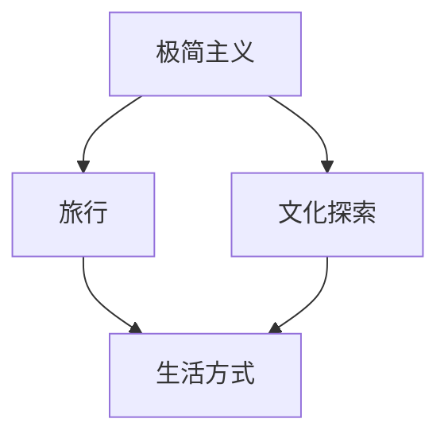

                 

### 第1章：极简主义旅行概述

#### 1.1 极简主义旅行的定义与背景
- **极简主义旅行的概念**：
  极简主义旅行（Minimalist Travel）是一种以简化、实用和高效为核心的旅行方式。它强调在旅行过程中减少物质负担，专注于体验和人际交流，而非物质享受。极简主义旅行者通常携带较少的行李，计划灵活，更注重旅行的意义和目的，而非旅游路线和计划。

- **极简主义旅行兴起的原因**：
  1. **经济考量**：在经济压力增大的今天，越来越多的人选择极简主义旅行以减少旅行成本。
  2. **环保意识**：极简主义旅行有助于减少碳排放，符合现代环保理念。
  3. **生活质量的提升**：极简主义旅行使得旅行者可以更专注于体验当地文化和生活方式，从而提高旅行质量。
  4. **个人成长**：通过极简主义旅行，人们可以更好地理解自己的需求，提升自我意识和独立性。

#### 1.2 极简主义旅行与传统旅行的区别
- **行李打包的简化**：
  极简主义旅行者通常只携带必需品，如轻便衣物、多功能工具和便携式电子产品等。他们避免携带大量不必要的物品，以确保行李的轻便和便于携带。

- **旅游计划的灵活性**：
  与传统的固定行程不同，极简主义旅行者倾向于制定灵活的旅行计划。他们更愿意根据当地的实际情况和个人兴趣来调整行程，以获得更加真实的旅行体验。

#### 1.3 极简主义旅行者的心态
- **极简主义旅行者的价值观**：
  极简主义旅行者通常重视体验和人际交往，而非物质享受。他们相信旅行是一种学习和成长的机会，希望通过旅行来拓展自己的视野和认识。

- **极简主义旅行者的生活态度**：
  极简主义旅行者倾向于简约和高效的生活方式。他们相信通过减少不必要的物质负担，可以更好地专注于生活的本质，提高生活质量。

#### 小结
极简主义旅行作为一种新兴的旅行方式，正在逐渐受到越来越多人的关注和喜爱。它不仅能够帮助旅行者减少物质负担，提高旅行体验的质量，还能促进环保意识和个人成长。在接下来的章节中，我们将进一步探讨极简主义旅行中的文化探索和实践技巧，帮助读者更好地理解和实践这一理念。

#### 1.4 极简主义旅行的挑战与解决方案
- **挑战**：
  1. **文化适应**：旅行者可能面临不同文化背景下的适应问题，如语言障碍、饮食习惯等。
  2. **旅行的灵活性**：极简主义旅行强调灵活性，但在实际操作中可能遇到计划变更带来的困扰。
  3. **安全与卫生**：在陌生的环境中，旅行者可能需要特别注意个人安全与卫生问题。

- **解决方案**：
  1. **提前准备**：在旅行前，通过语言课程、文化交流资料等方式提前了解目的地文化，减轻文化适应的难度。
  2. **备用计划**：制定旅行计划时，预留一定的时间空间以应对突发情况，提高旅行的灵活性。
  3. **关注安全卫生**：了解目的地的安全指南和卫生标准，随身携带必要的药品和个人卫生用品。

通过这些解决方案，极简主义旅行者可以更好地应对旅行中的挑战，确保旅行过程既简约又愉快。

### 1.5 极简主义旅行中的技术与工具
- **技术与工具的选择**：
  1. **便携式电子设备**：选择轻便、多功能的电子设备，如智能手机、平板电脑等，以减少携带物品的数量。
  2. **在线资源**：利用在线地图、旅行应用等资源，提前规划行程和预订住宿，提高旅行的便利性。
  3. **通信工具**：携带轻便的全球通手机或卫星电话，确保在紧急情况下能够及时与外界联系。

- **技术的应用案例**：
  1. **导航**：使用手机导航应用，如Google Maps，实时查看行程和路况，提高旅行的效率。
  2. **住宿预订**：利用Airbnb、Booking.com等在线平台预订住宿，根据实际情况灵活调整计划。
  3. **社交互动**：通过社交媒体和旅行应用与当地居民互动，了解当地文化和生活，丰富旅行体验。

通过合理利用技术工具，极简主义旅行者可以更好地实现旅行目标，享受简约而充实的旅行生活。

### 1.6 极简主义旅行者的日常实践
- **生活方式的调整**：
  1. **早起**：保持良好的作息习惯，早起有助于充分利用白天时间，体验当地文化和活动。
  2. **健康饮食**：选择健康、营养均衡的食物，避免过多的油腻和刺激性食物，以保持良好的身体状况。

- **日常活动安排**：
  1. **早锻炼**：在酒店房间或户外进行简单的锻炼，如晨跑、瑜伽等，增强体质。
  2. **文化体验**：参观当地博物馆、艺术展览等文化场所，深入了解目的地文化。

- **注意事项**：
  1. **尊重当地风俗**：在旅行中，尊重当地的文化和习俗，避免不必要的冲突。
  2. **保护环境**：不乱扔垃圾，遵守环保规定，为保护自然环境贡献自己的力量。

通过这些日常实践，极简主义旅行者不仅可以更好地适应旅行环境，还能提升旅行体验，享受更加充实和有意义的文化探索之旅。

### 1.7 极简主义旅行的核心价值
- **体验优先**：
  极简主义旅行的核心在于将体验放在首位。旅行者通过减少物质负担，专注于旅行过程中的文化探索和人际交流，从而获得更加深刻的旅行体验。

- **环保意识**：
  极简主义旅行强调减少旅行过程中的碳排放和资源消耗，倡导绿色出行。这种理念有助于减少对环境的破坏，推动可持续发展。

- **个人成长**：
  通过极简主义旅行，旅行者可以更好地理解自己的需求，提升自我意识和独立性。在旅行中，人们有机会面对各种挑战，从中学习和成长。

- **文化理解**：
  极简主义旅行者通过深入了解目的地的文化和生活方式，增进对不同文化的理解和尊重。这种跨文化的交流有助于促进世界各地的和谐与发展。

### 1.8 极简主义旅行的实际案例分析
- **案例一**：
  一个旅行者计划前往日本旅行。他只携带了轻便的衣物、一本笔记本和一个多功能工具。在旅行过程中，他通过Google Maps导航，找到了当地的公园和博物馆。在住宿方面，他通过Airbnb预订了一个舒适的民宿，并与房东交流了关于当地文化的信息。通过这种方式，他不仅体验了日本的美景，还深入了解了当地的文化。

- **案例二**：
  一个旅行者前往非洲旅行。他只携带了必需的衣物和药品，并通过卫星电话与外界保持联系。在旅行过程中，他通过社交媒体与当地居民互动，了解了他们的生活方式和文化。他还在当地参加了一个烹饪课程，学习了如何制作传统的非洲美食。这次旅行让他深刻感受到了非洲文化的魅力。

通过这些实际案例，我们可以看到极简主义旅行不仅可行，而且能够带来丰富而有意义的旅行体验。

### 1.9 极简主义旅行者的反思与建议
- **反思**：
  1. **旅行体验的质量**：极简主义旅行有助于提高旅行体验的质量，让人们更加专注于旅行的真正意义。
  2. **个人成长**：在旅行中，极简主义旅行者有机会面对各种挑战，从而实现个人成长和自我提升。

- **建议**：
  1. **制定合理计划**：在旅行前制定详细的计划，但也要预留一定的时间空间以应对突发情况。
  2. **注重安全与卫生**：在旅行过程中，注重个人安全和卫生，确保旅行的顺利进行。
  3. **持续学习**：通过旅行不断学习和了解不同的文化和生活方式，丰富自己的视野和知识。

通过这些反思和建议，极简主义旅行者可以更好地规划和实践自己的旅行计划，享受更加充实和有意义的旅行体验。

### 摘要
本章介绍了极简主义旅行的定义、背景和特点，探讨了极简主义旅行与传统旅行的区别，以及极简主义旅行者的心态和生活方式。我们还分析了极简主义旅行的挑战与解决方案，介绍了在极简主义旅行中应用的技术和工具，并提供了实际案例分析。通过这些内容，读者可以更好地理解极简主义旅行的核心价值和实践方法，为未来的旅行计划提供有益的参考。

### 核心概念与联系

在极简主义旅行中，有以下几个核心概念：

1. **极简主义**：强调简化、实用和高效，减少物质负担，专注于体验和人际交流。
2. **旅行**：是一种探索和学习的过程，通过实际体验来拓宽视野。
3. **文化探索**：深入了解目的地的文化，包括历史、艺术、风俗和生活方式。
4. **生活方式**：旅行者在旅行过程中的行为模式和生活习惯。

这些概念之间的联系可以通过以下Mermaid流程图来展示：

在这个流程图中，极简主义是整个旅行的指导思想，它指导着旅行的方式、目标和体验。文化探索是旅行过程中的重要组成部分，通过深入了解目的地的文化，旅行者能够获得更加丰富的体验。而生活方式则是旅行者在旅行过程中实际表现出来的行为模式，这直接影响了旅行的质量。通过这个流程图，我们可以清晰地看到这些核心概念之间的相互作用和影响。

### 第2章：文化探索与简约主义

#### 2.1 简约主义文化的起源与发展
- **起源**：
  简约主义文化起源于20世纪中叶的西方，特别是在设计、建筑和艺术领域。它反对过度装饰和繁琐的设计，主张以简单、功能性和实用性为核心。这种理念在当时的社会环境中逐渐受到欢迎，并逐渐扩展到生活的其他方面。

- **发展**：
  随着时间的推移，简约主义文化在各个领域得到了广泛应用和深入发展。在设计中，简约主义强调以最少的元素和最简单的形式来创造美感和实用性。在建筑中，简约主义提倡利用自然光线和空间布局，创造出开放和舒适的居住环境。在艺术领域，简约主义通过抽象和简洁的形式表达情感和思想。

#### 2.2 简约主义文化在旅行中的应用
- **旅行中的简约美学**：
  在旅行中，简约主义美学强调以最少的设计元素和最简单的方式创造出美好的旅行体验。这包括选择简约风格的酒店和民宿，注重功能性的装备和用品，以及在旅行中减少不必要的装饰和物品。

- **如何在旅行中实践简约主义**：
  1. **选择简约的住宿**：选择简约风格的酒店或民宿，注重舒适性和功能性，而不是奢华和装饰。
  2. **简化行李**：只携带必需的物品，避免携带过多的行李，确保旅行的便捷性和灵活性。
  3. **注重体验**：专注于旅行中的体验和互动，而不是仅仅追求旅游景点的数量和外观。

#### 2.3 简约主义文化下的旅行心态
- **减少旅行负担**：
  简约主义文化下的旅行心态强调减少物质负担，通过减少行李、简化行程和减少消费，使旅行更加轻松和自在。

- **提高旅行体验质量**：
  通过实践简约主义，旅行者可以更加专注于旅行中的真实体验，如与当地人交流、探索当地文化和享受自然风光，从而提高旅行体验的质量。

### 小结
简约主义文化在旅行中的应用不仅能够帮助旅行者减少物质负担，提高旅行体验的质量，还能促进环保意识和个人成长。通过在旅行中实践简约主义，旅行者可以更加深入地体验和了解目的地的文化和生活方式，从而获得更加丰富和有意义的旅行经历。

#### 2.4 极简主义旅行中的文化适应
- **文化适应的重要性**：
  在极简主义旅行中，文化适应是一个不可忽视的重要环节。它不仅能够帮助旅行者更好地融入当地环境，还能提升旅行体验的质量。文化适应意味着在尊重和理解当地文化的基础上，调整自己的行为和心态，以更好地适应当地的生活和习俗。

- **文化适应的策略**：
  1. **了解当地文化**：在旅行前，通过阅读相关书籍、观看视频或参加文化课程等方式，提前了解目的地的历史、风俗、宗教信仰和礼仪等文化要素。
  2. **学习当地语言**：尽管不一定需要流利地使用当地语言，但基本的日常用语和礼貌用语可以帮助旅行者与当地人更好地沟通，减少误解和冲突。
  3. **尊重当地习俗**：在旅行过程中，尊重当地的文化习俗，如穿着、饮食习惯和社交礼仪等。这不仅能展示旅行者的礼貌和尊重，还能帮助旅行者更好地融入当地社会。

- **案例分析**：
  例如，一个中国旅行者前往日本旅行。他通过学习日语的基础用语，了解了日本的礼仪和习俗，如鞠躬、用餐时的礼仪等。在旅行中，他尊重当地的垃圾分类规定，避免使用一次性塑料制品，积极参与当地的文化活动，如茶道和武士表演。这些做法不仅让他更好地融入了当地的生活，还让他对日本文化有了更深入的了解和体验。

通过有效的文化适应策略，极简主义旅行者可以更顺畅地融入当地社会，获得更加丰富和有意义的旅行经历。

#### 2.5 简约主义旅行中的文化交流
- **文化交流的重要性**：
  简约主义旅行不仅仅是探索自然风光和名胜古迹，更是与不同文化背景的人进行交流的过程。这种交流不仅能够帮助旅行者拓宽视野，理解世界的多样性，还能促进跨文化的理解和和谐。

- **文化交流的实践**：
  1. **倾听与观察**：在旅行中，旅行者应该多倾听当地居民的故事和经历，通过观察他们的生活方式和习惯，了解当地的文化背景和社会结构。
  2. **参与当地活动**：积极参与当地的文化活动和节日庆典，如参加当地的庙会、音乐会或传统节庆活动，这不仅能够加深对当地文化的理解，还能与当地居民建立友谊。
  3. **互赠礼物**：在适当的场合，互赠礼物是一种表达友好和尊重的方式。礼物可以是手工艺品、特产或自制的小礼物，通过这种方式，旅行者能够向当地居民展示自己的友好和尊重。

- **案例分析**：
  例如，一个美国旅行者前往墨西哥旅行。他在当地参加了一场传统节日庆典，通过与当地居民一起跳舞、唱歌和品尝当地美食，他深入了解了墨西哥的文化和生活方式。他还与当地的艺术家交流，学习了墨西哥壁画的艺术风格。通过这些交流，他不仅对墨西哥文化有了更深的理解，还结交了许多新朋友。

通过积极的交流和互动，简约主义旅行者可以更好地融入当地社会，获得更加丰富和有意义的旅行经历。

#### 2.6 极简主义旅行中的文化反思
- **文化反思的重要性**：
  在极简主义旅行中，文化反思是一个不可或缺的环节。通过反思，旅行者可以更好地理解自己的文化背景，以及文化之间的差异和共性。这种反思不仅能够帮助旅行者提升自我认知，还能促进对其他文化的尊重和理解。

- **文化反思的方法**：
  1. **自我观察**：在旅行过程中，旅行者应该保持对自己行为和心态的观察，思考自己的行为是否反映了本文化的价值观和偏见。
  2. **与当地人交流**：通过与当地人的深入交流，旅行者可以了解他们的观点和看法，从而更好地理解不同文化之间的差异和相似之处。
  3. **记录和总结**：旅行者可以在旅行日记中记录下自己的感受和观察，通过回顾和总结，加深对文化差异的理解。

- **案例分析**：
  例如，一个欧洲旅行者前往非洲旅行。在旅行过程中，他通过观察和与当地居民交流，发现了自己对于非洲的一些刻板印象，并意识到这些印象是如何影响他对非洲文化和人民的看法。通过反思，他开始更加开放地看待非洲的文化和社会，从而对非洲有了更加全面和深入的理解。

通过文化反思，旅行者可以提升自我认知，增进对不同文化的理解和尊重，为未来的交流和互动打下良好的基础。

#### 2.7 极简主义旅行中的文化体验活动
- **参观博物馆和艺术馆**：
  博物馆和艺术馆是了解目的地文化的重要场所。通过参观这些地方，旅行者可以深入了解目的地的历史、艺术和文化遗产。

- **参与当地手工艺品制作**：
  参与当地的手工艺品制作活动，如陶艺、编织和木雕等，不仅能够体验当地的手工艺文化，还能亲手制作一份独特的纪念品。

- **参加当地节日和庆典**：
  当地的节日和庆典是了解当地文化的重要机会。参与这些活动，旅行者可以体验到当地的传统习俗和庆祝方式，加深对当地文化的理解。

- **与当地艺术家互动**：
  与当地艺术家互动，如参观艺术工作室、参加艺术讲座和工作坊等，可以深入了解当地的艺术创作过程和艺术风格。

通过这些文化体验活动，极简主义旅行者不仅可以加深对目的地的了解，还能获得独特的旅行体验和宝贵的回忆。

### 小结
本章详细介绍了简约主义文化的起源与发展，探讨了简约主义在旅行中的应用，包括旅行中的简约美学、实践方法和旅行心态。我们还讨论了极简主义旅行中的文化适应、文化交流和文化反思，以及如何通过参与文化体验活动来丰富旅行体验。通过这些内容，读者可以更好地理解如何在旅行中实践简约主义，并从中获得更深刻的旅行体验。

### 2.8 极简主义旅行中的文化冲击与适应
- **文化冲击**：
  在极简主义旅行中，文化冲击是一个常见且重要的现象。文化冲击（Culture Shock）是指个体在进入一个陌生文化环境时，由于文化差异和适应困难而产生的心理压力。这种冲击可能表现为焦虑、沮丧、孤独、困惑等情绪。

- **文化冲击的适应策略**：
  1. **保持开放心态**：保持开放的心态，积极接受和适应新的文化环境。这包括对新事物、新习惯和新观念持包容和理解的态度。
  2. **逐步适应**：不要期望立即适应，给自己足够的时间和空间来逐步适应新的文化环境。逐步适应可以帮助减少心理压力，提高适应效率。
  3. **寻求帮助**：当遇到困难时，不要犹豫寻求帮助。可以寻求当地朋友、导游或旅游咨询中心的支持，以获取帮助和建议。
  4. **保持健康的生活习惯**：保持健康的生活习惯，如良好的作息时间、合理的饮食和适当的锻炼，有助于提高适应能力和心理健康。

- **案例分享**：
  一个中国旅行者初次前往日本旅行时，由于语言障碍和文化差异，他感到非常困惑和不安。然而，他通过保持开放心态，逐步适应，主动学习日语和了解日本文化，最终成功地融入了当地的生活。他还积极参与当地的文化活动，如参加茶道体验和参观博物馆，这不仅帮助他更好地理解了日本文化，还为他带来了丰富的旅行体验。

通过有效的策略和积极的心态，极简主义旅行者可以更好地应对文化冲击，提高旅行体验的质量。

#### 2.9 极简主义旅行中的文化保护与传承
- **文化保护的重要性**：
  在极简主义旅行中，文化保护是一个重要的议题。保护文化不仅是对当地居民生活方式的尊重，也是对全球文化多样性的维护。随着全球化进程的加速，许多地方的文化和传统正面临着消失的风险。

- **文化传承的实践**：
  1. **参与当地社区活动**：参与当地社区组织的活动，如文化节、社区聚会和传统庆典等，有助于了解和传承当地的文化。
  2. **学习当地手工艺**：学习当地的手工艺技术，如陶艺、编织和木雕等，不仅能够提高个人技能，还能帮助传承和弘扬当地的文化艺术。
  3. **支持当地艺术和文化产业**：购买当地艺术家的作品，参观当地艺术展览，支持当地文化产业的发展，有助于保护和传承文化。

- **案例分析**：
  一个欧洲旅行者前往印度旅行时，他积极参与当地的瑜伽和文化课程，不仅学习了印度的瑜伽文化，还帮助了当地的瑜伽老师传承这一传统。他还购买了印度艺术家制作的纺织品和手工艺品，支持了当地文化产业的可持续发展。

通过这些实践，极简主义旅行者可以在旅行中发挥积极作用，保护当地文化，并帮助传承和弘扬文化传统。

#### 2.10 极简主义旅行中的文化融合与创新
- **文化融合的概念**：
  文化融合是指不同文化在交流和互动中相互影响、相互吸收的过程。在极简主义旅行中，文化融合是一个重要的现象，它不仅丰富了旅行者的视野，也为目的地文化带来了新的活力。

- **文化融合的实践**：
  1. **跨文化交流**：积极参与跨文化交流活动，如国际会议、文化交流会和主题讲座等，与来自不同文化背景的人进行深入的交流和互动。
  2. **融合创新**：在旅行中，旅行者可以将自己的文化元素与目的地的文化进行融合，创造出新的文化形式。例如，一个中国旅行者可以将中国的茶文化与当地的传统音乐相结合，创作出独特的表演艺术。
  3. **文化传播**：通过写作、摄影、视频制作等方式记录和传播旅行中的文化融合经历，让更多的人了解和体验这种独特的文化现象。

- **案例分析**：
  一个美国旅行者前往泰国旅行，他学习泰国的烹饪技巧，并在此基础上创新开发出独特的泰国美食。他将自己的烹饪经验与泰国厨师分享，并组织了一场跨文化的美食交流活动，吸引了来自世界各地的美食爱好者。这场活动不仅促进了文化融合，还为当地经济带来了新的增长点。

通过文化融合与创新，极简主义旅行者可以在旅行中发挥积极作用，推动文化多样性和创新。

### 小结
本章深入探讨了极简主义旅行中的文化探索，包括简约主义文化的起源与发展、简约主义在旅行中的应用、文化适应、文化交流和文化反思。我们还讨论了文化冲击的适应策略、文化保护与传承、文化融合与创新。通过这些内容，读者可以更好地理解如何在极简主义旅行中深入探索和体验文化，从而获得更加丰富和有意义的旅行经历。

### 摘要
本章详细介绍了简约主义文化在旅行中的应用，从起源与发展、实践方法到文化适应和反思，帮助旅行者更好地理解如何在旅行中实践简约主义，探索和体验文化。通过有效的策略和实践，读者可以在极简主义旅行中减少物质负担，提高旅行体验质量，增进对不同文化的理解和尊重，从而获得更加丰富和有意义的旅行经历。

### 第3章：极简主义旅行攻略

#### 3.1 极简主义旅行前的准备

在进行极简主义旅行前，充分的准备工作至关重要。以下是一些关键的准备步骤，帮助旅行者确保旅行顺利、轻松和有意义。

- **制定旅行计划**：
  制定一个详细的旅行计划，包括旅行目的地、行程安排、预算和时间表。虽然极简主义旅行强调灵活性，但提前规划可以帮助旅行者更好地掌控时间，减少不确定性和焦虑。

- **行李打包技巧**：
  极简主义旅行的核心在于减少行李负担。以下是一些建议，帮助旅行者实现这一目标：
  1. **必需品优先**：只携带必需的物品，如衣物、个人护理用品、旅行证件和便携式电子产品等。
  2. **多功能工具**：选择多功能工具，如多功能刀具、便携式充电器和小型应急包，以减少携带多个单独物品。
  3. **轻便衣物**：选择轻便、易洗的衣物，以减少行李重量。同时，确保衣物具备多功能性，如可拆分或多功能的衣物。
  4. **折叠技巧**：学习有效的折叠技巧，如使用压缩袋和创新的折叠方法，以最大限度地节省空间。

- **备份重要文件**：
  在旅行前，备份重要的文件和资料，包括旅行证件、保险单、行程安排和紧急联系信息。可以将这些资料保存在云端存储、电子邮件或手机中，确保在任何情况下都能方便地访问。

- **紧急预案**：
  为可能发生的突发情况制定紧急预案，包括医疗紧急情况、行李丢失或旅行延误等。了解目的地的紧急联系方式和医疗资源，并随身携带一些基本的急救用品，如创可贴、止痛药和消毒剂。

通过以上准备工作，旅行者可以更好地应对旅行中的各种挑战，确保极简主义旅行既高效又愉快。

#### 3.2 极简主义旅行中的生活方式

在极简主义旅行中，生活方式的选择至关重要。通过合理的安排和策略，旅行者可以确保旅行过程中的舒适、高效和有意义。

- **早起**：
  早起有助于充分利用白天时间，享受更多的时间进行文化探索和体验。早晨通常是一天中最宁静的时段，适合参观博物馆、公园或参与当地的活动。

- **健康饮食**：
  选择健康、营养均衡的饮食，有助于保持良好的身体状况。以下是一些建议：
  1. **选择当地美食**：尝试当地的特色美食，但也要注意饮食卫生，避免摄入过多的油腻和刺激性食物。
  2. **自助餐**：选择自助餐或外出就餐，可以根据自己的需求选择食物，避免浪费。
  3. **自备健康食品**：携带一些健康食品，如坚果、水果和能量棒，以备不时之需。

- **锻炼与休息**：
  在旅行中保持适当的锻炼和休息，有助于保持身体和心理健康。以下是一些建议：
  1. **早晨锻炼**：利用早晨的时间进行简单的锻炼，如晨跑、瑜伽或户外活动，增强体质。
  2. **休息时间**：合理安排休息时间，避免过度疲劳。可以在酒店房间或户外休息，放松身心。

- **社交互动**：
  极简主义旅行不仅仅是探索自然风光，更是与当地人互动和交流的过程。以下是一些建议：
  1. **参与当地活动**：积极参与当地的文化和社交活动，如社区聚会、节日庆典和艺术展览等。
  2. **使用社交媒体**：通过社交媒体与当地居民互动，分享旅行经历和体验。
  3. **交换信息**：与当地人交流旅行建议和信息，以获得更丰富的旅行体验。

通过以上生活方式的选择，旅行者可以在极简主义旅行中保持健康、高效和有意义的生活。

#### 3.3 极简主义旅行中的社交互动

在极简主义旅行中，社交互动不仅是旅行体验的一部分，也是了解和融入当地文化的重要途径。以下是一些社交互动的技巧和建议：

- **尊重当地风俗**：
  在与当地人互动时，尊重当地的文化和习俗是非常重要的。以下是一些建议：
  1. **了解当地礼仪**：在旅行前，了解目的地的基本礼仪和习惯，如问候方式、敬语使用和餐桌礼仪等。
  2. **遵守当地规定**：遵守当地的法律法规和风俗习惯，避免不必要的冲突。

- **主动交流**：
  主动与当地人交流，可以增加了解和互动的机会。以下是一些建议：
  1. **学习基础语言**：学习目的地国家的基础语言，即使不流利，也能帮助旅行者更好地沟通。
  2. **使用手势和表情**：如果语言不通，可以使用手势和表情来传达信息，增加沟通的可能性。

- **参与社区活动**：
  参与当地社区的活动，如节日庆典、社区聚会和手工艺市场等，可以加深与当地人的互动和了解。以下是一些建议：
  1. **参加文化活动**：参观当地博物馆、艺术展览和文化活动，与当地人一起享受文化盛宴。
  2. **交换经验**：与当地人交换旅行经验和建议，获取更多的旅行信息和资源。

通过以上技巧和建议，旅行者可以更顺畅地与当地人互动，获得更加丰富和有意义的旅行体验。

#### 3.4 极简主义旅行中的数字生活方式

在极简主义旅行中，合理利用数字工具和在线资源可以显著提升旅行体验的效率和质量。以下是一些实用的数字生活方式建议：

- **使用旅行应用程序**：
  旅行应用程序如Google Maps、TripAdvisor和Airbnb等，可以帮助旅行者方便地规划行程、预订住宿和查看景点评价。以下是一些具体的应用：
  1. **Google Maps**：提供实时的导航和路线规划，帮助旅行者快速到达目的地。
  2. **TripAdvisor**：提供各种旅游景点的用户评价和推荐，帮助旅行者做出明智的旅行选择。
  3. **Airbnb**：提供当地住宿选择，旅行者可以根据个人偏好和预算找到合适的住宿。

- **在线预订**：
  通过在线平台预订交通、住宿和活动，不仅可以节省时间和精力，还可以享受更多的优惠和灵活性。以下是一些常用的在线预订平台：
  1. **Expedia**：提供机票、酒店和旅游活动的预订服务。
  2. **Skyscanner**：提供机票和酒店的比较和预订服务，帮助旅行者找到最优惠的价格。
  3. **Booking.com**：提供广泛的住宿选择，旅行者可以根据评分、价格和设施筛选合适的住宿。

- **社交媒体互动**：
  社交媒体平台如Instagram、Facebook和Twitter等，可以帮助旅行者记录和分享旅行经历，与家人和朋友保持联系，甚至结交新朋友。以下是一些实用技巧：
  1. **记录旅行日志**：通过照片和文字记录旅行中的美好瞬间，分享给家人和朋友。
  2. **参与话题讨论**：参与社交媒体上的旅行话题讨论，获取旅行建议和信息。
  3. **结交新朋友**：通过社交媒体平台与来自世界各地的旅行者互动，分享旅行经历和心得。

通过以上数字生活方式，旅行者可以更高效地规划和管理旅行，同时享受更加丰富和互动的旅行体验。

#### 3.5 极简主义旅行中的财务管理

在极简主义旅行中，合理的财务管理是确保旅行顺利进行的基石。以下是一些财务管理建议，帮助旅行者在旅行过程中保持财务稳定：

- **预算规划**：
  在旅行前制定详细的预算规划，包括旅行费用、住宿费用、餐饮费用、交通费用和其他潜在费用。以下是一些建议：
  1. **估算费用**：根据旅行目的地的消费水平和旅行计划，估算每天的预算。
  2. **分项预算**：将预算分配到不同的类别，如住宿、交通、餐饮和娱乐等，确保每一项都有足够的资金支持。
  3. **紧急备用金**：预留一部分资金作为紧急备用金，以应对意外情况。

- **支付方式**：
  使用多种支付方式可以提高旅行中的便利性和安全性。以下是一些实用的支付方式：
  1. **信用卡**：携带一张国际信用卡，可以方便地在全球范围内的商家进行支付。
  2. **借记卡**：携带一张借记卡，可以随时从当地银行提取现金。
  3. **电子钱包**：使用电子钱包如支付宝、微信支付等，可以在支持这些服务的商家进行便捷支付。

- **预算调整**：
  在旅行过程中，根据实际情况调整预算，确保资金使用合理。以下是一些建议：
  1. **定期检查**：定期检查预算的执行情况，确保没有超支。
  2. **灵活调整**：如果发现某些预算项超支，及时调整其他项的预算，以保持整体预算的平衡。
  3. **预留额外资金**：即使在预算规划时已经留有余地，也要为可能的意外支出预留一部分资金。

通过以上财务管理建议，旅行者可以确保在极简主义旅行中保持财务稳定，避免不必要的经济压力。

#### 3.6 极简主义旅行中的健康与安全
- **健康注意事项**：
  在旅行过程中，保持健康是至关重要的。以下是一些健康注意事项：
  1. **饮食卫生**：避免食用生冷食物和未煮熟的海鲜，减少食物中毒的风险。
  2. **充足睡眠**：保持良好的作息习惯，确保每天有足够的睡眠，以保持精力充沛。
  3. **锻炼身体**：定期进行适度的锻炼，如散步、跑步或瑜伽等，以保持身体健康。

- **安全防范措施**：
  在旅行中，安全防范措施同样重要。以下是一些建议：
  1. **随身携带贵重物品**：将贵重物品随身携带，避免放置在公共场所或无人看管的地方。
  2. **保持警惕**：在旅行过程中，保持警惕，注意周围环境，避免不必要的危险。
  3. **了解紧急联系方式**：了解目的地的紧急联系方式，如医疗急救电话、警察局电话等，以备不时之需。

通过关注健康和安全，旅行者可以确保在极简主义旅行中保持良好的身体和心理状态，享受更加安全和舒适的旅行体验。

### 小结
本章详细介绍了极简主义旅行前的准备、旅行中的生活方式、社交互动、数字生活方式、财务管理和健康与安全注意事项。通过这些攻略，旅行者可以更好地准备和享受极简主义旅行，确保旅行过程既高效又愉快。

### 3.7 极简主义旅行中的实际案例：东京探索之旅

为了更具体地展示极简主义旅行攻略的实际应用，以下是一个关于东京探索之旅的实际案例，包括旅行前的准备、旅行中的生活方式和实际经历。

#### 旅行前的准备
1. **制定计划**：
   - 目的地：东京，日本
   - 行程安排：5天4夜
   - 预算：约2000美元

2. **行李打包**：
   - 轻便衣物：2件T恤、1件衬衫、1条裤子和1条连衣裙
   - 个人护理用品：牙刷、牙膏、洗发水、沐浴露、防晒霜和唇膏
   - 电子产品：智能手机、平板电脑、便携式充电器和笔记本电脑
   - 多功能工具：便携式钱包、多功能刀具、小型应急包和折叠雨伞

3. **备份重要文件**：
   - 旅行证件复印件、护照复印件、保险单、行程安排和紧急联系信息保存在云端和手机中

4. **紧急预案**：
   - 了解当地的紧急联系方式，如日本急救电话111、警察局电话110

#### 旅行中的生活方式
1. **早起**：
   - 保持早晨7点起床，充分利用白天时间进行文化探索和活动。

2. **健康饮食**：
   - 选择当地的拉面、寿司、天妇罗等美食，避免过量食用油腻和刺激性食物。
   - 自备一些健康食品，如水果、坚果和能量棒。

3. **锻炼与休息**：
   - 每天早晨进行简单的晨跑或瑜伽，增强体质。
   - 安排午休时间，确保有足够的休息。

4. **社交互动**：
   - 参加了当地的文化节，与当地人互动，学习了日本茶道和传统舞蹈。
   - 通过社交媒体与当地的朋友保持联系，分享旅行体验。

#### 实际经历
1. **第一天**：
   - 抵达东京后，通过Google Maps找到预订的民宿，并了解了周边的景点和商店。

2. **第二天**：
   - 早上参观了浅草寺，与僧人交流并了解了日本佛教文化。
   - 下午在银座购物，通过Airbnb预订了一次传统和服体验，体验了日本的传统服饰。

3. **第三天**：
   - 参观了东京塔，并在塔顶欣赏了东京的美景。
   - 晚上在秋叶原体验了动漫文化，购买了一些动漫周边商品。

4. **第四天**：
   - 前往京都，通过JR线路到达，体验了京都市的传统文化和自然风光。
   - 参观了清水寺和金阁寺，品尝了当地的抹茶和拉面。

5. **第五天**：
   - 在东京的最后一天，参观了浅草樱花公园，享受了春天的美景。
   - 晚上在居酒屋与朋友聚会，体验了日本的夜生活。

#### 项目小结
通过这个实际案例，我们可以看到如何有效地应用极简主义旅行攻略。旅行者通过详细的计划、合理的行李打包和健康的生活方式，成功地在东京进行了5天的极简主义旅行。这个案例不仅展示了极简主义旅行的可行性，还提供了实用的经验和建议，帮助其他旅行者在未来进行类似的旅行。

### 3.8 极简主义旅行中的最佳实践

在极简主义旅行中，遵循一些最佳实践可以显著提升旅行体验的质量和效率。以下是一些值得推荐的最佳实践：

- **提前规划**：在旅行前，制定详细的旅行计划，包括目的地、行程安排和预算。提前规划可以减少旅行中的不确定性和焦虑。

- **简化行李**：只携带必需的物品，避免携带过多的行李。通过选择多功能工具和轻便衣物，可以最大限度地减少行李负担。

- **保持灵活**：虽然提前规划很重要，但也要保持灵活性，根据实际情况调整行程。灵活的计划可以更好地适应突发事件和临时机会。

- **健康饮食**：选择健康、营养均衡的食物，避免食用生冷和油腻食物，确保良好的身体状况。

- **锻炼与休息**：在旅行中保持适度的锻炼和休息，有助于保持身体和心理的活力。

- **社交互动**：积极参与当地的文化和社交活动，与当地人互动，增加旅行体验的深度和广度。

- **财务管理**：合理规划预算，使用多种支付方式，确保财务稳定。

- **健康与安全**：关注健康和安全，保持警惕，遵守当地法律法规和风俗习惯。

通过遵循这些最佳实践，极简主义旅行者可以确保旅行过程既高效又愉快，获得更加丰富和有意义的旅行体验。

### 3.9 极简主义旅行中的注意事项

在极简主义旅行中，尽管追求简化和高效，但仍有一些重要的注意事项需要考虑，以确保旅行的顺利进行。

- **行李限制**：不同航空公司和目的地可能有不同的行李限制，确保提前了解并遵守相关规定。超重行李可能会导致额外费用。

- **健康安全**：在旅行前，了解目的地的健康和安全指南，特别是关于食品、水源和医疗资源的信息。随身携带必要的急救用品和药品。

- **紧急情况**：在旅行前，记录紧急联系信息，包括当地急救电话、酒店联系信息和紧急联系人。了解如何应对突发情况，如行李丢失、旅行延误或突发疾病。

- **语言障碍**：如果旅行目的地语言与母语不同，学习一些基础语言和常用短语，有助于与当地人沟通和解决问题。

- **环保意识**：在旅行过程中，尊重自然环境，避免乱扔垃圾，减少一次性塑料制品的使用。

通过关注这些注意事项，旅行者可以确保在极简主义旅行中遇到问题时能够应对自如，享受更加安全、健康和愉快的旅行体验。

### 摘要
本章详细介绍了极简主义旅行中的各种攻略，包括旅行前的准备、旅行中的生活方式、社交互动、数字生活方式、财务管理、健康与安全以及实际案例。通过这些攻略和最佳实践，旅行者可以更好地准备和享受极简主义旅行，确保旅行过程既高效又愉快。本章内容为读者提供了全面而实用的指导，帮助他们在未来的旅行中实践极简主义，获得更加丰富和有意义的旅行体验。

### 第4章：目的地选择与规划

#### 4.1 简约主义旅行目的地推荐

在极简主义旅行中，选择合适的旅行目的地至关重要。以下是一些被广泛推荐的简约主义旅行目的地，以及它们的独特魅力和适合人群。

- **京都，日本**：
  京都是日本传统文化的中心，以其古老的寺庙、神社和传统日式园林而闻名。这里的生活方式简约而宁静，适合那些希望深入了解日本文化、追求心灵宁静的旅行者。

- **巴厘岛，印度尼西亚**：
  巴厘岛以其美丽的海滩、热带雨林和独特的文化而闻名。这里的生活节奏较慢，适合喜欢海滩休闲、寻求心灵放松和想要体验热带生活的旅行者。

- **卢布尔雅那，斯洛文尼亚**：
  作为斯洛文尼亚的首都，卢布尔雅那以其现代化的城市建筑和独特的文化氛围而著称。这里的生活氛围简约而友好，适合喜欢探索城市、享受美食和体验当地文化的旅行者。

- **哥本哈根，丹麦**：
  哥本哈根以其绿色城市和设计风格而闻名。这里的生活质量高，环境优美，适合那些喜欢设计、艺术和自然环境的旅行者。

- **萨尔茨堡，奥地利**：
  萨尔茨堡是音乐家莫扎特的出生地，以其古老的建筑、音乐文化和美丽的阿尔卑斯山景色而著名。这里的生活节奏适中，适合喜欢音乐、历史和文化旅行的旅行者。

- **普吉岛，泰国**：
  普吉岛以其美丽的海滩、热情的文化和丰富的水上活动而著名。这里的生活节奏较慢，适合喜欢海滩度假、享受美食和热带风情的旅行者。

这些目的地都提供了独特的简约主义旅行体验，适合不同类型和需求的旅行者。选择适合自己的目的地，可以确保旅行更加愉快和有意义。

#### 4.2 如何规划一次简约主义旅行

规划一次简约主义旅行需要综合考虑目的地、时间、预算和个人喜好。以下是一些关键步骤和注意事项，帮助旅行者制定一个完美的旅行计划。

- **确定目的地**：
  根据个人兴趣和需求，选择一个适合的简约主义旅行目的地。考虑目的地的文化氛围、自然风光和生活节奏，以确保能够获得理想的旅行体验。

- **制定时间表**：
  根据旅行目的地的特点和自己的时间安排，制定一个合理的旅行时间表。考虑到交通时间、活动安排和休息时间，确保旅行计划既充实又不过于紧张。

- **预算规划**：
  在制定预算时，考虑旅行费用中的各项支出，如交通费、住宿费、餐饮费和活动费用。根据预算调整行程安排，确保旅行费用在可控范围内。

- **预订住宿和交通**：
  提前预订住宿和交通工具，如酒店、民宿或航班，以获得更好的价格和服务。利用在线预订平台，如Airbnb、Booking.com和Expedia等，比较价格并选择合适的住宿和交通方式。

- **计划活动**：
  根据个人兴趣和目的地的特色，计划一些主要活动，如参观博物馆、参加文化体验活动、探索自然风光等。同时，也要预留一些自由时间，以便灵活调整行程，享受意外的惊喜。

- **准备行李**：
  根据旅行计划和目的地特点，准备必需的行李。遵循极简主义原则，只携带必需的物品，确保行李轻便、便于携带。

- **应对突发事件**：
  在旅行前，了解目的地的紧急联系方式，如急救电话、警察局电话和旅行社联系信息。准备一份紧急预案，以应对可能发生的突发情况。

通过以上步骤和注意事项，旅行者可以制定一个详细的简约主义旅行计划，确保旅行过程顺利、愉快和有意义。

#### 4.3 旅行预算与时间规划

在简约主义旅行中，合理的预算和时间规划是确保旅行顺利进行的关键。以下是一些关于旅行预算和时间规划的实用建议：

- **旅行预算**：
  1. **估算费用**：在制定预算时，根据目的地和旅行计划估算各项费用，包括交通费、住宿费、餐饮费、活动费用和其他潜在费用。
  2. **分项预算**：将预算分配到不同的类别，如住宿、交通、餐饮和娱乐等，确保每一项都有足够的资金支持。
  3. **预留应急资金**：为可能的意外支出预留一部分资金，以应对突发事件，如交通延误、医疗紧急情况等。
  4. **使用财务工具**：使用财务应用程序或工具，如预算跟踪器和信用卡，帮助管理旅行支出。

- **时间规划**：
  1. **合理安排时间**：根据旅行目的地的特点和活动安排，合理安排每天的时间，确保有足够的时间进行文化探索和体验。
  2. **预留休息时间**：在旅行计划中预留一些自由时间，以便根据实际情况调整行程，避免过度疲劳。
  3. **高效利用时间**：在旅行中，充分利用早晨和傍晚时间进行活动，避免高峰时段的人流和交通拥堵。
  4. **灵活调整**：在旅行过程中，根据实际情况灵活调整计划，以应对突发事件和临时机会。

通过合理的预算和时间规划，旅行者可以确保简约主义旅行既高效又愉快，获得最佳旅行体验。

#### 4.4 文化探索与目的地特色活动

在简约主义旅行中，文化探索是重要的组成部分。以下是一些目的地特色活动和文化探索建议，帮助旅行者在目的地更深入地了解当地文化。

- **京都**：
  1. **参观寺庙和神社**：如清水寺、金阁寺和伏见稻荷大社，了解日本的佛教文化和神道教文化。
  2. **日式园林漫步**：游览京都的著名园林，如龙安寺和平安神宫，体验日本园林的精致和宁静。

- **巴厘岛**：
  1. **传统舞蹈表演**：观看巴厘岛的古典舞蹈表演，如“Legong”和“Topeng”，了解巴厘岛的传统文化和艺术。
  2. **瑜伽冥想**：在巴厘岛的海滩或瑜伽中心进行瑜伽冥想，感受大自然的宁静和内心的平静。

- **卢布尔雅那**：
  1. **城市探索**：参观卢布尔雅那的历史中心，如老城区和三重桥，了解斯洛文尼亚的历史和文化。
  2. **美食体验**：品尝卢布尔雅那的传统美食，如Goulash和Pogača，体验当地的风味。

- **哥本哈根**：
  1. **绿色城市漫步**：在哥本哈根的新港和哥本哈根海港区域漫步，欣赏城市的美景和设计风格。
  2. **设计博物馆**：参观设计博物馆，了解丹麦现代设计的发展历程和影响。

- **萨尔茨堡**：
  1. **参观音乐历史遗迹**：如莫扎特故居和萨尔茨堡大教堂，了解莫扎特的音乐生涯和萨尔茨堡的历史文化。
  2. **音乐会体验**：参加萨尔茨堡的音乐会，如萨尔茨堡音乐节，感受古典音乐的魅力。

- **普吉岛**：
  1. **海滩放松**：在普吉岛的海滩上享受阳光、沙滩和海水，放松身心。
  2. **浮潜和潜水**：参加浮潜和潜水活动，探索普吉岛周边的珊瑚礁和海洋生物。

通过参与这些特色活动和文化探索，简约主义旅行者可以更深入地了解目的地的文化和生活方式，获得更加丰富和有意义的旅行体验。

### 4.5 简约主义旅行中的环保与可持续发展

在极简主义旅行中，环保与可持续发展是重要的议题。以下是一些关于环保和可持续发展的建议，帮助旅行者在旅行过程中减少对环境的影响。

- **减少一次性用品**：
  减少使用一次性塑料制品，如塑料袋、餐具和水瓶。选择可重复使用的产品，如便携水杯、餐具和购物袋。

- **垃圾分类**：
  在旅行过程中，了解目的地的垃圾分类规定，并遵守这些规定。在住宿地点和公共场所，注意正确分类垃圾。

- **减少碳排放**：
  选择环保的交通方式，如公共交通、骑行或步行，减少使用私家车和飞机。如果需要乘坐飞机，考虑选择碳排放抵消计划。

- **支持环保项目**：
  在旅行过程中，支持当地的环保项目，如参与植树活动、捐赠给环保组织等。通过这些方式，旅行者可以为环境保护贡献自己的力量。

- **环保意识教育**：
  在旅行前和旅途中，学习有关环保的知识，提高自己的环保意识。通过分享和传播环保知识，影响身边的人，共同为环境保护贡献力量。

通过以上环保和可持续发展的实践，简约主义旅行者可以在旅行中减少对环境的负面影响，为可持续旅行和环境保护贡献力量。

### 小结
本章详细介绍了简约主义旅行的目的地推荐、规划方法、预算和时间规划、文化探索、环保与可持续发展，以及注意事项。通过这些内容，旅行者可以更好地选择合适的旅行目的地，制定合理的旅行计划，并在旅行中深入体验当地文化和生活方式，同时关注环境保护和可持续发展。这些知识将帮助旅行者在未来的简约主义旅行中获得更加丰富和有意义的体验。

### 摘要
本章介绍了简约主义旅行的目的地选择与规划，包括推荐的目的地、规划方法、预算和时间规划、文化探索、环保与可持续发展以及注意事项。通过这些内容，读者可以更好地准备和享受简约主义旅行，确保旅行过程既高效又愉快，同时关注环境保护和可持续发展。

### 第5章：极简主义旅行中的美食探索

#### 5.1 简约主义旅行中的美食理念

在极简主义旅行中，美食探索是一个重要的组成部分。这种理念强调在旅行过程中，选择健康、美味且具有文化特色的美食，而不是追求奢华和繁杂的餐饮体验。以下是一些关于简约主义旅行中美食理念的核心原则：

- **健康与美味**：
  选择健康、营养均衡的食物，不仅有助于保持旅行者的身体状况，还能提升旅行体验的质量。美食应该既美味又营养，使旅行者在享受美食的同时，也能获得身体上的满足。

- **文化特色**：
  美食是文化的一部分，通过品尝当地特色美食，旅行者可以更深入地了解目的地的文化和生活方式。选择具有文化特色的美食，不仅能满足味蕾，还能为旅行者带来独特的文化体验。

- **简便与高效**：
  极简主义旅行强调简化、实用和高效，这同样适用于美食探索。选择简单易做且口味丰富的食物，可以在有限的时间和资源内，为旅行者提供高质量的餐饮体验。

#### 5.2 当地美食探索

在简约主义旅行中，探索当地美食不仅是一种味觉享受，更是一种文化交流和体验。以下是一些建议，帮助旅行者在旅行过程中深入探索当地美食：

- **街头小吃**：
  街头小吃通常是当地美食的代表，不仅美味，价格也相对实惠。旅行者可以尝试各种当地特色小吃，如东京的寿司、纽约的披萨、曼谷的冬阴功汤等。

- **传统餐厅**：
  尝试当地的传统餐厅，如法国的餐馆、意大利的披萨店、泰国的泰餐餐厅等，可以品尝到正宗的传统美食。这些餐厅通常环境舒适，服务周到，为旅行者提供一个享受美食的好去处。

- **市场与超市**：
  市场和超市是了解当地饮食文化和购买新鲜食材的好地方。旅行者可以参观当地的市场，购买一些新鲜的食材和特色调料，回到酒店自己动手烹饪，体验异国美食。

- **本地人推荐的餐厅**：
  向当地人寻求美食推荐，可以找到一些隐藏的美食宝藏。当地人推荐的餐厅通常具有浓厚的地方特色，能够为旅行者提供独特的味觉体验。

#### 5.3 美食旅行中的文化体验

美食旅行不仅仅是品尝美食，更是一种文化交流和体验。以下是一些通过美食旅行获得文化体验的方法：

- **了解烹饪技巧**：
  参加当地烹饪课程，学习如何制作当地美食，不仅能品尝美食，还能了解当地烹饪技巧和文化。

- **与当地人互动**：
  在餐厅或市场中与当地人交流，了解他们对美食的看法和故事，可以深入了解当地文化和生活方式。

- **参与美食节**：
  参加当地美食节或节日庆典，可以品尝到各种传统美食，同时感受节日的热闹氛围和文化气息。

- **记录美食体验**：
  通过摄影、写日记或制作美食视频等方式，记录美食体验，不仅能够留下美好的回忆，还能与他人分享旅行中的美食故事。

#### 5.4 美食摄影与记录

在美食旅行中，记录美食体验不仅能够留下美好的回忆，还能为旅行者提供创作的灵感。以下是一些美食摄影和记录的建议：

- **选择合适的角度**：
  使用不同的角度拍摄美食，如俯拍、平拍和特写等，可以创造出独特的视觉效果。

- **利用光线**：
  好的光线是拍摄美食的关键。在自然光下拍摄，或使用柔光板等辅助工具，可以创造出柔和、自然的光影效果。

- **注意构图**：
  构图是摄影中的关键要素。使用简洁的背景，突出美食的主体，可以使照片更加美观和有吸引力。

- **记录美食故事**：
  在记录美食的同时，不要忘记记录背后的故事。这可以是美食的历史、文化背景或旅行者的体验，使照片更加丰富和有意义。

通过以上的美食摄影和记录技巧，旅行者可以留下宝贵的美食回忆，并分享给他人。

#### 5.5 美食与极简主义的结合

极简主义不仅适用于旅行中的行李打包和行程安排，还可以应用于美食探索。以下是如何在旅行中实践极简主义美食体验的建议：

- **减少选择**：
  在选择餐厅或美食时，减少选择压力。选择一家具有当地特色且评价较高的餐厅，享受一道精心制作的特色菜，而不是在多个餐厅之间徘徊。

- **健康选择**：
  选择健康、营养均衡的食物，避免过多的高热量和高脂肪食物。通过合理的饮食，保持良好的身体状况，提高旅行体验的质量。

- **可持续选择**：
  在选择美食时，考虑可持续性和环境影响。选择当地食材、支持本地餐厅和农场，为环境保护和可持续发展贡献力量。

通过这些实践，极简主义旅行者可以在美食探索中享受简约而充实的旅行体验。

### 5.6 美食旅行中的健康饮食建议

在美食旅行中，保持健康的饮食习惯至关重要。以下是一些健康饮食的建议：

- **平衡饮食**：
  尽量保持饮食的平衡，摄入适量的蛋白质、碳水化合物、脂肪和纤维素，避免过多的高热量食物。

- **适量饮酒**：
  在旅行中，适量饮酒可以帮助放松身心，但过量饮酒会对健康产生负面影响。建议每天饮酒量控制在适量范围内。

- **注意食品安全**：
  在尝试当地美食时，注意食品的卫生和安全。避免食用未煮熟的食品和生冷食物，减少食物中毒的风险。

- **多喝水**：
  保持充足的水分摄入，特别是在炎热或潮湿的环境中，以避免脱水。

通过这些健康饮食建议，旅行者可以在享受美食的同时，保持良好的身体状况，提高旅行体验的质量。

### 5.7 美食旅行的注意事项

在美食旅行中，一些注意事项可以帮助旅行者更好地享受美食，避免不必要的麻烦：

- **避免暴饮暴食**：
  在旅行中，不要因为好奇或尝试新食物而过度进食。适量品尝多种美食，避免暴饮暴食，保持饮食平衡。

- **尊重饮食习惯**：
  在餐厅或家庭用餐时，尊重当地的饮食习惯和礼仪。了解当地的用餐礼仪，避免不必要的尴尬。

- **了解过敏源**：
  如果有食物过敏史，了解当地常见食物的成分和过敏源，避免食用可能引发过敏的食物。

- **保留发票和收据**：
  在餐厅用餐后，保留发票和收据，以备不时之需。这不仅可以提供凭证，还可以帮助解决可能的纠纷。

通过注意这些事项，旅行者可以确保美食旅行既愉快又安全。

### 小结
本章详细介绍了简约主义旅行中的美食理念、当地美食探索、文化体验、美食摄影和记录、美食与极简主义的结合、健康饮食建议以及注意事项。通过这些内容，读者可以更好地理解如何在旅行中享受美食，同时保持健康和环保，从而获得更加丰富和有意义的旅行体验。

### 摘要
本章围绕极简主义旅行中的美食探索，探讨了美食理念、文化体验、健康饮食和注意事项。通过实践极简主义美食体验，旅行者可以在旅行中享受美味、健康和环保的美食，同时深入了解目的地的文化和生活方式。这些内容为读者提供了全面的美食旅行指南，帮助他们在未来的旅行中充分体验美食的魅力。

### 第6章：极简主义旅行中的摄影艺术

#### 6.1 摄影基础与技巧

在极简主义旅行中，摄影是一种重要的记录和分享方式。掌握一些基本的摄影技巧，可以帮助旅行者更好地捕捉美景，留下宝贵的记忆。以下是一些摄影基础与技巧：

- **光线**：
  光线是摄影中的关键元素。在不同的光线条件下，摄影师需要调整相机设置以获得最佳效果。以下是一些关于光线的基本知识：
  1. **自然光**：自然光是摄影中最理想的光源。在不同的时间段（如清晨、午后、傍晚），自然光的变化可以创造出不同的氛围和效果。
  2. **人工光源**：在室内或夜间摄影时，需要使用人工光源。了解如何使用闪光灯、柔光罩和补光灯等设备，可以帮助摄影师更好地控制光线。

- **构图**：
  构图是摄影中的另一个重要元素。通过合理的构图，摄影师可以增强照片的视觉吸引力。以下是一些常见的构图技巧：
  1. **三分法**：将画面分为九宫格，将被拍摄主体放在交叉点上，可以创造出平衡而富有动态感的画面。
  2. **对角线构图**：通过将被拍摄主体放置在对角线上，可以引导观众的视线，增加照片的动感。
  3. **框架构图**：使用前景中的物体或建筑物作为框架，可以突出主体，增强照片的视觉冲击力。

- **曝光**：
  曝光是指相机传感器捕捉光线的过程。了解曝光的基本原理和如何调整曝光设置，可以帮助摄影师获得理想的照片效果。以下是一些关于曝光的基本知识：
  1. **曝光三要素**：曝光三要素是光圈、快门速度和ISO。调整这些参数，可以控制照片的亮度、清晰度和噪点。
  2. **曝光补偿**：在光线过亮或过暗的情况下，可以使用曝光补偿来调整照片的亮度。

- **焦距**：
  焦距是指镜头拍摄时对焦的距离。不同的焦距可以产生不同的视角和效果。以下是一些关于焦距的基本知识：
  1. **广角镜头**：广角镜头可以捕捉更广阔的视野，适用于拍摄风景和大场景。
  2. **长焦镜头**：长焦镜头可以放大远处的物体，适用于拍摄特写和远距离拍摄。

通过掌握这些摄影基础与技巧，旅行者可以更好地拍摄出高质量的照片，记录下极简主义旅行中的美好瞬间。

#### 6.2 极简主义摄影风格

极简主义摄影风格强调简单、简洁和抽象。通过去除不必要的元素，极简主义摄影师能够更好地突出主题，传达情感和思想。以下是一些极简主义摄影风格的特点和技巧：

- **简洁的构图**：
  极简主义摄影强调简洁的构图，通过去除不必要的元素，使画面更加干净、简洁。以下是一些技巧：
  1. **留白**：合理使用留白，可以创造出视觉平衡和空间感，使主体更加突出。
  2. **单一主题**：将注意力集中在单一主题上，通过简化构图，使照片更加有力。

- **简单的色彩**：
  极简主义摄影通常使用简单的色彩组合，以突出主题。以下是一些技巧：
  1. **单色调**：使用单色调或近似色调，可以创造出统一的视觉效果，使照片更加简洁。
  2. **高对比度**：使用高对比度的色彩组合，可以增强照片的视觉冲击力。

- **抽象表现**：
  极简主义摄影强调抽象表现，通过简化形状和线条，使照片具有独特的视觉美感。以下是一些技巧：
  1. **几何形状**：利用几何形状，如直线、曲线和圆形等，可以创造出抽象的画面效果。
  2. **重复元素**：通过重复元素，如线条、形状或颜色，可以创造出节奏感和统一感。

通过运用这些极简主义摄影风格的特点和技巧，旅行者可以在拍摄过程中更加专注于主题和情感表达，创造出简洁而有力的摄影作品。

#### 6.3 旅行中的摄影实践

在旅行中，摄影不仅是记录美景的工具，更是一种体验和探索的方式。以下是一些建议，帮助旅行者更好地在旅行中进行摄影实践：

- **提前准备**：
  在出发前，检查相机、电池和存储卡的准备工作。确保相机处于良好状态，电池充满电，存储卡有足够的空间。同时，备上一个相机包，保护相机免受损害。

- **规划摄影路线**：
  根据旅行的目的地和时间安排，规划摄影路线。提前了解目的地的著名景点、自然风光和特色建筑，以便在最佳时间和光线条件下进行拍摄。

- **灵活调整**：
  旅行中可能会遇到各种突发情况，如天气变化、交通延误等。在摄影过程中，要灵活调整计划，根据实际情况调整拍摄时间和地点，以捕捉最佳瞬间。

- **多角度拍摄**：
  在拍摄时，尝试使用不同的角度和视角。通过高低角度、侧拍、俯拍等方式，可以创造出独特而丰富的照片。

- **捕捉细节**：
  不要忽视细节。在旅行中，许多微小的细节，如一朵花、一片落叶或一个建筑细节，都可以成为美好的摄影题材。通过捕捉这些细节，可以增强照片的情感表达。

通过以上摄影实践建议，旅行者可以在旅行中更好地发挥摄影的作用，记录下珍贵的瞬间和美好的回忆。

#### 6.4 极简主义旅行摄影作品展示

以下是一些极简主义旅行摄影作品，展示如何通过简洁、抽象和富有情感表达的手法，捕捉旅行中的美好瞬间。

1. **作品一**：
   - **主题**：清晨的田园风光
   - **拍摄地点**：日本京都
   - **拍摄技巧**：使用广角镜头，捕捉一片宁静的田野和远处的山峰。通过简单的构图和单色调的色彩，营造出宁静和祥和的氛围。

2. **作品二**：
   - **主题**：城市的对称美
   - **拍摄地点**：纽约
   - **拍摄技巧**：利用对角线构图，捕捉纽约街道上的对称建筑。通过简洁的线条和强烈的对比，强调城市的现代感和节奏感。

3. **作品三**：
   - **主题**：海边的日出
   - **拍摄地点**：巴厘岛
   - **拍摄技巧**：在日出时分，利用逆光拍摄，捕捉海面的金光和天空的绚丽色彩。通过简单的背景和单色调的运用，突出日出的美丽和神秘感。

通过这些极简主义旅行摄影作品，旅行者可以更好地理解如何通过简洁、抽象和富有情感表达的手法，记录下旅行中的美好瞬间。

### 小结
本章详细介绍了极简主义旅行中的摄影艺术，包括摄影基础与技巧、极简主义摄影风格、旅行中的摄影实践和作品展示。通过这些内容，读者可以更好地掌握摄影技巧，并在旅行中创作出简洁而富有情感表达的摄影作品。摄影不仅是记录旅行的方式，更是一种体验和探索的途径，帮助旅行者更深入地感受和欣赏旅行的美好。

### 摘要
本章围绕极简主义旅行中的摄影艺术，探讨了摄影基础与技巧、极简主义摄影风格、旅行中的摄影实践和作品展示。通过学习这些内容，读者可以更好地掌握摄影技巧，创作简洁而富有情感表达的摄影作品。摄影不仅是记录旅行的方式，更是一种体验和探索的途径，帮助旅行者更深入地感受和欣赏旅行的美好。

### 第7章：极简主义旅行的收获与反思

#### 7.1 极简主义旅行的收获

极简主义旅行不仅是一种旅行方式，更是一种生活哲学。通过实践极简主义旅行，旅行者可以收获以下几方面的收益：

- **个人成长**：
  极简主义旅行强调减少物质负担，专注于旅行过程中的体验和人际交流。这种旅行方式可以帮助旅行者更好地理解自己的需求和价值观，提升自我意识和独立性。在旅行中，旅行者有机会面对各种挑战，如语言障碍、文化差异和突发事件等，从而培养出坚韧和适应能力。

- **财务节省**：
  极简主义旅行通常意味着减少不必要的消费，如豪华住宿、高端餐饮和购物等。通过简化行程和降低旅行成本，旅行者可以节省大量费用，从而有更多的资金用于其他更有意义的事情，如投资、学习或资助公益项目。

- **环境保护**：
  极简主义旅行强调减少碳排放和资源消耗，倡导绿色出行。通过选择公共交通、骑行或步行等环保出行方式，旅行者可以减少旅行对环境的影响。此外，极简主义旅行者通常会减少旅行中的垃圾产生，避免使用一次性塑料制品，从而为环境保护做出贡献。

- **文化理解**：
  极简主义旅行者通过深入了解目的地的文化和生活方式，增进对不同文化的理解和尊重。这种跨文化的交流有助于促进世界各地的和谐与发展。通过文化交流，旅行者可以拓宽视野，提升对全球事务的理解和洞察力。

#### 7.2 极简主义旅行的影响

极简主义旅行不仅对旅行者个人产生积极影响，还对社会文化和生活方式产生深远的变革：

- **生活方式的转变**：
  极简主义旅行倡导简化生活、减少物质负担，这种理念逐渐渗透到人们的日常生活中。越来越多的人开始反思自己的消费习惯，追求更有意义的生活方式。极简主义生活方式强调物品的实用性和质量，而非数量和品牌，从而推动了一种更可持续和环保的消费模式。

- **社会文化的反思**：
  极简主义旅行促使人们反思社会文化的本质和价值观。通过旅行，人们可以更深入地了解不同文化的差异和共性，从而对自身文化和社会有更深刻的认识。这种反思有助于促进社会文化的多样性和包容性，推动社会的进步和发展。

- **环保意识的提升**：
  随着极简主义旅行的普及，环保意识逐渐得到提升。人们开始更加关注环境保护问题，采取各种措施减少对环境的破坏。这种环保意识的提升不仅体现在个人行为上，也体现在政策和法规的制定上，推动了全球环境保护事业的发展。

- **经济模式的转变**：
  极简主义旅行对传统旅游业和经济模式产生了影响。随着人们越来越重视旅行体验的质量和意义，旅游业开始从注重数量转向注重质量和个性化服务。这种经济模式的转变有助于推动旅游业向更加可持续和健康的发展方向转变。

#### 7.3 未来极简主义旅行的展望

未来，极简主义旅行将继续发展，并在以下几个方面呈现出新的趋势和特点：

- **技术融合**：
  随着科技的进步，极简主义旅行将更加依赖于智能设备和在线资源。例如，利用虚拟现实（VR）技术进行虚拟旅行，利用人工智能（AI）提供个性化的旅行建议和规划等。这些技术的应用将使极简主义旅行更加便捷和高效。

- **可持续旅游**：
  未来，极简主义旅行将更加注重可持续性和环保。旅行者将更加倾向于选择环保、低碳和可持续的旅行方式，如使用公共交通、参与生态旅游项目等。这种趋势将推动旅游业向更加可持续和环保的方向发展。

- **个性化体验**：
  随着人们对个性化体验的需求不断增加，极简主义旅行将更加注重个性化服务和定制化旅行。旅行者可以根据自己的兴趣和需求，定制独特的旅行体验，如探索隐藏的景点、参与独特的文化体验等。

- **社区参与**：
  未来，极简主义旅行将更加注重与当地社区的互动和参与。旅行者将更加积极地参与当地社区的活动，支持当地经济和文化的发展。通过这种互动，旅行者可以更深入地了解和体验目的地文化，同时为当地社区带来积极的影响。

通过以上展望，我们可以看到未来极简主义旅行将朝着更加智能化、环保化、个性化和社会化方向发展，为旅行者和目的地带来更多的价值和体验。

### 7.4 极简主义旅行者的未来规划

对于未来有志于实践极简主义旅行的读者，以下是一些具体的规划和建议：

- **制定长期计划**：
  考虑长期的旅行目标，制定一个详细且灵活的旅行计划。这包括确定长期的目的地、旅行时间和预算，以及如何平衡旅行和生活。

- **积累旅行资源**：
  收集有关旅行目的地的信息，包括当地文化、历史、交通和住宿资源。利用在线平台和社交媒体，与旅行者社区互动，获取宝贵的旅行建议和经验。

- **培养技能**：
  提升旅行所需的技能，如摄影、烹饪、语言等。这些技能不仅可以提升旅行体验，还能增加旅行的多样性和深度。

- **财务规划**：
  制定财务计划，确保有足够的资金支持长期的旅行计划。可以考虑通过兼职工作、节省开支或投资等方式积累旅行资金。

- **持续学习**：
  通过阅读相关书籍、参加旅行讲座和工作坊等，持续学习和提升旅行知识和技能。了解最新的旅行趋势和可持续旅游理念，为自己的旅行规划提供指导。

通过这些规划和建议，旅行者可以更好地准备和享受极简主义旅行，实现自己的旅行梦想。

### 小结
本章详细探讨了极简主义旅行的收获、影响和未来展望。通过实践极简主义旅行，旅行者可以收获个人成长、财务节省、环境保护和文化理解等多方面的收益。同时，极简主义旅行对社会文化和生活方式产生了深远的影响，并预示着未来旅行的智能化、环保化、个性化和社会化趋势。这些内容为读者提供了全面而深入的极简主义旅行指南，帮助他们在未来的旅行中实现更加丰富和有意义的体验。

### 摘要
本章围绕极简主义旅行的收获、影响和未来展望，探讨了个人成长、财务节省、环境保护和文化理解等多方面的收益，以及社会文化和生活方式的影响和未来趋势。通过这些内容，读者可以全面了解极简主义旅行的价值和意义，为未来的旅行规划提供指导和参考。

### 文章标题：现代简约主义旅行：极简主义者的文化探索之旅

关键词：极简主义旅行、文化探索、旅行攻略、环保意识、个人成长、健康生活方式

摘要：本文深入探讨了现代简约主义旅行的理念和实践。通过介绍极简主义旅行的定义、背景和核心价值，本文展示了如何在旅行中追求简约、实用和高效的生活方式。文章详细介绍了极简主义旅行中的文化探索、目的地选择与规划、美食探索、摄影艺术以及收获与反思。通过实际案例和最佳实践，本文为读者提供了全面的极简主义旅行指南，帮助他们在旅行中实现个人成长、财务节省和环境保护，同时获得丰富而有意义的文化体验。

### 文章总结

《现代简约主义旅行：极简主义者的文化探索之旅》这篇文章详细探讨了极简主义旅行的核心概念、实践方法和价值。文章首先介绍了极简主义旅行的定义和背景，强调了其与传统旅行的区别，以及极简主义旅行者在心态和生活方式上的独特之处。随后，文章深入探讨了简约主义文化在旅行中的应用，包括简约美学、文化适应、文化交流和文化反思，帮助旅行者在旅行中减少物质负担，提高体验质量。

在攻略部分，文章提供了详细的极简主义旅行前准备、旅行中的生活方式、社交互动、数字生活方式、财务管理、健康与安全以及实际案例。这些内容为读者提供了实用的操作指南，帮助他们在旅行中实现极简主义旅行的理念。

文章还推荐了多个简约主义旅行目的地，并介绍了如何规划一次简约主义旅行，提供了旅行预算和时间规划的实用建议。在美食探索、摄影艺术和环保与可持续发展等方面，文章也提供了深入的分析和建议。

最后，文章总结了极简主义旅行的收获与反思，探讨了其对个人成长和社会文化的影响，并对未来极简主义旅行的发展趋势进行了展望。通过这篇文章，读者可以全面了解极简主义旅行的理念和技巧，为自己的旅行规划提供指导和灵感。

### 作者信息

作者：AI天才研究院/AI Genius Institute & 禅与计算机程序设计艺术 /Zen And The Art of Computer Programming

这两本书共同体现了作者在人工智能和计算机编程领域的深厚造诣和独特见解。AI天才研究院是一家专注于人工智能研究和应用的前沿机构，致力于推动人工智能技术的发展和创新。而《禅与计算机程序设计艺术》则是一部经典的技术哲学著作，探讨了计算机编程中的禅意和哲学思维，为程序员提供了深刻的启示和指导。通过这两本书，作者以其独特的方式阐述了人工智能和计算机编程的核心原理和未来发展方向，展现了其在技术领域的卓越成就和深刻洞察力。

