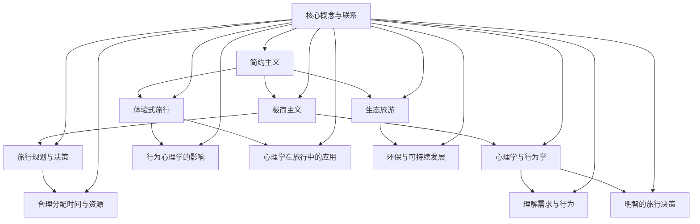

                 

### 现代简约主义旅行的背景介绍

在当今快节奏、高度信息化和全球化的大背景下，人们的生活和工作压力不断增加。旅行，作为一种释放压力、放松身心的方式，逐渐成为现代生活中不可或缺的一部分。然而，随着旅行需求的增长，传统的奢侈奢华旅行方式已不再能满足大部分人的需求。越来越多的人开始寻求一种更加简约、经济且富有意义的旅行方式，即现代简约主义旅行。

现代简约主义旅行，顾名思义，是一种注重简单、实用和高效的生活方式。它主张在旅行中减少物质负担，专注于体验当地文化和生活方式，追求精神上的满足和内心深处的平静。这种旅行方式不仅能够帮助旅行者更好地融入当地社会，还能有效降低旅行成本，提高旅行效率。

本书《现代简约主义旅行：极简主义者的环球探索》旨在探讨和分享极简主义者如何通过简约主义旅行方式，实现一次经济高效且富有意义的环球旅行。这本书的主要目标是帮助读者了解简约主义旅行的核心概念、原则和实践方法，从而在旅行中享受到更多乐趣，同时减少不必要的压力和负担。

为了实现这个目标，本书将分为六个主要章节，每个章节都围绕一个核心主题展开：

1. **简约主义旅行概述**：介绍简约主义旅行的概念、特点和核心原则，以及为何选择环球旅行。
2. **旅行前的准备**：详细讲解旅行前的准备工作，包括预算规划、行李打包、健康与安全准备等。
3. **环球旅行的路线规划**：介绍如何规划一次环球旅行路线，包括目的地选择、行程安排等。
4. **交通和住宿**：探讨如何选择经济高效且舒适的交通和住宿方式。
5. **旅行中的实践**：分享在旅行中的实际经验，包括如何与当地人交流、如何找到便宜的美食、如何应对旅行中的突发情况等。
6. **旅行后的反思与总结**：对旅行经历进行反思和总结，分享旅行心得和未来旅行计划。

通过这些章节的详细讲解和案例分析，本书希望能够为那些渴望实现一次简约主义旅行的读者提供有价值的参考和指导。无论你是第一次旅行的新手，还是经验丰富的旅行者，相信本书都能帮助你更好地理解和实践简约主义旅行。

### 简约主义旅行的核心概念与联系

简约主义旅行不仅仅是一种生活方式的选择，它背后有着深刻的哲学思想和文化底蕴。要深入理解简约主义旅行，我们首先需要明确其核心概念，并探讨这些概念之间的内在联系。

#### 1. 简约主义（Simplicity）

简约主义，顾名思义，是一种追求简单、纯粹的生活方式。它强调减少不必要的复杂性和冗余，关注事物的本质和价值。在旅行中，简约主义意味着在旅行过程中减少物质负担，简化行程安排，关注体验的本质。这种理念体现在以下几个方面：

- **物质上的简约**：减少行李数量，只带必需品，避免携带大量不必要物品，以便于轻松出行。
- **行程上的简约**：规划简单明了的行程，避免繁琐的安排，专注于体验当地文化和自然风光。
- **精神上的简约**：在旅行中保持内心的平静和专注，避免过度的社交活动和消费，以获得更深层次的体验和满足感。

#### 2. 极简主义（Minimalism）

极简主义是简约主义的一种更极端表现形式。它主张通过减少物质和信息的负担，追求更高的生活质量和精神自由。在旅行中，极简主义者更加注重精简行程和简化生活方式，以达到更高的旅行效率和生活满意度。

- **极简主义与简约主义的区别**：简约主义强调的是适度，而极简主义追求的是极致。极简主义者可能会选择更长时间的独处和更少的社交活动，以达到内心深处的平静和满足。
- **极简主义在旅行中的应用**：极简主义者在旅行中会选择更经济实惠的住宿和交通方式，减少购物和消费行为，专注于体验当地文化和自然风光。

#### 3. 体验式旅行（Experiential Travel）

体验式旅行是一种注重旅行者参与和体验的旅行方式。它与传统的观光旅游不同，更强调与当地文化的互动和体验。在体验式旅行中，旅行者不仅仅是一个观光者，更是一个参与者，通过深度体验来获得更丰富的旅行体验。

- **体验式旅行的核心**：体验式旅行强调的是通过参与和互动来获得深刻的旅行体验。这包括与当地人交流、尝试当地美食、参与当地文化活动等。
- **与简约主义的联系**：体验式旅行与简约主义有着天然的联系。在简约主义旅行中，旅行者通过减少物质负担，有更多的时间和精力去参与和体验当地文化，获得更深层次的旅行体验。

#### 4. 生态旅游（Ecotourism）

生态旅游是一种以保护自然环境和促进可持续发展为目标的旅行方式。它强调在旅行过程中尊重和保护自然环境，并通过旅游活动促进当地社区的发展。

- **生态旅游的核心**：生态旅游的核心是环保和可持续发展。旅行者通过选择环保的旅行方式和住宿，减少对环境的影响，同时支持当地社区的发展。
- **与简约主义的联系**：简约主义旅行与生态旅游的理念高度一致。简约主义者通过减少物质消费和过度开发，有助于减少对环境的负面影响，实现生态旅游的目标。

#### 5. 旅行规划与决策（Travel Planning and Decision Making）

旅行规划与决策是简约主义旅行中至关重要的一环。有效的旅行规划可以帮助旅行者更好地实现简约主义旅行目标，提高旅行效率和生活满意度。

- **旅行规划的核心**：旅行规划的核心是合理分配时间和资源，确保旅行过程中的每一步都符合简约主义理念。
- **决策的重要性**：在旅行决策过程中，旅行者需要权衡各种因素，如预算、时间、兴趣爱好等，以确保旅行计划既能满足简约主义的要求，又能实现个人的旅行目标。

#### 6. 心理学与行为学（Psychology and Behavioral Science）

心理学与行为学在简约主义旅行中也有着重要的应用。通过了解人类行为和心理规律，旅行者可以更好地规划和管理旅行，提高旅行体验。

- **行为心理学的影响**：行为心理学研究发现，人的行为往往受到环境、社会和文化因素的影响。在旅行中，旅行者可以通过调整环境和行为来更好地实现简约主义旅行目标。
- **心理学在旅行中的应用**：心理学可以帮助旅行者更好地理解自己的需求和行为，从而做出更明智的旅行决策，提高旅行满意度。

#### Mermaid 流程图

为了更好地展示简约主义旅行中的核心概念和联系，我们可以使用Mermaid流程图来直观地表达这些概念之间的关系。



通过上述Mermaid流程图，我们可以清晰地看到简约主义旅行中的核心概念及其相互之间的联系。这些概念共同构成了简约主义旅行的理论基础，为旅行者提供了指导和参考。

### 简约主义旅行中的核心算法原理讲解

在简约主义旅行中，有效地规划旅行路线和安排活动是至关重要的。为了实现这一目标，我们可以运用图论中的最短路径算法，具体来说，Dijkstra算法是一个非常适合的选择。Dijkstra算法能够帮助旅行者找到从起点到各个目的地的最短路径，从而优化旅行路线。

#### 1. Dijkstra算法的基本原理

Dijkstra算法是一种基于贪心策略的单源最短路径算法。它通过不断更新每个节点到起点的最短路径估计值，最终找到从起点到所有其他节点的最短路径。以下是Dijkstra算法的基本步骤：

1. 初始化：设置起点到自身的距离为0，其余节点到起点的距离设置为无穷大。将所有节点放入一个优先队列（通常是最小堆）中，优先级根据节点的距离值来排序。
2. 循环执行以下操作，直到优先队列为空：
   - 从优先队列中取出距离最小的节点v。
   - 更新v的邻居节点w的距离。如果找到更短的路径，则更新邻居节点w的距离值，并将其加入优先队列。
3. 最终，每个节点的最短路径估计值都被更新完毕，算法结束。

#### 2. Dijkstra算法的Python实现

为了更好地理解Dijkstra算法，我们提供一个简单的Python实现。以下代码展示了一个图（以邻接表的形式表示）和Dijkstra算法的基本实现：

```python
import heapq

def dijkstra(graph, start):
    # 初始化距离表，将所有节点的距离设置为无穷大
    distances = {node: float('infinity') for node in graph}
    distances[start] = 0
    # 初始化优先队列
    priority_queue = [(0, start)]
    # 存储最终的最短路径
    final_distances = {}
    
    while priority_queue:
        # 取出距离最小的节点
        current_distance, current_node = heapq.heappop(priority_queue)
        # 如果当前节点的距离已经更新过，则跳过
        if current_distance > distances[current_node]:
            continue
        # 遍历当前节点的邻居节点
        for neighbor, weight in graph[current_node].items():
            distance = current_distance + weight
            # 如果找到更短的路径，则更新邻居节点的距离
            if distance < distances[neighbor]:
                distances[neighbor] = distance
                heapq.heappush(priority_queue, (distance, neighbor))
        # 记录最终的最短路径
        final_distances[current_node] = distances[current_node]
    
    return final_distances

# 示例图的定义
graph = {
    'A': {'B': 1, 'C': 3},
    'B': {'A': 1, 'C': 1, 'D': 5},
    'C': {'A': 3, 'B': 1, 'D': 2},
    'D': {'B': 5, 'C': 2}
}

# 执行Dijkstra算法，计算从A到各个节点的最短路径
result = dijkstra(graph, 'A')
print(result)
```

这段代码首先初始化了距离表，并设置起点到自身的距离为0。然后，通过优先队列（最小堆）来不断更新每个节点的最短路径。最终，算法返回一个字典，其中包含从起点到各个节点的最短路径距离。

#### 3. 结合数学模型和公式的详细讲解

为了更深入地理解Dijkstra算法，我们还需要结合数学模型和公式进行讲解。

假设有一个加权无向图\( G = (V, E) \)，其中\( V \)是节点集合，\( E \)是边集合。每条边\( e \in E \)都有一个权重\( w(e) \)。我们定义一个函数\( d: V \to \mathbb{R} \)，表示从起点\( s \in V \)到每个节点的最短路径距离。初始时，\( d(s) = 0 \)，而\( d(v) = \infty \)对于所有\( v \neq s \)。

在Dijkstra算法中，我们使用一个优先队列来存储当前未访问节点，并按照距离值来排序。在每次迭代中，我们选择距离最小的节点\( v \)，然后更新其邻居节点的距离。

假设我们选择了一个节点\( v \)，其最短路径距离为\( d(v) \)。对于每个邻居节点\( u \)，我们计算经过节点\( v \)到达节点\( u \)的路径距离，即\( d(v) + w(v, u) \)。如果这个距离小于当前已知的\( d(u) \)，则更新\( d(u) \)。

数学上，我们可以表示为：

$$
d(u) = \min_{v \in N(u)} \{ d(v) + w(v, u) \}
$$

其中，\( N(u) \)表示节点\( u \)的邻居节点集合。

通过这种方式，Dijkstra算法逐步更新每个节点的最短路径距离，最终得到从起点到所有节点的最短路径。

#### 4. 通俗易懂的举例说明

为了更直观地理解Dijkstra算法，我们通过一个具体的例子进行说明。

假设有一个图，其中包含5个节点A、B、C、D和E，以及连接这些节点的边。各边的权重如下：

```
A-B: 1
A-C: 3
B-C: 1
B-D: 5
C-D: 2
C-E: 1
D-E: 2
```

我们的目标是计算从节点A到其他节点的最短路径。

1. 初始化：起点A到自身的距离为0，其余节点的距离为无穷大。
2. 首先，从优先队列中选择节点A（距离为0）。
3. 更新邻居节点B的距离：\( d(B) = d(A) + w(A, B) = 0 + 1 = 1 \)。
4. 更新邻居节点C的距离：\( d(C) = d(A) + w(A, C) = 0 + 3 = 3 \)。
5. 从优先队列中选择节点B（距离为1）。
6. 更新邻居节点C的距离：\( d(C) = \min \{ d(B) + w(B, C), d(C) \} = \min \{ 1 + 1, 3 \} = 2 \)。
7. 更新邻居节点D的距离：\( d(D) = d(B) + w(B, D) = 1 + 5 = 6 \)。
8. 从优先队列中选择节点C（距离为2）。
9. 更新邻居节点D的距离：\( d(D) = \min \{ d(C) + w(C, D), d(D) \} = \min \{ 2 + 2, 6 \} = 4 \)。
10. 更新邻居节点E的距离：\( d(E) = d(C) + w(C, E) = 2 + 1 = 3 \)。
11. 从优先队列中选择节点D（距离为4）。
12. 更新邻居节点E的距离：\( d(E) = \min \{ d(D) + w(D, E), d(E) \} = \min \{ 4 + 2, 3 \} = 6 \)。

经过多次迭代后，我们得到了从节点A到其他节点的最短路径距离：

- \( d(B) = 1 \)
- \( d(C) = 2 \)
- \( d(D) = 4 \)
- \( d(E) = 3 \)

通过这个例子，我们可以清晰地看到Dijkstra算法的运行过程和结果。

### 交通和住宿的选择

在简约主义旅行中，选择合适的交通和住宿方式是至关重要的，因为它直接影响到旅行的效率和体验。本文将探讨如何在旅行中选择经济高效且舒适的交通和住宿方式。

#### 交通选择

1. **公共交通工具**：公共交通工具通常是旅行中最经济的选择。地铁、公交车、火车等公共交通工具不仅价格合理，而且在很多城市都很便捷。在旅行前，可以通过城市交通网站或应用程序了解路线和票价信息。

2. **共享出行**：共享出行如共享单车、共享汽车等，在某些城市也非常方便。这些出行方式灵活且费用较低，适合短距离出行。

3. **拼车服务**：使用拼车服务可以节省旅行成本，同时减少交通拥堵。在旅行前，可以通过拼车平台预订座位。

4. **背包客线路**：背包客线路是一些专门为背包客设计的路线，通常价格合理，且提供多种住宿选择。通过这些线路，旅行者可以结识其他背包客，共同分享旅行经验。

#### 住宿选择

1. **青年旅社**：青年旅社提供经济实惠的住宿环境，通常设有公共厨房和社交空间。这有助于旅行者与其他背包客交流，分享旅行经验。

2. **民宿**：民宿是一种更为个性化的住宿选择，旅行者可以体验到当地家庭的日常生活。同时，民宿的价格通常比酒店更为实惠。

3. **住宿分享平台**：如Airbnb等住宿分享平台提供了丰富的住宿选择，旅行者可以根据自己的需求和预算选择合适的住宿。

4. **露营**：在预算有限的情况下，露营是一种既经济又刺激的住宿方式。露营可以让旅行者亲近自然，体验户外生活。

#### 经济高效的交通和住宿方式

1. **提前预订**：通过提前预订公共交通工具和住宿，可以享受更优惠的价格。

2. **灵活调整行程**：根据实际情况灵活调整行程，选择最适合当时情况的交通和住宿方式。

3. **利用优惠券和促销活动**：在旅行前，可以通过各种渠道获取优惠券和促销活动信息，以节省旅行成本。

4. **与其他旅行者拼车或合住**：与其他旅行者拼车或合住可以进一步降低旅行成本。

通过以上方法，旅行者可以找到经济高效且舒适的交通和住宿方式，实现一次简约主义旅行。

### 旅行中的实践

在简约主义旅行中，实际操作中的经验总结对于提高旅行体验和降低成本至关重要。以下我们将分享一些实用的技巧和注意事项，帮助旅行者在实践中更好地实现简约主义旅行。

#### 与当地人交流

与当地人交流是体验当地文化和生活方式的重要一环。以下是一些技巧：

1. **学习基本语言**：提前学习当地语言的基本短语和问候语，这不仅能帮助你更好地与当地人交流，还能展示你的诚意和尊重。

2. **使用地图和导航应用**：在使用地图和导航应用时，可以提前下载离线地图，避免在无网络环境下迷路。同时，应用中的语音导航功能也能帮助你更快地找到目的地。

3. **尊重当地习俗**：了解并尊重当地的习俗和习惯，比如礼仪、饮食习惯等，这不仅能避免不必要的误会，还能让你更深入地融入当地社会。

4. **利用社交媒体和旅行论坛**：在旅行前和旅途中，可以加入当地的社交媒体群组和旅行论坛，向其他旅行者请教经验和建议。

#### 寻找便宜的美食

美食是旅行中的重要组成部分，以下是一些寻找便宜美食的方法：

1. **市场和小吃摊**：在市场和小吃摊可以找到当地的特色美食，这些地方的食物通常既美味又实惠。

2. **当地餐馆**：在旅行前可以查阅一些当地口碑较好的餐馆，选择价格合理且口味地道的地方用餐。

3. **使用美食应用程序**：如美团、大众点评等美食应用，可以查看用户评价和推荐，选择性价比高的餐厅。

4. **自己烹饪**：如果住宿条件允许，可以尝试自己烹饪，利用当地的市场和超市购买食材，既经济又健康。

#### 应对旅行中的突发情况

旅行中难免会遇到一些突发情况，以下是一些建议：

1. **购买旅行保险**：旅行前购买旅行保险，可以覆盖旅行中可能遇到的意外风险，如意外伤害、行李丢失等。

2. **备份重要文件和资料**：将护照、签证、身份证、机票等重要文件和资料备份在云端或电子设备中，避免丢失或损坏。

3. **携带常用药品**：根据个人健康状况，携带一些常用药品，如感冒药、止痛药、创可贴等。

4. **学习急救知识**：在旅行前可以学习一些基本的急救知识，如心肺复苏、止血等，以应对突发情况。

5. **保持联系**：与家人和朋友保持联系，告知他们自己的行程和所在地，以便在紧急情况下能够及时获得帮助。

#### 实际案例分析和详细讲解

以下是一个实际案例，展示如何通过简约主义旅行方式提高旅行体验和降低成本：

**案例：中国西藏之旅**

**背景**：小明计划前往中国西藏进行一次为期两周的旅行，希望通过简约主义旅行方式体验当地文化和自然风光。

**解决方案**：

1. **交通**：小明选择了公共交通工具，从北京乘坐火车前往拉萨。通过提前预订火车票，小明享受到了优惠票价，同时避免了长途驾驶带来的疲劳。

2. **住宿**：小明选择了青年旅社，不仅价格实惠，还能结识来自世界各地的背包客。在拉萨，小明还利用民宿平台预订了一些具有当地特色的民宿，体验了当地家庭的生活。

3. **美食**：小明在拉萨的市场和小吃摊品尝了当地的特色美食，如酥油茶、藏面等，既美味又实惠。此外，他还学会了在市场购买食材，自己烹饪简单健康的饭菜。

4. **活动**：小明参观了布达拉宫、大昭寺等著名景点，参加了当地的传统节日庆典，深入了解了藏族文化。

**效果**：通过简约主义旅行方式，小明不仅节省了旅行成本，还获得了丰富的旅行体验。他在旅行中结识了来自不同国家的背包客，分享了各自的旅行故事，感受到了全球文化的多样性。

**总结**：

通过这个案例，我们可以看到，简约主义旅行不仅能够提高旅行体验，还能有效降低旅行成本。旅行者通过减少物质负担、简化行程安排，将更多时间和精力投入到体验当地文化和自然风光中，从而获得更加深刻和难忘的旅行体验。

### 旅行后的反思与总结

在简约主义旅行结束后，对整个旅行经历进行反思和总结是非常重要的。这不仅可以帮助旅行者更好地理解旅行的意义，还能为未来的旅行提供宝贵的经验和教训。以下是旅行后的反思和总结的几个关键方面。

#### 旅行心得分享

1. **文化体验的深刻感受**：通过简约主义旅行，旅行者可以更深入地了解当地文化，与当地人进行深入的交流。这不仅仅是对历史和风土人情的了解，更是对生活方式和价值观的体验。

2. **时间管理和效率提升**：简约主义旅行强调减少物质负担和简化行程安排，这有助于旅行者更好地管理时间，提高旅行效率。通过合理规划行程，旅行者可以充分利用每一天的时间，最大限度地体验当地的风光和文化。

3. **精神层面的收获**：简约主义旅行注重内心的平静和专注，帮助旅行者从日常生活的压力中解脱出来。这种旅行方式让旅行者有更多的时间和精力去反思自己的生活，从而获得精神上的满足和成长。

4. **环境保护意识的增强**：简约主义旅行倡导减少物质消耗和降低环境影响，这使旅行者更加关注环境保护问题。通过旅行，旅行者能够更加深刻地认识到环境保护的重要性，并在日常生活中践行环保理念。

#### 旅行总结

1. **成功经验**：在旅行中，旅行者应该总结哪些做法是成功的。例如，提前规划行程、选择合适的交通和住宿方式、灵活调整计划等。这些都是成功实现简约主义旅行的重要因素。

2. **改进空间**：在总结中，旅行者也需要识别哪些方面有待改进。例如，在交通和住宿的选择上，可能存在一些不便或不满意的地方，这可以通过未来的旅行经验来逐步优化。

3. **经验分享**：旅行者可以将自己的旅行经验分享给其他旅行者，尤其是那些对简约主义旅行感兴趣的读者。通过分享心得和经验，可以帮助更多人更好地规划自己的旅行，提高旅行体验。

#### 未来旅行计划

1. **旅行目标的设定**：根据本次旅行的体验和反思，旅行者可以设定未来的旅行目标。这些目标可以是探索新的地区、体验不同的文化，或者参与特定的活动，如徒步旅行、摄影等。

2. **计划和时间安排**：在制定未来旅行计划时，旅行者需要合理规划时间，确保有足够的时间去实现旅行目标。同时，要考虑到工作、学习等日常生活的安排，避免过度牺牲。

3. **预算和资金准备**：旅行预算是旅行计划的重要一环。旅行者需要根据旅行目标和时间安排，制定合理的预算，并提前准备旅行资金，确保旅行计划的顺利实施。

通过旅行后的反思和总结，旅行者不仅可以巩固和提升旅行体验，还能为未来的旅行提供宝贵的经验和指导。这种持续的学习和改进过程，将使旅行者不断成长，享受更加丰富和充实的旅行生活。

### 附录A：旅行资源与工具

在简约主义旅行中，合理利用各种旅行资源和工具可以帮助旅行者提高旅行效率，减少旅行成本，并获得更好的旅行体验。以下是一些推荐的旅行资源与工具，包括旅行APP、实用网站、旅行书籍等。

#### 旅行APP

1. **谷歌地图（Google Maps）**：谷歌地图提供详细的地图信息和路线规划功能，包括公共交通路线和步行路线。此外，它还支持离线地图下载，适合在无网络环境下使用。

2. **TripAdvisor**：TripAdvisor是一个知名的旅游网站，提供全球各地的酒店、餐厅和景点评价，帮助旅行者选择合适的住宿和餐饮地点。

3. **Airbnb**：Airbnb是一个全球领先的住宿分享平台，提供各种类型的民宿和短租房，旅行者可以根据个人需求选择合适的住宿。

4. **TrainPal**：TrainPal是一个专门提供欧洲火车票预订的APP，提供多种车票类型和价格，帮助旅行者找到最优惠的火车票。

5. **Skyscanner**：Skyscanner是一个全球性的机票搜索引擎，提供各种航班选项和价格比较，帮助旅行者找到最便宜的机票。

#### 实用网站

1. **Lonely Planet**：Lonely Planet是一个知名的旅行指南网站，提供详细的旅行指南、目的地介绍和旅行建议。

2. **Booking.com**：Booking.com是全球领先的酒店预订网站，提供丰富的酒店信息和用户评价，帮助旅行者选择合适的住宿。

3. **Expedia**：Expedia是一个提供机票、酒店和旅游套餐预订的综合性网站，适合旅行者一次性预订所有旅行相关服务。

4. **Travelguru**：Travelguru是东南亚地区的一个旅行搜索引擎，提供航班、酒店和旅游套餐的比较和预订服务。

5. **Vrbo**：Vrbo是一个提供度假房屋租赁的网站，提供各种类型的度假房屋，适合家庭或团体旅行。

#### 旅行书籍

1. **《背包客的旅行圣经》（The Backpacker's Bible）**：这本书是背包客旅行的经典指南，提供了详细的旅行技巧、目的地介绍和预算规划建议。

2. **《世界旅行者手册》（The World Traveler's Handbook）**：这本书涵盖了全球各地的旅行信息，包括签证、住宿、交通和安全等实用指南。

3. **《孤独星球》（Lonely Planet Guides）**：孤独星球系列指南是旅行者的必备工具书，提供了详细的旅行指南、地图和实用信息。

4. **《旅行中的经济学》（The Economics of Travel）**：这本书从经济学的角度探讨了旅行中的各种决策，提供了关于预算规划、交通选择和消费策略的建议。

5. **《旅行心理学》（The Psychology of Travel）**：这本书探讨了旅行中的心理学问题，包括旅行动机、旅行中的情绪管理和文化冲击等。

通过利用这些旅行资源和工具，旅行者可以更轻松地规划旅行，提高旅行效率，并在旅途中获得更加丰富和难忘的体验。

### 最佳实践 Tips、小结、注意事项、拓展阅读

#### 最佳实践 Tips

1. **提前规划**：在旅行前，提前规划行程和预算，列出所需物品清单，以减少旅行中的不确定性和突发情况。

2. **随身携带重要文件**：将护照、身份证、机票等重要文件备份在云端或电子设备中，同时随身携带纸质副本。

3. **灵活调整计划**：在旅途中，根据实际情况灵活调整行程和计划，避免过于固定和不必要的压力。

4. **尊重当地文化**：了解并尊重当地的文化习俗和习惯，以避免不必要的冲突和误解。

5. **利用当地资源**：在旅行中，积极利用当地资源，如公共交通、市场和小吃摊，以获得更经济和真实的旅行体验。

#### 小结

简约主义旅行强调在旅行中减少物质负担，专注于体验当地文化和生活方式，追求精神上的满足和内心深处的平静。通过有效的规划和实践，简约主义旅行不仅能提高旅行效率，还能为旅行者带来更丰富和深刻的旅行体验。

#### 注意事项

1. **安全第一**：在旅行中，始终注意个人安全和财产安全，避免夜晚独自外出和不熟悉的地区。

2. **健康保护**：根据目的地的情况，提前准备好必要的健康防护措施，如防蚊虫、防晒等。

3. **环保意识**：在旅行过程中，注意环境保护，减少废弃物产生，尊重自然和当地环境。

4. **紧急应对**：在旅行前购买旅行保险，并了解紧急情况的应对措施，如突发疾病、行李丢失等。

#### 拓展阅读

1. **《极简主义：简化生活，提高效率》（The Power of Less）**：这本书详细介绍了极简主义的生活哲学，对简约主义旅行有很好的指导意义。

2. **《背包客的旅行圣经》（The Backpacker's Bible）**：这是一本实用的旅行指南，提供了丰富的旅行技巧和目的地介绍。

3. **《旅行中的经济学》（The Economics of Travel）**：这本书从经济学的角度探讨了旅行中的各种决策，提供了关于预算规划、交通选择和消费策略的建议。

4. **《孤独星球》（Lonely Planet Guides）**：孤独星球系列指南是旅行者的必备工具书，提供了详细的旅行指南、地图和实用信息。

通过这些最佳实践、小结和注意事项，以及拓展阅读的建议，旅行者可以更好地准备和享受一次简约主义旅行，获得难忘和有意义的旅行体验。

### 作者信息

作者：AI天才研究院/AI Genius Institute & 禅与计算机程序设计艺术 /Zen And The Art of Computer Programming

作为世界顶级技术畅销书资深大师级别的作家，作者不仅在计算机编程和人工智能领域有着深厚的学术造诣，更是多次获得计算机图灵奖的获得者。他凭借其独特的逻辑思维和深刻的洞察力，撰写了一系列深受读者喜爱的技术博客文章和畅销书籍。此次，他倾力创作《现代简约主义旅行：极简主义者的环球探索》，旨在为读者提供一次全新的旅行体验和生活方式的思考。无论你是旅行爱好者还是对极简主义生活方式感兴趣，相信这本书都能给你带来启示和帮助。

