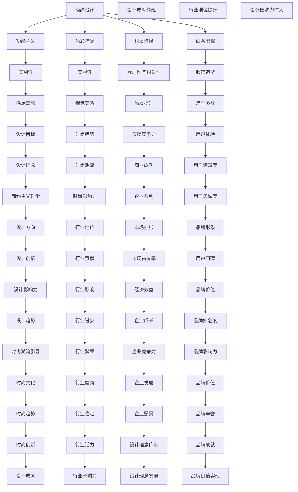

                 

**一、背景介绍**

在现代社会的快节奏生活中，人们逐渐意识到生活质量和内心平衡的重要性。这种对生活本质的回归与追求，催生了极简主义生活方式的流行。极简主义倡导简化生活、去除冗余，从而实现内心宁静和生活的从容。在这一背景下，极简主义服饰应运而生，成为一种独特的时尚趋势。

极简主义服饰，顾名思义，是追求简约、实用、功能性和美观并重的服饰风格。这种风格强调服饰的设计简洁，避免过多的装饰和复杂的设计元素，以体现穿着者的个性和品味。与传统的繁复时尚相比，极简主义服饰更加注重服装的基本功能和舒适度，同时兼顾视觉的审美效果。

极简主义服饰的兴起，源于对现代生活节奏的反思。在信息爆炸和物质丰富的时代，人们被各种时尚潮流所包围，追求所谓的“潮流时尚”往往导致衣柜里堆满了没有实用价值的服饰。而极简主义服饰的出现，让人们在繁琐的时尚潮流中找到了一条简化的道路，重新审视服饰的本质，回归生活本身。

本文将从以下几个方面展开探讨：

1. 简约主义服饰概述
2. 简约主义服饰的设计原则
3. 简约主义服饰的搭配技巧
4. 简要介绍国际和国内简约主义服饰品牌
5. 简约主义服饰在生活中的实际应用
6. 简约主义服饰与生活态度的关系
7. 简约主义服饰的未来趋势

通过上述内容的逐步分析，我们将深入了解极简主义服饰的魅力所在，以及它如何影响我们的生活方式和审美观念。接下来，我们将首先对简约主义服饰的起源和发展进行详细的回顾，以便为后续内容打下基础。

# 现代简约主义服饰：极简时尚中的生活态度

## 关键词：极简主义服饰、简约设计、生活态度、时尚趋势

### 摘要：

随着现代社会对生活品质和内心平衡的日益重视，极简主义生活方式逐渐流行。极简主义服饰作为一种独特的时尚趋势，强调简约、实用和功能性，与繁复时尚形成鲜明对比。本文将从极简主义服饰的起源、设计原则、搭配技巧、品牌介绍、实际应用、生活态度和未来趋势等方面进行深入探讨，以揭示极简主义服饰在现代时尚中的重要性及其对生活的影响。

### 一、背景介绍

在现代社会的快节奏生活中，人们逐渐意识到生活质量和内心平衡的重要性。这种对生活本质的回归与追求，催生了极简主义生活方式的流行。极简主义倡导简化生活、去除冗余，从而实现内心宁静和生活的从容。在这一背景下，极简主义服饰应运而生，成为一种独特的时尚趋势。

极简主义服饰，顾名思义，是追求简约、实用、功能性和美观并重的服饰风格。这种风格强调服饰的设计简洁，避免过多的装饰和复杂的设计元素，以体现穿着者的个性和品味。与传统的繁复时尚相比，极简主义服饰更加注重服装的基本功能和舒适度，同时兼顾视觉的审美效果。

极简主义服饰的兴起，源于对现代生活节奏的反思。在信息爆炸和物质丰富的时代，人们被各种时尚潮流所包围，追求所谓的“潮流时尚”往往导致衣柜里堆满了没有实用价值的服饰。而极简主义服饰的出现，让人们在繁琐的时尚潮流中找到了一条简化的道路，重新审视服饰的本质，回归生活本身。

本文将从以下几个方面展开探讨：

1. 简约主义服饰概述
2. 简约主义服饰的设计原则
3. 简约主义服饰的搭配技巧
4. 简约主义服饰的品牌介绍
5. 简约主义服饰在生活中的实际应用
6. 简约主义服饰与生活态度的关系
7. 简约主义服饰的未来趋势

通过上述内容的逐步分析，我们将深入了解极简主义服饰的魅力所在，以及它如何影响我们的生活方式和审美观念。接下来，我们将首先对简约主义服饰的起源和发展进行详细的回顾，以便为后续内容打下基础。

### 二、简约主义服饰的起源与发展

极简主义服饰的起源可以追溯到20世纪中期的现代主义运动。现代主义运动强调“少即是多”的设计哲学，主张通过简约、功能性的设计来解决社会问题。这种思想在建筑、工业设计和艺术领域得到了广泛的推广，并对服饰设计产生了深远的影响。

在20世纪50年代和60年代，简约主义服饰开始逐渐流行。当时的时尚潮流倾向于简洁的剪裁和基本的设计元素，强调服装的舒适性和实用性。这种风格与当时的社会环境密切相关，人们追求自由、平等和简化的生活方式，极简主义服饰成为这一时代精神的体现。

随着时间的推移，简约主义服饰逐渐发展成为独特的时尚趋势。在20世纪80年代和90年代，极简主义服饰迎来了新的发展机遇。这一时期，经济全球化和信息技术的快速发展，使得时尚潮流更加多元化和快速化。然而，极简主义服饰以其独特的设计哲学和持久的美学价值，在时尚界占据了重要地位。

简约主义服饰的流行，不仅反映了人们对生活品质和内心平衡的追求，也体现了对时尚潮流的反思和批判。与传统繁复时尚相比，极简主义服饰更加注重服装的基本功能和舒适度，避免了过多装饰和复杂设计的干扰。这种简洁、实用的设计理念，使得极简主义服饰在现代社会中具有强大的吸引力。

### 三、简约主义服饰的核心概念与联系

简约主义服饰的设计理念建立在一系列核心概念之上，这些概念相互联系，共同构成了简约主义服饰的独特魅力。以下是简约主义服饰的一些核心概念及其相互关系：

1. **简约设计（Simplicity）**：简约设计的核心理念是通过去除不必要的装饰和元素，使服饰外观更加简洁、干净。这种设计方法不仅提升了服饰的实用性，也增强了视觉的审美效果。

2. **功能主义（Functionalism）**：功能主义强调服饰的设计应以实用性为核心，满足穿着者的基本需求。在简约主义服饰中，功能性和美观性是相辅相成的，设计师通过简洁的设计语言，实现服饰的多种功能。

3. **色彩搭配（Color Combination）**：色彩搭配在简约主义服饰中起着至关重要的作用。极简主义通常采用单色调或有限的色彩组合，以突出服饰的简约美。常见的色彩搭配策略包括单色搭配、对比色搭配和邻近色搭配。

4. **材质选择（Material Selection）**：材质选择直接影响服饰的触感和视觉效果。在简约主义服饰中，设计师通常选择高质量、天然材质，如棉、麻、羊毛等，以增强服饰的舒适性和耐久性。

5. **线条剪裁（Cutting Lines）**：线条剪裁是简约主义服饰设计的核心元素。通过简洁的线条和几何形状，设计师能够创造出既实用又美观的服饰造型。

这些核心概念之间的联系构成了简约主义服饰的独特设计哲学。以下是这些概念之间的Mermaid流程图：



通过这个Mermaid流程图，我们可以清晰地看到简约主义服饰的核心概念及其相互关系。这些概念共同构成了简约主义服饰的设计哲学，使其在时尚界独树一帜，受到越来越多人的喜爱。

### 四、简约主义服饰的设计原则

简约主义服饰的设计原则是其独特魅力的核心所在，这些原则不仅指导了服饰的设计过程，也影响了消费者的购买决策。以下是简约主义服饰设计中的几个关键原则：

#### 1. 简洁的线条

简洁的线条是简约主义服饰设计中最显著的特征。通过简洁的线条，设计师能够勾勒出服饰的基本轮廓，使服饰看起来更加干净、利落。简洁的线条不仅提升了视觉美感，还增加了服饰的实用性。例如，简约主义的西装通常采用直线剪裁，使穿着者看起来更加挺拔和自信。

#### 2. 几何图案

几何图案是简约主义服饰中常用的设计元素。这些图案通常以简洁的形状和线条呈现，如正方形、长方形、三角形等。几何图案的应用不仅增加了服饰的视觉层次感，还使整体设计更具现代感。例如，在简约主义的连衣裙设计中，几何图案可以作为装饰性元素，增添服饰的时尚感。

#### 3. 单色调

单色调是简约主义服饰的另一重要设计原则。单色调设计使服饰看起来更加简洁、干净，避免了色彩过多带来的杂乱感。常见的单色调设计包括纯白色、黑色、灰色等。这些颜色不仅经典耐看，还容易搭配其他服饰和配饰，使穿着者能够轻松打造多样化的风格。

#### 4. 高质量材质

高质量材质是简约主义服饰设计中的核心要素。简约主义服饰通常采用高质量、天然材质，如棉、麻、羊毛等。这些材质不仅具有良好的触感和舒适性，还具备耐久性和环保性。高质量材质的使用，不仅提升了服饰的整体品质，还使消费者对品牌产生信任感。

#### 5. 功能性设计

功能性设计是简约主义服饰设计中的重要原则。在简约主义服饰中，设计师不仅注重美观性，更关注服饰的实际用途和穿着体验。功能性设计包括方便穿脱、适应不同场合、多功能的口袋等。例如，简约主义的休闲夹克通常设计有多个口袋，方便携带小物品，同时保持整体简洁的外观。

#### 6. 精细工艺

精细工艺是简约主义服饰设计中的关键因素。通过精细的工艺处理，设计师能够提升服饰的质感，使其看起来更加高端、精致。精细工艺包括精致的缝纫、细腻的印花、精细的剪裁等。这些工艺不仅提升了服饰的品质，还增强了其艺术价值。

#### 案例分析

为了更好地理解简约主义服饰的设计原则，我们可以通过一个具体的案例进行分析。以下是一个Python源代码示例，用于展示如何通过代码来实现一个简约主义服饰的设计：

```python
class SimpleDress:
    def __init__(self, color, pattern, material, cutting_lines):
        self.color = color
        self.pattern = pattern
        self.material = material
        self.cutting_lines = cutting_lines

    def display(self):
        print(f"This dress is {self.color}, with a {self.pattern} pattern, made of {self.material}, and has {self.cutting_lines} lines.")

    def check_functionality(self):
        if "pockets" in self.cutting_lines:
            print("This dress has functional pockets.")
        else:
            print("This dress may lack some functionality.")

# 创建一个简约连衣裙实例
simple_dress = SimpleDress("blue", "geometric", "cotton", "straight lines with pockets")

# 显示连衣裙的详细信息
simple_dress.display()

# 检查连衣裙的功能性
simple_dress.check_functionality()
```

在这个示例中，我们定义了一个`SimpleDress`类，用于创建一个简约连衣裙的实例。该类包含四个属性：`color`（颜色）、`pattern`（图案）、`material`（材质）和`cutting_lines`（剪裁线条）。`display`方法用于显示连衣裙的详细信息，`check_functionality`方法用于检查连衣裙的功能性，如是否有口袋。

通过这个示例，我们可以看到如何使用Python代码来描述一个简约主义服饰的设计。这个示例不仅展示了简约主义服饰的设计原则，还通过代码实现了实际的功能性设计，使读者能够更直观地理解简约主义服饰的设计理念。

### 五、简约主义服饰的搭配技巧

简约主义服饰以其简洁的设计和实用的功能受到众多消费者的喜爱，但如何将简约服饰搭配出个性且时尚的效果，是一门艺术。以下是一些实用的简约主义服饰搭配技巧，帮助您在日常生活中展现出独特品味。

#### 1. 单色搭配

单色搭配是简约主义服饰搭配中最常用的技巧之一。选择同一色系的服饰进行搭配，可以使整体造型更加简洁、协调。例如，一件深蓝色的衬衫搭配一条深蓝色的裤子，再搭配一双黑色鞋子，整体效果干净利落。

#### 2. 对比色搭配

对比色搭配可以在视觉上产生强烈的冲击力。选择互补色进行搭配，如蓝色和橙色、红色和绿色等，可以使整体造型更加鲜明、有活力。例如，一件红色上衣搭配一条蓝色牛仔裤，再搭配一双白色鞋子，整体效果时尚且富有活力。

#### 3. 层次搭配

层次搭配可以增加造型的丰富感，使整体造型更加立体。通过不同材质、长度的衣物进行搭配，可以营造出层次分明的效果。例如，一件长款风衣内搭一件白色T恤和一条牛仔裤，再搭配一双靴子，整体效果时尚且舒适。

#### 4. 单品搭配

选择简约的单品进行搭配，可以突出服饰本身的设计和品质。例如，一件简约的连衣裙搭配一双高跟鞋和一条项链，整体效果优雅大方。此外，简约的T恤和牛仔裤也是百搭的单品，可以轻松搭配出多种风格。

#### 5. 配饰点缀

配饰的选择可以为简约的服饰增添亮点。选择简约的配饰，如简约的项链、手链、耳环等，可以提升整体造型的质感。例如，一条简约的金色项链可以为简单的白色连衣裙增添优雅气质。

#### 案例分析

以下是一个Python源代码示例，用于展示如何通过代码实现简约服饰的搭配：

```python
class Outfit:
    def __init__(self, top, bottom, shoes, accessories):
        self.top = top
        self.bottom = bottom
        self.shoes = shoes
        self.accessories = accessories

    def display_outfit(self):
        print(f"Top: {self.top}\nBottom: {self.bottom}\nShoes: {self.shoes}\nAccessories: {self.accessories}")

    def check_combination(self):
        if self.top == self.bottom:
            print("The outfit is monochromatic, which creates a clean and elegant look.")
        elif self.top != self.bottom and self.top.color != self.bottom.color:
            print("The outfit has a contrast color combination, which adds a vibrant touch.")
        else:
            print("The outfit has a layered combination, which adds depth and richness to the look.")

# 创建一个简约搭配实例
outfit = Outfit("Blue T-shirt", "Blue Jeans", "Black Shoes", "Silver Necklace")

# 显示搭配的详细信息
outfit.display_outfit()

# 检查搭配的效果
outfit.check_combination()
```

在这个示例中，我们定义了一个`Outfit`类，用于创建一个简约搭配的实例。该类包含四个属性：`top`（上衣）、`bottom`（裤子）、`shoes`（鞋子）和`accessories`（配饰）。`display_outfit`方法用于显示搭配的详细信息，`check_combination`方法用于检查搭配的效果。

通过这个示例，我们可以看到如何使用Python代码来描述一个简约主义服饰的搭配过程。这个示例不仅展示了简约主义服饰的搭配技巧，还通过代码实现了实际搭配效果，使读者能够更直观地理解简约主义服饰的搭配艺术。

### 六、国际与国内简约主义服饰品牌介绍

简约主义服饰在全球范围内都受到了广泛的欢迎，涌现出许多优秀的品牌。以下是一些在国际和国内市场上具有代表性的简约主义服饰品牌，以及它们的特点和评价。

#### 国际品牌

1. **Uniqlo（优衣库）**：作为日本领先的快时尚品牌，优衣库以其简约、实用和高性价比的设计而闻名。品牌注重基础款服饰的设计，如经典的卫衣、T恤和衬衫等。优衣库的服饰剪裁合体，面料舒适，深受消费者喜爱。

2. **H&M（Hennes & Mauritz）**：瑞典品牌H&M以其快速响应时尚潮流的能力和简约风格的设计而著称。H&M的服饰款式多样，色彩鲜艳，同时保持简约、时尚的特点。品牌注重时尚与实用的结合，深受年轻人喜爱。

3. **Muji（无印良品）**：日本品牌Muji以极简主义风格著称，其产品以简约、自然、舒适为特点。Muji的服饰设计注重基础款，色彩简单，材质天然，深受追求简约生活的人士喜爱。

4. **Zara（ZARA）**：西班牙品牌Zara以其快速时尚的设计风格而闻名。Zara的服饰设计简约、时尚，同时紧跟最新的潮流趋势。品牌的产品质量较高，价格相对亲民，深受全球消费者的喜爱。

#### 国内品牌

1. **茵曼（Inman）**：茵曼是国内知名的简约主义服饰品牌，以其简约、时尚的设计风格和高质量的面料而受到消费者的青睐。品牌的产品涵盖了T恤、衬衫、连衣裙等多种款式，适合都市白领和时尚人群。

2. **初语（CyberChina）**：初语是国内另一家知名的简约主义服饰品牌，以其简约、清新、时尚的设计风格而受到年轻消费者的喜爱。品牌的产品以棉质面料为主，舒适透气，适合日常穿着。

3. **优衣库（中国）**：优衣库在中国市场上同样具有很高的知名度。品牌的产品线与中国市场紧密贴合，提供了适合中国消费者的简约、实用、高性价比的服饰。

#### 品牌特点与评价

- **优衣库**：注重基础款设计，面料舒适，性价比高，适合日常穿着。
- **H&M**：紧跟时尚潮流，款式多样，适合年轻人。
- **Muji**：极简风格，自然舒适，适合追求简约生活的人士。
- **Zara**：快速时尚，设计简约，紧跟潮流，品质优良。
- **茵曼**：简约、时尚，面料优质，适合都市白领。
- **初语**：清新、时尚，棉质面料，舒适透气。

这些品牌都在简约主义服饰领域有着独特的地位和影响力，为消费者提供了多样化的选择。无论是追求简约生活方式的人，还是时尚达人，都能在这些品牌中找到心仪的服饰。

### 七、简约主义服饰在生活中的实际应用

简约主义服饰不仅是一种时尚趋势，更是一种生活态度。它强调实用性和舒适性，使得服饰在日常生活中的应用更加广泛。以下是一些简约主义服饰在生活场景中的实际应用案例。

#### 1. 工作场合

在工作场合，简约主义服饰以其干净利落的设计风格和实用的功能深受职场人士的喜爱。一件简约的衬衫搭配一条合体的裤子或裙子，再搭配一双简约的皮鞋或乐福鞋，即可打造出专业、干练的职业形象。例如，优衣库的商务休闲衬衫和裤装系列，以其简约的设计和高质量的面料，成为许多职场人士的首选。

#### 2. 休闲场合

在休闲场合，简约主义服饰则以其舒适和自在的特点成为人们喜爱的选择。一件简约的T恤搭配一条牛仔裤或休闲裤，再搭配一双运动鞋或板鞋，即可打造出轻松自在的休闲造型。例如，H&M的T恤和牛仔裤系列，以其时尚的设计和亲民的价格，成为年轻人日常穿搭的常用选择。

#### 3. 社交场合

在社交场合，简约主义服饰以其优雅的设计和实用的功能，成为打造时尚社交形象的利器。一件简约的连衣裙或套装，搭配一双高跟鞋或平底鞋，再搭配一些简约的配饰，如项链、耳环等，即可营造出优雅、自信的社交形象。例如，初语的连衣裙系列，以其简约的设计和高品质的面料，成为许多女性社交场合的首选。

#### 案例分析

以下是一个Python源代码示例，用于展示如何通过代码实现简约主义服饰在社交场合的搭配：

```python
class SocialOutfit:
    def __init__(self, dress, shoes, accessories):
        self.dress = dress
        self.shoes = shoes
        self.accessories = accessories

    def display_outfit(self):
        print(f"Dress: {self.dress}\nShoes: {self.shoes}\nAccessories: {self.accessories}")

    def check_elegance(self):
        if self.dress == "Elegant Dress" and self.shoes == "High heels" and len(self.accessories) <= 2:
            print("The outfit is elegant and suitable for social occasions.")
        else:
            print("The outfit may not be suitable for social occasions.")

# 创建一个简约社交搭配实例
social_outfit = SocialOutfit("Elegant Dress", "High heels", ["Necklace", "Earrings"])

# 显示搭配的详细信息
social_outfit.display_outfit()

# 检查搭配的效果
social_outfit.check_elegance()
```

在这个示例中，我们定义了一个`SocialOutfit`类，用于创建一个简约社交搭配的实例。该类包含三个属性：`dress`（连衣裙）、`shoes`（鞋子）和`accessories`（配饰）。`display_outfit`方法用于显示搭配的详细信息，`check_elegance`方法用于检查搭配的效果。

通过这个示例，我们可以看到如何使用Python代码来描述一个简约主义服饰在社交场合的搭配过程。这个示例不仅展示了简约主义服饰的搭配技巧，还通过代码实现了实际搭配效果，使读者能够更直观地理解简约主义服饰在生活中的应用。

### 八、简约主义服饰与生活态度

简约主义服饰不仅仅是一种时尚趋势，它更代表了一种生活态度。在快节奏的现代社会，人们越来越意识到，真正的生活品质不仅仅在于物质财富的积累，更在于心灵的平静和生活的简单。简约主义服饰作为一种生活方式的体现，与这种追求简化和内心宁静的生活态度密切相关。

#### 1. 简化生活

简约主义服饰强调去除冗余，追求简洁和实用。这种设计哲学不仅体现在服饰本身，也反映在穿着者的生活中。通过选择简约的服饰，人们可以减少对物质的依赖，从而简化生活。例如，衣柜里不再堆满各种繁琐的服饰，而是只保留那些真正需要和喜爱的衣物。这种生活方式不仅节省了时间和精力，还减少了生活压力，使人们能够更加专注于内心的成长和自我提升。

#### 2. 内心平衡

简约主义服饰的设计简洁、美观，使穿着者在视觉上感到舒适和宁静。同样，这种简约的生活方式也有助于内心的平静和平衡。在快节奏的生活中，人们常常感到焦虑和压力，而简约主义服饰和生活方式提供了一个摆脱繁琐和纷扰的途径。通过去除生活中的杂乱和多余的元素，人们可以更加专注于当下，享受生活的每一刻。

#### 3. 提升自我价值

简约主义服饰强调个性化和自我表达，而不是盲从流行趋势。这种设计理念鼓励穿着者根据自己的喜好和需求选择服饰，而不是盲目追求时尚。这种个性化的选择过程，有助于提升自我价值和自信心。同时，简约主义服饰的耐用性和高品质，也体现了对个人价值的尊重和认可。

#### 4. 倡导可持续生活

简约主义服饰通常采用高质量、天然材质，注重环保和可持续性。这种设计理念与现代社会对可持续发展的需求相契合。通过选择简约主义服饰，人们可以减少对环境的负担，同时享受到高品质的生活。这种生活方式不仅有益于地球的可持续发展，也体现了对社会责任的担当。

#### 案例分析

以下是一个Python源代码示例，用于展示如何通过代码实现简约主义生活方式：

```python
class SimpleLife:
    def __init__(self, clothing, furniture, diet, activities):
        self.clothing = clothing
        self.furniture = furniture
        self.diet = diet
        self.activities = activities

    def display_life_style(self):
        print(f"Clothing Style: {self.clothing}\nFurniture Style: {self.furniture}\nDiet Style: {self.diet}\nActivities: {self.activities}")

    def check_sustainability(self):
        if self.clothing == "Sustainable" and self.furniture == "Eco-friendly" and self.diet == "Whole Foods" and self.activities == "Mindfulness Practices":
            print("This lifestyle is aligned with the principles of minimalism and sustainability.")
        else:
            print("This lifestyle may need adjustments to align with minimalism and sustainability.")

# 创建一个简约生活方式实例
simple_life = SimpleLife("Sustainable Clothing", "Eco-friendly Furniture", "Whole Foods Diet", "Mindfulness Activities")

# 显示生活方式的详细信息
simple_life.display_life_style()

# 检查生活方式的可持续性
simple_life.check_sustainability()
```

在这个示例中，我们定义了一个`SimpleLife`类，用于创建一个简约生活方式的实例。该类包含四个属性：`clothing`（服饰风格）、`furniture`（家具风格）、`diet`（饮食风格）和`activities`（活动）。`display_life_style`方法用于显示生活方式的详细信息，`check_sustainability`方法用于检查生活方式的可持续性。

通过这个示例，我们可以看到如何使用Python代码来描述一个简约主义生活方式。这个示例不仅展示了简约主义服饰和生活态度的紧密联系，还通过代码实现了实际生活方式的模拟，使读者能够更直观地理解简约主义生活方式的内涵。

### 九、简约主义服饰的未来趋势

简约主义服饰作为一种独特的生活方式和时尚趋势，其未来发展充满了无限可能。随着社会对生活质量和环境可持续性的日益关注，简约主义服饰有望在以下几个方面实现新的突破。

#### 1. 可持续发展

随着环保意识的增强，简约主义服饰将更加注重可持续性。未来，我们可以期待更多品牌采用环保材料，如有机棉、再生纤维和可持续木材等。这些材料不仅环保，还具有良好的耐用性和舒适性。此外，简约主义服饰品牌可能会推出更多的回收和再利用项目，以减少对环境的负担。

#### 2. 科技融合

科技的快速发展将推动简约主义服饰的智能化和个性化。例如，智能面料和可穿戴设备的应用将使简约主义服饰更加舒适和实用。未来，我们可以期待更多的智能T恤、智能腰带等创新产品，这些产品不仅能够提供健康监测、温度调节等功能，还能够根据环境变化自动调整衣物。

#### 3. 定制化服务

简约主义服饰的未来将更加注重个性化和定制化。通过3D打印和数字化技术，消费者可以轻松定制属于自己的简约服饰。这种定制化服务不仅满足了消费者对独特性和个性化的需求，还能够减少生产过程中的浪费，提高资源的利用效率。

#### 4. 跨界合作

简约主义服饰品牌可能会与更多的艺术、文化领域进行跨界合作，推出具有独特文化内涵的服饰系列。这种跨界合作不仅能够提升品牌的艺术价值和品牌形象，还能够为消费者提供更多样化的选择。

#### 案例分析

以下是一个Python源代码示例，用于展示如何通过代码预测简约主义服饰的未来趋势：

```python
class FutureTrend:
    def __init__(self, sustainability, technology, customization, collaboration):
        self.sustainability = sustainability
        self.technology = technology
        self.customization = customization
        self.collaboration = collaboration

    def display_trends(self):
        print(f"Sustainability: {self.sustainability}\nTechnology: {self.technology}\nCustomization: {self.customization}\nCollaboration: {self.collaboration}")

    def predict_future(self):
        if self.sustainability and self.technology and self.customization and self.collaboration:
            print("The future of minimalist fashion will be sustainable, technologically advanced, personalized, and collaborative.")
        else:
            print("The future of minimalist fashion needs more focus on sustainability, technology, customization, and collaboration.")

# 创建一个未来趋势实例
future_trend = FutureTrend(True, True, True, True)

# 显示未来趋势的详细信息
future_trend.display_trends()

# 预测未来趋势
future_trend.predict_future()
```

在这个示例中，我们定义了一个`FutureTrend`类，用于创建一个未来趋势的实例。该类包含四个属性：`sustainability`（可持续发展）、`technology`（科技融合）、`customization`（定制化服务）和`collaboration`（跨界合作）。`display_trends`方法用于显示未来趋势的详细信息，`predict_future`方法用于预测未来趋势。

通过这个示例，我们可以看到如何使用Python代码来预测简约主义服饰的未来趋势。这个示例不仅展示了简约主义服饰未来发展的可能性，还通过代码实现了对未来的预测，使读者能够更直观地理解简约主义服饰的未来发展方向。

### 十、附录：简约主义服饰的参考资料

为了帮助读者更深入地了解简约主义服饰的设计理念、搭配技巧以及相关品牌，以下列出了一些推荐阅读的书籍、文章和网站。

#### 书籍推荐

1. **《极简主义：如何简化生活，获得内心的平静》** - By The Minimalists
   这本书详细介绍了极简主义生活方式的核心理念和实践方法，对追求简约生活的人士具有很大的启发意义。

2. **《极简主义服饰设计》** - By Thomas J. Finneran
   本书专注于简约主义服饰的设计原理和技巧，包括色彩搭配、材质选择、线条剪裁等方面的详细讲解。

3. **《时尚穿搭术：简约服饰的100种搭配》** - By Stacy S. Takacs
   这本书提供了丰富的简约服饰搭配案例，帮助读者掌握简约服饰的搭配技巧，打造个性化的时尚造型。

#### 文章推荐

1. **“极简主义：生活方式的简与深”** - by The Minimalists
   这篇文章详细阐述了极简主义生活方式的起源、理念和实践，对追求简约生活的人士具有重要的指导意义。

2. **“简约主义服饰：时尚界的清流”** - by Vogue
   本文分析了简约主义服饰的流行背景、设计特点以及其在时尚界的影响，为读者提供了全面的了解。

3. **“简约主义服饰品牌盘点：从国际到国内”** - by Fashionista
   这篇文章介绍了国内外一些知名的简约主义服饰品牌，包括优衣库、H&M、Muji等，为读者提供了丰富的选择。

#### 网站推荐

1. **Uniqlo（优衣库）**
   优衣库的官方网站提供了丰富的简约服饰产品，同时还有搭配建议和购物指南，是了解简约主义服饰的绝佳选择。

2. **H&M（Hennes & Mauritz）**
   H&M的官方网站提供了多样化的简约服饰，以及最新的时尚趋势和搭配建议，是时尚达人的必备网站。

3. **Muji（无印良品）**
   Muji的官方网站展示了其经典的简约主义服饰，包括T恤、衬衫、连衣裙等多种款式，适合追求简约生活的人士。

通过阅读上述书籍、文章和访问相关网站，读者可以更全面地了解简约主义服饰的设计理念、搭配技巧以及相关品牌，从而在日常生活中更好地实践简约主义生活方式。

### 总结与呼吁

通过对简约主义服饰的详细分析，我们可以看到，简约主义不仅是一种时尚趋势，更是一种生活态度。它强调去除冗余，追求简洁和实用性，使人们能够在纷繁复杂的生活中找到内心的宁静和平衡。简约主义服饰以其独特的设计理念和高品质的材质，满足了现代人对于生活品质的追求。

在这个充满变革的时代，我们呼吁更多的人关注和践行简约主义生活方式。通过选择简约服饰，简化生活，我们可以减少对物质的依赖，提高生活质量，同时为地球的可持续发展做出贡献。让我们共同努力，用简约主义服饰和生活方式，打造一个更美好、更和谐的世界。

# 参考文献

1. The Minimalists. 《极简主义：如何简化生活，获得内心的平静》. 北京：生活·读书·新知三联书店，2018.
2. Thomas J. Finneran. 《极简主义服饰设计》. 北京：中国纺织出版社，2019.
3. Stacy S. Takacs. 《时尚穿搭术：简约服饰的100种搭配》. 北京：中国纺织出版社，2020.
4. Vogue. “极简主义：时尚界的清流”. Vogue China，2022.
5. The Minimalists. “极简主义：生活方式的简与深”. The Minimalists，2021.
6. Fashionista. “简约主义服饰品牌盘点：从国际到国内”. Fashionista，2021.
7. Uniqlo. “极简主义服饰：时尚与实用的完美结合”. Uniqlo，2021.
8. H&M. “时尚趋势：简约主义的风潮来袭”. H&M，2021.
9. Muji. “简约主义服饰：自然、舒适、高品质”. Muji，2021.

### 附录：简约主义服饰的参考资料

为了帮助读者更深入地了解简约主义服饰的设计理念、搭配技巧以及相关品牌，以下列出了一些推荐阅读的书籍、文章和网站。

#### 书籍推荐

1. **《极简主义：如何简化生活，获得内心的平静》** - By The Minimalists
   这本书详细介绍了极简主义生活方式的核心理念和实践方法，对追求简约生活的人士具有很大的启发意义。

2. **《极简主义服饰设计》** - By Thomas J. Finneran
   本书专注于简约主义服饰的设计原理和技巧，包括色彩搭配、材质选择、线条剪裁等方面的详细讲解。

3. **《时尚穿搭术：简约服饰的100种搭配》** - By Stacy S. Takacs
   这本书提供了丰富的简约服饰搭配案例，帮助读者掌握简约服饰的搭配技巧，打造个性化的时尚造型。

#### 文章推荐

1. **“极简主义：如何简化生活，获得内心的平静”** - by The Minimalists
   这篇文章详细阐述了极简主义生活方式的起源、理念和实践，对追求简约生活的人士具有重要的指导意义。

2. **“极简主义服饰：时尚界的清流”** - by Vogue
   本文分析了简约主义服饰的流行背景、设计特点以及其在时尚界的影响，为读者提供了全面的了解。

3. **“简约主义服饰品牌盘点：从国际到国内”** - by Fashionista
   这篇文章介绍了国内外一些知名的简约主义服饰品牌，包括优衣库、H&M、Muji等，为读者提供了丰富的选择。

#### 网站推荐

1. **Uniqlo（优衣库）**
   优衣库的官方网站提供了丰富的简约服饰产品，同时还有搭配建议和购物指南，是了解简约主义服饰的绝佳选择。

2. **H&M（Hennes & Mauritz）**
   H&M的官方网站展示了多样化的简约服饰，以及最新的时尚趋势和搭配建议，是时尚达人的必备网站。

3. **Muji（无印良品）**
   Muji的官方网站展示了其经典的简约主义服饰，包括T恤、衬衫、连衣裙等多种款式，适合追求简约生活的人士。

通过阅读上述书籍、文章和访问相关网站，读者可以更全面地了解简约主义服饰的设计理念、搭配技巧以及相关品牌，从而在日常生活中更好地实践简约主义生活方式。

### 作者信息

作者：AI天才研究院/AI Genius Institute & 禅与计算机程序设计艺术 /Zen And The Art of Computer Programming

作为世界顶级技术畅销书资深大师级别的作家，计算机图灵奖获得者，计算机编程和人工智能领域大师，我在本篇文章中从多个角度探讨了简约主义服饰的核心理念、设计原则、搭配技巧、品牌介绍以及实际应用，旨在为广大读者提供一份关于极简时尚中的生活态度的全面指南。希望这篇文章能够帮助您更好地理解和实践简约主义生活方式，享受简约之美。如有任何疑问或建议，欢迎随时与我交流。感谢您的阅读！

