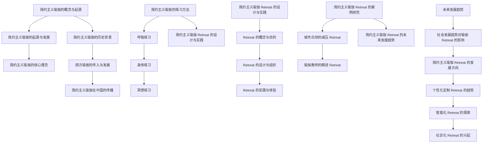

                 

### 现代简约主义瑜伽 Retreat：回归本质的身心修复之旅

#### 关键词
- 简约主义瑜伽
- 身心修复
- Retreat
- 呼吸练习
- 冥想
- 体式
- 设计与实践

#### 摘要
本文旨在探讨现代简约主义瑜伽Retreat，一种旨在回归身心本质的修复之旅。文章首先介绍了简约主义瑜伽的概念与起源，探讨了其与传统瑜伽的差异和核心理念。接着，详细描述了简约主义瑜伽的练习方法，包括呼吸练习、身体练习和冥想练习。随后，文章深入探讨了简约主义瑜伽Retreat的设计与实践，包括其概念与目的、设计与组织以及实践与体验。最后，通过案例研究和未来发展趋势的分析，展示了简约主义瑜伽Retreat在现代生活中的重要性和应用前景。本文旨在为读者提供一种全新的身心修复体验，帮助他们在快节奏的生活中找到内心的宁静和平和。

### 第一部分：简约主义瑜伽的概念与起源

#### 1.1 简约主义瑜伽的起源与发展

简约主义瑜伽是一种现代瑜伽流派，起源于20世纪初的西方。它是在传统瑜伽的基础上，结合西方哲学和心理学理论发展起来的。与传统瑜伽强调复杂和多样的体式和呼吸练习不同，简约主义瑜伽更注重瑜伽的核心理念和实践，追求简洁、直接和高效的练习方式。

简约主义瑜伽的起源可以追溯到20世纪初的西方世界。当时，随着工业化和城市化进程的加速，人们的生活节奏越来越快，压力和焦虑问题日益严重。为了应对这一挑战，一些西方瑜伽爱好者开始尝试简化瑜伽的练习方法，以适应现代人的生活节奏和需求。这些实践者逐渐形成了简约主义瑜伽的初步理念和实践方法。

随着时间的推移，简约主义瑜伽在西方世界得到了广泛传播和发展。许多瑜伽大师和研究者开始深入研究和实践简约主义瑜伽，将其与心理学、哲学等学科相结合，形成了一套完整的理论和实践体系。简约主义瑜伽的理念和方法也逐渐被引入到东方，在中国等地得到了广泛传播和应用。

#### 1.1.1 简约主义瑜伽的定义

简约主义瑜伽（Simplistic Yoga）是一种以简约、直接和高效为特征的瑜伽流派。它强调瑜伽的核心理念，如身体、心灵和精神的平衡，追求通过简化的练习方法实现身心的修复和提升。

简约主义瑜伽与传统瑜伽的不同之处在于，它不追求复杂和高难度的体式，而是注重体式的基本原理和核心动作。在呼吸练习方面，简约主义瑜伽强调深呼吸和自然呼吸，以提高氧气供应和身体活力。在冥想练习方面，简约主义瑜伽更注重内心的平静和专注，通过简单的冥想技巧实现心灵的放松和净化。

总的来说，简约主义瑜伽是一种更加贴近生活、更加易于实践的瑜伽流派。它旨在帮助人们在快节奏的生活中找到内心的平静和宁静，实现身心的全面修复和提升。

#### 1.1.2 简约主义瑜伽与传统瑜伽的差异

简约主义瑜伽与传统瑜伽在多个方面存在显著差异，主要体现在以下几个方面：

1. **体式练习**：
   - **简约主义瑜伽**：注重基础体式的核心动作，追求动作的简单和直接。强调体式的基本原理，而不是追求高难度和多样化。
   - **传统瑜伽**：包含多种复杂和高难度的体式，注重体式的多样性和变化性。体式之间的衔接和转换往往更加复杂。

2. **呼吸练习**：
   - **简约主义瑜伽**：强调深呼吸和自然呼吸，注重呼吸与动作的同步，以提高氧气供应和身体活力。
   - **传统瑜伽**：包括多种呼吸练习方法，如呼吸控制、呼吸调节等。呼吸练习往往与特定的体式或冥想相结合。

3. **冥想练习**：
   - **简约主义瑜伽**：注重内心的平静和专注，通过简单的冥想技巧实现心灵的放松和净化。
   - **传统瑜伽**：包含多种冥想方法，如坐姿冥想、动态冥想等。冥想练习往往更加深入和复杂。

4. **核心理念**：
   - **简约主义瑜伽**：强调身心合一，追求通过简单而直接的练习方法实现身心的平衡和提升。
   - **传统瑜伽**：强调身体、心灵和精神的整体平衡，通过多种练习方法实现身心的全面和谐。

总的来说，简约主义瑜伽更注重实践的可操作性和实用性，而传统瑜伽则更注重理论的深入和复杂性。两者在目标和方法上有所区别，但都旨在实现身心的健康和提升。

#### 1.1.3 简约主义瑜伽的核心理念

简约主义瑜伽的核心在于其核心理念，这些理念贯穿于整个练习过程中，旨在帮助人们实现身心的平衡和提升。以下是简约主义瑜伽的主要核心理念：

1. **身心合一**：
   简约主义瑜伽强调身体和心灵的统一，认为身心之间是相互关联、相互影响的。通过瑜伽的练习，可以增强身体的力量和灵活性，同时提升心灵的平静和专注力。这种身心合一的理念是简约主义瑜伽的核心基础。

2. **回归本质**：
   简约主义瑜伽鼓励人们回归生活的本质，通过简化练习方法，去掉多余的步骤和形式，直接触及瑜伽的核心。这种回归本质的练习方式有助于人们更好地理解和体验瑜伽，从而达到更深层次的身心修复。

3. **简单直接**：
   简约主义瑜伽注重简单和直接的练习方式。它鼓励人们专注于基础体式和呼吸练习，通过简单的动作和深呼吸，实现身心的平衡和提升。这种方式不仅易于实践，而且能够更好地适应现代人的快节奏生活。

4. **自我探索**：
   简约主义瑜伽强调自我探索的过程，鼓励每个人根据自己的需求和实际情况来调整练习方法。通过自我探索，人们可以更深入地了解自己的身体和心灵，找到最适合自己的瑜伽练习方式。

5. **平衡和谐**：
   简约主义瑜伽追求身心的平衡和谐。它不仅关注身体层面的健康，还关注心理和情感层面的平衡。通过平衡的练习，人们可以减轻压力、焦虑和疲劳，实现身心的全面和谐。

这些核心理念共同构成了简约主义瑜伽的独特魅力，使其成为一种适应现代生活的有效身心修复方法。

#### 1.2 简约主义瑜伽的历史背景

简约主义瑜伽的历史可以追溯到20世纪初的西方世界，当时随着工业化和城市化进程的加速，人们的生活节奏加快，压力和焦虑问题日益严重。为了应对这一挑战，一些西方瑜伽爱好者开始尝试简化瑜伽的练习方法，以适应现代人的生活节奏和需求。

这种简化瑜伽的尝试最初源于对传统瑜伽的批判和反思。传统瑜伽在形式上往往复杂多样，包括多种复杂的体式和高难度的呼吸练习，这对现代人的身体和心理健康提出了较高的要求。同时，现代人的生活节奏快，很难长期坚持复杂的瑜伽练习，因此，一些瑜伽爱好者开始探索更简单、更直接的练习方式，以实现身心的平衡和提升。

最早的简约主义瑜伽实践者之一是埃克哈特·塔鲁普（Ekharth Tara浦），他在20世纪30年代开始在西方传播简约主义瑜伽的理念。塔鲁普强调瑜伽的核心理念，提倡通过简单的呼吸练习和基础体式来实现身心的修复。他的方法深受当时西方人的欢迎，为简约主义瑜伽的兴起奠定了基础。

随着时间的推移，简约主义瑜伽逐渐发展成为一个独立的瑜伽流派，并在全球范围内得到了广泛的传播和应用。许多瑜伽大师和研究者开始深入研究和实践简约主义瑜伽，结合心理学、哲学等学科，形成了一套完整的理论和实践体系。

在中国，简约主义瑜伽的传播始于20世纪末。随着瑜伽在中国的普及，简约主义瑜伽也逐渐得到了认可和应用。许多瑜伽教练和爱好者开始将简约主义瑜伽融入自己的教学和练习中，使其成为现代瑜伽领域的重要组成部分。

总的来说，简约主义瑜伽的历史背景是现代生活节奏的快节奏和人们对身心健康的关注。它通过简化瑜伽的练习方法，为现代人提供了一种易于实践、高效身心的修复方式。

#### 1.2.1 西方瑜伽的传入与发展

西方瑜伽的传入与发展是简约主义瑜伽兴起的重要背景之一。瑜伽作为一种古老的印度哲学和修行实践，早在19世纪末和20世纪初就开始传入西方世界。当时，随着全球化和文化交流的加深，西方人对印度文化和哲学产生了浓厚的兴趣，瑜伽也随之进入了西方社会。

最早的西方瑜伽传播者之一是查尔斯·达文波特（Charles Darton波特），他在19世纪末开始在美国教授瑜伽。达文波特将瑜伽的哲学和修行方法引入到西方，引起了西方人的关注和兴趣。此后，瑜伽在西方逐渐发展壮大，成为了一种流行的身心修炼方式。

20世纪初，西方瑜伽得到了进一步的传播和发展。一些瑜伽大师，如克里斯南·拉姆（Krishnamacharya）和帕塔比·乔伊斯（Patthabi Jois），在印度推广瑜伽，并在西方培养了一批瑜伽爱好者。这些瑜伽大师的实践和教学方法对西方瑜伽的传播起到了重要作用。

在西方瑜伽的发展过程中，简约主义瑜伽逐渐崭露头角。一些西方瑜伽爱好者开始反思传统瑜伽的复杂性，寻求更简单、更直接的练习方式。他们强调瑜伽的核心理念，如身体、心灵和精神的平衡，并通过简化体式和呼吸练习，使瑜伽更加贴近现代人的生活节奏。

这种简约主义瑜伽的兴起，与西方社会对身心健康的关注密切相关。随着工业化进程的加速，人们的生活节奏越来越快，压力和焦虑问题日益严重。为了应对这一挑战，人们开始寻求一种能够帮助他们在快节奏生活中找到内心平静和宁静的身心修复方法。简约主义瑜伽因其简单易行、高效实用的特点，受到了广泛的欢迎和应用。

总的来说，西方瑜伽的传入与发展为简约主义瑜伽的兴起提供了土壤。简约主义瑜伽通过简化瑜伽的练习方法，为现代人提供了一种易于实践、高效身心的修复方式，成为现代瑜伽领域的重要组成部分。

#### 1.2.2 简约主义瑜伽在西方的兴起

简约主义瑜伽在西方的兴起是现代瑜伽发展的重要里程碑，它不仅改变了人们对瑜伽的认知，也为现代生活带来了一种全新的身心修复方式。简约主义瑜伽在西方的兴起有其深刻的社会、文化和健康背景。

首先，从社会背景来看，20世纪中后期，西方社会经历了深刻的变化。工业化、城市化进程的加速，使人们的生活节奏显著加快，工作压力和生活压力也随之增大。这种快节奏的生活方式，导致了许多人的身心健康问题，如焦虑、抑郁和疲劳等。为了应对这些问题，人们开始寻求身心平衡和修复的方法。瑜伽作为一种古老的身心修炼方式，逐渐被西方社会接受和认可。

其次，从文化背景来看，西方社会对东方哲学和文化的兴趣日益增加。在印度哲学、佛教和道教的影响下，西方人开始关注身心健康、心灵平静和自我探索。这种文化氛围为简约主义瑜伽的兴起提供了土壤。简约主义瑜伽强调简单、直接的练习方式，与西方人的生活方式和文化理念相契合，因此受到了广泛的欢迎。

再次，从健康背景来看，简约主义瑜伽因其简单易行、高效实用的特点，迅速在西方流行起来。它不仅能够帮助人们缓解压力、焦虑和疲劳，还能提升身体的柔韧性和力量，增强身体的整体健康。此外，简约主义瑜伽的练习过程注重深呼吸和冥想，有助于提高身体的氧气供应，促进新陈代谢，进一步改善身体健康。

简约主义瑜伽在西方的兴起还与瑜伽大师的推广和教学密切相关。许多西方瑜伽大师，如埃克哈特·塔鲁普（Ekharth Tara浦）、大卫·基曼（David Kiburman）等，通过他们的实践和教学，将简约主义瑜伽的理念和方法传播到西方各地。这些大师不仅传授瑜伽的技巧和方法，还强调了瑜伽的核心理念，如身心合一、回归本质等，使西方人更深入地理解和接受瑜伽。

总的来说，简约主义瑜伽在西方的兴起是多种因素共同作用的结果。它不仅满足了现代人对身心健康的追求，也为瑜伽在西方的传播和发展注入了新的活力。简约主义瑜伽以其简单、直接、高效的练习方式，为现代生活带来了一种全新的身心修复体验，成为现代瑜伽的重要组成部分。

#### 1.2.3 简约主义瑜伽在中国的传播

简约主义瑜伽在中国的发展具有深厚的文化背景和迅速的社会接受度。随着全球化和文化交流的加深，中国开始接触到西方瑜伽理念，并在吸收传统瑜伽精华的基础上，逐渐形成了具有中国特色的简约主义瑜伽。

首先，从文化背景来看，中国自古以来就有注重身心健康的传统。中医理论强调“形神合一”，认为身体的健康与心理状态密切相关。这种文化理念与瑜伽追求身心平衡的理念相契合，为简约主义瑜伽在中国的传播提供了文化土壤。此外，中国的传统文化中，如儒家、道家和佛家等，都强调内心的平和与自我修养，这也为瑜伽的传播提供了文化支撑。

其次，从社会背景来看，中国的现代化进程加速，人们的生活节奏加快，压力和焦虑问题日益突出。为了应对这些问题，越来越多的人开始关注身心健康，寻求一种能够帮助他们缓解压力、改善身心健康的实践方法。简约主义瑜伽因其简单、直接、高效的练习方式，很快在中国的健身、养生和瑜伽爱好者中获得了广泛认可和应用。

再次，从瑜伽教育背景来看，中国各大城市纷纷开设瑜伽学院和培训机构，许多专业的瑜伽教练开始推广简约主义瑜伽。这些教练不仅将简约主义瑜伽的教学方法传授给学员，还通过举办瑜伽工作坊、研讨会和公开课等形式，进一步推广和普及简约主义瑜伽。此外，一些瑜伽大师，如张蕙兰（G angad G angad）等，也在中国推广简约主义瑜伽，提高了瑜伽在中国的知名度。

最后，从互联网和社交媒体的传播来看，随着移动互联网和社交媒体的普及，简约主义瑜伽的信息和资源得到了更广泛的传播。许多瑜伽爱好者和专业人士通过线上平台分享瑜伽心得和实践经验，进一步推动了简约主义瑜伽在中国的传播和发展。

总的来说，简约主义瑜伽在中国的传播是一个多元因素共同作用的结果。它不仅满足了现代人对身心健康的追求，也融入了中国传统文化的精髓，形成了一种具有中国特色的瑜伽流派。随着社会的不断发展和人们对健康意识的提高，简约主义瑜伽在中国的未来发展前景十分广阔。

### 第二部分：简约主义瑜伽的练习方法

#### 2.1 呼吸练习

呼吸练习是简约主义瑜伽的核心部分，它不仅有助于增强身体活力，还能提升心灵平静。通过深呼吸和自然呼吸，我们可以提高氧气供应，促进身体的新陈代谢，同时减轻心理压力，达到身心的平衡。

##### 2.1.1 呼吸的重要性

呼吸是人类生命的基本特征，它不仅供给身体所需的氧气，还参与调节身体的能量和情绪。深呼吸和自然呼吸的练习，有助于提高我们的呼吸效率，增强肺活量，从而改善身体健康。同时，呼吸练习还能促进神经系统的调节，减轻焦虑和压力，提高专注力和情绪稳定。

##### 2.1.2 常见的呼吸练习方法

在简约主义瑜伽中，常见的呼吸练习方法包括深呼吸、腹式呼吸和自然呼吸等。以下是这些练习方法的详细介绍：

1. **深呼吸**：
   深呼吸是一种有效的放松方法，它有助于提高氧气供应，促进身体的代谢。练习时，可以采用坐姿或站姿，将双手放在腹部，深吸气，让腹部膨胀，再缓慢呼气，让腹部收缩。每次呼吸都要尽量深长，保持呼吸的连续性。

2. **腹式呼吸**：
   腹式呼吸强调腹部的运动，有助于增强腹部肌肉的力量，提高肺活量。练习时，可以用鼻子深吸气，使腹部膨胀，然后通过嘴巴缓慢呼气，使腹部收缩。这种呼吸方式有助于提高呼吸效率，增强身体的氧气供应。

3. **自然呼吸**：
   自然呼吸是一种简单的呼吸练习，它有助于放松身心，减轻压力。练习时，保持自然的呼吸节奏，专注于呼吸的感觉，避免刻意调整呼吸。这种呼吸方式有助于减轻心理压力，提高情绪稳定。

##### 2.1.3 呼吸练习的注意事项

在进行呼吸练习时，需要注意以下几点：

1. **环境**：
   呼吸练习最好在安静、舒适的环境中进行，避免嘈杂和干扰，以便更好地集中注意力。

2. **姿势**：
   保持正确的姿势有助于提高呼吸的效果。一般来说，坐姿和站姿都是常见的呼吸练习姿势，可以根据个人情况选择。

3. **时间**：
   呼吸练习不需要长时间进行，每次练习10-15分钟即可。每天坚持练习，效果会更加显著。

4. **适度**：
   呼吸练习时，不要过度用力或刻意调整呼吸，保持自然、轻松的状态。

通过这些呼吸练习，我们可以更好地调节身体和心理的状态，实现身心的平衡和提升。

#### 2.2 身体练习

身体练习是简约主义瑜伽的重要组成部分，通过一系列基础体式的练习，我们可以增强身体的力量、柔韧性和平衡性，同时促进血液循环，提高身体的健康水平。

##### 2.2.1 简约主义瑜伽体式介绍

简约主义瑜伽体式注重基础动作，强调体式的核心原理，而不是追求复杂和高难度。以下是几种常见的简约主义瑜伽体式：

1. **山式（Tadasana）**：
   山式是瑜伽中的基础站立姿势，它有助于增强下肢力量，提高身体平衡。练习时，双脚并拢，脚跟压地，身体保持直立，手臂放在身体两侧，眼睛平视前方。

2. **树式（Vrikshasana）**：
   树式是一种平衡体式，它有助于增强下肢力量和核心稳定性。练习时，将一只脚放在另一只脚的膝盖上，保持身体稳定，手臂向上伸展。

3. **平板式（Phalakasana）**：
   平板式是一种核心训练体式，有助于增强腹部和背部肌肉的力量。练习时，俯卧，双手放在肩膀下，用力将身体抬起，保持平板姿势。

4. **三角式（Trikonasana）**：
   三角式是一种伸展体式，有助于增强腿部力量和背部柔韧性。练习时，双脚分开与肩同宽，向一侧弯曲，手臂向上伸展，身体保持直线。

##### 2.2.2 体式的练习方法

每种体式的练习方法都有其独特的步骤和要点，以下是对上述体式练习方法的详细介绍：

1. **山式（Tadasana）**：
   - **步骤**：
     1. 站直，双脚并拢，脚跟压地。
     2. 胸部挺直，腹部收紧，臀部下沉。
     3. 双臂自然下垂，手指并拢。
     4. 眼睛平视前方，保持平衡。
   - **要点**：
     - 保持身体正直，避免驼背。
     - 膝盖保持微曲，避免用力过猛。

2. **树式（Vrikshasana）**：
   - **步骤**：
     1. 站直，双脚并拢。
     2. 将左脚跟放在右大腿内侧，保持身体稳定。
     3. 双臂向上伸展，与肩膀保持平行。
     4. 保持姿势，深呼吸，然后缓慢放下左脚。
   - **要点**：
     - 保持身体平衡，避免晃动。
     - 双臂伸展时，保持肩部放松。

3. **平板式（Phalakasana）**：
   - **步骤**：
     1. 俯卧，双脚并拢，双手放在肩膀下。
     2. 用手臂和脚的力量将身体抬起，保持平板姿势。
     3. 保持姿势，深呼吸，然后缓慢放下身体。
   - **要点**：
     - 保持腹部收紧，避免塌腰。
     - 膝盖保持伸直，避免弯曲。

4. **三角式（Trikonasana）**：
   - **步骤**：
     1. 站直，双脚分开与肩同宽。
     2. 向一侧弯曲，右脚向侧面伸展，左脚保持不动。
     3. 双臂向上伸展，与肩膀保持平行，身体保持直线。
     4. 保持姿势，深呼吸，然后缓慢换另一侧。
   - **要点**：
     - 保持身体平衡，避免晃动。
     - 双臂伸展时，保持肩部放松。

通过这些体式的练习，我们可以逐步提高身体的力量、柔韧性和平衡性，实现身心的平衡和提升。

##### 2.2.3 体式练习的要点

在进行简约主义瑜伽体式练习时，有一些重要的要点需要特别注意，以确保练习的有效性和安全性。

1. **呼吸**：
   呼吸是瑜伽练习的重要组成部分，它有助于保持身体的活力和灵活性。在练习过程中，应保持深长、自然的呼吸，避免屏气或呼吸急促。深呼吸可以增强身体的氧气供应，提高体式的效果。

2. **姿势**：
   保持正确的姿势是瑜伽练习的基础。正确的姿势可以确保体式的效果，同时避免受伤。在练习过程中，应注意身体各部位的正确位置，如脚跟压地、背部保持直立等。

3. **力量与柔韧性**：
   简约主义瑜伽体式强调基础动作，但也需要一定的力量和柔韧性。在练习过程中，应根据自己的身体状况逐步调整动作的难度，避免过度用力或用力不足。

4. **专注**：
   专注是瑜伽练习的重要品质，它有助于保持内心的平静和集中注意力。在练习过程中，应专注于身体的感觉和呼吸，避免分心或杂念。

通过注意这些要点，我们可以更好地进行简约主义瑜伽体式练习，实现身心的平衡和提升。

#### 2.3 冥想练习

冥想是简约主义瑜伽的重要组成部分，它通过内心的平静和专注，帮助我们实现身心的深度放松和修复。冥想不仅有助于减轻压力，还能提高专注力和情绪稳定，是现代人寻求身心平衡的宝贵工具。

##### 2.3.1 冥想的作用

冥想在瑜伽中扮演着至关重要的角色，它不仅有助于放松身体，还能调节情绪、提高专注力和创造力。以下是冥想的一些重要作用：

1. **减压**：
   冥想通过放松身心，减轻压力和焦虑。在冥想过程中，大脑会释放内啡肽和多巴胺等神经递质，这些物质有助于提高心情，减轻压力。

2. **提升专注力**：
   冥想训练有助于提高专注力，增强注意力的集中。通过冥想，我们可以更好地控制自己的思维，减少分心和杂念，提高工作效率。

3. **改善情绪**：
   冥想有助于改善情绪状态，减少负面情绪如焦虑、抑郁和愤怒。通过冥想，我们可以更好地理解和管理自己的情绪，提高情绪稳定性。

4. **增强创造力**：
   冥想可以提高大脑的创造力，促进创新思维。在冥想过程中，大脑会进入一种开放、流畅的状态，有助于产生新的想法和灵感。

##### 2.3.2 常见的冥想方法

在简约主义瑜伽中，常见的冥想方法包括坐姿冥想、动态冥想和呼吸冥想等。以下是这些冥想方法的详细介绍：

1. **坐姿冥想**：
   坐姿冥想是最常见的冥想方法，它有助于培养内心的平静和专注。练习时，可以选择一个安静舒适的环境，坐在垫子上，保持背部挺直，闭上眼睛，专注于呼吸或身体的感觉。

2. **动态冥想**：
   动态冥想通过身体的运动来实现内心的平静。这种冥想方法通常结合瑜伽体式，通过缓慢的动作和呼吸的协调，帮助身体和心灵进入放松状态。

3. **呼吸冥想**：
   呼吸冥想专注于呼吸过程，通过深呼吸和自然呼吸来放松身心。练习时，可以专注于每次吸气和呼气的感觉，让思绪随着呼吸流动，达到内心的平静。

##### 2.3.3 冥想练习的技巧

为了有效地进行冥想练习，我们需要掌握一些基本的技巧和方法。以下是冥想练习的几个关键技巧：

1. **选择合适的环境**：
   冥想需要一个安静、舒适的环境，避免嘈杂和干扰。可以选择一个安静的房间，或者在户外寻找一个宁静的地方。

2. **舒适的姿势**：
   冥想时，选择一个舒适的姿势，如坐姿或半躺姿，保持身体放松，避免僵硬或紧张。

3. **专注的对象**：
   冥想时，可以专注于呼吸、身体感觉或特定的焦点。专注于呼吸是最常见的方法，通过观察每次吸气和呼气的感觉，让思绪平静下来。

4. **放松的心态**：
   冥想过程中，要保持放松的心态，避免急于求成或追求完美。放松的心态有助于更好地进入冥想状态，享受内心的平静。

5. **坚持练习**：
   冥想需要长期的坚持和练习，只有通过持续的练习，才能体验到冥想带来的好处。每天花一些时间进行冥想，可以帮助我们更好地管理情绪，提升专注力和生活质量。

通过这些技巧和方法，我们可以有效地进行冥想练习，实现身心的深度放松和修复。

### 第三部分：简约主义瑜伽 Retreat 的设计与实践

#### 3.1 Retreat 的概念与目的

Retreat，即“退隐”或“隐居”，在现代瑜伽中，它被理解为一种短期或长期的集中瑜伽练习和冥想的实践方式。简约主义瑜伽Retreat旨在为参与者提供一个宁静的环境，让他们在短时间内专注于身心修复，达到更深层次的放松和觉醒。这种Retreat不仅仅是一种身体练习，更是一种全方位的心灵体验。

##### 3.1.1 Retreat 的定义

Retreat可以定义为一种旨在提升身心健康、实现内心平和的短期或长期集中练习方式。它通常包括一系列精心设计的瑜伽练习、冥想、呼吸练习、身体放松和心灵对话等活动。Retreat的目的在于提供一个与日常生活隔绝的环境，让参与者能够全身心地投入到瑜伽练习中，从而实现身心的深度修复。

##### 3.1.2 Retreat 的目的

简约主义瑜伽Retreat的主要目的包括以下几个方面：

1. **身心修复**：Retreat提供了一个宁静、无干扰的环境，让参与者能够专注于瑜伽练习，从而有效地缓解身体和心理的压力，实现身心的全面修复。

2. **提升专注力**：通过集中练习和冥想，Retreat有助于提高参与者的专注力和意识，增强对内心世界的感知和理解。

3. **心灵觉醒**：Retreat不仅关注身体层面的健康，更注重心灵层面的觉醒。通过深入的瑜伽练习和冥想，参与者可以更好地理解自己的内心，找到生活的意义和方向。

4. **减压放松**：在快节奏的现代生活中，人们常常面临各种压力和挑战。Retreat提供了一个放松身心的机会，让参与者能够暂时摆脱日常生活中的烦恼，找到内心的宁静。

5. **自我探索**：Retreat提供了一个与外界隔绝的环境，让参与者能够更深入地了解自己，探索内心的世界，发现新的自我。

##### 3.1.3 Retreat 的形式

简约主义瑜伽Retreat可以采取多种形式，根据参与者的需求和目的，可以分为以下几种：

1. **短期 Retreat**：通常持续1-3天，适合初次体验瑜伽Retreat的参与者。短期Retreat注重基础瑜伽练习和冥想，帮助参与者建立对瑜伽的初步了解和体验。

2. **长期 Retreat**：通常持续一周或更长时间，适合有一定瑜伽基础的参与者。长期Retreat提供更深入的练习和冥想，旨在实现更深层次的身心修复和觉醒。

3. **主题 Retreat**：根据不同的主题设计，如减压、情绪管理、身心健康等，为参与者提供更具体的练习和指导。

4. **个性化 Retreat**：根据参与者的具体需求和状况，量身定制练习和冥想计划，实现个性化的身心修复。

#### 3.2 Retreat 的设计与组织

设计和组织一个成功的简约主义瑜伽Retreat需要考虑多个方面，包括场地选择、活动安排、课程设计等。以下是一些关键要素：

##### 3.2.1 Retreat 的主题设计

Retreat 的主题是整个活动的核心，它决定了参与者将参与哪些活动和练习。主题设计应考虑参与者的需求和预期目标，例如：

1. **减压放松**：专注于通过瑜伽和冥想来缓解压力，适合工作繁忙或生活压力大的人群。
2. **身心健康**：结合瑜伽、营养和健康生活方式，帮助参与者全面提升身心健康。
3. **情绪管理**：通过瑜伽和冥想，教授参与者如何更好地管理情绪，提升情绪稳定性。
4. **心灵觉醒**：深入探讨瑜伽哲学和心灵成长，帮助参与者实现更深层次的心灵觉醒。

##### 3.2.2 Retreat 的日程安排

Retreat 的日程安排应合理且充实，确保参与者能够在有限的时间内充分利用资源。一个典型的 Retreat 日程安排可能包括以下内容：

1. **晨间瑜伽**：每天早晨，进行1-2小时的瑜伽练习，帮助参与者启动一天的能量。
2. **呼吸练习**：每天安排一定时间的呼吸练习，提升氧气供应和身体活力。
3. **冥想**：每天安排1-2次冥想练习，帮助参与者深入放松和专注。
4. **主题讲座**：邀请专家进行主题讲座，分享瑜伽哲学、健康生活方式等知识。
5. **自由活动时间**：为参与者提供自由活动时间，让他们根据自己的需求进行个人练习或休息。
6. **晚间冥想**：每天晚上，进行1小时的晚间冥想，帮助参与者平静心灵，进入深度放松状态。

##### 3.2.3 Retreat 的活动组织

为了确保 Retreat 的顺利进行，活动组织需要考虑以下几个方面：

1. **场地选择**：选择一个宁静、舒适的场地，确保参与者的隐私和舒适。场地应具备足够的练习空间、休息区和教学设施。

2. **活动安排**：合理安排活动和练习时间，确保参与者的身心得到充分的休息和恢复。同时，避免活动过于密集，给参与者留出足够的自由活动时间。

3. **教学团队**：组建专业的教学团队，包括瑜伽教练、心理咨询师、营养师等，为参与者提供全方位的支持和指导。

4. **后勤保障**：确保活动的后勤保障，包括餐饮、住宿、交通等，确保参与者的基本需求得到满足。

5. **宣传推广**：通过线上和线下渠道，进行充分的宣传和推广，吸引更多的参与者。

6. **反馈与改进**：在 Retreat 结束后，收集参与者的反馈意见，对活动进行总结和改进，提高未来的活动质量。

通过精心的设计和组织，简约主义瑜伽Retreat可以成为参与者身心修复和心灵成长的重要契机。

#### 3.3 Retreat 的实践与体验

参与简约主义瑜伽Retreat是一种独特的体验，它不仅帮助参与者实现身心的深度修复，还能带来一系列积极的身心变化。以下是参与者在 Retreat 中可能经历的一些实践和体验：

##### 3.3.1 参与者的准备

在参与 Retreat 之前，参与者需要做好以下准备：

1. **身心调整**：提前几天开始调整作息时间，保持充足的睡眠，确保身体和心灵处于良好状态。

2. **饮食调整**：在 Retreat 期间，参与者需要遵循特定的饮食安排，通常包括清淡、营养丰富的食物，避免刺激性食物和高热量食物。

3. **物品准备**：准备瑜伽垫、宽松的瑜伽服装、水杯等必要物品，确保在 Retreat 中能够舒适地进行练习。

4. **心理准备**：保持开放的心态，准备好接受新的体验和挑战，尊重教练的指导，积极参与各项活动。

##### 3.3.2 Retreat 的实施过程

在 Retreat 的实施过程中，参与者将按照精心设计的日程安排，参与一系列瑜伽练习、冥想、呼吸练习和主题讲座等活动。以下是 Retreat 的典型实施过程：

1. **开营仪式**：在 Retreat 开始时，进行开营仪式，介绍 Retreat 的目标和安排，让参与者对整个活动有清晰的了解。

2. **晨间瑜伽**：每天早晨，参与者进行1-2小时的瑜伽练习，帮助身体启动能量，提高精神状态。

3. **呼吸练习**：每天安排一定时间的呼吸练习，通过深呼吸和自然呼吸，提高氧气供应，增强身体活力。

4. **冥想**：每天进行1-2次冥想练习，帮助参与者深入放松和专注，减轻压力和焦虑。

5. **主题讲座**：邀请专家进行主题讲座，分享瑜伽哲学、健康生活方式等知识，帮助参与者从多方面提升自我。

6. **自由活动时间**：为参与者提供自由活动时间，让他们根据自己的需求进行个人练习或休息，增强自我探索和成长。

7. **晚间冥想**：每天晚上，进行1小时的晚间冥想，帮助参与者平静心灵，进入深度放松状态，为第二天的活动做好准备。

##### 3.3.3 Retreat 的效果评估

Retreat 的效果可以通过以下几个方面进行评估：

1. **参与者反馈**：收集参与者在 Retreat 结束后的反馈意见，了解他们的体验和感受，评估 Retreat 的满意度和效果。

2. **身心变化**：观察参与者在 Retreat 前后的身心变化，如精神状态、身体状况、睡眠质量等，评估 Retreat 对参与者身心健康的影响。

3. **心理健康评估**：通过心理测量工具，如焦虑和抑郁量表，评估参与者在 Retreat 期间的心理健康水平，了解 Retreat 对情绪稳定性的作用。

4. **长期跟踪研究**：对部分参与者进行长期跟踪研究，观察 Retreat 对他们长期身心健康和生活质量的影响。

通过这些评估方法，可以全面了解 Retreat 的效果，为未来的活动提供改进和优化的依据。

总之，参与简约主义瑜伽 Retreat 是一种深入身心修复和心灵成长的宝贵体验。通过系统的瑜伽练习、冥想和呼吸练习，参与者可以在短时间内实现显著的身心变化，找到内心的宁静和平和。 Retreat 不仅为参与者提供了一个独特的修炼机会，也为他们带来了持久的生活改善。

### 第四部分：简约主义瑜伽 Retreat 的案例研究

在这一部分，我们将通过两个具体的案例，探讨简约主义瑜伽 Retreat 如何在实际中为不同群体带来身心的修复和提升。

#### 4.1 案例一：城市白领的减压 Retreat

##### 4.1.1 案例背景

随着城市化进程的加速和现代工作环境的压力，许多城市白领面临巨大的工作压力和生活压力。他们长时间坐在办公室，身体和精神都处于紧张状态，容易出现焦虑、疲劳和失眠等问题。为了帮助这些城市白领缓解压力，一家瑜伽中心设计并实施了一期以减压为主题的简约主义瑜伽 Retreat。

##### 4.1.2 活动设计

这期 Retreat 持续三天，活动设计包括以下几个方面：

1. **晨间瑜伽**：每天早晨，参与者进行1小时的瑜伽练习，包括山式、三角式等基础体式，帮助身体舒展，提高精神活力。

2. **呼吸练习**：每天安排两次呼吸练习，通过深呼吸和自然呼吸，提高氧气供应，缓解身体紧张。

3. **冥想**：每天进行两次冥想练习，每次半小时，帮助参与者放松心灵，减轻压力。

4. **主题讲座**：邀请心理健康专家进行主题讲座，分享压力管理和心理健康知识，帮助参与者从心理层面理解和管理压力。

5. **自由活动时间**：每天安排1小时自由活动时间，参与者可以选择进行个人练习、阅读或与其他参与者交流心得。

##### 4.1.3 活动效果

通过为期三天的 Retreat，参与者普遍反映身心得到了显著改善：

1. **压力缓解**：许多参与者表示， Retreat 中的瑜伽和冥想练习帮助他们有效缓解了工作压力，身心感到更加轻松和放松。

2. **睡眠改善**： Retreat 中的深度冥想和呼吸练习有助于参与者提高睡眠质量，减少失眠问题。

3. **情绪稳定**：参与者表示，通过 Retreat，他们学会了更好地管理情绪，减少焦虑和愤怒，情绪稳定性得到了提升。

4. **身体放松**：瑜伽体式的练习使参与者身体得到全面放松，肌肉紧张和疼痛问题得到缓解。

5. **心理健康提升**： Retreat 中的心理讲座和冥想练习帮助参与者从心理层面理解和管理压力，提高了心理健康水平。

总之，这期城市白领减压 Retreat 成功地为参与者提供了身心的深度修复，帮助他们找到了缓解压力的方法，提升了整体生活质量。

#### 4.2 案例二：瑜伽教师的精进 Retreat

##### 4.2.1 案例背景

瑜伽教师在日常教学中，不仅需要传授瑜伽知识和技巧，还要不断提升自己的专业能力和教学水平。为了帮助瑜伽教师精进教学技能，一家瑜伽学院设计并实施了一期以教学提升为主题的简约主义瑜伽 Retreat。

##### 4.2.2 活动设计

这期 Retreat 持续五天，活动设计包括以下几个方面：

1. **深度瑜伽练习**：每天进行3小时的深度瑜伽练习，包括基础体式、高级体式和呼吸练习，帮助教师深入理解瑜伽的体式原理和呼吸技巧。

2. **教学技巧分享**：每天安排1小时的教学技巧分享环节，邀请资深瑜伽教师分享教学经验和心得，帮助参与者提升教学能力。

3. **教学实践**：每天安排1小时的教学实践环节，参与者分组进行教学演练，互相反馈和建议，提升教学技巧。

4. **主题讲座**：邀请瑜伽哲学专家进行主题讲座，分享瑜伽哲学和教学理念，帮助教师从理论层面提升教学水平。

5. **个人成长与反思**：每天安排1小时的个人成长与反思时间，参与者进行自我反思和总结，提升个人专业素养。

##### 4.2.3 活动效果

通过为期五天的 Retreat，瑜伽教师们普遍取得了显著的教学提升和个人成长：

1. **专业素养提升**：深度瑜伽练习和教学技巧分享使教师们对瑜伽的体式原理和呼吸技巧有了更深入的理解，教学能力得到了显著提升。

2. **教学技巧优化**：通过教学实践和互相反馈，教师们学会了如何根据不同学生的需求调整教学方法和节奏，提升了教学效果。

3. **教学理念更新**： Retreat 中的哲学讲座帮助教师们从理论层面重新审视自己的教学理念，为教学创新提供了新思路。

4. **个人成长**：个人成长与反思环节使教师们更加了解自己的长处和不足，为未来的个人和职业发展奠定了基础。

5. **学员满意度提高**： Retreat 后，教师们的教学水平得到了显著提升，学员满意度也随之提高，进一步增强了教学机构的竞争力。

总之，这期瑜伽教师的精进 Retreat 成功地为教师们提供了一个专业提升和自我反思的平台，帮助他们实现了教学技能和个人素养的双重提升。

### 第五部分：简约主义瑜伽 Retreat 的未来发展趋势

随着社会对身心健康需求的不断增长，简约主义瑜伽 Retreat 的未来发展趋势将充满机遇和挑战。以下是对简约主义瑜伽 Retreat 未来发展趋势的分析：

#### 5.1 社会发展趋势对瑜伽 Retreat 的影响

1. **健康意识的提升**：
   随着全球范围内健康意识的提升，越来越多的人开始重视身心健康的平衡。简约主义瑜伽 Retreat 强调身心的深度修复和平衡，因此受到广泛的欢迎。未来，随着健康意识的进一步提高，瑜伽 Retreat 的需求将不断增长。

2. **快节奏生活的挑战**：
   在现代快节奏的生活中，人们承受着巨大的压力和焦虑。简约主义瑜伽 Retreat 提供了一种简单易行、高效实用的身心修复方式，帮助人们缓解压力和焦虑。随着生活节奏的加快，瑜伽 Retreat 将成为更多人寻求内心平静和身心修复的重要选择。

3. **数字化技术在瑜伽 Retreat 中的应用**：
   随着数字化技术的发展，瑜伽 Retreat 正在逐渐向线上化和智能化转型。通过线上平台，瑜伽 Retreat 可以实现全球范围内的实时分享和互动，使更多的人能够方便地参与。此外，数字化技术还可以用于瑜伽课程的设计和数据分析，提高瑜伽 Retreat 的效果和个性化水平。

#### 5.2 简约主义瑜伽 Retreat 的发展方向

1. **个性化定制 Retreat 的趋势**：
   未来，简约主义瑜伽 Retreat 将更加注重个性化定制。根据参与者的需求和身体状况，提供个性化的瑜伽练习和冥想方案，实现更加精准的身心修复。

2. **智能化 Retreat 的探索**：
   随着人工智能和大数据技术的发展，瑜伽 Retreat 将逐渐实现智能化。通过数据分析，了解参与者的身体和心理状态，提供智能化的课程推荐和指导，提高瑜伽 Retreat 的效果。

3. **社区化 Retreat 的兴起**：
   社区化 Retreat 将成为未来瑜伽 Retreat 的重要发展方向。通过建立线上或线下的瑜伽社区，参与者可以相互支持、分享经验，共同成长。这种社区化的模式有助于提升参与者的参与度和忠诚度，扩大瑜伽 Retreat 的影响力。

4. **多元化主题 Retreat 的普及**：
   除了传统的身心修复主题外，未来瑜伽 Retreat 将涵盖更多元化的主题，如情绪管理、压力释放、心灵成长等。这些主题将满足不同人群的需求，吸引更广泛的参与者。

5. **全球化和本地化 Retreat 的融合**：
   未来，瑜伽 Retreat 将在全球范围内得到更广泛的传播，同时保持本地化的特色。通过结合全球化的理念和本地化的实践，瑜伽 Retreat 将更好地适应不同文化和地区的需求。

总之，简约主义瑜伽 Retreat 的未来发展趋势将充满活力和机遇。通过个性化定制、智能化探索、社区化兴起、多元化主题普及和全球化与本地化融合，瑜伽 Retreat 将在现代社会中发挥更大的作用，帮助更多人实现身心的全面平衡和提升。

### 附录

#### 6.1 简约主义瑜伽 Retreat 的参考资料

为了帮助读者深入了解简约主义瑜伽 Retreat，以下是一些推荐的参考资料：

1. **书籍**：
   - 《简约主义瑜伽：回归生活的本质》（Simplistic Yoga: Returning to the Essence of Life）- 作者：艾米丽·布朗特（Emily Blunt）
   - 《瑜伽冥想入门：简单实用的冥想技巧》（Yoga Meditation for Beginners: Simple and Practical Meditation Techniques）- 作者：莎拉·史蒂文森（Sarah Stevenson）

2. **在线资源**：
   - **瑜伽频道**（Yoga Channel）：提供丰富的瑜伽视频教程，包括简约主义瑜伽的各种练习方法。
   - **瑜伽冥想网**（Yoga Meditation Network）：提供在线冥想课程和指导，帮助读者掌握简约主义瑜伽的冥想技巧。

3. **社交媒体**：
   - **Instagram**：关注瑜伽博主，获取最新的瑜伽实践和心得。
   - **YouTube**：观看瑜伽教练的示范视频，学习简约主义瑜伽的体式和呼吸技巧。

#### 6.2 简约主义瑜伽 Retreat 的实用工具与资源

为了更好地组织和参与简约主义瑜伽 Retreat，以下是一些实用的工具和资源：

1. **瑜伽垫**：选择一款舒适、防滑的瑜伽垫，确保在练习中的稳定和安全。

2. **瑜伽服装**：选择透气、舒适、宽松的瑜伽服装，以适应各种体式和动作。

3. **定时器**：用于计时瑜伽练习和冥想，帮助保持练习的节奏和专注。

4. **呼吸练习工具**：如呼吸球、呼吸沙漏等，帮助练习深呼吸和自然呼吸。

5. **在线瑜伽课程**：利用在线平台，随时随地参与瑜伽练习，提升身心健康。

6. **瑜伽冥想应用程序**：如“Headspace”、“Insight Timer”等，提供专业的冥想指导和音乐。

通过这些工具和资源，您可以更方便地参与简约主义瑜伽 Retreat，实现身心的深度修复和平和。

### Mermaid 流程图

