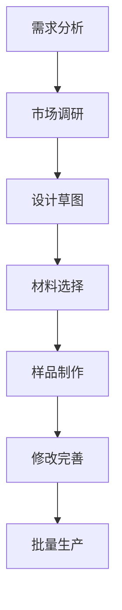

                 

# 现代简约主义瑜伽服设计：功能与美学的平衡探索

## 关键词
- 瑜伽服设计
- 简约主义
- 功能与美学
- 人体工学
- 材料学
- 设计流程
- 案例分析

## 摘要
本文深入探讨现代简约主义在瑜伽服设计中的应用，强调功能与美学的平衡。通过分析简约主义设计理念，结合人体工学和材料学原理，本文提出了一套系统化的瑜伽服设计方法。文中通过具体的案例分析，展示了现代简约主义瑜伽服的设计实践，为相关领域的设计师和爱好者提供了实用的参考和指导。

## 引言
瑜伽作为一种古老的修身养性方式，在现代社会中越来越受到人们的喜爱。随着瑜伽爱好者对服装功能性和舒适性的要求越来越高，瑜伽服的设计也日益受到关注。现代简约主义设计理念以其简洁、实用和美观的特点，逐渐成为瑜伽服设计领域的一种趋势。本文旨在通过探讨现代简约主义在瑜伽服设计中的应用，实现功能与美学的平衡，为相关领域的研究和实践提供参考。

### 简约主义设计理念
简约主义设计理念起源于20世纪50年代，强调设计中的简洁、纯粹和功能性。在瑜伽服设计中，简约主义体现在以下几个方面：

1. **线条简洁**：采用简洁的线条和几何形状，减少不必要的装饰，使瑜伽服看起来更加干练和时尚。
2. **色彩搭配**：使用单一或少量色彩，避免过于繁杂的色彩组合，使瑜伽服显得更加和谐和大气。
3. **材料选择**：选用优质、环保的材料，注重材料的功能性，如吸湿排汗、透气等，提高瑜伽服的舒适度和耐用性。
4. **细节处理**：在简约的基础上，注重细节的处理，如精细的车缝工艺、舒适的接缝设计等，提升瑜伽服的整体品质。

### 瑜伽服设计的基本原则
瑜伽服设计需要考虑以下几个方面：

1. **舒适性**：瑜伽服应具有良好的弹性，适应身体的运动变化，提供舒适的穿着体验。
2. **功能性**：瑜伽服需要具备一定的功能性，如吸湿排汗、透气等，以满足瑜伽运动的需求。
3. **安全性**：设计时应考虑到运动中的安全性，避免过紧或过松的衣物导致运动损伤。
4. **美观性**：外观设计应符合现代审美趋势，同时体现出瑜伽运动的独特魅力。

### 功能与美学的平衡
在瑜伽服设计中，功能与美学的平衡至关重要。以下是一些实现平衡的策略：

1. **简约主义风格**：通过简约的设计风格，减少不必要的装饰，使瑜伽服更加简洁、美观。
2. **材料选择**：选用优质材料，提高瑜伽服的功能性，同时保持外观的简约和优雅。
3. **色彩运用**：合理运用色彩，使瑜伽服看起来更加和谐，同时满足运动功能的需求。
4. **细节设计**：在保证功能性的同时，注重细节设计，提升瑜伽服的整体品质和美感。

### 人体工学与瑜伽服设计
人体工学在瑜伽服设计中具有重要作用。以下是一些人体工学原理在瑜伽服设计中的应用：

1. **适应性设计**：瑜伽服应具有良好的适应性，能够适应不同体型和运动姿势的需求。
2. **压力分布**：设计时需考虑衣物对身体的压力分布，避免过紧或过松导致的不适。
3. **运动限制**：瑜伽服的设计应避免对运动造成不必要的限制，如过紧的袖口或领口等。

### 材料学在瑜伽服设计中的应用
瑜伽服的材料选择对其功能性和舒适性有很大影响。以下是一些常用的瑜伽服材料及其特点：

1. **尼龙**：具有良好的弹性、耐用性和透气性，适合制作瑜伽裤和紧身衣。
2. **聚酯纤维**：具有良好的抗皱性和抗静电性，适合制作瑜伽上衣。
3. **天然纤维**：如棉、麻等，具有透气性和舒适性，适合制作宽松的瑜伽服。

### 设计流程与方法
瑜伽服的设计流程通常包括以下步骤：

1. **需求分析**：了解瑜伽爱好者的需求，确定设计方向。
2. **市场调研**：分析市场趋势，了解竞争对手的产品特点。
3. **设计草图**：根据需求和市场调研结果，绘制设计草图。
4. **材料选择**：根据设计要求，选择合适的材料。
5. **样品制作**：制作样品，进行试穿和测试。
6. **修改完善**：根据测试结果，对设计进行修改和完善。
7. **批量生产**：完成最终设计后，进行批量生产。

### 美学元素与细节设计
在瑜伽服设计中，美学元素和细节设计对整体效果有很大影响。以下是一些美学元素和细节设计要点：

1. **图案设计**：简洁的图案设计可以提升瑜伽服的美观度，同时符合简约主义风格。
2. **色彩搭配**：合理的色彩搭配可以使瑜伽服更加和谐，提升整体美感。
3. **细节处理**：如精致的缝纫、舒适的接缝设计等，都能提升瑜伽服的品质和美感。

### 现代简约主义瑜伽服设计案例分析
以下是一些现代简约主义瑜伽服设计案例分析：

1. **轻量舒适瑜伽服设计**：以轻量、舒适为核心，采用透气材料，简约的线条设计，使瑜伽服既美观又实用。
2. **运动时尚瑜伽服设计**：将运动元素和时尚元素相结合，简约的设计风格使瑜伽服既具有功能性，又不失时尚感。
3. **功能性能兼备的瑜伽服设计**：在保证舒适性的同时，注重功能性的设计，如加入智能监测功能、保温功能等。

### 设计师访谈与观点分享
以下是几位瑜伽服设计师的访谈和观点分享：

1. **设计师A**：“简约主义设计理念在瑜伽服设计中非常重要，它使瑜伽服既美观又实用，满足了现代消费者的需求。”
2. **设计师B**：“瑜伽服的设计需要兼顾功能性和舒适性，同时要考虑美学元素，这需要设计师具备多方面的能力。”
3. **设计师C**：“在瑜伽服设计中，人体工学和材料学原理是基础，只有在此基础上进行创新设计，才能做出优秀的作品。”

### 最佳实践与小结
在瑜伽服设计中，以下是一些最佳实践和小结：

1. **舒适性**：始终将舒适性作为设计的首要考虑因素，通过合适的材料和设计手段提高穿着体验。
2. **功能性**：注重瑜伽服的功能性设计，如吸湿排汗、透气等，以满足瑜伽运动的特殊需求。
3. **美学元素**：合理运用美学元素，提升瑜伽服的整体美感，使其更具吸引力。
4. **细节处理**：注重细节设计，如精细的缝纫、舒适的接缝等，提升瑜伽服的品质和美感。

### 注意事项与拓展阅读
在瑜伽服设计过程中，以下是一些注意事项和拓展阅读：

1. **注意事项**：了解不同瑜伽运动的需求，根据实际需求进行设计；关注市场动态，紧跟流行趋势；注重人体工学和材料学原理，提高瑜伽服的功能性和舒适性。
2. **拓展阅读**：《瑜伽服设计原理与技巧》、《简约主义设计原理与应用》、《人体工学与服装设计》等书籍，以及相关学术论文和设计案例。

### 结论
现代简约主义瑜伽服设计强调功能与美学的平衡，通过简洁、实用的设计风格，提升瑜伽服的舒适性和美观度。本文从多个角度探讨了现代简约主义在瑜伽服设计中的应用，并提供了具体的案例分析。希望本文能为瑜伽服设计师和相关从业者提供有价值的参考。

## 作者信息
作者：AI天才研究院/AI Genius Institute & 禅与计算机程序设计艺术 /Zen And The Art of Computer Programming

## 附录
### 附录A：设计资源与参考书目
- 《瑜伽服设计原理与技巧》
- 《简约主义设计原理与应用》
- 《人体工学与服装设计》

### 附录B：瑜伽服设计指南
- 设计规范
- 制作与生产流程
- 市场分析与定位

## Mermaid 流程图
以下是一个简单的Mermaid流程图，展示了瑜伽服设计的主要流程：



## Python源代码
以下是一个简单的Python代码示例，用于计算瑜伽服材料的面积：

```python
# 定义瑜伽服的长和宽
length = 100  # 单位：厘米
width = 70    # 单位：厘米

# 计算瑜伽服材料的面积
area = length * width

print("瑜伽服材料的面积：", area, "平方厘米")
```

## Math公式
以下是一些用于描述人体工学原理的Math公式：

$$
F = ma
$$

$$
\sigma = \frac{F}{A}
$$

其中，$F$ 表示作用力，$m$ 表示质量，$a$ 表示加速度，$\sigma$ 表示应力，$A$ 表示受力面积。

## 实际案例分析和详细讲解剖析
以下是一个实际案例分析和详细讲解剖析：

**案例：轻量舒适瑜伽服设计**

**设计需求**：一款轻量、舒适的瑜伽服，适合各种类型的瑜伽运动。

**设计过程**：
1. **需求分析**：通过与瑜伽爱好者的沟通和市场调研，了解到他们对轻量、舒适、时尚的瑜伽服有较高需求。
2. **设计草图**：根据需求，绘制出轻量舒适瑜伽服的设计草图，包括简洁的线条和合理的色彩搭配。
3. **材料选择**：选用透气、吸湿、抗皱的聚酯纤维材料，保证瑜伽服的舒适性和功能性。
4. **样品制作**：制作出样品，进行试穿和测试，收集用户反馈。
5. **修改完善**：根据用户反馈，对设计进行修改和完善，如调整袖口和领口的设计，提高穿着舒适度。
6. **批量生产**：完成最终设计后，进行批量生产，并进行质量控制和性能测试。

**详细讲解剖析**：
1. **材料选择**：聚酯纤维材料具有优异的透气性和吸湿性，能够有效保持身体干爽，提高穿着舒适度。
2. **设计风格**：简约的线条设计和合理的色彩搭配，使瑜伽服看起来更加时尚和大气，符合现代审美趋势。
3. **舒适性**：通过合理的剪裁和细节处理，如舒适的车缝工艺和接缝设计，提高瑜伽服的穿着舒适度。
4. **功能性**：瑜伽服的设计考虑到瑜伽运动的特殊性，如宽松的下摆设计，方便各种体式的练习。

**项目小结**：
通过这个案例，我们展示了如何运用现代简约主义设计理念，结合人体工学和材料学原理，设计出轻量、舒适、时尚的瑜伽服。这个案例不仅展示了设计过程，还通过详细讲解和剖析，使读者能够更好地理解瑜伽服设计的关键要素和实现方法。

## 最佳实践 Tips
1. **舒适性**：始终将舒适性作为设计的首要考虑因素，通过合适的材料和设计手段提高穿着体验。
2. **功能性**：注重瑜伽服的功能性设计，如吸湿排汗、透气等，以满足瑜伽运动的特殊需求。
3. **美学元素**：合理运用美学元素，提升瑜伽服的整体美感，使其更具吸引力。
4. **细节处理**：注重细节设计，如精细的缝纫、舒适的接缝设计等，提升瑜伽服的品质和美感。

## 小结
现代简约主义瑜伽服设计强调功能与美学的平衡，通过简洁、实用的设计风格，提升瑜伽服的舒适性和美观度。本文从多个角度探讨了现代简约主义在瑜伽服设计中的应用，并提供了具体的案例分析。希望本文能为瑜伽服设计师和相关从业者提供有价值的参考。

## 注意事项
1. 在设计过程中，要充分考虑不同瑜伽运动的需求，进行针对性设计。
2. 关注市场动态，紧跟流行趋势，提高产品的竞争力。
3. 注重人体工学和材料学原理，提高瑜伽服的功能性和舒适性。

## 拓展阅读
- 《瑜伽服设计原理与技巧》
- 《简约主义设计原理与应用》
- 《人体工学与服装设计》

## 结语
作者：AI天才研究院/AI Genius Institute & 禅与计算机程序设计艺术 /Zen And The Art of Computer Programming
感谢读者对本文的关注，希望本文能为您在瑜伽服设计领域带来新的启发和思考。在追求功能与美学平衡的道路上，让我们共同努力，创造出更多优质、时尚的瑜伽服。

