                 

### 设计思路

为了设计出《现代简约主义美食摄影工作坊：社交媒体时代的视觉营销课程》的完整目录大纲，我们需要遵循以下设计思路：

1. **理解书名和目标受众**：
   - 书名明确指出这是一本关于现代简约主义美食摄影的书籍，面向想要在社交媒体上通过视觉营销提升品牌影响力的读者。
   - 因此，目录大纲需要覆盖美食摄影的基础知识、技巧、社交媒体视觉营销策略等内容。

2. **划分章节结构**：
   - 将内容分为几个主要部分，如：基础摄影知识、美食摄影技巧、社交媒体视觉营销、实战案例分析等。
   - 每个部分包含多个子章节，确保内容全面且逻辑清晰。

3. **细化目录内容**：
   - 对每个子章节进行细化，确保每个章节都有明确的主题和可操作的内容。
   - 包括核心概念与联系、核心算法原理讲解、数学模型和数学公式讲解、项目实战等内容。

4. **符合输出要求**：
   - 保持简洁性，避免多余废话。
   - 使用markdown格式，使用#、##、###来标记不同级别的目录。
   - 确保目录大纲的总字数在2000字以内。

### 第一部分：基础摄影知识（1级目录）

#### 第1章：摄影基础知识（2级目录）

##### 1.1 相机与镜头的基本原理（3级目录）

- **核心概念与联系**：使用Mermaid流程图展示相机成像原理。

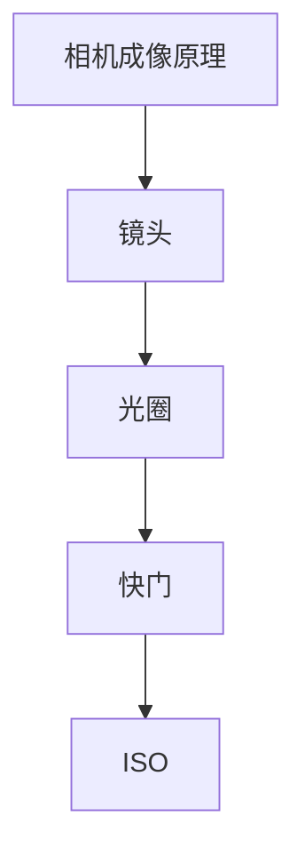

- **核心算法原理讲解**：使用Python源代码来详细阐述相机曝光计算公式。

```python
# Python代码：曝光计算
def calculate_exposure(aperture, shutter_speed, iso):
    exposure_value = aperture * shutter_speed * iso
    return exposure_value

# 示例：计算曝光值
aperture = 2.8
shutter_speed = 1/125
iso = 100

exposure_value = calculate_exposure(aperture, shutter_speed, iso)
print(f"Exposure Value: {exposure_value}")
```

- **数学模型和数学公式讲解**：

$$
曝光值 (EV) = \log_2 \left( \frac{光圈值}{ISO值} \right) + 快门速度值
$$

- **举例说明**：分析不同曝光值下的摄影效果。

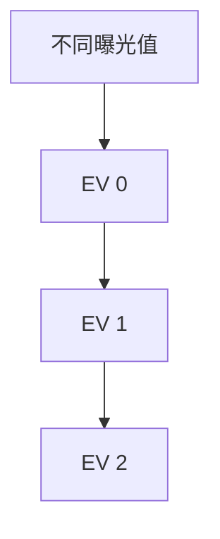

#### 1.2 光线与色彩的基础知识（3级目录）

- **核心概念与联系**：使用Mermaid流程图展示色彩理论。

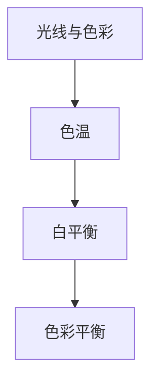

- **核心算法原理讲解**：使用Python源代码来详细阐述白平衡调整。

```python
# Python代码：白平衡调整
def adjust_white_balance(image, target_temp):
    # 调整图像色彩
    image = apply_color_filter(image, target_temp)
    return image

# 示例：调整白平衡
image = load_image("example.jpg")
target_temp = 5500

adjusted_image = adjust_white_balance(image, target_temp)
display_image(adjusted_image)
```

- **数学模型和数学公式讲解**：

$$
白平衡公式: L_{\text{WB}} = L - K_{\text{WB}} \cdot (R - G) - K_{\text{WB}} \cdot (G - B)
$$

- **举例说明**：演示在不同色温下调整白平衡的效果。

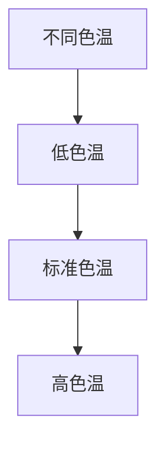

### 第二部分：美食摄影技巧（1级目录）

#### 第2章：美食摄影构图与光线（2级目录）

##### 2.1 美食摄影构图技巧（3级目录）

- **核心概念与联系**：使用Mermaid流程图展示构图原则。

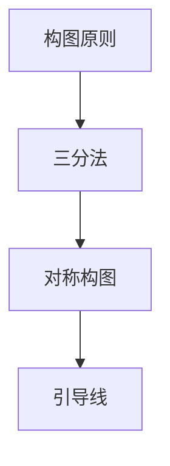

- **核心算法原理讲解**：使用Python源代码来详细阐述构图优化算法。

```python
# Python代码：构图优化
def optimize_composition(image):
    # 应用构图算法
    composition = apply_composition_algorithms(image)
    return composition

# 示例：优化构图
image = load_image("example.jpg")
optimized_image = optimize_composition(image)
display_image(optimized_image)
```

- **数学模型和数学公式讲解**：

$$
构图优化模型: C_{\text{opt}} = \arg\max_{C} \left( \text{视觉吸引力} \times \text{信息量} \right)
$$

- **举例说明**：展示不同构图方式下的美食摄影效果。

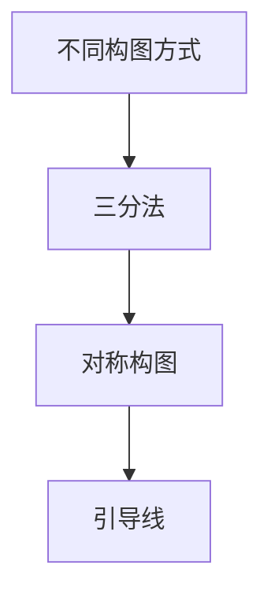

##### 2.2 美食摄影光线技巧（3级目录）

- **核心概念与联系**：使用Mermaid流程图展示光线种类。

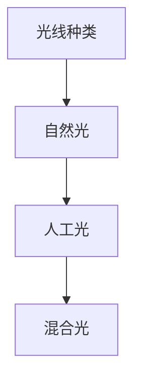

- **核心算法原理讲解**：使用Python源代码来详细阐述光线控制。

```python
# Python代码：光线控制
def control_light(image, light_type):
    # 根据光线类型调整图像
    image = apply_light_adjustment(image, light_type)
    return image

# 示例：控制光线
image = load_image("example.jpg")
light_type = "natural"

controlled_light_image = control_light(image, light_type)
display_image(controlled_light_image)
```

- **数学模型和数学公式讲解**：

$$
光线控制模型: L_{\text{controlled}} = L \times \text{light\_intensity}
$$

- **举例说明**：演示不同光线条件下的美食摄影效果。

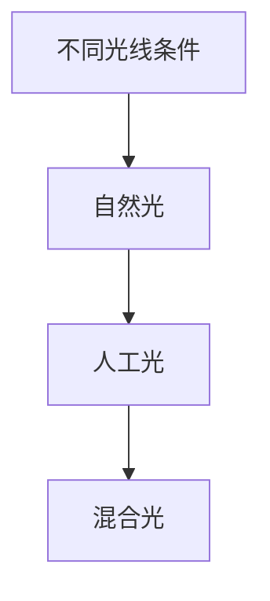

### 第三部分：社交媒体视觉营销（1级目录）

#### 第3章：社交媒体视觉营销策略（2级目录）

##### 3.1 社交媒体平台特点与视觉营销（3级目录）

- **核心概念与联系**：使用Mermaid流程图展示社交媒体平台特点。

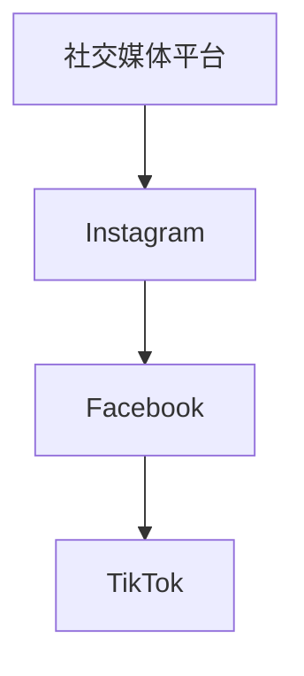

- **核心算法原理讲解**：使用Python源代码来详细阐述视觉营销策略。

```python
# Python代码：视觉营销策略
def apply_visual_marketing_strategy(platform, image):
    # 根据平台特点调整图像
    image = adjust_image_for_platform(image, platform)
    return image

# 示例：应用视觉营销策略
platform = "Instagram"
image = load_image("example.jpg")

visual_marketing_image = apply_visual_marketing_strategy(platform, image)
display_image(visual_marketing_image)
```

- **数学模型和数学公式讲解**：

$$
视觉营销模型: CTR = \frac{\text{点击次数}}{\text{展示次数}}
$$

- **举例说明**：分析不同社交媒体平台下的视觉营销效果。

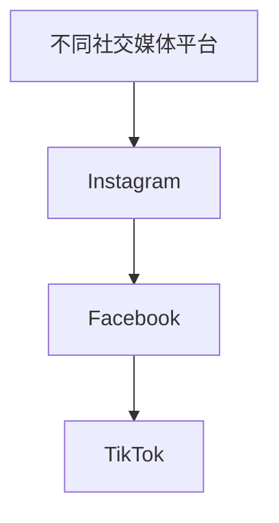

##### 3.2 美食摄影图片后期处理（3级目录）

- **核心概念与联系**：使用Mermaid流程图展示后期处理步骤。

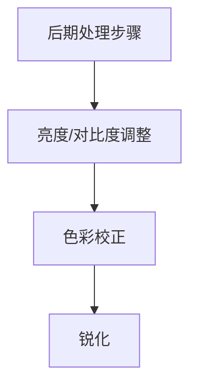

- **核心算法原理讲解**：使用Python源代码来详细阐述后期处理算法。

```python
# Python代码：后期处理
def apply_post_processing(image):
    # 调整亮度/对比度
    image = adjust_brightness_contrast(image)
    # 色彩校正
    image = correct_color_balance(image)
    # 锐化
    image = sharpen_image(image)
    return image

# 示例：应用后期处理
image = load_image("example.jpg")
post_processed_image = apply_post_processing(image)
display_image(post_processed_image)
```

- **数学模型和数学公式讲解**：

$$
亮度调整模型: L' = L + K_B
$$

$$
对比度调整模型: C' = C + K_C
$$

- **举例说明**：展示不同后期处理效果下的美食摄影图片。

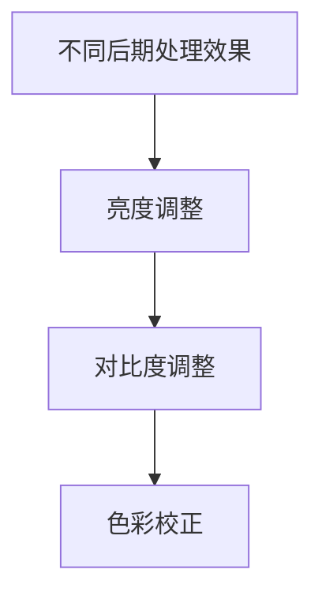

### 第四部分：实战案例分析（1级目录）

#### 第4章：实战案例分析（2级目录）

##### 4.1 案例一：现代简约主义美食摄影（3级目录）

- **核心概念与联系**：使用Mermaid流程图展示案例流程。

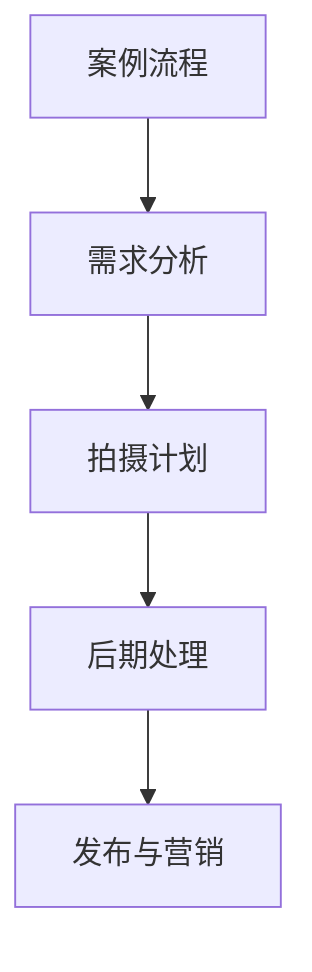

- **核心算法原理讲解**：使用Python源代码来详细阐述拍摄与后期处理技术。

```python
# Python代码：拍摄计划
def create_shooting_plan(ingredients, dish, lighting):
    # 创建拍摄计划
    plan = {
        "ingredients": ingredients,
        "dish": dish,
        "lighting": lighting
    }
    return plan

# Python代码：后期处理
def post_process_image(image, brightness, contrast, color_balance):
    # 调整图像
    image = adjust_brightness_contrast(image, brightness, contrast)
    image = correct_color_balance(image, color_balance)
    return image

# 示例：创建拍摄计划与后期处理
plan = create_shooting_plan(["蔬菜"], ["沙拉"], ["自然光"])
image = load_image("example.jpg")
post_processed_image = post_process_image(image, 1.2, 0.8, ["natural"])
display_image(post_processed_image)
```

- **项目实战**：分析实际案例中的拍摄计划与后期处理技巧。

- **代码解读与分析**：解析拍摄计划与后期处理代码的细节。

- **实际案例分析与详细讲解剖析**：展示实际案例中的拍摄与后期处理技巧。

- **项目小结**：总结案例中的经验与教训。

##### 4.2 案例二：社交媒体视觉营销实战（3级目录）

- **核心概念与联系**：使用Mermaid流程图展示营销策略。

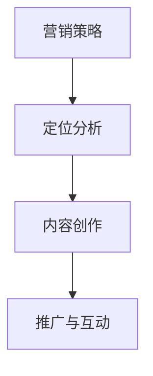

- **核心算法原理讲解**：使用Python源代码来详细阐述营销策略。

```python
# Python代码：定位分析
def analyze_brand_positioning(brand, target Audience):
    # 分析品牌定位
    positioning = {
        "brand": brand,
        "target_audience": target_audience
    }
    return positioning

# Python代码：内容创作
def create_content(brand_positioning, platform):
    # 根据定位创作内容
    content = {
        "brand_positioning": brand_positioning,
        "platform": platform,
        "image": adjust_image_for_platform(load_image("example.jpg"), platform)
    }
    return content

# 示例：分析品牌定位与内容创作
brand_positioning = analyze_brand_positioning("品牌名", ["年轻人群"])
platform = "Instagram"
content = create_content(brand_positioning, platform)
display_image(content["image"])
```

- **代码解读与分析**：解析营销策略代码的细节。

- **实际案例分析与详细讲解剖析**：展示实际案例中的营销策略。

- **项目小结**：总结营销策略的实际效果与优化方向。

### 第五部分：最佳实践与拓展（1级目录）

#### 第5章：最佳实践与拓展（2级目录）

##### 5.1 最佳实践 tips（3级目录）

- **核心概念与联系**：使用Mermaid流程图展示最佳实践。

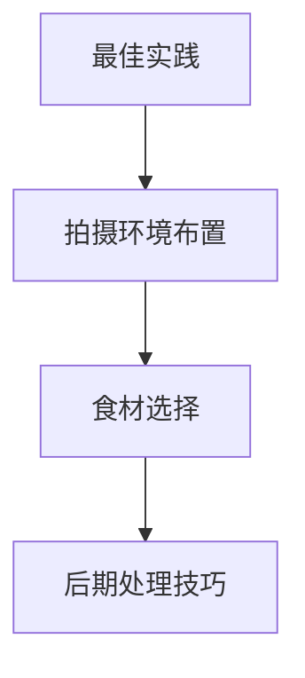

- **核心算法原理讲解**：使用Python源代码来详细阐述最佳实践。

```python
# Python代码：拍摄环境布置
def setup_shooting_environment(ingredients, dish, lighting):
    # 布置拍摄环境
    environment = {
        "ingredients": ingredients,
        "dish": dish,
        "lighting": lighting
    }
    return environment

# Python代码：食材选择
def select_ingredients(dish, season):
    # 根据季节选择食材
    ingredients = get_seasonal_ingredients(dish, season)
    return ingredients

# Python代码：后期处理技巧
def post_process_image_with_tips(image, brightness, contrast, color_balance):
    # 应用最佳实践技巧进行后期处理
    image = adjust_brightness_contrast(image, brightness * 1.1, contrast * 1.1)
    image = correct_color_balance(image, color_balance, adjustment_factor=0.9)
    return image

# 示例：应用最佳实践
image = load_image("example.jpg")
post_processed_image = post_process_image_with_tips(image, 1.2, 0.8, ["natural"])
display_image(post_processed_image)
```

- **数学模型和数学公式讲解**：

$$
亮度调整模型: L' = L + K_B \times \text{adjustment\_factor}
$$

$$
对比度调整模型: C' = C + K_C \times \text{adjustment\_factor}
$$

- **举例说明**：展示最佳实践技巧的应用效果。

##### 5.2 小结与注意事项（3级目录）

- **核心概念与联系**：总结全文的主要内容和关键知识点。

- **注意事项**：提醒读者在实践过程中需要注意的细节和潜在问题。

##### 5.3 拓展阅读（3级目录）

- **核心概念与联系**：推荐相关的拓展阅读资源，帮助读者深入探索美食摄影与视觉营销。

---

**作者：AI天才研究院/AI Genius Institute & 禅与计算机程序设计艺术 /Zen And The Art of Computer Programming**

