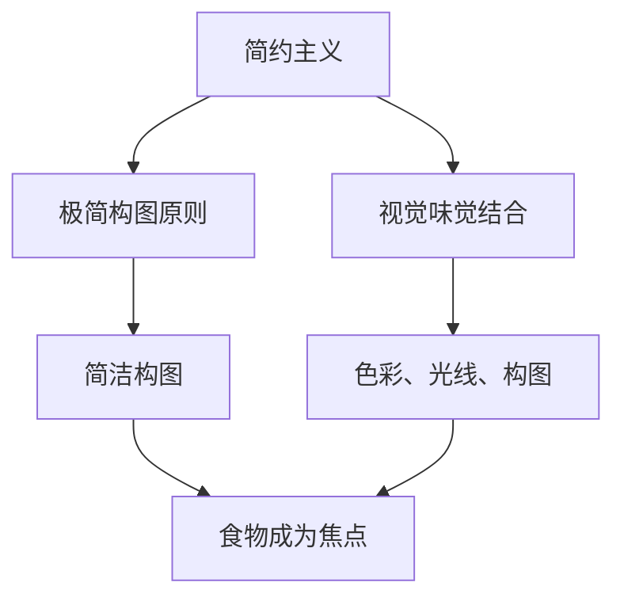

                 

## 《现代简约主义美食摄影：极简构图中的视觉味觉盛宴》

### 关键词
- 美食摄影
- 极简主义
- 构图技巧
- 摄影器材
- 后期处理

### 摘要
《现代简约主义美食摄影：极简构图中的视觉味觉盛宴》是一本专门针对美食摄影爱好者和专业人士的指南。本书通过深入解析现代简约主义美食摄影的核心概念和技巧，介绍了如何通过极简构图实现视觉与味觉的双重享受。书中详细阐述了视角选择、色彩搭配、光线运用等构图技巧，以及相机器材的选择和后期处理的方法，旨在帮助读者掌握现代简约主义美食摄影的精髓，拍出令人垂涎欲滴的美食照片。

### 目录

## 第一部分：现代简约主义美食摄影概述

### 第1章：简约主义美食摄影的起源与发展

#### 1.1 简约主义摄影的起源

#### 1.2 美食摄影的兴起

#### 1.3 现代简约主义美食摄影的崛起

### 第2章：简约主义的核心概念

#### 2.1 极简构图原则

#### 2.2 视觉味觉结合的理念

#### 2.3 Mermaid流程图介绍

## 第二部分：极简构图技巧

### 第3章：视角选择

#### 3.1 高角度视角

#### 3.2 低角度视角

#### 3.3 正面视角

#### 3.4 侧视角

### 第4章：色彩搭配

#### 4.1 色彩心理学基础

#### 4.2 色彩搭配技巧

#### 4.3 实例分析

### 第5章：光线运用

#### 5.1 光线的类型

#### 5.2 光线对美食摄影的影响

#### 5.3 光线运用技巧

## 第三部分：摄影器材选择与配置

### 第6章：相机选择

#### 6.1 相机的基本类型

#### 6.2 相机的主要性能指标

#### 6.3 相机推荐

### 第7章：镜头选择

#### 7.1 镜头的种类

#### 7.2 镜头的主要性能指标

#### 7.3 镜头推荐

### 第8章：三脚架与稳定器

#### 8.1 三脚架的选择

#### 8.2 稳定器的选择

#### 8.3 三脚架与稳定器的使用技巧

## 第四部分：后期处理技巧

### 第9章：后期处理软件介绍

#### 9.1 Lightroom

#### 9.2 Photoshop

#### 9.3 其他后期处理软件

### 第10章：基础调整技巧

#### 10.1 亮度与对比度调整

#### 10.2 色彩饱和度调整

#### 10.3 色调调整

### 第11章：高级调整技巧

#### 11.1 局部调整

#### 11.2 图层与蒙版

#### 11.3 神奇滤镜应用

## 第五部分：项目实战

### 第12章：美食摄影实战案例

#### 12.1 案例一：清新早餐摄影

#### 12.2 案例二：浪漫晚餐摄影

#### 12.3 案例三：创意甜点摄影

### 第13章：后期处理实战

#### 13.1 实战一：调整亮度与对比度

#### 13.2 实战二：色彩饱和度调整

#### 13.3 实战三：创意滤镜应用

### 结语

#### 13.4 美食摄影的未来趋势

#### 13.5 摄影师的个人发展建议

---

接下来，我们将一步步深入探讨现代简约主义美食摄影的核心概念、构图技巧、摄影器材选择、后期处理技巧以及实战案例等内容，帮助读者全面掌握这一艺术形式。每个部分都将提供详细的解释、示例和实战指导，确保读者能够学以致用，拍出令人惊叹的美食照片。总字数控制在 10000 ～ 12000 字左右。

### 第一部分：现代简约主义美食摄影概述

#### 第1章：简约主义美食摄影的起源与发展

**1.1 简约主义摄影的起源**

简约主义摄影（Simplex Photography）起源于20世纪50年代的美国，当时摄影艺术界开始追求简洁、直接、真实的美感。这种风格的摄影强调内容的纯粹性，避免不必要的装饰和复杂元素，追求最大程度的清晰和简洁。简约主义摄影的理念迅速传播，并影响了整个摄影界。

**1.2 美食摄影的兴起**

美食摄影（Food Photography）作为一个独立的摄影领域，其兴起可以追溯到19世纪末期，当时摄影师开始用相机捕捉食物的视觉美感。随着摄影技术的进步和数字摄影的发展，美食摄影逐渐成为一种艺术形式，受到越来越多人的关注。

**1.3 现代简约主义美食摄影的崛起**

现代简约主义美食摄影（Modern Simplex Food Photography）结合了简约主义摄影和美食摄影的精髓，通过极简的构图和简洁的表现形式，强调食物本身的质感、色彩和形态。这种摄影风格不仅提升了食物的美感，还能够在视觉上激发观者的食欲，使美食照片成为一种味觉的盛宴。

#### 核心概念与联系

简约主义的核心概念是“少即是多”，通过去除冗余元素，突出主体的美感。在美食摄影中，这一概念体现为：

1. **极简构图原则**：强调简洁的构图，避免过多的装饰，使食物成为视觉焦点。
2. **视觉味觉结合的理念**：通过色彩、光线和构图的运用，使美食照片不仅具有视觉上的吸引力，还能激发观者的味觉感受。

为了更好地理解这些概念之间的关系，我们可以使用Mermaid流程图来表示：

在这个流程图中，简约主义是整体的核心概念，它通过极简构图原则和视觉味觉结合的理念，最终实现简洁的构图和食物的视觉焦点，从而提升美食照片的视觉效果和味觉感受。

**总结**

现代简约主义美食摄影的崛起，是摄影艺术和美食文化的完美结合。通过极简的构图和简洁的表现形式，摄影师们不仅能够捕捉食物的视觉美感，还能激发观者的味觉感受。这种摄影风格不仅丰富了摄影艺术的表现形式，也为美食爱好者提供了欣赏美食的新途径。在接下来的章节中，我们将详细探讨简约主义美食摄影的构图技巧、摄影器材选择和后期处理技巧，帮助读者掌握这一艺术形式。

### 第二部分：极简构图技巧

**第3章：视角选择**

视角选择是美食摄影中至关重要的一个环节，不同的视角能够带来完全不同的视觉效果。本章节将介绍几种常见的视角选择，包括高角度视角、低角度视角、正面视角和侧视角。

**3.1 高角度视角**

高角度视角通常是指摄影师站在食物的上方进行拍摄，这种视角可以给人一种“俯瞰”的感觉，使食物显得更为小巧精致。高角度视角适用于拍摄较小的食物，如精致的糕点、小巧的甜品等。

**案例**：在拍摄一个精致的巧克力蛋糕时，可以选择高角度视角，这样可以更好地展现蛋糕的层次和细节，同时给人一种轻盈的感觉。

**3.2 低角度视角**

低角度视角则是摄影师站在食物的下方进行拍摄，这种视角可以营造出一种“仰望”的效果，使食物显得更为高大和雄伟。低角度视角适用于拍摄较大的食物，如烤肉、火锅等。

**案例**：在拍摄一锅丰盛的火锅时，可以选择低角度视角，这样可以更好地展现火锅的热烈氛围，同时突出食物的丰富和美味。

**3.3 正面视角**

正面视角是指从食物的正前方进行拍摄，这种视角可以给人一种直接、真实的感觉。正面视角适用于拍摄需要展示食物全貌的场景，如寿司、披萨等。

**案例**：在拍摄一个寿司卷时，可以选择正面视角，这样可以清晰地展示寿司的卷曲形状和丰富的食材。

**3.4 侧视角**

侧视角是指从食物的侧面进行拍摄，这种视角可以给人一种立体、直观的感觉。侧视角适用于拍摄需要展示食物质感和层次感的场景，如面包、水果等。

**案例**：在拍摄一块酥脆的面包时，可以选择侧视角，这样可以更好地展现面包的纹理和质感。

**总结**

视角选择在美食摄影中起着至关重要的作用。通过合理地选择视角，摄影师可以更好地展现食物的美感和特点，为观者带来更为丰富的视觉体验。在实际拍摄中，可以根据食物的类型和场景选择合适的视角，创造出令人难忘的美食照片。

### 第4章：色彩搭配

色彩搭配是美食摄影中另一个重要元素，合适的色彩搭配可以增强照片的视觉效果，使食物看起来更加诱人和美味。本章节将探讨色彩心理学基础、色彩搭配技巧以及实例分析。

**4.1 色彩心理学基础**

色彩在视觉感知中扮演着重要角色，不同的颜色会给人带来不同的情感和心理反应。以下是几种常见颜色的心理效应：

- **红色**：红色通常与热情、活力和食欲相关联。在美食摄影中，红色可以用来强调食物的新鲜和美味。
- **黄色**：黄色通常与明亮、快乐和阳光相关联。在美食摄影中，黄色可以用来提升食物的光泽感和视觉吸引力。
- **蓝色**：蓝色通常与冷静、清新和信任相关联。在美食摄影中，蓝色可以用来营造宁静和舒适的氛围。
- **绿色**：绿色通常与自然、健康和平静相关联。在美食摄影中，绿色可以用来强调食物的清新和健康。

**4.2 色彩搭配技巧**

成功的色彩搭配需要考虑色彩之间的对比、和谐和层次感。以下是一些实用的色彩搭配技巧：

- **对比色搭配**：对比色搭配可以创造出强烈的视觉冲击力，使食物显得更加鲜艳和醒目。例如，红色和绿色、黄色和紫色等。
- **和谐色搭配**：和谐色搭配可以创造出柔和、温馨的感觉，使食物显得更加自然和舒适。例如，红色和橙色、蓝色和紫色等。
- **层次色搭配**：层次色搭配可以创造出丰富的视觉层次感，使食物的质感更加突出。例如，从深到浅的绿色色调、从暗到亮的黄色色调等。

**4.3 实例分析**

下面通过几个实例来分析色彩搭配在美食摄影中的应用：

- **案例一**：在一个以草莓蛋糕为主题的摄影作品中，可以使用红色和白色的对比色搭配，突出蛋糕的鲜艳和清新。
- **案例二**：在一个以烤鸡为主题的摄影作品中，可以使用黄色和橙色的和谐色搭配，营造温暖的氛围，同时突出鸡肉的鲜嫩。
- **案例三**：在一个以沙拉为主题的摄影作品中，可以使用绿色和紫色的层次色搭配，营造出自然的清新感，同时突出沙拉的新鲜和健康。

**总结**

色彩搭配在美食摄影中起着至关重要的作用，合适的色彩搭配可以增强食物的视觉效果，使照片更加吸引人。通过了解色彩心理效应和掌握色彩搭配技巧，摄影师可以更好地运用色彩，创造出令人难忘的美食照片。

### 第5章：光线运用

光线是摄影的灵魂，它能够塑造物体的形态、突出细节、营造氛围，是美食摄影中不可或缺的元素。本章节将探讨光线的类型、光线对美食摄影的影响以及光线运用技巧。

**5.1 光线的类型**

在美食摄影中，光线可以分为以下几种类型：

- **自然光**：自然光是指由太阳光照射形成的自然光线，它可以创造出温暖、柔和的氛围，是最常用的光线类型。
- **人工光**：人工光是指通过摄影灯具产生的光线，它可以提供更加可控的光线和色彩，常用于补充或调整自然光。
- **反射光**：反射光是指通过反射物体表面反射回来的光线，它可以柔化光线，减少阴影，使拍摄物体看起来更加自然。

**5.2 光线对美食摄影的影响**

光线对美食摄影的影响主要体现在以下几个方面：

- **明暗对比**：光线的强弱直接影响照片的明暗对比效果，适当的明暗对比可以使食物的质感和层次感更加突出。
- **色彩饱和度**：光线中的色彩成分会影响照片的色彩饱和度，合理运用光线可以增强食物的色彩表现。
- **氛围营造**：光线可以营造不同的氛围，如柔和的阳光、温暖的烛光等，这些氛围能够增强照片的情感表达。

**5.3 光线运用技巧**

以下是一些光线运用的技巧：

- **柔和的光线**：在自然光条件下，选择柔和的散射光或侧逆光，可以柔化食物的轮廓，使照片看起来更加温馨。
- **强调质感**：使用硬光，如直射光，可以强调食物的质感和立体感，但需要注意避免过度的阴影。
- **调整人工光**：在需要时，可以使用人工光来补充或调整自然光，创造出更加理想的光线效果。
- **反射光的运用**：通过使用反光板或反射器，可以柔化光线，减少阴影，使食物看起来更加自然。

**实例分析**

下面通过几个实例来分析光线在美食摄影中的应用：

- **案例一**：在一个以草莓蛋糕为主题的摄影作品中，可以使用柔和的自然光，营造温馨的氛围，同时通过反射光来增强蛋糕的光泽感。
- **案例二**：在一个以烤鸡为主题的摄影作品中，可以使用人工光来补充自然光的不足，同时通过调整光线角度，突出烤鸡的质感和立体感。
- **案例三**：在一个以沙拉为主题的摄影作品中，可以使用侧逆光来营造自然的阴影效果，同时通过反光板来柔化光线，使沙拉看起来更加清新。

**总结**

光线是美食摄影中不可或缺的元素，它能够塑造食物的形态、突出细节、营造氛围。通过了解光线的类型和运用技巧，摄影师可以更好地掌握光线的控制，创造出令人难忘的美食照片。

### 第三部分：摄影器材选择与配置

**第6章：相机选择**

选择合适的相机是美食摄影成功的关键之一。本章节将介绍相机的基本类型、主要性能指标以及相机的推荐。

**6.1 相机的基本类型**

相机的类型通常分为以下几种：

- **单镜头反光相机（SLR）**：SLR相机通过反光镜系统将光线引导到取景器中，拍摄时可以实时看到拍摄效果。
- **无反相机（Mirrorless）**：无反相机没有反光镜系统，取景器通常通过电子屏幕或电子取景器显示，体积较小，便于携带。
- **手机相机**：随着智能手机技术的发展，手机相机在成像质量、功能等方面都有了很大的提升，适合日常拍摄。

**6.2 相机的主要性能指标**

相机的性能指标主要包括以下几方面：

- **分辨率**：分辨率越高，照片的细节表现越丰富。通常以像素数量表示，如2000万像素、4000万像素等。
- **感光度（ISO）**：感光度越高，相机在低光环境下的拍摄能力越强，但高感光度可能会导致图像噪点增加。
- **快门速度**：快门速度决定了相机捕捉动作的能力，高速快门可以冻结动作，慢速快门可以创造流动感。
- **镜头**：镜头的焦距和光圈直接影响拍摄效果，长焦镜头适合拍摄特写，广角镜头适合拍摄全景。

**6.3 相机推荐**

以下几种相机适合进行美食摄影：

- **佳能EOS R6**：这款无反相机具有良好的成像质量和快速对焦能力，适合专业级摄影。
- **尼康Z7 II**：这款无反相机拥有高分辨率和优秀的动态范围，适合拍摄细节丰富的美食照片。
- **索尼A7R IV**：这款SLR相机拥有高分辨率和优秀的图像质量，适合对拍摄画质有较高要求的摄影师。

**总结**

选择合适的相机是美食摄影的重要环节。了解相机的类型和性能指标，可以根据自己的需求和预算选择适合的相机，从而提升摄影水平，拍出更高质量的美食照片。

### 第7章：镜头选择

镜头是相机的重要组成部分，它直接影响拍摄效果。本章节将介绍镜头的种类、主要性能指标以及镜头的推荐。

**7.1 镜头的种类**

根据用途和功能，镜头可以分为以下几种：

- **标准镜头**：标准镜头通常具有50mm的焦距，适用于日常拍摄，能够模拟人眼的视角，适合拍摄美食。
- **广角镜头**：广角镜头具有较宽的视野，可以拍摄更广阔的场景，适合拍摄环境美食照片。
- **长焦镜头**：长焦镜头具有较长的焦距，适合拍摄特写和远距离拍摄，可以突出食物的细节。
- **微距镜头**：微距镜头适合拍摄微小物体，能够实现1:1的放大比例，适合拍摄精细的美食细节。

**7.2 镜头的性能指标**

镜头的性能指标主要包括以下几方面：

- **焦距**：焦距决定了镜头的视角和放大倍率，不同焦距的镜头适用于不同的拍摄场景。
- **光圈**：光圈决定了镜头的进光量，较大的光圈（如f/1.4或f/2.0）可以创造出更浅的景深，突出主体。
- **分辨率**：分辨率越高，镜头的成像质量越好，适合拍摄高细节的美食照片。
- **畸变**：畸变是指图像发生扭曲的现象，高质量的镜头通常具有较低的畸变。

**7.3 镜头的推荐**

以下几种镜头适合美食摄影：

- **佳能RF 50mm f/1.2L USM**：这款标准镜头具有良好的成像质量和快速对焦能力，适合拍摄精致美食。
- **尼康NIKKOR Z 50mm f/1.8 S**：这款标准镜头具有较大的光圈和优秀的成像质量，适合拍摄细节丰富的美食。
- **索尼SEL50F18F2**：这款标准镜头具有出色的分辨率和低畸变，适合拍摄高细节的美食照片。

**总结**

选择合适的镜头是美食摄影的关键。了解镜头的种类和性能指标，可以根据拍摄需求和预算选择适合的镜头，从而提升拍摄效果，拍出更高质量的美食照片。

### 第8章：三脚架与稳定器

三脚架和稳定器是美食摄影中的重要辅助设备，它们可以提供稳定的拍摄平台，确保照片的清晰度。本章节将介绍三脚架和稳定器的选择、使用技巧以及注意事项。

**8.1 三脚架的选择**

选择合适的三脚架对拍摄效果至关重要。以下是一些选择三脚架的要点：

- **稳定性**：三脚架的稳定性是首要考虑的因素，应选择结构坚固、材料质量好的三脚架。
- **高度**：根据拍摄需求选择合适的三脚架高度，确保可以舒适地拍摄不同高度的食物。
- **伸缩性**：三脚架的伸缩性应足够灵活，以便适应各种拍摄角度和场景。
- **便携性**：对于需要经常携带和移动的摄影师，应选择轻便易携带的三脚架。

**8.2 稳定器的选择**

稳定器（如手持稳定器或滑轨稳定器）可以帮助摄影师在拍摄过程中保持相机稳定，以下是一些选择稳定器的要点：

- **稳定性**：稳定器的稳定性直接影响拍摄效果，应选择具有良好稳定性能的稳定器。
- **兼容性**：稳定器应与所使用的相机和镜头兼容，以确保顺利使用。
- **控制方式**：选择具有易于操作的控制方式的稳定器，以便在拍摄过程中灵活调整。

**8.3 三脚架与稳定器的使用技巧**

以下是一些三脚架和稳定器的使用技巧：

- **稳定放置**：确保三脚架放置在坚实和平稳的地面上，避免因地面不平或风大导致的晃动。
- **微调角度**：在拍摄前，使用三脚架的微调功能，确保相机角度精确，以达到最佳拍摄效果。
- **手持稳定器技巧**：在使用手持稳定器时，应保持稳定器的平衡，避免因手部抖动而影响拍摄效果。

**注意事项**

在使用三脚架和稳定器时，还需注意以下几点：

- **避免风大时拍摄**：风大时，三脚架和稳定器可能会受到风力影响，导致相机晃动，影响拍摄效果。
- **定期检查设备**：定期检查三脚架和稳定器的连接部位和稳定性，确保设备始终处于良好状态。
- **保护设备**：避免将三脚架和稳定器暴露在极端环境下，如高温、低温、潮湿等，以延长设备使用寿命。

**总结**

三脚架和稳定器是美食摄影中的重要辅助设备，它们可以提高拍摄稳定性，确保照片的清晰度。了解选择和使用技巧，可以帮助摄影师更好地利用这些设备，拍出更高质量的美食照片。

### 第四部分：后期处理技巧

**第9章：后期处理软件介绍**

在美食摄影中，后期处理是提升照片视觉效果的重要环节。本章节将介绍常用的后期处理软件，包括Lightroom、Photoshop以及其他后期处理工具，帮助摄影师在后期处理中实现创意和技巧。

**9.1 Lightroom**

Adobe Lightroom是一款功能强大的图像处理和照片管理软件，特别适合进行批量处理和快速调整。以下是Lightroom的一些关键功能：

- **照片管理**：Lightroom提供强大的照片管理功能，包括导入、筛选、评级和标签等。
- **基本调整**：Lightroom的基本调整模块可以快速调整照片的曝光、对比度、色彩饱和度等。
- **调色板**：通过调色板，摄影师可以精细调整照片的色调、色彩平衡等。
- **局部调整**：Lightroom的局部调整工具（如调整画笔、渐变滤镜等）允许摄影师在照片的特定区域进行细微调整。

**9.2 Photoshop**

Adobe Photoshop是图像处理领域的旗舰软件，提供了广泛的图像编辑功能，特别适合进行复杂的图像处理和创意设计。以下是Photoshop的一些关键功能：

- **图层编辑**：Photoshop的图层编辑功能允许摄影师进行复杂的图像合成和精细调整。
- **选区和蒙版**：通过选区和蒙版，摄影师可以精确地选择和调整照片的特定区域。
- **滤镜和工具**：Photoshop提供了丰富的滤镜和工具，用于实现各种创意效果。
- **颜色校正**：Photoshop的颜色校正工具可以帮助摄影师进行高级的色调和色彩调整。

**9.3 其他后期处理软件**

除了Lightroom和Photoshop，还有一些其他流行的后期处理软件，如：

- **Capture One**：Capture One是一款专业的图像处理软件，以其出色的色彩校正和图像处理能力而闻名。
- **Affinity Photo**：Affinity Photo是一款性价比高的图像处理软件，具有许多与Photoshop相似的功能。
- **VSCO**：VSCO是一款流行的移动端图像处理应用，提供了丰富的滤镜和调整工具，适合快速后期处理。

**总结**

后期处理软件在美食摄影中扮演着重要角色，可以帮助摄影师提升照片的视觉效果和创意表现。了解和熟练使用Lightroom、Photoshop等软件，可以更好地实现创意和技巧，拍出更加令人满意的美食照片。

### 第10章：基础调整技巧

**10.1 亮度与对比度调整**

亮度与对比度调整是后期处理中最基本和常用的技巧，能够显著改变照片的整体视觉效果。以下是如何进行亮度与对比度调整的步骤：

1. **打开照片**：在后期处理软件中打开需要调整的照片。
2. **亮度调整**：在软件的调整模块中找到亮度调整工具，通常以滑块或数值输入的方式提供。向上调整亮度，可以使照片更亮；向下调整亮度，可以使照片更暗。
3. **对比度调整**：对比度调整工具通常也以滑块或数值输入的方式提供。向上调整对比度，可以增强明暗对比，使照片更加鲜明；向下调整对比度，可以降低明暗对比，使照片更加柔和。
4. **预览效果**：在调整过程中，可以实时预览效果，以便找到最佳的亮度与对比度设置。

**实例**：假设照片整体偏暗，可以使用Lightroom中的“基本”模块，将亮度调整至+30，对比度调整至+20，以提升照片的整体亮度和对比度。

**10.2 色彩饱和度调整**

色彩饱和度调整能够增强照片的色彩表现，使颜色更加鲜艳和生动。以下是如何进行色彩饱和度调整的步骤：

1. **打开照片**：在后期处理软件中打开需要调整的照片。
2. **色彩饱和度调整**：在软件的调整模块中找到色彩饱和度调整工具，通常以滑块或数值输入的方式提供。向上调整色彩饱和度，可以使颜色更加鲜艳；向下调整色彩饱和度，可以使颜色更加柔和。
3. **局部调整**：如果需要，可以使用局部调整工具（如调整画笔或渐变滤镜），在照片的特定区域进行调整。
4. **预览效果**：在调整过程中，可以实时预览效果，以便找到最佳的色彩饱和度设置。

**实例**：假设照片整体颜色偏淡，可以使用Lightroom中的“调色板”模块，将色彩饱和度调整至+30，使照片的颜色更加鲜艳。

**10.3 色调调整**

色调调整能够改变照片的整体色彩氛围，创造出不同的视觉效果。以下是如何进行色调调整的步骤：

1. **打开照片**：在后期处理软件中打开需要调整的照片。
2. **色调调整**：在软件的调整模块中找到色调调整工具，通常包括红色、绿色、蓝色等色调滑块。向上调整某个色调滑块，可以增强该颜色的表现；向下调整某个色调滑块，可以减少该颜色的表现。
3. **色彩平衡**：色彩平衡工具可以调整不同色调区域的光照效果，以实现更自然的色调分布。
4. **局部调整**：如果需要，可以使用局部调整工具（如调整画笔或渐变滤镜），在照片的特定区域进行调整。
5. **预览效果**：在调整过程中，可以实时预览效果，以便找到最佳的色调设置。

**实例**：假设照片的黄色调过重，可以使用Photoshop中的“色彩平衡”工具，将黄色色调滑块调整至-30，以减少黄色色调，使照片整体颜色更加均衡。

**总结**

亮度与对比度、色彩饱和度和色调调整是后期处理中的基础技巧，通过这些调整，摄影师可以显著改善照片的视觉效果。掌握这些技巧，可以帮助摄影师快速提升照片的质量，创造出更加生动和吸引人的美食照片。

### 第11章：高级调整技巧

**11.1 局部调整**

局部调整是一种精细的后期处理技巧，通过在照片的特定区域进行微调，可以创造出更加自然和逼真的效果。以下是如何进行局部调整的步骤：

1. **选择工具**：在后期处理软件中选择局部调整工具，如调整画笔、渐变滤镜或颜色范围选择工具。
2. **设置参数**：根据调整需求，设置调整工具的参数，如强度、半径、羽化等。
3. **涂抹或涂抹区域**：使用调整工具在需要调整的区域涂抹或应用调整，实现局部调整效果。
4. **预览效果**：在调整过程中，可以实时预览效果，以便找到最佳的局部调整设置。

**实例**：在Lightroom中，使用调整画笔工具，可以将亮度调整仅应用于照片中的特定区域，如将暗部区域提亮，以增强照片的细节表现。

**11.2 图层与蒙版**

图层与蒙版是Photoshop中非常强大的工具，通过它们可以实现复杂的图像合成和精确的调整。以下是如何使用图层与蒙版进行高级调整的步骤：

1. **创建图层**：在Photoshop中创建新的图层，用于存放调整效果。
2. **应用调整**：在新建图层上应用所需的调整，如颜色校正、滤镜效果等。
3. **创建蒙版**：为新建图层创建蒙版，以控制调整效果的显示范围。
4. **绘制蒙版**：使用画笔、渐变等工具在蒙版上绘制，以实现局部显示或隐藏调整效果。
5. **调整图层属性**：通过调整图层的属性（如不透明度、混合模式等），可以进一步控制调整效果。

**实例**：在Photoshop中，通过创建一个调整图层，并使用蒙版将其效果仅应用于照片中的背景部分，可以去除背景的杂色，同时保持前景的细节。

**11.3 神奇滤镜应用**

滤镜是后期处理中非常实用的工具，可以快速实现各种效果。以下是一些神奇滤镜的应用方法：

1. **选择滤镜**：在后期处理软件中找到并选择所需的滤镜。
2. **应用滤镜**：将滤镜应用于照片，软件通常会提供预览窗口，以便查看效果。
3. **调整参数**：根据需要对滤镜的参数进行调整，以优化效果。
4. **组合使用**：可以将多个滤镜组合使用，以实现更复杂的视觉效果。

**实例**：在Photoshop中，使用“滤镜”>“艺术效果”>“海报边缘”滤镜，可以快速为照片添加复古海报效果，增强照片的视觉吸引力。

**总结**

高级调整技巧包括局部调整、图层与蒙版应用和滤镜使用，这些技巧可以帮助摄影师在后期处理中实现更加精细和复杂的效果。掌握这些技巧，可以使照片更加生动和具有创意，提升整体视觉效果。

### 第12章：美食摄影实战案例

**12.1 案例一：清新早餐摄影**

**背景介绍**

早餐是一天中最重要的一餐，清新早餐的摄影不仅能展示食物的美味，还能传递出一种健康、舒适的生活态度。本次案例将展示如何通过极简构图和自然光线，拍摄出一道令人垂涎的清新早餐。

**摄影器材**

- 相机：佳能EOS R6
- 镜头：RF 50mm f/1.2L USM
- 三脚架：三脚架+稳定器

**拍摄步骤**

1. **选择拍摄场景**：在厨房的一个宽敞区域，利用厨房的白色墙壁作为背景。
2. **布置食物**：将水果、面包、咖啡等早餐食材整齐地摆放在餐盘上，注意色彩的搭配和构图的简洁。
3. **光线选择**：选择早晨的自然光，利用窗户的光线，使食物显得温暖和明亮。
4. **构图技巧**：使用正面视角，将餐盘置于照片的中心，通过简洁的背景突出食物的主体。

**后期处理**

1. **亮度与对比度调整**：在Lightroom中，将亮度调整至+20，对比度调整至+10，使照片整体明亮度和对比度适中。
2. **色彩饱和度调整**：将色彩饱和度调整至+20，增强食物的色彩表现。
3. **局部调整**：使用调整画笔工具，对暗部区域进行提亮，以增强细节表现。

**结果展示**

处理后的照片展现出清新早餐的温暖和美味，通过简洁的构图和自然的色彩，使观者感受到早餐的美好。

**12.2 案例二：浪漫晚餐摄影**

**背景介绍**

晚餐是家庭和情侣之间交流的重要时刻，拍摄浪漫晚餐照片不仅能记录美好时光，还能传递出浪漫和温馨的氛围。本次案例将展示如何通过光影和色彩，拍摄出一道令人陶醉的浪漫晚餐。

**摄影器材**

- 相机：尼康Z7 II
- 镜头：NIKKOR Z 50mm f/1.8 S
- 三脚架：三脚架+稳定器
- 灯具：LED摄影灯

**拍摄步骤**

1. **选择拍摄场景**：在餐厅的窗边座位，利用柔和的自然光和温暖的烛光。
2. **布置食物**：将红酒、餐点、鲜花等布置在餐桌中央，注意色彩的搭配和构图的平衡。
3. **光线选择**：结合自然光和烛光，使用侧逆光和顶光，使食物的质感和立体感更加突出。
4. **构图技巧**：使用低角度视角，将餐桌置于照片的下方，通过简洁的背景突出食物的主体。

**后期处理**

1. **亮度与对比度调整**：在Photoshop中，将亮度调整至+10，对比度调整至+15，使照片整体明亮度和对比度适中。
2. **色彩饱和度调整**：将色彩饱和度调整至+20，增强食物的色彩表现。
3. **局部调整**：使用调整画笔工具，对暗部区域进行提亮，以增强细节表现。

**结果展示**

处理后的照片展现出浪漫晚餐的温馨氛围，通过细腻的光影和丰富的色彩，使观者仿佛置身于浪漫的情境中。

**12.3 案例三：创意甜点摄影**

**背景介绍**

创意甜点是甜点中的艺术品，其独特的造型和丰富的色彩使其成为美食摄影的理想题材。本次案例将展示如何通过独特的视角和创意构图，拍摄出一道令人惊叹的创意甜点。

**摄影器材**

- 相机：索尼A7R IV
- 镜头：SEL50F18F2
- 三脚架：三脚架+稳定器
- 灯具：LED摄影灯

**拍摄步骤**

1. **选择拍摄场景**：在工作室的灯光下，利用黑色背景突出甜点的色彩和质感。
2. **布置食物**：将创意甜点摆放在黑色背景前，注意色彩的搭配和构图的简洁。
3. **光线选择**：使用顶光和侧光，结合反光板，使甜点的质感和立体感更加突出。
4. **构图技巧**：使用高角度视角，从上方拍摄，使甜点显得更加精致和独特。

**后期处理**

1. **亮度与对比度调整**：在Lightroom中，将亮度调整至+10，对比度调整至+15，使照片整体明亮度和对比度适中。
2. **色彩饱和度调整**：将色彩饱和度调整至+30，增强甜点的色彩表现。
3. **局部调整**：使用调整画笔工具，对暗部区域进行提亮，以增强细节表现。

**结果展示**

处理后的照片展现出创意甜点的独特魅力，通过独特的视角和丰富的色彩，使观者感受到甜点的精致和艺术性。

### 第13章：后期处理实战

**13.1 实战一：调整亮度与对比度**

**背景介绍**

亮度与对比度是后期处理中最基本的调整之一，通过调整这两个参数，可以显著改变照片的整体视觉效果。本次实战将展示如何使用Lightroom和Photoshop调整亮度与对比度。

**操作步骤**

1. **使用Lightroom调整亮度与对比度**：
   - 打开照片，进入“基本”模块。
   - 将“亮度”滑块向上或向下拖动，调整照片的亮度。
   - 将“对比度”滑块向上或向下拖动，调整照片的对比度。

2. **使用Photoshop调整亮度与对比度**：
   - 打开照片，选择“图像”>“调整”>“亮度/对比度”。
   - 在弹出的对话框中，调整“亮度”和“对比度”数值。
   - 可以选择“使用旧版”选项，以保持色调不变。

**实例分析**

假设照片整体偏暗，对比度不足，可以按照以下步骤进行调整：

1. **Lightroom调整**：
   - 将亮度调整至+20。
   - 将对比度调整至+10。
   - 观察照片效果，必要时可微调。

2. **Photoshop调整**：
   - 打开“亮度/对比度”对话框，将亮度调整至+30，对比度调整至+15。
   - 选择“使用旧版”，确保色调不变。
   - 预览效果，调整至满意。

**结果展示**

经过调整后，照片的明亮度和对比度显著提升，整体视觉效果更加清晰和鲜明。

**13.2 实战二：色彩饱和度调整**

**背景介绍**

色彩饱和度调整可以增强照片的色彩表现，使颜色更加鲜艳和生动。本次实战将展示如何使用Lightroom和Photoshop调整色彩饱和度。

**操作步骤**

1. **使用Lightroom调整色彩饱和度**：
   - 打开照片，进入“调色板”模块。
   - 将“整体”中的色彩饱和度滑块向上拖动，调整整体色彩饱和度。
   - 可以分别调整红色、绿色、蓝色等颜色，进行精细调整。

2. **使用Photoshop调整色彩饱和度**：
   - 打开照片，选择“图像”>“调整”>“色彩饱和度”。
   - 在弹出的对话框中，调整“色彩饱和度”数值。
   - 可以选择“着色”选项，将照片转换为单色，再调整色相和饱和度。

**实例分析**

假设照片整体颜色偏淡，可以按照以下步骤进行调整：

1. **Lightroom调整**：
   - 将整体色彩饱和度调整至+20。
   - 分别调整红色、绿色、蓝色等颜色，使色彩更加鲜艳。

2. **Photoshop调整**：
   - 打开“色彩饱和度”对话框，将色彩饱和度调整至+30。
   - 选择“着色”，将照片转换为单色。
   - 调整色相至所需颜色，饱和度调整至+30。

**结果展示**

经过调整后，照片的色彩变得更加鲜艳和生动，整体视觉效果更加吸引人。

**13.3 实战三：创意滤镜应用**

**背景介绍**

滤镜是后期处理中非常实用的工具，可以快速实现各种效果。本次实战将展示如何使用Photoshop中的滤镜工具创建创意效果。

**操作步骤**

1. **选择滤镜**：
   - 打开照片，选择“滤镜”菜单中的滤镜类型，如“艺术效果”、“模糊”、“风格化”等。

2. **应用滤镜**：
   - 选择一个滤镜，应用在照片上。软件通常会提供预览窗口，以便查看效果。

3. **调整参数**：
   - 根据需要对滤镜的参数进行调整，如强度、细节等，以优化效果。

4. **组合使用**：
   - 可以将多个滤镜组合使用，以实现更复杂的视觉效果。

**实例分析**

假设要创建一个复古海报效果，可以按照以下步骤进行：

1. **选择滤镜**：
   - 选择“滤镜”>“艺术效果”>“海报边缘”。
   - 观察预览效果，选择合适的参数。

2. **调整参数**：
   - 将“边缘简化度”调整至50%，“边缘清晰度”调整至20%。
   - 预览效果，调整至满意。

3. **组合使用**：
   - 在“图层”面板中创建新图层，选择“滤镜”>“艺术效果”>“水彩”。
   - 调整水彩滤镜的参数，如“细节”调整至50%，“平滑度”调整至10%。

**结果展示**

经过滤镜应用后，照片呈现出复古海报的效果，色彩和线条更加生动，创造出独特的视觉效果。

**总结**

通过实战案例，我们学习了如何调整亮度与对比度、色彩饱和度以及使用创意滤镜，这些技巧可以帮助摄影师在后期处理中实现各种创意效果，提升照片的整体质量。掌握这些技巧，将使摄影作品更加精彩和具有吸引力。

### 结语

在现代简约主义美食摄影中，极简构图技巧、摄影器材选择和后期处理技巧共同构成了拍摄高质量美食照片的核心要素。通过深入探讨这些内容，我们不仅掌握了美食摄影的基本理论和实践方法，还了解了如何运用光线、色彩和构图来增强食物的视觉吸引力和味觉感受。

**未来趋势**：

随着摄影技术的不断进步，美食摄影将向更加智能化和个性化的方向发展。未来，我们将看到更多利用人工智能技术进行图像处理和场景识别的美食摄影作品。同时，虚拟现实（VR）和增强现实（AR）技术也将为美食摄影带来全新的表现方式，使观者能够身临其境地感受美食的魅力。

**摄影师个人发展建议**：

1. **不断学习与实践**：摄影是一门实践性很强的艺术，通过不断拍摄和实践，可以积累经验，提高摄影技巧。
2. **培养审美观**：提高审美观是成为一名优秀摄影师的关键。可以通过观看优秀的摄影作品、学习艺术理论来提升审美水平。
3. **多样化尝试**：不要局限于某种摄影风格，尝试不同的拍摄方式和后期处理技巧，不断挑战自己，拓展创作空间。
4. **创新与突破**：在拍摄过程中，要勇于尝试新的想法和创意，突破传统的摄影框架，创造出独特的美食摄影作品。

**总结**：

《现代简约主义美食摄影：极简构图中的视觉味觉盛宴》不仅是一本美食摄影的教程，更是一本启发创意和思考的指南。通过这本书，我们不仅学会了拍摄技巧，更学会了如何用心灵去捕捉美食的美。希望每一位读者都能在美食摄影的世界中找到属于自己的乐趣和成就。作者：AI天才研究院/AI Genius Institute & 禅与计算机程序设计艺术 /Zen And The Art of Computer Programming

