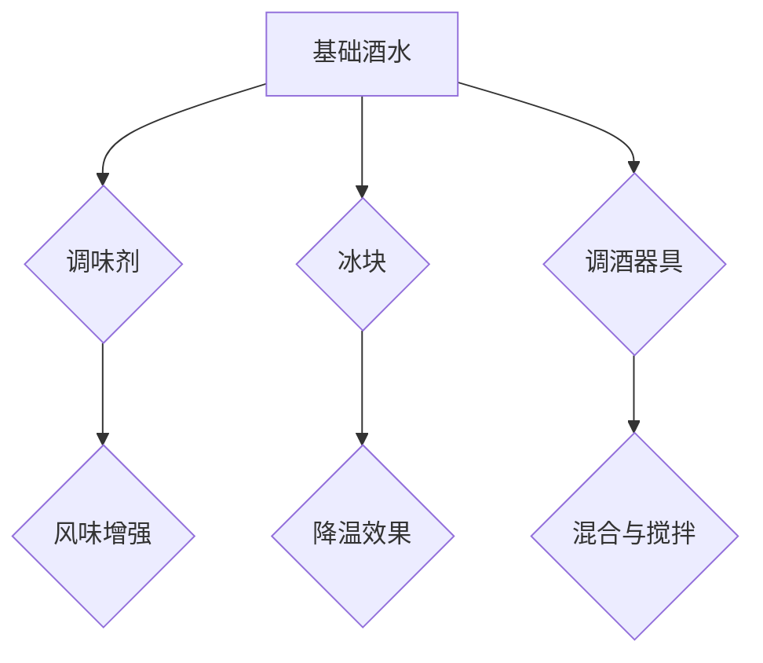

                 

### 第1章：简约主义调酒概述

#### 背景介绍

简约主义调酒，起源于20世纪中叶的美国，是一种追求简约、纯粹和极致口感的调酒艺术。随着现代生活节奏的加快，人们越来越追求高效和便捷，简约主义调酒以其独特的风格和理念，受到了越来越多调酒师和消费者的喜爱。

简约主义调酒的特点是使用较少的酒水和辅助材料，通过精心的配比和调制，创造出丰富多变的口感和风味。这种调酒方式不仅简化了制作流程，提高了效率，也使调酒师能够更专注于酒水的品质和口感。

#### 核心概念与联系

在简约主义调酒中，核心概念包括基础酒水、调味剂、冰块和调酒器具。这些概念之间存在着密切的联系，如图：



**数学模型和公式：**

简约主义调酒中的比例稀释法是一个核心算法，用于计算不同浓度的酒水混合后的最终浓度。公式如下：

$$ C_{\text{final}} = \frac{V_{\text{stock}} \times C_{\text{stock}} + V_{\text{desire}} \times C_{\text{desire}}}{V_{\text{stock}} + V_{\text{desire}}} $$

其中，$C_{\text{final}}$ 是最终浓度，$V_{\text{stock}}$ 和 $C_{\text{stock}}$ 分别是原始酒水的体积和浓度，$V_{\text{desire}}$ 和 $C_{\text{desire}}$ 分别是目标酒水的体积和浓度。

**举例说明：**

假设我们有100毫升浓度为50%的伏特加，需要稀释成浓度为40%的伏特加，目标是500毫升。我们可以使用以下代码来计算：

```python
def calculate_dilution(stock_volume, stock_concentration, desire_volume, desire_concentration):
    final_concentration = (stock_volume * stock_concentration + desire_volume * desire_concentration) / (stock_volume + desire_volume)
    return final_concentration

stock_volume = 100
stock_concentration = 50
desire_volume = 500
desire_concentration = 40

final_concentration = calculate_dilution(stock_volume, stock_concentration, desire_volume, desire_concentration)
print("最终浓度为：", final_concentration)
```

输出结果为：最终浓度为：0.4

### 第2章：基础酒水与工具

#### 基础酒水介绍

简约主义调酒的基础酒水包括伏特加、龙舌兰、金酒、朗姆酒、威士忌等。每种酒水都有其独特的风味和特点，是简约主义调酒不可或缺的组成部分。

**伏特加：** 伏特加是一种来自俄罗斯的烈酒，以其纯净的口感和高品质的伏特加酒体而闻名。它通常被用作基础酒水，用于制作各种经典的简约鸡尾酒，如马天尼和莫斯科骡子。

**龙舌兰：** 龙舌兰酒，也称为龙舌兰酒，是墨西哥的传统酒类。它以其独特的辛辣和柑橘风味而著称，是制作龙舌兰阳光等经典鸡尾酒的关键。

**金酒：** 金酒，又称杜松子酒，是一种以杜松子为特色的水果酒。它通常被用作基础酒水，用于制作各种金酒鸡尾酒，如格林吉和莫吉托。

**朗姆酒：** 朗姆酒是一种以甘蔗汁为原料发酵制成的烈酒。它以其丰富的甜味和香气而闻名，是制作朗姆酒椰林飘香等鸡尾酒的理想选择。

**威士忌：** 威士忌是一种以大麦为主要原料发酵制成的烈酒。它有着独特的麦芽香气和醇厚的口感，是制作苏格兰威士忌和曼哈顿等鸡尾酒的关键。

#### 调酒工具与设备

**调酒器具：** 调酒器具是简约主义调酒的重要工具，包括调酒壶、量杯、摇酒器、滤网、酒瓶等。这些器具的选购和使用对酒水的品质和口感有着重要影响。

**冰块：** 冰块在简约主义调酒中起着降温、稀释和增加口感的作用。使用高质量的冰块可以显著提升鸡尾酒的整体品质。

**调味剂：** 调味剂是简约主义调酒中的重要组成部分，包括糖浆、苦艾酒、果汁、香料等。这些调味剂的种类和比例直接影响鸡尾酒的风味和口感。

#### 基础调酒技巧

**摇酒技巧：** 摇酒是一种将酒液和调味剂充分混合的方法。正确的摇酒技巧可以确保酒液充分融合，口感更加丰富。

**量酒技巧：** 量酒是确保鸡尾酒口感一致的关键。使用量杯准确测量酒液和调味剂的体积，可以确保鸡尾酒的配比准确。

**装饰技巧：** 装饰是提升鸡尾酒视觉效果的重要手段。通过使用水果、坚果、香料等装饰物，可以创造出独特的视觉效果和口感。

### 第3章：简约主义鸡尾酒制作

#### 简约鸡尾酒的基本构成

简约鸡尾酒的基本构成通常包括以下部分：

- **基础酒水：** 基础酒水是简约鸡尾酒的核心，决定了鸡尾酒的基本风味。
- **调味剂：** 调味剂用于增强或改变基础酒水的风味，常见的调味剂包括糖浆、果汁、香料等。
- **冰块：** 冰块用于稀释酒液，降低酒精的烈度，同时增加鸡尾酒的口感。
- **装饰物：** 装饰物用于提升鸡尾酒的外观和口感，常见的装饰物包括水果、坚果、香料等。

#### 简约鸡尾酒的配方设计

简约鸡尾酒的配方设计是一个创意过程，通过不同的基础酒水、调味剂和装饰物的组合，可以创造出丰富多变的口感和风味。以下是一个简单的简约鸡尾酒配方设计示例：

**马天尼：**
- 50毫升干马天尼酒
- 25毫升甜马天尼酒
- 1个柠檬皮

**制作步骤：**
1. 将50毫升干马天尼酒和25毫升甜马天尼酒倒入调酒壶中。
2. 加入适量冰块。
3. 摇匀后倒入马天尼杯中。
4. 用柠檬皮在杯口轻轻擦拭，挤出一些柠檬油。

#### 简约鸡尾酒的调制与品鉴

**调制技巧：**
1. 准确测量酒液和调味剂的体积，确保鸡尾酒的配比准确。
2. 使用高质量的冰块，确保鸡尾酒的口感清凉。
3. 调酒器具的清洗和消毒至关重要，以确保酒水的品质。

**品鉴技巧：**
1. 观察鸡尾酒的外观，如颜色、纹理、泡沫等。
2. 嗅闻鸡尾酒的香气，如酒香、果香、香料香等。
3. 尝试鸡尾酒的口感，如甜度、酸度、苦度、酒精度等。

通过以上调制与品鉴技巧，可以更好地享受简约鸡尾酒带来的美妙体验。

### 第4章：基础味型简约鸡尾酒

基础味型简约鸡尾酒是以单一基础酒水为主，通过少量的调味剂来突出其特色和风味的鸡尾酒。这类鸡尾酒通常结构简单，容易制作，但口感丰富，适合初学者和专业人士。以下是几种基础味型简约鸡尾酒的介绍：

#### 4.1 简约伏特加鸡尾酒

**经典配方：莫斯科骡子**
- 50毫升伏特加
- 1片柠檬

**制作步骤：**
1. 将50毫升伏特加倒入调酒杯中。
2. 加入一片柠檬片。
3. 塞上吸管，即可享用。

**品鉴：**
口感清新，伏特加的香气与柠檬的酸味完美融合，适合夏季饮用。

#### 4.2 简约龙舌兰鸡尾酒

**经典配方：龙舌兰阳光**
- 50毫升龙舌兰酒
- 50毫升橙汁
- 50毫升柠檬汁
- 适量苏打水

**制作步骤：**
1. 将50毫升龙舌兰酒、50毫升橙汁和50毫升柠檬汁混合。
2. 加入适量苏打水。
3. 加入冰块，搅拌均匀。

**品鉴：**
酸甜适中，龙舌兰的辛辣与橙汁和柠檬汁的清新相得益彰，适合聚会时饮用。

#### 4.3 简约金酒鸡尾酒

**经典配方：格陵兰**
- 50毫升金酒
- 25毫升柠檬汁
- 适量苏打水
- 薄荷叶

**制作步骤：**
1. 将50毫升金酒和25毫升柠檬汁混合。
2. 加入适量苏打水。
3. 放入几片薄荷叶，轻轻搅拌。

**品鉴：**
清爽宜人，金酒的清新香气与柠檬汁的酸味相辅相成，适合在炎热的夏天饮用。

#### 4.4 简约朗姆酒鸡尾酒

**经典配方：黑胡椒朗姆**
- 50毫升朗姆酒
- 25毫升黑胡椒糖浆
- 适量苏打水

**制作步骤：**
1. 将50毫升朗姆酒和25毫升黑胡椒糖浆混合。
2. 加入适量苏打水。
3. 加入冰块，搅拌均匀。

**品鉴：**
独特风味，朗姆酒的香甜与黑胡椒糖浆的辛辣相融合，带来别样的口感体验。

#### 4.5 简约威士忌鸡尾酒

**经典配方：曼哈顿**
- 50毫升威士忌
- 25毫升甜马天尼酒
- 1片橄榄

**制作步骤：**
1. 将50毫升威士忌和25毫升甜马天尼酒混合。
2. 加入一片橄榄，轻轻搅拌均匀。

**品鉴：**
口感丰富，威士忌的醇厚与甜马天尼酒的甜味相互衬托，适合在寒冷的冬季饮用。

通过以上基础味型简约鸡尾酒的制作和品鉴，我们可以体验到简约主义调酒的魅力。无论是日常饮品还是社交场合，这些鸡尾酒都能为生活增添一份乐趣。

### 第5章：水果味简约鸡尾酒

水果味简约鸡尾酒以其清新、自然的口感和丰富的色彩，深受人们的喜爱。这类鸡尾酒通常以水果汁或水果糖浆为基础，结合少量的基础酒水和冰块，制作过程简单，但口感和视觉效果却十分出色。以下是几种常见的水果味简约鸡尾酒的介绍。

#### 5.1 简易柑橘类水果鸡尾酒

**经典配方：柠檬苏打**
- 50毫升伏特加
- 25毫升柠檬汁
- 适量苏打水
- 柠檬片

**制作步骤：**
1. 将50毫升伏特加和25毫升柠檬汁倒入调酒杯中。
2. 加入适量苏打水。
3. 放入一片柠檬片，搅拌均匀。

**品鉴：**
口感清爽，柠檬的酸味与伏特加的醇厚完美结合，带有一丝气泡的清新感。

#### 5.2 简易浆果类水果鸡尾酒

**经典配方：草莓甜酒**
- 50毫升朗姆酒
- 25毫升草莓糖浆
- 适量苏打水
- 草莓片

**制作步骤：**
1. 将50毫升朗姆酒和25毫升草莓糖浆倒入调酒杯中。
2. 加入适量苏打水。
3. 放入几片草莓片，轻轻搅拌均匀。

**品鉴：**
草莓的甜味与朗姆酒的醇厚相得益彰，口感丰富，适合夏季饮用。

#### 5.3 简易热带水果鸡尾酒

**经典配方：椰林飘香**
- 50毫升朗姆酒
- 25毫升椰子糖浆
- 适量菠萝汁
- 薄荷叶

**制作步骤：**
1. 将50毫升朗姆酒、25毫升椰子糖浆和适量菠萝汁倒入调酒杯中。
2. 加入薄荷叶，轻轻搅拌均匀。

**品鉴：**
热带水果的香甜气息，朗姆酒的醇厚与菠萝汁的清新完美融合，口感浓郁，适合在炎热的夏季享用。

通过以上水果味简约鸡尾酒的制作和品鉴，我们可以发现，这些鸡尾酒不仅制作简单，而且味道鲜美，非常适合日常饮用或社交场合。无论是喜爱清新口感的人还是热爱热带水果风味的人，都能在这些鸡尾酒中找到自己的最爱。

### 第6章：花卉与草本简约鸡尾酒

花卉与草本简约鸡尾酒以其独特的香气和天然的风味，为简约主义调酒增添了另一层艺术感。这类鸡尾酒通常使用鲜花或草本植物提取物作为调味剂，结合基础酒水和冰块，制作出具有自然清新气息的饮品。以下是几种常见花卉与草本简约鸡尾酒的介绍。

#### 6.1 简约薰衣草鸡尾酒

**经典配方：薰衣草伏特加**
- 50毫升伏特加
- 15毫升薰衣草糖浆
- 适量柠檬汁
- 薰衣草花朵

**制作步骤：**
1. 将50毫升伏特加和15毫升薰衣草糖浆混合。
2. 加入适量柠檬汁。
3. 放入几朵薰衣草花朵，搅拌均匀。

**品鉴：**
薰衣草的香气与伏特加的醇厚相结合，口感独特，带有一丝花香的清新感。

#### 6.2 简约迷迭香鸡尾酒

**经典配方：迷迭香马提尼**
- 50毫升马提尼酒
- 5毫升迷迭香糖浆
- 适量苏打水
- 迷迭香枝

**制作步骤：**
1. 将50毫升马提尼酒和5毫升迷迭香糖浆混合。
2. 加入适量苏打水。
3. 放入一根迷迭香枝，轻轻搅拌。

**品鉴：**
迷迭香的香气与马提尼的口感相得益彰，口感丰富，适合在寒冷的夜晚享用。

#### 6.3 简约薄荷鸡尾酒

**经典配方：薄荷利口酒**
- 50毫升薄荷利口酒
- 25毫升柠檬汁
- 适量苏打水
- 薄荷叶

**制作步骤：**
1. 将50毫升薄荷利口酒和25毫升柠檬汁混合。
2. 加入适量苏打水。
3. 放入几片薄荷叶，轻轻搅拌均匀。

**品鉴：**
薄荷的清新香气与柠檬汁的酸味相结合，口感清爽，适合在炎热的夏天饮用。

通过以上花卉与草本简约鸡尾酒的制作和品鉴，我们可以体验到自然与艺术的完美结合。这些鸡尾酒不仅丰富了简约主义调酒的种类，也为我们的生活增添了更多的乐趣。

### 第7章：创意简约鸡尾酒

创意简约鸡尾酒是简约主义调酒中的亮点，通过巧妙地将不同种类的酒水和调味剂进行组合，创造出独特且令人惊喜的口感和风味。以下是一些创意简约鸡尾酒的配方和制作步骤，供读者尝试。

#### 7.1 奶油利口酒简约鸡尾酒

**经典配方：奶油柠檬**
- 50毫升奶油利口酒
- 25毫升柠檬汁
- 25毫升菠萝汁
- 适量冰块

**制作步骤：**
1. 将50毫升奶油利口酒、25毫升柠檬汁和25毫升菠萝汁倒入调酒杯中。
2. 加入适量冰块。
3. 用长吸管搅拌均匀。

**品鉴：**
奶油利口酒的香甜与柠檬汁和菠萝汁的清新相结合，口感丰富，带有一丝奶香。

#### 7.2 起泡酒简约鸡尾酒

**经典配方：香槟玫瑰**
- 200毫升香槟
- 15毫升玫瑰糖浆
- 适量柠檬片

**制作步骤：**
1. 将200毫升香槟倒入香槟杯中。
2. 加入15毫升玫瑰糖浆。
3. 放入一片柠檬片，轻轻搅拌均匀。

**品鉴：**
香槟的气泡与玫瑰糖浆的香气相得益彰，口感清新，适合庆祝场合饮用。

#### 7.3 烈酒简约鸡尾酒

**经典配方：黑胡椒橙**
- 50毫升黑胡椒利口酒
- 25毫升橙汁
- 适量苏打水

**制作步骤：**
1. 将50毫升黑胡椒利口酒和25毫升橙汁混合。
2. 加入适量苏打水。
3. 加入冰块，搅拌均匀。

**品鉴：**
黑胡椒利口酒的辛辣与橙汁的酸味相结合，口感独特，适合在冬季饮用。

通过以上创意简约鸡尾酒的制作和品鉴，我们可以发现，创意简约鸡尾酒不仅丰富了简约主义调酒的种类，也为我们提供了更多的选择，让我们的调酒技艺更加多样化。

### 第8章：简约鸡尾酒的制作技巧

制作一杯完美的简约鸡尾酒不仅需要准确的配方，还需要精湛的技巧。以下是一些关键的制作技巧，包括调酒师的工具使用与维护、简约鸡尾酒的调味与搅拌技巧，以及简约鸡尾酒的装饰艺术。

#### 调酒师的工具使用与维护

**调酒器具：** 调酒器具是制作鸡尾酒的关键工具。调酒壶、量杯、摇酒器、滤网、酒瓶等器具都需要正确使用和定期维护。

- **调酒壶：** 用于混合酒液和调味剂。使用时应确保盖子紧密，避免酒液泄漏。
- **量杯：** 用于准确测量酒液和调味剂的体积。应保持量杯的清洁，避免影响测量精度。
- **摇酒器：** 用于搅拌酒液。使用前应确保摇酒器内部干燥，避免生锈。
- **滤网：** 用于过滤酒液中的固体颗粒。应定期清洗滤网，保持其清洁。

**冰块：** 冰块在简约鸡尾酒中起着降温、稀释和增加口感的作用。高质量的冰块能够提升鸡尾酒的整体品质。

- **冰块模具：** 用于制作不同形状的冰块，如方冰、球冰等。
- **冰块容器：** 用于存放冰块，保持冰块的低温。

**调味剂：** 调味剂是简约鸡尾酒中的关键成分，包括糖浆、苦艾酒、果汁、香料等。

- **糖浆：** 用于调节甜度，常见的有橙糖浆、柠檬糖浆等。
- **苦艾酒：** 用于增加酒液的苦味，常见的有波城苦艾酒、苦艾酒等。

**调酒器具的维护：** 定期清洗和消毒调酒器具，确保其清洁和卫生。使用后应将器具晾干，避免生锈。

#### 简约鸡尾酒的调味与搅拌技巧

**调味技巧：**
- **精准测量：** 确保调味剂的体积准确，避免影响鸡尾酒的口感。
- **均匀混合：** 使用调酒壶或摇酒器充分搅拌，使调味剂与酒液均匀混合。
- **分层技巧：** 对于需要分层的鸡尾酒，如马提尼，使用滤网小心过滤，使酒液分层清晰。

**搅拌技巧：**
- **快速搅拌：** 使用摇酒器快速搅拌，使酒液充分冷却和混合。
- **均匀搅拌：** 使用调酒壶轻轻搅拌，避免酒液产生气泡。

**调味剂的选择：** 根据鸡尾酒的风味和配方，选择合适的调味剂。例如，柑橘类鸡尾酒适合使用柑橘糖浆，而香料鸡尾酒则适合使用香料糖浆。

#### 简约鸡尾酒的装饰艺术

**装饰技巧：**
- **水果装饰：** 使用新鲜水果，如柠檬片、橙片、草莓等，增加鸡尾酒的美观和口感。
- **坚果装饰：** 使用坚果，如榛子、杏仁等，增加鸡尾酒的质感。
- **香料装饰：** 使用新鲜香料，如迷迭香、薄荷等，增加鸡尾酒的香气。

**装饰物的选择：**
- **色彩搭配：** 根据鸡尾酒的颜色选择装饰物，使整体视觉效果更和谐。
- **装饰物的大小：** 根据鸡尾杯的大小选择装饰物，确保装饰物适合杯子的尺寸。

通过以上制作技巧，调酒师可以制作出完美口感的简约鸡尾酒，为顾客带来愉悦的饮酒体验。

### 第9章：简约鸡尾酒的品鉴与搭配

品鉴和搭配是简约鸡尾酒的重要组成部分，它不仅关乎口感，还涉及视觉和嗅觉的享受。以下是简约鸡尾酒的品鉴方法、与美食的搭配技巧，以及在不同场合下的选择建议。

#### 简约鸡尾酒的品鉴方法

**品鉴步骤：**
1. **外观观察：** 检查鸡尾酒的颜色、透明度、泡沫和分层情况。高质量鸡尾酒的颜色应鲜艳均匀，泡沫应细腻持久。
2. **嗅觉感受：** 嗅闻鸡尾酒的香气，辨别其是否有水果香、酒香、香料香等。优质鸡尾酒的香气应清新且复杂。
3. **口感体验：** 尝试鸡尾酒的口感，注意其甜度、酸度、苦度和酒精度。均衡的口感是优质鸡尾酒的重要特征。
4. **回味感受：** 品尝后，回味其余味和余香，判断其是否持久且令人愉悦。

**品鉴工具：**
- **酒杯：** 选择合适的酒杯，如马天尼杯、香槟杯等，以突出鸡尾酒的风味。
- **品酒勺：** 用于取样和品尝，确保鸡尾酒的纯净口感。

#### 简约鸡尾酒与美食的搭配

**搭配原则：**
- **口味平衡：** 鸡尾酒和美食的口味应相互平衡，避免产生冲突。
- **口感互补：** 鸡尾酒的口感应与美食互补，如清新的鸡尾酒搭配油腻的食物，醇厚的鸡尾酒搭配清淡的食物。

**搭配建议：**
- **早餐：** 清新的柑橘类鸡尾酒搭配水果沙拉或烤面包。
- **午餐：** 中性的柠檬苏打搭配海鲜沙拉或鸡肉沙拉。
- **晚餐：** 醇厚的威士忌鸡尾酒搭配红肉或奶酪。
- **甜品：** 柔和的奶油利口酒鸡尾酒搭配甜点。

#### 不同场合下的简约鸡尾酒选择

**休闲场合：** 在家中或花园派对中，可以选择水果味或花卉味鸡尾酒，如柠檬苏打或薰衣草伏特加，营造轻松愉快的氛围。

**正式场合：** 在商务聚会或正式晚宴中，可以选择经典的简约鸡尾酒，如马提尼或曼哈顿，以展现专业和优雅。

**庆祝场合：** 在生日派对或婚礼庆典中，可以选择起泡酒鸡尾酒，如香槟玫瑰，增加喜庆和浪漫的氛围。

通过以上品鉴方法和搭配技巧，我们可以更好地享受简约鸡尾酒带来的乐趣，为不同的场合选择合适的鸡尾酒，提升整体体验。

### 附录A：简约鸡尾酒制作指南

#### 基础酒水选购

1. **伏特加：** 选择知名品牌，如斯米诺夫或灰雁，确保口感纯净。
2. **龙舌兰酒：** 选择墨西哥产的正宗龙舌兰酒，如轩尼诗或古贝阿。
3. **金酒：** 选择以杜松子为特色的品牌，如健力宝或凯培斯。
4. **朗姆酒：** 选择优质的朗姆酒，如百加得或皇家蓝山。
5. **威士忌：** 选择知名苏格兰或美国威士忌品牌，如杰克丹尼或格兰菲迪。

#### 调味剂选购

1. **糖浆：** 选择高质量的橙糖浆、柠檬糖浆、草莓糖浆等。
2. **香料：** 选择新鲜或高品质的香料，如薄荷、迷迭香、胡椒等。
3. **苦艾酒：** 选择知名品牌，如波城苦艾酒或曼德里尔。

#### 调酒器具选购

1. **调酒壶：** 选择不锈钢或玻璃材质，确保耐用和易清洗。
2. **量杯：** 选择透明、精准的量杯，方便测量和观察。
3. **摇酒器：** 选择多功能、易清洗的摇酒器，确保搅拌均匀。
4. **滤网：** 选择细密、耐用、易清洗的滤网，确保过滤效果。

#### 冰块选购

1. **冰块模具：** 选择不粘、易清洗的冰块模具，如硅胶或塑料材质。
2. **冰块容器：** 选择保温性能好、易清洗的冰块容器，如不锈钢或玻璃材质。

通过以上指南，读者可以轻松选购合适的材料和器具，开始制作自己的简约鸡尾酒。

### 附录B：常见酒水配方大全

以下是几种常见的简约鸡尾酒配方，供读者参考。

**1. 莫吉托**
- 50毫升白朗姆酒
- 25毫升柠檬汁
- 25毫升青柠汁
- 适量薄荷叶
- 冰块适量
- 糖浆适量

**2. 莫克托**
- 50毫升白朗姆酒
- 25毫升蓝橙味美思
- 适量糖浆
- 冰块适量
- 薄荷叶适量

**3. 玛格丽特**
- 50毫升龙舌兰酒
- 25毫升柠檬汁
- 25毫升三重 sec
- 红车厘子适量

**4. 马提尼**
- 50毫升干马天尼酒
- 25毫升甜马天尼酒
- 冰块适量
- 柠檬皮适量

**5. 鸡尾酒**
- 50毫升伏特加
- 25毫升柠檬汁
- 25毫升糖浆
- 冰块适量

通过这些常见酒水配方，读者可以制作出多种多样的简约鸡尾酒，享受调酒带来的乐趣。

### 附录C：简约鸡尾酒制作工具与设备选购指南

#### 基础工具

1. **调酒壶**：选择不锈钢材质，确保耐用和易清洗。容量为500毫升至750毫升为宜。
2. **量杯**：选择透明、精准的量杯，便于测量和观察。标准量杯容量为25毫升、50毫升和75毫升。
3. **摇酒器**：选择多功能、易清洗的摇酒器，确保搅拌均匀。手动和电动摇酒器均可，根据个人喜好选择。

#### 辅助工具

1. **滤网**：选择细密、耐用、易清洗的滤网，确保过滤效果。滤网尺寸应适合酒杯和调酒壶。
2. **冰块模具**：选择不粘、易清洗的冰块模具，如硅胶或塑料材质。常见形状有方形、球形和圆柱形。
3. **冰块容器**：选择保温性能好、易清洗的冰块容器，如不锈钢或玻璃材质。容量应满足日常需求。

#### 高级工具

1. **冰球模具**：制作圆形或异形冰球，提升鸡尾酒视觉效果。高级冰球模具通常为不锈钢或硅胶材质。
2. **果汁机**：用于快速提取新鲜果汁，增加鸡尾酒的口感和香气。选择功率大、易清洗的果汁机。
3. **搅拌器**：用于制作奶昔、奶泡等鸡尾酒，提升制作效率和口感。选择多功能、易清洗的搅拌器。

#### 注意事项

1. **材质**：选择食品级材料，确保工具的安全性和卫生性。
2. **品牌**：选择知名品牌，确保产品质量和售后服务。
3. **易用性**：选择易于清洗和维护的工具，减少使用中的不便。

通过以上选购指南，读者可以选购到合适的简约鸡尾酒制作工具与设备，提升调酒体验。

